# Architecture Spec: Configurable Steering Smoothing Profiles and High Speed Turning Authority 🏎️🎛️

A formal engineering, physics, and input architecture specification eliminating severe high-speed turning limitations under keyboard controls while providing player-configurable steering responsiveness profiles.

---

## 🗺️ Current vs. Proposed System Architecture

### 1. Current Architecture & Bottleneck Diagnosis

Following the introduction of digital input smoothing, telemetry isolation, and caster jacking, players operating vehicles at high speed reported that turning authority was severely limited, preventing vehicles from executing high-speed chicanes, hairpins, and sharp overtaking maneuvers.

Two compounding bottlenecks were identified:
1. **Double-Layer Speed Attenuation**:
   - **Input Filter (`DigitalInputFilter`)**: Attenuated raw digital steering by `speed_scale = (1.0 / (1.0 + speed * 0.018)).max(0.38)`. At $25\,\text{m/s}$ (~90 km/h), this clamped steering to at most 38–58% of lock.
   - **Physics Model (`wheelbase/src/car.rs`)**: For vehicles with caster jacking (such as racing karts), `speed_factor` enforced an artificial floor of `.max(0.025)`. At $25\,\text{m/s}$, this divided steering angle by $1.54$ ($\times 0.65$).
   - **Compound Choke**: Maximum effective steer angle at speed was limited to $0.38 \times 0.65 \approx 0.247$ (< 25% of total lock), rendering the vehicle practically unresponsive to steering inputs.
2. **Lack of Dynamic Hold Authority**:
   - The filter applied identical speed attenuation regardless of whether the player tapped a key for straightaway micro-adjustments or held it continuously down to commit to a tight corner.

```mermaid
flowchart TD
    subgraph Current ["Current Double-Choked Architecture"]
        K1["Raw Key Press (±1.0)"] --> F1["DigitalInputFilter: Hard Floor 0.38 & Speed Factor 0.018"]
        F1 -->|"Capped at <= 0.38"| C1["wheelbase::Car: Caster Jacking .max(0.025) Floor"]
        C1 -->|"Divided by 1.54"| OUT1["Effective Steer Angle < 25% Full Lock (Choked)"]
    end

    subgraph Proposed ["Proposed Unified Architecture"]
        PK1["Raw Key Press (±1.0)"] --> PF1["DigitalInputFilter with Progressive Hold-Lock Bleed"]
        PF1 -->|"Tap: Softened | Hold: Bleeds to 1.0 Full Lock"| PC1["wheelbase::Car: Calibrated Vehicle Attenuation (No .max(0.025) Floor)"]
        PC1 --> OUT2["Full Turning Authority Available on Demand"]
        PUI["Controls UI & config.toml"] -->|"Direct / Balanced / Smooth"| PF1
    end
```

### 2. Proposed Architecture

1. **Core Data & Physics Alignment**:
   - Remove the hardcoded `.max(0.025)` floor in `crates/wheelbase/src/car.rs`, allowing the calibrated vehicle parameter `speed_sensitive_steer_factor` ($0.0014$) to govern smoothly.
   - Update baseline defaults in `[input]` in `config.toml` and `crates/tdrace-app/src/config.rs`: `speed_sensitive_factor = 0.004` and `min_speed_steer_limit = 0.75`.
2. **Progressive Hold-Lock Bleed (`DigitalInputFilter`)**:
   - Add `hold_bleed_rate: f32` to `DigitalInputConfig` and `hold_time: f32` to `DigitalInputFilter`.
   - When a turn key is held down continuously, `hold_time` accumulates. Over ~0.3s, `hold_factor` smoothly bleeds `speed_scale` towards `1.0`:
     $$\text{effective\_scale} = (1.0 - h) \cdot \text{speed\_scale} + h \cdot 1.0$$
   - Key release or direction reversals immediately reset `hold_time` to zero.
3. **Player-Configurable Steering Profiles (`SteeringProfile`)**:
   - Define three distinct, selectable presets:
     - **Direct**: Minimal smoothing (`exponent: 1.0`, zero speed attenuation, instantaneous lock).
     - **Balanced (Default)**: Subtle smoothing with progressive hold bleed (`exponent: 1.25`, `speed_factor: 0.004`, `min_limit: 0.75`, `hold_bleed: 2.5`).
     - **Smooth**: Relaxed arcade stabilization (`exponent: 1.40`, `speed_factor: 0.008`, `min_limit: 0.60`, `hold_bleed: 1.5`).
   - Expose the active profile in `[input]` in `config.toml`, allow cycling in `GameState::ControlsHelp`, and render the active profile clearly on the Controls screen.

---

## 🗄️ Database & Storage Migration Plan

- **Configuration Backward Compatibility**:
  - `config.toml` maintains all existing `[input]` keys while adding `steering_profile = "balanced"`.
  - Serde default deserialization ensures older `config.toml` files missing `steering_profile` or `hold_bleed_rate` fall back cleanly to `SteeringProfile::Balanced` with zero panic or data corruption.
- **Zero-downtime Migration**:
  - No database migration or persistent storage format changes are required.

---

## 🔑 Security, Compliance, & IAM Roles

- Input processing occurs strictly locally in client memory with zero network or privileged filesystem operations.
- Gamepad analog input bypasses digital key smoothing entirely, ensuring hardware analog axes remain unmodified.

---

## 🛡️ Disaster Recovery, Monitoring, & Fallbacks

- **Rollback steps**:
  - Reset `config.toml` `[input]` block to baseline defaults if custom tuning produces undesired handling.
- **Diagnostics & Metrics**:
  - Automated integration tests verify that high-speed turning radius under sustained key hold matches low-speed geometric turning capabilities.

---

## 🧪 Verification & Acceptance Criteria

### Automated Tests
- Command to validate specification OKF compliance: `keel validate`
- Command to verify progressive hold-lock bleed and profiles: `cargo test -p tdrace-app --test input_smoothing_tests`
- Command to verify kart cornering turning authority at speed: `cargo test -p tdrace-app --test kart_steering_stability_tests`

### Manual Acceptance Criteria (Pseudo-Gherkin)

- **Scenario: Sustained keyboard hold achieves full steering authority at high speed**
  - [ ] **Given** a vehicle traveling at high forward speed ($v \ge 25\,\text{m/s}$ ~ $90\,\text{km/h}$)
  - [ ] **When** the driver holds full steering lock for $> 0.35\,\text{seconds}$
  - [ ] **Then** the filtered steering output must reach $\ge 0.95$ (full lock)
  - [ ] **And** turning authority must not be clamped to a restrictive floor $< 0.75$

- **Scenario: Steering profile cycling in Controls screen**
  - [ ] **Given** the player is viewing the Controls & Driving Assists screen
  - [ ] **When** the player activates the steering profile toggle command
  - [ ] **Then** the active profile must cycle through `Balanced -> Smooth -> Direct -> Balanced`
  - [ ] **And** the updated configuration must take effect immediately on vehicle handling

- **Scenario: Caster jacking vehicle turning alignment**
  - [ ] **Given** a competition kart with `caster_jacking_factor > 0.0`
  - [ ] **When** turning at $25\,\text{m/s}$ under full throttle
  - [ ] **Then** wheelbase `speed_factor` must not enforce a hardcoded 0.025 multiplier
  - [ ] **And** turning lateral acceleration must exceed $12.0\,\text{m/s}^2$ on asphalt

---

## 🔗 Traceability & Codebase Mapping

| Action | Path | Description |
| :--- | :--- | :--- |
| `[NEW]` | `specs/039_configurable_steering_smoothing_profiles_and_high_speed_turning_authority.md` | Formal architecture specification contract. |
| `[MODIFY]` | `specs/index.md` | Catalog registration under Technical Specifications. |
| `[MODIFY]` | `specs/constitution/ROADMAP.md` | Milestone tracking under Phase 6. |
| `[MODIFY]` | `crates/cabinet/src/input/filter.rs` | Add `hold_bleed_rate`, progressive hold-lock bleed, and `SteeringProfile` enum. |
| `[MODIFY]` | `crates/wheelbase/src/car.rs` | Remove `.max(0.025)` floor in speed-sensitive steering calculation. |
| `[MODIFY]` | `crates/tdrace-app/src/config.rs` `config.toml` | Add `steering_profile` to `InputConfig` and relax baseline default limits. |
| `[MODIFY]` | `crates/tdrace-app/src/input/mod.rs` | Add profile cycling and synchronization with `DigitalInputFilter`. |
| `[MODIFY]` | `crates/tdrace-app/src/ui/menu.rs` | Display active steering profile and hint in Controls screen. |
| `[MODIFY]` | `crates/tdrace-app/tests/input_smoothing_tests.rs` | Add test cases verifying hold-lock bleed and profile presets. |
