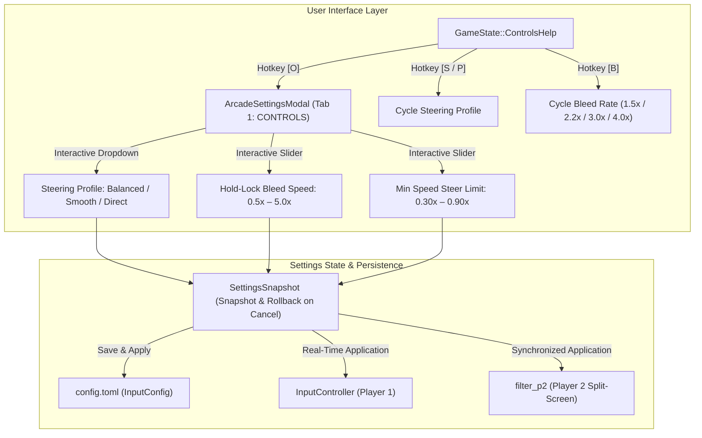

# Architecture Spec: Interactive Controls Settings for Steering Smoothing and Progressive Hold Bleed 🎛️🏎️

A formal engineering specification adding interactive, in-game player settings for digital steering smoothing profiles, progressive hold-lock bleed speed, and speed-sensitive limits across both the graphical `ArcadeSettingsModal` (CONTROLS tab) and the in-game Controls Guide overlay (`GameState::ControlsHelp`).

---

## 🗺️ Current vs. Proposed System Architecture

### 1. Current Architecture & Motivation

While Spec 039 established progressive hold-lock bleed and three preset steering profiles (`Balanced`, `Smooth`, `Direct`), players can only cycle the active profile via the `ControlsHelp` guide screen or manually edit `config.toml`. Fine-tuning the hold-lock bleed rate or high-speed steering clamp currently requires exiting the application and modifying configuration text files.

Furthermore, while `ArcadeSettingsModal` provides a dedicated **CONTROLS** tab (Tab 1), it only contains gamepad deadzone and sensitivity sliders, omitting digital keyboard steering parameters altogether.

### 2. Proposed System Architecture

---

## 🛠️ Detailed Component Architecture

### 1. `ArcadeSettingsModal` Enhancements (`crates/cabinet/src/state/settings.rs`)

1. **New Interactive Widgets in Tab 1 (CONTROLS)**:
   - `steering_profile_dropdown: DropdownWidget`: Options `["Balanced (Default)", "Smooth (Touring)", "Direct (Sim)"]`.
   - `hold_bleed_rate_slider: SliderWidget`: Min `0.5`, Max `5.0`, Step `0.1`, Default `2.2`, Suffix `"x"`.
   - `min_speed_steer_limit_slider: SliderWidget`: Min `0.30`, Max `0.90`, Step `0.05`, Default `0.55`, Suffix `"x"`.
2. **Navigation Grid Synchronization**:
   - Tab 1 navigation row count expanded from 5 to 7 (6 widgets + 1 bottom button row).
   - Up/Down navigation correctly navigates through all 6 controls widgets and handles popup dropdown focus.
3. **State Snapshot & Rollback**:
   - `SettingsSnapshot` extended to record `steering_profile_idx: usize`, `hold_bleed_rate: f32`, and `min_speed_steer_limit: f32`.
   - `has_unsaved_changes()` accurately reflects edits to input smoothing parameters.
   - `restore_defaults()` resets input widgets to `Balanced`, `2.2x`, and `0.55x`.

### 2. Game Mod Binding & Application (`crates/tdrace-app/src/game/mod.rs`)

1. **`open_settings_modal()`**:
   - Pre-populates the modal widgets from active `self.input.filter.config`.
2. **`close_settings_modal(save: bool)`**:
   - On save, extracts the selected profile, hold bleed rate, and min steer limit.
   - Applies them directly to `self.input.filter.config` and synchronizes `self.filter_p2.config`.
   - Updates `self.config.input` so values persist to disk.

### 3. Controls Help Screen Enhancements (`GameState::ControlsHelp`)

1. **Visual Status**:
   - Displays active Steering Profile and Hold-Lock Bleed Rate.
2. **Hotkeys**:
   - `[S / P]`: Cycle steering profile.
   - `[B]`: Cycle hold-lock bleed presets (`1.5x` -> `2.2x` -> `3.0x` -> `4.0x`).
   - `[O]`: Open Settings Modal directly from Controls screen.

---

## 🗄️ Database & Storage Migration Plan

- **Configuration Backward Compatibility**:
  - `config.toml` maintains all existing `[input]` keys (`steering_profile`, `hold_bleed_rate`, `min_speed_steer_limit`).
  - Serde default deserialization ensures older `config.toml` files missing keys fall back cleanly to `SteeringProfile::Balanced`, `2.2`, and `0.55`.
- **Zero-downtime Migration**:
  - No database migration or persistent storage format changes are required.

---

## 🔑 Security, Compliance, & IAM Roles

- Input processing occurs strictly locally in client memory with zero network or privileged filesystem operations.
- Gamepad analog input bypasses digital key smoothing entirely, ensuring hardware analog axes remain unmodified.

---

## 🛡️ Disaster Recovery, Monitoring, & Fallbacks

- **Rollback steps**:
  - `SettingsSnapshot` automatically provides cancel and rollback functionality in the modal.
  - Reset to defaults button restores factory balanced coefficients.
- **Diagnostics & Metrics**:
  - Automated integration tests verify that modifying settings in `ArcadeSettingsModal` persists to `InputController` and `config.toml`.

---

## 🧪 Verification & Acceptance Criteria

### Automated Tests
- Command to validate specification OKF compliance: `keel validate`
- Command to verify cabinet settings modal controls: `cargo test -p cabinet --test cabinet_integration_tests`
- Command to verify input filter synchronization: `cargo test -p tdrace-app --test input_smoothing_tests`

### Manual Acceptance Criteria (Pseudo-Gherkin)

- **Scenario: Player modifies steering profile and hold-lock bleed in Settings Modal**
  - [ ] **Given** the player opens `ArcadeSettingsModal` on the `CONTROLS` tab
  - [ ] **When** the player modifies the steering profile dropdown and hold-lock bleed slider and clicks "SAVE & APPLY"
  - [ ] **Then** the updated values must immediately take effect on `InputController` and `filter_p2`
  - [ ] **And** `config.toml` input settings must be updated

- **Scenario: Player cancels edits with rollback**
  - [ ] **Given** the player changes the hold-lock bleed slider in the Settings modal
  - [ ] **When** the player presses Escape or Cancel without saving
  - [ ] **Then** the settings must revert to the initial snapshot

- **Scenario: Player cycles hold-lock bleed rate on Controls Help screen**
  - [ ] **Given** the player is on `GameState::ControlsHelp`
  - [ ] **When** the player presses key `[B]`
  - [ ] **Then** the active hold bleed rate must cycle through preset values and update the filter immediately

---

## 🔗 Traceability & Codebase Mapping

| Action | Path | Description |
| :--- | :--- | :--- |
| `[NEW]` | `specs/040_interactive_controls_settings_for_steering_smoothing_and_hold_bleed.md` | Formal architecture specification. |
| `[MODIFY]` | `specs/constitution/ROADMAP.md` | Add milestone entry under Phase 6. |
| `[MODIFY]` | `specs/index.md` | Synchronize progressive index. |
| `[MODIFY]` | `crates/cabinet/src/state/settings.rs` | Add profile dropdown, bleed slider, and limit slider to ArcadeSettingsModal. |
| `[MODIFY]` | `crates/tdrace-app/src/game/mod.rs` | Wire settings modal input synchronization and ControlsHelp hotkeys. |
| `[MODIFY]` | `crates/tdrace-app/src/ui/menu.rs` | Render updated hold-lock bleed info in render_controls_screen. |
| `[MODIFY]` | `crates/cabinet/tests/cabinet_integration_tests.rs` | Add unit tests verifying controls tab widgets and snapshot rollback. |
| `[MODIFY]` | `crates/tdrace-app/tests/input_smoothing_tests.rs` | Add integration tests for controls settings synchronization. |
