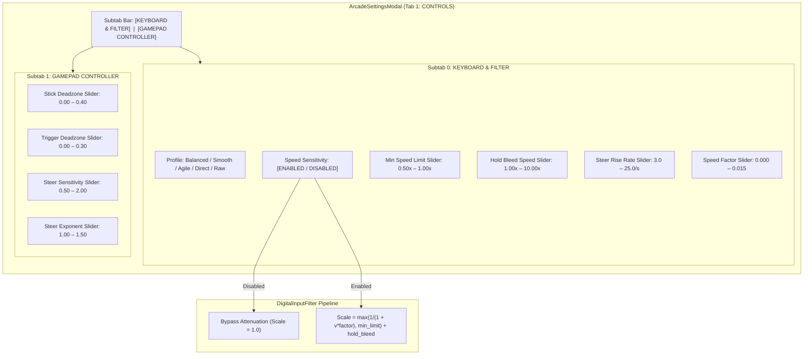

# Architecture Spec: 5-Tier Steering Smoothing Profiles, Speed Sensitivity Switch, and Subtab Controls Separation 🎛️⚡

A formal engineering architecture specification expanding the digital keyboard steering filter system to five discrete driving profiles, introducing a master Speed Sensitivity Switch to bypass attenuation, exposing advanced filter parameters (`steer_rise_rate`, `speed_sensitive_factor`), and cleanly separating keyboard from gamepad settings via dedicated sub-tabs inside `ArcadeSettingsModal` (`CONTROLS` tab).

---

## 🗺️ Current vs. Proposed System Architecture

### 1. Current Architecture & Motivation

Spec 040 introduced `ArcadeSettingsModal` widgets for 3 profiles (`Balanced`, `Smooth`, `Direct`), `hold_bleed_rate`, and `min_speed_steer_limit`. However:
1. Keyboard filter parameters are blended alongside gamepad controller sliders on a single list in the `CONTROLS` tab, creating visual clutter and confusing users about which slider affects keys vs analog sticks.
2. Players wanting raw or esports binary controls lacked an explicit master switch to completely disengage speed attenuation.
3. Steering rise rate (`steer_rise_rate`) and speed sensitivity factor (`speed_sensitive_factor`) remained inaccessible from the GUI.
4. Players need finer differentiation across handling styles, notably an `Agile` profile for high-authority twisty tracks and a true `Raw (Unfiltered)` profile for esports instant key response.

### 2. Proposed System Architecture

---

## 🛠️ Detailed Component Architecture

### 1. 5-Tier Steering Profile Hierarchy (`crates/cabinet/src/input/filter.rs`)

1. **`Balanced (Default)`**:
   - `speed_sensitive_enabled: true`
   - `min_speed_steer_limit: 0.75`
   - `hold_bleed_rate: 4.0`
   - `steer_rise_rate: 8.0`
   - Balanced agility with progressive high-speed turn-in floor.
2. **`Smooth (Arcade)`**:
   - `speed_sensitive_enabled: true`
   - `min_speed_steer_limit: 0.60`
   - `hold_bleed_rate: 2.0`
   - `steer_rise_rate: 6.0`
   - High-speed cruising stability for relaxed oval and touring driving.
3. **`Agile`**:
   - `speed_sensitive_enabled: true`
   - `min_speed_steer_limit: 0.80`
   - `hold_bleed_rate: 6.0`
   - `steer_rise_rate: 10.0`
   - Rapid turn-in and fast full-lock recovery for tight chicanes and hairpins.
4. **`Direct (Sim)`**:
   - `speed_sensitive_enabled: false` (Switch OFF)
   - `min_speed_steer_limit: 1.00`
   - `hold_bleed_rate: 8.0`
   - `steer_rise_rate: 12.0`
   - Speed attenuation bypassed; sharp linear response.
5. **`Raw (Unfiltered)`**:
   - `speed_sensitive_enabled: false` (Switch OFF)
   - `min_speed_steer_limit: 1.00`
   - `hold_bleed_rate: 10.0`
   - `steer_rise_rate: 20.0`
   - Instantaneous esports binary key pass-through.

---

### 2. Controls Sub-Tabs in `ArcadeSettingsModal` (`crates/cabinet/src/state/settings.rs`)

1. **Subtab Layout**:
   - `controls_sub_tab: usize`: `0 = KEYBOARD & FILTER`, `1 = GAMEPAD CONTROLLER`.
   - Subtab Bar rendered directly beneath main Tab Bar when Tab 1 (`CONTROLS`) is active.
   - Orthogonal navigation: Down from Subtab Bar enters active subtab rows; Up from row 0 returns to Subtab Bar.
2. **Subtab 0: KEYBOARD & FILTER**:
   - `steering_profile_dropdown`: 5 profile options.
   - `speed_sensitive_switch`: Dropdown `["ENABLED", "DISABLED"]`. Selecting Direct or Raw automatically toggles this to `DISABLED` and sets `min_speed_steer_limit` to `1.00`.
   - `min_speed_steer_limit_slider`: `0.50x` – `1.00x` (step `0.05x`).
   - `hold_bleed_rate_slider`: `1.00x` – `10.00x` (step `0.10x`).
   - `steer_rise_rate_slider`: `3.0` – `25.0/s` (step `0.5/s`).
   - `speed_sensitive_factor_slider`: `0.000` – `0.015` (step `0.001`).
3. **Subtab 1: GAMEPAD CONTROLLER**:
   - `stick_deadzone_slider`
   - `trigger_deadzone_slider`
   - `steer_sensitivity_slider`
   - `steer_exponent_slider`

---

## 🗄️ Database & Storage Migration Plan

- **Configuration Backward Compatibility**:
  - `config.toml` maintains all existing `[input]` keys and adds `speed_sensitive_enabled = true`.
  - Serde default deserialization ensures older `config.toml` files missing keys fall back cleanly to `speed_sensitive_enabled: true`, `SteeringProfile::Balanced`, `4.0`, and `0.75`.
- **Zero-downtime Migration**:
  - No database migration or persistent storage format changes are required.

---

## 🔑 Security, Compliance, & IAM Roles

- Input processing occurs strictly locally in client memory with zero network or privileged filesystem operations.
- Gamepad analog input bypasses digital key smoothing entirely, ensuring hardware analog axes remain unmodified.

---

## 🛡️ Disaster Recovery, Monitoring, & Fallbacks

- **Rollback steps**:
  - `SettingsSnapshot` automatically provides cancel and rollback functionality in the modal.
  - Reset to defaults button restores factory balanced coefficients.
- **Diagnostics & Metrics**:
  - Automated integration tests verify that modifying settings in `ArcadeSettingsModal` persists to `InputController` and `config.toml`.

---

## 🧪 Verification & Acceptance Criteria

### Automated Tests
- Command to validate specification OKF compliance: `keel validate`
- Command to verify cabinet settings modal controls: `cargo test -p cabinet --test cabinet_integration_tests`
- Command to verify input filter synchronization: `cargo test -p tdrace-app --test input_smoothing_tests`

### Manual Acceptance Criteria (Pseudo-Gherkin)

- **Scenario: Player toggles Speed Sensitivity Switch to DISABLED**
  - [x] **Given** the player opens `ArcadeSettingsModal` on `CONTROLS` -> `KEYBOARD & FILTER`
  - [x] **When** the player sets `Speed Sensitivity` to `DISABLED` and clicks Save
  - [x] **Then** high-speed steering attenuation must be completely bypassed at any vehicle speed

- **Scenario: Player selects Direct or Raw profile**
  - [x] **Given** the player changes steering profile to `Direct` or `Raw`
  - [x] **Then** the Speed Sensitivity Switch must automatically set to `DISABLED`
  - [x] **And** Min Speed Steer Limit must set to `1.00x`

- **Scenario: Player navigates between Controls Subtabs**
  - [x] **Given** the player is in `ArcadeSettingsModal` on `CONTROLS`
  - [x] **When** the player presses Left/Right on the subtab bar
  - [x] **Then** the view must switch between `KEYBOARD & FILTER` and `GAMEPAD CONTROLLER` without losing state

---

## 🔗 Traceability & Codebase Mapping

| Action | Path | Description |
| :--- | :--- | :--- |
| `[NEW]` | `specs/041_five_tier_steering_profiles_speed_switch_and_subtab_controls.md` | Formal architecture specification. |
| `[MODIFY]` | `specs/constitution/ROADMAP.md` | Add milestone entry under Phase 6. |
| `[MODIFY]` | `specs/index.md` | Register Spec 041. |
| `[MODIFY]` | `crates/cabinet/src/input/filter.rs` | 5 profiles, speed_sensitive_enabled, from_profile presets. |
| `[MODIFY]` | `crates/cabinet/src/state/settings.rs` | Controls subtabs, switch dropdown, granular filter sliders. |
| `[MODIFY]` | `crates/tdrace-app/src/game/mod.rs` | Wire settings apply, modal opening, ControlsHelp 5-profile cycle. |
| `[MODIFY]` | `crates/cabinet/tests/cabinet_integration_tests.rs` | Integration tests for subtabs and switch. |
| `[MODIFY]` | `crates/tdrace-app/tests/input_smoothing_tests.rs` | Filter unit tests for 5 profiles and bypass. |

