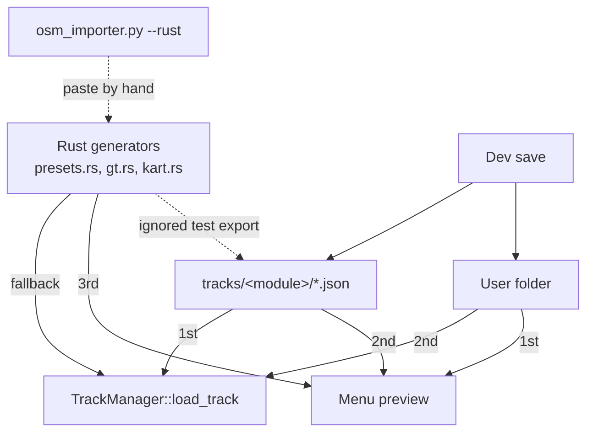
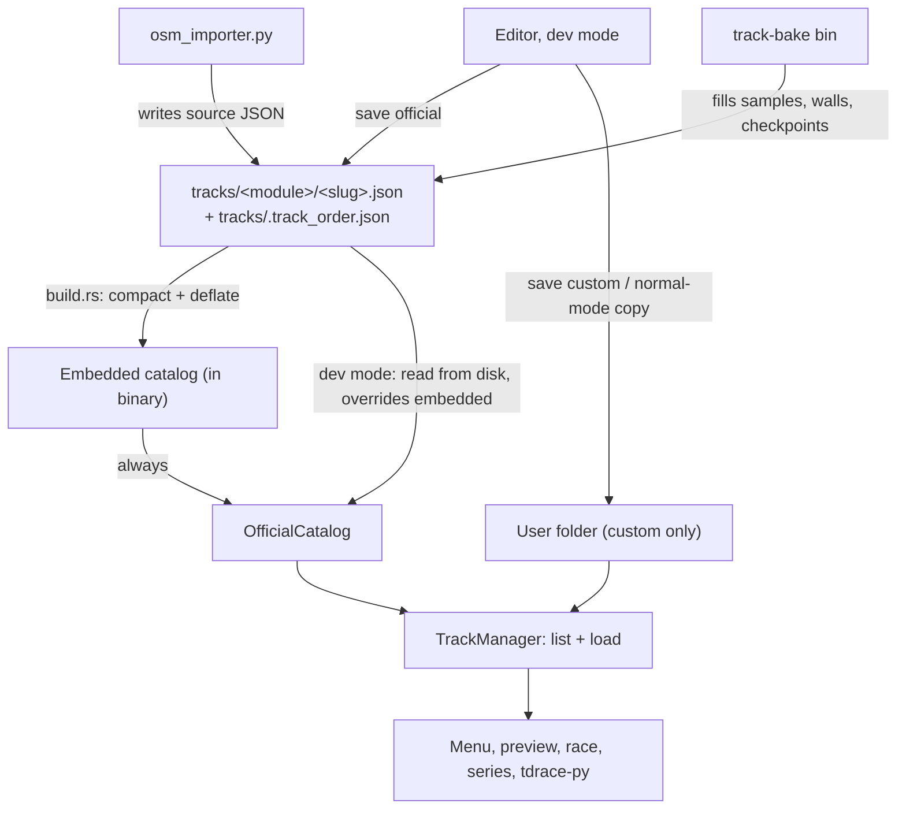

# Architecture Spec: JSON-Only Official Circuit Catalog and Embedded Track Data 🏗️

Today an official circuit can come from four places. The Rust code, the `tracks/` JSON, and the user folder all hold a copy, and each loader applies a different precedence. A fix in one copy does not reach the game when another copy wins. This spec reduces the model to **one copy of each official circuit, in JSON**, plus a clear, separate place for custom circuits.

---

## 🗺️ Current vs. Proposed System Architecture

### 1. Current Architecture

Four sources feed the circuit list (see `docs/engineering/circuit_building_analysis.md` §2.6):

| # | Source | Git-tracked | Role |
|---|---|---|---|
| 1 | Rust generators: `crates/arcade-race-core/src/track/presets.rs` (66 `-> Track` fns), `crates/tdrace-app/src/module/{gt,kart,extreme_offroad}.rs` (`track_*()` fns), and each module's `tracks()` table | yes (`tdrace`) | Defines **which** circuits exist, their order, title, tag and description. Also builds a fallback `Track`. |
| 2 | `tracks/<module>/*.json` (`tdrace-tracks` submodule, 96 files, 79 MB pretty JSON) | yes (separate repo) | The circuit data. Wins over #1 when present. |
| 3 | User folder `~/Library/Application Support/tdrace/tracks` | no | Custom circuits and drafts. A user copy of an official circuit wins over #1 but loses to #2 (race load), and wins over #2 (menu preview). |
| 4 | Dev mode (`TDRACE_DEV=1`) save / promote | writes into #2 **and** #3 | Saves an edited official circuit to both places. The promote picker (`ui/track_manager_ui.rs:63-68`, `PROMOTION_MODULES`) lists only classic, rally, kart, gt. |

Known defects of this model:

- **D-A. Split source of truth.** A fix in #1 does not show while #2 exists. JSON is only refreshed by an ignored test (`crates/tdrace-app/tests/track_manager_tests.rs:1338`, `test_export_canonical_presets_to_git_repo`).
- **D-B. Two precedence orders.** `TrackManager::load_track` (`track_manager.rs:827-1047`) reads git → user → Rust. The menu preview (`ui/menu.rs:226-347`) reads user → git → Rust. Dev save writes both copies, so the two can drift.
- **D-C. Incomplete fallback.** `menu.rs::resolve_procedural_preset` (369-449) lacks 11 ids that `load_track` has.
- **D-D. No data in release/web builds.** No track data is embedded. `resolve_git_tracks_dir` (`storage.rs:77-100`) needs a sibling `crates/` or `.git`, so the packaged Windows build (`scripts/package_windows.sh:130-139`) ignores its copied `tracks/`. The wasm build only has the Rust generators.
- **D-E. Hard-coded module lists** that omit nascar and/or extreme_offroad: `PROMOTION_MODULES`, `selected_mask: [bool; 4]`, `track_manager.rs` 317, 774, 1226, 1289-1293, 1311-1318, `CustomTrackInfo::module_name` 158-175, `menu.rs` 164-170, 229-260, 327-333.
- **D-F. Slug mismatch.** NASCAR JSON files use short names (`daytona.json`), while ids, `series/*.toml` and saves use long names (`daytona_superspeedway`). An alias table (`track_manager.rs:1140-1208`) bridges them.
- **D-G. Promote ignores the chosen module.** `promote_custom_track_to_git_preset` (`track_manager.rs:1985-2050`) ignores `target_module`.
- **D-H. Importers emit Rust.** `scripts/osm_importer.py --rust` prints code to paste by hand into `presets.rs` / `gt.rs`.
- **D-I. Circuit data duplicated in Rust metadata.** `CIRCUIT_PROVENANCE_REGISTRY` (`provenance.rs:26-686`, 72 records) duplicates the `osm_url` / `wikipedia_url` / `country_*` fields that the JSON already holds.

### 2. Proposed Architecture

**Three rules:**

1. **Official circuit = one JSON file.** `tracks/<module>/<slug>.json` is the only source. The file name is the canonical slug. The set of files in a module folder defines which circuits exist. `tracks/.track_order.json` defines the order.
2. **Custom circuit = user folder only.** Custom circuits never go to git and never shadow an official circuit.
3. **Rust holds tools, not circuits.** Spline, walls, runoff, grid, checkpoints, validation and editor templates stay. All circuit-specific generators and slug tables go.

#### 2.1 Official catalog (`OfficialCatalog`)

- One new type owns the official list. It replaces `module::*::tracks()` as the source of ids, and it replaces the Rust fallback `match` blocks.
- **Embedded copy.** A `build.rs` in `tdrace-app` reads `tracks/**/*.json` and `tracks/.track_order.json`. It rewrites each file as compact JSON, compresses the bundle with DEFLATE, and emits it for `include_bytes!`. Measured: 79 MB pretty → ~45 MB compact → **~5.6 MB gzip -9**. The catalog decompresses one circuit on demand, not all 96 at start.
- **Disk copy.** When the tracks dir resolves (see 2.4) and dev mode is on, a file on disk replaces its embedded copy. New files on disk are added. Outside dev mode the embedded copy is used, so a stray local edit cannot change a release game.
- **Empty `tracks/`.** If the submodule is not checked out at build time, `build.rs` fails the build with a clear message (`git submodule update --init tracks`). A build never silently ships zero circuits.
- **Metadata moves into JSON.** `TrackDefinition.title` → `name`, `description` → `description`, `tag` → new `tag`, `category` → new `category_label` (`Track.category` is already the Main/Draft tier). `default_laps` is already in the JSON. Both new fields are `#[serde(default, skip_serializing_if = "String::is_empty")]`, so existing files stay readable. Where the menu text and the JSON text differed (29 names, 64 descriptions), the menu text was kept (decision, 2026-09-27). Lap counts keep the JSON value, because races already use it.
- **Shared circuits.** `dirt_figure_eight` is used by classic and extreme_offroad (with a 12-slot grid). It is already two files, `classic/dirt_figure_eight.json` and `extreme_offroad/dirt_figure_eight.json`. Each module owns its copy.

#### 2.2 Slug rules

- File stem = canonical id. The 16 short-named NASCAR files are renamed to their long ids (`daytona.json` → `daytona_superspeedway.json`, and so on). This matches `series/*.toml`.
- One small alias map stays in the catalog, only to read old saves, old `series` files and old `.track_order.json` keys. It is data (`tracks/.aliases.json`), not Rust code.

#### 2.3 One precedence order

Every consumer (race load, menu preview, series editor, tdrace-py) calls one resolver:

1. **Official slug:** `OfficialCatalog` (disk in dev mode, else embedded). The user folder is never read for an official slug.
2. **Custom slug:** user folder, then `.backup/`.

The menu cache (`MENU_TRACK_CACHE`) keeps its role, but reads through this resolver.

#### 2.4 Tracks dir resolution

- `resolve_git_tracks_dir` keeps `TDRACE_GIT_TRACKS_DIR` and the `./tracks`, `../tracks`, `../../tracks` search.
- It is only used in dev mode (for reads and writes). Normal mode needs no disk tracks at all.

#### 2.5 Saving

| Who | Circuit | Result |
|---|---|---|
| Dev mode | official | Writes only `tracks/<module>/<slug>.json`. No user copy. The developer commits in `tdrace-tracks`. |
| Dev mode | custom → promote | The chosen `target_module` is used (fix D-G). All six modules are offered (fix D-E). The file moves to `tracks/<module>/<slug>.json`; the user copy is removed. |
| Dev mode | official → demote | The JSON is removed from `tracks/`; a custom copy is written to the user folder. |
| Normal mode | official | Cannot overwrite. The editor offers "Save as copy", which writes a new custom slug to the user folder. |
| Normal mode | custom | Writes to the user folder. |

- Hide / reorder in normal mode stay as user-folder preferences (`.deleted_tracks.json`, `.track_order.json` in the user folder). They only hide or reorder; they never replace circuit data.
- `tracks/.deleted_tracks.json` (9 entries, read by no loader) is removed from `tdrace-tracks`. In dev mode, deleting an official circuit deletes its file.

#### 2.6 Rust code removed

- `presets.rs`: the 66 circuit generators (lines 603-6710 today) and the dead aliases (`dirt_oval_speedway`, `dune_raid`, `sahara_dunes`, `cota`).
- `module/gt.rs:27-1423`, `module/kart.rs:31-1181`, `module/extreme_offroad.rs:37-45` generators.
- The `tracks()` tables and `TrackDefinition.generator`. `GameModule::tracks()` is kept as a thin call into `OfficialCatalog::list(module)`, so module code keeps its interface.
- `track_manager.rs`: `preset_module`, `canonical_preset_id`, `preset_slug_aliases`, the fallback `match` in `load_track`, and the per-module hard-coded lists.
- `ui/menu.rs`: `resolve_procedural_preset` and the 7 hard-coded classic `TrackChoice` variants (replaced by an official-slug variant).
- `provenance.rs`: `CIRCUIT_PROVENANCE_REGISTRY` after a parity check proves each JSON holds the same URLs (fix D-I).
- `dev_tools.rs::export_track_to_rust_code` and the ignored export test.

**Kept (tools):** `presets.rs:15-600` helpers (walls, checkpoints, grid, hull, arena, whoops), editor templates (`create_prototypical_track`, `*_template`), `spline.rs`, `geometry.rs`, `checkpoint.rs`, `curve.rs`, `scenery.rs`, `validation.rs`, and the `Track` rebuild methods. `presets.rs` may be renamed to `builders.rs` once it holds only tools.

#### 2.7 Importers and baking

- `scripts/osm_importer.py` gains `--json <path>`. It writes a **source** JSON: name, metadata, provenance, `spline.waypoints`, and scale. `--rust` is removed. `scripts/osm_nascar_importer.py` gets the same flag.
- A new Rust bin, `track-bake` (in `tdrace-app`), reads a source JSON, runs the existing builders (samples, walls, boundary polylines, checkpoints, grid, default runoff), runs `validate_track`, and writes the baked JSON in place. Command: `cargo run --bin track-bake -- tracks/gt/monza.json`.
- The editor keeps its current baked save. Hand edits to walls in a baked file are kept; `track-bake` only fills fields that are empty, unless `--rebuild` is passed.

#### 2.8 Tests and bindings

- A test helper `official_track(module, slug) -> Track` loads from the embedded catalog. The 31 test files and 2 benches that call generators switch to it (mechanical change: `presets::monza()` → `official_track("gt", "monza")`).
- Tests that only need *a* track, not a real circuit, use `create_prototypical_track` so they do not depend on circuit data.
- `crates/tdrace-py/src/engine.rs:100-109` resolves `track_name` through `OfficialCatalog`. All 96 circuits become available to Python. The six current names and their aliases keep working. `python/tdrace/env.py` defaults stay unchanged.
- `scripts/generate_asset_data.py` already reads JSON. Its `CLASSIC_TRACK_CATEGORIES` table is a portal modality mapping, not a tag, so it stays. Its output (`portals/shared/data/circuits.json`, circuit SVGs) is regenerated after the NASCAR renames.

---

## 🗄️ Database & Storage Migration Plan

Work is done in phases. Each phase leaves `make test` green.

1. **Parity baseline.** Before any change, export every Rust generator and diff it against its JSON (spline waypoints, wall counts, grid, checkpoints, metadata). Record which side is newer per circuit. Where Rust is newer (for example the GT kerb fix), re-export that circuit so the JSON wins. Commit the JSON in `tdrace-tracks`.
2. **Metadata into JSON.** Add `tag` to `Track`. Write title, tag, description, category and `default_laps` from each `tracks()` table into its JSON. Rename the 16 short NASCAR files; write `tracks/.aliases.json` and `tracks/.track_order.json`; delete `tracks/.deleted_tracks.json`.
3. **Embedded catalog.** Add `build.rs` and `OfficialCatalog`. Route `load_track`, menu preview, series and tdrace-py through the one resolver. Rust generators still exist but are no longer called by game code.
4. **Dev-mode save and promote.** Single-copy dev save, six-module promote, `target_module` fix, normal-mode "Save as copy".
5. **Test migration.** Move tests and benches to `official_track` or templates.
6. **Removal.** Delete generators, `tracks()` tables, slug tables, provenance registry, Rust export code.
7. **Importer + bake.** `--json` in the importers, `track-bake` bin, doc update in `circuit_building_analysis.md` §4.

**User data.** User folder files are not migrated. A user file whose slug equals an official slug is ignored for loading and listed once at start in the log. Its file is not deleted. Old aliases in user `.track_order.json` and `.deleted_tracks.json` resolve through `.aliases.json`.

---

## 🔑 Security, Compliance, & IAM Roles

- No new secrets or services.
- **New dependency (needs approval):** `miniz_oxide` (pure Rust DEFLATE, no C code, builds for wasm32). Used as a build-dependency to compress and as a dependency to decompress. It is already a transitive dependency of `macroquad`'s PNG path, so it adds no new code to the tree, only a direct edge.
- Circuit JSON is untrusted input when read from disk in dev mode. `Track::from_json` errors are reported per file; a bad file is skipped with a log line and the embedded copy is used.
- OSM attribution (ODbL) is tracked separately in `tdrace-clcv`; not in scope.

---

## 🛡️ Disaster Recovery, Monitoring, & Fallbacks

- **Rollback.** Phases 1–5 keep the Rust generators, so any phase can be reverted with `git revert`. Phase 6 is the point of no return in `tdrace`; the generators stay in git history.
- **Build guard.** `build.rs` fails when `tracks/` has fewer than 96 JSON files or when a file fails to parse. The error names the file.
- **Start-up log.** One line: `official circuits: <n> embedded, <m> from disk (dev)`.
- **Binary size.** Embedded bundle target ≤ 8 MB. `build.rs` prints the size as a `cargo:warning` when it exceeds this.

---

## 🧪 Verification & Acceptance Criteria

### Automated Tests
- Rust suite: `make test-rust` (`cargo test --workspace --exclude tdrace-py`)
- Python suite: `make test-python`
- New tests:
  - `crates/tdrace-app/tests/official_catalog_tests.rs` — count per module, order, every file loads and passes `validate_track`, alias resolution, dev-mode disk override, normal-mode ignores disk.
  - `crates/tdrace-app/tests/circuit_storage_tests.rs` — extended for single-copy dev save, six-module promote, `target_module`, normal-mode save-as-copy.
  - `tests/python/test_osm_importer.py` — `--json` output shape.
- Grep check (no circuit generators left): `rg -n "fn (track_[a-z_]+|[a-z_]+_(rx|kart|speedway|raceway))\(\) -> Track" crates/` returns no hits.
- Spec lint: `keel validate .`

### Manual Acceptance Criteria (Pseudo-Gherkin)

- **Scenario: A JSON edit is what the game shows**
  - [ ] **Given** dev mode is on and `tracks/gt/monza.json` is checked out
  - [ ] **When** the developer changes a kerb in that JSON and starts a Monza race
  - [ ] **Then** the race shows the change with no Rust rebuild and no export step
- **Scenario: Release build runs with no tracks folder**
  - [ ] **Given** a release binary built from a checkout with the `tracks` submodule
  - [ ] **When** the binary runs from a folder with no `tracks/` next to it and dev mode off
  - [ ] **Then** all 96 official circuits are listed and each one loads a race
- **Scenario: Build fails without circuit data**
  - [ ] **Given** a fresh clone where `tracks/` is empty
  - [ ] **When** the developer runs `cargo build`
  - [ ] **Then** the build stops with an error that names `git submodule update --init tracks`
- **Scenario: Dev mode saves an official circuit in every module**
  - [ ] **Given** dev mode is on
  - [ ] **When** the developer opens and saves one official circuit in each of classic, gt, rally, kart, nascar and extreme_offroad
  - [ ] **Then** each save changes only `tracks/<module>/<slug>.json` and writes nothing to the user folder
- **Scenario: Promote honours the chosen module**
  - [ ] **Given** dev mode is on and a custom circuit with `module_id` = `classic`
  - [ ] **When** the developer promotes it and picks `nascar` (all six modules are offered)
  - [ ] **Then** the file is written to `tracks/nascar/<slug>.json` and the user copy is removed
- **Scenario: Normal mode cannot overwrite an official circuit**
  - [ ] **Given** dev mode is off
  - [ ] **When** the player edits an official circuit and saves
  - [ ] **Then** a new custom circuit is written to the user folder and `tracks/` is unchanged
- **Scenario: A user file cannot shadow an official circuit**
  - [ ] **Given** the user folder holds `monza.json` with different waypoints
  - [ ] **When** the player opens Monza in the menu preview and then in a race
  - [ ] **Then** both show the official Monza, and the log names the ignored user file
- **Scenario: Old NASCAR slugs still load**
  - [ ] **Given** a saved series or order file that uses the short slug `daytona`
  - [ ] **When** the game loads it
  - [ ] **Then** it resolves to `nascar/daytona_superspeedway.json`
- **Scenario: Python can race any official circuit**
  - [ ] **Given** the tdrace-py package is built
  - [ ] **When** a script creates an env with `track_name="monza"` and one with `track_name="drift_park"`
  - [ ] **Then** both envs reset and step without error
- **Scenario: Importer produces a raceable circuit without Rust edits**
  - [ ] **Given** an OSM cache file for one GT circuit
  - [ ] **When** the developer runs `osm_importer.py gt --json tracks/gt/<slug>.json` and then `cargo run --bin track-bake -- tracks/gt/<slug>.json`
  - [ ] **Then** the circuit appears in the GT list in dev mode and passes `validate_track`
- **Scenario: No circuit data is left in Rust**
  - [ ] **Given** phase 6 is merged
  - [ ] **When** the grep check above runs
  - [ ] **Then** it returns no hits and `make test` passes

---

## 🔗 Traceability & Codebase Mapping

### Created/Modified Files
- `[ ]` `crates/tdrace-app/build.rs` (new) -> Bundles and compresses `tracks/` into the binary.
- `[ ]` `crates/tdrace-app/src/tracks/catalog.rs` -> Becomes `OfficialCatalog` (embedded + dev disk override, order, aliases).
- `[ ]` `crates/tdrace-app/src/track_manager.rs` -> One resolver; remove slug tables and Rust fallback; single-copy dev save; promote `target_module` fix.
- `[ ]` `crates/tdrace-app/src/ui/menu.rs` -> Preview through the resolver; remove `resolve_procedural_preset` and hard-coded classic variants.
- `[ ]` `crates/tdrace-app/src/ui/track_manager_ui.rs` -> Six-module promote picker.
- `[ ]` `crates/tdrace-app/src/game/mod.rs` -> Replace `classic_grand_prix()` fallbacks; six-module mask; normal-mode save-as-copy.
- `[ ]` `crates/tdrace-app/src/storage.rs` -> Tracks dir used only in dev mode.
- `[ ]` `crates/tdrace-app/src/module/{mod,classic,gt,kart,rally,nascar,extreme_offroad}.rs` -> Remove generators and `tracks()` tables; `tracks()` reads the catalog.
- `[ ]` `crates/tdrace-app/src/dev_tools.rs` -> Remove Rust export.
- `[ ]` `crates/tdrace-app/src/bin/track_bake.rs` (new) -> Bake source JSON.
- `[ ]` `crates/arcade-race-core/src/track/mod.rs` -> `tag` field.
- `[ ]` `crates/arcade-race-core/src/track/presets.rs` -> Keep tools only.
- `[ ]` `crates/arcade-race-core/src/track/provenance.rs` -> Remove registry after parity check.
- `[ ]` `crates/tdrace-py/src/engine.rs` -> Resolve by catalog.
- `[ ]` `crates/tdrace-app/tests/*.rs`, `crates/tdrace-core/tests/*.rs`, `crates/tdrace-core/benches/*.rs` -> `official_track` helper or templates.
- `[ ]` `scripts/osm_importer.py`, `scripts/osm_nascar_importer.py` -> `--json` output.
- `[ ]` `scripts/generate_asset_data.py` -> Read `tag` from JSON.
- `[ ]` `tracks/` (`tdrace-tracks` repo) -> Metadata, NASCAR renames, `.track_order.json`, `.aliases.json`, split `dirt_figure_eight`, remove `.deleted_tracks.json`, update `README.md` schema.
- `[ ]` `docs/engineering/circuit_building_analysis.md` -> Update §2.6 and §4 to the new flow.

### Verification Assertions
- `crates/tdrace-app/src/tracks/catalog.rs` references `specs/042_jsononly_official_circuit_catalog_and_embedded_track_data.md` in its header comment.
- No file under `crates/` defines a function that returns a specific named circuit.

### Resolved Decisions (at approval, 2026-09-27)
1. `miniz_oxide` is approved as a direct dependency for the compressed embed.
2. Normal mode ignores disk `tracks/` and uses only the embedded copy. Only dev mode reads the submodule at run time.
