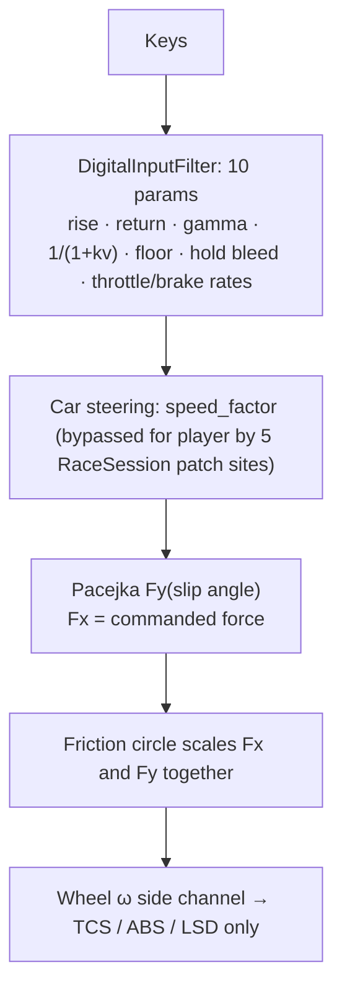
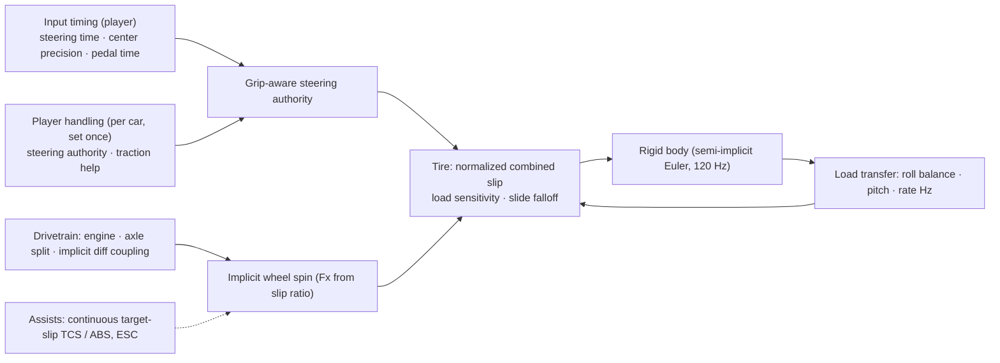

# Architecture Spec: Vehicle Dynamics Rebuild and Simplified Handling Settings 🛞🎛️

Rebuilds the core of `crates/wheelbase` so that tire force comes from **slip**, not from commanded
force, and so that every tuning knob moves the car by an amount a player can feel. Replaces the
keyboard steering filter settings (10 parameters, two overlapping speed-sensitivity layers) with
**5 player parameters** and **4 calibrated presets**.

Evidence and rationale: [Vehicle Dynamics Review & Tunable Handling Model](../docs/engineering/vehicle_dynamics_review_and_tunable_handling_model.md).
Supersedes the approach in [High-Speed Steering Double-Attenuation](../docs/engineering/high_speed_steering_responsiveness_and_double_attenuation.md)
and the speed-sensitivity parts of specs [039](039_configurable_steering_smoothing_profiles_and_high_speed_turning_authority.md),
[040](040_interactive_controls_settings_for_steering_smoothing_and_hold_bleed.md) and
[041](041_five_tier_steering_profiles_speed_switch_and_subtab_controls.md).

---

## 🗺️ Current vs. Proposed System Architecture

### 1. Current Architecture

Measured problems (A/B harness, sports car, 120 Hz):
1. Yaw rate vs steer input is non-monotonic at 45 m/s. The usable input band is 0–0.15.
2. `min_speed_steer_limit` never binds below 60 m/s. `hold_bleed_rate` restores full lock in ≤0.5 s.
3. Corner exit with W held: TCS active on 97 % of frames, exit speed −12 % vs the pre-per-wheel model.
4. Engine braking is 100 % rear on RWD. Lift-off slide grows from 0.705 to 0.772 rad.
5. `cfg.tire.*` and the catalog grip stat do not reach `wheels[].tire_model`. A +30 % grip change moves lateral g by 0 %.
6. Tire force is linear in load, so lateral load transfer does not change axle balance.
7. Spool yaw moment has the wrong sign. The LSD acts only after a wheel already spins.
8. Binary `is_cornering` gates make braking with steer 0.05 stop 19 % longer than with steer 0.00.

### 2. Proposed Architecture

#### 2.1 Tire model (`tire.rs`)

Pure slips are normalized by their peaks. Force follows the normalized slip vector:

- `sx = κ / κ_peak`, `sy = tan α / tan α_peak`, `s = √(sx² + sy²)`
- `μ_eff = μ_surface · grip · thermal · wear · clamp(1 − load_sensitivity · (Fz/Fz_nom − 1), 0.5, 1.3)`
- `F = μ_eff · Fz · shape(s)`, with `shape(s) = s(2 − s)` for `s ≤ 1`, then a smoothstep fall to
  `slide_grip` over `falloff` peak-widths.
- `Fx = F · sx/s`, `Fy = F · sy/s`.
- Arcade knob `power_slide ∈ [0.3, 1]`: `1` = physical circle. Lower keeps
  `Fy ≥ Fy_pure · √(1 − (power_slide · Fx/Fmax)²)`.
- `Fz_nom` = static per-wheel load. The thermal and wear multipliers apply to the whole envelope.
- The low-speed slip-angle regularization (`max(|v|, 2.5)`) and the lateral blend below 3 m/s are kept.

#### 2.2 Wheel spin (`tire.rs`, `car.rs`)

Linearized backward Euler on `I·dω/dt = T_drive − T_brake − r·Fx(κ)`, where
`κ = (ωr − v)/max(|v|, 1.0)` and `k = r²·∂Fx/∂κ / max(|v|,1)`:
`Δω = dt·(T − r·Fx₀)/(I + dt·k)`. Brake torque can stop the wheel but can never reverse it. The
"snap to kinematic" regime, the fixed 3500/2000 N·m recovery torques and the 50 kN·m reset are
removed. The parked static hold is kept.

#### 2.3 Differentials (`car.rs`)

Coupling torque `T_x = clamp(T_eq, −T_lock, T_lock)` with `T_eq = 2Δω / (dt·(1/I_Lᵉ + 1/I_Rᵉ))`,
where `Iᵉ = I + dt·k` (the effective inertia from 2.2). Open: `T_lock = 0`. LimitedSlip:
`T_lock = preload + ramp·|T_in|`. Spool: `T_lock = |T_eq|`. The input torque splits 50/50 before
coupling. The spool grip-share split is removed. A locked axle in a corner now produces an
understeer moment.

#### 2.4 Load transfer (`car.rs`)

- Lateral: `ΔFz_lat = m·a_lat·h/track`. Front share = `roll_balance`, rear share = `1 − roll_balance`.
- Longitudinal: `ΔFz_long = m·a_long·h/L`.
- Acceleration filter: `α = 1 − exp(−2π·weight_transfer_hz·dt)`.
- Banking, grade, crest/dip, aero downforce, caster jacking and airborne contact are kept unchanged.

#### 2.5 Steering authority (`car.rs`)

`authority(v) = min(lock, atan(L/R_min) + (0.25 + overslip − 1)·α_peak)`, where
`R_min = v²/(μ·grip·g_eff)` and `g_eff` includes downforce. `target = −steer · authority`. This
replaces `speed_sensitive_steer_factor` and both input-layer speed-sensitivity terms. The rack rate
(`steer_speed`) stays a per-car constant and is no longer patched at runtime.

*Implementation notes (measured during task 5):*
- *The front reaches its peak near `kinematic + 0.25·α_peak`, because the rear tires also slip.
  The planned `kinematic + overslip·α_peak` put full input about 0.75 peak-widths past the limit.*
- *The planned 6–14 m/s blend to full lock was dropped. It overshot the useful angle at 8–12 m/s.
  At parking speed the kinematic term already exceeds lock.*
- *The grip-aware mapping applies to **human drivers** (`PlayerHandling.grip_aware_steering`).
  Bots and scripted controllers keep the linear full-lock mapping, because their closed-loop gains
  were tuned for it. Their angle is capped at the grip limit with overslip 1.5.*

#### 2.6 Drive, brake, assists (`car.rs`)

- Coast torque splits by `engine_brake_front_share`. EDR scales with body sideslip only, as a
  continuous function.
- Brake torque splits by `brake_bias` (honored). ABS holds the slip ratio near `κ_peak`. Its target
  shrinks continuously with lateral utilization `u = |Fy|/(μFz)`. All binary `is_cornering` gates
  are removed.
- TCS holds driven-wheel slip at or below `tcs_slip_threshold` (a ratio). A separate
  `tcs_slip_angle_deg` sets the lateral term.
- ESC yaw-rate floor applies below 16 m/s only.
- `traction_help ∈ [0,1]` (player aid) scales throttle by `1 − help·clamp((u_rear − 0.8)/0.2, 0, 1)`.

#### 2.7 Configuration model (`config.rs`)

Single source of truth. `CarConfig::finalize()` derives `wheels[]` (tire model, brake and drive
factors) from axle-level fields. It runs in every preset constructor, in `From<CarConfigRaw>`, and in
catalog/module builders after their mutations. `Car::new` debug-asserts that the config is finalized.

| Field | Change |
|---|---|
| `TireConfig.grip` | New name for `peak_d` (serde alias `peak_d`). |
| `TireConfig.peak_slip_angle_deg`, `peak_slip_ratio`, `falloff`, `load_sensitivity`, `power_slide` | New, with serde defaults. If `peak_slip_angle_deg` is missing, derive it from legacy `stiffness_b`/`shape_c`/`curvature_e`. |
| `TireConfig.slide_grip` | New name for `drift_slide_friction` (serde alias). |
| `TireConfig.stiffness_b`, `shape_c`, `curvature_e`, `handbrake_lateral_friction_multiplier` | Removed. Accepted on load and ignored (handbrake slide now comes from wheel lock-up). |
| `CarConfig.rear_axle: RearAxleTire { grip_scale, peak_slip_scale }` | New. Rear tire relative to `tire` (karts: more grip; sports car: stiffer rear for stability). *Task 9 changed this from a full `Option<TireConfig>` copy, which did not follow later grip changes: the catalog grip stat missed the rear axle.* |
| `CarConfig.roll_balance` (0.35–0.65), `weight_transfer_hz` (2–10) | New. Replace `weight_transfer_lateral` / `weight_transfer_longitudinal` (accepted, ignored). |
| `CarConfig.engine_brake_front_share` | New. Default `0.35 + 0.30·drive_bias` when missing. |
| `CarConfig.player: PlayerHandling { grip_aware_steering, steer_overslip, traction_help }` | New. Default `{false, 1.0, 0.0}` (bots). Human drivers get `PlayerHandling::human(..)`. |
| `CarConfig.speed_sensitive_steer_factor` | Removed (accepted, ignored). |
| `DriverAssistsConfig.tcs_slip_angle_deg` | New, default 12. |
| `MotorbikeConfig.tire` | Moves to a `PacejkaTireConfig` (the old struct, renamed). The bike physics is not changed. |

#### 2.8 Simplified player settings (`cabinet`, `tdrace-app`)

Keyboard settings go from 10 parameters to 5:

| Parameter (UI label) | Unit / range | Maps to |
|---|---|---|
| Steering Speed | 30–300 ms (0 → full) | filter rise. Return = 0.7 × rise |
| Steering Authority | 80–140 % | `player.steer_overslip` |
| Center Precision | 1.0–1.8 | filter exponent |
| Pedal Speed | 0–300 ms (0 → full) | throttle and brake rise |
| Traction Help | 0–100 % | `player.traction_help` |

Presets (calibrated in task 9 against the gates below; draft values were 85/100/115/130 %
authority and 80/50/20/0 % traction help):

| Preset | Steering Speed | Authority | Center Precision | Pedal Speed | Traction Help |
|---|---|---|---|---|---|
| Smooth | 220 ms | 90 % | 1.5 | 220 ms | 90 % |
| Balanced (default) | 140 ms | 100 % | 1.3 | 140 ms | 70 % |
| Sharp | 90 ms | 107 % | 1.1 | 80 ms | 35 % |
| Raw | 40 ms | 115 % | 1.0 | 0 ms | 0 % |
| Custom | any slider edit | | | | |

*Calibration notes (task 9):* the authority formula became
`kinematic + (f(v) + beyond(overslip)) · α_peak`, where `f` = 0.30 up to 25 m/s and falls to 0.05
at 45 m/s. `beyond = overslip − 1`, shrunk to 30 % at 45 m/s. Draft authorities above 115 %
turned less tightly at 160 km/h (up to −33 % curvature), because the car slid and ESC braked the
rotation. Measured on the sports car: turn-in to 90 % yaw at 25 m/s is 250 / 158 / 125 / 100 ms.
Peak yaw at 45 m/s is 0.125 / 0.212 / 0.246 / 0.282 rad/s.

Removed: Speed Sensitivity switch, speed factor, Minimum Steer Limit, Hold Bleed, the separate
return, throttle and brake rates. One function, `RaceSession::apply_player_handling`, applies the
settings to the filters and to player cars at car spawn, settings close and the F1/S/P cycle. It
replaces the 5 current patch sites. Gamepad settings are not changed. Steering Authority applies to
the gamepad as well, because it is a car-side value.

#### 2.9 Key-pressing style analysis (`tdrace-app/src/input/simulation.rs`)

The existing keyboard simulation harness (`KeyboardSteerPattern`, sweeper / chicane / slide-catch
scenarios, `keyboard_simulation_benchmark`) is ported to the new settings and extended into a
**key style × preset × car** matrix:

- Key styles: Sustained Hold, Rapid Feathering (75/75 ms), Cadence Pulse (180/120 ms),
  Tap-and-Coast, Lift-Off Turn, Snap Countersteer.
- Presets: Smooth, Balanced, Sharp, Raw.
- Cars: the 5 classic arcade cars (GT, NASCAR, off-road, kart, rally) on asphalt, dirt, packed sand
  and ice.
- Metrics per cell: exit speed, speed retention, peak lateral g, front/rear peak slip, effective
  radius, chicane reversal latency and lateral excursion, slide-catch heading error, outcome badge.
- New summary: **Key Style Sensitivity** = spread of exit speed across key styles per car and
  preset. It shows how much *how you press* matters versus *what you press*.

Design goal: a held key must be a valid way to drive. On the old model, Sustained Hold lost up to
84 % of the entry speed (kart) while Rapid Feathering lost 0 %. Feathering may stay faster, because
it is a skill, but holding must not collapse the car.

The benchmark writes `reports/keyboard_input_car_control_report.{md,json}` and adds an old-vs-new
comparison section with the numbers from the previous report.

---

## 🗄️ Database & Storage Migration Plan

- **Car configs (JSON / serde):** every removed field is still accepted and ignored. Renamed fields
  keep serde aliases. New fields have defaults. `assets/calibration/*.json` still load.
- **Player settings (`tdrace-app` config file):** unknown old fields are ignored. Old
  `steering_profile` values map as follows: `balanced`→Balanced, `smooth`→Smooth,
  `agile`/`direct`→Sharp, `raw`→Raw. The 5 new values default from the mapped preset.
- **Replays / LAN:** `CarControls` does not change. Replays recorded before this change replay with the
  new physics. That is accepted, because replay determinism is per build.
- **Optimizer (`sim/optimizer`):** the parameter space moves from `weight_transfer_*` and
  `speed_sensitive_steer_factor` to `roll_balance`, `weight_transfer_hz`, `tire.grip`,
  `tire.peak_slip_angle_deg`.

## 🔑 Security, Compliance, & IAM Roles

Not applicable. There are no network, credential or dependency changes. No new crates are added.

## 🛡️ Disaster Recovery, Monitoring, & Fallbacks

- **Rollback:** the work lands as atomic commits on `feat/042-vehicle-dynamics-rebuild`, merged
  with `--no-ff`. Revert the merge commit to restore the old physics.
- **Numerical guards:** non-finite wheel ω or chassis state resets to the kinematic rolling state and
  sets a debug counter. A fuzz test asserts that this counter stays 0.
- **Telemetry:** `WheelTelemetry` keeps its fields. `slip_ratio` is now the value that drives Fx.

---

## 🧪 Verification & Acceptance Criteria

### Automated Tests
- Full suite: `cargo test --workspace --exclude tdrace-py --no-fail-fast`. Baseline on `a7ea21e`:
  1093 passed, 8 failed. The 8 pre-existing failures are track assets, gamepad profile, evdev, LAN
  livery and one engine-rev test, all unrelated. The target is no new failures.
- Compile check: `cargo check -p tdrace-py`.
- New calibration suite: `cargo test -p wheelbase --test handling_calibration_tests` and
  `cargo test -p tdrace-app --test handling_presets_tests`. Scripted keyboard inputs, 120 Hz,
  `CarConfig::sports_car()` unless stated.
- Existing tests that assert removed internals (Pacejka B/C/E, speed factor, hold bleed) are
  rewritten to assert the same *intent* on the new model. Each rewrite is listed in its commit
  message.

### Manual Acceptance Criteria (Pseudo-Gherkin)

- **Scenario: Steering response is monotonic at every speed**
  - [ ] **Given** each preset and speeds of 10, 25 and 45 m/s, with throttle holding speed
  - [ ] **When** a held steer input sweeps 0.1 → 1.0
  - [ ] **Then** the steady yaw rate never drops by more than 3 % as input grows

- **Scenario: Presets feel different in a measurable order**
  - [ ] **Given** the 4 presets
  - [ ] **When** a steer key is pressed at 25 m/s
  - [ ] **Then** the time to 90 % of steady yaw is ordered Smooth > Balanced > Sharp > Raw, with each adjacent gap ≥ 15 %
  - [ ] **And** the peak yaw with the key held at 45 m/s (throttle modulated to hold speed) is ordered Smooth < Balanced < Sharp < Raw, with each adjacent gap ≥ 8 %
  - *Clarified in task 9: the driver modulates throttle. With on/off throttle, Sharp and Raw
    (little traction help) power-slide at the limit and ESC equalizes their yaw. The W-held case is
    covered by the next scenario.*

- **Scenario: Safe presets do not spin on a held key**
  - [ ] **Given** Smooth or Balanced, at 45 m/s with W held
  - [ ] **When** full steer is held for 2 s
  - [ ] **Then** the peak body sideslip stays below 0.25 rad

- **Scenario: Corner exit with W held keeps drive**
  - [ ] **Given** 20 m/s, steer 0.4, W held for 2 s, arcade assists
  - [ ] **When** the car exits the corner
  - [ ] **Then** TCS keeps ≥ 50 % of the requested drive force on average and the exit speed is ≥ 20.7 m/s
  - *Changed in task 9: the draft said "TCS active on ≤ 50 % of frames". This car asks for 6.8 kN
    at 20 m/s, and its rear tires can take about 5 kN. A correct TCS therefore trims torque on
    every frame. The frame count measured "TCS is present", not "TCS cuts too much".*

- **Scenario: Lift-off is progressive**
  - [ ] **Given** 40 m/s, steer 0.25, throttle for 1 s and then released
  - [ ] **When** the car coasts for 1.5 s
  - [ ] **Then** the peak sideslip is ≤ 0.705 rad

- **Scenario: A small steer input does not weaken the brakes**
  - [ ] **Given** braking from 40 to 10 m/s
  - [ ] **When** steer is 0.00 and then 0.05
  - [ ] **Then** the stopping distances differ by < 3 %

- **Scenario: Car tuning knobs reach the tires**
  - [ ] **Given** `tire.grip` 1.0 and then 1.3 (and the catalog grip stat)
  - [ ] **When** the car drives a 30 m skidpad at its limit (protocol C)
  - [ ] **Then** the lateral g rises by ≥ 25 %

- **Scenario: Roll balance flips the handling balance**
  - [ ] **Given** `roll_balance` 0.40 and then 0.60
  - [ ] **When** the steer input ramps at 30 m/s
  - [ ] **Then** the rear axle saturates first at 0.40 and the front axle saturates first at 0.60

- **Scenario: Differentials behave physically**
  - [ ] **Given** an RWD car with LSD `power_lock` 0.0 and then 0.8
  - [ ] **When** it exits a corner with W held
  - [ ] **Then** the exit yaw rates differ by ≥ 10 %
  - [ ] **And** a spool gives a lower steady yaw rate than an open differential at the same input

- **Scenario: The model is numerically stable**
  - [ ] **Given** every factory `CarConfig` preset and catalog car
  - [ ] **When** 60 s of random inputs run from 0 to 70 m/s, including full throttle, full brake, handbrake and reverse at standstill
  - [ ] **Then** no state becomes non-finite, |ω_wheel| stays ≤ 550 rad/s and the reset counter stays 0

- **Scenario: Old settings files still load**
  - [ ] **Given** a settings file saved with `steering_profile = "agile"` and the old 10 fields
  - [ ] **When** the game loads it
  - [ ] **Then** the Sharp preset is active and no error is raised

- **Scenario: Settings apply to the live car in both directions**
  - [ ] **Given** a race running with Raw
  - [ ] **When** the player switches to Smooth and back to Raw
  - [ ] **Then** the player car's steering authority and traction help match the active preset each time

- **Scenario: Holding a key is a valid driving style**
  - [ ] **Given** the sweeper scenario for each classic car on asphalt with the Balanced preset
  - [ ] **When** Sustained Hold and Rapid Feathering are compared
  - [ ] **Then** Sustained Hold keeps ≥ 70 % of the Rapid Feathering exit speed on every car, including the kart (old model: 11 %)

- **Scenario: Key styles do not cause spins on safe presets**
  - [ ] **Given** the chicane scenario for each classic car with Smooth and Balanced
  - [ ] **When** every key style is run
  - [ ] **Then** no cell has the `SPINOUT` outcome

- **Scenario: Presets change the key style picture**
  - [ ] **Given** the Key Style Sensitivity summary
  - [ ] **When** Smooth and Raw are compared for the same car
  - [ ] **Then** Smooth has the lower exit-speed spread across key styles on asphalt for at least 4 of the 5 cars

- **Scenario: Key style report is generated**
  - [ ] **Given** the new physics and settings
  - [ ] **When** `cargo run -p tdrace-app --bin keyboard_simulation_benchmark` runs
  - [ ] **Then** `reports/keyboard_input_car_control_report.md` and `.json` contain the key style × preset × car matrix, the sensitivity summary and the old-vs-new comparison

- **Scenario: Player playtest (human)**
  - [ ] **Given** the Balanced preset on keyboard, sports/GT class, Tier 1 bots
  - [ ] **When** Mario races 3 races
  - [ ] **Then** Mario reports feeling in control, clearly noticeable preset changes, and that Tier 1 bots can be beaten

---

## 🔗 Traceability & Codebase Mapping

### Created/Modified Files
- `[ ]` `crates/wheelbase/src/tire.rs` -> Normalized combined-slip tire, implicit wheel step, `PacejkaTireConfig` for the bike.
- `[ ]` `crates/wheelbase/src/config.rs` -> New fields, serde migration, `finalize()`, preset retune.
- `[ ]` `crates/wheelbase/src/car.rs` -> Steering authority, load transfer, drive/brake/diff, continuous assists.
- `[ ]` `crates/wheelbase/src/bike.rs` -> Uses `PacejkaTireConfig`.
- `[ ]` `crates/wheelbase/src/sim/{mod,protocols}.rs`, `sim/optimizer/*` -> New parameter space.
- `[ ]` `crates/wheelbase/tests/handling_calibration_tests.rs` -> New calibration gates.
- `[ ]` `crates/wheelbase/tests/{decoupled_tire_physics,differential_dynamics,auto_calibration}_tests.rs` -> Intent-preserving rewrites.
- `[ ]` `crates/cabinet/src/input/filter.rs`, `crates/cabinet/src/state/settings.rs` -> 5-param model, presets, UI state.
- `[ ]` `crates/tdrace-app/src/config.rs` -> Persisted settings and migration.
- `[ ]` `crates/tdrace-app/src/game/mod.rs` -> `apply_player_handling`, removal of 5 patch sites.
- `[ ]` `crates/tdrace-app/src/ui/menu.rs` (+ settings modal) -> New sliders and labels.
- `[ ]` `crates/tdrace-app/src/catalog/mod.rs`, `src/module/*.rs` -> Use new fields, call `finalize()`.
- `[ ]` `crates/tdrace-app/tests/handling_presets_tests.rs` -> Preset ordering, migration, live apply.
- `[ ]` `crates/tdrace-app/tests/{input_smoothing,config,controls_ui,kart_steering_stability,braking_stability}_tests.rs`, `crates/cabinet/tests/cabinet_integration_tests.rs` -> Intent-preserving rewrites.
- `[ ]` `crates/tdrace-app/src/input/simulation.rs`, `src/bin/keyboard_simulation_benchmark.rs`, `tests/keyboard_simulation_tests.rs` -> Key style × preset × car matrix and gates.
- `[ ]` `reports/keyboard_input_car_control_report.{md,json}` -> Regenerated key style analysis.
- `[ ]` `docs/engineering/*.md` -> Mark the old steering report superseded. Document the new tuning knobs.

### Verification Assertions
- `crates/wheelbase/src/tire.rs` and `crates/wheelbase/src/car.rs` reference `specs/042_vehicle_dynamics_rebuild_and_simplified_handling_settings.md` in their module header comments.
