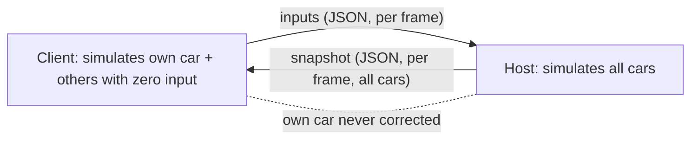
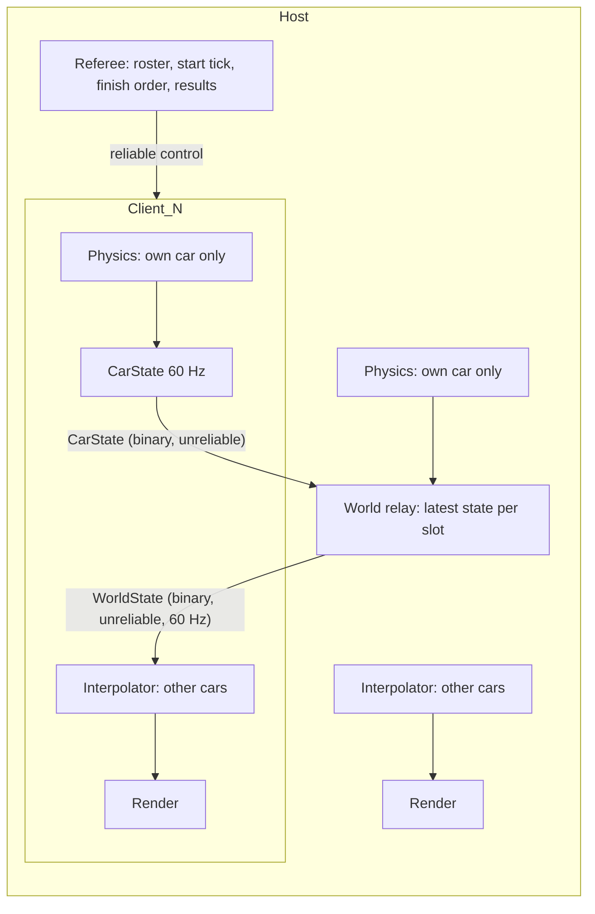

# Architecture Spec: Robust LAN Race Synchronization with Owner-Authoritative Cars 🏗️

The LAN race from spec 036 starts well and then loses sync. A code review (2026-09-28) found six defects that cause it. Some of them are design problems, not only bugs. This spec replaces the in-race netcode. The lobby screens, the beacon discovery and the direct IP connect from spec 036 stay.

**Design decision (mario, 2026-09-28):** each player's machine owns its own car. The host does not run physics for other players' cars. The host relays car states and is the referee for race state (start, laps, finish order, results).

---

## 🗺️ Current vs. Proposed System Architecture

### 1. Current Architecture

- The client sends inputs to the host (`ClientInputPacket`, once per render frame).
- The host runs physics for all cars and sends `WorldSnapshotPacket` (JSON) once per render frame.
- The client runs physics for **its own car with local input** and for **the other cars with zero input**. Then it overwrites the other cars with the last snapshot.

Defects found (file references are at `main` 3ef08cc):

| # | Defect | Where | Effect |
|---|---|---|---|
| D1 | **Snapshot too large.** JSON `WorldSnapshotPacket` is 1312 B for 5 cars on the grid and 1507 B once the cars move. The limit is 1400 B (`MAX_DATAGRAM_SIZE`). 6 or more cars always fail. The `PacketTooLarge` error is dropped (`let _ = host.broadcast_snapshot`). | `game/mod.rs:5347`, `net/protocol.rs` `Packet::encode` | With 5+ players the host stops sending after the start. Other cars freeze. Measured with a temporary test on 2026-09-28. |
| D2 | **Own car never corrected.** The client and the host each simulate the client's car. The two copies drift apart. | `game/mod.rs:5262-5300` | Collisions, laps and finish differ per screen. |
| D3 | **Remote cars get zero input between snapshots** on the client, and the snapshot is applied before the physics step. | `game/mod.rs:11007` (`lan_remote_inputs` is empty on the client) | Remote cars stutter and slow down every frame. |
| D4 | **Slot 1 hard-coded.** `assigned_slot_id()` returns `Some(1)` during `StartingCountdown`, and `InRace` is created from it. | `net/client.rs` `assigned_slot_id`, `update` step 2; `game/mod.rs:8320` | A client in slot 2+ sends inputs as slot 1. The host drops them. That car never moves on the host. |
| D5 | **Slot id and car index mixed.** Cars are pushed in sorted slot order, but inputs, "my car" and snapshots index by slot id. The host builds the roster from `active_slots()`, the client from the last `StateSync`, which is sent once with no resend. `grid_positions` in `LaunchCountdown` is ignored. | `game/mod.rs:8426-8470`, `10995-11015`, `5205` | A slot gap (a player left the lobby) or one lost `StateSync` gives each machine a different car list. |
| D6 | **Race lifecycle stops the network.** Pause stops `host.update()` / `client.update()`, so the peer times out (3.5 s / 4.5 s). A paused client's last input stays applied on the host. When the host finishes, it goes to results and stops sending. `PlayerLeft` is ignored in race, so a left player's last input stays on forever. | `game/mod.rs:4422` `pause_race`, `5251-5300`, `check_race_finish` | Disconnects and runaway cars. |
| D7 | Minor: no packet ordering check; snapshot lap data ignored by the client; `LanCollisionMode` never used in the race; snapshots sent per render frame, not per physics tick. | various | Small visible errors. |

Tests cover only 2 players in slots 0 and 1, so D1, D4 and D5 were not seen. One LAN test already fails on `main` (`test_lan_livery_synchronization_and_countdown_handshake`, beads `tdrace-hz36`, `tdrace-lan-countdown-is-in-race-qj0h`).

### 2. Proposed Architecture

**Four rules:**

1. **Owner authority.** Each machine runs full physics only for the car it owns. It sends that car's state to the host. It never sends inputs.
2. **Host relays and referees.** The host merges the latest state of every car into one world packet and sends it to all clients. The host decides the race start time, the roster, the finish order and the results.
3. **Remote cars are interpolated, not simulated.** On every machine (host included), the cars of other players are kinematic bodies. They are placed from buffered states, shown a short time in the past.
4. **Control messages are reliable.** Lobby changes, launch, finish, leave and results are resent until acknowledged. Car states are not; a newer state replaces a lost one.

#### 2.1 Transport and wire format

- `std::net::UdpSocket` stays. **No new dependency.**
- Envelope stays `magic (4) + version (1)`. A new `kind (1)` byte follows. `PROTOCOL_VERSION` goes from 1 to 2. A v1 peer is rejected with `RejectedVersionMismatch`, as today.
- Beacon and lobby payloads stay JSON (small, rare).
- In-race payloads use a hand-written little-endian binary format (`to_le_bytes` / `from_le_bytes`), in a new `net/wire.rs`:

| Packet | Direction | Content | Size |
|---|---|---|---|
| `CarState` | owner → host | `slot u8`, `time_ms u32` (shared race clock), `pos 2×f32`, `vel 2×f32`, `angle f32`, `ang_vel f32`, `steer f32`, `elevation f32`, `vert_vel f32`, `throttle u8`, `brake u8`, `flags u8` (braking, handbrake, drifting, airborne, lights, reverse), `lap u8`, `checkpoint u16`, `progress f32` | 51 B per car |
| `WorldState` | host → all | `host_tick u32`, `count u8`, then `count × CarState` | 8 cars = 419 B (with envelope) |

- A unit test asserts that an 8-car `WorldState` encodes to less than `MAX_DATAGRAM_SIZE`. `encode` never fails silently: an error is counted in `NetStats` and logged once.

#### 2.2 Race clock

- Physics stays at `FIXED_DT = 1/120 s`. The shared race clock counts seconds from the green light (0.0).
- The host picks `start_at` = host monotonic time + countdown. Clients convert it to local time with a clock offset from ping (`offset = host_time − (local_send + rtt/2)`, from the lowest-RTT sample of the last 8 pings; clients ping every 0.5 s).
- Car states are sent at most at 60 Hz. Each state carries the owner's race clock in ms (`time_ms`), not a physics tick count, so a machine whose simulation lags after a frame hitch still places its states on the shared timeline.

#### 2.3 Remote car interpolation

- One `RemoteCarBuffer` per remote car holds the last ~16 states, ordered by `race_tick`. An older or duplicate tick is dropped.
- A remote car is shown at `render_time = race_clock − interp_delay`, with `interp_delay` = 100 ms. Position uses Hermite interpolation with the sent velocities. Angle uses shortest-arc interpolation.
- If the buffer runs dry, the car is extrapolated for up to 250 ms, then held still. Extrapolation stops when a new state arrives, with a 100 ms blend (no snap).
- Remote cars are **excluded from physics integration**. Their derived fields (`speed`, `local_velocity`, `is_braking`, lights) are set from the state so that sound, skidmarks and the HUD keep working.

#### 2.4 Collisions

- `resolve_multi_car_collisions` runs as today. Before it runs, the state of every remote car is saved. After it runs, the remote cars are restored. So only the owned car gets the impulse. The other player gets their own impulse on their own machine.
- A car whose player left, or that already finished, collides with nothing. A finished own car also collides with nothing. (Found in testing: a braking finisher or a paused car is an immovable wall on the other machines.)
- No change to `arcade-race-core`.
- `LanCollisionMode::GhostPassing` skips car-to-car collisions. `FullSatSolid` and `VergeOnly` keep solid collisions (`VergeOnly` has no definition in spec 036; defining it is out of scope).

#### 2.5 Roster and launch

- The client stores its `assigned_slot_id` in the `LanClient` struct, set once from `JoinResponse::Accepted`. Every client state reads it from there (fixes D4).
- `JoinResponse` no longer carries the slot list (8 slots did not fit one datagram); a reliable `StateSync` follows it.
- `LaunchCountdown` is replaced by a reliable `RaceLaunch` message with the full race config: track id, laps, collision mode, and the roster (per car: `slot`, `grid_index`, name, country, car model, livery). The roster is frozen at launch.
- Host and clients build the car list only from `RaceLaunch`. A `SlotMap` maps `slot ↔ car index` and is used for every lookup (fixes D5). `lan_player_slot` is kept as a slot id; `player_car_index()` resolves through the `SlotMap`.
- Each client sends a reliable `Loaded` when its track is ready. The host sends a reliable `RaceStart { start_at }` when all clients are loaded, or after 10 s (a client that is not loaded by then is marked DNF). Every machine shows the countdown until `start_at`, so the green light is shared.

#### 2.6 Reliable control channel

- New `net/reliable.rs`: each reliable message has a `seq u16`. The receiver sends `Ack { seq }` and drops duplicates. The sender resends every 150 ms, for up to 20 tries, then treats the peer as lost.
- Reliable: `StateSync`, `ClientSlotUpdate`, `RaceLaunch`, `Loaded`, `RaceStart`, `Finished`, `Standings`, `PlayerLeft`, `RaceOver`.
- `DisconnectNotice` is sent 3 times instead, because the sender stops listening right after it.
- A message larger than one datagram is split into fragments (up to 255).
- `StateSync` carries a `roster_rev u32`. A client ignores a `StateSync` older than the one it has.

#### 2.7 Race state and finish (host is referee)

- Each owner runs its own `TrackProgressTracker` (it has real physics). It sends `lap`, `checkpoint` and `progress` in every `CarState`.
- The host checks that progress only moves forward (checkpoint order, as the tracker's anti-cheat does locally), and keeps the standings.
- When an owner completes the last lap, it sends a reliable `Finished { finish_tick, best_lap_ms }`. The host records the finish order by `finish_tick` and broadcasts `Standings`.
- A player who finishes goes to a "finished, waiting" view. The network keeps running and the other cars are still shown.
- The host sends `RaceOver { results }` when every connected car has finished, or 30 s after the winner. Cars not finished by then are DNF. Every machine shows the results from `RaceOver`. Local profile history and the Hall of Fame record the host's results.

#### 2.8 Lifecycle

- New `RaceSession::pump_lan(frame_dt)` runs every frame of a LAN race. It is the only place that calls `host.update()` / `client.update()` during a race. `update()` ends with `lan_after_frame()`: when the pause menu, a modal or another screen kept the race branch from running, the race still advances (own car braked) and the network is still pumped.
- **LAN pause does not stop the race.** In LAN mode `Esc` opens the pause menu as an overlay; physics and network continue. The own car gets zero input (brake) while the menu is open.
- **Player leaves or times out:** the host broadcasts reliable `PlayerLeft { slot }`. Every machine parks that car (last state, zero speed, ghost, no collisions) and marks it DNF.
- **Host leaves or times out:** a client shows "Host left the race" and goes to the results screen with the last `Standings`, then to the LAN hub.
- Timeouts stay 3.5 s (host) and 4.5 s (client), measured on packet silence. Any received packet (car state included) counts as a heartbeat.

#### 2.9 Diagnostics

- `NetStats` per peer: RTT, clock offset, packets in/out per second, loss %, dropped out-of-order packets, encode errors, interpolation buffer depth, extrapolation time.
- In dev mode (`TDRACE_DEV=1`), `F9` shows a small net HUD with these numbers. It is off in release.

#### 2.10 Removed code

- `ClientInputPacket`, `HostEvent::PlayerInput`, `LanClient::send_input`, `GameSession::lan_remote_inputs`, and the LAN branches in `physics_step` that read remote inputs.
- JSON `WorldSnapshotPacket` / `CarStateSnapshot`, replaced by the binary `WorldState` / `CarState`.
- `LobbyPacket::LaunchCountdown`, replaced by `RaceLaunch` + `RaceStart`.
- `lan_snapshot_tick` (replaced by `race_tick`).

#### 2.11 Out of scope

- AI bots in LAN races (a host-owned bot would fit this model later).
- A disconnected player's car turning into an AI bot (spec 036 §3 option 2).
- Internet / WAN play, NAT traversal, encryption, anti-cheat.
- Spectator slots, mid-race join.

---

## 🗄️ Database & Storage Migration Plan

No database or save-file change. Work is done in phases. Each phase leaves `make test-rust` green (except the tests already failing on `main`, listed below).

1. **Transport tests first.** Add a `Transport` trait over `UdpSocket` and an in-memory `SimTransport` with set loss %, delay, jitter and reorder. `LanHost` and `LanClient` take a `Transport`. Add tests that reproduce D1, D4 and D5 (they fail).
2. **Wire format.** `net/wire.rs`, binary `CarState` / `WorldState`, `kind` byte, protocol v2. D1 test passes.
3. **Reliable channel and roster.** `net/reliable.rs`, `roster_rev`, stored `assigned_slot_id`, `RaceLaunch`, `Loaded`, `RaceStart`, `SlotMap`. D4 and D5 tests pass.
4. **Owner authority and interpolation.** Own-car-only physics, `RemoteCarBuffer`, collision restore, collision mode. Remove input packets.
5. **Referee and lifecycle.** `pump_lan`, LAN pause overlay, `Finished` / `Standings` / `RaceOver`, `PlayerLeft`, host-left flow.
6. **Diagnostics and headless sync test.** `NetStats`, dev net HUD, the multi-session sync test (see below).
7. **Manual LAN check** on real machines, then docs (`docs/engineering/` LAN note).

---

## 🔑 Security, Compliance, & IAM Roles

- No new services, secrets or dependencies.
- All received packets are untrusted input. Binary decode checks length before every read and rejects a packet with a wrong size, an unknown `kind`, a `slot` outside the roster, or a non-finite float. A rejected packet is counted, never panics.
- The host accepts a `CarState` only from the address that owns that slot.
- Owner authority lets a modified client lie about its car. This is accepted for a home LAN (see 2.11).

---

## 🛡️ Disaster Recovery, Monitoring, & Fallbacks

- **Rollback.** Each phase is its own commit series on `feat/robust-lan-race-sync`. Phases 1–3 do not change race behaviour for 2 players, so they can land alone.
- **Protocol mismatch.** v1 and v2 builds reject each other at join, with the existing "Version mismatch with host" message.
- **Metrics.** `NetStats` (2.9). Targets on the in-memory link with 5% loss and 20 ms jitter: remote car position error ≤ 1.0 m at 30 m/s (p95), no extrapolation longer than 250 ms, zero encode errors with 8 cars.

---

## 🧪 Verification & Acceptance Criteria

### Automated Tests
- Rust suite: `make test-rust` (`cargo test --workspace --exclude tdrace-py`).
- Known failures on `main` before this work (not caused by it): `test_custom_gamepad_profile_loading`, `test_evdev_buttons_south_east_navigation`, `test_front_steer_slip_angle_does_not_induce_engine_rev_flare`. `test_lan_livery_synchronization_and_countdown_handshake` is rewritten by this spec and must pass.
- Networking: `cargo test -p cabinet --test net_tests` and `cargo test -p cabinet net::` (wire, reliable, interpolation unit tests).
- LAN integration: `cargo test -p tdrace-app --test lan_integration_tests`.
- New tests:
  - `wire`: an 8-car `WorldState` is < 1400 B; round-trip is exact; truncated, oversized, NaN and bad-slot packets are rejected without panic.
  - `reliable`: with 30% loss, every reliable message arrives exactly once and in order.
  - `interp`: a car moving at 30 m/s on a circle, sent at 60 Hz with 5% loss and 20 ms jitter, is shown within 1.0 m (p95) of its true position at `render_tick`; out-of-order states are dropped.
  - `lan_sync_tests.rs` (new, headless): one host and 3 clients in slots 0, 2, 3, 4 (slot 1 left before launch) on `SimTransport` with 5% loss. Each owner drives a scripted input for 60 s. Assert: every machine has the same roster and the same `slot ↔ car` map; every remote car is within 1.5 m of its owner's position at `render_tick`; standings and `RaceOver` results are identical on all machines.
  - Lifecycle: host pauses for 10 s and no one disconnects; a client leaves mid-race and its car is parked and DNF on all machines; host leaves and clients reach results.
- Spec lint: `keel validate .`

### Manual Acceptance Criteria (Pseudo-Gherkin)

- **Scenario: Five or more players stay in sync**
  - [ ] **Given** a LAN race with 5 or more players on at least 2 real machines
  - [ ] **When** the race runs for 3 laps
  - [ ] **Then** every screen shows every car moving smoothly for the whole race, and the dev net HUD shows zero encode errors
- **Scenario: Player in slot 3 can drive**
  - [ ] **Given** a lobby with 4 players where the player in slot 1 left before the start
  - [ ] **When** the host starts the race
  - [ ] **Then** each player controls their own car, and the host and every client show the same driver name on each car
- **Scenario: Own car never jumps back**
  - [ ] **Given** a 2-player LAN race over Wi-Fi
  - [ ] **When** the client drives a full lap with hard braking and drifts
  - [ ] **Then** the client's own car never snaps or rubber-bands, and the host sees it follow the same line
- **Scenario: Shared green light**
  - [ ] **Given** all players are in the lobby and ready
  - [ ] **When** the host starts the race and one machine loads the track slowly
  - [ ] **Then** all machines show the green light at the same moment (within 50 ms by eye/video), after every machine has loaded
- **Scenario: Pause does not break the race**
  - [ ] **Given** a LAN race is running
  - [ ] **When** the host opens the pause menu for 10 seconds and closes it
  - [ ] **Then** no player is disconnected, the other cars kept racing, and the host's car stood still with brakes on
- **Scenario: Same results on every machine**
  - [ ] **Given** a 3-player LAN race
  - [ ] **When** the players finish in a close order
  - [ ] **Then** every machine shows the same finishing order and times, and a player who finished first can watch the others until the race ends
- **Scenario: A player leaves mid-race**
  - [ ] **Given** a 3-player LAN race
  - [ ] **When** one client quits the game
  - [ ] **Then** within 5 seconds that car is parked as a ghost and marked DNF on the other machines, and the race goes on
- **Scenario: The host leaves mid-race**
  - [ ] **Given** a 3-player LAN race
  - [ ] **When** the host quits the game
  - [ ] **Then** each client shows "Host left the race", then the last standings, then returns to the LAN hub
- **Scenario: Ghost collision mode**
  - [ ] **Given** the host set collision mode to Ghost
  - [ ] **When** two cars drive through each other
  - [ ] **Then** neither car is pushed on either machine
- **Scenario: Old build is rejected**
  - [ ] **Given** a host on this build (protocol v2)
  - [ ] **When** a client on an older build (protocol v1) joins
  - [ ] **Then** the old client shows its version-mismatch message and gets no slot (a v1 host cannot answer a v2 client; that client times out with "Host did not respond")

---

## 🔗 Traceability & Codebase Mapping

### Created/Modified Files
- `[ ]` `crates/cabinet/src/net/protocol.rs` -> v2 envelope with `kind` byte; reliable lobby/race-control messages; `RaceLaunch` roster; remove input and JSON snapshot types.
- `[ ]` `crates/cabinet/src/net/wire.rs` (new) -> Binary `CarState` / `WorldState` encode/decode with bounds checks.
- `[ ]` `crates/cabinet/src/net/reliable.rs` (new) -> Seq/ack/resend/dedup channel.
- `[ ]` `crates/cabinet/src/net/transport.rs` (new) -> `Transport` trait, `UdpTransport`, test `SimTransport` (loss, delay, jitter, reorder).
- `[ ]` `crates/cabinet/src/net/interp.rs` (new) -> `RemoteCarBuffer`, Hermite interpolation, bounded extrapolation.
- `[ ]` `crates/cabinet/src/net/clock.rs` (new) -> Clock offset from pings, `race_tick` ↔ local time.
- `[ ]` `crates/cabinet/src/net/stats.rs` (new) -> `NetStats`.
- `[ ]` `crates/cabinet/src/net/host.rs` -> World relay, referee (loaded, start, finish order, results), `PlayerLeft`, per-slot address check.
- `[ ]` `crates/cabinet/src/net/client.rs` -> Stored `assigned_slot_id`, clock sync, car-state send, world-state receive, reliable channel.
- `[ ]` `crates/cabinet/src/net/mod.rs` -> Exports.
- `[ ]` `crates/cabinet/src/net/ui/client_lobby_screen.rs`, `host_screen.rs` -> `RaceLaunch` flow; `roster_rev`.
- `[ ]` `crates/tdrace-app/src/game/mod.rs` -> `SlotMap`, `pump_lan`, own-car-only physics, remote interpolation, collision restore, LAN pause overlay, finish/results from host, remove `lan_remote_inputs`.
- `[ ]` `crates/tdrace-app/src/ui/lan_ui.rs` -> "Finished, waiting" view, "Host left" message, dev net HUD.
- `[ ]` `crates/cabinet/tests/net_tests.rs` -> Wire, reliable, interp, transport tests.
- `[ ]` `crates/tdrace-app/tests/lan_integration_tests.rs` -> Rewrite for v2 flow; fix the failing countdown test.
- `[ ]` `crates/tdrace-app/tests/lan_sync_tests.rs` (new) -> Headless multi-session sync and lifecycle tests.
- `[ ]` `docs/engineering/lan_netcode.md` (new) -> How LAN sync works, packet table, tuning constants.

### Verification Assertions
- `crates/cabinet/src/net/wire.rs`, `reliable.rs` and `interp.rs` reference `specs/044_robust_lan_race_synchronization_with_ownerauthoritative_cars.md` in their header comments.
- `rg -n "ClientInputPacket|lan_remote_inputs|WorldSnapshotPacket" crates/` returns no hits.
- `rg -n "let _ = host.broadcast|Some\(1\)" crates/cabinet/src/net crates/tdrace-app/src/game` returns no hits.

### Resolved Decisions (at approval, 2026-09-28)
1. **Finish timeout:** 30 s after the winner, then DNF for the rest.
2. **Pause in LAN:** pause brakes only the local player's own car; the race goes on for everyone.
3. **Spec number:** 044 (043 is used by `feat/042-vehicle-dynamics-rebuild`). The unmerged `claude/steam-legal-circuits-cars-818a72` draft will need 045 or later.
