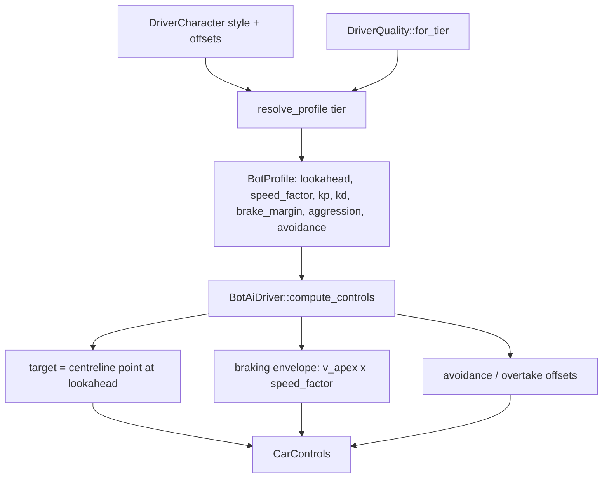
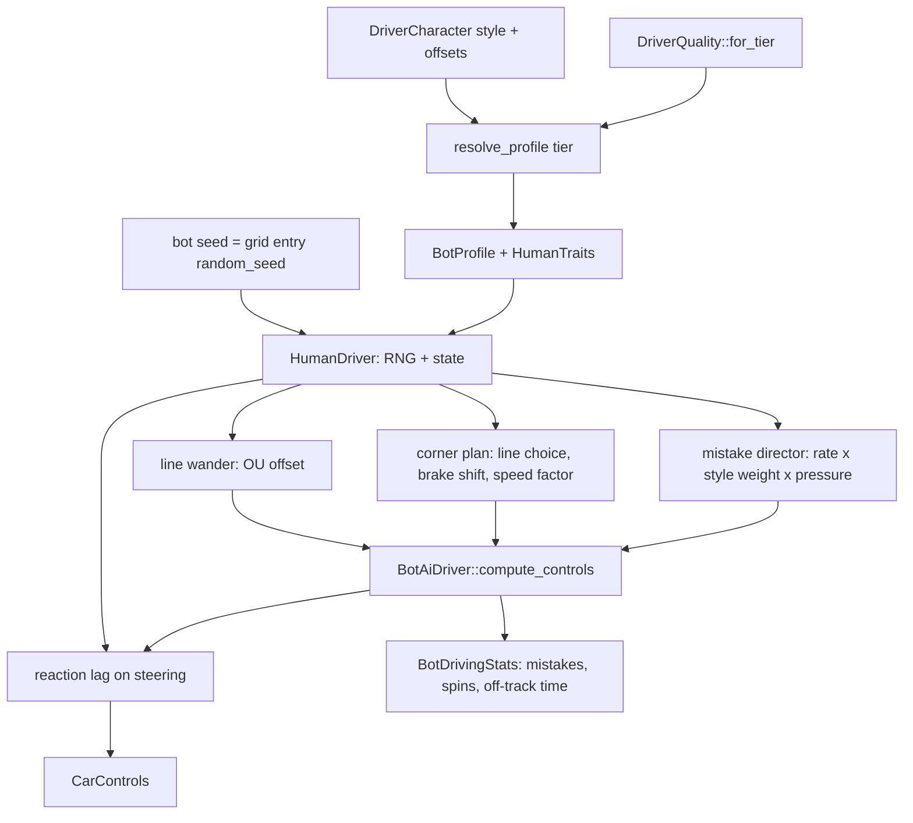

# Architecture Spec: Human-Like Bot Driving with Tiered Mistakes and Varied Lines 🤖🏁

Today every bot drives the track centreline with a PD controller and a braking envelope. There is
no randomness. A bot brakes, turns in and accelerates at the same point on every lap, and it never
makes a mistake. `DriverQuality::composure` exists for each tier, but no driving code reads it.

This spec adds a **human driver model** on top of the existing controller. Each bot gets its own
seeded random number generator (RNG). The RNG drives small, continuous variation (line, braking
point, corner speed, reaction) and rare, discrete **mistakes**. The tier sets how much variation
and how many mistakes. The driving style sets **which kind** of mistake the bot makes.

Goals, from Mario's request:

1. Tier 1 bots are relatively easy to beat. Tier 1 and 2 bots sometimes spin or run wide.
2. Bots do not take the same path, or brake and turn at the same points, on every lap.
3. Bots behave like human players and keep to their driving style.

Out of scope: a computed optimal racing line (see Decision D1), new driving styles, changes to
the vehicle physics of spec [043](043_vehicle_dynamics_rebuild_and_simplified_handling_settings.md),
and changes to career or roster logic.

---

## 🗺️ Current vs. Proposed System Architecture

### 1. Current Architecture



Problems:

- **Same line every lap.** The target point is always on the centreline, plus avoidance and
  obstacle offsets. With no traffic, the path is identical lap after lap.
- **Same braking point every lap.** The braking envelope is a pure function of speed, curvature and
  profile.
- **No mistakes.** Nothing makes a bot overdrive, lock up or spin. Tier only changes pace
  (`pace_limit` 0.88 to 1.04) and safety margins, so a Tier 1 bot is a slow but perfect driver.
- **`composure` is unused.** `consistency` only scales lookahead and the steering damping.
- **Styles differ only in gains.** Aggressive and Smooth bots follow the same line and differ by a
  few percent of pace.

### 2. Proposed Architecture



New module: `crates/tdrace-app/src/ai/humanize.rs`.

- **`HumanTraits`** (plain data, part of `BotProfile`). It is built from style and tier in
  `BotProfile::from_style_and_quality`. `DriverCharacter::resolve_profile` keeps its per-driver
  offsets.
- **`HumanDriver`** (state, part of `BotAiDriver`). It holds the RNG and the current wander offset,
  corner plan and active mistake.
- **`BotAiDriver::with_seed(profile, seed)`** is the new constructor. `BotAiDriver::new(profile)`
  stays and uses seed 0, so existing tests and callers do not change.
- **`compute_controls` keeps its signature.** The human layer changes three inputs to the
  existing controller: the target point (lateral offset), the braking envelope (brake-point shift
  and corner speed factor) and the final steer and throttle (reaction lag and mistake overrides).
- **`BotDrivingStats`** is a read-only counter set on `BotAiDriver`: mistakes by kind, spins,
  off-track time and stuck time. Tests and the benchmark read it. The game ignores it.
- The game creates bots with `BotAiDriver::with_seed(profile, entry.random_seed)`. The grid
  entry seed already comes from the session seed and the bot index. So a race is different each
  time the player starts one, and a fixed seed reproduces a race exactly.

### 3. The human driver model

All numbers below are **starting values**. Task 5 calibrates them against the gates. `c` is
`DriverQuality::consistency`, `k` is `DriverQuality::composure`.

| Tier | c | k |
|---|---|---|
| T1 Rookie | 0.60 | 0.50 |
| T2 Amateur | 0.72 | 0.65 |
| T3 Contender | 0.83 | 0.78 |
| T4 Pro | 0.93 | 0.90 |
| T5 Legend | 0.99 | 0.98 |

#### 3.1 Continuous variation (every bot, every lap)

| Behaviour | Model | Starting value | T1 | T5 |
|---|---|---|---|---|
| Line wander | Ornstein–Uhlenbeck lateral offset (a random walk that drifts back to 0), time constant 3 s, clamped inside the track edge minus 1.2 m | σ = (0.3 + 3.5·(1−c)) m × style line factor | 1.7 m | 0.3 m |
| Corner line choice | Per corner: entry offset to the outside and apex offset to the inside, as a share of the free half-width. Drawn around the style mean. | see §3.3 | wide spread | tight spread |
| Braking point | Per corner: brake onset shifted by a normal random value | σ = (1 + 20·(1−c)) m | 9 m | 1.2 m |
| Corner speed | Per corner: `speed_factor` × (1 + normal random value) | σ = 0.005 + 0.06·(1−c) | 2.9 % | 0.6 % |
| Reaction lag | First-order lag on the steer command | τ = 40 ms + 250 ms·(1−c) | 140 ms | 42 ms |

A "corner" is a run of spline samples whose curvature is above a threshold. The bot draws a new
corner plan when the braking scan finds a new corner ahead. The plan stays fixed until the bot
leaves that corner.

#### 3.2 Mistakes (discrete events)

When the bot draws a corner plan, it also rolls for a mistake:

`p = 0.30 · (1 − k)^1.5 · style_rate · pressure`

| Tier | base p per corner | about per lap (10 corners) |
|---|---|---|
| T1 | 0.106 | 1.0 |
| T2 | 0.062 | 0.6 |
| T3 | 0.031 | 0.3 |
| T4 | 0.010 | 0.1 |
| T5 | 0.001 | 0.01 |

Most mistakes are small (a lost half second). Only some end in a spin or an off. If the roll
succeeds, the bot picks a kind by the style weights in §3.3:

| Kind | What the bot does | Typical result |
|---|---|---|
| **LateBrake** | Brake onset moves 8–25 m later. | Runs wide, cuts the next apex or goes off. |
| **Overdrive** | Corner speed factor +8–18 %. | Understeer and run wide, or a slide. |
| **PowerStab** | For 0.3–0.8 s at the exit, full throttle with the steer held; the bot's own traction guard is off. | Rear steps out; a spin on a rear-drive car. |
| **OverCorrect** | For 0.5 s after a slide starts, the counter-steer gain is × 1.6. | A slide the other way, sometimes a spin. |
| **Cautious** | Brake onset 10–25 m early, or a mid-corner lift. | Lost time, no spin. |

After a spin, the existing stuck and reverse recovery takes over. The bot rejoins the track.

**Pressure.** `pressure = 1 + p_gain·(1 − k)·n`, where `n` is the number of cars within 12 m behind
or alongside, plus a car within 8 m ahead that the bot is attacking. `p_gain` is 2.0, except
Tenacious 3.0 (defends too hard) and Calculating 1.0.

#### 3.3 Style signatures

| Style | Line factor | Line choice (entry / apex share) | style_rate | Mistake weights (LateBrake / Overdrive / PowerStab / OverCorrect / Cautious) |
|---|---|---|---|---|
| Smooth | 0.7 | wide entry, late apex (0.6 / 0.5) | 0.7 | 0.10 / 0.15 / 0.05 / 0.10 / 0.60 |
| Aggressive | 1.2 | tight, dives inside (0.3 / 0.7) | 1.3 | 0.35 / 0.25 / 0.20 / 0.10 / 0.10 |
| Tenacious | 1.0 | medium (0.4 / 0.5) | 1.0 | 0.40 / 0.15 / 0.10 / 0.15 / 0.20 |
| Calculating | 0.8 | wide entry, late apex (0.6 / 0.6) | 0.6 | 0.10 / 0.10 / 0.05 / 0.05 / 0.70 |
| Bold | 1.3 | varied, often tight (0.4 / 0.7) | 1.3 | 0.20 / 0.30 / 0.30 / 0.15 / 0.05 |
| Balanced | 1.0 | medium (0.5 / 0.5) | 1.0 | 0.20 / 0.20 / 0.15 / 0.15 / 0.30 |

**Overtake decisions.** The side choice for a pass today depends only on the lateral position of
the car ahead. The bot adds a random bias to that choice, and a random "commit" delay of 0–0.6 s ×
(1 − aggression). So two bots do not always pass the same way at the same place.

### 4. Tier pace

Tier 1 must be relatively easy to beat. Mistakes and variation make every tier slower. If the
gates in §Verification still show Tier 1 too fast, task 5 may lower `DriverQuality` `pace_limit`
for T1 and T2. The existing monotonic tier tests
(`orthogonal_ai_styles_and_tiers_tests.rs`) must still pass.

### 5. Decision D1 — racing line

| Option | What it is | Cost |
|---|---|---|
| **A (recommended)** | Keep the centreline as the base. Add wander and a per-corner line choice (entry wide, apex inside) from §3.1 and §3.3. | Small. Lines vary, styles look different. Lines are "human", not optimal. |
| B | Compute an optimal racing line for each track, then add the same variation on top. | Large (track baking, new data, all tiers faster). A separate spec. |

This spec implements option A.

---

## 🗄️ Database & Storage Migration Plan

No database, save file or track data changes. `BotProfile` gains a `traits: HumanTraits` field.
`BotProfile` is not serialized. Series TOML keeps its `style` and `tier` fields.

---

## 🔑 Security, Compliance, & IAM Roles

Not applicable. No network, secrets or new dependencies. The RNG is the existing
`ai::driver::LcgRng`.

---

## 🛡️ Disaster Recovery, Monitoring, & Fallbacks

- **Rollback.** `HumanTraits::none()` turns off all variation and mistakes. With it, a bot drives
  exactly as it does today. The gate "Human layer off equals current behaviour" checks this.
- **Metrics.** `BotDrivingStats` and the benchmark report
  (`reports/bot_behaviour_report.md`) show mistakes, spins, off-track time, lap-time spread and line
  spread per tier and style.
- **Replays and LAN.** Ghost replays record only the player car's inputs, so they do not change.
  The implementation checks where LAN bots run; if a client simulates bots, it must use the
  host's seed.

---

## 🧪 Verification & Acceptance Criteria

### Automated Tests

```bash
cargo test -p tdrace-app --test bot_humanlike_driving_tests
```

```bash
cargo test -p tdrace-app --test ai_tests --test adversarial_piece4_tests --test orthogonal_ai_styles_and_tiers_tests --test predefined_driver_behaviours_tests --test driver_character_tests --test dynamic_roster_and_tier_tests
```

```bash
cargo run -p tdrace-app --release --bin bot_behaviour_benchmark
```

The harness drives a full grid of bots, with no human car, for 10 laps on four classic tracks
(Classic GP, Oval Speedway, Drift Park, Kart Arena). It covers 6 styles × 5 tiers with fixed seeds.
The benchmark writes `reports/bot_behaviour_report.md`.

### Manual Acceptance Criteria (Pseudo-Gherkin)

- **Scenario: Same seed gives the same race**
  - [ ] **Given** a bot with a fixed profile and seed 1234 on Classic GP
  - [ ] **When** the harness runs 3 laps twice
  - [ ] **Then** every `CarControls` value is identical on both runs
  - [ ] **And** a run with seed 1235 gives a different path (line spread between runs > 0.3 m)

- **Scenario: Human layer off equals current behaviour**
  - [ ] **Given** a bot built with `HumanTraits::none()`
  - [ ] **When** it drives the existing `ai_tests` scenarios and 3 laps of Classic GP
  - [ ] **Then** its controls match the pre-045 controller output exactly

- **Scenario: Bots do not drive the same path every lap**
  - [ ] **Given** one bot per tier, Balanced style, 10 laps on Classic GP
  - [ ] **When** the harness measures lateral position at 200 fixed track distances
  - [ ] **Then** the mean lap-to-lap standard deviation is ≥ 0.6 m for T1 and ≥ 0.15 m for T5
  - [ ] **And** the brake-onset standard deviation per corner is ≥ 4 m for T1 and ≥ 0.8 m for T5

- **Scenario: Mistakes follow the tier**
  - [ ] **Given** 6 styles × 5 tiers, 10 laps on each of the 4 tracks
  - [ ] **When** the harness counts mistakes per lap
  - [ ] **Then** the rate falls from T1 to T5 (T1 > T2 > T3 > T4 > T5)
  - [ ] **And** T1 is 0.5–1.5 per lap and T5 is ≤ 0.05 per lap
  - [ ] **And** big mistakes (a spin > 90°, or off track > 1 s) are ≥ 0.1 per lap for T1, ≥ 0.05 per lap for T2, and ≤ 0.02 per lap for T4 and T5

- **Scenario: Tier 1 is relatively easy to beat**
  - [ ] **Given** the same car (`classic_gt`) and 10 laps on Classic GP, all styles
  - [ ] **When** mean lap time is compared across tiers
  - [ ] **Then** mean lap time rises from T5 to T1
  - [ ] **And** the T1 mean is ≥ 7 % slower than the T4 mean
  - [ ] **And** the T1 lap-to-lap spread (standard deviation / mean) is ≥ 1.5 %, and T5 is ≤ 0.6 %

- **Scenario: A keyboard reference driver beats Tier 1**
  - [ ] **Given** a reference driver: a T3 Balanced bot with `HumanTraits::none()`, whose steer, throttle and brake are cut to key presses (on / off) and sent through the Balanced player filter and `PlayerHandling`, as a human car
  - [ ] **When** it races a T1 grid (all 6 styles) for 10 laps on Classic GP and Kart Arena
  - [ ] **Then** its mean lap time is lower than the T1 grid mean on both tracks

- **Scenario: Bots keep their driving style**
  - [ ] **Given** the full harness sample
  - [ ] **When** mistakes are grouped by style
  - [ ] **Then** Aggressive and Bold have the highest share of LateBrake + Overdrive + PowerStab mistakes
  - [ ] **And** Smooth and Calculating have the highest share of Cautious mistakes and the fewest spins
  - [ ] **And** Tenacious makes ≥ 1.5× more mistakes per corner with a car within 12 m than in clean air

- **Scenario: No bot gets stuck**
  - [ ] **Given** the full harness sample, including every spin
  - [ ] **When** the harness runs
  - [ ] **Then** every bot completes 10 laps on every track
  - [ ] **And** no bot stays below 2 m/s for more than 6 s after the start

- **Scenario: Existing AI behaviour still works**
  - [ ] **Given** the existing AI test files listed in Automated Tests
  - [ ] **When** they run
  - [ ] **Then** all of them pass

- **Scenario: Playtest — bots feel human**
  - [ ] **Given** a casual race with a Tier 1 and Tier 2 grid, then one with a Tier 4 grid, Balanced preset
  - [ ] **When** Mario races them
  - [ ] **Then** Mario beats the Tier 1 grid
  - [ ] **And** Mario sees at least one bot spin or run wide in the Tier 1/2 race
  - [ ] **And** the bots do not follow one another like a train on the same line

---

## 🔗 Traceability & Codebase Mapping

### Created/Modified Files

- `[ ]` `crates/tdrace-app/src/ai/humanize.rs` (new) → `HumanTraits`, `HumanDriver`, line wander, corner plan, mistake director, `BotDrivingStats`.
- `[ ]` `crates/tdrace-app/src/ai/mod.rs` → `BotProfile.traits`, `BotAiDriver::with_seed`, human layer hooks in `compute_controls`, overtake decision noise.
- `[ ]` `crates/tdrace-app/src/ai/driver.rs` → `resolve_profile` keeps traits from style and tier.
- `[ ]` `crates/tdrace-app/src/game/mod.rs` → bots built with `BotAiDriver::with_seed` from the grid entry seed.
- `[ ]` `crates/tdrace-app/tests/bot_humanlike_driving_tests.rs` (new) → the gates above.
- `[ ]` `crates/tdrace-app/src/bin/bot_behaviour_benchmark.rs` (new) → writes `reports/bot_behaviour_report.md`.
- `[ ]` `reports/bot_behaviour_report.md` (generated) → per-tier and per-style numbers.

### Verification Assertions

- `crates/tdrace-app/src/ai/humanize.rs` names `specs/045_humanlike_bot_driving_with_tiered_mistakes_and_varied_lines.md` in its header comment.
- Every gate that task 5 restates (a changed number or a changed measure) is recorded in this spec with the reason, as in spec 043.
