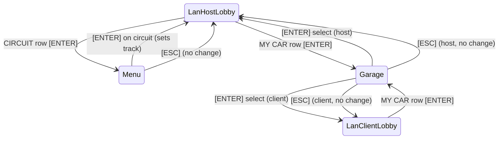

# Feature Spec: LAN Lobby Reuses Circuit Selector and Garage 🌐

Quick Race, Career and Split Screen use two shared screens: the full-screen circuit selector (`GameState::Menu`) and the Garage (`GameState::Garage`). The LAN lobbies (spec 036) do not. They cycle short, hard-coded lists inside the lobby screen. This spec makes the LAN lobbies open the same two screens, and return to the lobby with the choice applied.

---

## 🔍 Review of the Current LAN Interface

| # | Defect | Where |
|---|---|---|
| L-1 | The host cycles circuits with ENTER on one row. The list is `TrackChoice::ALL` for **all** modules, so a GT host can pick a kart track. The row shows the raw slug (e.g. `spa_francorchamps`), not the title. There is no preview. | `game/mod.rs` `select_lan_hub_option`, `host_screen.rs` `cycle_track` |
| L-2 | The first host track list is five made-up names ("Circuit de Spa-Francorchamps", …) that are not track slugs. `with_tracks` replaces them, but the defaults are dead data. | `host_screen.rs::new` |
| L-3 | The host can not change the own car or livery in the lobby. The host car is the car that was selected before the lobby opened. Spec 036 wireframe 2 shows "[C] Change My Car / Livery", but `C` copies the IP. | `host_screen.rs` |
| L-4 | The client cycles six hard-coded cars (5 GT + 1 kart) and nine hard-coded liveries. The list ignores the host discipline, career unlocks and the catalog. | `client_lobby_screen.rs::new` |
| L-5 | Slot rows show raw ids (`gt_ferrari_296_gt3: corsa_red`). The client header shows the track slug. | `host_screen.rs::draw`, `client_lobby_screen.rs::draw` |
| L-6 | When the host changes the circuit, `LanHost.discipline` stays at the bind value, so the beacon can advertise the wrong discipline. Fixed by design: the selector only offers circuits of the bind module, so no setter is needed. | `host.rs::set_track_and_rules` |
| L-7 | The host can pick a custom circuit (via `track_choice` at bind). A client does not have that file, so `launch_lan_race_session` falls back to `ClassicGrandPrix` on the client only. The two machines race on different tracks. | `game/mod.rs::launch_lan_race_session` |

Related work: spec 044 (`feat/robust-lan-race-sync`) replaces the in-race netcode and also edits `host_screen.rs`, `client_lobby_screen.rs` and the LAN launch path in `game/mod.rs`. This spec changes only the lobby rows, the sub-screen flow and the keep-alive pump, not the launch or race packets. The branch merged second must resolve the overlap in those files.

Out of scope (tracked separately): the LAN hub card screen, the join browser, and the failing test `test_lan_livery_synchronization_and_countdown_handshake` (`tdrace-lan-countdown-is-in-race-qj0h`).

---

## 🗺️ User Flow & Interface Design

### 1. Flow



- New `MenuOrigin::LanHostLobby`. In this origin the circuit selector:
  - shows only official circuits of the host module (the Custom tab is not available, see L-7);
  - on confirm, sets the host track and returns to `GameState::LanHostLobby`. It does **not** call `init_race`;
  - on ESC, returns to `GameState::LanHostLobby` with no change;
  - disables the shortcuts that leave the LAN flow (Garage `G`, Track Manager `T`, championship `F`, Profile `P`, Controls `K`, Settings `X`/`O`) and hides their key hints. The circuit viewer (`V`) stays available and returns to the selector.
  - The confirm hint reads `SET AS LAN CIRCUIT` instead of `TO RACE`.
- New `GarageOrigin::LanLobby`. In this origin the Garage:
  - opens on the lobby module and on the tier of the current car;
  - on select, sets the player car and returns to the lobby that opened it;
  - on ESC, returns to that lobby with no change;
  - disables module switching (keys `1..5`) and the fleet gallery (its tabs switch module), so the car is always from the host discipline, and hides their key hints;
  - keeps the normal career unlock and buy rules.

### 2. Lobby rows

Host lobby (right panel), top to bottom:

| Row | Action |
|---|---|
| CIRCUIT: *title* | Opens the circuit selector |
| LAPS | Cycles laps (unchanged) |
| COLLISIONS | Cycles mode (unchanged) |
| MY CAR: *catalog name* | Opens the Garage |
| MY LIVERY: *name* | Cycles livery |
| MY STATUS | Toggles host ready (unchanged) |
| START RACE | Unchanged |
| DISBAND ROOM | Unchanged |

Client lobby (right panel): MY CAR (opens the Garage), MY LIVERY (cycles), READY, LEAVE ROOM.

Slot rows on both lobbies show the catalog car name and the livery name. The client header shows the circuit title.

### 3. Network keep-alive

While the host or client is in the circuit selector, the circuit viewer or the Garage, `RaceSession::update` calls a new `pump_network(dt)` on the parked lobby screen every frame. This processes packets, pings and timeouts, but not lobby input. So:
- no peer times out (host timeout 3.5 s, client timeout 4.5 s);
- if the client is disconnected while in the Garage, the game returns to `GameState::LanHub { selected_idx: 1 }`;
- when a client opens the Garage, the client sends `is_ready = false`, so the host can not start the race while the client is choosing.

---

## ⚙️ Backend Models & API Endpoints

No wire protocol change. This spec adds no packet and does not change `PROTOCOL_VERSION`.

### `cabinet::net` API changes

```rust
/// Request from a LAN lobby screen that the game must open one of its own screens.
pub enum LanLobbyRequest { PickCircuit, PickCar }

impl CabinetLanHostScreen {
    pub fn new(host: LanHost) -> Self;                       // no default track list
    pub fn set_track(&mut self, track_id: &str, title: &str); // replaces available_tracks / cycle_track / with_tracks
    pub fn set_local_car(&mut self, car_model_id: &str);      // calls LanHost::update_host_slot
    pub fn take_request(&mut self) -> Option<LanLobbyRequest>;
    pub fn pump_network(&mut self, dt: f32);
    pub fn with_labels(self, car_label: fn(&str) -> String) -> Self;
}

impl CabinetLanClientLobbyScreen {
    pub fn set_local_car(&mut self, car_model_id: &str);      // replaces car_models / cycle_car
    pub fn set_ready(&mut self, is_ready: bool);
    pub fn take_request(&mut self) -> Option<LanLobbyRequest>;
    pub fn pump_network(&mut self, dt: f32);
    pub fn with_labels(self, car_label: fn(&str) -> String, track_label: fn(&str) -> String) -> Self;
}

```

Livery lists stay in `cabinet`, shared by both screens (one const table instead of the client-only list).

### `tdrace-app` changes
- `MenuOrigin::LanHostLobby`, `GarageOrigin::LanLobby`.
- `RaceSession::lan_lobby_module()` returns the lobby module: `active_module_id` on the host; the module of the loaded host track on the client.
- On host open: if `track_choice` is not an official, unlocked circuit of the active module, the lobby starts on the first unlocked official circuit of that module.
- On client join: if the car sent in the join request is not from the lobby module, the client lobby replaces it with a tier-1 car of that module.

---

## 🛡️ Security & Role-Based Access Controls (RBAC)

- Only the host can open the circuit selector (the client lobby has no CIRCUIT row).
- The host remains the only authority for track, laps and collisions. No new packets, so the spec 036 packet sanitization is unchanged.
- The car id sent by a client is still canonicalized by `canonicalize_car_model_id` at race launch.

---

## 🧪 Verification & Acceptance Criteria

### Automated Tests
- `cargo test -p cabinet --test net_tests`
- `cargo test -p tdrace-app --test lan_integration_tests`
- `cargo test --workspace --exclude tdrace-py` (known unrelated failures are listed in Beads)
- Screenshots with `tdrace-app --gt --lan-host [circuit|car] --screenshot <png>` for the host lobby, the selector and the Garage in LAN origin.
- Open: the module-key lock in the Garage needs a real key press (`2`, `C`), which the headless tests can not send. Check it by hand: `tdrace-app --gt --lan-host car`, press `2` and `C`, the module must stay GT.

### Manual Acceptance Criteria (Pseudo-Gherkin)

- **Scenario: Host picks the circuit in the full-screen selector**
  - [x] **Given** a host lobby in the GT module
  - [x] **When** the host presses ENTER on the CIRCUIT row
  - [x] **Then** the full-screen circuit selector opens with only official GT circuits
  - [x] **When** the host presses ENTER on a circuit
  - [x] **Then** the game returns to the host lobby, the CIRCUIT row shows that circuit title, and `LanHost::track_id()` is its slug

- **Scenario: ESC from the selector keeps the circuit**
  - [x] **Given** the circuit selector opened from the host lobby
  - [x] **When** the host presses ESC
  - [x] **Then** the game returns to the host lobby and the track is unchanged

- **Scenario: Host picks the own car in the Garage**
  - [x] **Given** a host lobby
  - [x] **When** the host presses ENTER on MY CAR and selects an unlocked car in the Garage
  - [x] **Then** the game returns to the host lobby and slot 1 shows that car name
  - [x] **And** the client lobby shows the new car in slot 1

- **Scenario: Client picks the car in the Garage**
  - [x] **Given** a client in the lobby of a GT host, marked READY
  - [x] **When** the client presses ENTER on MY CAR
  - [x] **Then** the Garage opens on GT cars and the client slot becomes not ready on the host
  - [x] **When** the client selects a car
  - [x] **Then** the game returns to the client lobby and the host shows the new car name in the client slot

- **Scenario: Garage in LAN origin stays in the host discipline**
  - [ ] **Given** the Garage opened from a LAN lobby of a GT host
  - [ ] **When** the player presses `2` (rally) or `C` (fleet gallery)
  - [ ] **Then** the module stays GT and the fleet gallery does not open

- **Scenario: Network stays alive while a sub-screen is open**
  - [x] **Given** a host and a client in the lobby
  - [x] **When** the client stays in the Garage for 10 s
  - [x] **Then** the client is still in slot 2 on the host and still connected

- **Scenario: Disconnect while in the Garage**
  - [x] **Given** a client in the Garage opened from the client lobby
  - [x] **When** the host disbands the room
  - [x] **Then** the client returns to `GameState::LanHub { selected_idx: 1 }`

- **Scenario: Custom circuits are not offered**
  - [x] **Given** a profile with custom circuits and the selector opened from the host lobby
  - [x] **When** the host presses LEFT / RIGHT / TAB
  - [x] **Then** the filter stays on official circuits

---

## 🔗 Traceability & Codebase Mapping

### Created/Modified Files
- `[x]` `crates/cabinet/src/net/ui/host_screen.rs` -> CIRCUIT / MY CAR / MY LIVERY rows, `LanLobbyRequest`, `pump_network`, labels.
- `[x]` `crates/cabinet/src/net/ui/client_lobby_screen.rs` -> MY CAR / MY LIVERY rows, `LanLobbyRequest`, `pump_network`, labels; hard-coded car list removed.
- `[x]` `crates/cabinet/src/net/ui/mod.rs`, `crates/cabinet/src/net/mod.rs` -> export `LanLobbyRequest` and the shared livery table.
- `[x]` `crates/tdrace-app/src/game/mod.rs` -> new origins, open/return paths, keep-alive pump, lobby module.
- `[x]` `crates/tdrace-app/src/ui/menu.rs` -> confirm hint, subtitle and footer for the LAN origin; Circuit Manager badge hidden.
- `[x]` `crates/tdrace-app/src/ui/garage.rs` -> module and gallery key hints hidden when the module is locked.
- `[x]` `crates/tdrace-app/src/main.rs` -> `--lan-host [circuit|car]` flag for screenshots.
- `[x]` `crates/cabinet/tests/net_tests.rs`, `crates/tdrace-app/tests/lan_integration_tests.rs` -> tests for the scenarios above.

### Verification Assertions
- `grep -n "cycle_track\|cycle_car\|available_tracks\|car_models" crates/cabinet/src/net/ui` returns nothing.
