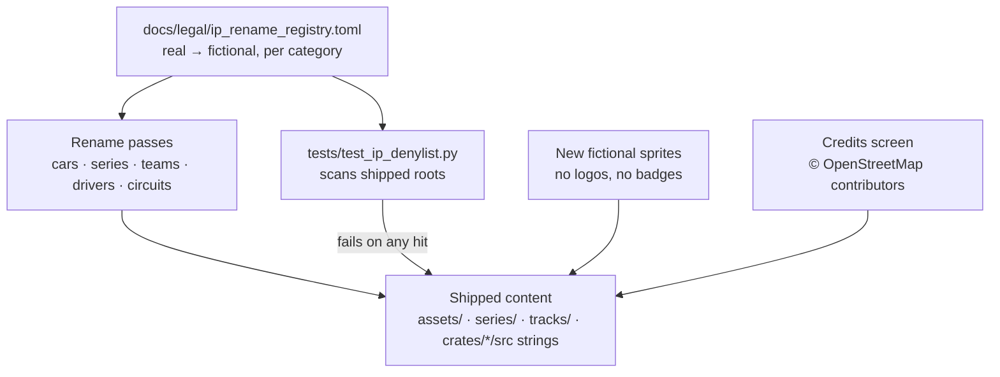

# Architecture Spec 047: Fictional Branding and Real-World IP Removal for Steam Release 🏷️

TdRace will be sold on Steam. Today the build ships real car brands, real series names, real and look-alike drivers, real team and sponsor names, real circuit names, Wikimedia Commons photos without licence data, and car sprites that carry real logos (Ferrari prancing horse, Shell, Pirelli, DENSO, Michelin, Traxxas, Goodyear). Any rights holder can send Valve a takedown notice. Valve then removes the game.

This spec takes **Option A: go fictional**. Every player-visible real-world brand, person, or venue name becomes a fictional one. Track **layouts stay** (a circuit shape is a fact, and we derived it from OpenStreetMap). The game stays as it plays today; only names, art, and credits change.

> This spec is an engineering plan, not legal advice. A games/IP lawyer reviews the result before launch (task in the epic).

---

## 🎯 Objectives

1. No real maker, model, series, sanctioning body, team, sponsor, driver, or circuit trademark appears in any shipped file or player-visible string.
2. No unlicensed third-party image ships. No sprite carries a real logo, badge, or sponsor decal.
3. Real track geometry stays. OpenStreetMap data gets the attribution that its ODbL licence requires.
4. A test fails the build if a denylisted real-world name comes back.
5. Store-page copy and screenshots follow the same rules.

### Out of Scope
- Physics, handling, balance of performance, and track geometry. They do not change.
- Licensing any real brand (that was Option B, rejected).
- Engine audio. All 30 WAVs are synthesised by `crates/tdrace-app/src/audio/samples.rs` (spec 022). This spec verified them as clean.

---

## 🗺️ Current vs. Proposed System Architecture

### 1. Current State (inventory, 2026-09-28)

| Category | Where | Size | Player-visible |
|---|---|---|---|
| Real cars | `crates/tdrace-app/src/catalog/mod.rs:540-2509` (`ALL_REAL_CARS`), plus copies in `cabinet/src/net/ui/client_lobby_screen.rs:52-59`, `profile/mod.rs:381-405`, `ui/profile_ui.rs`, `ui/menu.rs:2579-2643`, `game/mod.rs`, `render/vehicle_assets.rs`, `render/lateral.rs` (about 75 `render_<model>` fns), `render/car.rs`, `DriverFavoriteCar` tables in `ai/driver.rs` and `module/*.rs`, 25 series TOMLs, `portals/shared/data/vehicles.json` | 80 cars | Yes: name, manufacturer, category, `history_bio` |
| Car photos | `assets/textures/vehicles/references/**` (downloaded from Wikimedia Commons by `scripts/download_references.py`, no author or licence data) | 80 JPG + 3 dossiers | Portal only, but `scripts/package_windows.sh:126-127` copies all of `assets/` into the build |
| Car sprites | `assets/textures/vehicles/{laterals,topdown}/**`, loaded by `render/vehicle_assets.rs:156,234-241` | about 150 real-car sprites | Yes. Many carry real logos |
| Series / bodies | `fn title` and header badges in each `module/{gt,nascar,rally,kart,extreme_offroad}.rs`, `arcade-race-core/src/car_category.rs:44-55`, `ui/career_select.rs`, `ui/career_hub.rs`, `ui/menu.rs`, `ui/garage.rs`, `ui/track_manager_ui.rs`, `ui/profile_ui.rs`, tier labels and `category_name` in `catalog/mod.rs`, championship names in `module/*.rs`, series TOML `name` values | NASCAR, ARCA Menards, Craftsman, Trans-Am, FIA, SRO, WEC, Le Mans, World RX, Euro RX, GT World Challenge, Dakar, Baja 500, Stadium Super Trucks, Supercross, Rotax, Monster Jam | Yes |
| Drivers | `fn drivers` in `module/nascar.rs`, `module/gt.rs`, `module/rally.rs`; driver tuples in `game/mod.rs` (e.g. `joey_logano`); entrants in 4 GT and 5 rally series TOMLs | Real names unchanged (e.g. Joey Logano) and thin parodies (e.g. "Richard 'The King' Pettyfield", "Dale 'The Intimidator' Vance") | Yes |
| Teams | `ui/series_editor.rs` team match, driver tuples in `game/mod.rs`, series TOMLs | Richard Childress Racing, Hendrick, Team Penske, 23XI, Joe Gibbs, Ferrari AF Corse, Toyota Gazoo Racing, Monster Energy RX, and others | Yes |
| Circuits | Only in the tdrace-tracks repo since spec 042: `tracks/<module>/<id>.json` fields `name`, `description`, `tag`, `category_label`, `wikipedia_url`, `osm_url`, `country_*`, and scenery feature names. `crates/tdrace-core/build.rs` embeds `tracks/` into the binary. `tracks/.aliases.json` maps old ids. `portals/shared/data/circuits.json` is generated by `scripts/generate_asset_data.py` | 71 real circuits | Yes: `name`, `description`, `tag`, `category_label` (e.g. "Official GP Circuit"), feature names |
| Brand names inside venue text | "Red Bull Ring", "Lucas Oil Indianapolis Raceway Park", Loews, Castrol-S, Mercedes Arena, Dunlop, Porsche Curves, Curva Renault, Campsa, "Oldsmobile Hill Leap", "Potawatomi Tabletop" (all in track JSON) | about 15 | Yes |
| Raw OSM extracts | `assets/osm/*.osm` (added by spec 042); `scripts/package_windows.sh` copies all of `assets/` | 85 files | No, but they ship |
| OSM attribution | None in game, portals, or store. Tracks repo has no LICENSE | — | Missing |

### 2. Proposed State

- **One registry** (`docs/legal/ip_rename_registry.toml`) maps each real name to its fictional name, grouped by category. It is the single source of truth for the rename passes and for the denylist. It lives in `docs/`, so it never ships.
- **Rename passes** apply the registry to code, TOML, JSON, sprites, and portal data.
- **Denylist gate** (`tests/test_ip_denylist.py`, run by `make test-python`) reads the `real` names from the registry and fails if any appears in a shipped root. For track JSON it scans the player-visible fields (`name`, `description`, `tag`, `category_label`, scenery feature names). It skips `tracks/.aliases.json`, `wikipedia_url`, `osm_url`, and `country_*`, because players never see them.
- **Credits screen** in the Options menu shows the OSM attribution.

---

## 📐 Naming Rules

1. **Cars:** fictional maker plus fictional model. The name must not echo a real maker or model (no "Ferrati", no "911"). The body shape must not copy a distinctive real design (grille, lights, silhouette). The class feel may stay ("front-engine V8 GT").
2. **Series and bodies:** generic words are allowed ("Stock Car", "Rallycross", "Shifter Kart", "Desert Raid", "Endurance"). No real series, sanctioning body, or event name.
3. **Drivers:** fully fictional names. No real surnames, no parody spellings, no real nicknames ("The King", "Sliced Bread", "Rowdy", "Papaya Prodigy").
4. **Teams and sponsors:** fully fictional. No real team, sponsor, energy drink, oil, tyre, or fuel brand.
5. **Circuits:** a fictional venue name. A plain geographic word is allowed only where it is not the circuit's own brand. For example, "Monaco", "Le Mans", "Silverstone", "Nürburgring", "Daytona", "Indianapolis", "Talladega", and "Spa" are circuit brands, so they are not allowed. Country and region words ("Principality", "Ardennes", "Florida") are allowed.
6. **Corner and feature names:** replace all real corner names in shipped text (Eau Rouge, Loews, Maggotts, etc.) with fictional or descriptive names ("Hotel Hairpin", "Forest Climb").
7. **No association claims:** no shipped text or store copy says "inspired by", "based on", "official", or "the real …" about a real venue, car, or series. Track `category_label` values such as "Official GP Circuit" become neutral ("Grand Prix Circuit").
8. **Internal IDs:** a car id, driver id, series file name, or Rust fn name must not contain a real maker, model, series, sponsor, team, or person name. Circuit ids follow decision D4.

---

## 🗄️ Database & Storage Migration Plan

IDs that break rule 8 get renamed (for example `gt_ferrari_296_gt3`, `joey_logano`, `nascar_*.toml`). These IDs are persisted:

- SQLite (`crates/tdrace-app/src/db/mod.rs`): `profile_module_progress.unlocked_cars`, `profile_championship_awards.car_model_id`, `career_rivals` (id + display name), `race_history.car_name` and `hall_of_fame.car_name` (display names), `championship_name`.
- User copies of series TOMLs in `<userdata>/series` (`series/manager.rs`).
- LAN protocol `car_model_id` (`cabinet/src/net/protocol.rs`). Both peers run the same build, so no compatibility layer is needed.
- Circuit ids (track JSON file names) are used by saves, series TOML, and the Hall of Fame. A renamed circuit id gets its old id added to `tracks/.aliases.json`, so references still resolve.

**Decision D1 (proposed): no in-game migration.** The game is not released, so no player saves exist. Developers reset local data once after the rename (delete `tdrace_records.db` and `<userdata>/series`). If the human rejects D1, add a one-shot legacy-ID alias table that rewrites old IDs and display names on first load.

---

## 🔑 Security, Compliance, & IAM Roles

- **OpenStreetMap (ODbL 1.0):** show "Map data © OpenStreetMap contributors, available under the Open Database License (ODbL)" on a Credits screen, in the README, and on the Steam store page. The tracks JSON is a derivative database that ships in the game, so the `tdrace-tracks` repo gets an ODbL `LICENSE` and stays publicly available.
- **Images:** delete all Wikimedia Commons photos and their download scripts. Every shipped image is either made by us or has a recorded licence that allows commercial use.
- **Packaging:** `scripts/package_windows.sh` copies `assets/` whole. The raw OSM extracts in `assets/osm/` are build inputs, not game content, and they carry OSM contributor user names. The package script excludes `assets/osm/`. Everything else left in `assets/` must be shippable.
- **Portals:** `portals/` is not deployed today. Its data regenerates from the renamed sources, so it becomes safe to publish later.
- **Human legal review:** a games/IP lawyer reviews the final build and the store page before launch.

### Open Decisions (for approval)

- **D1 — Save migration:** none, reset dev data (recommended). Alternative: legacy-ID alias table.
- **D2 — Class labels "GT1–GT4":** these are FIA/SRO class names, and "GT3" is also a Porsche model name. Recommended: rename player-visible labels to "GT Tier 1–4" (or fictional class names), keep the generic "GT" word, and keep internal IDs such as `gt3_*`. Alternative: keep "GT3/GT4" as generic class terms.
- **D3 — Name approval:** the registry (task 1) is reviewed and approved by the human before any rename pass starts (recommended).
- **D4 — Circuit ids:** ids such as `monza` or `daytona_superspeedway` are real names, but players never see them. Recommended: keep venue ids, and rename only ids that contain a sponsor, series, or event brand (e.g. `red_bull_ring`, `baja_500_desert_scrub`), adding each old id to `tracks/.aliases.json`. Alternative: rename every real circuit id, with aliases.

---

## 🛡️ Disaster Recovery, Monitoring, & Fallbacks

- Each rename pass is one atomic commit. `git revert <sha>` undoes one pass.
- The registry keeps the real → fictional map, so a pass can be re-run or reversed by script.
- Track geometry is untouched. Only `name`, `description`, and feature names in track JSON change, so physics tests stay a valid regression check.

---

## 🧪 Verification & Acceptance Criteria

### Automated Tests
- Denylist gate: `uv run pytest tests/test_ip_denylist.py`
- Full suites: `make test` (Rust + Python) and `cargo clippy --workspace --all-targets -- -D warnings`
- Spec integrity: `keel validate .`

### Manual Acceptance Criteria (Pseudo-Gherkin)

- **Scenario: Shipped content holds no denylisted name**
  - [ ] **Given** the approved registry in `docs/legal/ip_rename_registry.toml`
  - [ ] **When** `uv run pytest tests/test_ip_denylist.py` scans `assets/`, `series/`, the player-visible fields of `tracks/<module>/<id>.json`, and the non-test string literals in `crates/*/src`
  - [ ] **Then** the test passes with zero hits

- **Scenario: The gate catches a regression**
  - [ ] **Given** a scratch edit that adds the string "Porsche 911 GT3 R" to a series TOML
  - [ ] **When** the denylist test runs
  - [ ] **Then** it fails and names the file, line, and matched term

- **Scenario: No third-party photo ships**
  - [ ] **Given** a Windows package built by `scripts/package_windows.sh`
  - [ ] **When** the staged `assets/` folder is listed
  - [ ] **Then** `textures/vehicles/references/` and `osm/` do not exist, and no JPG from Wikimedia Commons is present

- **Scenario: Car sprites carry no real logos**
  - [ ] **Given** every PNG in `assets/textures/vehicles/{laterals,topdown}/`
  - [ ] **When** a human reviews a contact sheet of all sprites
  - [ ] **Then** no sprite shows a real maker badge, sponsor decal, tyre brand, or fuel brand, and no body copies a distinctive real design

- **Scenario: Player sees only fictional names**
  - [ ] **Given** a fresh profile
  - [ ] **When** the player opens the garage, each career hub, each championship, the track list, the LAN lobby, and a race grid in every module
  - [ ] **Then** every car, series, team, driver, and circuit name shown is in the registry's fictional column

- **Scenario: Track layouts are unchanged**
  - [ ] **Given** the track JSON files before and after the rename
  - [ ] **When** the `spline`, `geometry`, `checkpoints`, `grid_positions`, and scenery geometry fields are compared
  - [ ] **Then** they are identical, and the existing circuit geometry tests pass

- **Scenario: OpenStreetMap attribution is visible**
  - [ ] **Given** the main menu
  - [ ] **When** the player opens Options → Credits
  - [ ] **Then** the screen shows "Map data © OpenStreetMap contributors" and names the ODbL licence, and the `tdrace-tracks` repo contains an ODbL `LICENSE`

- **Scenario: Store page follows the naming rules**
  - [ ] **Given** the draft Steam store text and screenshots
  - [ ] **When** they are checked against `docs/legal/steam_store_ip_checklist.md`
  - [ ] **Then** they contain no real name, no "inspired by" claim, no real logo, and they include the OSM credit

- **Scenario: Legal sign-off before launch**
  - [ ] **Given** all scenarios above pass
  - [ ] **When** a games/IP lawyer reviews the build and store page
  - [ ] **Then** the lawyer's findings are recorded and every blocking finding is closed

---

## 🔗 Traceability & Codebase Mapping

### Created/Modified Files
- `[ ]` `docs/legal/ip_rename_registry.toml` -> Real → fictional name registry (source of truth, not shipped).
- `[ ]` `docs/legal/steam_store_ip_checklist.md` -> Store page and marketing rules.
- `[ ]` `tests/test_ip_denylist.py` -> Denylist gate over shipped roots.
- `[ ]` `crates/tdrace-app/src/catalog/mod.rs` -> Fictional car catalog and tier labels.
- `[ ]` `crates/tdrace-app/src/render/{lateral.rs,vehicle_assets.rs,car.rs}` -> Renamed render fns and sprite paths.
- `[ ]` `crates/tdrace-app/src/module/{gt,nascar,rally,kart,extreme_offroad}.rs` -> Titles, championships, drivers, favourite cars, track cards.
- `[ ]` `crates/tdrace-app/src/ai/driver.rs` -> Favourite-car tables.
- `[ ]` `crates/tdrace-app/src/ui/{career_select,career_hub,menu,garage,track_manager_ui,profile_ui,series_editor}.rs` -> Series and team labels; Credits entry.
- `[ ]` `crates/tdrace-app/src/game/mod.rs` -> Team lists; Credits game state.
- `[ ]` `crates/tdrace-app/src/profile/mod.rs` -> Starter car IDs.
- `[ ]` `crates/cabinet/src/net/ui/client_lobby_screen.rs` -> Lobby car list.
- `[ ]` `crates/arcade-race-core/src/car_category.rs` -> Category titles.
- `[ ]` `tracks/.aliases.json` (tdrace-tracks repo) -> Old ids for any circuit id renamed under D4.
- `[ ]` `scripts/package_windows.sh` -> Excludes `assets/osm/`.
- `[ ]` `series/**/*.toml` -> Series names, entrants, teams, `car_model_id`.
- `[ ]` `tracks/**/*.json` (tdrace-tracks repo) -> `name`, `description`, `tag`, `category_label`, feature names; plus `LICENSE` (ODbL).
- `[ ]` `assets/textures/vehicles/{laterals,topdown}/**` -> Fictional sprites.
- `[ ]` `assets/textures/vehicles/references/**`, `scripts/download_references.py`, `scripts/download_missing_refs.py` -> Deleted.
- `[ ]` `portals/shared/data/{vehicles,circuits}.json`, `assets/textures/circuits/**` -> Regenerated by `scripts/generate_asset_data.py`.
- `[ ]` `README.md` -> OSM attribution.

### Verification Assertions
- `tests/test_ip_denylist.py` references `specs/047_fictional_branding_and_realworld_ip_removal_for_steam_release.md` in its module docstring.
- The Credits screen source references this spec in its header comment.
