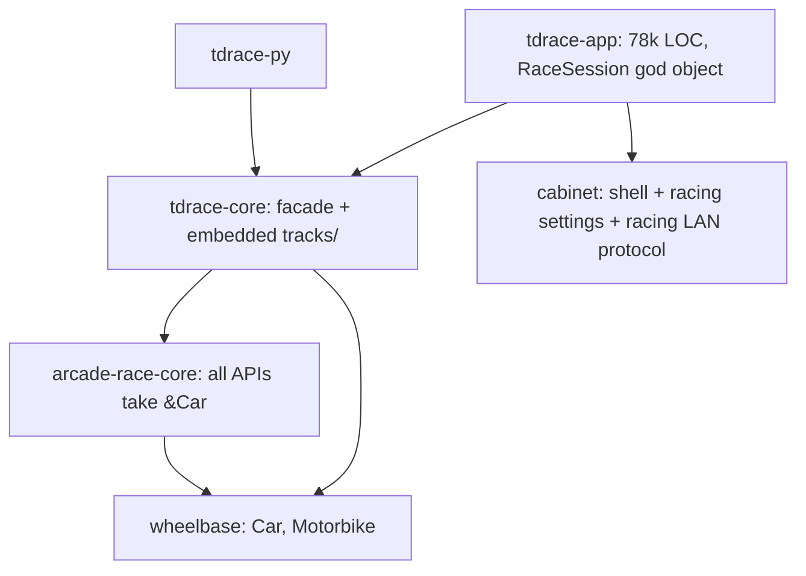
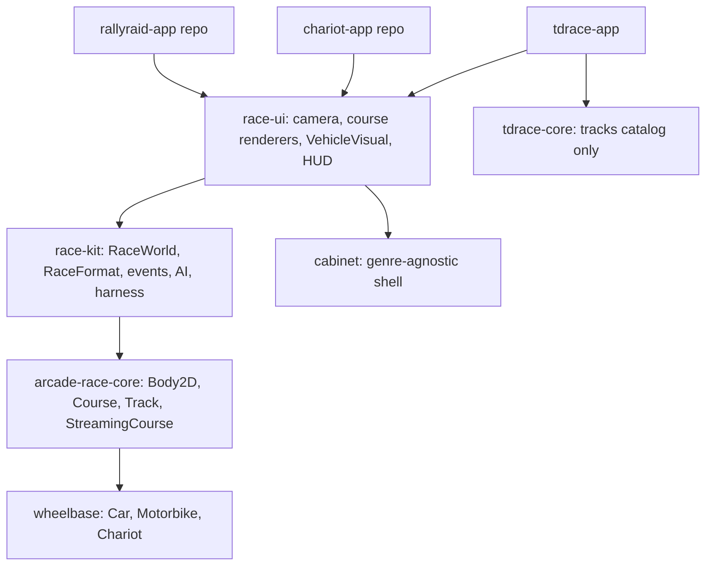

# Architecture Spec: Reusable Racing Platform Layers 🏗️

This spec sets the target architecture and the phase order that let new top-down 2D
racing games reuse the TdRace crates. Each new game lives in its own repo:

1. **Roman chariot races (priority 1).** A horse-drawn chariot races on a closed oval,
   the Circus Maximus. Crashes and wrecks matter.
2. **Rally-raid (priority 2).** An endless top-down scroller. Stages are generated on the
   fly from GPX data plus procedural detail. There are no laps.

The as-built analysis behind this spec is
[`docs/engineering/racing_platform_analysis.md`](../docs/engineering/racing_platform_analysis.md).
Gap ids below (E1, S1, A1, ...) refer to that document.

**What this spec contains:**
- the target layering
- the phase roadmap
- **Phase 0**, the determinism safety net that every later phase relies on

Phases 1-9 each get their own spec, epic and branch when they start.

---

## 🧭 Decisions (Mario, 2026-09-28)

| Question | Decision | Consequence |
|---|---|---|
| Where the new games live | Separate repos | Games use the shared crates as git dependencies, pinned by tag. Shared crates must build without this repo's `tracks/` submodule. |
| tdrace during the refactor | tdrace switches over to each new layer (strangler pattern) | No copies. The real game proves the extracted code. |
| Rally-raid course size | Endless, streamed, built from GPX | Needs a `Course` abstraction, chunk streaming and a floating origin. |
| Unmerged spec 006 branch | Park it | Spec 006 goes back to `draft`. Branching returns later as one more `Course` implementation. |
| Priority | Chariot before rally-raid | Open courses and streaming come after the chariot phase. |

---

## 🗺️ Current vs. Proposed System Architecture

### 1. Current Architecture

The engine crates exist, but they only work with `wheelbase::Car` on a closed loop that
is fully loaded in memory (E1-E5). Race rules, the step order and every presentation side
effect sit inside `RaceSession` (A1, A2). Three copies of the step order exist.

### 2. Proposed Architecture

Layer responsibilities:

| Layer | Owns | Must not own |
|---|---|---|
| `wheelbase` | Vehicle models and tire math | Track, course or race knowledge |
| `arcade-race-core` | `Body2D` and `Course` traits, `Track`, spline, collision, gates, progress, LIDAR, later `StreamingCourse` | Product categories (GT, NASCAR, ...), module ids, rendering |
| `race-kit` (new) | `RaceWorld<V, C>`, `RaceFormat`, events, finish/DNF/results, standings, AI, harness, stage series | macroquad, rusqlite, chrono, `std::time` |
| `race-ui` (new) | Camera, course/barrier/scenery renderers, `VehicleVisual`, FX, HUD primitives, asset root | tdrace content, tdrace-core |
| `cabinet` | Screens, widgets, FX, audio, profiles, records, input, LAN transport | Racing settings, racing payloads |
| games | Content, screens, game-specific vehicles | Engine logic |

---

## 🛣️ Phase Roadmap (chariot first)

| # | Phase | Needed by | Estimate |
|---|---|---|---|
| 0 | Determinism safety net (this spec) | all | 2-3 days |
| 1 | `Body2D` trait: engine generic over the vehicle | chariot, rally | 3-5 days |
| 2 | `race-kit` headless world: laps, wrecks, DNF, real times | chariot, rally | 2-3 weeks |
| 3 | `race-ui` primitives: multi-part sprites, chase camera, mesh cache | chariot, rally | 1.5-2 weeks |
| 4 | Publish-ready shared crates: tags, READMEs, minimal example | chariot, rally | 2-3 days |
| 5 | Chariot model in `wheelbase`, plus the `chariot-app` repo | chariot | 3-4 weeks |
| 6 | Open point-to-point courses | rally | 1-1.5 weeks |
| 7 | Streaming courses and floating origin | rally | 2-3 weeks |
| 8 | `rallyraid-app` repo with a GPX chunk generator | rally | 2-3 weeks |
| 9 | Cleanup: settings modal out of cabinet, gamepad fork, engine de-branding, LAN config | tdrace hygiene | about 1 week; any time after Phase 4 |

The chariot game becomes playable after Phase 5.

### Phase 1 sketch: `Body2D` (gaps E1-E3)
- A consumer-owned trait in `arcade-race-core/src/body.rs`:
  - reads: `position`, `angle`, `velocity`, `angular_velocity`, `speed` (the cached value), `mass`, `inertia`, `jump_height`, `total_elevation`, `forward_vector`, `hull() -> BodyHull`, `contact_points`
  - raw adders: `translate`, `add_velocity`, `add_angular_velocity`
- It is implemented for `Car` and `Motorbike` behind a default-on `wheelbase` feature.
- Collision, LIDAR, the tracker and pit checks become generic in place (`<B: Body2D>`).
- `car_reach = 3.6` becomes a hull-based radius.
- Results stay bit-identical for `Car`.

### Phase 2 sketch: `race-kit` (gaps A1, A2)
- **Types:** `RaceWorld<V: Vehicle = Car, C: Course = Track>` with `spawn`, `step(controls, dt) -> &[RaceEvent]`, `is_finished`, `standings`, `results` and `state_hash`. Plus a `Course` trait with `impl Course for Track`.
- **Formats:** `RaceFormat { Laps(n), TimeAttack }`. `PointToPoint` is added in Phase 6, and `Endless` in Phase 7.
- **Wrecks:** `Vehicle::on_impact` can return a DNF cause. The world then marks the car `Dnf`, stops driving it, and keeps it as a collidable wreck.
- **What moves:** the simulation rows of `physics_step` move in their current order. Presentation stays in `RaceSession` and reacts to events. `bot_harness` becomes a wrapper.

### Phase 3 sketch: `race-ui` (gaps A6, A7, D4)
- The renderers, camera, FX and HUD primitives move out of tdrace-app.
- `VehicleVisual` and `MultiPartVisual` handle sprites for a chariot body plus its horses.
- `CourseView` and `CourseMeshCache` build meshes once instead of every frame. This is also gap 8 in the [circuit analysis](../docs/engineering/circuit_building_analysis.md).
- Add `CameraMode::Chase`, and make `world_to_screen` honour rotation.
- An `AssetRoot` replaces the hardcoded `assets/` paths.

### Phase 4 sketch: publish-ready
- Add an `app_id` to the gamepad profile paths (S3).
- `Track.car_category` becomes `Option<String>`.
- Add READMEs and a `minimal_race` example.
- Tag the crates, and check that a crate outside this repo builds without `tracks/`.

### Phase 5 sketch: chariot
- `wheelbase::Chariot`: a single rigid body with two unpowered wheels using the existing tire functions, pulled by horses at the yoke, with stamina and wreck and overturn thresholds.
- It implements `Body2D` and `Vehicle`.
- Generalize the AI to `V: Vehicle + VehiclePerformance`.
- The `chariot-app` repo holds a 7-lap oval with a *spina* (the central barrier) and cabinet screens.

### Phases 6-8 sketch: rally-raid (gaps E4, E5, D1, A5)
- **Phase 6:**
  - `Checkpoint.is_start_line`, and a tracker that works without laps.
  - Bake, grid and validation that handle open splines, plus `RaceFormat::PointToPoint`.
  - `Course::advance` and `Course::forward_gap`, keeping each call site's original wrap operator.
- **Phase 7:**
  - `StreamingCourse` with smooth (C¹) `CourseChunk` joins, a `ChunkGenerator` trait and per-chunk spatial queries.
  - Rebasing to a floating origin at 4 km, plus `RaceFormat::Endless`.
- **Phase 8:** `GpxChunkGenerator` in the game repo.

---

## 🗄️ Database & Storage Migration Plan

Phase 0 changes no data format.

Later phases keep every existing file readable:

- **Track JSON:** new fields such as `Checkpoint.is_start_line` and the extra tracker fields are `#[serde(default)]`, so existing files load unchanged. `Track.car_category` becoming `Option<String>` still reads today's snake_case values.
- **`.tdr` replays:** the recorded control frames stay `CarControls` (`DriveControls` is an alias), so old replays still play.
- **SQLite:** no schema change is planned. Real result times replace invented ones in new rows only.

---

## 🔑 Security, Compliance, & IAM Roles

- **No new third-party dependencies.** `race-kit` depends only on workspace crates, glam and serde. `race-ui` adds nothing beyond what `tdrace-app` already uses.
- **Headless purity:**
  - `wheelbase`, `arcade-race-core` and `race-kit` do no disk, network or clock I/O.
  - They keep compiling for `wasm32-unknown-unknown`.
- **Build reproducibility:**
  - `tdrace-core` reads `TDRACE_GIT_TRACKS_DIR` (the variable the app already uses for dev-mode reads) when it is set, and otherwise falls back to `../../tracks` as today.
  - No shared crate reads the `tracks/` submodule.

---

## 🛡️ Disaster Recovery, Monitoring, & Fallbacks

- **Golden state hashes (Phase 0).**
  - `arcade-race-core/tests/golden_sim.rs` hashes a scripted 6-car race on generated tracks. It needs no `tracks/`.
  - `tdrace-app/tests/golden_session.rs` hashes a real `RaceSession` step with a fixed roster seed (`RaceSession::fixed_roster_seed`; the game still seeds from the clock by default).
  - The bot harness is already pinned by `test_human_layer_off_equals_pre_046_controller` in `tdrace-app/tests/bot_humanlike_driving_tests.rs`.
  - Every later phase must keep both hashes unchanged, unless its spec names the intended change and re-records the hash in its own commit.
  - Hashes are recorded per platform and build mode. On macOS the release optimizer merges `sin` and `cos` into `__sincosf_stret`, so debug and release results differ (gap E11, Beads `tdrace-d3m7`). A platform with no recorded hash checks run-to-run equality only.
- **Performance gates.**
  - The benches move out of `tdrace-core` into `wheelbase` and `arcade-race-core`, so they run without `tracks/`.
  - Each bench asserts a regression floor about 15% under its throughput measured on macOS aarch64 (2026-09-28, release): physics 1.5M steps/s (measured 1.8M), SAT 20M checks/s (measured 23-25M), LIDAR 14M rays/s (measured 16-17M on the generated oval).
  - Each bench also prints its roadmap target and whether it is met. SAT meets its 22M target. Physics does not meet its 4.0M target (Beads `tdrace-il8m`); the old bench only asserted 500k, so this gap was never enforced.
- **Rollback.** Each phase is a separate branch, merged with `--no-ff`. Reverting its merge commit restores the previous layer. `tdrace-core` keeps re-exporting the engine crates, so downstream imports stay stable.

---

## 🧪 Verification & Acceptance Criteria

### Automated Tests
- Golden sim: `cargo test -p arcade-race-core --test golden_sim`
- Golden session: `cargo test -p tdrace-app --test golden_session`
- Rust suite: `cargo test --workspace --exclude tdrace-py` (same as `make test-rust`)
- Benches: `make bench-rust`
- Wasm baseline: `cargo check -p tdrace-app --target wasm32-unknown-unknown`

### Manual Acceptance Criteria (Pseudo-Gherkin)

- **Scenario: Golden sim is deterministic and recorded**
  - [ ] **Given** a generated oval and a generated figure-eight, each with 6 sports cars and scripted controls that cause wall and car-to-car contact
  - [ ] **When** `cargo test -p arcade-race-core --test golden_sim` runs twice
  - [ ] **Then** both runs pass against the recorded hash, and at least one wall hit and one car-to-car contact occurred

- **Scenario: Golden session pins the full game step**
  - [ ] **Given** a `RaceSession` on Classic Grand Prix with the sports car, 5 bots and `fixed_roster_seed` set, after `init_race()`
  - [ ] **When** `physics_step(FIXED_DT)` runs 3600 times, in two separate test processes
  - [ ] **Then** both runs give the recorded hash of all cars and trackers, and the bots have moved more than 100 m

- **Scenario: Benches run without the tracks submodule**
  - [ ] **Given** the physics, collision and LIDAR benches in `wheelbase` and `arcade-race-core`
  - [ ] **When** `make bench-rust` runs in release
  - [ ] **Then** each bench prints its throughput and a pass or fail against its gate, and none of them loads the embedded circuit catalog

- **Scenario: Tracks folder can be overridden**
  - [ ] **Given** `TDRACE_GIT_TRACKS_DIR` set to a folder with a valid `.track_order.json`
  - [ ] **When** `tdrace-core` builds
  - [ ] **Then** it embeds the circuits from that folder, and it still uses `../../tracks` when the variable is unset

- **Scenario: Spec 006 status matches the code on main**
  - [ ] **Given** spec 006, whose code is only on `origin/feat/road-split-branching-tracks`
  - [ ] **When** `keel validate` runs
  - [ ] **Then** spec 006 is `draft`, has no checked acceptance boxes, and maps to exactly one open Beads epic

---

## 🔗 Traceability & Codebase Mapping

### Created/Modified Files (Phase 0)
- `[ ]` [`docs/engineering/racing_platform_analysis.md`](../docs/engineering/racing_platform_analysis.md) -> As-built reuse analysis (gap ids).
- `[ ]` `crates/arcade-race-core/tests/golden_sim.rs` -> Engine-level golden state hash.
- `[ ]` `crates/tdrace-app/tests/golden_session.rs` -> Game-level golden state hash.
- `[ ]` `crates/wheelbase/benches/physics_bench.rs` -> Physics throughput gate (moved from tdrace-core).
- `[ ]` `crates/arcade-race-core/benches/{collision,lidar}_bench.rs` -> Collision and LIDAR gates (moved from tdrace-core).
- `[ ]` `crates/tdrace-core/build.rs` -> `TDRACE_GIT_TRACKS_DIR` override.
- `[ ]` `Makefile` -> `bench-rust` targets the engine crates.
- `[ ]` [`specs/006_road_split_and_branching_tracks.md`](006_road_split_and_branching_tracks.md) -> Status reset to `draft`.
- `[ ]` [`specs/constitution/ROADMAP.md`](constitution/ROADMAP.md) -> Phase 8 milestone list.

### Beads Epic Mapping
- Governed by epic *Fulfill Spec 049: Reusable Racing Platform Layers*.
