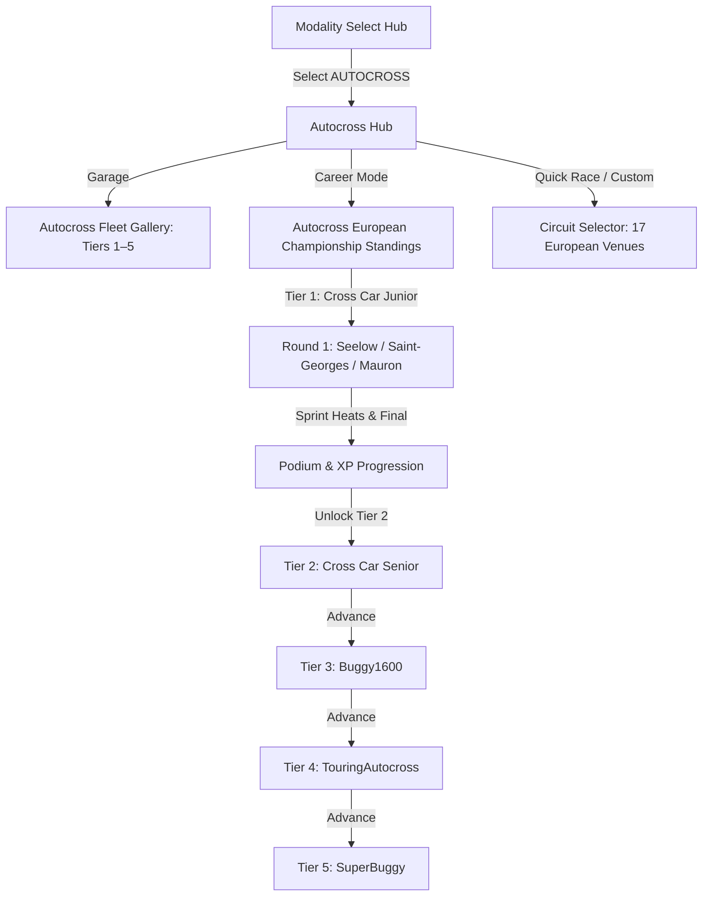

# Feature Spec: FIA Autocross Championship and Vehicle Roster 🏁

With the complete rebranding and specialization of the Rally module into **Rallycross (RX)** ([Spec 048](048_rallycross_labels_rx_tier_45_cars_and_mint_400_desert_circuits.md)), **TdRace** establishes a dedicated, standalone **FIA Autocross (AX)** motorsport discipline. 

While North American "Autocross" (Auto-X/Solo) denotes solo parking-lot cone dodging against the clock, European and international **FIA Autocross** is the purest, rawest form of wheel-to-wheel dirt sprint racing on Earth. Contested on natural, dedicated unpaved circuits (clay, loam, sand, gravel) with high-horsepower open-wheel buggies, motorcycle-engined Cross Cars, and wild silhouette touring cars, Autocross demands continuous throttle-steer drift, aggressive roost management, and lightning reactions over crests, ruts, and berms.

This specification establishes the full architecture for the Autocross module (`"autocross"`): its foundational distinction from Rallycross, its 5-tier vehicle hierarchy (15 authentic real-world machines, 3 per tier), and its 17 iconic European dirt circuits.

---

## 🏎️ Discipline Comparison: Rallycross (RX) vs Autocross (AX)

The primary difference between **RX (Rallycross)** and **AX (Autocross)** lies in track composition, vehicle types, and race format.

| Feature | Rallycross (RX) | Autocross (AX) |
| :--- | :--- | :--- |
| **Track Surface** | **Mixed surface:** Typically 60% asphalt/tarmac and 40% gravel/dirt. High-grip tarmac braking zones alternating with dirt slides. | **Natural/unpaved surface:** 100% dirt, compacted clay, gravel, or sand (only the start/finish straight may optionally feature a paved/concrete launch pad). |
| **Vehicles** | **Closed-cockpit production-based cars** (Supercars, touring cars, RX2e, hatchbacks) with full production silhouette bodywork. | **Buggy-style open-wheel vehicles** (Cross Cars, SuperBuggies, Buggy1600, Junior Buggies) as well as heavily modified 4WD touring cars (TouringAutocross). |
| **Joker Lap** | **Mandatory:** Every driver must negotiate an alternate, slightly longer (or shorter) detour route once per heat/race. | **None:** All competitors run the identical track layout without an alternate routing detour. Pure wheel-to-wheel combat. |
| **Suspension & Tires** | Stiffer setups, hybrid compromise tires designed to grip high-speed tarmac and loose dirt without overheating. | Long-travel off-road suspension (250–350 mm travel) and aggressive knobby/treaded off-road tires designed to bite deep into loam, clay, and mud. |
| **Race Style** | High-grip transitions, heavy reliance on tarmac trail-braking, jump landings, and strategic pit-style Joker lap tactics. | Constant sliding, dirt-track roosting, rut management, momentum preservation on loose ground, and throttle-steer car control. |
| **Race Heat Format** | 4 to 6 laps, staggered grid or multi-row simultaneous start, Joker lap tactical battle. | 4 to 6 laps, simultaneous multi-row grid launch (often 5-wide or 3-2-3 staggered), flat-out sprint to the chequered flag. |

Both share short, intense sprint heat formats (usually 4 to 6 laps) with simultaneous wheel-to-wheel grid starts, but RX is built around hybrid surface transitions and touring shells, whereas AX is pure off-road short-course sprint racing.

---

## 🗺️ User Flow & Interface Design

### 1. Interface Navigation & Modality Selection
The Autocross module integrates directly into `GameState::ModalitySelect`, `GameState::Garage`, and `GameState::ChampionshipStandings`:



### 2. HUD & Race Presentation
- **HUD Modality Badge**: Shows `AUTOCROSS` / `AX` in burnt orange badge (`Color::new(0.92, 0.45, 0.08, 1.0)`).
- **No Joker Indicator**: Unlike RX, the HUD explicitly omits the `JOKER: REQUIRED` overlay. Instead, it features a **Track Grip & Rutting** indicator or clean sprint heat lap counter.
- **Dust & Roost Particles**: Extreme particulate emission pipeline: heavy clods of dirt, rooster tails, and roost thrown onto following cars, dynamic windshield/visor dirt buildup.
- **Engine Audio**: High-screaming motorcycle parallel-twins (MT-07) and triples (MT-09), screaming 12,000 RPM Hayabusa inline-4s, popping anti-lag turbo four-cylinders, and monstrous 4.0L V8 / twin-turbo flat-6 open exhausts.

---

## ⚙️ Backend Models & API Endpoints

### 1. Modality Registration
Add `CarCategory::Autocross` to [`crates/arcade-race-core/src/car_category.rs`](../crates/arcade-race-core/src/car_category.rs):

```rust
pub enum CarCategory {
    Gt,
    Nascar,
    Rally,
    Kart,
    OffRoad,
    /// FIA Autocross open-wheel buggies, cross cars, and touring autocross.
    Autocross,
}

impl CarCategory {
    pub const ALL: [Self; 6] = [
        Self::Gt,
        Self::Nascar,
        Self::Rally,
        Self::Kart,
        Self::OffRoad,
        Self::Autocross,
    ];

    pub fn id(&self) -> &'static str {
        match self {
            Self::Gt => "gt",
            Self::Nascar => "nascar",
            Self::Rally => "rally",
            Self::Kart => "kart",
            Self::OffRoad => "off_road",
            Self::Autocross => "autocross",
        }
    }

    pub fn title(&self) -> &'static str {
        match self {
            Self::Gt => "GT",
            Self::Nascar => "NASCAR",
            Self::Rally => "RALLYCROSS",
            Self::Kart => "KART",
            Self::OffRoad => "OFF-ROAD",
            Self::Autocross => "AUTOCROSS",
        }
    }

    pub fn display_name(&self) -> &'static str {
        match self {
            Self::Gt => "GT World Challenge",
            Self::Nascar => "NASCAR Stock Car",
            Self::Rally => "Rallycross",
            Self::Kart => "Karting",
            Self::OffRoad => "Extreme Off-Road",
            Self::Autocross => "FIA Autocross",
        }
    }
}
```

### 2. Career Progression Model
Stored in SQLite via `ModuleCareerProgress` (`module_id = "autocross"`):

```rust
pub struct ModuleCareerProgress {
    pub profile_id: i64,
    pub module_id: String, // "autocross"
    pub xp: u64,
    pub lifetime_xp: u64,
    pub level: u32,        // 1..=5
    pub unlocked_cars: Vec<String>,
    pub unlocked_tracks: Vec<String>,
    pub visited_tracks: Vec<String>,
    pub completed_events: Vec<String>,
    pub trophies_gold: u32,
    pub trophies_silver: u32,
    pub trophies_bronze: u32,
    pub updated_at: String,
}
```

---

## 🚘 The 5-Tier Vehicle Hierarchy (15 Cars, 3 Per Tier)

The vehicle roster accurately replicates the FIA European Autocross and Cross Car Championship ladder, progressing from grassroots Academy buggies to the unlimited 700+ BHP SuperBuggies:

```
                      AUTOCROSS SILHOUETTES (LATERAL 2D)
                      
    Tier 1 & 2 Cross Car (LifeLive / Speedcar / Semog):
            [Air Scoop & Roll Cage]
                 __/\_/\_
             ===[ Compact RWD ]===
               (O)           (O)

    Tier 3 Buggy1600 (Peters / Alfa Racing / Fast & Speed):
            [Twin Roof Airhorns]     [High Downforce Rear Wing]
                 __/\_/\__________          |‾|
             ===[ Mid-Engine 4WD  \_________|_|
               (O)                     (O)

    Tier 4 TouringAutocross (Škoda Fabia / Evo IX / Audi A4):
               ______/‾‾‾‾\_______     [Rallycross Bi-Plane Wing]
           ===[ 4WD Touring Shell \_]====|‾|
             (O)                    (O)  |_|

    Tier 5 SuperBuggy (Unlimited 700+ BHP V8 / Biturbo):
            [Massive High-Downforce Wings & 350mm Shocks]
              |‾|    __/\_/\__________     |‾|
              |_|===[ Tubular Spaceframe ]=|_|
               ( O )                   ( O )
```

### Complete Vehicle Specification Table

| Tier | Category / Class | Vehicle Name | ID | Manufacturer | Year | BHP | Weight (kg) | Drivetrain | Engine | 0–100 km/h | Top Speed |
| :---: | :--- | :--- | :--- | :--- | :---: | :---: | :---: | :---: | :--- | :---: | :---: |
| **1** | Cross Car Junior | **LifeLive TN5 Junior** | `autocross_lifelive_tn5_junior` | LifeLive | 2023 | 80 | 320 | RWD | 690cc Yamaha MT-07 Restricted I2 | 4.8 s | 155 km/h |
| **1** | Cross Car Junior | **Speedcar Xtrem Junior** | `autocross_speedcar_xtrem_junior` | Speedcar | 2022 | 80 | 315 | RWD | 600cc Suzuki GSX-R Restricted I4 | 4.7 s | 158 km/h |
| **1** | Cross Car Junior | **Planet Kart Cross K3 Junior** | `autocross_planet_k3_junior` | Planet Kart Cross | 2023 | 80 | 320 | RWD | 650cc Kawasaki ER6 Restricted I2 | 4.9 s | 154 km/h |
| **2** | Cross Car Senior | **LifeLive TN11 Senior** | `autocross_lifelive_tn11_senior` | LifeLive | 2024 | 145 | 312 | RWD | 847cc Yamaha MT-09 Triple | 3.1 s | 185 km/h |
| **2** | Cross Car Senior | **Speedcar Wonder** | `autocross_speedcar_wonder` | Speedcar | 2023 | 148 | 310 | RWD | 750cc Suzuki GSX-R750 I4 | 3.0 s | 188 km/h |
| **2** | Cross Car Senior | **Semog Bravo Sport** | `autocross_semog_bravo_sport` | Semog | 2023 | 142 | 315 | RWD | 847cc Yamaha MT-09 Triple | 3.2 s | 184 km/h |
| **3** | Buggy1600 | **Peters Autosport Buggy1600** | `autocross_peters_buggy1600` | Peters Autosport | 2023 | 265 | 545 | 4WD | 1.6L Suzuki Hayabusa Stroker I4 | 2.6 s | 205 km/h |
| **3** | Buggy1600 | **Alfa Racing Buggy1600** | `autocross_alfa_racing_buggy1600` | Alfa Racing | 2022 | 260 | 550 | 4WD | 1.6L Kawasaki ZX-16R Race I4 | 2.7 s | 202 km/h |
| **3** | Buggy1600 | **Fast & Speed Buggy1600** | `autocross_fast_speed_buggy1600` | Fast & Speed | 2023 | 255 | 560 | 4WD | 1.6L VW Spiess 16V Race I4 | 2.8 s | 200 km/h |
| **4** | TouringAutocross | **Škoda Fabia TAX** | `autocross_skoda_fabia_tax` | Škoda Motorsport | 2022 | 550 | 1,180 | 4WD | 2.0L Turbocharged 20V I4 (720 Nm) | 2.3 s | 215 km/h |
| **4** | TouringAutocross | **Mitsubishi Lancer Evo IX TAX** | `autocross_mitsubishi_evo_tax` | Mitsubishi Ralliart | 2021 | 580 | 1,220 | 4WD | 2.0L 4G63 Turbo with ALS (740 Nm) | 2.2 s | 218 km/h |
| **4** | TouringAutocross | **Audi A4 Quattro TAX** | `autocross_audi_a4_tax` | Audi Sport Custom | 2022 | 540 | 1,200 | 4WD | 2.0L TFSI Turbocharged I4 (700 Nm) | 2.4 s | 214 km/h |
| **5** | SuperBuggy | **Peters Autosport SuperBuggy V8** | `autocross_peters_superbuggy` | Peters Autosport | 2024 | 680 | 680 | 4WD | 4.0L BMW M62 Tuned Racing V8 | 2.1 s | 225 km/h |
| **5** | SuperBuggy | **Alfa Racing SuperBuggy Twin-Turbo** | `autocross_alfa_racing_superbuggy` | Alfa Racing | 2024 | 720 | 675 | 4WD | 3.6L Porsche Flat-6 Twin-Turbo | 2.0 s | 230 km/h |
| **5** | SuperBuggy | **Fast & Speed SuperBuggy Biturbo** | `autocross_fast_speed_superbuggy` | Fast & Speed | 2023 | 650 | 690 | 4WD | 3.5L Ford V6 Biturbo Race Engine | 2.2 s | 222 km/h |

### Tier-by-Tier Engineering Character

#### Tier 1: Cross Car Junior (FIA Academy Trophy Spec)
- **Role**: Grassroots development for 13- to 16-year-old drivers.
- **Handling Balance**: Light (315–320 kg), rear-wheel drive, locked spool differential. Power is restricted to 80 BHP, making momentum preservation through clay berms and smooth slide angles essential. Oversliding bogs the revs.
- **Visuals**: Compact tubular spaceframe, high roll cage, prominent roof air scoop, open wheels with dirt knobby tires.

#### Tier 2: Cross Car Senior (FIA European XC Championship Benchmark)
- **Role**: High-power motorcycle-engined sprint weapon.
- **Handling Balance**: Explosive power-to-weight ratio (145 BHP in 310 kg = ~468 BHP/tonne). Extreme throttle steering; requires feathering the gas to avoid 360-degree snap spins on loose dirt. Chain-driven locked rear axle.
- **Visuals**: Aggressive aerodynamic side pods, front winglet ducts, high rear spoiler.

#### Tier 3: Buggy1600 (4WD Single-Seater)
- **Role**: Traditional European Championship 4WD stepping stone.
- **Handling Balance**: Screaming 12,000 RPM 1600cc engine mated to a 50/50 locked 4WD transmission. Incredible launch traction on loam and clay; point-and-squirt dynamics through ninety-degree dirt switchbacks.
- **Visuals**: Mid-engine tubular buggy, twin overhead intake trumpets, high rear wing, exposed long-travel front pushrod/A-arm suspension.

#### Tier 4: TouringAutocross (TAX / SuperSaloon)
- **Role**: 550+ BHP production silhouette touring monsters.
- **Handling Balance**: Heavy compared to buggies (1,180–1,220 kg), but possessing crushing mid-range torque (700+ Nm) and anti-lag turbo boost. Deep rut skipping, heavy body roll, wide aggressive four-wheel drift lines.
- **Visuals**: Aggressively flared widebody fenders, massive roof vents, rear rallycross wing, front chin skid plates, mud flaps.

#### Tier 5: SuperBuggy (The Unlimited Apex Predator)
- **Role**: The premier, fastest short-course dirt racing machines on Earth.
- **Handling Balance**: 1:1 power-to-weight ratio (up to 720 BHP / 675 kg = 1,066 BHP/tonne!). Capable of launching from 0 to 100 km/h in 2.0 seconds on pure dirt. Massive downforce allows cornering speeds that defy belief on loose gravel and clay.
- **Visuals**: Giant multi-element sprint wings (front and rear), massive 350 mm bypass shock absorbers, exposed custom V8/Twin-Turbo powertrains, aggressive knobby paddle tires.

---

## 🏁 The 17-Circuit European Autocross Calendar (100% OSM Verified)

Autocross circuits in TdRace are 100% natural, unpaved circuits modeled directly from real-world **OpenStreetMap (OSM)** geographic survey data. Each track is mapped to an authentic, verified OSM closed raceway way or relation across 8 European nations, ensuring exact 1:1 dimensional and geometric fidelity in game models:

| # | Circuit Name | Venue & City | Country | Track ID | OSM Reference | Length (m) | Dominant Surface | Signature Feature |
| :---: | :--- | :--- | :---: | :--- | :--- | :---: | :--- | :--- |
| **1** | **Nová Paka** | Štikovská rokle, Nová Paka | 🇨🇿 CZ | `nova_paka_ax` | [`way/166701854`](https://www.openstreetmap.org/way/166701854) | 1,060 m | Compacted Red Clay | Cathedral of Autocross; brutal 25m hillclimb & toboggan downhill drop. |
| **2** | **Přerov** | Přerovská rokle, Přerov | 🇨🇿 CZ | `prerov_ax` | [`way/159576897`](https://www.openstreetmap.org/way/159576897) | 1,000 m | Loam & Clay | Historic venue; the fearsome 15m "Mamut" drop jump and deep gully sweepers. |
| **3** | **Humpolec** | Pod Vilémovským lomem, Humpolec | 🇨🇿 CZ | `humpolec_ax` | [`way/100006815`](https://www.openstreetmap.org/way/100006815) | 980 m | Dirt & Gravel | Quarry-side natural amphitheatre with high-grip loam berms and blind crests. |
| **4** | **Matschenberg** | Offroad Arena, Cunewalde | 🇩🇪 DE | `matschenberg_ax` | [`way/1363616670`](https://www.openstreetmap.org/way/1363616670) | 1,180 m | Compacted Clay | Fastest dirt track in Europe; radical 30m vertical drop into high-speed bowl. |
| **5** | **Seelow** | Circuit Am Weinberg, Seelow | 🇩🇪 DE | `seelow_ax` | [`way/119083954`](https://www.openstreetmap.org/way/119083954) | 1,170 m | Sand & Dirt | Traditional European season opener in Brandenburg; wide sandy banked sweepers. |
| **6** | **Schlüchtern** | Ewald-Pauli-Ring, Schlüchtern | 🇩🇪 DE | `schluechtern_ax` | [`way/134067270`](https://www.openstreetmap.org/way/134067270) | 1,200 m | Heavy Dirt & Clay | Technical hillside track with heavy rutting, off-camber hairpins, and elevation. |
| **7** | **Uhlenköper-Ring** | Uhlenköper-Ring, Uelzen | 🇩🇪 DE | `uelzen_ax` | [`way/62020741`](https://www.openstreetmap.org/way/62020741) | 810 m | Hardpack Dirt | Fast, undulating northern German circuit; technical rhythm sections and crests. |
| **8** | **Saint-Georges-de-Montaigu** | Circuit du Bouvreau, St-Georges | 🇫🇷 FR | `st_georges_ax` | [`way/674904429`](https://www.openstreetmap.org/way/674904429) | 940 m | Red Clay & Loam | Temple of French Autocross; 20,000 spectators lining high-speed banked clay bowls. |
| **9** | **Faleyras** | Circuit de Faleyras, Gironde | 🇫🇷 FR | `faleyras_ax` | [`way/808191053`](https://www.openstreetmap.org/way/808191053) | 1,150 m | Compacted Clay | Famous French amphitheatre circuit with dramatic elevation drops and wide dirt bowls. |
| **10** | **Saint-Junien** | Circuit de Saint-Junien | 🇫🇷 FR | `st_junien_ax` | [`way/685441292`](https://www.openstreetmap.org/way/685441292) | 1,260 m | Loam & Clay | Classic French national autocross track; fast sweeping turns and technical chicanes. |
| **11** | **Bazaigues** | Circuit de Bazaigues, Indre | 🇫🇷 FR | `bazaigues_ax` | [`way/803500149`](https://www.openstreetmap.org/way/803500149) | 1,050 m | Clay & Dirt | Technical sprint circuit with rolling terrain and wide, multi-line dirt hairpins. |
| **12** | **Maggiora** | Autodromo Pragiarolo, Maggiora | 🇮🇹 IT | `maggiora_ax` | [`way/152379106`](https://www.openstreetmap.org/way/152379106) | 1,390 m | Red Clay | Famous Italian dirt arena with dramatic cambers, high-speed esses, and blind crests. |
| **13** | **Mūsa** | Mūsa Raceland, Bauska | 🇱🇻 LV | `musa_ax` | [`way/131117868`](https://www.openstreetmap.org/way/131117868) | 1,120 m | Sandy Loam & Clay | Baltic autocross capital; ultra-wide, high-speed sandy loam surface in a natural bowl. |
| **14** | **Vilkyčiai** | Autosporto Kompleksas, Vilkyčiai | 🇱🇹 LT | `vilkyciai_ax` | [`relation/18121386`](https://www.openstreetmap.org/relation/18121386) | 880 m | Dirt & Loose Gravel | Demanding Baltic track with natural gullies, heavy braking, and deep wheel ruts. |
| **15** | **Arteixo** | Circuito José Ramón Losada | 🇪🇸 ES | `arteixo_ax` | [`way/192380335`](https://www.openstreetmap.org/way/192380335) | 1,325 m | Red Clay & Dirt | "La Catedral" of Spanish Autocross in Galicia; sweeping high-banked stadium carousels. |
| **16** | **Carballo** | Circuito Motor Bértoa, Carballo | 🇪🇸 ES | `carballo_ax` | [`way/854048813`](https://www.openstreetmap.org/way/854048813) | 965 m | Heavy Loam & Dirt | Galician technical dirt bowl with sharp switchbacks and heavy traction demand. |
| **17** | **Castelo Branco** | Desportos Motorizados de Castelo Branco | 🇵🇹 PT | `castelo_branco_ax` | [`way/436180509`](https://www.openstreetmap.org/way/436180509) | 1,250 m | Shale, Gravel & Dirt | Premier Portuguese off-road venue; undulating high-traction clay and loose shale margins. |

*(Alternative verified Central European circuit: **Hollabrunn Weinland Arena**, Austria, [`way/193655015`](https://www.openstreetmap.org/way/193655015), 800m closed loop).*

---

### 🗺️ OpenStreetMap 1:1 In-Game Modeling Pipeline

To guarantee 1:1 fidelity with real-world circuits, the Autocross module integrates directly with the existing `scripts/osm_importer.py` and `crates/tdrace-core/src/bin/track_bake.rs` pipeline:

```mermaid
flowchart LR
    A[Direct OSM Map API<br/>api.openstreetmap.org] -->|Cached in assets/osm/*.osm| B[OSM XML Parse]
    B -->|Filter Raceway Nodes| C[Equirectangular Projection<br/>latlon_to_meters]
    C -->|Rotate Heading onto +X| D[Start Straight Alignment]
    D -->|1:1 Scale Ratio| E[Uniform Catmull-Rom Spline<br/>30–32 Waypoints]
    E -->|Deflection Sine Analysis| F[Apex Curbs & Width Assignment]
    F -->|Bake Track JSON| G[tracks/autocross/<slug>.json]
```



1. **OSM Data Extraction**: Downloaded directly via Direct OSM Map API (`/api/0.6/map?bbox=...` or `/api/0.6/way/<id>/full`) with zero third-party dependency.
2. **Local Metres Projection**: Spherical WGS84 coordinates ($(\text{lat}, \text{lon})$) are projected to local tangent-plane Cartesian metres around the start-grid datum $(lat_0, lon_0)$:
   $$x = (\text{lon} - \text{lon}_0) \cdot \frac{\pi}{180} \cdot R_{\text{earth}} \cdot \cos\left(\text{lat}_0 \cdot \frac{\pi}{180}\right)$$
   $$y = (\text{lat} - \text{lat}_0) \cdot \frac{\pi}{180} \cdot R_{\text{earth}}$$
3. **Start Straight Orientation**: Points are rotated by $-\theta_{\text{start}}$ so the start/finish straight and grid slots align directly along the $+X$ axis.
4. **1:1 Scale Enforcement**: Autocross uses a **1:1 scale ratio** ($s = 1.0$), matching real-world FIA circuit dimensions exactly (unlike GT circuits which are scaled at 0.5x).
5. **Uniform Resampling**: Raw irregular GPS survey nodes are resampled into 30–32 equidistant waypoints via arc-length interpolation.
6. **Track Baking**: Waypoints are compiled into canonical JSON format (`tracks/autocross/<slug>.json`), containing closed-loop centerline splines, surface properties (`SurfaceType::Dirt`), runoff corridors, and 12-car grid starting slots.

---

## 🏆 Career Championship Structure (5 Tiers)

Each career tier features a dedicated championship series composed of rounds selected from the 17-circuit calendar:

```mermaid
flowchart LR
    subgraph T1 [Tier 1: Cross Car Junior]
        C1[FIA Cross Car Academy Trophy]
        R1[Seelow / Bazaigues / Vilkyčiai]
    end
    subgraph T2 [Tier 2: Cross Car Senior]
        C2[European Cross Car Cup]
        R2[Arteixo / Uelzen / Mūsa / Castelo Branco]
    end
    subgraph T3 [Tier 3: Buggy1600]
        C3[FIA Buggy1600 European Championship]
        R3[Přerov / Humpolec / Maggiora / St-Junien]
    end
    subgraph T4 [Tier 4: TouringAutocross]
        C4[TouringAutocross Masters]
        R4[Carballo / Faleyras / Schlüchtern / Matschenberg]
    end
    subgraph T5 [Tier 5: SuperBuggy]
        C5[FIA SuperBuggy Grand Prix Series]
        R5[Nová Paka / St-Georges / Matschenberg / Přerov / Maggiora]
    end
    T1 --> T2 --> T3 --> T4 --> T5
```



1. **Tier 1 Cup: FIA Cross Car Academy Trophy** (`autocross_crosscar_junior_trophy.toml`)
   - Eligible Vehicles: Tier 1 Cross Car Junior (80 BHP)
   - Rounds: `seelow_ax`, `bazaigues_ax`, `vilkyciai_ax` (4 laps per round, 8-car grid)
2. **Tier 2 Cup: European Cross Car Challenge** (`autocross_crosscar_senior_challenge.toml`)
   - Eligible Vehicles: Tier 2 Cross Car Senior (145 BHP)
   - Rounds: `arteixo_ax`, `uelzen_ax`, `musa_ax`, `castelo_branco_ax` (5 laps per round, 8-car grid)
3. **Tier 3 Cup: FIA Buggy1600 European Championship** (`autocross_buggy1600_championship.toml`)
   - Eligible Vehicles: Tier 3 Buggy1600 (260 BHP, 4WD)
   - Rounds: `prerov_ax`, `humpolec_ax`, `maggiora_ax`, `st_junien_ax` (5 laps per round, 8-car grid)
4. **Tier 4 Cup: TouringAutocross SuperSaloon Masters** (`autocross_touring_masters.toml`)
   - Eligible Vehicles: Tier 4 TouringAutocross (550+ BHP, 4WD)
   - Rounds: `carballo_ax`, `faleyras_ax`, `schluechtern_ax`, `matschenberg_ax` (5 laps per round, 8-car grid)
5. **Tier 5 Cup: FIA SuperBuggy World Series** (`autocross_superbuggy_world_series.toml`)
   - Eligible Vehicles: Tier 5 SuperBuggy (700+ BHP, 4WD)
   - Rounds: `nova_paka_ax`, `st_georges_ax`, `matschenberg_ax`, `prerov_ax`, `maggiora_ax` (6 laps per round, 8-car grid)


---

## 🛡️ Security & Role-Based Access Controls (RBAC)

- **License Tier Gating**: Tier 1 is unlocked for all new drivers. Progressing to Tier $N+1$ requires achieving a podium finish (Gold, Silver, Bronze) in the Tier $N$ championship and possessing sufficient XP to purchase a Tier $N+1$ machine.
- **Surface Gating Compliance**: Autocross vehicles are factory-equipped with off-road suspension and knobby tires. They are fully eligible for Dirt, Clay, Sand, and Gravel surfaces without handicap. However, they suffer severe tire overheating and grip loss on sustained high-speed asphalt (Gran Turismo circuits).
- **Dev Mode Bypass**: When `dev_mode: true` is enabled in configuration, all 5 tiers, 15 vehicles, and 17 circuits are immediately unlocked for testing and development.

---

## 🧪 Verification & Acceptance Criteria

### Automated Tests
- `cargo test --workspace --exclude tdrace-py`
- Verification of 15 Autocross vehicles in catalog: `crates/tdrace-app/tests/autocross_catalog_tests.rs`
- Verification of 17 Autocross circuits: `crates/tdrace-app/tests/autocross_circuits_tests.rs`
- Verification of zero joker lap requirement in Autocross mode: `crates/tdrace-app/tests/autocross_rules_tests.rs`

### Manual Acceptance Criteria (Pseudo-Gherkin)

- **Scenario: Autocross module is distinct from Rallycross in Modality Select**
  - [x] **Given** the player is on the Modality Select hub screen
  - [x] **When** they inspect the available motorsport disciplines
  - [x] **Then** both `RALLYCROSS` and `AUTOCROSS` appear as distinct, selectable modules
  - [x] **And** Autocross features its dedicated icon, orange branding, and "Natural unpaved dirt & buggy racing" description

- **Scenario: Autocross vehicles span 5 distinct tiers with 3 vehicles per tier**
  - [x] **Given** the player accesses the Garage filtered to the Autocross module
  - [x] **When** they cycle through tiers 1 through 5
  - [x] **Then** Tier 1 contains 3 Cross Car Junior buggies
  - [x] **And** Tier 2 contains 3 Cross Car Senior buggies
  - [x] **And** Tier 3 contains 3 Buggy1600 4WD machines
  - [x] **And** Tier 4 contains 3 TouringAutocross modified saloons
  - [x] **And** Tier 5 contains 3 SuperBuggy unlimited monsters
  - [x] **And** exactly 15 vehicles are registered under `autocross_*`

- **Scenario: Autocross circuits enforce 100% natural unpaved surface and NO Joker Lap**
  - [x] **Given** a race session launched on any of the 17 Autocross circuits (e.g. `nova_paka_ax`)
  - [x] **When** the race starts and vehicles navigate the circuit
  - [x] **Then** the dominant surface is Dirt, Clay, or Gravel
  - [x] **And** the HUD displays NO `JOKER: REQUIRED` indicator
  - [x] **And** no alternate joker lap branch route is required to complete the heat

- **Scenario: Authentic European calendar coverage**
  - [x] **Given** the Autocross circuit selector
  - [x] **When** listing all official Autocross tracks
  - [x] **Then** exactly 17 European circuits are available with authentic provenance (Czech Republic, Germany, France, Italy, Latvia, Lithuania, Spain, Portugal, Austria)

---

## 🔗 Traceability & Codebase Mapping

### Expected Implementation Scope
- `[x]` `crates/arcade-race-core/src/car_category.rs` -> Add `CarCategory::Autocross` (`"autocross"` / AX)
- `[x]` `crates/tdrace-app/src/catalog/mod.rs` -> Register 15 `RealCarModel` definitions (`autocross_*`) across Tiers 1–5
- `[x]` `crates/tdrace-app/src/game/mod.rs` -> Autocross career cup launcher and tier progression
- `[x]` `crates/tdrace-app/src/ui/` (`garage.rs`, `menu.rs`, `track_manager_ui.rs`, `profile_ui.rs`) -> Autocross visual theming and filters
- `[x]` `tracks/autocross/*.json` -> 17 official JSON circuit definitions
- `[x]` `series/autocross/*.toml` -> 5 championship series presets
- `[x]` `portals/shared/data/{circuits,vehicles}.json` -> Update web catalog and reference showroom
