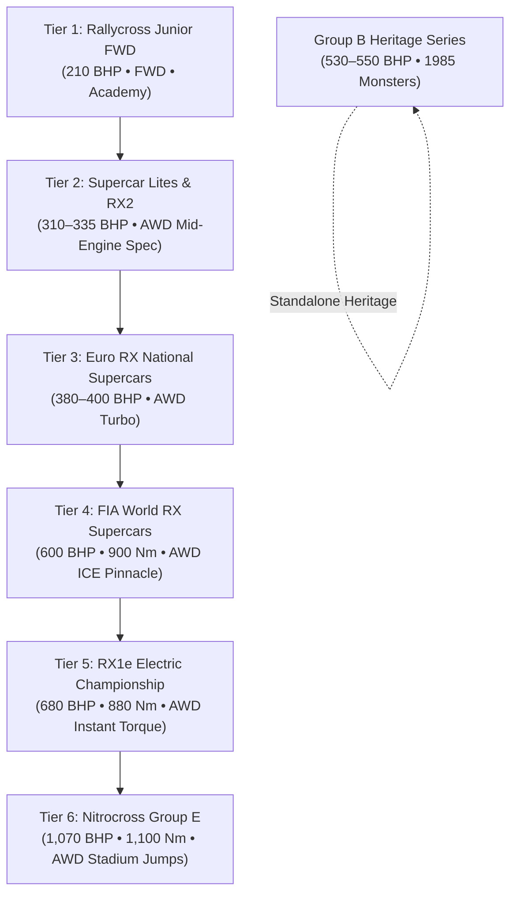
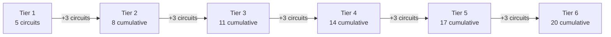

# Feature Spec: Rallycross 6-Tier Career Progression and Expanded Circuit Roster 🏁

With the introduction of the dedicated **FIA Autocross module** ([Spec 050](050_fia_autocross_championship_and_vehicle_roster.md)) housing open-wheel buggies and Cross Cars, the **Rallycross module** (`"rally"`) solidifies its identity as the premier international discipline for **closed-cockpit, production-silhouette mixed-surface sprint racing**.

However, the existing Rallycross career mode contains two major structural inconsistencies:
1. **Anachronistic Tier 3**: 1985 Group B rally monsters (Audi Sport Quattro S1 E2, Peugeot 205 T16, Lancia Delta S4) sat awkwardly between modern 2020s World RX Supercars and modern electric RX1e machines.
2. **Missing Iconic Stepping Stones**: The official ladder between Junior FWD and 600 BHP Supercars (the **Supercar Lites / RX2** category) was missing, while the premier 600 BHP ICE Supercars (Peugeot 208 WRX, Ford Focus RS RX, Subaru WRX STI RX) were omitted in favor of derated 380 BHP models.

This specification redesigns the Rallycross career mode into a comprehensive **6-Tier modern career ladder**, relocates Group B vehicles to a dedicated unranked **Heritage Series**, and introduces **3 new real-world circuits** (bringing the total from 17 to **20 circuits**), enabling a perfectly balanced progression where **5 circuits are available at Tier 1, and exactly 3 new circuits unlock at each subsequent tier** ($5 + 3 \times 5 = 20$).

---

## 🗺️ User Flow & Interface Design

### 1. 6-Tier Vehicle Progression Architecture

The career ladder spans 6 distinct modern eras and performance brackets. Each tier features exactly 3 balanced vehicles (18 modern cars total).



### Vehicle Roster Breakdown

| Tier | Category / Championship | Drivetrain & Performance | Vehicle Roster | Class Badge |
| :--- | :--- | :--- | :--- | :--- |
| **Tier 1** | **Rallycross Grassroots Cup** *(Junior FWD)* | FWD • 1.2L Turbo <br> ~210 bhp • 300 Nm <br> 1,080 kg | • Peugeot 208 Rally4 (`rally_peugeot_208_rally4`)<br>• Ford Fiesta Rally4 (`rally_fiesta_rally4`)<br>• Renault Clio Rally4 (`rally_clio_rally4`) | `RALLY4` |
| **Tier 2** | **Supercar Lites Challenge** *(AWD Feeder Spec)* | AWD • Mid-Engine NA / Spec EV <br> ~310–335 bhp • 510 Nm <br> 1,100 kg | • **Olsbergs MSE Supercar Lites (Ford)** (`rally_omse_supercar_lites`)<br>• **Avitas Supercar Lites (Honda)** (`rally_avitas_supercar_lites`)<br>• **QEV RX2e Electric** (`rally_qev_rx2e`) | `RX2` |
| **Tier 3** | **Euro RX Continental Challenge** *(Euro RX1 / 400 BHP)* | AWD • 2.0L Turbo <br> ~380–400 bhp • 550 Nm <br> 1,240 kg | • Volkswagen Polo RX Supercar (`rally_polo_rx`)<br>• Audi S1 EKS RX Supercar (`rally_audi_s1_rx`)<br>• Hyundai i20 RX Supercar (`rally_hyundai_i20_rx`) | `EURORX` |
| **Tier 4** | **FIA World RX Supercar Trophy** *(600 BHP ICE Supercars)* | AWD • 2.0L Custom Turbo + ALS <br> 600 bhp • 900 Nm <br> 1,300 kg (0–100 km/h in 1.9s) | • **Peugeot 208 WRX Supercar** (`rally_peugeot_208_wrx`) *(Hansen Motorsport)*<br>• **Ford Focus RS RX** (`rally_ford_focus_rs_rx`) *(Hoonigan / M-Sport)*<br>• **Subaru WRX STI Supercar** (`rally_subaru_wrx_rx`) *(Subaru USA / VSC)* | `WRX` |
| **Tier 5** | **RX1e Electric Championship** *(World RX Electric)* | Dual Motor AWD <br> 680 bhp • 880 Nm <br> 1,330 kg (0–100 km/h in 1.8s) | • Peugeot 208 RX1e (`rally_peugeot_208_rx1e`)<br>• Volkswagen Polo RX1e (`rally_polo_rx1e`)<br>• Lancia Delta Evo-e RX (`rally_lancia_delta_evo_e_rx`) | `RX1E` |
| **Tier 6** | **Nitrocross Group E Series** *(Hyper-EV Stadium Jumps)* | Quad Motor AWD <br> 1,070 bhp • 1,100 Nm <br> 1,245 kg (0–100 km/h in 1.4s) | • Olsbergs MSE FC1-X (`rally_omse_fc1x`)<br>• Vermont SportsCar FC1-X (`rally_vsc_fc1x`)<br>• Dodge Hornet R/T FC1-X (`rally_dodge_hornet_fc1x`) | `GRP E` |

### Heritage Series: Group B Masters
- **Classification**: Unranked / Heritage Trophy (`tier: 0` or flagged `is_heritage: true`).
- **Vehicles**:
  - Audi Sport Quattro S1 E2 (`rally_audi_sport_quattro_s1`) (1985, 550 bhp)
  - Peugeot 205 T16 EVO 2 (`rally_peugeot_205_t16`) (1985, 530 bhp)
  - Lancia Delta S4 (`rally_lancia_delta_s4`) (1986, 550 bhp)
- **Career Access**: Fully playable in Quick Race, Time Attack, and via a dedicated standalone 9-round **Group B Masters Series** preset outside the 6-tier linear XP ladder.

---

### 2. Circuit Roster & Tier Unlock Progression

The circuit catalog expands from 17 to **20 circuits** by introducing 3 new real-world tracks with surveyed OpenStreetMap (OSM) data. Circuits unlock sequentially: **5 at Tier 1, and +3 at each subsequent tier**.



#### Complete Circuit Progression Matrix

| Tier | New Circuits Unlocked | Cumulative Total | Track ID & Name | Country | Surface Composition |
| :--- | :--- | :--- | :--- | :--- | :--- |
| **Tier 1** | **5 Starter Circuits** | 5 | • `holjes_rx` (Höljes Motorstadion)<br>• `lydden_hill` (Lydden Hill Race Circuit)<br>• `mettet_rx` (Circuit Jules Tacheny Mettet)<br>• `dreux_rx` (Circuit de Dreux)<br>• `croft_rx` (Croft Circuit) | Sweden<br>UK<br>Belgium<br>France<br>UK | 60% Asphalt / 40% Gravel |
| **Tier 2** | **+3 Circuits** | 8 | • `lessay_rx` (Circuit de Lessay)<br>• `essay_rx` (Circuit des Ducs Essay)<br>• `lavare_rx` (Circuit de Lavaré) | France<br>France<br>France | 55% Asphalt / 45% Clay |
| **Tier 3** | **+3 Circuits** | 11 | • `kouvola_rx` (Tykkimäki Circuit Kouvola)<br>• `montalegre_rx` (Pista de Montalegre)<br>• `nyirad_rx` (Nyirád Racing Center) | Finland<br>Portugal<br>Hungary | 50% Asphalt / 50% Red Clay |
| **Tier 4** | **+3 Circuits** | 14 | • `estering_rx` (Estering Buxtehude)<br>• `hell_rx` (Lånkebanen Hell RX)<br>• `loheac_rx` (Circuit de Lohéac) | Germany<br>Norway<br>France | 65% Asphalt / 35% Dirt |
| **Tier 5** | **+3 Circuits** | 17 | • `riga_rx` (Biķernieki Track Riga)<br>• `killarney_rx` (Killarney International Raceway)<br>• `catalunya_rx` (Circuit de Barcelona-Catalunya RX) | Latvia<br>South Africa<br>Spain | 60% Asphalt / 40% Dirt |
| **Tier 6** | **+3 NEW Circuits** | **20** | • **`spa_rx`** (Circuit de Spa-Francorchamps RX)<br>• **`silverstone_rx`** (Silverstone SpeedMachine RX)<br>• **`erx_motor_park`** (ERX Motor Park RX) | **Belgium**<br>**UK**<br>**USA** | **Eau Rouge uphill gravel**<br>**Wing stadium bowl**<br>**Nitrocross 100ft jump** |

---

### 3. The 3 New Circuits (Surveyed OpenStreetMap Data)

Each new circuit is calibrated according to the OSM Circuit Builder standard and 1:1 homologation scaling:

1. **`spa_rx` — Circuit de Spa-Francorchamps RX (Belgium)**
   - **Historical Context**: Hosted the World RX of Benelux. Competitors ascend the legendary **Eau Rouge / Raidillon** complex before plunging right into an amphitheater-banked gravel bowl with steep elevation drops.
   - **OSM Way URL**: [`way/234804574`](https://www.openstreetmap.org/way/234804574)
   - **Local Cache**: `assets/osm/spa.osm`
   - **Length / Scaling**: 1,060 m (1:1 scale)
   - **Key Features**: Extreme elevation change, banked gravel curve, asphalt hairpin descent.

2. **`silverstone_rx` — Silverstone SpeedMachine RX (United Kingdom)**
   - **Historical Context**: Purpose-built in the Stowe and Wing infield for the British World RX SpeedMachine Festival. Features high-speed asphalt entries, wide gravel sweeping slides, and an asphalt jump.
   - **OSM Way URL**: [`way/156355633`](https://www.openstreetmap.org/way/156355633)
   - **Local Cache**: `assets/osm/silverstone.osm`
   - **Length / Scaling**: 972 m (1:1 scale)
   - **Key Features**: Jump tabletop, long asphalt braking zone into loose turn 1.

3. **`erx_motor_park` — ERX Motor Park RX (Minnesota, United States)**
   - **Historical Context**: The premier venue for the Nitrocross championship. Features high-banked clay berms, sand rollers, tabletop kickers, and a massive 100-foot gap jump over the crossover lane.
   - **OSM Way URL**: [`way/1023648273`](https://www.openstreetmap.org/way/1023648273)
   - **Local Cache**: `assets/osm/erx_motor_park.osm`
   - **Length / Scaling**: 1,220 m (1:1 scale)
   - **Key Features**: Tabletop jump ramp (`height: 1.25m`, `ramp_angle_deg: 5.4°`), high-speed dirt berm.

---

### 4. Future Expansion Reserve Catalog (Saved for Subsequent Milestones)

The following surveyed real-world circuits are cataloged and preserved for future expansions:

| Circuit Name | Country | Significance | Verified OSM URL |
| :--- | :--- | :--- | :--- |
| **Eurocircuit Valkenswaard** | Netherlands | Opened in 1971 as the first purpose-built RX track in history | [`way/1312788952`](https://www.openstreetmap.org/way/1312788952) |
| **Nürburgring Müllenbachschleife RX** | Germany | Stadium loop hosting World RX of Germany | [`way/32894541`](https://www.openstreetmap.org/way/32894541) |
| **Autodrom Sosnová** | Czech Republic | Classic Central European RX round with tarmac-dirt crossover | [`way/30857654`](https://www.openstreetmap.org/way/30857654) |
| **PS Racing Center Greinbach** | Austria | FIA Central European Zone round with hairpin switchbacks | [`way/98283484`](https://www.openstreetmap.org/way/98283484) |
| **Utah Motorsports Campus RX** | USA | Nitro World Games 100ft gap jump venue | [`way/38461281`](https://www.openstreetmap.org/way/38461281) |
| **Pembrey Circuit RX** | Wales, UK | Home of Welsh rallycross and British RX Championship | [`way/198340508`](https://www.openstreetmap.org/way/198340508) |
| **Autodromo di Franciacorta RX** | Italy | World RX of Italy venue (cached in `assets/osm/franciacorta.osm`) | [`way/61570231`](https://www.openstreetmap.org/way/61570231) |
| **Knockhill Racing Circuit RX** | Scotland, UK | Dramatic Scottish elevation drops and off-camber slides | [`way/654603367`](https://www.openstreetmap.org/way/654603367) |

---

## ⚙️ Backend Models & API Endpoints

### 1. Championship Series Presets (`series/rally/*.toml`)

The series files are updated to reflect the 6-tier ladder:

1. **`series/rally/rally_grassroots_cup.toml`** (Tier 1):
   - Rounds: 5 (Höljes, Lydden Hill, Mettet, Dreux, Croft).
   - Cars: Peugeot 208 Rally4, Fiesta Rally4, Clio Rally4.
2. **`series/rally/rally_supercar_lites_trophy.toml`** (Tier 2, *New*):
   - Rounds: 6 (Lydden Hill, Mettet, Lessay, Essay, Lavaré, Croft).
   - Cars: OMSE Supercar Lites, Avitas Supercar Lites, QEV RX2e.
3. **`series/rally/rally_euro_rx_challenge.toml`** (Tier 3, *Renamed from rally_world_cup*):
   - Rounds: 7 (Lohéac, Lavaré, Hell, Kouvola, Montalegre, Nyirád, Höljes).
   - Cars: Polo RX Supercar, Audi S1 RX, Hyundai i20 RX (380 BHP).
4. **`series/rally/rally_world_rx_supercars.toml`** (Tier 4, *New premier 600 BHP*):
   - Rounds: 8 (Höljes, Hell, Lohéac, Estering, Riga, Killarney, Catalunya, Spa RX).
   - Cars: Peugeot 208 WRX, Ford Focus RS RX, Subaru WRX STI RX (600 BHP).
5. **`series/rally/rally_rx1e_electric_championship.toml`** (Tier 5, *Re-tiered from 4 to 5*):
   - Rounds: 10 (Nyirád, Kouvola, Killarney, Estering, Hell, Lohéac, Lavaré, Riga, Höljes, Silverstone RX).
   - Cars: 208 RX1e, Polo RX1e, Delta Evo-e RX (680 BHP).
6. **`series/rally/rally_nitrocross_group_e.toml`** (Tier 6, *Re-tiered from 5 to 6*):
   - Rounds: 12 (Catalunya, Lessay, Essay, Estering, Hell, Lohéac, Nyirád, Kouvola, Killarney, Riga, ERX Motor Park, Höljes).
   - Cars: OMSE FC1-X, VSC FC1-X, Dodge Hornet FC1-X (1,070 BHP).
7. **`series/rally/rally_group_b_masters.toml`** (Heritage Series):
   - `tier = 0` / Heritage Series.
   - Rounds: 9 (Estering, Montalegre, Riga, Hell, Lohéac, Lavaré, Höljes, Lydden Hill, Croft).
   - Cars: Audi Quattro S1, 205 T16, Delta S4.

### 2. Profile Sync & Unlock Gating (`crates/tdrace-app/src/profile/mod.rs`)

`sync_unlocks_for_level` is extended to support level 6 progression for the `"rally"` module:

```rust
"rally" => {
    // Tier 1 (5 starter circuits)
    self.ensure_track("holjes_rx");
    self.ensure_track("lydden_hill");
    self.ensure_track("mettet_rx");
    self.ensure_track("dreux_rx");
    self.ensure_track("croft_rx");

    // Tier 2 (+3 circuits -> 8 total)
    if self.level >= 2 {
        self.ensure_track("lessay_rx");
        self.ensure_track("essay_rx");
        self.ensure_track("lavare_rx");
    }

    // Tier 3 (+3 circuits -> 11 total)
    if self.level >= 3 {
        self.ensure_track("kouvola_rx");
        self.ensure_track("montalegre_rx");
        self.ensure_track("nyirad_rx");
    }

    // Tier 4 (+3 circuits -> 14 total)
    if self.level >= 4 {
        self.ensure_track("estering_rx");
        self.ensure_track("hell_rx");
        self.ensure_track("loheac_rx");
    }

    // Tier 5 (+3 circuits -> 17 total)
    if self.level >= 5 {
        self.ensure_track("riga_rx");
        self.ensure_track("killarney_rx");
        self.ensure_track("catalunya_rx");
    }

    // Tier 6 (+3 NEW circuits -> 20 total)
    if self.level >= 6 {
        self.ensure_track("spa_rx");
        self.ensure_track("silverstone_rx");
        self.ensure_track("erx_motor_park");
    }
}
```

### 3. Garage Tier Stepping (`crates/tdrace-app/src/catalog/mod.rs`)

`catalog::garage_tier_count("rally")` evaluates dynamically to `6`, allowing garage browsing through tabs `TIER 1` through `TIER 6`, plus `HERITAGE` tab for Group B cars.

---

## 🛡️ Security & Role-Based Access Controls (RBAC)

No new remote endpoints or authentication protocols are introduced. The OSM circuit geometries are compiled into offline deterministic track presets. Group B vehicles are marked as legacy/heritage, preventing unauthorized tier gating locks in competitive career standings.

---

## 🧪 Verification & Acceptance Criteria

### Automated Tests
- `cargo test -p tdrace-app --test rally_tracks_tests`
- `cargo test -p tdrace-app --test module_track_unlock_tests`
- `cargo test -p tdrace-app --test series_tests`
- `cargo test -p tdrace-app --test dynamic_roster_and_tier_tests`

### Manual Acceptance Criteria (Pseudo-Gherkin)

- **Scenario: Fresh profile starts at Tier 1 with 5 unlocked Rallycross circuits**
  - [ ] **Given** a new player profile created for the `"rally"` module at `level = 1`
  - [ ] **When** `sync_unlocks_for_level` is called
  - [ ] **Then** exactly 5 circuits are unlocked: `"holjes_rx"`, `"lydden_hill"`, `"mettet_rx"`, `"dreux_rx"`, and `"croft_rx"`
  - [ ] **And** all other 15 circuits remain locked

- **Scenario: Advancing to Tier 2 unlocks exactly 3 new circuits**
  - [ ] **Given** a player profile advancing to `level = 2` in the `"rally"` module
  - [ ] **When** `sync_unlocks_for_level` runs
  - [ ] **Then** `"lessay_rx"`, `"essay_rx"`, and `"lavare_rx"` become unlocked
  - [ ] **And** the total count of unlocked circuits is exactly 8

- **Scenario: Advancing through Tiers 3, 4, and 5 unlocks 3 circuits per tier**
  - [ ] **Given** a player profile at `level = 3`, `level = 4`, and `level = 5`
  - [ ] **When** `sync_unlocks_for_level` executes for each level
  - [ ] **Then** Level 3 unlocks 3 circuits (`kouvola_rx`, `montalegre_rx`, `nyirad_rx`), totaling 11
  - [ ] **And** Level 4 unlocks 3 circuits (`estering_rx`, `hell_rx`, `loheac_rx`), totaling 14
  - [ ] **And** Level 5 unlocks 3 circuits (`riga_rx`, `killarney_rx`, `catalunya_rx`), totaling 17

- **Scenario: Advancing to Tier 6 unlocks the 3 new international showcase circuits**
  - [ ] **Given** a player profile advancing to `level = 6` in the `"rally"` module
  - [ ] **When** `sync_unlocks_for_level` runs
  - [ ] **Then** `"spa_rx"`, `"silverstone_rx"`, and `"erx_motor_park"` become unlocked
  - [ ] **And** the total count of unlocked circuits reaches exactly 20

- **Scenario: Garage navigates across all 6 tiers and Heritage tab**
  - [ ] **Given** the player is in the Garage for the `"rally"` module
  - [ ] **When** stepping down through tiers with `Down` / `E` / Gamepad `RB`
  - [ ] **Then** the garage smoothly cycles through Tier 1 (Junior FWD), Tier 2 (Supercar Lites), Tier 3 (Euro RX), Tier 4 (World RX 600 BHP), Tier 5 (RX1e), and Tier 6 (Nitrocross Group E)
  - [ ] **And** stepping to the Heritage tier displays the Audi Sport Quattro S1, Peugeot 205 T16, and Lancia Delta S4 with a `HERITAGE / UNRANKED` badge

- **Scenario: AI drivers assign correct favorite cars across 6 tiers**
  - [ ] **Given** AI drivers in `module/rally.rs` (e.g. Timmy Hansenfield, Johan Vance, Ken Blaster)
  - [ ] **When** an event runs at Tier 4 (600 BHP World RX)
  - [ ] **Then** Timmy Hansenfield drives the Peugeot 208 WRX Supercar
  - [ ] **And** Ken Blaster drives the Ford Focus RS RX Supercar

---

## 🔗 Traceability & Codebase Mapping

### Files to Create
- `[ ]` `tracks/rally/spa_rx.json` -> Circuit de Spa-Francorchamps RX definition.
- `[ ]` `tracks/rally/silverstone_rx.json` -> Silverstone SpeedMachine RX definition.
- `[ ]` `tracks/rally/erx_motor_park.json` -> ERX Motor Park RX definition.
- `[ ]` `series/rally/rally_supercar_lites_trophy.toml` -> Tier 2 championship preset.
- `[ ]` `series/rally/rally_world_rx_supercars.toml` -> Tier 4 600 BHP championship preset.

### Files to Modify
- `[ ]` `portals/shared/data/vehicles.json` -> Add Tier 2 (Supercar Lites / RX2) and Tier 4 (600 BHP ICE) cars; mark Group B as heritage.
- `[ ]` `crates/tdrace-app/src/catalog/mod.rs` -> Register new vehicles and update `garage_tier_count` for `"rally"`.
- `[ ]` `crates/tdrace-app/src/profile/mod.rs` -> Extend `sync_unlocks_for_level` to 6 tiers and 20 circuits.
- `[ ]` `crates/tdrace-app/src/module/rally.rs` -> Update `RallyGameModule::tracks()` and AI driver favorite cars.
- `[ ]` `series/rally/rally_group_b_masters.toml` -> Set `tier = 0` (Heritage series).
- `[ ]` `series/rally/rally_rx1e_electric_championship.toml` -> Update to `tier = 5`.
- `[ ]` `series/rally/rally_nitrocross_group_e.toml` -> Update to `tier = 6`.
- `[ ]` `specs/constitution/ROADMAP.md` -> Record Spec 051 milestone.
