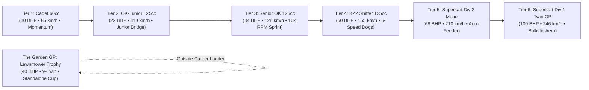
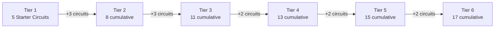

# Feature Spec 052: Karting 6-Tier Career Progression and Standalone Garden GP 🏎️🏆

This specification re-architects the **Karting World Cup Career Mode** into a comprehensive, authentic **6-Tier modern progression ladder**, relocates novelty racing lawnmowers to a dedicated unranked **Garden GP Invitational Cup**, and bridges the historic performance gaps that previously disrupted player skill development.

---

## 🎯 Objectives & Design Philosophy

1. **Eliminate Career Tonal & Physical Whiplash**: Previously, novelty high-CG racing lawnmowers occupied Tier 4—placed directly between violent $155\,\text{km/h}$ 6-speed KZ2 shifter karts pulling $3.5\,\text{G}$ and ballistic $245\,\text{km/h}$ aerodynamic twin Superkarts. Moving lawnmowers to a dedicated standalone event restores CIK-FIA motorsport integrity to the career ladder while keeping lawnmowers 100% playable.
2. **Smooth, Continuous Power Progression**: Eliminates the previous $3\times$ jump from Cadet ($10\,\text{BHP}$) to Senior OK ($30\,\text{BHP}$) by introducing **OK-Junior 125cc ($22\,\text{BHP}$)**, and bridges sprint karts to aerodynamic road-racing monsters via **Superkart Division 2 Mono ($68\,\text{BHP}$)**. Power deltas between tiers never exceed $18\,\text{BHP}$ until the twin-cylinder finale.
3. **Dedicated Novelty Showcase (The Garden GP)**: Preserves the hilarious high-CG pitch oscillations, turf drifting, and V-Twin audio of the racing mowers in an unranked 5-round standalone trophy cup.
4. **18 Authentic Karts (3 Per Tier)**: Expands the authentic kart roster with 6 new models so every tier features 3 balanced manufacturer choices (Tony Kart, CRG, Birel ART, Anderson, MS Kart, and PVT).
5. **Harmonious Circuit Progression**: Maps the 17 existing European kart circuits across 6 tiers ($5\text{ starter} + 3 + 3 + 2 + 2 + 2 = 17\text{ circuits}$) with clear progression from technical momentum tracks to high-speed Grand Prix layouts.

---

## 🗺️ User Flow & Interface Design

### 1. 6-Tier Vehicle Progression Architecture

The career ladder spans 6 distinct engine classifications and performance brackets:



### Complete Vehicle Roster Breakdown (18 Authentic Karts + 3 Standalone Mowers)

| Tier | Category / Championship | Drivetrain & Performance Specs | Vehicle Roster | Class Badge |
| :--- | :--- | :--- | :--- | :--- |
| **Tier 1** | **Rotax Junior Academy** *(Cadet 60cc)* | RWD Direct Live Axle • Centrifugal Clutch<br>60cc 2-Stroke Air-Cooled • ~10 BHP • 12 Nm<br>110 kg with driver • Top: 85 km/h | • CRG Hero 60cc (`kart_crg_hero_60`)<br>• Birel ART C28 (`kart_birel_c28`)<br>• Tony Kart Neos 60 (`kart_tony_kart_neos`) | `CADET` |
| **Tier 2** | **FIA Karting Academy Trophy** *(OK-Junior 125cc)* | RWD Direct Drive • Decompression Valve<br>125cc 2-Stroke Water-Cooled (Restricted)<br>~22 BHP • 18 Nm • 135 kg • Top: 110 km/h | • **Tony Kart Rookie OK-J** (`kart_tony_kart_rookie_okj`)<br>• **CRG Black Mirror OK-J** (`kart_crg_black_mirror_okj`)<br>• **Birel ART RY29 Junior** (`kart_birel_ry29_okj`) | `OK-J` |
| **Tier 3** | **National Kart Championship** *(Senior OK 125cc)* | RWD Direct Drive • Push-Start Screamer<br>125cc 2-Stroke (16,000 RPM Unrestricted)<br>~34 BHP • 23 Nm • 145 kg • Top: 128 km/h | • Tony Kart Racer 401 RR OK (`kart_tony_kart_racer_ok`)<br>• CRG KT2 OK (`kart_crg_kt2_ok`)<br>• Birel ART RY30 OK (`kart_birel_ry30_ok`) | `OK` |
| **Tier 4** | **Continental Shifter Cup** *(KZ2 125cc Shifter)* | 6-Speed Sequential Manual • Standing Start Clutch<br>125cc 2-Stroke Water-Cooled • 4-Wheel Discs<br>~50 BHP • 35 Nm • 175 kg • Top: 155 km/h (0–100 in 2.8s) | • Birel ART KZ2 Shifter (`kart_birel_art_kz2`)<br>• CRG Road Rebel KZ (`kart_crg_road_rebel_kz`)<br>• Tony Kart Racer 401 KZ (`kart_tony_kart_racer_kz`) | `KZ2` |
| **Tier 5** | **Superkart Division 2 Challenge** *(250cc Single Mono)* | 5/6-Speed Sequential • Single-Cylinder Aero<br>250cc 2-Stroke Single / 450cc 4-Stroke Mono<br>~68 BHP • 48 Nm • 205 kg • Top: 210 km/h (0–100 in 2.9s) | • **Anderson Maverick 250 Mono** (`kart_anderson_maverick_mono`)<br>• **MS Kart Superkart Mono** (`kart_ms_superkart_mono`)<br>• **PVT Spyder 250 Single** (`kart_pvt_single_250`) | `DIV 2` |
| **Tier 6** | **Superkart Division 1 World Series** *(250cc Twin GP)* | 6-Speed Sequential • Full Ground Effects & Bi-Wing<br>250cc Twin Tandem 2-Stroke (13,500 RPM)<br>~100 BHP • 66 Nm • 220 kg • Top: 246 km/h (0–100 in 2.4s) | • Anderson CS250 Twin GP (`kart_anderson_cs250`)<br>• MS Kart Superkart 250 (`kart_ms_superkart_250`)<br>• VIPER 250 Twin (`kart_viper_250_twin`) | `SUPER` |

---

### Standalone Novelty Cup: The Garden Grand Prix 🚜🌿

* **Championship Preset**: `series/kart/kart_garden_gp.toml`
* **Format**: Dedicated 5-round unranked trophy cup outside the career XP ladder (`tier = 0`, `is_unranked = true`).
* **Vehicles**:
  * Honda Mean Mower V2 Tuned (`kart_honda_mean_mower`) — 999cc CBR1000RR Fireblade motor, 40 BHP, 170 km/h.
  * John Deere Spec Racing Mower (`kart_john_deere_racing_mower`) — 850cc Vanguard V-Twin, 38 BHP, 165 km/h.
  * Viking T6 Racing Tractor (`kart_viking_t6_tractor`) — 1000cc Briggs & Stratton V-Twin, 42 BHP, 172 km/h.
* **Track Calendar (Curated Grass & Curb Brawlers)**:
  1. *Round 1*: Laval - Circuit Beausoleil (`laval_kart`) — 5 Laps
  2. *Round 2*: Prokart Raceland Wackersdorf (`wackersdorf`) — 5 Laps
  3. *Round 3*: Whilton Mill Kart Circuit (`whilton_mill`) — 5 Laps
  4. *Round 4*: Kartshop Ampfing (`ampfing`) — 5 Laps
  5. *Round 5*: Circuito Internacional de Zuera (`zuera`) — 5 Laps
* **Availability**: Accessible via Modality Selection screen under "Special Events", Quick Race, and Time Attack.

---

### 2. Circuit Unlock Matrix Across 6 Tiers (17 Circuits Total)

The 17 official European circuits in `tracks/kart/` unlock progressively without track clutter:



| Tier | New Circuits Unlocked | Cumulative Total | Track ID & Name | Country | Track Length | Key Tactical Focus |
| :--- | :--- | :--- | :--- | :--- | :--- | :--- |
| **Tier 1** | **5 Starter Circuits** | 5 | • `lonato` (South Garda Karting)<br>• `genk` (Karting Genk Home of Champions)<br>• `wackersdorf` (Prokart Raceland Wackersdorf)<br>• `laval_kart` (Circuit Beausoleil Laval)<br>• `whilton_mill` (Whilton Mill Kart Circuit) | Italy<br>Belgium<br>Germany<br>France<br>UK | 1,200 m<br>1,360 m<br>1,190 m<br>1,232 m<br>1,200 m | Apex line discipline, momentum retention, minimal steering scrub. |
| **Tier 2** | **+3 Circuits** | 8 | • `sarno` (Circuito Internazionale Napoli)<br>• `kristianstad` (Åsum Ring Kristianstad)<br>• `seven_laghi` (Circuito 7 Laghi Castelletto) | Italy<br>Sweden<br>Italy | 1,550 m<br>1,234 m<br>1,256 m | High-rev throttle modulation, intermediate slip angles. |
| **Tier 3** | **+3 Circuits** | 11 | • `pfi` (PF International Kart Circuit)<br>• `franciacorta` (Franciacorta Karting Track)<br>• `ampfing` (Schweppermannring Ampfing) | UK<br>Italy<br>Germany | 1,382 m<br>1,300 m<br>1,063 m | Elevated flyover bridge, high-G physical neck endurance. |
| **Tier 4** | **+2 Circuits** | 13 | • `zuera` (Circuito Internacional de Zuera)<br>• `silverstone_national_kart` (Silverstone National) | Spain<br>UK | 1,700 m<br>1,450 m | Long slipstream straights, heavy front-wheel braking passes. |
| **Tier 5** | **+2 Circuits** | 15 | • `le_mans_kart` (Le Mans Karting International)<br>• `campillos` (KartCenter Campillos) | France<br>Spain | 1,384 m<br>1,580 m | Aerodynamic stability through sweeping high-speed bends. |
| **Tier 6** | **+2 Circuits** | **17** | • `portimao_kart` (Kartódromo Internacional do Algarve)<br>• `valencia_kart` (Lucas Guerrero International) | Portugal<br>Spain | 1,531 m<br>1,428 m | High-aero rollercoaster gradients, maximum GP cornering speed. |

---

## ⚙️ Backend Models & API Endpoints

### 1. Championship Series Presets (`series/kart/*.toml`)

1. **`series/kart/kart_world_cup.toml`** (Tier 1: Rotax Junior Academy):
   - `tier = 1`, `laps_per_round = 5`, `bot_count = 7`.
   - Rounds: 5 (Lonato, Genk, Wackersdorf, Laval, Whilton Mill).
   - Cars: `kart_crg_hero_60`, `kart_birel_c28`, `kart_tony_kart_neos`.
2. **`series/kart/kart_junior_trophy.toml`** (Tier 2, *New*: FIA Karting Academy Trophy):
   - `tier = 2`, `laps_per_round = 5`, `bot_count = 7`.
   - Rounds: 6 (Whilton Mill, Laval, Genk, Sarno, Kristianstad, 7 Laghi).
   - Cars: `kart_tony_kart_rookie_okj`, `kart_crg_black_mirror_okj`, `kart_birel_ry29_okj`.
3. **`series/kart/kart_national_championship.toml`** (Tier 3, *Re-tiered from 2 to 3*):
   - `tier = 3`, `laps_per_round = 5`, `bot_count = 7`.
   - Rounds: 7 (Sarno, Kristianstad, 7 Laghi, Lonato, Franciacorta, Ampfing, PFI).
   - Cars: `kart_tony_kart_racer_ok`, `kart_crg_kt2_ok`, `kart_birel_ry30_ok`.
4. **`series/kart/kart_continental_trophy.toml`** (Tier 4, *Re-tiered from 3 to 4*):
   - `tier = 4`, `laps_per_round = 5`, `bot_count = 7`.
   - Rounds: 8 (PFI, Franciacorta, Ampfing, Zuera, Silverstone National, Le Mans, Sarno, Lonato).
   - Cars: `kart_birel_art_kz2`, `kart_crg_road_rebel_kz`, `kart_tony_kart_racer_kz`.
5. **`series/kart/kart_superkart_div2_challenge.toml`** (Tier 5, *New*: Superkart Div 2 Challenge):
   - `tier = 5`, `laps_per_round = 5`, `bot_count = 7`.
   - Rounds: 9 (Zuera, Silverstone National, Le Mans, Campillos, PFI, Franciacorta, Sarno, Genk, Lonato).
   - Cars: `kart_anderson_maverick_mono`, `kart_ms_superkart_mono`, `kart_pvt_single_250`.
6. **`series/kart/kart_superkart_world_series.toml`** (Tier 6, *Re-tiered from 5 to 6*):
   - `tier = 6`, `laps_per_round = 5`, `bot_count = 7`.
   - Rounds: 10 (Portimao, Valencia, Campillos, Zuera, Le Mans, Silverstone National, PFI, Sarno, Genk, Lonato).
   - Cars: `kart_anderson_cs250`, `kart_ms_superkart_250`, `kart_viper_250_twin`.
7. **`series/kart/kart_garden_gp.toml`** (Standalone Unranked Trophy Cup):
   - `tier = 0`, `id = "kart_garden_gp"`, `name = "The Garden Grand Prix"`.
   - Rounds: 5 (Laval, Wackersdorf, Whilton Mill, Ampfing, Zuera).
   - Cars: `kart_honda_mean_mower`, `kart_john_deere_racing_mower`, `kart_viking_t6_tractor`.

---

### 2. Vehicle Catalog & Engine Sound Archetypes (`crates/tdrace-app/src/catalog/mod.rs`)

Vehicle mapping in the authentic catalog enforces the 6-tier sound and dynamics profile:

```rust
match (self.module_id, self.tier) {
    ("kart", 1) => EngineSoundType::KartCadet60,
    ("kart", 2) => EngineSoundType::Kart125cc,         // OK-Junior restricted 2-stroke
    ("kart", 3) => EngineSoundType::Kart125cc,         // Senior OK 16k RPM direct-drive
    ("kart", 4) => EngineSoundType::KartShifterKZ,     // KZ2 6-speed sequential
    ("kart", 5) => EngineSoundType::Superkart250Twin,  // Division 2 single-cylinder aero
    ("kart", 6) => EngineSoundType::Superkart250Twin,  // Division 1 twin GP
    _ => ...
}
```
*Lawnmowers (`kart_honda_mean_mower`, etc.) strictly retain `EngineSoundType::RacingMowerV2` as unranked Tier 0 models.*

---

### 3. Career Profile XP Gating (`crates/tdrace-app/src/profile/mod.rs`)

Career gating for `"kart"` updates from 5 to 6 levels:
* **Level 1 (Cadet 60cc)**: $0\,\text{XP}$ (Starter unlocked)
* **Level 2 (OK-Junior 125cc)**: $1,500\,\text{XP}$
* **Level 3 (Senior OK 125cc)**: $3,500\,\text{XP}$
* **Level 4 (KZ2 Shifter 125cc)**: $6,000\,\text{XP}$
* **Level 5 (Superkart Div 2 Mono)**: $9,000\,\text{XP}$
* **Level 6 (Superkart Div 1 Twin GP)**: $13,000\,\text{XP}$

Max tier validation is updated:
```rust
let max_tier = if car.module_id == "extreme_offroad" {
    7
} else if car.module_id == "rally" || car.module_id == "kart" {
    6
} else {
    5
};
```

---

## 🛡️ Security & Role-Based Access Controls (RBAC)

1. **Static Catalog Safety**: All 18 authentic karts and 3 lawnmowers are compiled as static constants in the Rust binary, precluding arbitrary vehicle injection.
2. **Deterministic Career Progression**: Progression requirements are evaluated strictly against SQLite career XP milestones; corrupted or altered tiers clamp safely to $1..=6$.
3. **Standalone Series Protection**: The Garden GP series preset is explicitly marked unranked, preventing lawnmower race results from artificially accelerating progression through the CIK-FIA kart ladder.

---

## 🧪 Verification & Acceptance Criteria

### Automated Tests
* Run full project preflight and test suite:
  ```bash
  cargo test -p tdrace-app --test series_tests
  cargo test -p tdrace-app --test garage_tests
  cargo test -p tdrace-app --test render_tests
  keel validate .
  ```

### Manual Acceptance Criteria (Pseudo-Gherkin)

- **Scenario: Player progresses smoothly through the 6-tier karting ladder**
  - [ ] **Given** a new player profile with 0 XP in the karting module
  - [ ] **When** the player opens the Karting Career Mode
  - [ ] **Then** only Tier 1 (Cadet 60cc) is unlocked with 5 starter circuits
  - [ ] **When** the player accumulates 1,500 XP
  - [ ] **Then** Tier 2 (OK-Junior 125cc) unlocks with 3 new circuits (Sarno, Kristianstad, 7 Laghi)
  - [ ] **When** the player progresses through Tier 3 (Senior OK) and Tier 4 (KZ2 Shifter)
  - [ ] **Then** the power steps increase smoothly (+12 BHP, +12 BHP, +16 BHP) without sudden jumps

- **Scenario: Racing lawnmowers do not appear in the tiered career ladder**
  - [ ] **Given** the player navigates through Tiers 1 through 6 in the Karting Career screen
  - [ ] **When** inspecting the eligible vehicle roster for each tier
  - [ ] **Then** no lawnmower models (`kart_honda_mean_mower`, `kart_john_deere_racing_mower`, `kart_viking_t6_tractor`) appear in Tiers 1–6
  - [ ] **And** all opponents on the career grid pilot authentic CIK-FIA karts or Superkarts

- **Scenario: Player accesses the standalone Garden GP Trophy Cup**
  - [ ] **Given** the player selects Special Events or Custom Tournaments
  - [ ] **When** the player launches "The Garden Grand Prix" (`kart_garden_gp`)
  - [ ] **Then** the race grid consists exclusively of racing lawnmowers and tractors
  - [ ] **And** vehicles exhibit authentic high-CG body roll and V-Twin engine audio

- **Scenario: Superkart Division 2 bridges sprint karts to Twin Superkarts**
  - [ ] **Given** the player reaches Tier 5 (Superkart Division 2)
  - [ ] **When** selecting the Anderson Maverick 250 Mono at Le Mans Karting
  - [ ] **Then** the vehicle features aerodynamic front and rear wings with a top speed of ~210 km/h
  - [ ] **And** acts as a manageable aerodynamic stepping stone before the 246 km/h Tier 6 Twin GP

---

## 🔗 Traceability & Codebase Mapping

### Created/Modified Files

- `[ ]` `specs/052_karting_6tier_career_progression_and_standalone_garden_gp.md` -> Governs the specification contract.
- `[ ]` `specs/constitution/ROADMAP.md` -> Registers the milestone under Phase 1.
- `[ ]` `crates/tdrace-app/src/catalog/mod.rs` -> Defines the 6 new kart models (3 OK-J, 3 Div 2 Mono), re-tiers existing karts, and updates sound archetypes.
- `[ ]` `crates/tdrace-app/src/module/kart.rs` -> Updates the 12-pilot favorite car mappings across all 6 tiers.
- `[ ]` `crates/tdrace-app/src/profile/mod.rs` -> Updates career level cap and XP thresholds to 6 tiers.
- `[ ]` `series/kart/kart_world_cup.toml` -> Tier 1 series configuration.
- `[ ]` `series/kart/kart_junior_trophy.toml` -> Tier 2 series configuration (New).
- `[ ]` `series/kart/kart_national_championship.toml` -> Tier 3 series configuration (Re-tiered).
- `[ ]` `series/kart/kart_continental_trophy.toml` -> Tier 4 series configuration (Re-tiered).
- `[ ]` `series/kart/kart_superkart_div2_challenge.toml` -> Tier 5 series configuration (New).
- `[ ]` `series/kart/kart_superkart_world_series.toml` -> Tier 6 series configuration (Re-tiered).
- `[ ]` `series/kart/kart_garden_gp.toml` -> Standalone Lawnmower Invitational series configuration.
- `[ ]` `series/kart/kart_european_championship.toml` -> Replaced or retired in favor of `kart_continental_trophy`.
- `[ ]` `tests/series_tests.rs` / `tests/garage_tests.rs` -> Updates tier bounds and test assertions.
