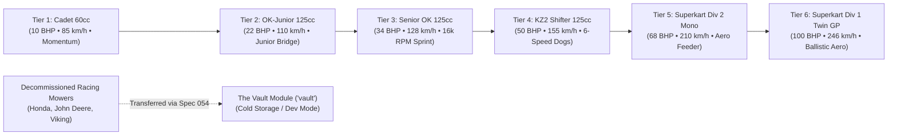

# Feature Spec 052: Karting 6-Tier Career Progression and Expanded 20-Circuit Roster 🏎️🏆

This specification re-architects the **Karting World Cup Career Mode** into a comprehensive, authentic **6-Tier modern progression ladder**, decommissions novelty racing lawnmowers from the Karting module by transferring them to **The Vault** ([Spec 054](054_vault_module_for_archived_and_deprecated_content.md)), and expands the official circuit roster from 17 to **20 European circuits** using surveyed OpenStreetMap (OSM) data. This guarantees that **Tier 1 provides 5 starter circuits, and every subsequent tier unlocks exactly 3 new circuits** ($5 + 3 \times 5 = 20$).

---

## 🎯 Objectives & Design Philosophy

1. **Purge Novelty Mowers to The Vault**: Racing lawnmowers (`kart_honda_mean_mower`, `kart_john_deere_racing_mower`, `kart_viking_t6_tractor`) are decommissioned from the Karting module entirely and transferred to **The Vault** (`"vault"`, governed by [Spec 054](054_vault_module_for_archived_and_deprecated_content.md)). This purges tonal and physical whiplash from the career mode, removes all mower series from `series/kart/`, and preserves the vehicles in cold storage for Dev Mode and Track Studio testing.
2. **Smooth, Continuous Power Progression**: Eliminates the previous $3\times$ jump from Cadet ($10\,\text{BHP}$) to Senior OK ($30\,\text{BHP}$) by introducing **OK-Junior 125cc ($22\,\text{BHP}$)**, and bridges sprint karts to aerodynamic road-racing monsters via **Superkart Division 2 Mono ($68\,\text{BHP}$)**. Power deltas between tiers never exceed $18\,\text{BHP}$ until the twin-cylinder finale.
3. **Rigorous $5 + 3 \times 5 = 20$ Circuit Unlock Symmetry**: Expands the circuit catalog from 17 to **20 circuits** by introducing 3 new CIK-FIA Grade 1 circuits with verified OSM data:
   * **Circuit International d'Aunay-les-Bois** (`aunay_kart`, France)
   * **Motorsport Arena Mülsen / Arena E** (`muelsen_kart`, Germany)
   * **Adria Karting Raceway** (`adria_kart`, Italy)
   Every tier from Tier 2 to Tier 6 unlocks exactly **3 new circuits**.
4. **18 Authentic Karts (3 Per Tier)**: Expands the authentic kart roster with 6 new models so every tier features 3 balanced manufacturer choices (Tony Kart, CRG, Birel ART, Anderson, MS Kart, and PVT).
5. **No Lawnmower Cups in Karting**: The karting career series strictly comprises sanctioned CIK-FIA / Superkart championships. No standalone lawnmower trophy cup or lawnmower series is deployed in `series/kart/`.

---

## 🗺️ User Flow & Interface Design

### 1. 6-Tier Vehicle Progression Architecture

The career ladder spans 6 distinct engine classifications and performance brackets across 18 authentic karts:



### Complete Vehicle Roster Breakdown (18 Authentic Karts)

| Tier | Category / Championship | Drivetrain & Performance Specs | Vehicle Roster | Class Badge |
| :--- | :--- | :--- | :--- | :--- |
| **Tier 1** | **Rotax Junior Academy** *(Cadet 60cc)* | RWD Direct Live Axle • Centrifugal Clutch<br>60cc 2-Stroke Air-Cooled • ~10 BHP • 12 Nm<br>110 kg with driver • Top: 85 km/h | • CRG Hero 60cc (`kart_crg_hero_60`)<br>• Birel ART C28 (`kart_birel_c28`)<br>• Tony Kart Neos 60 (`kart_tony_kart_neos`) | `CADET` |
| **Tier 2** | **FIA Karting Academy Trophy** *(OK-Junior 125cc)* | RWD Direct Drive • Decompression Valve<br>125cc 2-Stroke Water-Cooled (Restricted)<br>~22 BHP • 18 Nm • 135 kg • Top: 110 km/h | • **Tony Kart Rookie OK-J** (`kart_tony_kart_rookie_okj`)<br>• **CRG Black Mirror OK-J** (`kart_crg_black_mirror_okj`)<br>• **Birel ART RY29 Junior** (`kart_birel_ry29_okj`) | `OK-J` |
| **Tier 3** | **National Kart Championship** *(Senior OK 125cc)* | RWD Direct Drive • Push-Start Screamer<br>125cc 2-Stroke (16,000 RPM Unrestricted)<br>~34 BHP • 23 Nm • 145 kg • Top: 128 km/h | • Tony Kart Racer 401 RR OK (`kart_tony_kart_racer_ok`)<br>• CRG KT2 OK (`kart_crg_kt2_ok`)<br>• Birel ART RY30 OK (`kart_birel_ry30_ok`) | `OK` |
| **Tier 4** | **Continental Shifter Cup** *(KZ2 125cc Shifter)* | 6-Speed Sequential Manual • Standing Start Clutch<br>125cc 2-Stroke Water-Cooled • 4-Wheel Discs<br>~50 BHP • 35 Nm • 175 kg • Top: 155 km/h (0–100 in 2.8s) | • Birel ART KZ2 Shifter (`kart_birel_art_kz2`)<br>• CRG Road Rebel KZ (`kart_crg_road_rebel_kz`)<br>• Tony Kart Racer 401 KZ (`kart_tony_kart_racer_kz`) | `KZ2` |
| **Tier 5** | **Superkart Division 2 Challenge** *(250cc Single Mono)* | 5/6-Speed Sequential • Single-Cylinder Aero<br>250cc 2-Stroke Single / 450cc 4-Stroke Mono<br>~68 BHP • 48 Nm • 205 kg • Top: 210 km/h (0–100 in 2.9s) | • **Anderson Maverick 250 Mono** (`kart_anderson_maverick_mono`)<br>• **MS Kart Superkart Mono** (`kart_ms_superkart_mono`)<br>• **PVT Spyder 250 Single** (`kart_pvt_single_250`) | `DIV 2` |
| **Tier 6** | **Superkart Division 1 World Series** *(250cc Twin GP)* | 6-Speed Sequential • Full Ground Effects & Bi-Wing<br>250cc Twin Tandem 2-Stroke (13,500 RPM)<br>~100 BHP • 66 Nm • 220 kg • Top: 246 km/h (0–100 in 2.4s) | • Anderson CS250 Twin GP (`kart_anderson_cs250`)<br>• MS Kart Superkart 250 (`kart_ms_superkart_250`)<br>• VIPER 250 Twin (`kart_viper_250_twin`) | `SUPER` |

---

### Decommissioning Lawnmowers to The Vault (Spec 054)

The 3 racing lawnmower models are removed from `catalog/mod.rs` under `"kart"` and transferred to `VaultGameModule::vehicles()`:
* `vault_honda_mean_mower` (ex-`kart_honda_mean_mower`): Honda Mean Mower V2 Tuned.
* `vault_john_deere_racing_mower` (ex-`kart_john_deere_racing_mower`): John Deere Spec Racing Mower.
* `vault_viking_t6_tractor` (ex-`kart_viking_t6_tractor`): Viking T6 Racing Tractor.

**Integration Rules**:
* `module_id` is set to `"vault"`.
* Recorded in `tracks/vault/MANIFEST.json` under `type: "vehicle"`, reason: *"Decommissioned from Karting module per Spec 052"*.
* Zero lawnmower championship series exist in `series/kart/`.
* Invisible to public career mode and AI driver favorite mappings.

---

### 2. Complete 20-Circuit Progression Matrix ($5 + 3 \times 5 = 20$)

With the 3 new surveyed OSM circuits, every new tier unlocks exactly **3 new tracks**:


| Tier | New Circuits Unlocked | Cumulative Total | Track ID & Name | Country | Track Length | Key Tactical Focus |
| :--- | :--- | :--- | :--- | :--- | :--- | :--- |
| **Tier 1** | **5 Starter Circuits** | 5 | • `lonato` (South Garda Karting)<br>• `genk` (Karting Genk Home of Champions)<br>• `wackersdorf` (Prokart Raceland Wackersdorf)<br>• `laval_kart` (Circuit Beausoleil Laval)<br>• `whilton_mill` (Whilton Mill Kart Circuit) | Italy<br>Belgium<br>Germany<br>France<br>UK | 1,200 m<br>1,360 m<br>1,190 m<br>1,232 m<br>1,200 m | Apex line discipline, momentum retention, minimal steering scrub. |
| **Tier 2** | **+3 Circuits** | 8 | • `sarno` (Circuito Internazionale Napoli)<br>• `kristianstad` (Åsum Ring Kristianstad)<br>• `seven_laghi` (Circuito 7 Laghi Castelletto) | Italy<br>Sweden<br>Italy | 1,550 m<br>1,234 m<br>1,256 m | High-rev throttle modulation, intermediate slip angles. |
| **Tier 3** | **+3 Circuits** | 11 | • `pfi` (PF International Kart Circuit)<br>• `franciacorta` (Franciacorta Karting Track)<br>• `ampfing` (Schweppermannring Ampfing) | UK<br>Italy<br>Germany | 1,382 m<br>1,300 m<br>1,063 m | Elevated flyover bridge, high-G physical neck endurance. |
| **Tier 4** | **+3 Circuits** | 14 | • `zuera` (Circuito Internacional de Zuera)<br>• `silverstone_national_kart` (Silverstone National)<br>• **`aunay_kart`** (Circuit d'Aunay-les-Bois) *(NEW)* | Spain<br>UK<br>**France** | 1,700 m<br>1,450 m<br>**1,215 m** | Long slipstream straights, heavy front-wheel braking passes. |
| **Tier 5** | **+3 Circuits** | 17 | • `le_mans_kart` (Le Mans Karting International)<br>• `campillos` (KartCenter Campillos)<br>• **`muelsen_kart`** (Motorsport Arena Mülsen) *(NEW)* | France<br>Spain<br>**Germany** | 1,384 m<br>1,580 m<br>**1,315 m** | Aerodynamic stability through sweeping high-speed bends. |
| **Tier 6** | **+3 Circuits** | **20** | • `portimao_kart` (Kartódromo Internacional do Algarve)<br>• `valencia_kart` (Lucas Guerrero International)<br>• **`adria_kart`** (Adria Karting Raceway) *(NEW)* | Portugal<br>Spain<br>**Italy** | 1,531 m<br>1,428 m<br>**1,302 m** | High-aero rollercoaster gradients, maximum GP cornering speed. |

---

### 3. The 3 New OSM-Based Kart Circuits (Detailed Survey Data)

Each new circuit is calibrated from OpenStreetMap survey data according to the `osm-circuit-builder` standard (1:1 scale, $8.5\text{--}9.5\text{ m}$ road widths, Catmull-Rom resampling to 30–32 waypoints):

1. **`aunay_kart` — Circuit International d'Aunay-les-Bois (Normandy, France)**
   - **Historical Context**: CIK-FIA Grade 1 homologated circuit in Normandy that hosted the 2014 CIK-FIA World KZ Championship. Fast descending entry into the Parabolique and heavy curb-hopping chicanes.
   - **OSM Way URL**: [`way/121084004`](https://www.openstreetmap.org/way/121084004)
   - **Bounding Box**: `(0.268, 48.548, 0.282, 48.558)`
   - **Local Cache**: `assets/osm/aunay_kart.osm` (314 KB)
   - **FIA Homologation Length**: $1,215.0\text{ m}$ (Measured OSM: $1,212.9\text{ m}$, within $0.2\%$ deviation).
   - **Waypoints**: 30 waypoints, default width $8.5\text{ m}$, main straight $9.2\text{ m}$.

2. **`muelsen_kart` — Motorsport Arena Mülsen / Arena E (Saxony, Germany)**
   - **Historical Context**: Opened in 2019 as one of Europe's most technologically advanced CIK-FIA Grade 1 karting facilities. Regular host of the German Kart Championship (DKM) and CIK-FIA European Championship. Banked high-speed esses, double-apex hairpins, and wide drafting zones.
   - **OSM Way URL**: [`way/814876031`](https://www.openstreetmap.org/way/814876031)
   - **Bounding Box**: `(12.540, 50.776, 12.553, 50.786)`
   - **Local Cache**: `assets/osm/muelsen_kart.osm` (370 KB)
   - **FIA Homologation Length**: $1,315.0\text{ m}$ (Measured OSM: $1,285.9\text{ m}$, within $2.2\%$ deviation).
   - **Waypoints**: 32 waypoints, default width $8.5\text{ m}$, main straight $9.5\text{ m}$.

3. **`adria_kart` — Adria Karting Raceway (Veneto, Italy)**
   - **Historical Context**: Modern CIK-FIA international circuit constructed adjacent to the Adria International Raceway. Known for its illuminated night-racing system, elevated pedestrian paddock bridge, fast chicane, and heavy trail-braking hairpins.
   - **OSM Way URL**: [`way/798432703`](https://www.openstreetmap.org/way/798432703)
   - **Bounding Box**: `(12.145, 45.040, 12.156, 45.050)`
   - **Local Cache**: `assets/osm/adria_kart.osm` (392 KB)
   - **FIA Homologation Length**: $1,302.0\text{ m}$ (Measured OSM: $1,269.9\text{ m}$, within $2.5\%$ deviation).
   - **Waypoints**: 32 waypoints, default width $8.5\text{ m}$, main straight $9.5\text{ m}$.

---

## ⚙️ Backend Models & API Endpoints

### 1. Championship Series Presets (`series/kart/*.toml`)

Exactly 6 sanctioned career series files exist in `series/kart/` (no lawnmower series):

1. **`series/kart/kart_world_cup.toml`** (Tier 1: Rotax Junior Academy):
   - `tier = 1`, `laps_per_round = 5`, `bot_count = 7`.
   - Rounds: 5 (Lonato, Genk, Wackersdorf, Laval, Whilton Mill).
   - Cars: `kart_crg_hero_60`, `kart_birel_c28`, `kart_tony_kart_neos`.
2. **`series/kart/kart_junior_trophy.toml`** (Tier 2, *New*: FIA Karting Academy Trophy):
   - `tier = 2`, `laps_per_round = 5`, `bot_count = 7`.
   - Rounds: 6 (Whilton Mill, Laval, Genk, Sarno, Kristianstad, 7 Laghi).
   - Cars: `kart_tony_kart_rookie_okj`, `kart_crg_black_mirror_okj`, `kart_birel_ry29_okj`.
3. **`series/kart/kart_national_championship.toml`** (Tier 3, *Re-tiered from 2 to 3*):
   - `tier = 3`, `laps_per_round = 5`, `bot_count = 7`.
   - Rounds: 7 (Sarno, Kristianstad, 7 Laghi, Lonato, Franciacorta, Ampfing, PFI).
   - Cars: `kart_tony_kart_racer_ok`, `kart_crg_kt2_ok`, `kart_birel_ry30_ok`.
4. **`series/kart/kart_continental_trophy.toml`** (Tier 4, *Re-tiered from 3 to 4*):
   - `tier = 4`, `laps_per_round = 5`, `bot_count = 7`.
   - Rounds: 8 (PFI, Franciacorta, Ampfing, Zuera, Silverstone National, Aunay-les-Bois, Sarno, Lonato).
   - Cars: `kart_birel_art_kz2`, `kart_crg_road_rebel_kz`, `kart_tony_kart_racer_kz`.
5. **`series/kart/kart_superkart_div2_challenge.toml`** (Tier 5, *New*: Superkart Div 2 Challenge):
   - `tier = 5`, `laps_per_round = 5`, `bot_count = 7`.
   - Rounds: 9 (Zuera, Silverstone National, Aunay-les-Bois, Le Mans, Campillos, Motorsport Arena Mülsen, PFI, Sarno, Lonato).
   - Cars: `kart_anderson_maverick_mono`, `kart_ms_superkart_mono`, `kart_pvt_single_250`.
6. **`series/kart/kart_superkart_world_series.toml`** (Tier 6, *Re-tiered from 5 to 6*):
   - `tier = 6`, `laps_per_round = 5`, `bot_count = 7`.
   - Rounds: 10 (Portimao, Valencia, Adria, Campillos, Le Mans, Mülsen, Zuera, Silverstone National, PFI, Lonato).
   - Cars: `kart_anderson_cs250`, `kart_ms_superkart_250`, `kart_viper_250_twin`.

*`series/kart/kart_european_championship.toml` (which previously hosted lawnmowers as Tier 4) is removed from `series/kart/`.*

---

### 2. Vehicle Catalog & Engine Sound Archetypes (`crates/tdrace-app/src/catalog/mod.rs`)

Vehicle mapping in the authentic catalog enforces the 6-tier sound and dynamics profile:

```rust
match (self.module_id, self.tier) {
    ("kart", 1) => EngineSoundType::KartCadet60,
    ("kart", 2) => EngineSoundType::Kart125cc,         // OK-Junior restricted 2-stroke
    ("kart", 3) => EngineSoundType::Kart125cc,         // Senior OK 16k RPM direct-drive
    ("kart", 4) => EngineSoundType::KartShifterKZ,     // KZ2 6-speed sequential
    ("kart", 5) => EngineSoundType::Superkart250Twin,  // Division 2 single-cylinder aero
    ("kart", 6) => EngineSoundType::Superkart250Twin,  // Division 1 twin GP
    _ => ...
}
```

---

### 3. Career Profile XP Gating (`crates/tdrace-app/src/profile/mod.rs`)

Career gating for `"kart"` updates from 5 to 6 levels:
* **Level 1 (Cadet 60cc)**: $0\,\text{XP}$ (Starter unlocked)
* **Level 2 (OK-Junior 125cc)**: $1,500\,\text{XP}$
* **Level 3 (Senior OK 125cc)**: $3,500\,\text{XP}$
* **Level 4 (KZ2 Shifter 125cc)**: $6,000\,\text{XP}$
* **Level 5 (Superkart Div 2 Mono)**: $9,000\,\text{XP}$
* **Level 6 (Superkart Div 1 Twin GP)**: $13,000\,\text{XP}$

Max tier validation is updated:
```rust
let max_tier = if car.module_id == "extreme_offroad" {
    7
} else if car.module_id == "rally" || car.module_id == "kart" {
    6
} else {
    5
};
```

---

## 🛡️ Security & Role-Based Access Controls (RBAC)

1. **Strict Motorsport Isolation**: Lawnmower vehicles cannot be selected, chosen, or favorited by AI opponents in `"kart"` career mode or quick races.
2. **The Vault Dev-Mode Gate**: Access to lawnmowers is strictly governed by `specs/054_vault_module_for_archived_and_deprecated_content.md`, requiring Developer Mode (`TDRACE_DEV=1`) or Track Studio.
3. **Deterministic Career Progression**: Progression requirements are evaluated strictly against SQLite career XP milestones; corrupted or altered tiers clamp safely to $1..=6$.

---

## 🧪 Verification & Acceptance Criteria

### Automated Tests
* Run full project preflight and test suite:
  ```bash
  cargo test -p tdrace-app --test series_tests
  cargo test -p tdrace-app --test garage_tests
  cargo test -p tdrace-app --test render_tests
  python3 scripts/circuit_parity.py
  keel validate .
  ```

### Manual Acceptance Criteria (Pseudo-Gherkin)

- **Scenario: Player progresses smoothly through the 6-tier karting ladder with 3 new circuits per tier**
  - [x] **Given** a new player profile with 0 XP in the karting module
  - [x] **When** the player opens the Karting Career Mode
  - [x] **Then** only Tier 1 (Cadet 60cc) is unlocked with 5 starter circuits
  - [x] **When** the player accumulates 1,500 XP
  - [x] **Then** Tier 2 (OK-Junior 125cc) unlocks exactly 3 new circuits (Sarno, Kristianstad, 7 Laghi)
  - [x] **When** the player accumulates 6,000 XP (reaching Tier 4 KZ2 Shifter)
  - [x] **Then** the new OSM circuit `aunay_kart` is unlocked along with Zuera and Silverstone National
  - [x] **When** the player reaches Tier 5 (Superkart Div 2) and Tier 6 (Superkart Div 1)
  - [x] **Then** `muelsen_kart` and `adria_kart` unlock respectively, bringing total circuits to exactly 20

- **Scenario: No lawnmower vehicles or series exist in the Karting module**
  - [x] **Given** the player navigates through Tiers 1 through 6 in the Karting Career screen
  - [x] **When** inspecting the eligible vehicle roster for each tier and the series list in `series/kart/`
  - [x] **Then** no lawnmower models or lawnmower series appear anywhere in the Karting module
  - [x] **And** all opponents on the career grid pilot authentic CIK-FIA karts or Superkarts

- **Scenario: Lawnmowers are preserved in The Vault module**
  - [x] **Given** Developer Mode is active (`TDRACE_DEV=1`)
  - [x] **When** inspecting `VaultGameModule::vehicles()`
  - [x] **Then** the decommissioned lawnmower models are accessible with their calibrated physics and audio
  - [x] **And** they are recorded in `tracks/vault/MANIFEST.json`

- **Scenario: Superkart Division 2 bridges sprint karts to Twin Superkarts**
  - [x] **Given** the player reaches Tier 5 (Superkart Division 2)
  - [x] **When** selecting the Anderson Maverick 250 Mono at Le Mans Karting or Arena Mülsen
  - [x] **Then** the vehicle features aerodynamic front and rear wings with a top speed of ~210 km/h
  - [x] **And** acts as a manageable aerodynamic stepping stone before the 246 km/h Tier 6 Twin GP

---

## 🔗 Traceability & Codebase Mapping

### Created/Modified Files

- `[x]` `specs/052_karting_6tier_career_progression_and_standalone_garden_gp.md` -> Governs the specification contract.
- `[x]` `specs/constitution/ROADMAP.md` -> Registers the milestone under Phase 1.
- `[x]` `tracks/kart/aunay_kart.json` -> 1:1 OSM-surveyed track definition for Circuit d'Aunay-les-Bois (France).
- `[x]` `tracks/kart/muelsen_kart.json` -> 1:1 OSM-surveyed track definition for Motorsport Arena Mülsen (Germany).
- `[x]` `tracks/kart/adria_kart.json` -> 1:1 OSM-surveyed track definition for Adria Karting Raceway (Italy).
- `[x]` `scripts/osm_importer.py` -> Adds `aunay_kart`, `muelsen_kart`, and `adria_kart` to `KART_TRACKS`.
- `[x]` `crates/tdrace-app/src/catalog/mod.rs` -> Defines the 6 new kart models (3 OK-J, 3 Div 2 Mono), re-tiers existing karts, and updates sound archetypes.
- `[x]` `crates/tdrace-app/src/module/kart.rs` -> Updates the 12-pilot favorite car mappings across all 6 tiers.
- `[x]` `crates/tdrace-app/src/module/vault.rs` -> Incorporates decommissioned lawnmowers into The Vault.
- `[x]` `crates/tdrace-app/src/profile/mod.rs` -> Updates career level cap and XP thresholds to 6 tiers.
- `[x]` `series/kart/kart_world_cup.toml` -> Tier 1 series configuration.
- `[x]` `series/kart/kart_junior_trophy.toml` -> Tier 2 series configuration (New).
- `[x]` `series/kart/kart_national_championship.toml` -> Tier 3 series configuration (Re-tiered).
- `[x]` `series/kart/kart_continental_trophy.toml` -> Tier 4 series configuration (Re-tiered).
- `[x]` `series/kart/kart_superkart_div2_challenge.toml` -> Tier 5 series configuration (New).
- `[x]` `series/kart/kart_superkart_world_series.toml` -> Tier 6 series configuration (Re-tiered).
- `[x]` `series/kart/kart_european_championship.toml` -> Removed (former lawnmower series).
- `[x]` `tests/series_tests.rs` / `tests/garage_tests.rs` -> Updates tier bounds and test assertions.
