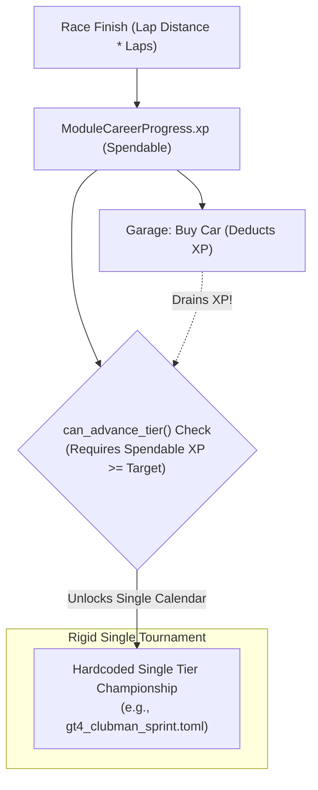
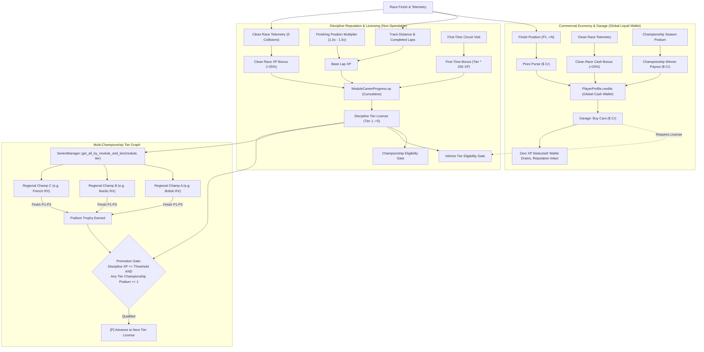

# Architecture Spec: Dual-Currency Economy & Branching Career Progression Architecture 🏗️💰🏁

A comprehensive architectural blueprint establishing **Model 1: Decoupled Dual-Currency Economy (Driver XP + Bank Credits)** and **Multi-Championship Branching Paths per Tier** for **TdRace**. This specification re-architects career progression so that players can pursue diverse motorsport championships within each tier, advance non-linearly, and invest prize money into vehicle collections without jeopardizing license tiers or career advancement.

---

## 🎯 Executive Summary & Problem Statement

### 1.1 Limitations of the Current Monolithic Progression Model
In the baseline career system ([Spec 013](013_player_profile_enhancement_and_career_dossier.md), [Spec 030](030_career_system_wiki_reference_and_progression_mechanics.md)):
1. **Currency Conflation (XP as Money)**: Experience Points (`ModuleCareerProgress.xp`) serve as both a skill reputation metric and a spendable currency. When a player purchases a Tier 2 car for $2,000\,\text{XP}$, their spendable balance drops, directly delaying their tier advancement check (`can_advance_tier` requires $\text{xp} \ge \text{next\_tier} \times 1,000$).
2. **Rigid Single-Calendar Progression**: Each career tier provides exactly one fixed tournament calendar per discipline (e.g. `gt4_clubman_sprint.toml` for GT Tier 1, `rally_grassroots_cup.toml` for Rally Tier 1). There is no opportunity for players to explore distinct regional championships, varied track combinations, or alternative career paths.
3. **Flat Finishing Economy**: Finishing 1st yields the exact same XP as finishing last—XP is based strictly on track length and lap count, with zero reward scaling for racecraft, overtakes, or podium finishes.
4. **Homogenized Vehicle Pricing**: Every car in a given tier costs identical XP ($\text{tier} \times 1,000$), eliminating market diversity between grassroots machinery, customer racers, and exotic homologation specials.

### 1.2 Architectural Goals
This specification establishes a clean, decoupled architecture:
- **Dual-Currency Separation**:
  - **Discipline XP (Reputation)**: Permanent, non-spendable driver skill rating within each motorsport discipline. XP unlocks tier licenses, championship eligibility, and AI difficulty tiers.
  - **Global Bank Credits ($\text{Cr} / \$)**: Liquid cash earned through race prize purses, championship podium finishes, and clean race bonuses. Credits are spent in the Garage to purchase machinery.
- **Multi-Championship Branching per Tier**:
  - Each career tier supports multiple distinct, declarative championships (e.g., in Rallycross Tier 1: *British Rallycross Sprint*, *Nordic RX Trophy*, *French RX Challenge*).
  - Players can choose their path to advance: achieving a podium in **any** championship within the tier satisfies the competition requirement for promotion.
- **System-First Design**:
  - Establishes the engine schemas, mathematical models, database migrations, and UI patterns now, allowing each motorsport module (GT, NASCAR, Rally, Kart, Extreme Off-Road) to be enriched with bespoke regional/national championships in follow-up content iterations.

---

## 🗺️ Current vs. Proposed System Architecture

### 1. Current Architecture (Monolithic XP & Linear Single Calendar)



*Defects*: Purchasing a car directly delays tier promotion; players have no agency over which events or circuits they race to progress.

---

### 2. Proposed Architecture (Decoupled Dual-Currency & Branching Path Graph)



---

## 💰 Mathematical Models & Economic Calibration

### 1. Global Prize Purse & Cash Economy ($\text{Cr}$)

Prize money is deposited directly into `PlayerProfile.credits` and is shared across all motorsport modules.

#### 1.1 Base Purse by Tier
The base prize purse scales exponentially with motorsport tier:

$$\text{base\_purse}(\text{tier}) = \begin{cases} 
\$5,000\,\text{Cr} & \text{Tier 1 (Grassroots / Clubman)} \\
\$12,000\,\text{Cr} & \text{Tier 2 (Amateur / Continental)} \\
\$25,000\,\text{Cr} & \text{Tier 3 (Pro-Am / National)} \\
\$55,000\,\text{Cr} & \text{Tier 4 (Professional / International)} \\
\$120,000\,\text{Cr} & \text{Tier 5 (World Apex / Hypercar)}
\end{cases}$$

#### 1.2 Round Finishing Position Multipliers
The prize purse awarded for each finished round is calculated as:

$$\text{round\_purse}(\text{pos}, \text{tier}) = \text{round\_to\_100}(\text{base\_purse}(\text{tier}) \times M_{\text{pos}})$$

| Finishing Position | Purse Multiplier ($M_{\text{pos}}$) | Tier 1 Round Purse | Tier 3 Round Purse | Tier 5 Round Purse |
| :---: | :---: | :---: | :---: | :---: |
| **1st Place (Gold)** | **$1.00\times$** | **$\$5,000$** | **$\$25,000$** | **$\$120,000$** |
| **2nd Place (Silver)** | **$0.70\times$** | **$\$3,500$** | **$\$17,500$** | **$\$84,000$** |
| **3rd Place (Bronze)** | **$0.50\times$** | **$\$2,500$** | **$\$12,500$** | **$\$60,000$** |
| **4th Place** | **$0.35\times$** | **$\$1,750$** | **$\$8,750$** | **$\$42,000$** |
| **5th Place** | **$0.25\times$** | **$\$1,250$** | **$\$6,250$** | **$\$30,000$** |
| **6th–10th Place** | **$0.15\times$** | **$\$750$** | **$\$3,750$** | **$\$18,000$** |
| **11th+ / Finisher** | **$0.08\times$** | **$\$400$** | **$\$2,000$** | **$\$9,600$** |

#### 1.3 Clean Race Cash Bonus
- If the driver completes the race with zero wall impacts and zero car-to-car collision incidents:
  $$\text{clean\_race\_bonus} = 0.20 \times \text{round\_purse}(\text{pos}, \text{tier})$$

#### 1.4 Championship Season Completion Payouts
Upon completing the final round of any championship tournament, overall podium finishers receive an additional season-end payout:
- **Championship 1st Place (Gold Trophy)**: $4.0 \times \text{base\_purse}(\text{tier})$ (e.g. $+\$20,000$ in Tier 1; $+\$480,000$ in Tier 5)
- **Championship 2nd Place (Silver Trophy)**: $2.5 \times \text{base\_purse}(\text{tier})$ (e.g. $+\$12,500$ in Tier 1; $+\$300,000$ in Tier 5)
- **Championship 3rd Place (Bronze Trophy)**: $1.5 \times \text{base\_purse}(\text{tier})$ (e.g. $+\$7,500$ in Tier 1; $+\$180,000$ in Tier 5)

---

### 2. Vehicle Purchasing Costs & Valuation ($\text{Cr}$)

Vehicles are priced in Credits, replacing the legacy XP pricing model:

| Category Tier | Representative Vehicle Examples | Base Credit Price | Required Discipline License |
| :---: | :--- | :---: | :---: |
| **Tier 1** | Toyota Supra GT4, Peugeot 208 Rally4, CRG 60cc, Sand Rail Buggy | **$\$25,000\text{ Cr}$** | Tier 1 License |
| **Tier 2** | Porsche Cayman GT4, Audi S1 WRX, Tony Kart OK, Bronco DR | **$\$60,000\text{ Cr}$** | Tier 2 License |
| **Tier 3** | Ferrari 296 GT3, Audi Sport Quattro S1, KZ2 Shifter, Arctic Hilux | **$\$150,000\text{ Cr}$** | Tier 3 License |
| **Tier 4** | Porsche 911 GT2 RS, Dakar Hilux, Superkart 250, Pro4 Trophy Truck | **$\$380,000\text{ Cr}$** | Tier 4 License |
| **Tier 5** | Porsche 963 LMH, Robby Gordon SST, Anderson CS250, Bigfoot Monster Truck | **$\$950,000\text{ Cr}$** | Tier 5 License |

#### Purchasing Invariants:
1. Driver must hold the appropriate discipline license (`progress.level >= car.tier`).
2. Driver must have sufficient balance (`profile.credits >= car.price`).
3. Car must not already be owned (`!progress.unlocked_cars.contains(car.id)`).
4. Executing purchase deducts Credits from `PlayerProfile.credits`; **zero XP is deducted**.
5. Free starter cars continue to be granted automatically when starting or promoting to a tier.

---

### 3. Cumulative Driver Experience Points (XP) & License Gates

XP measures driving mastery, race participation, and discipline loyalty. It is **permanent and non-spendable**.

#### 3.1 Race XP Award Formula
$$\text{race\_xp} = (\text{lap\_xp} \times M_{\text{xp\_pos}}) + \text{clean\_xp\_bonus} + \text{first\_time\_bonus}$$

- **Base Lap XP**: $\text{per\_lap\_xp} = \text{round\_to\_10}(L_{\text{track}} / 10.0) \times N_{\text{completed\_laps}}$
- **Position Multipliers ($M_{\text{xp\_pos}}$)**:
  - 1st: $1.50\times$
  - 2nd: $1.30\times$
  - 3rd: $1.15\times$
  - 4th–10th: $1.00\times$
- **Clean Race XP Bonus**: $+25\%$ of base lap XP.
- **First-Time Circuit Bonus**: $\text{round\_to\_10}(\text{tier} \times 250\,\text{XP})$.

#### 3.2 Tier License Thresholds
To be eligible for promotion to the next tier license, the driver must accumulate the cumulative XP threshold for that discipline:

| Target Tier License | Cumulative Discipline XP Required |
| :---: | :---: |
| **Tier 1 (Starter)** | $0\text{ XP}$ (Default) |
| **Tier 2 License** | **$3,000\text{ XP}$** |
| **Tier 3 License** | **$7,500\text{ XP}$** |
| **Tier 4 License** | **$15,000\text{ XP}$** |
| **Tier 5 License (Apex)** | **$30,000\text{ XP}$** |

---

## 🌿 Multi-Championship Branching & Progression Rules

### 1. Declarative Championship Discovery
Championships are discovered from TOML presets stored under `series/{module_id}/*.toml` and user storage. The query interface in `SeriesManager` is expanded:

```rust
impl SeriesManager {
    /// Returns all championships matching module_id and tier (sorted by name).
    pub fn get_all_by_module_and_tier(&self, module_id: &str, tier: u32) -> Vec<&SeriesDefinition> {
        let mut list: Vec<&SeriesDefinition> = self
            .series
            .values()
            .filter(|c| c.series.module_id.eq_ignore_ascii_case(module_id) && c.series.tier == tier)
            .collect();
        list.sort_by(|a, b| a.series.name.cmp(&b.series.name));
        list
    }
}
```

### 2. Non-Linear Tier Advancement Gate
In [`ModuleCareerProgress::can_advance_tier`](../crates/tdrace-app/src/profile/mod.rs):

$$\text{can\_advance\_tier} = (\text{xp} \ge \text{tier\_license\_threshold}(\text{level} + 1)) \;\land\; (\text{tier\_podiums}(\text{level}) \ge 1)$$

Where $\text{tier\_podiums}(\text{level})$ counts podium trophies earned across **any** championship registered under that tier:
- The driver does not need to complete all championships in Tier 1.
- Achieving 1st, 2nd, or 3rd in the *British RX Sprint* or *Nordic RX Trophy* satisfies the tournament gate for Tier 1.
- Drivers who enjoy exploring all content can complete the remaining Tier 1 championships anytime for additional prize money, trophies, and 100% completion records.

---

## 🗄️ Database & Storage Migration Plan

### 1. SQLite Schema Evolution

#### 1.1 `profiles` Table
Add global cash balance columns to store the player's bank account:

```sql
ALTER TABLE profiles ADD COLUMN credits INTEGER NOT NULL DEFAULT 25000;
ALTER TABLE profiles ADD COLUMN lifetime_credits INTEGER NOT NULL DEFAULT 25000;
```
*(New profiles start with a $\$25,000\text{ Cr}$ credit grant to facilitate purchasing their first custom car or upgrades).*

#### 1.2 `profile_module_progress` Table
Enrich with JSON storage for per-championship completion records:

```sql
ALTER TABLE profile_module_progress ADD COLUMN championships_completed TEXT NOT NULL DEFAULT '{}';
```

### 2. Rust Domain Models

```rust
/// Persistent summary record of a completed championship tournament.
#[derive(Debug, Clone, PartialEq, Eq, Serialize, Deserialize)]
pub struct ChampionshipRecord {
    pub championship_id: String,
    pub best_finish: u32,             // 1 = Gold, 2 = Silver, 3 = Bronze, etc.
    pub times_completed: u32,
    pub highest_points: u32,
    pub last_completed_at: String,
}

pub struct ModuleCareerProgress {
    pub profile_id: i64,
    pub module_id: String,
    pub xp: u64,                     // Cumulative discipline experience (non-spendable)
    pub level: u32,                  // Current unlocked tier license (1..=5)
    pub unlocked_cars: Vec<String>,
    pub unlocked_tracks: Vec<String>,
    pub visited_tracks: Vec<String>,
    pub completed_events: Vec<String>,
    pub championships_completed: HashMap<String, ChampionshipRecord>, // NEW
    pub trophies_gold: u32,
    pub trophies_silver: u32,
    pub trophies_bronze: u32,
    pub career_rivals: Vec<CareerRivalEntry>,
    pub active_championship: Option<ChampionshipSession>,
}
```

### 3. Lossless Legacy Migration Strategy
When upgrading an existing database:
1. **Wallet Conversion**: For existing player profiles where `credits == 0`, initialize `credits` with $\max(\text{legacy\_xp} \times 10, 25000)\,\text{Cr}$.
2. **XP Preservation**: Legacy `lifetime_xp` is copied directly into cumulative `xp`.
3. **Championship History Backfill**: Existing `profile_championship_awards` rows are scanned to populate `championships_completed` in `ModuleCareerProgress`.

---

## 🔑 Security, Compliance, & IAM Roles

### 1. Anti-Cheat & Economic Validation
- **Race Verification**: Prize money and XP are only awarded if `checkpoints_passed_this_lap >= 0.70 * total_checkpoints` across all scheduled laps.
- **Transaction Safety**: All car purchases verify balance in SQLite with atomic update statements:
  ```sql
  UPDATE profiles SET credits = credits - ? WHERE id = ? AND credits >= ?;
  ```
  Preventing negative wallet balances or duplicate car purchases under rapid UI inputs.

### 2. Developer Mode Integrity (`--dev`)
- When running in developer mode (`--dev`), all vehicles, circuits, and championships are accessible for evaluation.
- Dev mode operations do not write unearned credits or corrupt persistent career saves.

---

## 🛡️ Disaster Recovery, Monitoring, & Fallbacks

### 1. Embedded Preset Fallbacks
If the filesystem `series/` folder is inaccessible (e.g. running in a restricted sandbox or WebAssembly build), `SeriesManager` falls back immediately to compiled-in `EMBEDDED_PRESETS`, ensuring zero panic or crash during championship selection.

### 2. Database Backup & In-Memory Mode
- `HallOfFameDb::open_in_memory()` provides full compatibility for testing and ephemeral environments.
- SQLite database writes use WAL journal mode (`PRAGMA journal_mode = WAL;`) to prevent database corruption during sudden exits.

---

## 🧪 Verification & Acceptance Criteria

### Automated Tests
- Command to run profile and career progression tests: `cargo test -p tdrace-app --test profile_tests`
- Command to run series tournament tests: `cargo test -p tdrace-app --test series_tests`
- Command to run Keel spec integrity check: `keel validate`

### Manual Acceptance Criteria (Pseudo-Gherkin)

- **Scenario: Dual currency wallet separation**
  - [x] **Given** a driver profile with $50,000 Credits and 4,000 GT Discipline XP
  - [x] **When** the driver purchases a Tier 2 car costing $60,000 Credits
  - [x] **Then** the transaction is rejected for insufficient Credits
  - [x] **When** the driver has $60,000 Credits and executes the purchase
  - [x] **Then** the car is unlocked and Credits are reduced to 0
  - [x] **And** the GT Discipline XP remains strictly unchanged at 4,000 XP

- **Scenario: Multi-championship discovery per tier**
  - [x] **Given** a motorsport module with multiple championship definitions in Tier 1
  - [x] **When** `SeriesManager::get_all_by_module_and_tier("rally", 1)` is called
  - [x] **Then** all championships for that module and tier are returned
  - [x] **And** each championship contains a distinct calendar of circuits and regulations

- **Scenario: Non-linear tier advancement across branching championships**
  - [x] **Given** a driver in Tier 1 with 3,500 Discipline XP
  - [x] **When** the driver completes any one of the Tier 1 championships on the podium (P1, P2, or P3)
  - [x] **Then** `can_advance_tier` evaluates to true
  - [x] **And** the driver can promote to Tier 2 without completing the other Tier 1 championships
  - [x] **And** the uncompleted Tier 1 championships remain open and playable

- **Scenario: Prize purse calculation scales by finishing position and clean driving**
  - [x] **Given** a Tier 1 round with a base purse of $5,000 Credits
  - [x] **When** a driver finishes 1st with zero wall or vehicle collisions
  - [x] **Then** the driver receives $5,000 base purse plus $1,000 Clean Race bonus ($6,000 total)
  - [x] **When** a driver finishes 3rd with collisions
  - [x] **Then** the driver receives exactly $2,500 Credits with zero clean bonus

---

## 🔗 Traceability & Codebase Mapping

### Governed Files in Codebase
- `crates/tdrace-app/src/profile/mod.rs` -> Data structures for `PlayerProfile`, `ModuleCareerProgress`, and promotion logic.
- `crates/tdrace-app/src/db/mod.rs` -> SQLite table schemas for `profiles` and `profile_module_progress`.
- `crates/tdrace-app/src/series/manager.rs` -> Discovery methods for multiple championships per tier.
- `crates/tdrace-app/src/game/mod.rs` -> Race finish purse awarding, clean race evaluation, and Career Hub state machine.
- `crates/tdrace-app/src/ui/career_hub.rs` -> Championship selector list and promotion checklist rendering.
- `crates/tdrace-app/src/ui/garage.rs` -> Vehicle credit pricing display and purchasing transactions.
- `specs/constitution/ROADMAP.md` -> Registered under Phase 5 roadmap.
- `specs/index.md` -> Progressive disclosure index.
