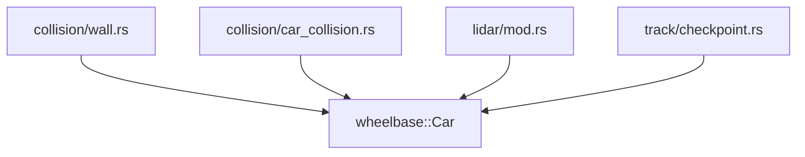
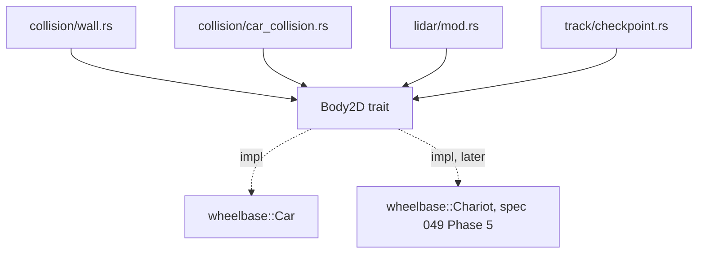

# Architecture Spec: Body2D Trait for Vehicle-Generic Collision and Progress 🏗️

Phase 1 of [spec 049](049_reusable_racing_platform_layers.md), which sets the chariot-first order. Gap ids refer to
[`docs/engineering/racing_platform_analysis.md`](../docs/engineering/racing_platform_analysis.md).

**Goal:**
- `arcade-race-core` works with any rigid body, not only `wheelbase::Car`. This covers collision, LIDAR, the progress tracker and the pit-box check.
- A chariot with its horse team (about 9 m long) collides with walls correctly.
- Every current car gives bit-identical results. The golden hashes from spec 049 must not change.

---

## 🗺️ Current vs. Proposed System Architecture

### 1. Current Architecture

Every engine function that needs a vehicle takes the concrete `wheelbase::Car` (gap E2):

| Function | File |
|---|---|
| `OrientedBox::from_car` | `collision/sat.rs:25` |
| `resolve_car_wall_collision`, `resolve_car_obstacle_collision`, `resolve_all_wall_collisions` | `collision/wall.rs:43,266,367` |
| `resolve_car_car_collision`, `resolve_multi_car_collisions` | `collision/car_collision.rs:20,141` |
| `LidarScanner::scan`, `scan_into` | `lidar/mod.rs:157,164` |
| `TrackProgressTracker::update` | `track/checkpoint.rs:214` |
| `Track::is_in_pit_box` | `track/mod.rs:521` |

These functions only read the pose, velocity, angular velocity, cached speed, mass, inertia, jump height, total elevation and hull size. They only write three things: `position +=`, `velocity +=` and `angular_velocity +=`.

The wall broad phase hardcodes `car_reach = 3.6` m (`wall.rs:62`, gap E3). A body whose corners reach past 3.6 m from its centre skips walls it should hit.



### 2. Proposed Architecture

A new file `crates/arcade-race-core/src/body.rs`. The crate that uses the trait owns it, so `wheelbase` stays pure vehicle physics.

```rust
/// Collision hull around the centre of gravity, in metres.
pub struct BodyHull { pub front: f32, pub rear: f32, pub half_width: f32 }

impl BodyHull {
    /// Distance from the centre of gravity to the farthest hull corner, including the
    /// 0.15 m bumper margin that `OrientedBox::from_body` adds.
    pub fn reach(&self) -> f32;
}

pub trait Body2D {
    fn position(&self) -> Vec2;
    fn angle(&self) -> f32;
    fn velocity(&self) -> Vec2;
    fn angular_velocity(&self) -> f32;
    fn speed(&self) -> f32;            // Car: the cached state.speed, never recomputed
    fn mass(&self) -> f32;
    fn inertia(&self) -> f32;
    fn jump_height(&self) -> f32;      // Car: state.elevation
    fn total_elevation(&self) -> f32;  // Car: Car::total_elevation()
    fn forward_vector(&self) -> Vec2;  // Car: Car::forward_vector()
    fn hull(&self) -> BodyHull;        // Car: cg_to_front, cg_to_rear, track_width / 2
    fn translate(&mut self, d: Vec2);
    fn add_velocity(&mut self, d: Vec2);
    fn add_angular_velocity(&mut self, d: f32);
}

impl Body2D for wheelbase::Car { /* field reads and existing method calls only */ }
```

**The functions become generic in place.** Each one changes to `<B: Body2D>`, and its name stays the same. So callers in `tdrace-app`, `tdrace-py`, the bot harness and the benches compile unchanged.
- `OrientedBox::from_body` keeps the exact expression order of `from_car`.
- `from_car` stays as a one-line wrapper.

**Broad-phase reach.** The wall broad phase uses `hull.reach().max(3.6)`. Measured on 2026-09-28 over all 97 catalog cars (`ALL_REAL_CARS`, `CLASSIC_ARCADE_CARS`) and the 6 `CarConfig` presets, the largest reach is 1.93 m (`gt_ferrari_499p`). So today's results do not change. A chariot team of about 9 m has a reach of about 4.8 m and gets it.

**Why generics, not `dyn`.** The app's `Vec<Car>` compiles to the same code as today, and a `&mut [dyn Body2D]` cannot be built from it.



**Out of scope, with reasons:**
- **Contact points and `sample_body_surfaces`:** nothing needs them until `race-kit` in Phase 2.
- **`impl Body2D for Motorbike`:** `Motorbike` has no inertia, width or elevation fields, and nothing uses it.
- **`JumpRampCarExt`:** stays `Car`-only.
- **A `--no-default-features` build without `wheelbase`:** `arcade-race-core` also uses `wheelbase::SurfaceType`, so the dependency stays.

---

## 🗄️ Database & Storage Migration Plan

No data format changes. Track JSON, `.tdr` replays and SQLite are untouched.

---

## 🔑 Security, Compliance, & IAM Roles

- No new dependencies.
- No `unsafe`, and no I/O.
- The trait lives in `arcade-race-core`, which keeps depending on `wheelbase` only.

---

## 🛡️ Disaster Recovery, Monitoring, & Fallbacks

- **Determinism:**
  - `golden_sim` (`arcade-race-core`) and `golden_session` (`tdrace-app`) must keep their recorded hashes, in debug and in release.
  - A `Car` impl method may only read a field or call an existing method, with no new arithmetic.
- **Performance:** `make bench-rust` must stay above the spec 049 floors: physics 1.5M steps/s, SAT 20M checks/s, LIDAR 14M rays/s.
- **Rollback:** a single `--no-ff` merge. Reverting it restores the `Car`-typed functions.

---

## 🧪 Verification & Acceptance Criteria

### Automated Tests
- Golden tests: `cargo test -p arcade-race-core --test golden_sim` and `cargo test -p tdrace-app --test golden_session`, each also with `--release`.
- New body tests: `cargo test -p arcade-race-core --test body2d_tests`
- Rust suite: `cargo test --workspace --exclude tdrace-py --no-fail-fast`. Only the 3 known failures from spec 049 are allowed.
- Downstream builds: `cargo check -p tdrace-py` and `cargo check -p tdrace-app --target wasm32-unknown-unknown`
- Benches: `make bench-rust`

### Manual Acceptance Criteria (Pseudo-Gherkin)

- **Scenario: Current cars give bit-identical results**
  - [x] **Given** the golden hashes recorded in spec 049 for debug and release on macOS aarch64
  - [x] **When** `golden_sim` and `golden_session` run in debug and in release on the Body2D branch
  - [x] **Then** all four hashes match the recorded values

- **Scenario: A long body hits a wall that the old broad phase skipped**
  - [x] **Given** a test body with a 9 m hull whose front corner overlaps a wall while its centre is 4.5 m away
  - [x] **When** `resolve_all_wall_collisions` runs on it
  - [x] **Then** a collision event is returned and the body is pushed out of the wall

- **Scenario: Two non-car bodies collide and keep momentum**
  - [x] **Given** two test bodies moving toward each other and overlapping
  - [x] **When** `resolve_multi_car_collisions` runs on a `Vec` of them
  - [x] **Then** one contact event is returned and total linear momentum is unchanged to within 1e-3

- **Scenario: The progress tracker follows a non-car body**
  - [x] **Given** a test body driven along the generated oval
  - [x] **When** `TrackProgressTracker::update` runs each step
  - [x] **Then** its progress distance goes up and it passes checkpoints in order

- **Scenario: Existing callers compile unchanged**
  - [x] **Given** the app, the Python bindings, the bot harness and the benches, with no source edits
  - [x] **When** the workspace builds, including `tdrace-py` and the wasm target
  - [x] **Then** everything compiles, and the Rust suite shows only the 3 known failures

---

## 🔗 Traceability & Codebase Mapping

### Created/Modified Files
- `[x]` `crates/arcade-race-core/src/body.rs` -> `Body2D`, `BodyHull`, `impl Body2D for Car`.
- `[x]` `crates/arcade-race-core/src/lib.rs` -> exports `body`.
- `[x]` `crates/arcade-race-core/src/collision/sat.rs` -> `OrientedBox::from_body`.
- `[x]` `crates/arcade-race-core/src/collision/wall.rs` -> generic wall and obstacle resolution, hull-based reach.
- `[x]` `crates/arcade-race-core/src/collision/car_collision.rs` -> generic pair and multi-body resolution.
- `[x]` `crates/arcade-race-core/src/lidar/mod.rs` -> generic scan.
- `[x]` `crates/arcade-race-core/src/track/checkpoint.rs` -> generic tracker update.
- `[x]` `crates/arcade-race-core/src/track/mod.rs` -> generic pit-box check.
- `[x]` `crates/arcade-race-core/tests/body2d_tests.rs` -> the new scenarios.

### Beads Epic Mapping
- Governed by epic *Fulfill Spec 054: Body2D Trait for Vehicle-Generic Collision and Progress*.
