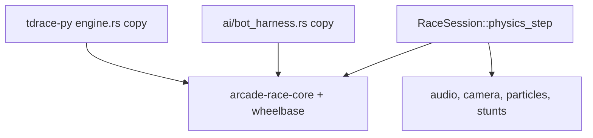
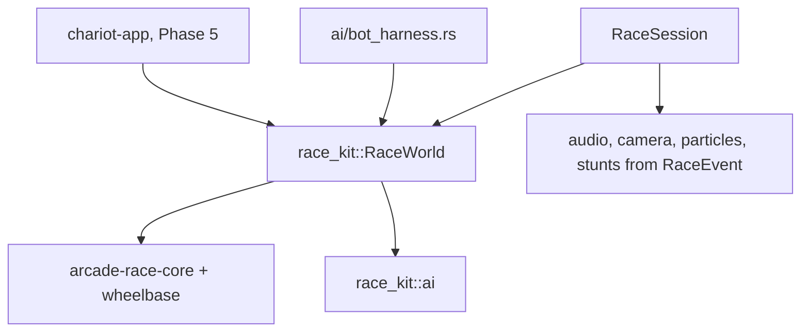

# Architecture Spec: race-kit Headless Race World 🏗️

Phase 2 of [spec 049](049_reusable_racing_platform_layers.md), which sets the chariot-first order. It builds on the `Body2D` trait from [spec 054](054_body2d_trait_for_vehiclegeneric_collision_and_progress.md). Gap ids refer to
[`docs/engineering/racing_platform_analysis.md`](../docs/engineering/racing_platform_analysis.md).

**Goal:**
- A new crate, `race-kit`, runs a race with no window, sound or database. A new game (the chariot game first) gets the race step, lap counting, finish order, real finish times, wrecks and DNF (did not finish) from it.
- The race step exists in one place only. Today it is written out twice in `tdrace-app` (gap A1).
- `tdrace-app` uses the new world for its races. Every current car gives bit-identical results, so the golden hashes do not change.

---

## 🗺️ Current vs. Proposed System Architecture

### 1. Current Architecture

`RaceSession::physics_step` (`crates/tdrace-app/src/game/mod.rs:11318-12051`) mixes the simulation with presentation (gap A1). The simulation parts are:

| Step | Lines | What it does |
|---|---|---|
| 2 | `:11465` | sample the surface under each wheel, with the tracker distance as a hint |
| 2b | `:11472` | slipstream draft between cars |
| 3 | `:11488` | road projection (elevation, bank, grade, track frame), then `step_per_wheel` |
| 3 | `:11501` | tree canopy drag |
| — | `:11528` | jump ramps: take-off, and roll-off from a ramp edge |
| 4 | `:11641` | car-car collisions, `resolve_multi_car_collisions(.., 0.45, 0.35, 3)` |
| 5 | `:11648` | wall and obstacle collisions, scenery included |
| 6 | `:11806` | `TrackProgressTracker::update` for every car |

Between these steps, the same function plays sounds, shakes the camera, spawns particles and floating text, scores stunts and resets drift scores.

`ai/bot_harness.rs:88-160` has a second copy of the step. It has no canopy drag and no ramps. `tdrace-py/src/engine.rs` has a third copy. `replay/mod.rs:367` re-runs the player car alone to check a replay.

Race rules only know the player (gap A2):
- `check_race_finish` (`:12054`) ends the race when the player's lap count passes `total_laps`. Bots never finish.
- `build_results` (`:12403`) and the Hall of Fame (`:12146`) invent every time as `session_time + rank * 0.65`.
- There is no DNF.



### 2. Proposed Architecture

A new crate `crates/race-kit`. Its dependencies are `arcade-race-core`, `wheelbase`, `glam` and `serde` only. It must build for `wasm32-unknown-unknown`. It must not use `macroquad`, `cabinet`, `rusqlite`, `chrono` or `std::time`.

**`Vehicle`**, the interface a vehicle model gives to the world (`race-kit/src/vehicle.rs`):

```rust
/// Controls for one step. The alias keeps the `.tdr` replay format unchanged.
pub type DriveControls = wheelbase::CarControls;

pub trait Vehicle: Body2D {
    fn sample_surfaces(&self, track: &Track, hint: f32) -> [SurfaceType; 4];
    fn draft_intensity(&self, others: &[&Self]) -> f32;
    fn set_draft(&mut self, intensity: f32);
    fn set_road(&mut self, proj: &SplineProjection);
    fn step(&mut self, controls: &DriveControls, surfaces: [SurfaceType; 4], dt: f32);
    /// Tree canopy drag, right after `step`. Returns the trees brushed. The default does nothing.
    fn brush_canopy(&mut self, trees: &[Tree], dt: f32, out: &mut Vec<CanopyBrush>) {}
    /// Jump ramp take-off and roll-off, after all vehicles have stepped. The default does nothing.
    fn step_ramps(&mut self, ramps: &[JumpRamp], dt: f32) {}
    /// Air time of a landing in this step, if there was one. The default never lands.
    fn landed(&self) -> Option<f32> { None }
    /// Called for each wall or vehicle impact. `Some` wrecks the vehicle. The default never wrecks.
    fn on_impact(&mut self, impact_speed: f32) -> Option<DnfCause> { None }
}```

`impl Vehicle for Car` moves today's code without change. The six road writes come from `:11492-11497`. The canopy code comes from `:11501-11519`, and the ramp code from `:11530-11552`. Canopy and ramps stay two hooks, because the top-speed stat is read between them.

**`RaceWorld`**, the race in progress (`race-kit/src/world.rs`):

```rust
pub enum RaceFormat { Laps(u32), TimeAttack }
pub struct RaceRules { pub format: RaceFormat, pub collision: CollisionParams /* 0.45, 0.35, 3 */ }
pub enum FinishState { Racing, Finished { time: f32, position: usize }, Dnf { time: f32, cause: DnfCause } }

pub struct RaceWorld<V: Vehicle = Car> {
    pub rules: RaceRules,
    pub vehicles: Vec<V>,
    pub trackers: Vec<TrackProgressTracker>,
    pub finish: Vec<FinishState>,
    pub top_speed: Vec<f32>,
    /// Surfaces under each vehicle in the last step, for effects and sounds.
    pub last_surfaces: Vec<[SurfaceType; 4]>,
    pub time: f32,
}

impl<V: Vehicle> RaceWorld<V> {
    pub fn new(rules: RaceRules) -> Self;
    pub fn spawn(&mut self, vehicle: V, tracker: TrackProgressTracker) -> usize;
    pub fn step(&mut self, track: &Track, controls: &[DriveControls], dt: f32) -> &[RaceEvent];
    pub fn standings(&self) -> Vec<usize>;
    pub fn results(&self, track: &Track) -> Vec<ParticipantResult>;
}
```

- The world does not own the track. The caller passes `&Track` to each step. `tdrace-app` then keeps its `self.track`, and a later course type can be passed the same way.
- `step` runs the table rows above in today's order. It then updates `top_speed` at the same point as `:11522`, and does the finish bookkeeping for `rules.format`.
- `vehicles` and `trackers` stay public, so the app, its tests and the LAN client can read and write them as they do today.

**Events.** `step` returns the events of that step, in the order they happened:

```rust
pub enum RaceEvent {
    CanopyBrush { car: usize, tree: TreeType, position: Vec2, velocity: Vec2 },
    Landed { car: usize, air_time: f32, position: Vec2, speed: f32 },
    VehicleImpact(CarCarCollisionEvent),
    WallImpact { car: usize, event: WallCollisionEvent },
    Finished { car: usize, position: usize, time: f32 },
    Wrecked { car: usize, cause: DnfCause },
}
```

`tdrace-app` plays sounds, adds camera shake, spawns particles, scores stunts and resets drift scores from these events. It handles them in order, after the step. This is safe because nothing in the step reads the drift fields.

**Finish and DNF.**
- `Laps(n)`: a vehicle finishes when its tracker's `current_lap` passes `n`. Its time is `world.time` at that step. Its position is the next free finish position.
- `TimeAttack`: nobody finishes.
- A wreck: `on_impact` returns `Some(cause)`. The world then sets `Dnf`, emits `Wrecked` once, and ignores that vehicle's controls from then on. The wreck stays in the world, and other vehicles still hit it.
- `standings()` puts finished vehicles first, in finish order. Next come the racing vehicles, by lap and then by progress, as `compute_standings` (`:12384`) does today. DNF vehicles come last.
- `results()` gives each vehicle its real finish time. A vehicle that is still racing when the app ends the race gets a projected time: its race time plus the distance it still has to drive, divided by its average speed so far. The result marks the time as projected.

**AI.** `ai/mod.rs` (`BotAiDriver`, `BotProfile`, `DriverTier`, `DrivingStyle`, `DriverQuality`), `ai/humanize.rs` and `LcgRng` move to `race-kit/src/ai/` with `git mv`. They use no tdrace content today. They stay typed to `Car` until Phase 5. `tdrace-app/src/ai/mod.rs` re-exports them, so every `crate::ai::` path keeps working. The roster code (`ai/driver.rs`, `ai/career.rs`) stays in the app.

**How `tdrace-app` switches over.**
- `RaceSession` gets `world: RaceWorld<Car>`. The `cars` and `trackers` fields go away. `session.cars` becomes `session.world.vehicles` and `session.trackers` becomes `session.world.trackers`, in the app and in its tests. This is a mechanical rename.
- `physics_step` keeps gathering controls, calls `world.step`, and then does the presentation from the events.
- The roster code (`:3588`, `:8785`) calls `world.spawn`.
- `check_race_finish` still ends the race when the player finishes. This is unchanged.
- `compute_standings` uses `world.standings()`.
- `build_results` and the Hall of Fame use `world.results()`. **This is a visible change:** result times become real times instead of `session_time + rank * 0.65`.
- `ai/bot_harness.rs` stays in the app, because its keyboard reference driver uses `cabinet`. Its step becomes a call to `RaceWorld::step`. It then gets canopy drag and ramps. Bot lap times can change on tracks with trees or ramps.



**Changes from the spec 049 plan, with reasons:**
- **No `Course` trait yet.** `Track` is the only course until Phases 6 and 7. A trait designed now, with one impl, would guess the wrong shape. The world takes `&Track` per step, so a later course type slots in without changing `RaceWorld`'s type.
- **Four surfaces, not up to eight contact points.** A car has 4 wheels. The chariot plan has 4 contact points (2 wheels, 2 hoof groups).
- **No `StageSeries`.** Only the rally game needs it. It moves to Phase 8.
- **No scenery cache.** The step keeps calling `all_obstacles_with_scenery()` each step, as today. Speed stays the same, and the change stays smaller.

**Out of scope, with reasons:**
- **`tdrace-py`:** it keeps its own step. Porting it changes its training results, so it needs its own decision.
- **The replay check in `replay/mod.rs`:** it re-runs one car with no walls or opponents (gap E9). Fixing it needs the other cars' inputs in the replay file, which is a format change.
- **An AI generic over the vehicle:** Phase 5, when the chariot exists.
- **Open courses, `PointToPoint` and `Endless` formats:** Phases 6 and 7.

---

## 🗄️ Database & Storage Migration Plan

- No schema changes. Track JSON and `.tdr` replays are unchanged.
- New Hall of Fame and race history rows get real times. Old rows keep their old times.

---

## 🔑 Security, Compliance, & IAM Roles

- New crate `race-kit`, inside this workspace. No new external dependencies.
- No `unsafe`, and no I/O.

---

## 🛡️ Disaster Recovery, Monitoring, & Fallbacks

- **Determinism:**
  - `golden_sim` stays as it is. A new `race-kit` test, `golden_world`, runs the same race through `RaceWorld<Car>`. It must give the same hashes as `golden_sim`, in debug and in release.
  - `golden_session` must keep its recorded hashes, in debug and in release.
  - Code moves without change. Where an expression changes, a comment gives the reason.
- **Tests that change on purpose:** result-time checks and bot-harness lap times. Each change gets its own commit, with the old and new numbers.
- **Performance:** `make bench-rust` stays above the spec 049 floors: physics 1.5M steps/s, SAT 20M checks/s, LIDAR 14M rays/s.
- **Rollback:** a single `--no-ff` merge. Reverting it brings back the old fields and the old step.

---

## 🧪 Verification & Acceptance Criteria

### Automated Tests
- Golden tests: `cargo test -p arcade-race-core --test golden_sim`, `cargo test -p race-kit --test golden_world` and `cargo test -p tdrace-app --test golden_session`, each also with `--release`.
- New world tests: `cargo test -p race-kit`
- Rust suite: `cargo test --workspace --exclude tdrace-py --no-fail-fast`, all green.
- Builds: `cargo check -p race-kit --target wasm32-unknown-unknown`, `cargo check -p tdrace-app --target wasm32-unknown-unknown` and `cargo check -p tdrace-py`
- Dependencies: `cargo tree -p race-kit -e normal`
- Benches: `make bench-rust`
- Python: `make test-python` and `ruff check .`

### Manual Acceptance Criteria (Pseudo-Gherkin)

- **Scenario: The world gives bit-identical results for current cars**
  - [ ] **Given** the golden hashes recorded for debug and release on macOS aarch64
  - [ ] **When** `golden_world` runs the `golden_sim` race through `RaceWorld<Car>`, and `golden_session` runs the app through the world
  - [ ] **Then** `golden_world` gives the `golden_sim` hashes, and `golden_session` keeps its hashes

- **Scenario: A laps race finishes with real times**
  - [ ] **Given** 3 cars driven by `race_kit::ai::BotAiDriver` in `Laps(2)` on the prototypical oval
  - [ ] **When** the world steps until every car finishes
  - [ ] **Then** every car is `Finished`, positions are 1, 2 and 3 in finish order, times go up with position, and each time equals `world.time` at the step the car crossed the line

- **Scenario: A wreck gives a DNF**
  - [ ] **Given** a test vehicle whose `on_impact` returns a cause above 5 m/s, driven into a wall at 10 m/s
  - [ ] **When** the world steps
  - [ ] **Then** the vehicle is `Dnf`, one `Wrecked` event is emitted, its controls are ignored from then on, and a second vehicle that drives into it still collides with it

- **Scenario: race-kit stands alone**
  - [ ] **Given** the `race-kit` crate
  - [ ] **When** `cargo tree -p race-kit -e normal` runs and the crate builds for `wasm32-unknown-unknown`
  - [ ] **Then** the tree has no `macroquad`, `cabinet`, `rusqlite`, `chrono` or `tdrace-core`, and the build succeeds

- **Scenario: The race step exists in one place**
  - [ ] **Given** `tdrace-app` after the change
  - [ ] **When** you search `crates/tdrace-app/src` for `resolve_multi_car_collisions` and `step_per_wheel`
  - [ ] **Then** the only call left is the single-car replay check in `replay/mod.rs`, and both `RaceSession` and the bot harness call `RaceWorld::step`

- **Scenario: tdrace results show real times**
  - [ ] **Given** a tdrace race where the player finishes first and the bots are still racing
  - [ ] **When** the results screen is built
  - [ ] **Then** the player's time is the world finish time, each bot's time is marked projected, and no time comes from `rank * 0.65`

---

## 🔗 Traceability & Codebase Mapping

### Created/Modified Files
- `[ ]` `crates/race-kit/Cargo.toml`, `crates/race-kit/src/lib.rs` -> new crate, workspace member.
- `[ ]` `crates/race-kit/src/vehicle.rs` -> `Vehicle`, `DriveControls`, `impl Vehicle for Car`.
- `[ ]` `crates/race-kit/src/world.rs` -> `RaceWorld`, `RaceRules`, `RaceFormat`, `FinishState`, `ParticipantResult`.
- `[ ]` `crates/race-kit/src/events.rs` -> `RaceEvent`, `DnfCause`.
- `[ ]` `crates/race-kit/src/ai/` -> moved from `tdrace-app/src/ai/{mod,humanize}.rs`, plus `LcgRng`.
- `[ ]` `crates/race-kit/tests/world_tests.rs` -> laps race and wreck scenarios.
- `[ ]` `crates/race-kit/tests/golden_world.rs` -> the `golden_sim` race through `RaceWorld<Car>`, same hashes.
- `[ ]` `crates/tdrace-app/src/game/mod.rs` -> `world` field, `physics_step` on events, standings and results from the world.
- `[ ]` `crates/tdrace-app/src/ai/{mod,bot_harness}.rs` -> re-exports, harness on the world.
- `[ ]` `crates/tdrace-app/tests/*.rs` -> `cars` and `trackers` renamed to `world.vehicles` and `world.trackers`.
- `[ ]` `docs/engineering/terminology.md` -> `race-kit` added to the crate list.

### Beads Epic Mapping
- Governed by epic *Fulfill Spec 056: race-kit Headless Race World*.
