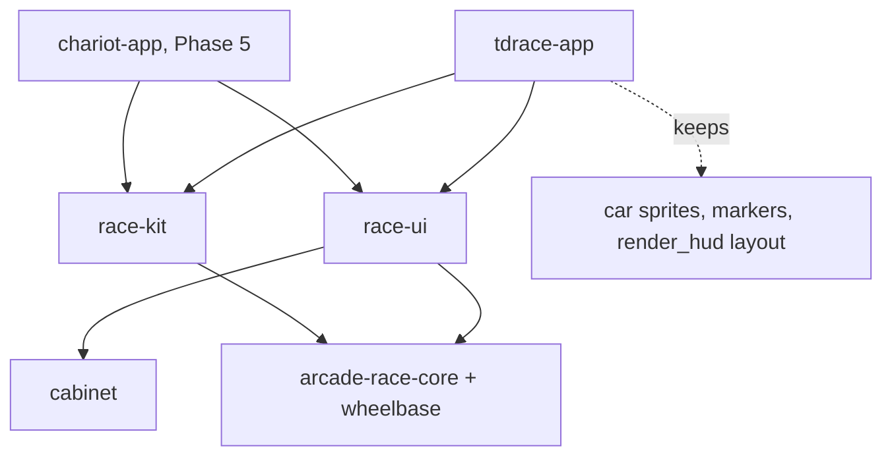

# Architecture Spec: race-ui Rendering, Camera, Effects and HUD Primitives 🏗️

Phase 3 of [spec 049](049_reusable_racing_platform_layers.md), which sets the chariot-first order. It builds on [spec 054](054_body2d_trait_for_vehiclegeneric_collision_and_progress.md) (`Body2D`) and [spec 056](056_racekit_headless_race_world.md) (`race-kit`). Gap ids refer to
[`docs/engineering/racing_platform_analysis.md`](../docs/engineering/racing_platform_analysis.md).

**Goal:**
- A new crate, `race-ui`, lets a new game (the chariot game first) draw a track, follow a vehicle with the camera, show dust, sparks and skid marks, and draw a basic HUD. It does not need `tdrace-app`.
- `tdrace-app` uses the moved code through re-exports. The game looks and plays the same.

---

## 🗺️ Current vs. Proposed System Architecture

### 1. Current Architecture

All drawing code lives in `tdrace-app` (gap A6). A separate repo cannot use it without depending on the whole game, its catalog, its SQLite code and the embedded circuits.

Many of these files already use only `macroquad`, `cabinet` and the engine crates:

| File | Lines | Uses from `tdrace-app` |
|---|---|---|
| `render/track.rs` | 1821 | none |
| `render/barrier.rs` | 328 | none |
| `render/scenery.rs` | 538 | none |
| `render/surface_material.rs` | 1037 | none |
| `render/color.rs` | 287 | none |
| `camera/mod.rs` | 591 | `CameraConfig`, `ZoomLevelConfig`, `REFERENCE_SCREEN_*` from `config.rs` |
| `fx/{mod,particles,skidmarks,drift_popup}.rs` | 1154 | `render::color`, `render::track` |
| `ui/curve_indicator.rs` | 480 | none |
| `ui/hud.rs` (4 widgets) | about 150 | `render::color` |

Other drawing code depends on tdrace content, so it stays in the app:
- `render/car.rs`, `render/lighting.rs` and `render/vehicle_assets.rs` use the car catalog and `VehicleVisualType`.
- `render/marker.rs` uses the tdrace player-helper settings.
- `render_hud` and the speedometer lay out the tdrace HUD.

Two more gaps:
- `RaceCamera::update` and `resume_from_pause` take `&Car`, but they read only position, velocity and speed.
- `surface_material.rs:246-259` looks for surface textures in 5 fixed `assets/` paths (gap D4). Another game cannot point it at its own folder.

### 2. Proposed Architecture

A new crate `crates/race-ui`. Its dependencies are `macroquad`, `glam`, `serde`, `cabinet`, `arcade-race-core` and `wheelbase`. It must build for `wasm32-unknown-unknown`. It must not depend on `tdrace-core`, `race-kit`, `rusqlite` or `toml`.

**Moves**, with `git mv` so history stays:

| From `crates/tdrace-app/src/` | To `crates/race-ui/src/` |
|---|---|
| `render/{track,barrier,scenery,surface_material,color}.rs` | `render/` |
| `camera/mod.rs`, plus `CameraConfig`, `ZoomLevelConfig`, `REFERENCE_SCREEN_WIDTH`, `REFERENCE_SCREEN_HEIGHT` from `config.rs` | `camera/` |
| `fx/{mod,particles,skidmarks,drift_popup}.rs` | `fx/` |
| `ui/curve_indicator.rs` | `hud/curve_indicator.rs` |
| `format_lap_time`, `render_position_and_lap`, `render_lap_timer`, `render_minimap` from `ui/hud.rs` | `hud/widgets.rs` |

- Code moves without change. Only `use` paths change, and private helpers that another moved file calls become `pub`.
- `tdrace-app` re-exports each moved module and item at its old path. For example, `tdrace_app::render::track` stays valid through `pub use race_ui::render::track;`. Every caller and every test then compiles unchanged.

**Small API changes:**
- `RaceCamera::update` and `resume_from_pause` take any `B: Body2D` instead of `&Car`. `render_minimap` takes `&[B]` for any `B: Body2D`. A `Car` argument still compiles, so no caller changes.
- `race_ui::render::set_asset_root(path)` sets the folder searched first for surface textures. Without it, the 5 current paths are searched, as today.
- `EffectsManager` (particles, skid marks, sparks) stays typed to `Car`, because skid marks read the car's wheels. Phase 5 makes it generic when the chariot exists.

**Changes from the spec 049 plan, with reasons:**
- **No `VehicleVisual` trait or multi-part sprites yet.** They move to Phase 5. The chariot and its horses are the first user, and their sprites do not exist yet. A trait designed without them would guess the wrong shape. Today's car renderer also depends on the tdrace catalog, so it cannot move now.
- **No chase camera and no camera rotation.** Only the rally game needs them, so they move to Phase 8. The chariot track is an oval seen from above, like tdrace.
- **No `CourseView` and no mesh cache.** They serve streamed courses, so they move to Phase 7. The renderers keep taking `&Track`.

**Out of scope:**
- Markers, the speedometer and the `render_hud` layout: they are the tdrace look.
- `render_world_viewport` (`game/mod.rs`): it stays in the app.

---

## 🗄️ Database & Storage Migration Plan

No data format changes. `CameraConfig` keeps its serde shape, so saved `config.toml` files still load.

---

## 🔑 Security, Compliance, & IAM Roles

- New crate `race-ui`, inside this workspace. No new external dependencies.
- No `unsafe`. The only file access is the existing surface texture lookup.

---

## 🛡️ Disaster Recovery, Monitoring, & Fallbacks

- **No visible change:** the render, camera and effects tests must pass unchanged. A manual run of the game must look the same.
- **Determinism:** nothing here touches the simulation. `golden_sim`, `golden_world` and `golden_session` must keep their hashes.
- **Rollback:** a single `--no-ff` merge. Reverting it brings the files back into `tdrace-app`.

---

## 🧪 Verification & Acceptance Criteria

### Automated Tests
- Drawing tests: `cargo test -p tdrace-app --test render_tests --test camera_tests --test fx_tests --test auxiliary_fx_tests --test curve_helper_hud_tests`
- Crate tests: `cargo test -p race-ui`
- Rust suite: `cargo test --workspace --exclude tdrace-py --no-fail-fast`, all green.
- Goldens: `golden_sim`, `golden_world` and `golden_session`, each also with `--release`.
- Builds: `cargo check -p race-ui --target wasm32-unknown-unknown`, `cargo check -p tdrace-app --target wasm32-unknown-unknown` and `cargo check -p tdrace-py`
- Dependencies: `cargo tree -p race-ui -e normal`

### Manual Acceptance Criteria (Pseudo-Gherkin)

- **Scenario: race-ui stands alone**
  - [ ] **Given** the `race-ui` crate
  - [ ] **When** `cargo tree -p race-ui -e normal` runs and the crate builds for `wasm32-unknown-unknown`
  - [ ] **Then** the tree has no `tdrace-core`, `race-kit`, `rusqlite` or `toml`, and the build succeeds

- **Scenario: Existing callers compile unchanged**
  - [ ] **Given** `tdrace-app`, its tests and its binaries, with no edits to callers of the moved code
  - [ ] **When** the workspace builds and the drawing tests run
  - [ ] **Then** everything compiles through the re-exports, and the render, camera, effects and curve-indicator tests pass

- **Scenario: The camera follows a body that is not a car**
  - [ ] **Given** a `RaceCamera` and a test body that implements `Body2D`
  - [ ] **When** `update` runs for 2 s while the body moves in a straight line
  - [ ] **Then** the camera centre ends near the body's position plus its look-ahead, the same result as for a `Car` with the same position and velocity

- **Scenario: A game points the textures at its own folder**
  - [ ] **Given** a temporary folder with a file `asphalt_diffuse.png` in it
  - [ ] **When** `set_asset_root` names that folder and the surface texture file lookup runs for asphalt
  - [ ] **Then** it returns that file's bytes, and without `set_asset_root` the lookup still searches the current 5 paths

- **Scenario: tdrace looks the same**
  - [ ] **Given** the game built from this branch
  - [ ] **When** Mario runs `make run-dev` and drives one race on Classic Grand Prix
  - [ ] **Then** the track, barriers, trees, camera, dust, skid marks, curve indicator, minimap and lap timer look as they do on `main`

- **Scenario: The simulation is untouched**
  - [ ] **Given** the golden hashes recorded for debug and release on macOS aarch64
  - [ ] **When** `golden_sim`, `golden_world` and `golden_session` run
  - [ ] **Then** all of them keep their recorded hashes

---

## 🔗 Traceability & Codebase Mapping

### Created/Modified Files
- `[ ]` `crates/race-ui/Cargo.toml`, `crates/race-ui/src/lib.rs` -> new crate, workspace member.
- `[ ]` `crates/race-ui/src/render/` -> track, barrier, scenery, surface material and colour code, plus `set_asset_root`.
- `[ ]` `crates/race-ui/src/camera/` -> `RaceCamera`, `CameraMode`, `SplitLayout`, camera config types; `update` over `Body2D`.
- `[ ]` `crates/race-ui/src/fx/` -> `EffectsManager`, particles, skid marks, drift popups.
- `[ ]` `crates/race-ui/src/hud/` -> curve indicator and the four HUD widgets.
- `[ ]` `crates/race-ui/tests/` -> camera-follows-a-body and asset-root scenarios.
- `[ ]` `crates/tdrace-app/src/{render,camera,fx,ui}/mod.rs`, `ui/hud.rs`, `config.rs` -> re-exports at the old paths.
- `[ ]` `docs/engineering/terminology.md` -> `race-ui` added to the platform architecture section.

### Beads Epic Mapping
- Governed by epic *Fulfill Spec 057: race-ui Rendering, Camera, Effects and HUD Primitives*.
