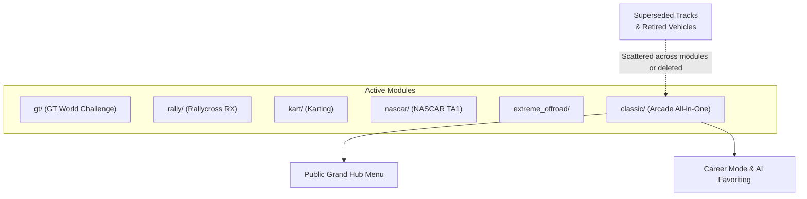

# Architecture Spec: Vault Module for Archived and Deprecated Content 🏛️

As **TdRace** evolves through career expansions (e.g., 6-tier Rallycross in [Spec 051](051_rallycross_6tier_career_progression_and_expanded_circuit_roster.md), 6-tier Karting in [Spec 052](052_karting_6tier_career_progression_and_standalone_garden_gp.md), FIA Autocross in [Spec 050](050_fia_autocross_championship_and_vehicle_roster.md), and Steam IP sanitization in [Spec 047](047_fictional_branding_and_realworld_ip_removal_for_steam_release.md)), numerous assets, vehicle prototypes, circuits, and game mechanics are regularly retired or superseded.

Without a dedicated holding repository, engineering faces an unfavorable tradeoff:
1. **Menu & Catalog Bloat**: Keeping deprecated or novelty content in active motorsport modules pollutes career progression, confuses users, and skews AI driver rosters.
2. **Permanent Data Loss**: Completely deleting retired assets loses valuable Catmull-Rom spline coordinates, calibrated Pacejka tire parameters, audio synthesis profiles, and experimental gameplay algorithms that may provide critical building blocks for future spin-offs (such as `chariot-app`, `rallyraid-app`, or `tdbikes` in [Spec 049](049_reusable_racing_platform_layers.md)).

This specification establishes **The Vault** (`"vault"`): a dedicated, quarantined cold-storage module designed to house archived, temporal, and deprecated assets in a structured environment. The Vault preserves full data integrity and allows testing in Developer Mode (`TDRACE_DEV=1`) and Track Studio, while remaining entirely invisible and non-interfering during standard player gameplay.

---

## 🏛️ Nomenclature & Identity Evaluation

During architectural design, multiple naming alternatives were evaluated for this temporal archive:

| Name Candidate | Evaluated Fit | Tradeoff & Verdict |
| :--- | :--- | :--- |
| **`"discarded"`** | Functional / Literal | Carries negative connotations of "rubbish" or "garbage", suggesting corrupt, broken, or worthless files rather than preserved, reusable assets. |
| **`"archived"`** | Software Standard | Pragmatic and unambiguous, but dry and bureaucratic for a game engine's interactive interface. |
| **`"reserve"`** | Motorsport Authentic | Reflects real-world racing teams' "reserve chassis", but implies active standby cars ready for the next race weekend. |
| **`"depot"` / `"warehouse"`** | Industrial Physical | Tactile and grounded, but somewhat generic across cross-cutting software systems. |
| **`"vault"` (Selected)** | **Gaming-Native & Curated** | **Optimal balance.** Borrowed from gaming content preservation (e.g. Bungie Vault, Forza Vault, Disney Vault). Evokes safe, curated long-term storage where high-value historical assets are preserved without cluttering active rotations. |

**Identifier Convention**:
- Module Identifier: `"vault"`
- Display Title: `"THE VAULT (DECOMMISSIONED ASSETS & TEST DEPOT)"`
- Track Directory: `tracks/vault/`
- Rust Module: `crates/tdrace-app/src/module/vault.rs`

---

## 🗺️ Current vs. Proposed System Architecture

### 1. Current Architecture

Currently, when content is decommissioned from an active module, it either lingers in the active module's directory structure, gets commented out, or gets stashed arbitrarily in `tracks/classic/` alongside arcade tracks.



**Architectural Deficiencies in Current Layout**:
- **Lack of Deprecation Quarantine**: Decommissioned tracks (e.g. pre-OSM fantasy tracks) must either remain in `tracks/<module>/`, bloating the official catalog, or be deleted permanently.
- **Career Contamination**: Novelty vehicles (e.g. racing lawnmowers removed from the professional karting career ladder) risk leaking into AI driver favoriting pools or career tier selections unless complex manual filters are hard-coded.
- **Inconsistent Dev Access**: Developers inspecting an old prototype track must either manually alter `tracks/.track_order.json` or restore deleted Git commits.

---

### 2. Proposed Architecture: The Vault Quarantine System

The proposed architecture introduces `VaultGameModule` (`"vault"`) as an isolated, quarantined module with strict access boundaries.

```mermaid
graph TD
    subgraph Production Modules
        GT["gt/"]
        RX["rally/"]
        KART["kart/"]
        NASCAR["nascar/"]
        EOR["extreme_offroad/"]
        CLASSIC["classic/"]
    end

    subgraph The Vault (Quarantine & Archive)
        VAULT_MOD["VaultGameModule ('vault')"]
        VAULT_TRACKS["tracks/vault/*.json"]
        VAULT_CARS["Decommissioned Vehicle Models"]
        VAULT_RULES["Experimental / Legacy Rulesets"]
        VAULT_MANIFEST["tracks/vault/MANIFEST.json"]
    end

    Production_Retirement["Retirement Event<br/>(Spec 047 IP clean, Spec 051/052 re-tier)"] -->|Inbound Archival| VAULT_MOD

    VAULT_MOD --> VAULT_TRACKS
    VAULT_MOD --> VAULT_CARS
    VAULT_MOD --> VAULT_RULES
    VAULT_MOD --> VAULT_MANIFEST

    USER_NORMAL["Standard Player (TDRACE_DEV=0)"] --> Production Modules
    USER_NORMAL -. "STRICTLY BLOCKED" .-> VAULT_MOD

    DEV_USER["Developer Mode (TDRACE_DEV=1)"] --> VAULT_MOD
    STUDIO["Track Studio / CAD Editor"] --> VAULT_TRACKS
    HARNESS["Simulation & Benchmark Harness"] --> VAULT_MOD
```

---

## 🗄️ Database & Storage Migration Plan

### 1. Storage Layout & File Structure

All vaulted material is segregated into dedicated, discoverable directories:

```
tdrace/
├── crates/tdrace-app/src/module/
│   ├── mod.rs                  # Registers 'vault' module
│   └── vault.rs                # VaultGameModule trait implementation
├── tracks/
│   ├── .track_order.json       # Includes "vault": [...] catalog list
│   └── vault/                  # Archived track definitions (JSON)
│       ├── MANIFEST.json       # Historical provenance and archival reason registry
│       ├── classic_oval.json   # Legacy test ovals
│       ├── proto_gymkhana.json # Acrobatic test courses
│       └── ...
└── docs/
    └── archive/                # Deprecated design documents, prototypes & references
```

### 2. Asset Classification Taxonomy

Material stored in The Vault falls into five discrete categories:

| Category | Description | Examples | Storage Target |
| :--- | :--- | :--- | :--- |
| **Retired Circuits** | Tracks superseded by 1:1 OSM surveys, fantasy tracks removed from real-world championships, or specialized calibration skidpads. | `oasis_rally`, `dirt_figure_eight`, synthetic test ovals | `tracks/vault/*.json` |
| **Novelty / Prototype Vehicles** | Vehicles that do not belong in sanctioned motorsport ladders but hold unique physics calibrations or fun value. | Racing lawnmower, drift trike, 1970s land yacht prototype | `crates/tdrace-app/src/module/vault.rs` |
| **Experimental Rulesets** | Competition formats, combo scoring systems, or arcade modes currently not active in official tournaments. | Freestyle gymkhana scoring, eliminator knockout rules | `crates/tdrace-app/src/tournament/` (vault presets) |
| **Retired Driver Personas** | Deprecated AI characters or seasonal guest pilots removed from core constructor teams. | Test bots, novelty drivers | `VaultGameModule::drivers()` |
| **Algorithmic Shims** | Mathematical formulas, prototype camera controllers, or experimental tire curves preserved for prospective spin-offs. | Legacy slip-angle approximations | Dedicated sub-module or archive module notes |

### 3. The Vault Provenance Manifest (`tracks/vault/MANIFEST.json`)

To ensure archived material remains comprehensible years later, every circuit and major asset placed in The Vault must carry a record in `tracks/vault/MANIFEST.json`:

```json
{
  "version": "1.0",
  "archived_assets": [
    {
      "id": "classic_grand_prix",
      "type": "circuit",
      "original_module": "classic",
      "archived_date": "2026-09-29",
      "reason": "Superseded by 1:1 OpenStreetMap homologated circuits in GT module",
      "future_utility": "Candidate for retro arcade mini-game or benchmark test loop",
      "maintainer": "agent/antigravity"
    },
    {
      "id": "racing_mower_v2",
      "type": "vehicle",
      "original_module": "kart",
      "archived_date": "2026-09-29",
      "reason": "Relocated from core 6-tier Karting career progression (Spec 052)",
      "future_utility": "Standalone Garden GP Invitational Cup or party mode",
      "maintainer": "agent/antigravity"
    }
  ]
}
```

### 4. Migration Lifecycles (Inbound, Outbound & Purge)

- **Inbound Archival Protocol (Retirement Workflow)**:
  1. *Track Decommissioning*: Move JSON definition from `tracks/<source_module>/<id>.json` to `tracks/vault/<id>.json`. Remove `<id>` from `<source_module>` list in `tracks/.track_order.json` and append to `"vault"`. Update `tracks/.aliases.json` if required to maintain backward compatibility with old save states. Record retirement entry in `tracks/vault/MANIFEST.json`.
  2. *Vehicle Decommissioning*: Transfer `VehicleModelDefinition` into `VaultGameModule::vehicles()`. Update vehicle `module_id` to `"vault"`. Remove from active constructor team allocations in `catalog/mod.rs`.
  3. *Zero-Downtime Cleanliness*: Run test suites to ensure active motorsport categories compile with zero broken identifiers or orphaned references.
- **Outbound Restoration Protocol (Revival Workflow)**:
  1. Create a dedicated feature spec or roadmap task.
  2. Promote track JSON to the destination module directory in `tracks/<target_module>/`.
  3. Re-tier vehicle physics parameters to match target homologation standards.
  4. Update `tracks/vault/MANIFEST.json` marking status as `reactivated`.
- **Permanent Purge Criteria**:
  1. Material confirmed to infringe on unlicensed IP that cannot be sanitized (per [Spec 047](047_fictional_branding_and_realworld_ip_removal_for_steam_release.md)).
  2. Irreparably corrupted binary or geometry data.
  3. Explicit human maintainer signoff.

---

## 🔑 Security, Compliance, & IAM Roles

### 1. Production Gating & Role-Based Access Control (RBAC)

The Vault enforces strict role-based access separation between standard players and engine developers:

| Access Role | Context / Flag | Grand Hub Menu | Track Studio / CAD | Career Mode | Free Run / Physics Bench |
| :--- | :--- | :--- | :--- | :--- | :--- |
| **Standard Player** | Default (`TDRACE_DEV=0` / unset) | **Hidden** (Omitted) | Hidden from module filter | **Excluded** | Excluded |
| **Engine Developer / QA** | Developer Mode (`TDRACE_DEV=1`) | **Visible** (Amber card) | **Full Access** (Open / Edit) | Excluded | **Full Access** |
| **CI / Automated Test Runner** | Test Environment | Headless check | Headless check | N/A | **Full Access** (Benchmark) |

- **Grand Hub Concealment**: `render_module_select_menu()` only includes `"vault"` in its menu array if `is_dev_mode` is `true`. Standard players will never see unfinished or deprecated assets.
- **Career Mode & Progression Integrity**: The Vault is completely excluded from Career Mode progression, XP awards, Credits payouts, and Player Profile career dossier summaries.
- **AI Character Isolation**: AI characters registered in `VaultGameModule` are quarantined from global casual driver pools and championship grids in `gt`, `rally`, `kart`, `nascar`, `extreme_offroad`, and `classic`.

### 2. Intellectual Property (IP) Compliance & Sanitization

Archived assets remain subject to project-wide IP sanitization:
- If a circuit or vehicle is retired due to real-world copyright/trademark constraints (Spec 047), its name, livery graphics, and branding must still be replaced with fictional equivalents before being committed to The Vault.
- The Vault is not an unmonitored repository for illicit IP; it is a technical holding zone for proprietary engine assets and mechanics.

---

## 🛡️ Disaster Recovery, Monitoring, & Fallbacks

### 1. Circuit Catalog Fallback & Decompression Safety

- **Catalog Deflate Integrity**: All circuits in `tracks/vault/` are DEFLATE-compressed into `tdrace-core` at build time per [Spec 042](042_jsononly_official_circuit_catalog_and_embedded_track_data.md). If an archived track JSON file is damaged during an edit in Track Studio, the build script fails fast at compile time with a clear syntax error.
- **Missing Asset Fallback**: If an archived circuit fails runtime parsing, `TrackManager::load_track` falls back to the canonical module preset or returns a descriptive `TrackError::Json` without crashing the application process.

### 2. Accidental Archival Recovery & Rollback

- **Git-Tracked Invariance**: Because all track movements between active modules and `tracks/vault/` are committed through atomic Git transactions, accidental archivals can be rolled back via standard git commands (`git checkout HEAD~1 -- tracks/`).
- **Provenance Auditability**: `tracks/vault/MANIFEST.json` acts as an auditable historical log, preventing forgotten orphaned files.

### 3. Continuous Integration (CI) Invariants

Automated CI gates ensure The Vault remains in working order:
1. `official_catalog_tests` verifies that every track in `tracks/vault/` has valid spline knots, closed loops, valid grid slots ($\ge 10$), and zero SAT collision mesh errors.
2. `ui_menu_tests` verifies that The Vault is strictly omitted when `TDRACE_DEV=0` and included when `TDRACE_DEV=1`.
3. `driver_favorite_cars_tests` verifies that no active driver maps to a vaulted vehicle ID.

---

## 🧪 Verification & Acceptance Criteria

### Automated Tests
- Verification of official catalog build: `cargo test -p tdrace-core official_catalog_tests`
- Verification of module trait compliance: `cargo test -p tdrace-app module::vault::tests`
- Verification of dev-mode menu gating: `cargo test -p tdrace-app ui_menu_tests`

### Manual Acceptance Criteria (Pseudo-Gherkin)

- **Scenario: Normal production players cannot view or access The Vault**
  - [x] **Given** the game application runs with `TDRACE_DEV=0` (or unset)
  - [x] **When** navigating to the Motorsport Grand Hub module selection menu
  - [x] **Then** the menu displays only standard motorsport modules (`classic`, `rally`, `kart`, `gt`, `nascar`, `extreme_offroad`)
  - [x] **And** The Vault (`"vault"`) is completely omitted from the rendered card list

- **Scenario: Developer mode exposes The Vault in Grand Hub and Track Studio**
  - [x] **Given** the game application runs with `TDRACE_DEV=1`
  - [x] **When** the developer enters the Motorsport Grand Hub menu
  - [x] **Then** The Vault card is displayed with Amber accent styling and `"COLD STORAGE / DEV ARCHIVE"` badge
  - [x] **And** entering Track Studio exposes `"vault"` in the module filter picker, listing all archived JSON tracks

- **Scenario: Archived tracks can be loaded and driven in Free Run mode**
  - [x] **Given** a circuit JSON file is stored under `tracks/vault/` and registered in `tracks/.track_order.json`
  - [x] **When** launching a Free Run session with `module_id = "vault"` and the archived circuit ID
  - [x] **Then** the circuit decompresses from the embedded catalog with zero validation errors
  - [x] **And** the player vehicle spawns on the starting grid ready to drive

- **Scenario: Archived vehicles do not contaminate active career progression**
  - [x] **Given** a vehicle definition registered under `VaultGameModule::vehicles()` with `module_id = "vault"`
  - [x] **When** inspecting the career rosters and unlockable car tiers of `gt`, `kart`, `rally`, or `nascar`
  - [x] **Then** the vaulted vehicle does not appear in any active career tier
  - [x] **And** AI drivers in official championship grids never select or spawn with the vaulted vehicle

---

## 🔗 Traceability & Codebase Mapping

### Created/Modified Files
- `[x]` `specs/057_vault_module_for_archived_and_deprecated_content.md` -> Governs the specification contract.
- `[x]` `specs/constitution/ROADMAP.md` -> Registers the milestone under Technical Debt & Maintenance.
- `[x]` `crates/tdrace-app/src/module/vault.rs` -> Implements `VaultGameModule` adhering to `GameModule` trait.
- `[x]` `crates/tdrace-app/src/module/mod.rs` -> Exports `pub mod vault; pub use vault::VaultGameModule;`.
- `[x]` `crates/tdrace-app/src/game/mod.rs` -> Configures dev-mode menu gating for `"vault"`.
- `[x]` `crates/tdrace-app/src/ui/track_manager_ui.rs` -> Adds `"vault"` to `PROMOTION_MODULES` and module filter pickers.
- `[x]` `tracks/vault/` -> Directory holding archived JSON circuit definitions.
- `[x]` `tracks/vault/MANIFEST.json` -> Provenance registry tracking why each asset was archived.
- `[x]` `tracks/.track_order.json` -> Registers `"vault"` array for compile-time embedding.

### Verification Assertions
- `crates/tdrace-app/src/module/vault.rs` references `specs/057_vault_module_for_archived_and_deprecated_content.md` in its module header docstring.
- All acceptance criteria pass with zero errors in `keel validate`.
