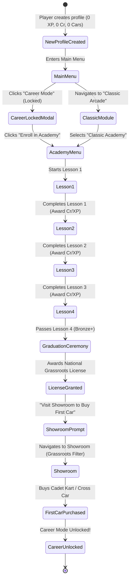

# Feature Spec: Classic Academy and Grassroots Career Onboarding 🎓🏁💰

A comprehensive specification defining the **Grassroots Career Onboarding Loop** for **TdRace**. Under this model, new player profiles initialize with **0 XP and 0 Cr (Bank Credits)** with **zero free career vehicles**. To enter competitive motorsport, rookies must complete the **Classic Academy** within the Classic Arcade module. By mastering vehicle handling fundamentals across four structured driving challenges, players earn their **National Grassroots Racing License** and a seed credit purse of **7,000 – 14,500 Cr**, granting them the purchasing power to acquire their first competition machine in entry-level grassroots categories (**Karting**, **Autocross**, or **Rallycross**).

---

## 🎯 Executive Summary & Problem Statement

### 1.1 The Empty-Handed Rookie Paradigm
In legacy career structures ([Spec 013](013_player_profile_enhancement_and_career_dossier.md), [Spec 030](030_career_system_wiki_reference_and_progression_mechanics.md)), players were either automatically gifted starter vehicles in every motorsport category or allowed to jump straight into professional GT and NASCAR series without earning racing credentials. This introduced three critical design defects:
1. **Absence of Accomplishment**: Receiving free machinery in every category devalues vehicle ownership and eliminates early-game economic motivation.
2. **Skill Disconnect**: New players entering high-horsepower disciplines (e.g. GT4, Late Models, SuperBuggy) frequently struggled with high-speed weight transfer, digital steering over-correction, and loose-surface slip without having learned basic vehicle dynamics.
3. **Flat Career Topology**: Grassroots disciplines like Karting and Autocross were treated merely as parallel silos rather than the natural, foundational stepping stones of real motorsport.

### 1.2 Core Design Principles
This specification enacts a foundational shift in how players begin their motorsport journey:
- **Zero-Start Initial State**: Every new driver dossier starts with **0 XP**, **0 Cr**, and an **empty career garage**.
- **No Free Career Vehicles**: Absolutely every vehicle in dedicated motorsport disciplines (Karting, Autocross, Rallycross, GT, NASCAR, Extreme Off-Road) must be purchased from the Showroom using earned Credits.
- **Classic Arcade Always Playable**: Casual arcade modes (Quick Race, Single Race, Time Trial) in the **Classic Module** remain unlocked immediately from day one, utilizing the built-in arcade fantasy cars (Apex Phantom GT, Trailfire Turbo, Mudlark Cross Car, Turbo Dart, etc.).
- **The Classic Academy as the Gate to Career**: Positioned within the Classic Module, the Academy serves as an interactive racing school. Completing its curriculum awards the **National Grassroots License** and a tiered credit purse.
- **Natural Grassroots Pricing Calibration**: Vehicles are priced according to authentic real-world financial barriers, positioning **Karting** as the most affordable gateway, followed closely by **Cross Car Autocross** and **Junior Rallycross**, while GT and Stock Car machinery remain mid-term aspirational targets.

### 1.3 Architectural Dependency: Classic Circuits Revamp (Spec 055)
This specification directly depends on **[Spec 055: Classic Circuits Revamp](055_classic_circuits_revamp.md)** (tracked via Beads issue blocker `tdrace-classic-circuits-revamp-dh6k`). Rather than relying on legacy flat arcade circuits, the Classic Academy curriculum is calibrated specifically to the 18 fictional circuits and the fantasy vehicle roster introduced in Spec 055:
- **Lesson 1 (Racing Line & Apex Precision)**: Held on `gt_velocity_park` (Velocity Park - Sector 1 asphalt infield) using the `classic_apex_phantom_gt` (Apex Phantom GT). Focuses on smooth steering, apex clipping, and asphalt exit throttle.
- **Lesson 2 (Threshold Braking & Weight Transfer)**: Held on `gt_ridge_ring` (Ridge Ring - back straight downhill chicane) using the `classic_apex_phantom_gt` (Apex Phantom GT). Teaches high-speed threshold braking (~180 km/h) and lateral weight transfer without wheel lockup.
- **Lesson 3 (Mixed-Surface Transition & Car Control)**: Held on `rx_quarry_sprint` (Quarry Sprint - mixed asphalt to loose gravel basin) using the `classic_trailfire_turbo` (Trailfire Turbo 4WD). Teaches asphalt-to-gravel transition, pendulum drift initiation (Scandinavian flick), and jump crest stability.
- **Lesson 4 (Academy Graduation Sprint)**: Held on `ax_meadow_sprint` (Meadow Sprint - 2-lap sprint race) using the `classic_ax_mudlark` (Mudlark Cross Car - 150 bhp RWD). Tests racecraft against an AI Academy Instructor Pace Car requiring clean overtaking without heavy contact penalties.

Implementation of the Academy challenges commences once the foundational circuits and vehicles from Spec 055 Stage 1 are integrated into the catalog.

---

## 🏎️ Grassroots Hierarchy & Vehicle Pricing Reference Table

To deliver a credible sense of progression, in-game Credit costs (Cr) are scaled against real-world turnkey racing costs (turnkey race-ready chassis, engine homologation, and safety equipment).

### 2.1 Grassroots Vehicle Pricing Reference Table

The table below details all tiers across the three primary grassroots disciplines—**Karting** (6 Tiers per [Spec 052](052_karting_6tier_career_progression_and_standalone_garden_gp.md)), **Autocross** (5 Tiers per [Spec 050](050_fia_autocross_championship_and_vehicle_roster.md)), and **Rallycross** (6 Tiers per [Spec 051](051_rallycross_6tier_career_progression_and_expanded_circuit_roster.md)). Prices are calibrated against authentic real-world turnkey acquisition costs:

| Motorsport Discipline | Class / Homologation Spec | In-Game Tier | Typical Real-World Cost (Turnkey / Season Ready) | In-Game Price (Credits) | Economic Pacing & Accessibility |
| :--- | :--- | :---: | :---: | :---: | :--- |
| **Karting** | **Cadet 60cc** (CRG Hero, Birel C28, Tony Kart Neos) | Tier 1 | 3,500 – 5,500 USD | **5,000 Cr** | **Starter Entry**: Affordable immediately with all-Bronze Academy completion (7,000 Cr purse), leaving 2,000 Cr buffer. |
| **Karting** | **OK-Junior 125cc** (Tony Kart Rookie, CRG Black Mirror) | Tier 2 | 7,000 – 10,000 USD | **8,500 Cr** | **Junior Feeder Step-Up**: Affordable with all-Silver Academy performance (10,750 Cr). |
| **Karting** | **Senior OK 125cc** (Tony Kart Racer 401 RR, CRG KT2) | Tier 3 | 9,500 – 13,500 USD | **12,000 Cr** | **Senior Direct-Drive**: Affordable with all-Gold Academy mastery (14,500 Cr). |
| **Karting** | **KZ2 Shifter 125cc** (Birel ART KZ2, CRG Road Rebel) | Tier 4 | 13,500 – 17,500 USD | **18,000 Cr** | **Advanced Shifter**: Requires career earnings from lower karting tiers. |
| **Karting** | **Superkart Div 2 Mono 250cc** (Anderson Maverick, MS Kart) | Tier 5 | 19,000 – 26,000 USD | **26,000 Cr** | **Aero Road-Racing Feeder**: Long-circuit single-cylinder aerodynamic racer. |
| **Karting** | **Superkart Div 1 Twin GP 250cc** (Anderson CS250, VIPER Twin) | Tier 6 | 30,000 – 42,000 USD | **38,000 Cr** | **Discipline Apex**: Premier 100 BHP twin-cylinder ballistic road kart. |
| **Autocross** | **Cross Car Junior** (FIA XC Academy Trophy, 600cc / 75 hp) | Tier 1 | 16,000 – 22,000 USD | **12,000 Cr** | **Starter Entry**: Affordable with all-Gold Academy (14,500 Cr), or all-Silver + 1 exhibition race. |
| **Autocross** | **Cross Car Senior XC** (FIA XC, 850cc MT09 triple, 130 hp) | Tier 2 | 28,000 – 38,000 USD | **24,000 Cr** | **Senior Dirt Weapon**: Unrestricted RWD gravel drift machine. |
| **Autocross** | **Buggy 1600** (FIA Buggy1600 4WD, 1.6L atmo, 220 hp) | Tier 3 | 50,000 – 70,000 USD | **45,000 Cr** | **Intermediate 4WD Buggy**: Requires seasoned dirt career prize money. |
| **Autocross** | **TouringAutocross** (FIA TAX, 4WD Turbo Silhouette, 450+ hp) | Tier 4 | 75,000 – 110,000 USD | **70,000 Cr** | **Closed-Cockpit Dirt Monster**: High-level unpaved competition. |
| **Autocross** | **SuperBuggy** (FIA SuperBuggy 4WD, 4.0L V8 / Turbo, 500+ hp) | Tier 5 | 95,000 – 150,000+ USD | **95,000 Cr** | **Discipline Apex**: Premier international open-wheel dirt king. |
| **Rallycross** | **Junior FWD / Rally4** (Peugeot 208, Fiesta, Clio Rally4) | Tier 1 | 35,000 – 55,000 USD | **16,000 Cr** | **Starter Entry**: Accessible with all-Gold Academy (14,500 Cr) + 1–2 quick exhibition races. |
| **Rallycross** | **Supercar Lites & RX2** (OMSE Lites, Avitas Lites, QEV RX2e) | Tier 2 | 125,000 – 165,000 USD | **48,000 Cr** | **Feeder Spec**: 4WD mid-engine / spec electric step-up platform. |
| **Rallycross** | **Euro RX National Supercars** (Polo RX, Audi S1 RX, i20 RX) | Tier 3 | 220,000 – 320,000 USD | **85,000 Cr** | **Continental Supercars**: 4WD 2.0L Turbo 400 BHP touring platform. |
| **Rallycross** | **FIA World RX Supercars** (Peugeot 208 WRX, Focus RS RX) | Tier 4 | 400,000 – 600,000 USD | **150,000 Cr** | **World ICE Pinnacle**: 4WD 600 BHP, 900 Nm, 0-100 in 1.9s. |
| **Rallycross** | **RX1e Electric Championship** (Peugeot 208 RX1e, Polo RX1e) | Tier 5 | 500,000 – 750,000 USD | **190,000 Cr** | **Electric World RX**: Dual-motor 680 BHP instant-torque monsters. |
| **Rallycross** | **Nitrocross Group E** (OMSE FC1-X, VSC FC1-X, Dodge Hornet) | Tier 6 | 650,000 – 900,000 USD | **240,000 Cr** | **Discipline Apex**: Quad-motor 1,070 BHP, 100ft jump stadium platform. |

### 2.2 Perspective Comparison: Circuit GT, Stock Car & Extreme Off-Road

To emphasize the hierarchy of motorsport costs, asphalt circuit, stock car, and extreme off-road disciplines carry realistic commercial pricing that prevents rookies from bypassing the grassroots ranks:

| Discipline | Class / Homologation Spec | In-Game Tier | Typical Real-World Cost | In-Game Price (Credits) | Rationale |
| :--- | :--- | :---: | :---: | :---: | :--- |
| **Stock Car** | **Street Stock V8** (Camaro, Mustang, Challenger Street Stock) | Tier 1 | 20,000 – 35,000 USD | **25,000 Cr** | Grassroots short-track entry; attainable after junior karting career. |
| **Stock Car** | **Late Model Stock** (Perimeter spaceframe crate V8, 400 hp) | Tier 2 | 45,000 – 70,000 USD | **48,000 Cr** | Mid-level short-track racer. |
| **Stock Car** | **ARCA Menards Series** (Steel body, 700 hp spec V8) | Tier 3 | 80,000 – 130,000 USD | **85,000 Cr** | National intermediate speedway feeder. |
| **Stock Car** | **Craftsman Truck** (Spec chassis, composite truck body) | Tier 4 | 140,000 – 210,000 USD | **130,000 Cr** | Major national series platform. |
| **Stock Car** | **Trans-Am TA1 / NASCAR Cup** (850 BHP tube frame / Next Gen) | Tier 5 | 250,000 – 400,000 USD | **180,000 Cr** | Pinnacle American spaceframe / Cup machinery. |
| **GT Racing** | **GT4 Clubsport** (Factory production race car, e.g. M4 GT4) | Tier 1 | 180,000 – 230,000 USD | **70,000 Cr** | Professional sports car entry; unattainable without prior career earnings. |
| **GT Racing** | **GT3 Evo / FIA GT3** (Full carbon aero, e.g. 911 GT3 R, 296 GT3) | Tier 2 | 550,000 – 700,000 USD | **160,000 Cr** | Premier international customer GT sports car. |
| **GT Racing** | **GT2 Biturbo** (High-horsepower track weapon, e.g. 911 GT2 RS CS) | Tier 3 | 650,000 – 850,000 USD | **200,000 Cr** | High-horsepower gentleman/pro racer. |
| **GT Racing** | **GT1 Legend** (90s Le Mans homologation specials) | Tier 4 | 1,200,000+ USD | **280,000 Cr** | Historic apex GT racers. |
| **GT Racing** | **LMH & LMDh Hypercar Prototype** (Le Mans top class) | Tier 5 | 3,000,000+ USD | **450,000 Cr** | Pinnacle global endurance prototype. |
| **Off-Road** | **Sand Rail Buggy** (Lightweight VW/LS buggy) | Tier 1 | 25,000 – 45,000 USD | **28,000 Cr** | Entry off-road dunes vehicle. |
| **Off-Road** | **Trophy Truck 4x4** (Unlimited desert raid truck, 900 hp) | Tier 2 | 250,000 – 500,000 USD | **120,000 Cr** | Premier Baja / desert racer. |

---

## 🗺️ User Flow & Interface Design

### 1. Onboarding State Machine & User Journey



### 2. Detailed Views & Interactive States

#### A. Main Menu Career Lock Badge
- The "Career Mode" button displays a subtle lock indicator: `🔒 License Required`.
- Clicking the button pops an onboarding dialogue:
  > **RACING LICENSE REQUIRED**  
  > Welcome, Rookie Driver! To compete in sanctioned motorsport championships, you must first obtain your **National Grassroots Racing License** at the **Classic Academy**.  
  > 
  > `[ Enroll in Classic Academy ]`  `[ Back ]`

#### B. Classic Academy Selection Screen
- Located as a dedicated sub-mode alongside Quick Race, Time Trial, and Single Race in the Classic Module.
- Displays 4 sequential Lesson Cards:
  - **Lesson 1: Racing Line & Apex Precision** (`gt_velocity_park` - Sector 1 Infield): Master apex kerb clipping, line precision, and smooth throttle exit on asphalt using the `classic_apex_phantom_gt`.
  - **Lesson 2: Threshold Braking & Weight Transfer** (`gt_ridge_ring` - Back Straight Chicane): Execute high-speed straight-line threshold braking (~180 km/h) into a technical downhill chicane without locking wheels using the `classic_apex_phantom_gt`.
  - **Lesson 3: Mixed-Surface Transition & Car Control** (`rx_quarry_sprint` - Quarry Basin & Jump): Navigate asphalt-to-gravel surface transitions, Scandinavian flick pendulum drifts, and jump landing recovery using the `classic_trailfire_turbo`.
  - **Lesson 4: Academy Graduation Sprint** (`ax_meadow_sprint` - 2 Laps): Final exam consisting of a 2-lap sprint race against an AI Academy Instructor Pace Car using the `classic_ax_mudlark`, requiring clean overtaking without heavy contact penalties.
- Displays Personal Best Time, earned Medal Badge (None / Bronze / Silver / Gold), and Purse preview (`Earn up to 2,000 Cr` on Lesson 1; up to 14,500 Cr across the full curriculum).
- Next lesson unlocks automatically upon achieving at least Bronze in the preceding lesson.

#### C. Challenge HUD & Real-Time Feedback
- **Sector Delta Overlay**: Dynamic split time against the target Gold/Silver/Bronze pace (Green = ahead of Gold, Yellow = ahead of Silver, Red = behind Bronze).
- **Incident & Contact Warning**: Prominent banner alerting player if an off-track or car-to-car collision invalidates the attempt.
- **Instructor Ghost Car**: Semi-transparent blue ghost demonstrating the optimal racing line and braking thresholds (toggleable via Options or `G` key).

#### D. Academy Graduation Ceremony & Showroom Navigation
- Upon completing Lesson 4 with at least Bronze:
  - Full-screen fanfare with custom vector **National Grassroots Racing License** card displaying the driver's name, profile avatar, issue date, and Academy star rating (4/4 to 12/12).
  - Payout Summary tallying total credits credited to the driver's Bank Balance (7,000 – 14,500 Cr).
  - Primary Action Button: `[ Visit Showroom (Select Your Starter Car) ]`.
- Showroom automatically highlights **Grassroots Starter Vehicles**:
  - **Cadet Kart 60cc** (5,000 Cr) — Marked `AFFORDABLE (Recommended Entry)`
  - **Cross Car Junior** (12,000 Cr) — Marked `AFFORDABLE` (if Silver/Gold earned)
  - **Junior FWD / Rally4** (16,000 Cr) — Marked `CURRENTLY UNAFFORDABLE` (accessible after all-Gold Academy + 1–2 quick exhibition races)
  - GT and NASCAR vehicles display padlock icons with tooltips: `Requires Tier 1 License & 25,000 - 70,000 Cr`.
- Purchasing a vehicle triggers a delivery animation, adds the car to `owned_cars`, and unlocks Career Mode permanently.

---

## ⚙️ Backend Models & API Endpoints

### 1. Academy Lesson Data Models & Profile Schemas

```rust
// In crates/arcade-race-core/src/profile.rs or crates/tdrace-app/src/game/academy.rs

use serde::{Deserialize, Serialize};
use std::collections::HashMap;

/// Identifies the progressive lessons within the Classic Academy curriculum.
#[derive(Debug, Clone, Copy, PartialEq, Eq, Hash, Serialize, Deserialize)]
pub enum AcademyLessonId {
    Lesson1ApexLine,
    Lesson2BrakingChicane,
    Lesson3SurfaceTransition,
    Lesson4GraduationSprint,
}

impl AcademyLessonId {
    pub const ALL: [AcademyLessonId; 4] = [
        AcademyLessonId::Lesson1ApexLine,
        AcademyLessonId::Lesson2BrakingChicane,
        AcademyLessonId::Lesson3SurfaceTransition,
        AcademyLessonId::Lesson4GraduationSprint,
    ];

    pub fn slug(&self) -> &'static str {
        match self {
            Self::Lesson1ApexLine => "lesson_1_apex_line",
            Self::Lesson2BrakingChicane => "lesson_2_braking_chicane",
            Self::Lesson3SurfaceTransition => "lesson_3_surface_transition",
            Self::Lesson4GraduationSprint => "lesson_4_graduation_sprint",
        }
    }
}

/// Medal tier awarded for completing an academy challenge.
#[derive(Debug, Clone, Copy, PartialEq, Eq, PartialOrd, Ord, Serialize, Deserialize)]
pub enum AcademyMedal {
    None = 0,
    Bronze = 1,
    Silver = 2,
    Gold = 3,
}

/// Definition of an Academy Lesson.
#[derive(Debug, Clone, Serialize, Deserialize)]
pub struct AcademyLessonDef {
    pub id: AcademyLessonId,
    pub title: String,
    pub description: String,
    pub track_slug: String,
    pub car_slug: String,
    pub gold_time_sec: f32,
    pub silver_time_sec: f32,
    pub bronze_time_sec: f32,
    pub bronze_credit_bounty: u64,
    pub silver_credit_bounty: u64,
    pub gold_credit_bounty: u64,
    pub base_xp_reward: u32,
}

impl AcademyLessonDef {
    pub fn default_curriculum() -> Vec<Self> {
        vec![
            Self {
                id: AcademyLessonId::Lesson1ApexLine,
                title: "Racing Line & Apex Precision".to_string(),
                description: "Master apex kerb clipping and smooth throttle exit on asphalt.".to_string(),
                track_slug: "gt_velocity_park".to_string(),
                car_slug: "classic_apex_phantom_gt".to_string(),
                gold_time_sec: 18.5,
                silver_time_sec: 20.0,
                bronze_time_sec: 22.5,
                bronze_credit_bounty: 1_000,
                silver_credit_bounty: 500,
                gold_credit_bounty: 500,
                base_xp_reward: 100,
            },
            Self {
                id: AcademyLessonId::Lesson2BrakingChicane,
                title: "Threshold Braking & Weight Transfer".to_string(),
                description: "Brake from high speed into a downhill chicane without locking wheels.".to_string(),
                track_slug: "gt_ridge_ring".to_string(),
                car_slug: "classic_apex_phantom_gt".to_string(),
                gold_time_sec: 24.0,
                silver_time_sec: 26.0,
                bronze_time_sec: 29.0,
                bronze_credit_bounty: 1_500,
                silver_credit_bounty: 750,
                gold_credit_bounty: 750,
                base_xp_reward: 150,
            },
            Self {
                id: AcademyLessonId::Lesson3SurfaceTransition,
                title: "Mixed-Surface Transition & Car Control".to_string(),
                description: "Navigate asphalt-to-gravel transition, Scandinavian flick, and jump landings.".to_string(),
                track_slug: "rx_quarry_sprint".to_string(),
                car_slug: "classic_trailfire_turbo".to_string(),
                gold_time_sec: 32.0,
                silver_time_sec: 35.0,
                bronze_time_sec: 39.0,
                bronze_credit_bounty: 2_000,
                silver_credit_bounty: 1_000,
                gold_credit_bounty: 1_000,
                base_xp_reward: 200,
            },
            Self {
                id: AcademyLessonId::Lesson4GraduationSprint,
                title: "Academy Graduation Sprint".to_string(),
                description: "2-lap sprint race against the Academy Instructor pace car with clean overtaking.".to_string(),
                track_slug: "ax_meadow_sprint".to_string(),
                car_slug: "classic_ax_mudlark".to_string(),
                gold_time_sec: 68.0,
                silver_time_sec: 73.0,
                bronze_time_sec: 80.0,
                bronze_credit_bounty: 2_500,
                silver_credit_bounty: 1_500,
                gold_credit_bounty: 1_500,
                base_xp_reward: 350,
            },
        ]
    }
}

/// Player's progress on an individual Academy lesson.
#[derive(Debug, Clone, Default, Serialize, Deserialize)]
pub struct AcademyLessonProgress {
    pub completed: bool,
    pub best_time_sec: Option<f32>,
    pub highest_medal: AcademyMedal,
    pub bronze_claimed: bool,
    pub silver_claimed: bool,
    pub gold_claimed: bool,
    pub attempts: u32,
}

/// Global Classic Academy progress stored on the driver profile.
#[derive(Debug, Clone, Default, Serialize, Deserialize)]
pub struct ClassicAcademyProgress {
    pub lessons: HashMap<AcademyLessonId, AcademyLessonProgress>,
    pub license_granted: bool,
    pub license_granted_timestamp: Option<String>,
}

impl ClassicAcademyProgress {
    pub fn is_graduated(&self) -> bool {
        self.license_granted
            || self
                .lessons
                .get(&AcademyLessonId::Lesson4GraduationSprint)
                .map(|p| p.completed && p.highest_medal >= AcademyMedal::Bronze)
                .unwrap_or(false)
    }

    pub fn total_stars(&self) -> u32 {
        self.lessons.values().map(|p| p.highest_medal as u32).sum()
    }
}
```

### 2. PlayerProfile Integration & Rookie Factory

```rust
// In crates/arcade-race-core/src/profile.rs

#[derive(Debug, Clone, Serialize, Deserialize)]
pub struct PlayerProfile {
    pub name: String,
    pub created_at: String,
    pub credits: u64,
    pub academy_progress: ClassicAcademyProgress,
    pub owned_cars: Vec<String>,
    pub disciplines: HashMap<String, ModuleCareerProgress>,
}

impl PlayerProfile {
    pub fn new_rookie(name: impl Into<String>) -> Self {
        Self {
            name: name.into(),
            created_at: chrono::Utc::now().to_rfc3339(),
            credits: 0,
            academy_progress: ClassicAcademyProgress::default(),
            owned_cars: Vec::new(),
            disciplines: HashMap::new(),
        }
    }

    pub fn can_access_career(&self) -> bool {
        self.academy_progress.is_graduated() && !self.owned_cars.is_empty()
    }

    pub fn has_racing_license(&self) -> bool {
        self.academy_progress.is_graduated()
    }
}
```

---

## 🛡️ Security & Role-Based Access Controls (RBAC)

### 1. Invariant & Gating Rules
1. **Rookie Zero Balance Invariant**: Every newly instantiated driver profile initializes strictly with `credits = 0`, `owned_cars.is_empty()`, and `license_granted = false`. No legacy starter vehicles are pre-injected into the profile.
2. **Career Mode Gate Invariant**: The Career Mode launcher UI rejects launch requests and renders the Academy Prompt Modal unless `profile.can_access_career()` evaluates to `true`.
3. **Discipline Vehicle Ownership Invariant**: Entering a championship within a specific discipline (e.g. Karting Tier 1) requires the player to own at least one vehicle belonging to that discipline's eligible car roster for that tier.
4. **Classic Arcade Segregation Invariant**: Classic Arcade fantasy vehicles (`classic_apex_phantom_gt`, `classic_trailfire_turbo`, `classic_ax_mudlark`, `classic_turbo_dart`, `classic_thunderbolt_v8`, `classic_vortex_dune_crusher`) are hard-coded as non-championship assets. They are permanently available for Quick Race and Academy challenges but cannot be registered in professional career tournaments.
5. **Idempotent Bounty Invariant**: First-time completion credit bounties for Bronze, Silver, and Gold are strictly one-time payouts tracked via boolean flags (`bronze_claimed`, `silver_claimed`, `gold_claimed`). Replaying an already mastered lesson yields nominal repetition rewards (e.g. standard lap completion credits) without re-awarding milestone bounties.

---

## 🧪 Verification & Acceptance Criteria

### Automated Tests
- Run core profile and academy tests:
  ```bash
  cargo test -p arcade-race-core --test profile_tests
  ```
- Run career gating and economic balance tests:
  ```bash
  cargo test -p tdrace-app --test career_onboarding_tests
  ```
- Full workspace preflight verification:
  ```bash
  cargo test --workspace --exclude tdrace-py
  ```

---

### Manual Acceptance Criteria (Pseudo-Gherkin)

- **Scenario: Fresh rookie profile initialization**
  - [x] **Given** a brand-new player profile created in the driver dossier
  - [x] **When** the profile's initial state is inspected
  - [x] **Then** the driver has 0 Credits (Cr), 0 XP across all modules, an empty owned car collection, and an ungranted racing license.

- **Scenario: Classic arcade access with locked career**
  - [x] **Given** a fresh rookie profile with 0 Cr and no racing license
  - [x] **When** the player views the Main Menu
  - [x] **Then** the Classic Arcade module is fully accessible with arcade fantasy cars, but Career Mode displays a lock badge requiring the National Grassroots License.

- **Scenario: Progressive academy lesson execution and credit bounties**
  - [x] **Given** a rookie driver undertaking Lesson 1 (`gt_velocity_park` with `classic_apex_phantom_gt`) of the Classic Academy
  - [x] **When** the player finishes Sector 1 with a lap time qualifying for a Silver medal
  - [x] **Then** the system awards both the Bronze (1,000 Cr) and Silver (500 Cr) bounties for a total of 1,500 Cr, credits the profile wallet, and unlocks Lesson 2.

- **Scenario: Bounty claim idempotency on replay**
  - [x] **Given** a player who has already claimed the Gold bounty on Lesson 1
  - [x] **When** the player replays Lesson 1 and achieves a Gold time again
  - [x] **Then** zero milestone bounties are awarded, the player's bank credits remain unchanged, and the previous best time is preserved.

- **Scenario: Academy graduation and license grant**
  - [x] **Given** a player who has passed Lessons 1, 2, and 3
  - [x] **When** the player completes Lesson 4 (`ax_meadow_sprint` with `classic_ax_mudlark`) with a time beating the Bronze target without heavy car contact
  - [x] **Then** the National Grassroots Racing License is permanently granted, the driver dossier records the award timestamp, and a graduation prompt directs the player to the Showroom.

- **Scenario: Grassroots car purchase with earned academy purse**
  - [x] **Given** an Academy graduate with 7,000 Cr earned from all-Bronze lesson completions
  - [x] **When** the player navigates to the Showroom
  - [x] **Then** the Cadet Kart 60cc (5,000 Cr) is marked affordable and can be purchased, leaving 2,000 Cr in the player's wallet and adding the Cadet Kart to `owned_cars`.

- **Scenario: Unlocking career mode upon first vehicle purchase**
  - [x] **Given** a licensed Academy graduate who just purchased their first Cadet Kart
  - [x] **When** the player returns to the Main Menu
  - [x] **Then** the Career Mode button is fully unlocked and active, allowing the player to enter the Karting Tier 1 Championship.

- **Scenario: Prevention of premature high-tier entry**
  - [x] **Given** a fresh Academy graduate holding 14,500 Cr from all-Gold completions
  - [x] **When** the player attempts to purchase a GT4 Clubsport car (70,000 Cr) or enter a GT championship
  - [x] **Then** the purchase is blocked due to insufficient funds, and GT championship entry is blocked because no eligible GT car is owned.

---

## 🔗 Traceability & Codebase Mapping

### Dependencies & Blockers
- **Blocked By**: [Spec 055: Classic Circuits Revamp](055_classic_circuits_revamp.md) (Beads Epic: `tdrace-classic-circuits-revamp-dh6k`). Circuits (`gt_velocity_park`, `gt_ridge_ring`, `rx_quarry_sprint`, `ax_meadow_sprint`) and fantasy vehicles (`classic_apex_phantom_gt`, `classic_trailfire_turbo`, `classic_ax_mudlark`) must be integrated in the track and car catalogs before lesson runtime execution can be wired.

### Created / Modified Files
- `[x]` `crates/arcade-race-core/src/profile.rs` -> Adds `ClassicAcademyProgress`, `AcademyLessonProgress`, `AcademyMedal`, `AcademyLessonId`, and updates `PlayerProfile` initialization and license gating.
- `[x]` `crates/tdrace-app/src/game/academy.rs` -> Defines `AcademyLessonDef` catalog, target thresholds, and lesson evaluation logic referencing Spec 055 tracks and cars.
- `[x]` `crates/tdrace-app/src/ui/academy_ui.rs` -> Renders the Classic Academy curriculum screen, medal overlays, and graduation ceremony.
- `[x]` `crates/tdrace-app/src/ui/menu.rs` -> Updates Career Mode button lock badges, click handling, and Academy prompt modal.
- `[x]` `crates/tdrace-app/src/ui/garage.rs` -> Implements grassroots starter filtering, pricing badges, and purchase callbacks.
- `[x]` `crates/tdrace-app/tests/career_onboarding_tests.rs` -> Comprehensive unit and integration test suite asserting the end-to-end rookie onboarding lifecycle.

### Verification Assertions
- `specs/060_classic_academy_and_grassroots_career_onboarding.md` is cross-referenced in the module documentation and test files.
- All 8 Pseudo-Gherkin scenarios are verified before transitioning status to `implemented`.
