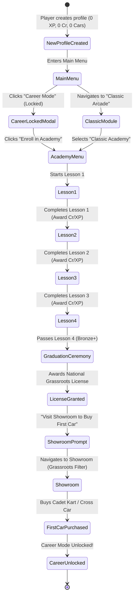

# Feature Spec: Classic Academy and Grassroots Career Onboarding 🎓🏁💰

A comprehensive specification defining the **Grassroots Career Onboarding Loop** for **TdRace**. Under this model, new player profiles initialize with **$0\text{ XP}$ and $\$0\text{ Cr}$ (Bank Credits)** with **zero free career vehicles**. To enter competitive motorsport, rookies must complete the **Classic Academy** within the Classic Arcade module. By mastering vehicle handling fundamentals across four structured driving challenges, players earn their **National Grassroots Racing License** and a seed credit purse of **$\$7,000 – \$14,500\text{ Cr}$**, granting them the purchasing power to acquire their first competition machine in entry-level grassroots categories (**Karting**, **Autocross**, or **Rallycross**).

---

## 🎯 Executive Summary & Problem Statement

### 1.1 The Empty-Handed Rookie Paradigm
In legacy career structures ([Spec 013](013_player_profile_enhancement_and_career_dossier.md), [Spec 030](030_career_system_wiki_reference_and_progression_mechanics.md)), players were either automatically gifted starter vehicles in every motorsport category or allowed to jump straight into professional GT and NASCAR series without earning racing credentials. This introduced three critical design defects:
1. **Absence of Accomplishment**: Receiving free machinery in every category devalues vehicle ownership and eliminates early-game economic motivation.
2. **Skill Disconnect**: New players entering high-horsepower disciplines (e.g. GT4, Late Models, SuperBuggy) frequently struggled with high-speed weight transfer, digital steering over-correction, and loose-surface slip without having learned basic vehicle dynamics.
3. **Flat Career Topology**: Grassroots disciplines like Karting and Autocross were treated merely as parallel silos rather than the natural, foundational stepping stones of real motorsport.

### 1.2 Core Design Principles
This specification enacts a foundational shift in how players begin their motorsport journey:
- **Zero-Start Initial State**: Every new driver dossier starts with **$0\text{ XP}$**, **$\$0\text{ Cr}$**, and an **empty career garage**.
- **No Free Career Vehicles**: Absolutely every vehicle in dedicated motorsport disciplines (Karting, Autocross, Rallycross, GT, NASCAR, Extreme Off-Road) must be purchased from the Showroom using earned Credits.
- **Classic Arcade Always Playable**: Casual arcade modes (Quick Race, Single Race, Time Trial) in the **Classic Module** remain unlocked immediately from day one, utilizing the built-in arcade fantasy cars (Classic Red, Blue, Yellow, Green, etc.).
- **The Classic Academy as the Gate to Career**: Positioned within the Classic Module, the Academy serves as an interactive racing school. Completing its curriculum awards the **National Grassroots License** and a tiered credit purse.
- **Natural Grassroots Pricing Calibration**: Vehicles are priced according to authentic real-world financial barriers, positioning **Karting** as the most affordable gateway, followed closely by **Cross Car Autocross** and **Junior Rallycross**, while GT and Stock Car machinery remain mid-term aspirational targets.

---

## 🏎️ Grassroots Hierarchy & Vehicle Pricing Reference Table

To deliver a credible sense of progression, in-game Credit costs ($\text{Cr}$) are scaled against real-world turnkey racing costs (turnkey race-ready chassis, engine homologation, and safety equipment).

### 2.1 Grassroots Vehicle Pricing Reference Table

| Motorsport Discipline | Class / Homologation Spec | In-Game Tier | Typical Real-World Cost (Turnkey / Season Ready) | In-Game Price (Credits / $\text{Cr}$) | Economic Pacing & Accessibility |
| :--- | :--- | :---: | :---: | :---: | :--- |
| **Karting** | **Cadet 60cc** (Mini ROK / IAME Swift) | Tier 1 | $\$3,500 - \$5,500$ | **$\$5,000\text{ Cr}$** | **Starter Entry**: Affordable immediately with all-Bronze Academy completion ($\$7,000\text{ Cr}$ purse). |
| **Karting** | **OK-Junior 125cc** (TaG 2-Stroke, direct drive) | Tier 2 | $\$7,000 - \$10,000$ | **$\$8,500\text{ Cr}$** | **Grassroots Step-Up**: Affordable with all-Silver Academy performance. |
| **Karting** | **KZ2 Shifter 125cc** (6-speed sequential, $45\text{ hp}$) | Tier 3 | $\$12,000 - \$16,000$ | **$\$14,000\text{ Cr}$** | **Advanced Grassroots**: Affordable with all-Gold Academy mastery. |
| **Karting** | **Superkart 250cc Twin** (Full aerodynamic bodywork, $230\text{ km/h}$) | Tier 4 | $\$25,000 - \$35,000$ | **$\$30,000\text{ Cr}$** | **Discipline Apex**: Requires career earnings from lower karting tiers. |
| **Autocross** | **Cross Car Junior** (FIA 600cc spec, restricted $75\text{ hp}$, spaceframe) | Tier 1 | $\$16,000 - $\$22,000$ | **$\$12,000\text{ Cr}$** | **Starter Entry**: Accessible with all-Silver Academy + 1 exhibition race, or high Gold. |
| **Autocross** | **Cross Car Senior XC** (850cc MT09 engine, $130\text{ hp}$, $312\text{ kg}$) | Tier 2 | $\$26,000 - $\$36,000$ | **$\$20,000\text{ Cr}$** | **Grassroots Step-Up**: Mid-level off-road investment. |
| **Autocross** | **Buggy 1600** (FIA 4WD, 1.6L atmospheric, $220\text{ hp}$, sequential) | Tier 3 | $\$45,000 - $\$65,000$ | **$\$38,000\text{ Cr}$** | **Advanced Off-Road**: Requires seasoned career winnings. |
| **Autocross** | **SuperBuggy** (FIA 4WD, up to 4.0L atmospheric / turbo, $500+\text{ hp}$) | Tier 4 | $\$80,000 - $\$130,000$ | **$\$75,000\text{ Cr}$** | **Discipline Apex**: Premier off-road investment. |
| **Rallycross** | **Junior RX / Swift Cup** (FWD, $1.4\text{L} / 1.6\text{L}$ Production Cup spec) | Tier 1 | $\$20,000 - $\$32,000$ | **$\$15,000\text{ Cr}$** | **Starter Entry**: Accessible with all-Gold Academy ($\$14,500\text{ Cr}$) plus one quick arcade win. |
| **Rallycross** | **RX3 / Super1600** (FIA FWD, $1.6\text{L}$ high-revving, Sadev dogbox) | Tier 2 | $\$55,000 - $\$75,000$ | **$\$35,000\text{ Cr}$** | **Grassroots Step-Up**: Professional customer touring platform. |
| **Rallycross** | **RX2e / Supercar Lites** (Mid-engine 4WD / 250kW Electric tubular) | Tier 3 | $\$120,000 - $\$160,000$ | **$\$65,000\text{ Cr}$** | **Advanced Platform**: High-tier feeder series car. |
| **Rallycross** | **RX1 Supercar** (FIA 4WD, $2.0\text{L}$ turbo, $600\text{ hp}$, $0-100$ in $1.9\text{s}$) | Tier 4 | $\$350,000 - $\$550,000+$ | **$\$160,000\text{ Cr}$** | **Discipline Apex**: Premier international championship machinery. |

### 2.2 Perspective Comparison: Circuit GT & Stock Car Categories

To emphasize the hierarchy of motorsport costs, professional asphalt circuit disciplines carry realistic commercial pricing that prevents rookies from bypassing the grassroots ranks:

| Discipline | Class / Homologation Spec | In-Game Tier | Typical Real-World Cost | In-Game Price (Credits / $\text{Cr}$) | Rationale |
| :--- | :--- | :---: | :---: | :---: | :--- |
| **Stock Car** | **Late Model** (Crate V8, perimeter chassis, short-track) | Tier 1 | $\$45,000 - $\$70,000$ | **$\$40,000\text{ Cr}$** | Requires saving prize money from junior grassroots series. |
| **Stock Car** | **NASCAR Cup Next Gen** (Spec chassis, $670\text{ hp}$ V8, sequential transaxle) | Tier 3 | $\$250,000 - $\$400,000$ | **$\$150,000\text{ Cr}$** | Elite oval racing investment. |
| **GT Racing** | **GT4 Clubman** (Factory homologated production race car, e.g. M4 GT4) | Tier 1 | $\$180,000 - $\$230,000$ | **$\$70,000\text{ Cr}$** | Professional sports car entry; unattainable without prior career earnings. |
| **GT Racing** | **GT3** (Full carbon aero, FIA homologated, e.g. 911 GT3 R, 296 GT3) | Tier 3 | $\$550,000 - $\$700,000$ | **$\$180,000\text{ Cr}$** | Pinnacle customer GT sports car. |

---

## 🗺️ User Flow & Interface Design

### 1. Onboarding State Machine & User Journey



### 2. Detailed Views & Interactive States

#### A. Main Menu Career Lock Badge
- The "Career Mode" button displays a subtle lock indicator: `🔒 License Required`.
- Clicking the button pops an onboarding dialogue:
  > **RACING LICENSE REQUIRED**  
  > Welcome, Rookie Driver! To compete in sanctioned motorsport championships, you must first obtain your **National Grassroots Racing License** at the **Classic Academy**.  
  > 
  > `[ Enroll in Classic Academy ]`  `[ Back ]`

#### B. Classic Academy Selection Screen
- Located as a dedicated sub-mode alongside Quick Race, Time Trial, and Single Race in the Classic Module.
- Displays 4 sequential Lesson Cards:
  - **Lesson 1: Racing Line & Apex Precision** (Classic Oval Infield Sector 1)
  - **Lesson 2: Threshold Braking & Weight Transfer** (Classic GP Chicane)
  - **Lesson 3: Mixed-Surface Transition & Car Control** (Classic Mixed-Surface Arena)
  - **Lesson 4: Academy Graduation Sprint** (2-Lap Final Exam against AI Pace Instructor)
- Displays Personal Best Time, earned Medal Badge (None / Bronze / Silver / Gold), and Purse preview (`Earn up to $2,000 Cr`).
- Next lesson unlocks automatically upon achieving at least Bronze in the preceding lesson.

#### C. Challenge HUD & Real-Time Feedback
- **Sector Delta Overlay**: Dynamic split time against the target Gold/Silver/Bronze pace (Green = ahead of Gold, Yellow = ahead of Silver, Red = behind Bronze).
- **Incident & Contact Warning**: Prominent banner alerting player if an off-track or car-to-car collision invalidates the attempt.
- **Instructor Ghost Car**: Semi-transparent blue ghost demonstrating the optimal racing line and braking thresholds (toggleable via Options or `G` key).

#### D. Academy Graduation Ceremony & Showroom Navigation
- Upon completing Lesson 4 with at least Bronze:
  - Full-screen fanfare with custom vector **National Grassroots Racing License** card displaying the driver's name, profile avatar, issue date, and Academy star rating (4/4 to 12/12).
  - Payout Summary tallying total credits credited to the driver's Bank Balance ($$7,000 - $14,500\text{ Cr}$$).
  - Primary Action Button: `[ Visit Showroom (Select Your Starter Car) ]`.
- Showroom automatically highlights **Grassroots Starter Vehicles**:
  - **Cadet Kart 60cc** ($\$5,000\text{ Cr}$) — Marked `AFFORDABLE (Recommended Entry)`
  - **Cross Car Junior** ($\$12,000\text{ Cr}$) — Marked `AFFORDABLE` (if Silver/Gold earned)
  - **Junior RX** ($\$15,000\text{ Cr}$) — Marked `CURRENTLY UNAFFORDABLE` (unless 1 exhibition race won)
  - GT and NASCAR vehicles display padlock icons with tooltips: `Requires Tier 1 License & $70,000 Cr`.
- Purchasing a vehicle triggers a delivery animation, adds the car to `owned_cars`, and unlocks Career Mode permanently.

---

## ⚙️ Backend Models & API Endpoints

### 1. Academy Lesson Data Models & Profile Schemas

```rust
// In crates/arcade-race-core/src/profile.rs or crates/tdrace-app/src/game/academy.rs

use serde::{Deserialize, Serialize};
use std::collections::HashMap;

/// Identifies the progressive lessons within the Classic Academy curriculum.
#[derive(Debug, Clone, Copy, PartialEq, Eq, Hash, Serialize, Deserialize)]
pub enum AcademyLessonId {
    Lesson1ApexLine,
    Lesson2BrakingChicane,
    Lesson3SurfaceTransition,
    Lesson4GraduationSprint,
}

impl AcademyLessonId {
    pub const ALL: [AcademyLessonId; 4] = [
        AcademyLessonId::Lesson1ApexLine,
        AcademyLessonId::Lesson2BrakingChicane,
        AcademyLessonId::Lesson3SurfaceTransition,
        AcademyLessonId::Lesson4GraduationSprint,
    ];

    pub fn slug(&self) -> &'static str {
        match self {
            Self::Lesson1ApexLine => "lesson_1_apex_line",
            Self::Lesson2BrakingChicane => "lesson_2_braking_chicane",
            Self::Lesson3SurfaceTransition => "lesson_3_surface_transition",
            Self::Lesson4GraduationSprint => "lesson_4_graduation_sprint",
        }
    }
}

/// Medal tier awarded for completing an academy challenge.
#[derive(Debug, Clone, Copy, PartialEq, Eq, PartialOrd, Ord, Serialize, Deserialize)]
pub enum AcademyMedal {
    None = 0,
    Bronze = 1,
    Silver = 2,
    Gold = 3,
}

/// Definition of an Academy Lesson.
#[derive(Debug, Clone, Serialize, Deserialize)]
pub struct AcademyLessonDef {
    pub id: AcademyLessonId,
    pub title: String,
    pub description: String,
    pub track_slug: String,
    pub car_slug: String,
    pub gold_time_sec: f32,
    pub silver_time_sec: f32,
    pub bronze_time_sec: f32,
    pub bronze_credit_bounty: u64,
    pub silver_credit_bounty: u64,
    pub gold_credit_bounty: u64,
    pub base_xp_reward: u32,
}

/// Player's progress on an individual Academy lesson.
#[derive(Debug, Clone, Default, Serialize, Deserialize)]
pub struct AcademyLessonProgress {
    pub completed: bool,
    pub best_time_sec: Option<f32>,
    pub highest_medal: AcademyMedal,
    pub bronze_claimed: bool,
    pub silver_claimed: bool,
    pub gold_claimed: bool,
    pub attempts: u32,
}

/// Global Classic Academy progress stored on the driver profile.
#[derive(Debug, Clone, Default, Serialize, Deserialize)]
pub struct ClassicAcademyProgress {
    pub lessons: HashMap<AcademyLessonId, AcademyLessonProgress>,
    pub license_granted: bool,
    pub license_granted_timestamp: Option<String>,
}

impl ClassicAcademyProgress {
    pub fn is_graduated(&self) -> bool {
        self.license_granted
            || self
                .lessons
                .get(&AcademyLessonId::Lesson4GraduationSprint)
                .map(|p| p.completed && p.highest_medal >= AcademyMedal::Bronze)
                .unwrap_or(false)
    }

    pub fn total_stars(&self) -> u32 {
        self.lessons.values().map(|p| p.highest_medal as u32).sum()
    }
}
```

### 2. PlayerProfile Integration & Rookie Factory

```rust
// In crates/arcade-race-core/src/profile.rs

#[derive(Debug, Clone, Serialize, Deserialize)]
pub struct PlayerProfile {
    pub name: String,
    pub created_at: String,
    pub credits: u64,
    pub academy_progress: ClassicAcademyProgress,
    pub owned_cars: Vec<String>,
    pub disciplines: HashMap<String, ModuleCareerProgress>,
}

impl PlayerProfile {
    pub fn new_rookie(name: impl Into<String>) -> Self {
        Self {
            name: name.into(),
            created_at: chrono::Utc::now().to_rfc3339(),
            credits: 0,
            academy_progress: ClassicAcademyProgress::default(),
            owned_cars: Vec::new(),
            disciplines: HashMap::new(),
        }
    }

    pub fn can_access_career(&self) -> bool {
        self.academy_progress.is_graduated() && !self.owned_cars.is_empty()
    }

    pub fn has_racing_license(&self) -> bool {
        self.academy_progress.is_graduated()
    }
}
```

---

## 🛡️ Security & Role-Based Access Controls (RBAC)

### 1. Invariant & Gating Rules
1. **Rookie Zero Balance Invariant**: Every newly instantiated driver profile initializes strictly with `credits = 0`, `owned_cars.is_empty()`, and `license_granted = false`. No legacy starter vehicles are pre-injected into the profile.
2. **Career Mode Gate Invariant**: The Career Mode launcher UI rejects launch requests and renders the Academy Prompt Modal unless `profile.can_access_career()` evaluates to `true`.
3. **Discipline Vehicle Ownership Invariant**: Entering a championship within a specific discipline (e.g. Karting Tier 1) requires the player to own at least one vehicle belonging to that discipline's eligible car roster for that tier.
4. **Classic Arcade Segregation Invariant**: Classic Arcade fantasy vehicles (`classic_red`, `classic_blue`, `classic_yellow`, etc.) are hard-coded as non-championship assets. They are permanently available for Quick Race and Academy challenges but cannot be registered in professional career tournaments.
5. **Idempotent Bounty Invariant**: First-time completion credit bounties for Bronze, Silver, and Gold are strictly one-time payouts tracked via boolean flags (`bronze_claimed`, `silver_claimed`, `gold_claimed`). Replaying an already mastered lesson yields nominal repetition rewards (e.g. standard lap completion credits) without re-awarding milestone bounties.

---

## 🧪 Verification & Acceptance Criteria

### Automated Tests
- Run core profile and academy tests:
  ```bash
  cargo test -p arcade-race-core --test profile_tests
  ```
- Run career gating and economic balance tests:
  ```bash
  cargo test -p tdrace-app --test career_onboarding_tests
  ```
- Full workspace preflight verification:
  ```bash
  cargo test --workspace --exclude tdrace-py
  ```

---

### Manual Acceptance Criteria (Pseudo-Gherkin)

- **Scenario: Fresh rookie profile initialization**
  - [ ] **Given** a brand-new player profile created in the driver dossier
  - [ ] **When** the profile's initial state is inspected
  - [ ] **Then** the driver has $0\text{ Credits}$ ($\text{Cr}$), $0\text{ XP}$ across all modules, an empty owned car collection, and an ungranted racing license.

- **Scenario: Classic arcade access with locked career**
  - [ ] **Given** a fresh rookie profile with $0\text{ Cr}$ and no racing license
  - [ ] **When** the player views the Main Menu
  - [ ] **Then** the Classic Arcade module is fully accessible with arcade fantasy cars, but Career Mode displays a lock badge requiring the National Grassroots License.

- **Scenario: Progressive academy lesson execution and credit bounties**
  - [ ] **Given** a rookie driver undertaking Lesson 1 of the Classic Academy
  - [ ] **When** the player finishes Sector 1 with a lap time qualifying for a Silver medal
  - [ ] **Then** the system awards both the Bronze ($\$1,000\text{ Cr}$) and Silver ($\$500\text{ Cr}$) bounties for a total of $\$1,500\text{ Cr}$, credits the profile wallet, and unlocks Lesson 2.

- **Scenario: Bounty claim idempotency on replay**
  - [ ] **Given** a player who has already claimed the Gold bounty on Lesson 1
  - [ ] **When** the player replays Lesson 1 and achieves a Gold time again
  - [ ] **Then** zero milestone bounties are awarded, the player's bank credits remain unchanged, and the previous best time is preserved.

- **Scenario: Academy graduation and license grant**
  - [ ] **Given** a player who has passed Lessons 1, 2, and 3
  - [ ] **When** the player completes Lesson 4 with a time beating the Bronze target without heavy car contact
  - [ ] **Then** the National Grassroots Racing License is permanently granted, the driver dossier records the award timestamp, and a graduation prompt directs the player to the Showroom.

- **Scenario: Grassroots car purchase with earned academy purse**
  - [ ] **Given** an Academy graduate with $\$7,000\text{ Cr}$ earned from all-Bronze lesson completions
  - [ ] **When** the player navigates to the Showroom
  - [ ] **Then** the Cadet Kart 60cc ($\$5,000\text{ Cr}$) is marked affordable and can be purchased, leaving $\$2,000\text{ Cr}$ in the player's wallet and adding the Cadet Kart to `owned_cars`.

- **Scenario: Unlocking career mode upon first vehicle purchase**
  - [ ] **Given** a licensed Academy graduate who just purchased their first Cadet Kart
  - [ ] **When** the player returns to the Main Menu
  - [ ] **Then** the Career Mode button is fully unlocked and active, allowing the player to enter the Karting Tier 1 Championship.

- **Scenario: Prevention of premature high-tier entry**
  - [ ] **Given** a fresh Academy graduate holding $\$14,500\text{ Cr}$ from all-Gold completions
  - [ ] **When** the player attempts to purchase a GT4 Clubman car ($\$70,000\text{ Cr}$) or enter a GT championship
  - [ ] **Then** the purchase is blocked due to insufficient funds, and GT championship entry is blocked because no eligible GT car is owned.

---

## 🔗 Traceability & Codebase Mapping

### Created / Modified Files
- `[ ]` `crates/arcade-race-core/src/profile.rs` -> Adds `ClassicAcademyProgress`, `AcademyLessonProgress`, `AcademyMedal`, `AcademyLessonId`, and updates `PlayerProfile` initialization and license gating.
- `[ ]` `crates/tdrace-app/src/game/academy.rs` -> Defines `AcademyLessonDef` catalog, target thresholds, and lesson evaluation logic.
- `[ ]` `crates/tdrace-app/src/ui/academy_ui.rs` -> Renders the Classic Academy curriculum screen, medal overlays, and graduation ceremony.
- `[ ]` `crates/tdrace-app/src/ui/menu.rs` -> Updates Career Mode button lock badges, click handling, and Academy prompt modal.
- `[ ]` `crates/tdrace-app/src/ui/garage.rs` -> Implements grassroots starter filtering, pricing badges, and purchase callbacks.
- `[ ]` `crates/tdrace-app/tests/career_onboarding_tests.rs` -> Comprehensive unit and integration test suite asserting the end-to-end rookie onboarding lifecycle.

### Verification Assertions
- `specs/060_classic_academy_and_grassroots_career_onboarding.md` is cross-referenced in the module documentation and test files.
- All 8 Pseudo-Gherkin scenarios are verified before transitioning status to `implemented`.
