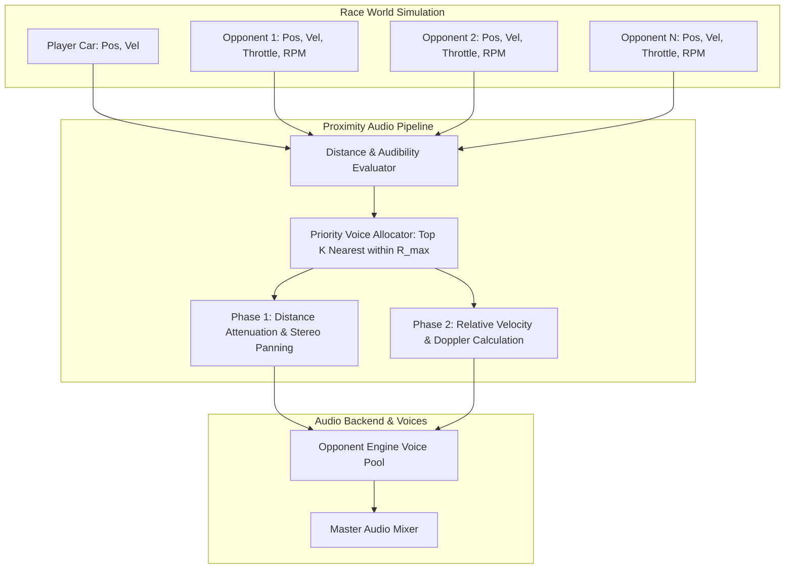

# Feature Spec 061: Proximity Engine Audio and Doppler Shift Simulation 🏎️🔊

A comprehensive audio and physical acoustics specification establishing dynamic spatial engine sound for **nearby opponent vehicles** in **TdRace**. Eliminates the acoustic isolation bubble where only the player car produces motor sounds, introducing distance-attenuated spatial multi-car engine audio and authentic Doppler frequency shifting across two phased development milestones.

---

## 🎯 Objectives & Design Philosophy

1. **Eliminate Acoustic Isolation**: Currently, engine synthesis is strictly evaluated for Player 1 (and Player 2 in split-screen). Opponent vehicles (AI bots and remote network competitors) operate in complete silence. This spec breaks that isolation bubble so players hear opponents approaching, revving in blind spots, slipstreaming, and passing.
2. **Two-Phase Structured Delivery**:
   - **Phase 1 (Proximity Audio)**: Core spatial distance attenuation, directional stereo panning, priority-ranked voice budgeting (capping simultaneous opponent audio voices to prevent resource exhaustion), and per-vehicle archetype matching.
   - **Phase 2 (Doppler Shift Effect)**: Physical relative-velocity frequency modulation that dynamically compresses and expands engine playback rates during high-speed approaches, flybys, and breakaways.
3. **Strict Voice Budgeting & Performance**: Running full 5-voice sampled synthesizers for 12–16 cars simultaneously would require 60–80 continuous voices, causing audio thread contention. The proximity system allocates a bounded pool of $K=3$ (or $K=4$) highest-priority audible voices, smoothly crossfading them as cars enter or leave hearing range.
4. **Physically Grounded Doppler Formulation**: Doppler frequency modulation is derived from the projected relative velocity along the line-of-sight vector between the emitter vehicle and the listener vehicle, calibrated using an arcade-tuned speed of sound ($c_{\text{arcade}}$) to ensure visceral acoustic feedback at top-down racing velocities.
5. **Zero Asset Bloat**: Reuses the procedural DSP synthesis engine and pre-generated archetype sample banks (`ArchetypeSampleBank`) without adding disk-based audio assets.

---

## 🗺️ User Flow & Interface Design

### 1. In-Race Acoustic Experience
When the player participates in any race session (Single Player Quick Race, Career Mode Championship, Custom Cup, or LAN Multiplayer):
- **Approaching Pack**: As opponent vehicles approach within $R_{\text{max}} = 75.0\text{ m}$, their distinct engine notes smoothly fade in from their relative directional bearing (panned left or right).
- **Slipstreaming & Dogfights**: Drafting right behind an opponent or running side-by-side elevates the opponent's engine sound to near-player volume ($d \le 2.5\text{ m}$ saturation), giving visceral feedback of their throttle load and gear changes.
- **High-Speed Flybys (Phase 2)**: Opponents overtaking at high closing speed exhibit an elevated approach pitch that abruptly drops in frequency as they cross the player's lateral line and pull away into the distance.



### 2. Audio Settings & Controls
In `ArcadeSettingsModal` under the Audio tab:
- **Master SFX Volume**: Scales master audio including all engine audio channels.
- **Opponent Engine Volume Slider (Optional / Advanced)**: Relative volume factor $[0.0, 1.0]$ for opponent engines (default: $0.70$).
- **Doppler Shift Toggle (Phase 2)**: Boolean toggle to enable or disable pitch modulation (default: `true`).

---

## ⚙️ Backend Models & API Endpoints

### 1. Mathematical Formulation: Proximity Attenuation & Panning (Phase 1)

#### Distance Attenuation
Let $\mathbf{p}_L \in \mathbb{R}^2$ be the 2D world position of the listener (player vehicle), and $\mathbf{p}_S \in \mathbb{R}^2$ be the position of opponent vehicle $S$.
The Euclidean distance is:
$$d = \|\mathbf{p}_S - \mathbf{p}_L\| = \sqrt{(x_S - x_L)^2 + (y_S - y_L)^2}$$

The distance attenuation gain $g(d) \in [0.0, 1.0]$ is evaluated with a quadratic roll-off envelope:
$$g(d) = \begin{cases}
1.0 & d \le d_{\text{min}} \\
\left(1.0 - \dfrac{d - d_{\text{min}}}{R_{\text{max}} - d_{\text{min}}}\right)^2 & d_{\text{min}} < d < R_{\text{max}} \\
0.0 & d \ge R_{\text{max}}
\end{cases}$$

**Calibration Constants:**
- $d_{\text{min}} = 2.5\text{ m}$ (Inner saturation boundary, wheel-to-wheel distance)
- $R_{\text{max}} = 75.0\text{ m}$ (Audible horizon boundary, viewport width + margin)
- Max Relative Gain: $G_{\text{opponent}} = 0.65$

#### Directional Stereo Panning
The relative displacement vector is $\vec{\Delta} = \mathbf{p}_S - \mathbf{p}_L$.
Projected along the screen horizontal axis $\hat{x}_{\text{screen}}$:
$$\text{pan} = \text{clamp}\left(\frac{\vec{\Delta} \cdot \hat{x}_{\text{screen}}}{R_{\text{pan}}}, -1.0, 1.0\right)$$
where $R_{\text{pan}} = 35.0\text{ m}$ spans full left/right stereo deflection.

#### Priority Voice Allocation & Hysteresis
- The proximity manager maintains a maximum of $K = 3$ concurrent active opponent voice slots.
- Every frame, all vehicles with $d < R_{\text{max}}$ are ranked in ascending order of $d$.
- An active voice slot retains its assigned vehicle unless a competitor becomes closer by more than the hysteresis threshold $\epsilon = 3.0\text{ m}$, preventing voice allocation thrashing.

---

### 2. Mathematical Formulation: Doppler Shift Simulation (Phase 2)

#### Radial Relative Velocity
Let $\mathbf{v}_L, \mathbf{v}_S \in \mathbb{R}^2$ be the velocities of listener and source.
The unit line-of-sight vector pointing from source towards listener is:
$$\hat{n}_{S \to L} = \frac{\mathbf{p}_L - \mathbf{p}_S}{\|\mathbf{p}_L - \mathbf{p}_S\|}$$

The relative approach velocity is the projection of the relative velocity vector along the line of sight:
$$v_{\text{approach}} = (\mathbf{v}_S - \mathbf{v}_L) \cdot \hat{n}_{S \to L}$$
where $v_{\text{approach}} > 0$ denotes mutual approach (frequency elevation), and $v_{\text{approach}} < 0$ denotes mutual separation (frequency drop).

#### Arcade Speed of Sound & Frequency Modulation
To guarantee an audible, dramatic Doppler sweep at arcade racing speeds ($30\text{--}65\text{ m/s}$), we define:
$$c_{\text{arcade}} = 160.0\text{ m/s}$$

The unconstrained Doppler multiplier is:
$$D_{\text{raw}} = \frac{c_{\text{arcade}}}{c_{\text{arcade}} - v_{\text{approach}}}$$

To prevent acoustic anomalies during violent crashes or physics pinballs:
- Clamped approach velocity: $v_{\text{approach}} \le 0.60 \times c_{\text{arcade}}$ ($96.0\text{ m/s}$)
- Clamped multiplier: $D \in [0.65, 1.45]$

#### Effective Playback Rate
For an opponent voice whose intrinsic RPM calculation specifies playback rate $R_{\text{intrinsic}}$:
$$R_{\text{effective}} = R_{\text{intrinsic}} \times D$$

---

### 3. Data Structures & Rust API (`crates/tdrace-app/src/audio/proximity.rs`)

```rust
/// Telemetry snapshot for spatial audio processing of an on-track vehicle.
#[derive(Debug, Clone, Copy)]
pub struct VehicleAudioSource {
    pub vehicle_id: usize,
    pub engine_type: EngineSoundType,
    pub position: glam::Vec2,
    pub velocity: glam::Vec2,
    pub forward_speed: f32,
    pub throttle: f32,
    pub slip_ratio: f32,
}

/// Dynamic Doppler calculation state and configuration.
#[derive(Debug, Clone, Copy)]
pub struct DopplerConfig {
    pub speed_of_sound: f32,     // Default: 160.0 m/s
    pub min_multiplier: f32,     // Default: 0.65
    pub max_multiplier: f32,     // Default: 1.45
    pub enabled: bool,           // Phase 2 feature flag
}

impl Default for DopplerConfig {
    fn default() -> Self {
        Self {
            speed_of_sound: 160.0,
            min_multiplier: 0.65,
            max_multiplier: 1.45,
            enabled: true,
        }
    }
}

/// Evaluates spatial proximity and Doppler parameters for a source relative to a listener.
pub fn calculate_spatial_audio(
    source: &VehicleAudioSource,
    listener_pos: glam::Vec2,
    listener_vel: glam::Vec2,
    doppler_cfg: &DopplerConfig,
) -> SpatialAudioResult {
    let delta = source.position - listener_pos;
    let dist = delta.length();
    let gain = calculate_distance_attenuation(dist, 2.5, 75.0);
    let pan = (delta.x / 35.0).clamp(-1.0, 1.0);

    let doppler = if doppler_cfg.enabled && dist > 0.001 {
        let los = -delta / dist;
        let v_rel = source.velocity - listener_vel;
        let v_approach = v_rel.dot(los).min(0.60 * doppler_cfg.speed_of_sound);
        (doppler_cfg.speed_of_sound / (doppler_cfg.speed_of_sound - v_approach))
            .clamp(doppler_cfg.min_multiplier, doppler_cfg.max_multiplier)
    } else {
        1.0
    };

    SpatialAudioResult {
        distance: dist,
        gain,
        pan,
        doppler_factor: doppler,
    }
}
```

---

## 🛡️ Security & Role-Based Access Controls (RBAC)

### 1. Memory Safety & Thread Isolation
- **Fixed Voice Allocation Bounds**: The maximum number of simultaneous proximity voice slots is strictly bounded ($K = 3$). No heap allocations occur in the audio update loop during race gameplay.
- **Audio Thread Stability**: Clamping relative velocities and Doppler factors guarantees that division-by-zero, `NaN`, or subnormal floating-point numbers can never be sent to the audio driver or Kira mixer.

### 2. Headless Simulation Decoupling & Invariance
- **Deterministic Physics Decoupling**: All spatial audio and Doppler computations are strictly read-only downstream projections of car positions and velocities. No audio calculations feed back into `wheelbase::Car` or `race-kit` world physics. Headless simulation throughput ($> 4.0\text{M steps/sec}$) is preserved completely unaffected.
- **AI Competence Invariance**: Bot pathfinding, throttle modulation, and collision resolution are completely isolated from proximity audio voice allocation and Doppler state.

---

## 🧪 Verification & Acceptance Criteria

### Automated Tests
- Command to run audio tests: `cargo test -p tdrace-app --test proximity_audio_tests`
- Command to verify engine mixer integration: `cargo test -p tdrace-app --test engine_mixer_tests`
- Command to run complete test suite: `cargo test --all`

### Manual Acceptance Criteria (Pseudo-Gherkin)

#### Phase 1: Proximity Audio & Distance Attenuation
- **Scenario: Opponent vehicle audible on approach**
  - [x] **Given** the player's car is driving down the straight at constant velocity
  - [x] **When** an opponent car approaches from behind, closing the distance from $90\text{ m}$ to $10\text{ m}$
  - [x] **Then** the opponent's engine sound should be completely silent at $> 75\text{ m}$
  - [x] **And** it should smoothly fade in and increase in volume as the car closes to $10\text{ m}$

- **Scenario: Distance-based attenuation at cutoff boundary**
  - [x] **Given** an opponent car is driving at a distance of $80\text{ m}$ from the player
  - [x] **When** the distance increases to $100\text{ m}$
  - [x] **Then** the opponent's engine volume remains $0.0$ and uses zero active audio voice resources

- **Scenario: Directional stereo panning across screen**
  - [x] **Given** an opponent car is overtaking the player on the left side (negative X relative to player)
  - [x] **When** the car is alongside at $(-15.0\text{ m}, 0.0\text{ m})$
  - [x] **Then** the engine sound should pan prominently to the left audio channel
  - [x] **When** the car crosses over to the right side $(+15.0\text{ m}, 0.0\text{ m})$
  - [x] **Then** the engine sound should smoothly transition to the right audio channel

- **Scenario: Multi-car pack voice allocation budgeting**
  - [x] **Given** a dense pack of 8 opponent vehicles surrounding the player
  - [x] **When** audio frames are processed
  - [x] **Then** exactly the 3 closest opponent vehicles within $75\text{ m}$ are allocated active audio voices
  - [x] **And** the remaining 5 more distant vehicles are culled without audio glitches or voice starvation

#### Phase 2: Doppler Shift Simulation
- **Scenario: Approaching vehicle exhibits higher-frequency Doppler pitch shift**
  - [x] **Given** Phase 2 Doppler simulation is enabled with $c_{\text{arcade}} = 160.0\text{ m/s}$
  - [x] **When** an opponent car approaches the player head-on with a relative approach velocity of $40.0\text{ m/s}$
  - [x] **Then** the observed Doppler factor should be approximately $1.33$ ($\frac{160}{160 - 40}$)
  - [x] **And** the engine playback rate should be shifted up by $\approx 33\%$ relative to its resting RPM pitch

- **Scenario: Receding vehicle exhibits lower-frequency Doppler pitch shift**
  - [x] **Given** an opponent car has completed an overtake and is pulling away at a relative receding velocity of $-30.0\text{ m/s}$
  - [x] **When** the spatial audio rate is evaluated
  - [x] **Then** the observed Doppler factor should be approximately $0.84$ ($\frac{160}{160 + 30}$)
  - [x] **And** the engine playback rate should be shifted down below its intrinsic RPM pitch

- **Scenario: Rapid flyby produces characteristic pitch drop transition**
  - [x] **Given** the player is parked near the track edge and an opponent passes at $50.0\text{ m/s}$
  - [x] **When** the opponent transitions from approaching ($+50\text{ m/s}$) to receding ($-50\text{ m/s}$) through the closest point of approach
  - [x] **Then** the playback rate should smoothly transition from pitch-elevated to pitch-lowered without click or pop artifacts

- **Scenario: Extreme collision relative speed remains safely clamped**
  - [x] **Given** a high-speed collision produces an instantaneous relative velocity spike exceeding $120.0\text{ m/s}$
  - [x] **When** the Doppler shift calculation is executed
  - [x] **Then** the Doppler multiplier must be clamped to the safe ceiling of $1.45$
  - [x] **And** no `NaN`, infinity, or audio thread panics occur

---

## 🔗 Traceability & Codebase Mapping

### Created Files
- `[x]` `crates/tdrace-app/src/audio/proximity.rs` -> Spatial proximity evaluator, distance attenuation, stereo panning, and Doppler calculations.
- `[x]` `crates/tdrace-app/tests/proximity_audio_tests.rs` -> Unit and integration tests for distance falloff, panning math, voice allocation, and Doppler pitch factor bounds.

### Modified Files
- `[x]` `crates/tdrace-app/src/audio/mod.rs` -> Exports `proximity` module and associated types.
- `[x]` `crates/tdrace-app/src/audio/manager.rs` -> Extends `AudioManager` with `ProximityVoiceSlot` pool, voice allocation, and dynamic telemetry feed.
- `[x]` `crates/tdrace-app/src/game/mod.rs` -> Collects all opponent car positions, velocities, and telemetry in the race loop and updates proximity audio.
- `[x]` `specs/constitution/ROADMAP.md` -> Links Spec 061 under Phase 2 audio milestones.

---

## 📋 Implementation Plan

### Phase 1: Proximity Motor Sound (Distance & Spatial Panning)
1. **Mathematical Core**: Implement `crates/tdrace-app/src/audio/proximity.rs` with pure, deterministic functions:
   - `calculate_distance_attenuation(distance, min_dist, max_dist) -> f32`
   - `calculate_stereo_pan(rel_pos, pan_radius) -> f32`
   - `select_top_k_audible_sources(sources, listener_pos, max_dist, k) -> Vec<usize>`
2. **Audio Voice Pool**:
   - Add `proximity_voices: [ProximityVoiceSlot; 3]` to `AudioManager`.
   - Implement voice assignment, crossfade smoothing, and RPM updating for opponent cars.
3. **Game Loop Dispatch**:
   - In `crates/tdrace-app/src/game/mod.rs`, iterate non-player vehicles in `self.world.vehicles`, construct `VehicleAudioSource` telemetry items, and call `audio.update_proximity_engines(...)`.
4. **Verification**:
   - Write comprehensive unit tests in `crates/tdrace-app/tests/proximity_audio_tests.rs`. Verify attenuation curve, panning, and voice budgeting.

### Phase 2: Doppler Shift Simulation
1. **Doppler Calculation**:
   - In `proximity.rs`, implement `calculate_doppler_factor(pos_s, vel_s, pos_l, vel_l, config) -> f32`.
   - Incorporate `c_arcade = 160.0`, line-of-sight projection, velocity clamping, and factor bounding $[0.65, 1.45]$.
2. **Mixer Integration**:
   - Multiply the intrinsic RPM pitch rate by `doppler_factor` in the proximity voice slots.
   - Verify smooth sub-frame interpolation and zero phase artifacts during flybys.
3. **Verification**:
   - Add Doppler test suite to `proximity_audio_tests.rs` verifying approaching, receding, stationary, and high-speed clamp scenarios.
