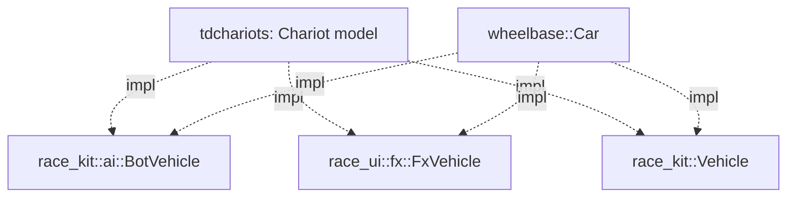

# Architecture Spec: Vehicle-Generic Bot AI and Effects 🏗️

Phase 5 of [spec 049](049_reusable_racing_platform_layers.md), the part that lives in this repo. It builds on [spec 056](056_racekit_headless_race_world.md) (`race-kit`), [spec 058](058_raceui_rendering_camera_effects_and_hud_primitives.md) (`race-ui`) and [spec 059](059_publishready_shared_crates.md) (the platform tag).

**Decision (Mario, 2026-09-29):** the chariot physics lives in the `tdchariots` repo, not in `wheelbase`. Only the rally game and tdrace use `wheelbase`, and the chariot model can then change without a tdrace release. This repo only makes the shared code work for any vehicle.

**Goal:**
- A chariot, with its own physics in `tdchariots`, can be driven by `race_kit::ai::BotAiDriver`.
- It gets dust, ruts and drift popups from `race_ui::fx::EffectsManager`.
- Today's cars give bit-identical results.

---

## 🗺️ Current vs. Proposed System Architecture

### 1. Current Architecture

Both parts are still typed to `wheelbase::Car`.

**Bot AI:** `BotAiDriver::compute_controls(&Car, &Track, &[&Car], dt)` (`crates/race-kit/src/ai/mod.rs:490`) and `HumanDriver::begin_tick` (`ai/humanize.rs:486`). They read:
- the `Body2D` state: position, angle, velocity and speed
- `forward_vector()` and `right_vector()`
- `config.top_speed_mps` (`ai/mod.rs:617,658`)
- `config.tire.grip` (`ai/mod.rs:644,648`)

**Effects:** `EffectsManager::update(&[Car], …)` (`crates/race-ui/src/fx/mod.rs:52`) and `SkidmarkBuffer::update_for_cars(&[Car], …)` (`fx/skidmarks.rs:87`). They read:
- `wheel_positions_world()`, the four `state.wheels` slip records, and `right_vector()`
- `state.is_airborne`, `state.elevation`, `state.is_drifting` and `state.drift_score`
- speed, velocity and position

### 2. Proposed Architecture

Two traits, each next to the code that uses it. Every method maps to a field or a method that `Car` already has.

```rust
// race-kit/src/ai/mod.rs
pub trait BotVehicle: Body2D {
    fn right_vector(&self) -> Vec2;      // Car: Car::right_vector
    fn top_speed_mps(&self) -> f32;      // Car: config.top_speed_mps
    fn grip(&self) -> f32;               // Car: config.tire.grip
}

// race-ui/src/fx/mod.rs
pub trait FxVehicle: Body2D {
    /// Four ground contact points: wheels for a car; for a chariot, e.g. its two wheels and two hoof groups.
    fn contact_points(&self) -> [Vec2; 4];                 // Car: wheel_positions_world()
    fn contact_telemetry(&self) -> &[WheelTelemetry; 4];   // Car: &state.wheels
    fn right_vector(&self) -> Vec2;                         // Car: Car::right_vector
    fn is_airborne(&self) -> bool;                          // Car: state.is_airborne
    fn is_drifting(&self) -> bool { false }                 // Car: state.is_drifting
    fn drift_score(&self) -> f32 { 0.0 }                    // Car: state.drift_score
}
```

- `compute_controls`, `begin_tick` and the other AI functions become generic over `V: BotVehicle`. `EffectsManager::update` and `update_for_cars` become generic over `V: FxVehicle`.
- The code inside moves without change. Only `car.config.x` and `car.state.x` become trait calls, and each call returns the same value.
- A `Vec<Car>` argument still compiles, so no caller changes.
- The elevation check uses `Body2D::jump_height()`, which is `state.elevation` for `Car`.
- `race-kit` and `race-ui` stay separate. `FxVehicle` lives in `race-ui`, and `race-ui` still does not depend on `race-kit`.

**Release:** after the merge, tag `platform-v0.2.0` on the merge commit and add a changelog entry to `docs/platform/CHANGELOG.md`. Mario pushes the tag.



**Changes from the spec 049 plan, with reasons:**
- **No chariot model in `wheelbase`.** This is Mario's decision above.
- **No shared vehicle sprite interface (`VehicleVisual`, `MultiPartVisual`).** Each game draws its own vehicles. The minimal race example draws boxes, and tdrace draws its own sprites. `tdchariots` builds its horse and chariot sprites itself. A shared interface can come when a second game needs the same drawing code.

**Out of scope:**
- A "ram" tactic or any other chariot behaviour for the AI: `tdchariots` decides that.
- Bots for a vehicle whose top speed or grip changes during a race: the traits return the current value, and that is enough.

---

## 🗄️ Database & Storage Migration Plan

No data format changes.

---

## 🔑 Security, Compliance, & IAM Roles

No new dependencies. No `unsafe`.

---

## 🛡️ Disaster Recovery, Monitoring, & Fallbacks

- **Determinism:** `golden_sim`, `golden_world` and `golden_session` keep their hashes, in debug and in release. The bot control hashes in `bot_humanlike_driving_tests` must give the same values as before this spec. That test already fails on `main` (`tdrace-6eaf`), so the check compares the value before and after, not the recorded constant.
- **Rollback:** a single `--no-ff` merge. The tag can be deleted if needed.

---

## 🧪 Verification & Acceptance Criteria

### Automated Tests
- New trait tests: `cargo test -p race-kit --test bot_vehicle_tests` and `cargo test -p race-ui --test fx_vehicle_tests`
- Bot tests: `cargo test -p tdrace-app --test bot_humanlike_driving_tests --test bot_curb_cutting_tests`
- Rust suite: `cargo test --workspace --exclude tdrace-py --no-fail-fast`. Only failures that plain `main` also has are allowed.
- Goldens: `golden_sim`, `golden_world` and `golden_session`, each also with `--release`.
- Builds: the `race-kit`, `race-ui` and `tdrace-app` wasm32 checks, and `cargo check -p tdrace-py`

### Manual Acceptance Criteria (Pseudo-Gherkin)

- **Scenario: A bot drives a vehicle that is not a car**
  - [x] **Given** a test vehicle that implements `Vehicle` and `BotVehicle` with simple point-mass physics, on the prototypical oval
  - [x] **When** a `BotAiDriver` drives it in a `RaceWorld` for 2 laps
  - [x] **Then** it finishes both laps, and it never stays below 2 m/s for more than 3 s after the start

- **Scenario: The effects follow a vehicle that is not a car**
  - [x] **Given** a test vehicle that implements `FxVehicle`, sliding on sand with high slip on its four contact points
  - [x] **When** `EffectsManager::update` runs for 1 s
  - [x] **Then** skid or rut segments are laid at its contact points, and dust particles are emitted

- **Scenario: Cars give the same results**
  - [x] **Given** the golden hashes and the bot control hashes measured on `main` before this spec
  - [x] **When** the goldens and the bot tests run on this branch in debug and release
  - [x] **Then** every hash is the same as before

- **Scenario: Existing callers compile unchanged**
  - [x] **Given** `tdrace-app`, the bot harness, the `minimal_race` example and the tests, with no edits to callers
  - [x] **When** the workspace builds
  - [x] **Then** everything compiles, with no new warnings

---

## 🔗 Traceability & Codebase Mapping

### Created/Modified Files
- `[x]` `crates/race-kit/src/ai/mod.rs`, `ai/humanize.rs` -> `BotVehicle`, generic AI, `impl BotVehicle for Car`.
- `[x]` `crates/race-ui/src/fx/mod.rs`, `fx/skidmarks.rs` -> `FxVehicle`, generic effects, `impl FxVehicle for Car`.
- `[x]` `crates/race-kit/tests/bot_vehicle_tests.rs` -> a bot drives a non-car vehicle.
- `[x]` `crates/race-ui/tests/fx_vehicle_tests.rs` -> effects follow a non-car vehicle.
- `[x]` `docs/platform/CHANGELOG.md` -> the `platform-v0.2.0` entry.
- `[x]` git tag `platform-v0.2.0` -> created locally. Mario pushes it.

### Beads Epic Mapping
- Governed by epic *Fulfill Spec 061: Vehicle-Generic Bot AI and Effects*.
