# Feature Spec: Circuit Pit Lanes and Interactive Pit Stop Procedures 🏁🔧⏱️

A comprehensive engineering and design specification introducing **physical pit lanes**, **interactive arcade pit stop procedures**, and **Track Studio authoring tools** to **TdRace**. While the baseline engine contains initial checkpoint flags (`is_pit_entry`, `is_pit_exit`) and an internal stop counter, circuits currently lack physical pit bypass ribbons, speed limiter enforcement, designated pit boxes, and interactive vehicle service mechanics. This specification bridges track design, physics simulation, audio-visual feedback, and bot AI navigation to deliver fast, tactical 2–3 second pit stops.

---

## 🎯 Executive Summary & Problem Statement

### 1.1 The Missing Tactical Dimension
In classic arcade racers like *GeneRally*, pit stops provide thrilling mid-race drama. Currently in `tdrace`:
1. **Zero Physical Corridors**: Checkpoints flag pit entry and exit, but there is no dedicated physical branch road or pit road ribbon for cars to traverse safely away from the racing line.
2. **Zero Service Action**: Passing through pit gates increments `pit_stops: u32`, but provides zero mechanical benefit—tires are not refreshed, damage is not patched, and vehicle controls do not interact with the pit lane.
3. **No Speed Regulation**: Vehicles can rocket through the pit area at $200\text{ km/h}$, eliminating any track position delta penalty compared to racing full speed on the main straight.
4. **Missing Studio CAD Tooling**: `EditorToolType::PitLane` (keyboard shortcut `[7]`) exists as a placeholder without interactive spline branching or pit box placement logic.

### 1.2 Core Design Principles
- **Branching Ribbon Geometry**: Pit lanes are secondary Catmull-Rom spline ribbons branching off the main track straight and rejoining smoothly before or after the start/finish line.
- **Enforced Speed Limiter Corridor**: Entering the pit lane automatically engages a pit speed governor ($60\text{ km/h} \approx 16.7\text{ m/s}$ on road circuits, $80\text{ km/h} \approx 22.2\text{ m/s}$ on high-speed ovals) with HUD indicator and rev-limiter audio chatter.
- **Snappy 2–3s Arcade Service**: Stopping inside the highlighted pit box halts the vehicle, triggers pneumatic air-jack and impact wrench audio, flashes pit crew visual indicators, resets tire wear ($W = 0.0$), executes quick-tape emergency chassis repairs, and launches the car back into the race.
- **AI Pit Tactics**: Autonomous bots evaluate tire wear ($W > 0.70$) and chassis integrity ($\text{health} < 0.60$), diving into the pit lane without human micromanagement.

---

## 🗺️ User Flow & Interface Design

### 1. In-Race Pit Stop State Machine & Flow

```mermaid
stateDiagram-v2
    [*] --> RacingOnTrack: Green Flag Racing
    RacingOnTrack --> CrossPitEntry: Car crosses is_pit_entry gate
    
    state "Pit Lane Corridor" as PitLaneState {
        CrossPitEntry --> LimiterEngaged: Speed Limiter Auto-Engaged (60 km/h)
        LimiterEngaged --> ApproachingBox: Driver steers along pit road ribbon
        ApproachingBox --> BoxDetected: Enters Pit Box zone (Stop marker turns green)
        
        state "Service Sequence (2.5s)" as ServiceAction {
            BoxDetected --> VehicleHalt: Driver brakes to halt (v < 1.5 m/s)
            VehicleHalt --> PneumaticJack: Air Jacks hiss; Car raised +0.08m
            PneumaticJack --> TireReplacement: Air-ratchet wrenches sound; Tires reset (W=0.0)
            TireReplacement --> EmergencyPatch: Quick-tape bodywork (+25% health, capped at 70%)
            EmergencyPatch --> JacksDrop: Car dropped; Green "GO! GO! GO!" prompt
        }
        
        ServiceAction --> AccelerationLane: Driver accelerates under speed limiter
    }
    
    AccelerationLane --> CrossPitExit: Car crosses is_pit_exit gate
    CrossPitExit --> LimiterDisengaged: Speed Limiter released; full throttle restored
    LimiterDisengaged --> RacingOnTrack: Blends into racing line with fresh rubber
```



### 2. HUD & Visual Experience

#### A. Pre-Entry & Pit Lane HUD
- **Tactical Pit Request Prompt**: When tire wear exceeds $60\%$ or chassis health drops below $50\%$, the Cockpit HUD flashes a yellow `[BOX THIS LAP]` indicator beside the mini-map.
- **Pit Limiter Banner**: When crossing `is_pit_entry`, the HUD displays a prominent cyan `[PIT LIMITER: 60 KM/H]` indicator. The engine audio switches to staccato pit limiter cutting.
- **Dynamic Box Chevron**: A high-visibility chevron marker pulses above the player's team pit stall (customized to the player's car primary livery color).

#### B. Pit Box Service Action
- **Positioning Tolerance**: Stopping within a $3.0\text{m}$ radius of the designated pit box center initiates service.
- **Floating Service Countdown**: A semi-transparent circular countdown ring appears over the car:
  - $0.0\text{s} - 1.0\text{s}$: `CHANGING TIRES...` (Wrench audio `ratchet_whir.wav`)
  - $1.0\text{s} - 2.0\text{s}$: `CLEARING RADIATOR & TAPE...` (Pneumatic hiss)
  - $2.0\text{s} - 2.5s$: `SERVICE COMPLETE!` (Flashing green text `+FRESH TIRES`, `+PATCHED`)
- **Visuals**: Two pit crew silhouettes (overhead 2.5D sprites) step to the side pods with pneumatic tire guns, accompanied by tire smoke dissipation particles.

---

## ⚙️ Backend Models & API Endpoints

### 1. Data Structures (`arcade-race-core::track`)

```rust
use glam::Vec2;
use serde::{Deserialize, Serialize};
use crate::track::geometry::LineSegment;
use crate::track::spline::TrackSpline;

/// Designated pit service stall along the pit road.
#[derive(Debug, Clone, Copy, PartialEq, Serialize, Deserialize)]
pub struct PitBox {
    /// World coordinates of the service box center.
    pub position: Vec2,
    /// Forward orientation vector of the stall.
    pub direction: Vec2,
    /// Stop target radius in meters (typically 2.5 - 3.5m).
    pub stop_radius: f32,
    /// Elevation above ground datum.
    pub elevation: f32,
}

/// Comprehensive physical pit lane definition for a circuit.
#[derive(Debug, Clone, Serialize, Deserialize)]
pub struct PitLane {
    /// Dedicated spline ribbon for the pit road bypass.
    pub spline: TrackSpline,
    /// Road width of the pit road (typically 4.0 - 6.0m).
    pub road_width: f32,
    /// Pit lane maximum regulated speed in m/s (default: 16.67 m/s = 60 km/h).
    pub speed_limit: f32,
    /// Service box stalls for racing participants.
    pub pit_boxes: Vec<PitBox>,
    /// Entrance line segment separating main track from pit lane.
    pub entry_gate: LineSegment,
    /// Exit merge line segment rejoining main track.
    pub exit_gate: LineSegment,
}
```

### 2. Speed Limiter & Service Controller (`race-kit::world`)

```rust
/// Runtime state of a vehicle navigating the pit lane.
#[derive(Debug, Clone, Copy, PartialEq)]
pub enum PitServiceState {
    NotPitting,
    InTransit { distance: f32 },
    StationaryInBox { timer: f32, target_duration: f32 },
    ServiceComplete { release_time: f32 },
}

impl PitServiceState {
    pub fn is_limiter_active(&self) -> bool {
        !matches!(self, Self::NotPitting)
    }

    pub fn are_controls_locked(&self) -> bool {
        matches!(self, Self::StationaryInBox { .. })
    }
}
```

---

## 🛠️ Track Studio Pit Lane Authoring Tooling

In `crates/tdrace-app/src/editor/`:
- **Tool Activation**: Pressing `[7]` activates `EditorToolType::PitLane`.
- **Node Placement**:
  - `Left Click` on or near the track ribbon creates a **Pit Divergence Waypoint**.
  - Subsequent clicks define the **Pit Bypass Spline** running parallel to the main straight.
  - `Shift + Left Click` on the pit spline places a **Pit Box Stall**.
  - Final `Left Click` near the track connects the **Pit Merge Waypoint**.
- **Real-Time Validation**:
  - Validates that pit lane entrance and exit gates intersect or smoothly diverge from the main circuit without acute angles ($> 60^\circ$).
  - Ensures minimum road width ($\ge 4.0\text{m}$) and clear barrier separation between pit lane and main straight.

---

## 🤖 Bot AI Pit Tactics

In `crates/race-kit/src/ai`:
1. **Decision Heuristic**:
   An AI bot evaluates whether to pit at lap completion:
   $$\text{ShouldPit} = (W_{\text{tire\_max}} > 0.70) \lor (\text{chassis\_health} < 0.60) \lor (\text{is\_mandatory\_stop\_pending})$$
2. **Navigation Blending**:
   - If `ShouldPit` is true and the bot is within $100\text{m}$ of the pit entry, the bot blends its target racing line toward the pit entry gate.
   - Inside the pit lane, the bot tracks `pit_lane.spline` rather than the main track spline, capping its throttle to obey `speed_limit`.
   - Upon approaching its assigned `PitBox`, the bot applies full braking to come to a complete halt, holds until release, and blends smoothly back into the race.

---

## 🛡️ Security & Role-Based Access Controls (RBAC)

### 1. Invariants & Anti-Exploit Rules
1. **Pit Lane Anti-Cut Invariant**: Driving through the pit lane without coming to a stop in a designated pit box counts as a pit lane transit, not an executed pit stop (`pit_stops` does not increment).
2. **Speed Limiter Override Prevention**: Speed limiter is enforced authoritatively by `RaceWorld::step` in `race-kit`; client input cannot override the maximum pit road speed ceiling ($16.67\text{ m/s}$).
3. **Ghost Collision Safety**: While stationary inside a pit box during the service sequence, the vehicle's rigid body collision with through-traffic is neutralized to prevent pit lane pileups.
4. **Pit Lane Directionality**: Driving against the designated pit lane spline direction triggers an immediate wrong-way penalty and resets the car to the pit entry point.

---

## 🧪 Verification & Acceptance Criteria

### Automated Tests
- `cargo test -p arcade-race-core test_pit_lane_geometry`
- `cargo test -p race-kit test_pit_service_state_machine`
- `cargo test -p tdrace-app test_pit_limiter_speed_clamping`

### Manual Acceptance Criteria (Pseudo-Gherkin)

- **Scenario: Entering pit lane activates speed governor**
  - [x] **Given** a vehicle racing at $150\text{ km/h}$ on the main straight
  - [x] **When** the vehicle steers into the pit lane and crosses the `is_pit_entry` gate
  - [x] **Then** the vehicle automatically decelerates with pit limiter audio chatter until speed $\le 60\text{ km/h}$
  - [x] **And** the Cockpit HUD displays the cyan `[PIT LIMITER: 60 KM/H]` indicator

- **Scenario: Interactive pit stop resets tire wear and field repairs chassis**
  - [x] **Given** a vehicle in the pit lane with $80\%$ tire wear and $40\%$ chassis health
  - [x] **When** the vehicle comes to a stop ($v < 1.0\text{ m/s}$) inside the designated pit box
  - [x] **Then** vehicle controls are locked for $2.5\text{ seconds}$ during the service sequence
  - [x] **And** pneumatic wrench sound effects play while the service countdown displays on screen
  - [x] **And** tire wear across all four wheels is reset to $0.0$
  - [x] **And** chassis health is increased by $+25\%$ (restoring health from $40\%$ to $65\%$)
  - [x] **And** controls are released with a green `[GO! GO! GO!]` indicator

- **Scenario: Exiting pit lane restores full racing throttle authority**
  - [x] **Given** a vehicle completing its service in the pit lane
  - [x] **When** the vehicle accelerates down the pit exit and crosses the `is_pit_exit` gate
  - [x] **Then** the pit speed governor is disengaged
  - [x] **And** the vehicle has unrestricted throttle authority to blend back into the racing line

---

## 🔗 Traceability & Codebase Mapping

### Modified Files
- `[x]` `crates/arcade-race-core/src/track/checkpoint.rs` -> Enhances checkpoint pit flags with stall indices.
- `[x]` `crates/arcade-race-core/src/track/geometry.rs` -> Adds `PitBox` and `PitLane` data structures.
- `[x]` `crates/race-kit/src/world.rs` -> Implements speed limiter enforcement and service countdown loop.
- `[x]` `crates/race-kit/src/vehicle.rs` -> Adds `service_tires()` and `apply_field_repair()` trait methods.
- `[x]` `crates/race-kit/src/ai/driver.rs` -> Adds autonomous bot pit entry and stopping logic.
- `[x]` `crates/tdrace-app/src/editor/` -> Implements spline and stall placement for `EditorToolType::PitLane`.
- `[x]` `crates/tdrace-app/src/ui/hud.rs` -> Adds pit limiter warning, box chevron, and service countdown widgets.
