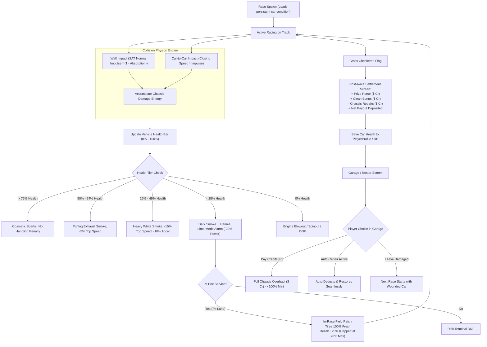

# Feature Spec: Damage Modelling, In-Race Field Repairs, and Garage Maintenance Economy 💥🛠️💰

A comprehensive specification defining **Arcade Vehicle Damage Modelling**, **Dual-Stage Repairs (In-Race Field Patch vs. Garage Overhaul)**, and the **Post-Race Maintenance Economy** for **TdRace**. This specification transforms vehicle impacts from inconsequential visual scrapes into meaningful gameplay stakes: reckless driving carries tangible performance penalties and post-race repair bills, rewarding clean racecraft and establishing an essential operational cash sink for the dual-currency economy ([Spec 053](053_dual_currency_economy_and_branching_career_progression_architecture.md)).

---

## 🎯 Executive Summary & Problem Statement

### 1.1 The Infinite Durability Exploit
Currently in `tdrace`:
1. **Wall-Riding & Dive-Bombing**: Vehicles possess infinite structural durability. Players quickly realize that bouncing off track perimeter walls at full throttle or using opponent cars as braking cushions ("dive-bombing") yields faster cornering times than proper threshold braking.
2. **The Post-Career Credit Hoard**: In the dual-currency economy ([Spec 053](053_dual_currency_economy_and_branching_career_progression_architecture.md)), once a player acquires their preferred car in each tier, liquid Credits ($\text{Cr}$) accumulate with no recurring operational expenses.
3. **Missing Repair Nuance**: Pit stops currently have no mechanic to patch wounded cars, and cars reset to 100% mint condition after every race.

### 1.2 Core Design Principles
- **Energy-Based Impact Model**: Damage is computed directly from Separating Axis Theorem (SAT) collision impulses and barrier energy absorption factors, differentiating between soft tire walls and rigid concrete.
- **Progressive Degradation, Not Sudden Death**: Arcade racing should remain thrilling and competitive; damage introduces progressive visual feedback (sparks $\to$ smoke) and subtle performance handicaps (top-speed limits), only inflicting terminal DNF at $0\%$ health.
- **Dual-Stage Repair Architecture**:
  - *In-Race (Pit Lane)*: Strictly limited to **Tire Replacements** ($100\%$ fresh rubber) and **Emergency Field Repairs** (bodywork tape, radiator clearing, $+25\%$ health up to a $70\%$ ceiling). Structural overhauls cannot be performed on pit road.
  - *Post-Race (Garage)*: Complete chassis rebuild back to $100\%$ mint condition paid in Credits ($\text{Cr}$).
- **Anti-Bankruptcy Sponsor Safety Floor**: Repair costs are mathematically capped to ensure struggling players never face negative net earnings or become soft-locked with a totaled car they cannot afford to fix.

---

## 🗺️ User Flow & Interface Design

### 1. Lifecycle of Vehicle Condition & Repairs



### 2. Post-Race Settlement Ledger UI
At race completion, the Race Summary displays an itemized financial statement before depositing funds into `PlayerProfile.credits`:

```
┌────────────────────────────────────────────────────────┐
│                   RACE PURSE SETTLEMENT                │
├────────────────────────────────────────────────────────┤
│ Round Finish: 1st Place (Gold)              +$5,000 Cr │
│ Clean Race Bonus:                           +$1,000 Cr │
│ ────────────────────────────────────────────────────── │
│ Gross Earnings:                             +$6,000 Cr │
│                                                        │
│ Chassis Repair Invoice (48% Health):          -$840 Cr │
│ Sponsor Safety Subsidy (Excess Cap):            +$0 Cr │
├────────────────────────────────────────────────────────┤
│ NET PRIZE DEPOSITED:                        +$5,160 Cr │
│ Current Bank Balance:                      $42,850 Cr  │
└────────────────────────────────────────────────────────┘
```

### 3. Garage Condition & Maintenance View
- **Chassis Condition Bar**: Located directly underneath vehicle specs (Speed, Acceleration, Grip, Drift) in the Showroom and Garage:
  - `CHASSIS INTEGRITY: 64%` (Visual color gradient: Green $\to$ Amber $\to$ Crimson).
  - Prominent Action Button: `[R] Repair Chassis ($540 Cr)` with wrench audio chime (`chassis_wrench.wav`).
- **Auto-Repair Toggle**: In the Game Settings / Garage Options, players can toggle:
  - `Auto-Repair Vehicles After Race: [ON / OFF]`.
  - When `ON`, repairs are automatically debited at the settlement screen, skipping manual garage maintenance.

---

## ⚙️ Backend Models & API Endpoints

### 1. Collision Damage Energy Formulation

#### A. Barrier Impact Damage
Reusing `WallCollisionEvent::estimated_damage_energy()` in `arcade-race-core`:
$$E_{\text{wall}} = 0.5 \cdot \left( J_n \cdot v_{\text{impact}} + 0.5 \cdot J_t \right) \cdot (1.0 - \alpha_{\text{barrier}})$$
Where $\alpha_{\text{barrier}}$ is the absorption factor:
- `Concrete`: $\alpha = 0.10$ ($90\%$ transferred to damage)
- `Steel`: $\alpha = 0.35$ ($65\%$ transferred to damage)
- `TireWall`: $\alpha = 0.75$ ($25\%$ transferred to damage)
- `Virtual`: $\alpha = 1.00$ ($0\%$ damage)

#### B. Vehicle-to-Vehicle Collision Damage
From `CarCarCollisionEvent` in `arcade-race-core`:
$$E_{\text{car}} = 0.5 \cdot \left( J_{\text{impulse}} \cdot v_{\text{closing}} \right) \cdot k_{\text{crumple}}$$
Where $k_{\text{crumple}} = 0.35$ (vehicles absorb mutual energy through body crumple zones). Damage is biased: rear-ending collisions assign $75\%$ of damage to the trailing aggressor car and $25\%$ to the leading car.

#### C. Health Integration
$$\Delta \text{Health} = \frac{E_{\text{damage}}}{E_{\text{total\_chassis\_capacity}}}$$
Where $E_{\text{total\_chassis\_capacity}}$ is calibrated so that approximately 3 severe full-speed concrete barrier impacts at $120\text{ km/h}$ deplete the chassis from $100\%$ to limp mode ($<25\%$).

---

### 2. Dual-Stage Repair Mechanics

#### Stage 1: In-Race Field Repair (Pit Lane Box)
- **Tire Replacement**: All four tires are completely replaced; wear resets to $W = 0.0$ and temperature resets to $85^\circ\text{C}$.
- **Emergency Patch**:
  $$\text{Health}_{\text{post\_pit}} = \min(0.70, \text{Health}_{\text{current}} + 0.25)$$
- *Rationale*: A 2.5-second pit stop cannot unbend a chassis or replace a damaged radiator, but can tape loose bodywork and clear air intakes to keep the car out of limp mode.

#### Stage 2: Garage Full Structural Overhaul
- Restores health unconditionally from $\text{Health}_{\text{current}}$ to $1.00$ ($100\%$).
- **Repair Cost Calculation**:
  $$\text{Cost}_{\text{repair}} = \text{round\_to\_10}\left( \text{base\_purse}(\text{tier}) \times 0.35 \times (1.0 - \text{Health})^{1.3} \right)$$

---

### 3. Anti-Bankruptcy Sponsor Safety Net

To guarantee that players can never go bankrupt or enter an inescapable death spiral:

1. **Max Repair Cap per Event**:
   $$\text{Max Repair Bill} = 0.40 \times \text{round\_purse}(\text{pos}, \text{tier})$$
   Even if a car is $100\%$ totaled, the repair deduction never exceeds $40\%$ of the prize purse won in that round.
2. **Sponsor Mechanic Safety Floor**:
   If a player's `PlayerProfile.credits` is below $\$1,000\,\text{Cr}$ and their active car has health $< 50\%$, the team's "Sponsor Mechanic" automatically patches the car to $50\%$ health **free of charge**.

---

### 4. Game Mode Gating

| Game Mode | Chassis Damage | In-Race Pit Repairs | Persistent Garage Repairs | Rationale |
| :--- | :---: | :---: | :---: | :--- |
| **Career Mode** | **Active** | **Active** | **Active** | Adds career stakes, budgeting, and long-term team management. |
| **Championships** | **Active** | **Active** | **Active** | Preserves damage across multi-round tournament calendars. |
| **Academy Missions** | **Tier-Gated** | **Tier-Gated** | **Free** | Tiers 1–2 have zero damage; advanced tiers introduce damage training. |
| **Time Attack** | **Disabled** | **Disabled** | **Disabled** | Solo hot-lapping requires identical car performance on every lap. |
| **Free Ride** | **Disabled** | **Disabled** | **Disabled** | Open practice to test cars and tracks without financial penalties. |
| **LAN Multiplayer** | **Optional** | **Active** | **Disabled** | Host setting: cars reset to 100% mint between multiplayer rounds. |

---

## 🛡️ Security & Role-Based Access Controls (RBAC)

### 1. Invariants & Financial Safeguards
1. **Sponsor Safety Net Invariant**: A player's bank balance can never be driven negative by repair deductions. The total repair deduction for a round is strictly capped at $\le 40\%$ of that round's prize purse.
2. **Sponsor Mechanic Free Floor**: If a driver's liquid balance drops below $\$1,000\,\text{Cr}$ and their vehicle health is below $50\%$, the chassis is automatically restored to $50\%$ health at zero charge before spawning in any event, preventing soft-locks.
3. **In-Race Field Repair Ceiling**: Under no circumstances can in-race pit box repairs restore chassis health above $70\%$; structural frame integrity beyond $70\%$ is gated exclusively to post-race garage overhauls.
4. **Deterministic Damage Invariant**: In headless simulation and replay verification, damage energy integration is bit-identical and deterministic for given collision impulses and delta time.

---

## 🧪 Verification & Acceptance Criteria

### Automated Tests
- `cargo test -p arcade-race-core test_collision_damage_energy_scaling`
- `cargo test -p tdrace-app test_sponsor_safety_floor_repair_cap`
- `cargo test -p tdrace-app test_in_race_field_repair_70_percent_cap`

### Manual Acceptance Criteria (Pseudo-Gherkin)

- **Scenario: Severe wall collision degrades vehicle performance**
  - [ ] **Given** a vehicle driving at $130\text{ km/h}$ with $100\%$ chassis health
  - [ ] **When** the vehicle collides head-on into a concrete barrier with normal impulse $\ge 8000\text{ N}\cdot\text{s}$
  - [ ] **Then** chassis health drops below $50\%$
  - [ ] **And** engine smoke particles begin emitting from the engine bay
  - [ ] **And** vehicle top speed is reduced by $-5\%$

- **Scenario: In-race pit stop provides fresh tires and emergency field patch**
  - [ ] **Given** a damaged vehicle with $35\%$ health and $80\%$ tire wear entering the pit box
  - [ ] **When** the $2.5\text{s}$ pit stop completes
  - [ ] **Then** tire wear across all wheels resets to $0.0$
  - [ ] **And** chassis health increases to exactly $60\%$ (+$25\%$ health)
  - [ ] **And** dark smoke stops emitting as the vehicle exits limp mode

- **Scenario: In-race pit stop cannot exceed 70% health ceiling**
  - [ ] **Given** a vehicle entering the pit box with $65\%$ health
  - [ ] **When** the pit stop completes
  - [ ] **Then** chassis health is clamped to exactly $70\%$ (does not reach $90\%$)
  - [ ] **And** full restoration requires a post-race garage overhaul

- **Scenario: Post-race repair bill honors the sponsor safety cap**
  - [ ] **Given** a Tier 1 race where 8th place awards $\$750\text{ Cr}$
  - [ ] **When** a player finishes 8th with a totaled car ($0\%$ health)
  - [ ] **Then** the repair bill is capped at $40\%$ of $\$750 = \$300\text{ Cr}$
  - [ ] **And** the net payout deposited to the player's wallet is $+\$450\text{ Cr}$ (never negative)

---

## 🔗 Traceability & Codebase Mapping

### Modified Files
- `[ ]` `crates/wheelbase/src/car.rs` -> Adds `chassis_health: f32` to `CarState` and speed attenuation under limp mode.
- `[ ]` `crates/arcade-race-core/src/collision/wall.rs` -> Exposes scalar damage energy accumulation.
- `[ ]` `crates/arcade-race-core/src/collision/car_collision.rs` -> Calculates damage energy from vehicle-vehicle impacts.
- `[ ]` `crates/tdrace-app/src/profile/` -> Adds persistent `car_conditions: HashMap<String, f32>` to profile schema.
- `[ ]` `crates/tdrace-app/src/storage.rs` -> Updates SQLite persistence for vehicle conditions.
- `[ ]` `crates/tdrace-app/src/game/` -> Implements the post-race financial settlement breakdown and garage repair action.
- `[ ]` `crates/race-ui/src/hud/` -> Renders health bar, smoke particles, and red limp-mode alarm warning.
