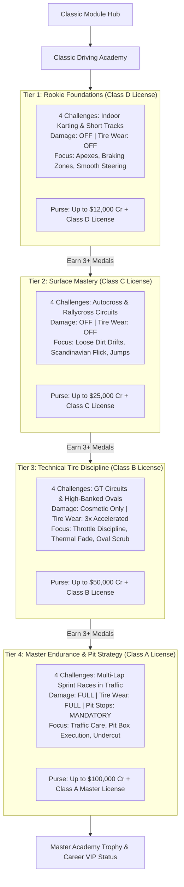

# Feature Spec: Classic Module Multi-Tier Academy Missions and Degradation Curriculum 🎓🏎️🏁

A comprehensive feature specification expanding the **Classic Arcade Module** into a structured, **4-Tier Motorsport Academy** leveraging the 18 newly revamped fictional circuits ([Spec 055](055_classic_circuits_revamp.md)) and the dual-currency economy ([Spec 053](053_dual_currency_economy_and_branching_career_progression_architecture.md)). Under this design, the Classic Academy serves as both an essential **driving school curriculum** and a **risk-free economic earning engine**. Initial tiers feature zero damage to teach clean car control, while advanced tiers introduce accelerated tire wear, thermal discipline, chassis preservation, and mandatory pit stop strategy.

---

## 🎯 Executive Summary & Problem Statement

### 1.1 The Need for Progressive Driver Training
With the revamp of Classic circuits ([Spec 055](055_classic_circuits_revamp.md)) and the introduction of vehicle damage and pit stops ([Spec 062](062_circuit_pit_lanes_and_interactive_pit_stop_procedures.md), [Spec 063](063_damage_modelling_inrace_field_repairs_and_garage_maintenance_economy.md)):
1. **The Skill Cliff**: Jumping straight from casual arcade driving into high-stakes career championships with damage and tire degradation leads to frustration and high repair bills. Players need a safe, pedagogical environment to master technical driving skills.
2. **Underutilized Circuit Variety**: Spec 055 provides 18 rich fictional tracks across 6 distinct disciplines (Indoor Karting, Rallycross, Autocross, GT, Stock Cars, All-Terrain). An academy curriculum provides the ideal showcase for these diverse layouts.
3. **The Credit Drought Safety Net**: If a player in Career Mode suffers heavy damage bills and runs low on Credits, they require a reliable, risk-free venue to earn cash through pure driving skill without incurring maintenance deductions.

### 1.2 Core Design Principles
- **Progressive Degradation Gating**:
  - *Tiers 1 & 2 (Rookie & Clubman)*: **Zero damage, zero tire wear**. Focus is $100\%$ on lines, braking points, surface transitions, and throttle control.
  - *Tier 3 (Technical Precision)*: **Accelerated tire wear ($3\times$) and thermal fade** are enabled; damage remains purely cosmetic. Players learn that over-scrubbing tires and power-sliding on asphalt ruins lap times.
  - *Tier 4 (Master Endurance)*: **Full damage, tire wear, and mandatory pit stops**. Players race in traffic, manage tire degradation, and execute pit lane strategy.
- **Lucrative Tiered Earning Engine**: Completing challenges with Bronze, Silver, or Gold medals awards substantial, permanent Credit purses ($\text{Cr}$) that fund vehicle purchases in career showroom categories.
- **Repeatable Refresher Drills**: Gold-cleared lessons can be re-run for repeatable "Test Driver Stipends" ($+\$2,000 - \$5,000\,\text{Cr}$), ensuring players can never be permanently broke.

---

## 🗺️ User Flow & Interface Design

### 1. Academy Tier Progression Architecture



### 2. Challenge HUD with Real-Time Degradation Coaching
During Tier 3 and Tier 4 missions, the HUD expands to provide real-time coaching:
- **Tire Thermal & Wear HUD**: A 4-wheel corner badge displays live tread surface temperature and wear percentage:
  - Cold ($< 70^\circ\text{C}$): Blue / Reduced Grip.
  - Optimal ($80^\circ\text{C} - 105^\circ\text{C}$): Green / Peak Grip.
  - Overheated ($> 120^\circ\text{C}$): Flashing Orange / Thermal Fade Warning `[TIRES OVERHEATING: REDUCE SLIP]`.
- **Pit Entry Delta & Limiter Assistant**: Prominently guides the player to the pit entry lane with green brake-point chevrons.

---

## 🏎️ Curriculum Structure & Challenge Matrix

### Tier 1: Rookie Foundations (Class D) — *Damage: OFF | Wear: OFF*
| Challenge ID | Name | Track & Car | Objective | Gold / Silver / Bronze Targets | Max Purse |
| :--- | :--- | :--- | :--- | :--- | :---: |
| `acad_1_1` | **Apex Precision** | Kart Circuit 1 (Turbo Dart 200cc) | Hit 4 apex clipping zones without touching barriers. | $< 18.5\text{s}$ / $20.0\text{s}$ / $22.5\text{s}$ | $\$2,500\,\text{Cr}$ |
| `acad_1_2` | **Threshold Braking** | GT Circuit 1 Straight (Apex Phantom) | Accelerate to $160\text{ km/h}$ and stop within the $15\text{m}$ stop box. | In box $< 9.2\text{s}$ / $10.5\text{s}$ / $12.0\text{s}$ | $\$2,500\,\text{Cr}$ |
| `acad_1_3` | **Chicane Rhythm** | GT Circuit 2 (Apex Phantom) | Navigate quick left-right curb chicane without spinning. | $< 14.0\text{s}$ / $15.5\text{s}$ / $17.5\text{s}$ | $\$3,000\,\text{Cr}$ |
| `acad_1_4` | **Rookie Sprint** | Kart Circuit 2 (Turbo Dart 200cc) | 2-Lap solo sprint against the clock. | $< 42.0\text{s}$ / $45.0\text{s}$ / $49.0\text{s}$ | $\$4,000\,\text{Cr}$ |

### Tier 2: Surface Mastery & Dynamic Control (Class C) — *Damage: OFF | Wear: OFF*
| Challenge ID | Name | Track & Car | Objective | Gold / Silver / Bronze Targets | Max Purse |
| :--- | :--- | :--- | :--- | :--- | :---: |
| `acad_2_1` | **Dirt Drift Angle** | Autocross Circuit 1 (Cross Car AX) | Maintain a continuous power slide through the hairpin. | Drift score $> 1200$ / $900$ / $600$ | $\$5,000\,\text{Cr}$ |
| `acad_2_2` | **The Scandinavian Flick** | Rallycross 1 Mixed (Trailfire Turbo) | Weight transfer flick on tarmac-to-gravel transition. | Sector time $< 12.8\text{s}$ / $14.0\text{s}$ / $16.0\text{s}$ | $\$5,500\,\text{Cr}$ |
| `acad_2_3` | **Ramp Takeoff & Balance** | All-Terrain 1 Dunes (Vortex Crusher) | Launch off mega ramp, land squarely, avoid berm crash. | Clean landing + time $< 16.5\text{s}$ | $\$6,500\,\text{Cr}$ |
| `acad_2_4` | **Mixed-Surface Qualifier** | Rallycross 2 (Trailfire Turbo) | 2-lap sprint traversing tarmac, dirt, and joker jump. | $< 1: 18.0$ / $1: 22.0$ / $1: 28.0$ | $\$8,000\,\text{Cr}$ |

### Tier 3: Technical Tire Discipline (Class B) — *Damage: Cosmetic | Wear: 3x Accelerated*
| Challenge ID | Name | Track & Car | Objective | Key Learning / Mechanism | Max Purse |
| :--- | :--- | :--- | :--- | :--- | :---: |
| `acad_3_1` | **Thermal Throttle Care** | GT Circuit 2 (Apex Phantom GT) | 3-lap pace challenge. Finish under target time with final tire wear $< 40\%$. | Over-driving overheats tires and causes massive time loss on lap 3. | $\$10,000\,\text{Cr}$ |
| `acad_3_2` | **Oval Stint Management** | Stock Car Tri-Oval (Thunderbolt V8) | 5-lap high-speed oval stint. Maintain average speed $> 180\text{ km/h}$ while preserving right-side tires. | Turning too aggressively scrubs front-right tire into severe understeer. | $\$12,000\,\text{Cr}$ |
| `acad_3_3` | **Nursing Worn Rubber** | GT Circuit 3 (Apex Phantom GT) | Spawn with pre-worn tires ($65\%$ wear). Complete 2 clean laps without spinning or hitting walls. | Teaches patient throttle modulation and early braking when grip is low. | $\$13,000\,\text{Cr}$ |
| `acad_3_4` | **Tire Conservation Sprint** | Stock Car Roval (Thunderbolt V8) | 4-lap sprint race against 3 conservative AI cars. | AI burns their rubber early; patient driver overtakes on laps 3 & 4. | $\$15,000\,\text{Cr}$ |

### Tier 4: Master Endurance & Pit Strategy (Class A) — *Damage: FULL | Wear: FULL | Pit: MANDATORY*
| Challenge ID | Name | Track & Car | Objective | Key Learning / Mechanism | Max Purse |
| :--- | :--- | :--- | :--- | :--- | :---: |
| `acad_4_1` | **Pit Lane In & Out** | GT Circuit 1 (Apex Phantom GT) | Approach pit at speed, hit $60\text{ km/h}$ limiter gate cleanly, execute $2.5\text{s}$ box stop, exit without penalty. | Practicing entry deceleration and pit box positioning under race pressure. | $\$18,000\,\text{Cr}$ |
| `acad_4_2` | **Traffic Care & Preservation** | Stock Car Oval (Thunderbolt V8) | 6-lap race starting in 8th position. Reach podium with chassis health $\ge 80\%$. | Bumping opponents causes chassis damage; teaches precision slipstream passing. | $\$22,000\,\text{Cr}$ |
| `acad_4_3` | **The Undercut Strategy** | GT Circuit 3 (Apex Phantom GT) | 6-lap sprint. Leader pits on Lap 4; player must pit on Lap 3, set a blistering out-lap on fresh tires, and emerge ahead. | Tactical pit window execution and cold-tire out-lap speed. | $\$28,000\,\text{Cr}$ |
| `acad_4_4` | **Academy Grand Finale** | Classic Grand Prix Ribbon (Apex GT) | 8-lap endurance championship race against 7 AI drivers. Full damage, tire wear, mandatory pit stop. | The ultimate test combining pace, tire conservation, chassis safety, and pit execution. | $\$32,000\,\text{Cr}$ |

---

## ⚙️ Backend Models & API Endpoints

### 1. Profile Academy Progress (`crates/tdrace-app/src/profile/`)

```rust
use serde::{Deserialize, Serialize};
use std::collections::HashMap;

/// Medal awarded for completing an academy challenge.
#[derive(Debug, Clone, Copy, PartialEq, Eq, PartialOrd, Ord, Serialize, Deserialize)]
pub enum AcademyMedal {
    None = 0,
    Bronze = 1,
    Silver = 2,
    Gold = 3,
}

/// Persistent record of player's academy achievements.
#[derive(Debug, Clone, Default, Serialize, Deserialize)]
pub struct ClassicAcademyProgress {
    /// Highest license tier unlocked: 1 (Class D), 2 (Class C), 3 (Class B), 4 (Class A).
    pub license_tier: u32,
    /// Best medal earned per challenge slug (e.g., "acad_1_1" -> Gold).
    pub medals: HashMap<String, AcademyMedal>,
    /// Best recorded lap or challenge completion time in seconds.
    pub best_times: HashMap<String, f32>,
    /// Lifetime Credits earned exclusively from academy completion.
    pub total_academy_earnings: u64,
}

impl ClassicAcademyProgress {
    /// Evaluates if the next license tier is unlocked (requires at least Bronze in 3/4 tier missions).
    pub fn is_tier_unlocked(&self, tier: u32) -> bool {
        if tier <= 1 {
            return true;
        }
        let prev_tier = tier - 1;
        let prefix = format!("acad_{}_", prev_tier);
        let completed = self.medals.iter()
            .filter(|(slug, medal)| slug.starts_with(&prefix) && **medal >= AcademyMedal.Bronze)
            .count();
        completed >= 3
    }
}
```

---

## 🛡️ Security & Role-Based Access Controls (RBAC)

### 1. Invariants & Progression Integrity
1. **Curriculum Gating Invariant**: Drivers cannot enter Tier $N$ academy challenges until achieving at least Bronze in at least 3 out of 4 challenges in Tier $N-1$.
2. **One-Time Medal Bounty Invariant**: First-time completion awards the delta between previously achieved medal bounties and the newly achieved medal purse, preventing infinite purse farming.
3. **Repeatable Stipend Rate-Limiting**: Re-running cleared missions awards a fixed practice stipend ($+\$2,000\,\text{Cr}$) capped at 5 stipends per calendar day, preventing macro exploitation while guaranteeing safety funds for broke players.
4. **License Portability Invariant**: Licenses unlocked in the Classic Academy (Class D, C, B, A) are globally recorded in `PlayerProfile` and recognized across career modules (Karting, Autocross, Rallycross, GT, NASCAR).

---

## 🧪 Verification & Acceptance Criteria

### Automated Tests
- `cargo test -p tdrace-app test_academy_tier_progression_gating`
- `cargo test -p tdrace-app test_academy_tire_wear_acceleration_rate`
- `cargo test -p tdrace-app test_academy_damage_mode_isolation`

### Manual Acceptance Criteria (Pseudo-Gherkin)

- **Scenario: Tier 1 missions have zero vehicle damage**
  - [ ] **Given** a player enrolled in Academy Mission `acad_1_1` (Apex Precision)
  - [ ] **When** the player collides with an infield perimeter wall at $100\text{ km/h}$
  - [ ] **Then** the car rebounds with standard SAT collision physics
  - [ ] **And** chassis health remains at $100\%$ with zero performance degradation or repair bills

- **Scenario: Tier 3 missions introduce accelerated tire wear**
  - [ ] **Given** a player driving Challenge `acad_3_1` (Thermal Throttle Care)
  - [ ] **When** the player completes 2 laps with sustained power-sliding and locked-wheel braking
  - [ ] **Then** the Cockpit HUD tire indicators turn orange/red
  - [ ] **And** telemetry records tire wear exceeding $35\%$ due to the $3\times$ acceleration rate
  - [ ] **And** vehicle cornering grip diminishes noticeably

- **Scenario: Tier 4 mission enforces mandatory pit stop to finish**
  - [ ] **Given** a player racing Challenge `acad_4_4` (Academy Grand Finale)
  - [ ] **When** the player crosses the finish line on Lap 8 without having completed a pit stop
  - [ ] **Then** the player is classified as Disqualified / Incomplete with a prompt: `MANDATORY PIT STOP NOT COMPLETED`

- **Scenario: Completing an academy challenge deposits Credits**
  - [ ] **Given** a player starting with $\$5,000\,\text{Cr}$ in their Bank Balance
  - [ ] **When** the player completes Challenge `acad_1_1` earning a Gold Medal
  - [ ] **Then** the Gold purse of $+\$2,500\,\text{Cr}$ is deposited into `PlayerProfile.credits`
  - [ ] **And** their updated balance reflects exactly $\$7,500\,\text{Cr}$

---

## 🔗 Traceability & Codebase Mapping

### Modified Files
- `[ ]` `crates/tdrace-app/src/profile/` -> Enhances `ClassicAcademyProgress` with 4-tier license state and challenge records.
- `[ ]` `crates/tdrace-app/src/game/academy.rs` -> Implements mission definitions, objective validators, and target times.
- `[ ]` `crates/tdrace-app/src/ui/academy_menu.rs` -> Renders 4-tier challenge selection UI with medal badges and purse indicators.
- `[ ]` `crates/race-kit/src/world.rs` -> Integrates degradation multipliers (`wear_rate_scale: f32`, `damage_enabled: bool`).
- `[ ]` `crates/race-ui/src/hud/` -> Renders tire thermal wear telemetry and pit coaching overlays.
