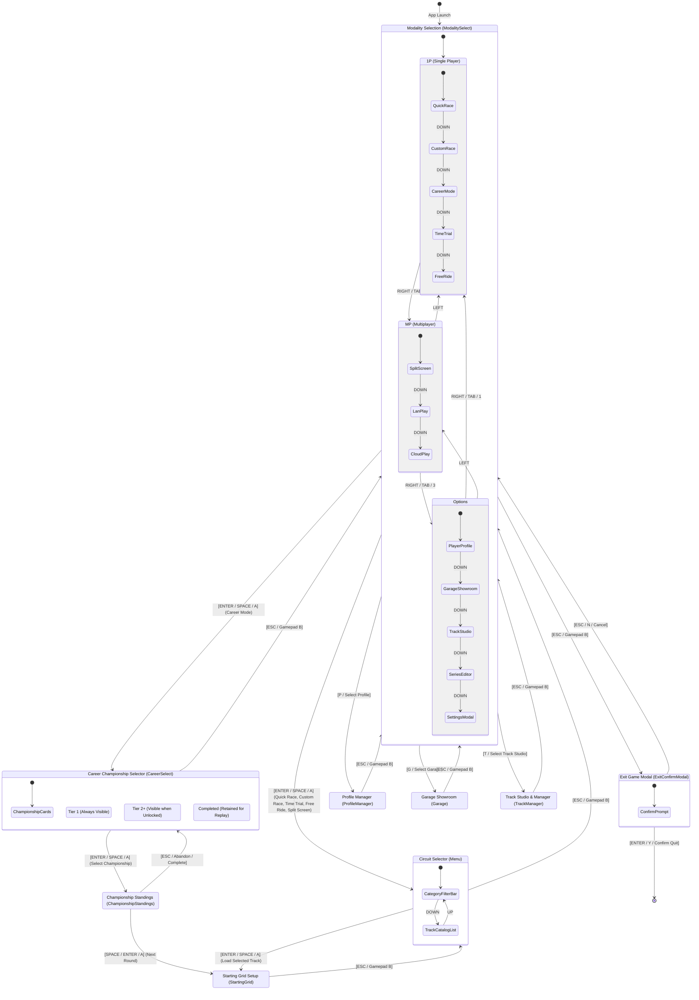

# Feature Spec: Navigation Reorganization, Category Circuit Filter, and Tiered Career Championships 🧭

## Executive Summary

Historically, launching **TdRace** presented players with the **Grand Hub (`GameState::ModuleSelect`)**, forcing an upfront commitment to a specific motorsport discipline (Classic Arcade, Rallycross, Karting, GT World Challenge, NASCAR, Extreme Off-Road) before selecting a play mode. This created architectural rigidity:
1. Casual racing modes (Quick Race, Custom Race, Time Trial, Free Ride, Split Screen) were confined to circuits belonging to the pre-selected discipline, requiring players to exit to the Grand Hub to switch disciplines.
2. Career mode was fragmented into per-module career screens rather than providing a unified progression across the game's motorsport categories.
3. The initial user experience had unnecessary menu depth prior to reaching primary game modes.

This specification redesigns the core navigation architecture around three major pillars:
1. **Grand Hub Removal & Modality Screen Entry**: The Grand Hub (`ModuleSelect`) is retired from the primary app boot lifecycle. The game boots directly into the **Race Modality Selection screen (`GameState::ModalitySelect`)**, organized into `1P (Single Player)`, `MP (Multiplayer)`, and `Options`. Pressing `ESC` from `ModalitySelect` opens the game exit confirmation modal. Secondary management screens return directly to `ModalitySelect`.
2. **Category-Filtered Circuit Selector for Non-Career Modes**: In casual sessions (Quick Race, Custom Race, Time Trial, Free Ride, Split Screen), players navigate directly from `ModalitySelect` to the **Circuit Selector (`GameState::Menu`)**. Because no discipline was chosen upfront, the circuit selector features a prominent **Category Filter Bar** allowing players to filter circuits by category (Classic, Rallycross, Karting, GT, NASCAR, Extreme Off-Road, Custom). Selecting a track automatically configures the vehicle roster, physics settings, and AI opponents appropriate for that category.
3. **Unified Tier-Gated Career Championships**: When selecting **Career Mode** from `ModalitySelect`, the player enters a unified **Championship Selector**. Instead of siloed module screens:
   - For new profiles, **only Tier 1 championships** across all registered categories are displayed initially.
   - As the player unlocks higher tiers through career progression, new championships for those unlocked tiers are added and become visible.
   - Previously completed championships **remain visible** and fully replayable, adorned with their earned podium trophies and finish records.

---

## 🗺️ User Flow & Interface Design

### 1. Navigation Flow & State Machine



### 2. Screen Specifications & Layouts

#### Screen A: Root Modality Selection (`GameState::ModalitySelect`)
- **Role**: Primary root hub of the game.
- **Top Bar**: Game branding title (`TDRACE MOTORSPORT`), active player profile name & avatar badge, platform clock/fps.
- **Header Tabs**: Three neon-accented modality categories:
  - `[ 1. SINGLE PLAYER ]` (5 items: Quick Race, Custom Race, Career Mode, Time Trial, Free Ride)
  - `[ 2. MULTIPLAYER ]` (3 items: Split Screen, LAN Play, Cloud Play)
  - `[ 3. OPTIONS ]` (5 items: Player Profile, Garage Showroom, Track Studio, Series Editor, Settings)
- **Footer**: Keybindings guide (`[ENTER/SPACE] Select  [TAB / 1-3] Category  [ESC] Quit Game`).
- **Escape Key Behavior**: Directly summons `UniversalConfirmModal::quit_game()` without leaving the screen.

```
+----------------------------------------------------------------------------------------------------+
|  TDRACE MOTORSPORT ARCHITECTURE                       [PROFILE: MARIO] [LVL 12] [CREDITS: 45,000]   |
+----------------------------------------------------------------------------------------------------+
|               [ 1. SINGLE PLAYER (1P) ]    [ 2. MULTIPLAYER (MP) ]    [ 3. OPTIONS ]               |
+----------------------------------------------------------------------------------------------------+
|                                                                                                    |
|   +---------------------------------+  +-------------------------------------------------------+   |
|   | > 1. QUICK RACE                 |  |  QUICK RACE                                           |   |
|   |   2. CUSTOM RACE                |  |  Instant single-race action on any circuit.           |   |
|   |   3. CAREER MODE                |  |  Features predefined car class and grid opponents.   |   |
|   |   4. TIME TRIAL                 |  |                                                       |   |
|   |   5. FREE RIDE                  |  |  Press ENTER to open Circuit Selector.                |   |
|   +---------------------------------+  +-------------------------------------------------------+   |
|                                                                                                    |
+----------------------------------------------------------------------------------------------------+
|  [UP/DOWN] Navigate  [LEFT/RIGHT/TAB] Category  [ENTER] Select  [ESC] Quit Game                    |
+----------------------------------------------------------------------------------------------------+
```

#### Screen B: Category-Filtered Circuit Selector (`GameState::Menu`)
- **Role**: Circuit selection for all non-career game modes (Quick Race, Custom Race, Time Trial, Free Ride, Split Screen, LAN Host).
- **Category Filter Pill Bar**:
  - Positioned at the top of the circuit browser column.
  - Categories: `[ ALL ]`, `[ CLASSIC ]`, `[ RALLYCROSS ]`, `[ KARTING ]`, `[ GT ]`, `[ NASCAR ]`, `[ OFF-ROAD ]`, `[ CUSTOM ]`.
  - Switching category filters the visible circuit list immediately.
  - Controls: `Q` / `E` or `[` / `]` or Left/Right when header focused cycles category filters; direct number keys `1..=7` switch instantly.
- **Circuit Catalog List**:
  - Displays circuits belonging to the active category filter (or all categories if `[ ALL ]`).
  - Each item shows: Track Name, Category Tag (`[GT3]`, `[RX]`, `[KART]`, `[OVAL]`), Surface Type (`Tarmac`, `Mixed Gravel`, `Dirt/Clay`), Track Length.
- **Right Column Preview**:
  - Full-fidelity vector geometry preview with start/finish line, curbs, and runoff corridors.
  - Circuit Dossier & Telemetry specs (track length, average width, turns, lap record).
  - Recommended vehicle archetype tag.
- **Selection Action**:
  - Pressing `ENTER` or `SPACE` loads the circuit, sets the active motorsport module to the track's native module, and transitions to `GameState::StartingGrid`.
  - Pressing `ESC` returns to `GameState::ModalitySelect` with the previously selected modality highlighted.

```
+----------------------------------------------------------------------------------------------------+
|  CIRCUIT SELECTOR // QUICK RACE                                               CATEGORY: [ GT ]     |
+----------------------------------------------------------------------------------------------------+
|  CATEGORY: [ ALL ] [ CLASSIC ] [ RALLY ] [ KART ] < [ GT ] > [ NASCAR ] [ OFF-ROAD ] [ CUSTOM ]   |
|  CATALOG TYPE: [ OFFICIAL PRESETS (12) ]  [ USER CUSTOM (3) ]                                      |
+-------------------------------------------------------+--------------------------------------------+
|  > 01. Circuit de Spa-Francorchamps      [GT] 7,004m  |       [ VECTOR TRACK GEOMETRY PREVIEW ]    |
|    02. Monza Autodromo Nazionale         [GT] 5,793m  |                                            |
|    03. Silverstone GP Circuit            [GT] 5,891m  |       Circuit: Circuit de Spa-Francorchamps|
|    04. Nurburgring GP-Strecke            [GT] 5,148m  |       Country: Belgium                     |
|    05. Red Bull Ring (Spielberg)         [GT] 4,318m  |       Length: 7.004 km  | Width: 14.0 m    |
|    06. Circuit de Barcelona-Catalunya    [GT] 4,675m  |       Turns: 19        | Direction: CW     |
|    07. Mount Panorama (Bathurst)         [GT] 6,213m  |       Surface: 100% Asphalt Racing Tarmac  |
|    08. Suzuka International Circuit      [GT] 5,807m  |                                            |
|                                                       |       LAP RECORD: 2:16.412 (Mario)         |
+-------------------------------------------------------+--------------------------------------------+
|  [UP/DOWN] Browse  [Q/E or </>] Category  [TAB] Presets/Custom  [ENTER] Race  [ESC] Modality Menu  |
+-------------------------------------------------------+--------------------------------------------+
```

#### Screen C: Career Mode Championship Selector (`GameState::CareerSelect`)
- **Role**: Unified career tournament selector spanning all registered motorsport categories.
- **Tier-Gated Championship Presentation**:
  - **Tier 1 (Rookie / Grassroots)**: Always unlocked and visible for all registered categories on any profile.
  - **Tier 2 (Amateur)**: Visible only once Tier 2 is unlocked for that category (or overall).
  - **Tier 3 (Contender)**, **Tier 4 (Pro)**, **Tier 5 (Legend)**: Progressively added as each respective tier is unlocked.
  - **Completed Championships**: Remain permanently in the selector list, designated with a `[COMPLETED]` status tag, their earned trophy badge (`GOLD`, `SILVER`, `BRONZE`), final championship points, and can be selected to replay at any time.
  - **Active Championship**: If a championship is currently in progress, it appears at the very top with an `[IN PROGRESS]` pulsing neon indicator, displaying current round (e.g. `ROUND 2 OF 5`), current driver standing, and next circuit name.
- **Card Contents**:
  - Motorsport Category Badge & Accent Color (GT: Red, NASCAR: Yellow, Rallycross: Neon Gold, Karting: Neon Green, Extreme Off-Road: Orange, Classic: Cyan).
  - Championship Name & Tier Level (`Tier 1: GT4 Clubman Sprint Cup`, `Tier 1: Karting World Cup`, `Tier 1: Rallycross Grassroots Cup`, etc.).
  - Tournament Structure: Total rounds, lap count per round, opponent grid size (e.g. `5 Rounds | 3 Laps | 8 Drivers`).
  - Next Track: Thumbnail name and track distance.
  - Status & Trophy:
    - `[NEW]`: Unplayed championship ready to begin.
    - `[IN PROGRESS]`: Active session underway (shows `RND X/Y` and player points).
    - `[COMPLETED]`: Earned trophy icon (`🏆 GOLD`, `🥈 SILVER`, `🥉 BRONZE`), finish points, and `[REPLAY AVAILABLE]`.
- **User Actions**:
  - `ENTER` / `SPACE`:
    - If `[NEW]`: Initializes new championship session and transitions to `GameState::ChampionshipStandings`.
    - If `[IN PROGRESS]`: Resumes championship and transitions to `GameState::ChampionshipStandings` or `GameState::StartingGrid`.
    - If `[COMPLETED]`: Prompts replay confirmation modal (`Replay Championship? Historic trophy will be preserved`), resets current session on confirmation, and starts round 1.
  - `ESC` / Gamepad `B`: Returns to `GameState::ModalitySelect` with `Career Mode` selected.

```
+----------------------------------------------------------------------------------------------------+
|  CAREER MODE // MOTORSPORT CHAMPIONSHIP SELECTOR                                                   |
+----------------------------------------------------------------------------------------------------+
|  ACTIVE PROGRESS: 3/5 CATEGORIES TIER 1 COMPLETE  |  TOTAL TROPHIES: 4 GOLD, 1 SILVER              |
+----------------------------------------------------------------------------------------------------+
|                                                                                                    |
|  [⚡ IN PROGRESS] RALLYCROSS // TIER 1                                                             |
|  Rallycross Grassroots Cup  (Round 2 of 5: Lydden Hill)                                            |
|  Standings: P1 (25 pts)  |  Next Race: Lydden Hill (3 Laps, 8 Drivers)                            |
|  [ENTER] Resume Championship                                                                       |
|                                                                                                    |
|  ------------------------------------------------------------------------------------------------  |
|                                                                                                    |
|  [🏆 COMPLETED] GT WORLD CHALLENGE // TIER 1                                                       |
|  GT4 Clubman Sprint Cup                                                                            |
|  Result: 1st Place (Gold Trophy) - 110 pts  |  5 Rounds Completed                                  |
|  [ENTER] Replay Championship                                                                       |
|                                                                                                    |
|  ------------------------------------------------------------------------------------------------  |
|                                                                                                    |
|  [✨ NEW] KARTING // TIER 1                                                                        |
|  Karting World Cup                                                                                 |
|  5 Rounds (Franciacorta, Lonato, Genk, Wackersdorf, Sarno)  |  125cc Direct Drive                    |
|  [ENTER] Start Championship                                                                        |
|                                                                                                    |
|  ------------------------------------------------------------------------------------------------  |
|                                                                                                    |
|  [✨ NEW] NASCAR // TIER 1                                                                         |
|  NASCAR Short Track Series                                                                         |
|  4 Rounds (Bristol, Martinsville, Richmond, North Wilkesboro)  |  Late Model Stock                 |
|  [ENTER] Start Championship                                                                        |
|                                                                                                    |
|  ------------------------------------------------------------------------------------------------  |
|                                                                                                    |
|  [✨ NEW] EXTREME OFF-ROAD // TIER 1                                                               |
|  Desert Sand Sprint Series                                                                         |
|  5 Rounds (Sahara, Glamis, Atacama, Crandon, Baja Scrub)  |  Baja Buggy & Trophy Truck              |
|  [ENTER] Start Championship                                                                        |
|                                                                                                    |
+----------------------------------------------------------------------------------------------------+
|  [UP/DOWN] Browse Championships  [ENTER] Start/Resume/Replay  [ESC] Return to Modality Selection   |
+----------------------------------------------------------------------------------------------------+
```

---

## ⚙️ Backend Models & API Endpoints

### 1. State Machine & Modality Root Transition
In [`crates/tdrace-app/src/game/mod.rs`](../crates/tdrace-app/src/game/mod.rs):
- `GameState::ModuleSelect` is removed from the default start path.
- Initial state assignment in `RaceSession::new`:
  ```rust
  self.state = GameState::ModalitySelect {
      category: ModalityCategory::SinglePlayer,
      selected_idx: 0,
      modal: None,
  };
  ```
- Sub-screens returning from root (`ProfileOrigin::ModuleSelect` replaced by `ProfileOrigin::ModalitySelect`, `GarageOrigin::ModalitySelect`, `TrackManagerOrigin::ModalitySelect`) return to `GameState::ModalitySelect`.

### 2. Category Filter Model for Circuit Selector (`GameState::Menu`)
Defined in [`crates/tdrace-app/src/ui/menu.rs`](../crates/tdrace-app/src/ui/menu.rs):

```rust
#[derive(Debug, Clone, Copy, PartialEq, Eq, Serialize, Deserialize)]
pub enum MenuCategoryFilter {
    All,
    Classic,
    Rally,
    Kart,
    Gt,
    Nascar,
    ExtremeOffroad,
    Custom,
}

impl MenuCategoryFilter {
    pub const ALL: [Self; 8] = [
        Self::All,
        Self::Classic,
        Self::Rally,
        Self::Kart,
        Self::Gt,
        Self::Nascar,
        Self::ExtremeOffroad,
        Self::Custom,
    ];

    pub fn label(&self) -> &'static str {
        match self {
            Self::All => "ALL",
            Self::Classic => "CLASSIC",
            Self::Rally => "RALLY",
            Self::Kart => "KART",
            Self::Gt => "GT",
            Self::Nascar => "NASCAR",
            Self::ExtremeOffroad => "OFF-ROAD",
            Self::Custom => "CUSTOM",
        }
    }

    pub fn module_id(&self) -> Option<&'static str> {
        match self {
            Self::All | Self::Custom => None,
            Self::Classic => Some("classic"),
            Self::Rally => Some("rally"),
            Self::Kart => Some("kart"),
            Self::Gt => Some("gt"),
            Self::Nascar => Some("nascar"),
            Self::ExtremeOffroad => Some("extreme_offroad"),
        }
    }
}
```

In `RaceSession`:
```rust
pub menu_category_filter: MenuCategoryFilter,
```

Track filtering implementation:
```rust
pub fn filtered_menu_tracks(&self) -> Vec<TrackChoice> {
    let all_choices = match self.menu_category_filter.module_id() {
        Some(mod_id) => self.tracks_for_module(mod_id),
        None => self.all_registered_tracks(),
    };

    match self.menu_track_filter {
        TrackCatalogFilter::Presets => all_choices.into_iter().filter(|t| t.is_official_preset()).collect(),
        TrackCatalogFilter::Custom => all_choices.into_iter().filter(|t| t.is_user_custom()).collect(),
    }
}
```

### 3. Unified Tier-Gated Career Championships Engine
In [`crates/tdrace-app/src/ui/career_select.rs`](../crates/tdrace-app/src/ui/career_select.rs):

```rust
#[derive(Debug, Clone, PartialEq)]
pub struct CareerSelectChampionshipCard {
    pub series_id: String,
    pub series_name: String,
    pub module_id: String,
    pub module_title: String,
    pub tier: u32,
    pub tier_name: String,
    pub current_round: usize,
    pub total_rounds: usize,
    pub status: ChampionshipCardStatus,
    pub trophy: Option<PodiumTrophy>,
    pub player_points: u32,
    pub player_rank: usize,
    pub total_drivers: usize,
    pub next_track_id: String,
    pub next_track_name: String,
    pub accent_color: Color,
}

#[derive(Debug, Clone, Copy, PartialEq, Eq)]
pub enum ChampionshipCardStatus {
    New,
    InProgress,
    Completed,
}
```

Tier gating & card discovery engine:
```rust
pub fn build_tiered_career_championship_cards(
    champ_manager: &ChampionshipManager,
    profile: &PlayerProfile,
    current_session: Option<&ChampionshipSession>,
) -> Vec<CareerSelectChampionshipCard> {
    let mut in_progress = Vec::new();
    let mut available_new = Vec::new();
    let mut completed = Vec::new();

    for def in champ_manager.all_series() {
        let mod_id = &def.series.module_id;
        let mod_progress = profile.module_progress(mod_id);
        let unlocked_tier = mod_progress.level.max(1);

        let is_completed = mod_progress.championships_completed.contains_key(&def.series.id);
        let is_active = current_session.map_or(false, |s| s.series_id == def.series.id)
            || mod_progress.active_championship.as_ref().map_or(false, |s| s.series_id == def.series.id && !s.is_completed);

        // Visibility Rule: Tier 1 is always visible. Higher tiers visible only if unlocked or played.
        let is_visible = def.series.tier <= 1
            || def.series.tier <= unlocked_tier
            || is_completed
            || is_active;

        if !is_visible {
            continue;
        }

        let card = create_championship_card(&def, mod_progress, is_active, is_completed);
        if is_active {
            in_progress.push(card);
        } else if is_completed {
            completed.push(card);
        } else {
            available_new.push(card);
        }
    }

    // Sort order: In-Progress -> Available New (by Tier, Category) -> Completed (by Tier, Category)
    let mut result = in_progress;
    result.extend(available_new);
    result.extend(completed);
    result
}
```

---

## 🛡️ Security & Role-Based Access Controls (RBAC)

### 1. Tier Advancement Integrity
- The client engine validates tier advancement conditions against the verified database record in `tdrace_records.db`.
- Tiers cannot be skipped or unlocked out-of-order without completing prerequisite championships or earning required category licenses.
- Dev Mode bypass (`is_dev_mode()`) is isolated to debug/testing environments and flagged in race telemetry logs to prevent illegitimate Hall of Fame entries.

### 2. Historical Trophy Retention & Replay Safety
- Initiating a replay on a `[COMPLETED]` championship resets the active session progress (`current_round = 0`, `standings = reset`) but strictly **preserves** the existing `ChampionshipRecord` in `championships_completed`.
- Existing trophy badges (Gold, Silver, Bronze) are never deleted or downgraded upon starting a replay. If a subsequent replay achieves a superior score or higher podium position, the record is upgraded.

---

## 🧪 Verification & Acceptance Criteria

### Automated Tests
- Command to run app navigation unit & integration tests:
  ```bash
  cargo test -p tdrace-app --test modality_flow_tests
  cargo test -p tdrace-app --test series_tests
  ```
- Command to run all preflight quality gates:
  ```bash
  make preflight
  ```

### Manual Acceptance Criteria (Pseudo-Gherkin)

#### Scenario 1: Direct Boot into Modality Selection
- [x] **Given** the application is launched from the desktop, terminal, or test harness
- [x] **When** the initial game loop finishes bootstrap
- [x] **Then** the initial state is `GameState::ModalitySelect` with `SinglePlayer` category active
- [x] **And** no Grand Hub (`ModuleSelect`) screen is displayed.

#### Scenario 2: Exit Confirmation from Root Modality Screen
- [x] **Given** the player is on the `ModalitySelect` root screen
- [x] **When** the player presses `ESC` or Gamepad `B`
- [x] **Then** the universal quit confirmation modal is displayed
- [x] **And** pressing `Cancel` (or `ESC` again) dismisses the modal and stays on `ModalitySelect`
- [x] **And** pressing `Confirm` cleanly terminates the application.

#### Scenario 3: Casual Mode Navigation to Circuit Selector
- [x] **Given** the player is on `ModalitySelect` with `SinglePlayer` selected
- [x] **When** the player highlights `Quick Race`, `Custom Race`, `Time Trial`, or `Free Ride` and presses `ENTER`
- [x] **Then** the game transitions to `GameState::Menu` (Circuit Selector)
- [x] **And** pressing `ESC` from the Circuit Selector returns cleanly to `GameState::ModalitySelect`.

#### Scenario 4: Category Filtering in Circuit Selector
- [x] **Given** the player is in the Circuit Selector (`GameState::Menu`)
- [x] **When** the player cycles the category filter to `KART`
- [x] **Then** only karting circuits (e.g. Franciacorta, Lonato, South Garda) are displayed in the list
- [x] **When** the player switches the category filter to `GT`
- [x] **Then** GT circuits (e.g. Spa, Monza, Silverstone, Nürburgring) are displayed in the list
- [x] **And** selecting a GT circuit and pressing `ENTER` initializes a race session with GT car models and rules.

#### Scenario 5: Initial Tier 1 Gating in Career Mode
- [x] **Given** a new or reset player profile with Tier 1 status
- [x] **When** the player selects `Career Mode` from `ModalitySelect`
- [x] **Then** the Career Championship Selector displays only Tier 1 championships across all registered categories (GT4 Clubman Sprint Cup, Rallycross Grassroots Cup, Karting World Cup, NASCAR Short Track Series, Desert Sand Sprint)
- [x] **And** Tier 2, Tier 3, Tier 4, and Tier 5 championships are not visible in the list.

#### Scenario 6: Unlocking Higher Tiers Expands Championship Catalog
- [x] **Given** a player who completes a Tier 1 championship and meets advancement criteria for Tier 2 in that category
- [x] **When** the player opens the Career Championship Selector
- [x] **Then** the newly unlocked Tier 2 championship for that category appears in the list alongside the Tier 1 championships.

#### Scenario 7: Retention and Replayability of Completed Championships
- [x] **Given** a player who has completed the Tier 1 `GT4 Clubman Sprint Cup` with a Gold trophy
- [x] **When** the player browses the Career Championship Selector
- [x] **Then** `GT4 Clubman Sprint Cup` remains visible in the list
- [x] **And** it displays a completed badge with the Gold trophy icon and finish points
- [x] **When** the player selects this completed championship and confirms replay
- [x] **Then** a new championship session is initiated for Round 1 while preserving the player's lifetime trophy record.

---

## 🔗 Traceability & Codebase Mapping

### Created/Modified Files
- `[x]` `crates/tdrace-app/src/game/mod.rs` -> Updates initial state machine, removes Grand Hub references, integrates category filter into `Menu`, and links career selection.
- `[x]` `crates/tdrace-app/src/ui/menu.rs` -> Renders category filter bar in Circuit Selector, handles category navigation keys (`Q`/`E`, `1..=7`).
- `[x]` `crates/tdrace-app/src/ui/career_select.rs` -> Implements tier-gated championship listing, displays trophy badges on completed championships, and supports replay action.
- `[x]` `crates/tdrace-app/src/series/manager.rs` -> Provides tier query helpers for available championships across registered modules.
- `[x]` `crates/tdrace-app/src/profile/mod.rs` -> Provides per-module tier unlock checks and championship replay safety.
- `[x]` `docs/engineering/screens_and_navigation.md` -> Updates navigation architecture diagrams and state machine specifications.
- `[x]` `crates/tdrace-app/tests/modality_flow_tests.rs` -> Automated tests verifying direct boot to ModalitySelect, ESC exit modal, and category filtering.

### Verification Assertions
- `crates/tdrace-app/src/ui/career_select.rs` references `specs/066_navigation_reorganization_category_circuit_filter_and_tiered_career_championships.md`.
- `crates/tdrace-app/src/game/mod.rs` references `specs/066_navigation_reorganization_category_circuit_filter_and_tiered_career_championships.md`.
