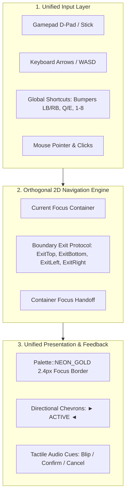
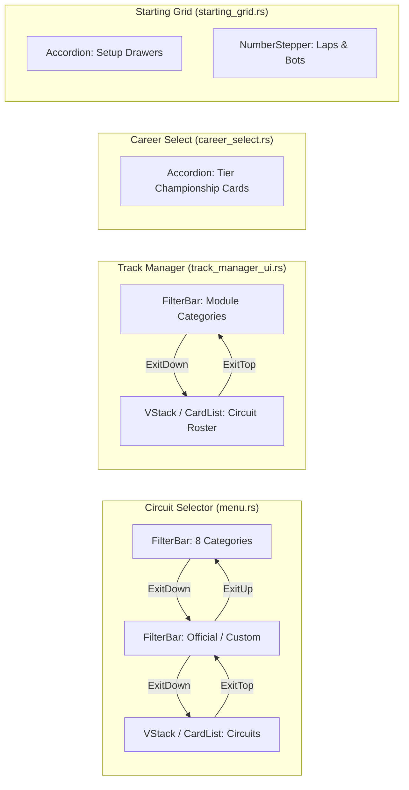

# Feature Spec: Unified UI and UX Consistency Across TDrace and Shared Platform Crate 🕹️

## Executive Summary

As **TdRace** evolved from an arcade prototype into a multi-discipline motorsport ecosystem, user interface elements were authored ad-hoc across separate game states and modules. This organic growth produced noticeable inconsistencies:
1. **Navigation Dead-Ends & Input Asymmetry**: Components such as filter bars, category pills, and catalog tabs were frequently reachable only via mouse input. In the Circuit Selector, keyboard and gamepad focus was initially trapped in the track cards, leaving the category pills and presets/custom tabs unreachable.
2. **Duplicated Layout & Viewport Math**: Windowed card lists, viewport scrolling calculations, and item distribution algorithms were rewritten independently in `menu.rs`, `track_manager_ui.rs`, `garage.rs`, `starting_grid.rs`, and `career_select.rs`.
3. **Inconsistent Visual Focus Languages**: Different screens communicated selection through disparate cues (some used background color shifts, others used subtle borders, and others used varying thickness without consistent active/hover demarcation).
4. **Platform Fragmentation**: Sibling games and tools built on the shared platform crate [`cabinet`](../crates/cabinet) lacked a standard set of gamepad-first, accessible, ergonomic UI components, resulting in duplicate implementations across projects.

This specification elevates [`cabinet::ui`](../crates/cabinet/src/ui/mod.rs) into the canonical design system and reusable component suite for both **TdRace** and any future arcade titles built on the shared engine. It formalizes gamepad/keyboard parity as a non-negotiable core contract, defines the reusable component library, and provides surgical migration blueprints for existing screens.

---

## 🗺️ User Flow & Interface Design

### 1. Core Architectural Principles: Gamepad & Keyboard First

Every component and layout container defined under `cabinet::ui` must satisfy the following platform invariants:



1. **Orthogonal 2D Traversal**:
   - `Up` / `Down` strictly navigates rows, vertical card lists, or container hierarchy (parent to child).
   - `Left` / `Right` strictly navigates horizontal tabs, columns, pill segments, or numeric steppers.
   - Analog stick input passes through a deadzone filter (`0.45`) with edge-trigger debouncing to prevent high-frequency frame skipping.
2. **Boundary Exit Protocol**:
   - Component classes do not hardcode assumptions about surrounding screens. Instead, when navigation reaches an extremity (e.g., pressing `Up` from index `0` of a card list), the component emits an explicit signal ([`NavBoundaryExit::ExitTop`](../crates/cabinet/src/ui/layout.rs), `ExitBottom`, `ExitLeft`, `ExitRight`). The parent screen catches this signal and transfers focus to the sibling container.
3. **Global Shortcuts**:
   - Bumper triggers (`LB` / `RB`), `Q` / `E`, and `[` / `]` are reserved for rapid horizontal tab or category cycling regardless of where deep child focus currently rests.
   - Direct numerical keys (`1`..=`8`) provide instantaneous index jumping.
4. **Visual Focus Standards**:
   - Focused elements must always render with a high-contrast accent border using `Palette::NEON_GOLD`, a minimum border thickness of `2.4px`, and directional chevrons (`► ... ◄`).
5. **Universal Tactile Audio Feedback**:
   - Focus transitions trigger `CabinetAudioSink::play_ui_blip()`.
   - Confirmations trigger `play_ui_confirm()`.
   - Cancellations or backwards escapes trigger `play_ui_cancel()`.

---

### 2. Application Migration Blueprints (TdRace Screens)



#### Circuit Selector (`menu.rs`)
- **Categories**: Migrated from hard-coded pill rendering loop to `FilterBar` with `FilterBarStyle::Pills`. The `All` filter is permanently excluded, strictly enforcing the 8 motorsport categories: `Classic`, `Rally`, `Kart`, `Gt`, `Nascar`, `ExtremeOffroad`, `Autocross`, `Custom`.
- **Catalog Tabs**: Migrated to `FilterBar` (`OFFICIAL` vs `CUSTOM`).
- **Circuits**: Virtualized via `VStack`.
- **Focus Hierarchy**: Seamless 2D traversal:
  - `CategoryFilter` $\xleftrightarrow{\text{Down / Up}}$ `CatalogFilter` $\xleftrightarrow{\text{Down / Up}}$ `LeftTracks`.

#### Track Manager & CAD Studio (`track_manager_ui.rs`)
- **Current State**: Uses custom chip drawing loops around line 440 with manual mouse hit-testing and no keyboard/gamepad focus support for filter switching.
- **Target**: Replace category chips with `FilterBar`. Bind Left/Right to category cycling and Down to the circuit list.

#### Fleet Gallery & Showroom (`garage.rs`)
- **Current State**: Vehicle class selector tabs (Classic, GT, Rally, etc.) drawn using custom glass boxes.
- **Target**: Convert to `FilterBar` with `LB` / `RB` bumper cycling and directional focus handoff to vehicle cards below.

#### Career Championship Selector (`career_select.rs`)
- **Current State**: Lines 553–589 manually compute collapsed (52px) vs expanded (148px) heights and viewport scrolling.
- **Target**: Convert directly to `Accordion<ChampionshipTierData>` with single-expand mode and automatic viewport centering.

#### Starting Grid (`starting_grid.rs`)
- **Current State**: Manual state switching between Setup drawer, Roster slots, and numerical parameter adjustments.
- **Target**: Adopt `Accordion` for tuning parameter drawers and `NumberStepper` for lap count, bot count, and difficulty.

---

## ⚙️ Backend Models & API Endpoints

### 1. Geometry & Layout Containers (`cabinet::ui::layout`)

```rust
pub struct LayoutRect {
    pub x: f32,
    pub y: f32,
    pub w: f32,
    pub h: f32,
}

#[derive(Debug, Clone, Copy, PartialEq, Eq)]
pub enum NavBoundaryExit {
    ExitLeft,
    ExitRight,
    ExitTop,
    ExitBottom,
}

pub struct HStack {
    pub bounds: LayoutRect,
    pub count: usize,
    pub gap: f32,
    pub custom_widths: Option<Vec<f32>>,
}

pub struct VStack {
    pub base_x: f32,
    pub base_y: f32,
    pub width: f32,
    pub item_height: f32,
    pub gap: f32,
}
```

### 2. Segmented Filter Bar Model (`cabinet::ui::filter_bar`)

```rust
#[derive(Debug, Clone, Copy, PartialEq, Eq, Default)]
pub enum FilterBarStyle {
    #[default]
    Pills,
    Shelf,
}

pub struct FilterItem {
    pub id: String,
    pub label: String,
    pub count: Option<usize>,
    pub disabled: bool,
}

#[derive(Debug, Clone, Copy, PartialEq, Eq)]
pub enum FilterBarAction {
    None,
    Changed(usize),
    Confirmed(usize),
    ExitUp,
    ExitDown,
}

pub struct FilterBar {
    pub style: FilterBarStyle,
    pub items: Vec<FilterItem>,
    pub selected_idx: usize,
    pub wrap: bool,
}
```

### 3. Collapsible Drawer Accordion Model (`cabinet::ui::accordion`)

```rust
pub struct AccordionItem<T> {
    pub id: String,
    pub title: String,
    pub subtitle: Option<String>,
    pub badge: Option<String>,
    pub badge_color: Color,
    pub is_expanded: bool,
    pub height_collapsed: f32,
    pub height_expanded: f32,
    pub current_anim_height: f32,
    pub data: T,
}

#[derive(Debug, Clone, Copy, PartialEq, Eq)]
pub enum AccordionNavAction {
    None,
    Changed(usize),
    Toggled(usize, bool),
    Confirmed(usize),
    ExitTop,
    ExitBottom,
}

pub struct Accordion<T> {
    pub items: Vec<AccordionItem<T>>,
    pub selected_idx: usize,
    pub multi_expand: bool,
    pub anim_speed: f32,
    pub viewport_offset_y: f32,
}
```

---

## 🛡️ Security & Role-Based Access Controls (RBAC)

### 1. State Boundary Sanitization
- UI navigation states (`MenuPanelFocus`, active filter indexes, and accordion expansion sets) must be validated against current collection lengths on every frame. If dynamic updates (such as deleting a user track or toggling custom filters) reduce the item count, selection indexes must immediately clamp or wrap without panic or index-out-of-bounds errors.

### 2. Input Event Sandboxing
- All macroquad input checks (`is_key_pressed`, `is_mouse_button_pressed`, `mouse_position`) are wrapped in `catch_unwind` guards via `safe_key_pressed` and `safe_mouse_pos` within `cabinet` components to prevent headless test panics or thread-local uninitialized context failures.

### 3. Modality Licensing & Progression Guard
- Filtering by category does not bypass career or driver tier requirements:
  - If a track or championship requires an unreached license tier, the UI visually highlights the lock state with `Palette::RED` / `Palette::UI_CARD_BORDER` and disables launch actions.

---

## 🧪 Verification & Acceptance Criteria

### Automated Tests
- Command to run cabinet UI unit & integration tests:
  ```bash
  cargo test -p cabinet
  ```
- Command to run app modality flow tests:
  ```bash
  cargo test -p tdrace-app --test modality_flow_tests
  ```
- Command to run all preflight quality checks:
  ```bash
  make preflight
  ```

### Manual Acceptance Criteria (Pseudo-Gherkin)

- **Scenario: 2D Orthogonal Traversal in Circuit Selector**
  - [ ] **Given** the player is in the Circuit Selection menu (`GameState::Menu`) with focus on the first track (`menu_track_idx == 0`)
  - [ ] **When** the player presses `Up` on the keyboard or Gamepad D-pad
  - [ ] **Then** focus moves to the `CatalogFilter` tabs (`OFFICIAL` / `CUSTOM`) with a gold accent border and audio blip
  - [ ] **When** the player presses `Up` again
  - [ ] **Then** focus moves to the `CategoryFilter` pill bar with `► CATEGORY ◄` markers and gold accent border
  - [ ] **When** the player presses `Down` twice
  - [ ] **Then** focus gracefully returns through `CatalogFilter` back to `LeftTracks`

- **Scenario: Strict Category Isolation and Zero All Fallback**
  - [ ] **Given** the Circuit Selector category filter is active
  - [ ] **When** inspecting all selectable categories
  - [ ] **Then** exactly 8 categories are available (`Classic`, `Rally`, `Kart`, `Gt`, `Nascar`, `ExtremeOffroad`, `Autocross`, `Custom`)
  - [ ] **And** no `All` filter option exists
  - [ ] **And** selecting any category strictly presents only tracks registered to that motorsport discipline

- **Scenario: Directional Tab Selection in FilterBar**
  - [ ] **Given** focus is on the Catalog Filter bar
  - [ ] **When** the player presses `Right`
  - [ ] **Then** `Custom` circuits tab is selected
  - [ ] **When** the player presses `Left`
  - [ ] **Then** `Official` presets tab is selected

- **Scenario: Global Bumper and Direct Key Shortcuts**
  - [ ] **Given** focus is anywhere in the Circuit Selector (including inside the track cards)
  - [ ] **When** the player presses Gamepad `RB`, `E`, or `]`
  - [ ] **Then** the category cycles forward to the next motorsport discipline with wrap-around
  - [ ] **When** the player presses number key `4`
  - [ ] **Then** the category jumps immediately to `GT World Challenge`

- **Scenario: Accordion Drawer Expansion and Centering**
  - [ ] **Given** an `Accordion` component populated with championship tier cards in Career Mode
  - [ ] **When** the player navigates to an inactive card and presses `Enter`, `Space`, or Gamepad `A`
  - [ ] **Then** that card expands to its full details height while the previously expanded card collapses
  - [ ] **And** the viewport scrolling smoothly centers the expanded card

- **Scenario: High-Contrast Focus Visuals and Audio Feedback**
  - [ ] **Given** any component rendered via `cabinet::ui`
  - [ ] **When** the component receives focus
  - [ ] **Then** it renders a distinct `Palette::NEON_GOLD` border with thickness $\ge 2.4\text{px}$
  - [ ] **And** a tactile audio blip (`UiMove`) is triggered through `CabinetAudioSink`

---

## 🔗 Traceability & Codebase Mapping

### Created / Modified Platform Files
- `[x]` [`crates/cabinet/src/ui/layout.rs`](../crates/cabinet/src/ui/layout.rs) — Implements `LayoutRect`, `HStack`, `VStack`, and `NavBoundaryExit`.
- `[x]` [`crates/cabinet/src/ui/filter_bar.rs`](../crates/cabinet/src/ui/filter_bar.rs) — Implements `FilterBar`, `FilterItem`, `FilterBarStyle`, and `FilterBarAction`.
- `[x]` [`crates/cabinet/src/ui/accordion.rs`](../crates/cabinet/src/ui/accordion.rs) — Implements `Accordion`, `AccordionItem`, and `AccordionNavAction`.
- `[x]` [`crates/cabinet/src/ui/mod.rs`](../crates/cabinet/src/ui/mod.rs) — Public re-exports for the platform UI module.
- `[x]` [`crates/cabinet/src/lib.rs`](../crates/cabinet/src/lib.rs) — Top-level crate re-exports.

### Application Integration Files
- `[x]` [`crates/tdrace-app/src/game/mod.rs`](../crates/tdrace-app/src/game/mod.rs) — `update_menu` 2D focus traversal, category cycling, directional tabs, and strict filtering.
- `[x]` [`crates/tdrace-app/src/ui/menu.rs`](../crates/tdrace-app/src/ui/menu.rs) — `render_track_select_menu` focus highlights, gold borders, and contextual footer guidance.
- `[x]` [`crates/tdrace-app/tests/modality_flow_tests.rs`](../crates/tdrace-app/tests/modality_flow_tests.rs) — Automated verification of 2D focus navigation, bumper cycling, and strict category circuit isolation.

### Future Target Migration Files
- `[ ]` [`crates/tdrace-app/src/ui/track_manager_ui.rs`](../crates/tdrace-app/src/ui/track_manager_ui.rs) — Migrate category chips to `FilterBar`.
- `[ ]` [`crates/tdrace-app/src/ui/garage.rs`](../crates/tdrace-app/src/ui/garage.rs) — Migrate vehicle category tabs to `FilterBar`.
- `[ ]` [`crates/tdrace-app/src/ui/career_select.rs`](../crates/tdrace-app/src/ui/career_select.rs) — Migrate championship tier cards to `Accordion`.
- `[ ]` [`crates/tdrace-app/src/ui/starting_grid.rs`](../crates/tdrace-app/src/ui/starting_grid.rs) — Migrate setup drawers to `Accordion` and race parameters to `NumberStepper`.
- `[ ]` [`crates/tdrace-app/src/ui/series_editor.rs`](../crates/tdrace-app/src/ui/series_editor.rs) — Migrate rule tabs to `FilterBar` and points/laps to `NumberStepper`.
