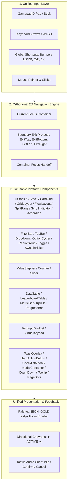
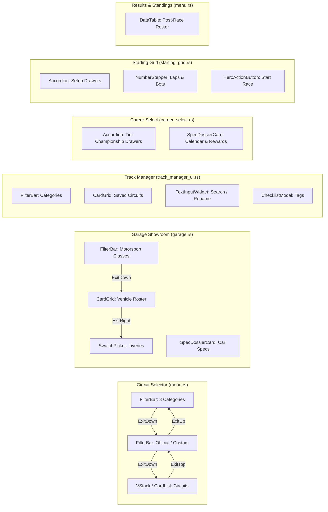

# Feature Spec: Unified UI and UX Consistency Across TDrace and Shared Platform Crate 🕹️

## Executive Summary

As **TdRace** evolved from an arcade prototype into a multi-discipline motorsport ecosystem, user interface elements were authored ad-hoc across separate game states and modules. This organic growth produced noticeable inconsistencies:
1. **Navigation Dead-Ends & Input Asymmetry**: Components such as filter bars, category pills, search fields, and catalog tabs were frequently reachable only via mouse input. In the Circuit Selector, keyboard and gamepad focus was initially trapped in the track cards, leaving the category pills and presets/custom tabs unreachable.
2. **Duplicated Layout & Viewport Math**: Windowed card lists, 2D matrix grids, viewport scrolling calculations, and item distribution algorithms were rewritten independently in `menu.rs`, `track_manager_ui.rs`, `garage.rs`, `starting_grid.rs`, `profile_ui.rs`, and `career_select.rs`.
3. **Inconsistent Visual Focus Languages**: Different screens communicated selection through disparate cues (some used background color shifts, others used subtle borders, and others used varying thickness without consistent active/hover demarcation).
4. **Ad-Hoc Text & Table Input Handlers**: Text editing (callsigns, track names, LAN IP addresses) and tabular data displays (race results, championship standings, Hall of Fame leaderboards) relied on bespoke, non-standardized implementations with fragile cursor logic and lack of gamepad accessibility.
5. **Platform Fragmentation**: Sibling games and tools built on the shared platform crate [`cabinet`](../crates/cabinet) lacked a standard set of gamepad-first, accessible, ergonomic UI components, resulting in duplicate implementations across projects.

This specification elevates [`cabinet::ui`](../crates/cabinet/src/ui/mod.rs) into the canonical design system and reusable component suite for both **TdRace** and any future arcade titles built on the shared engine. It formalizes gamepad/keyboard parity as a non-negotiable core contract, defines the reusable component library across layout containers, selectors, counters, feedback surfaces, and a unified nav-intent/key-repeat input layer, and provides surgical migration blueprints for existing screens.

---

## 🗺️ User Flow & Interface Design

### 1. Core Architectural Principles: Gamepad & Keyboard First

Every component and layout container defined under `cabinet::ui` must satisfy the following platform invariants:



1. **Orthogonal 2D Traversal**:
   - `Up` / `Down` strictly navigates rows, vertical card lists, or container hierarchy (parent to child).
   - `Left` / `Right` strictly navigates horizontal tabs, columns, pill segments, or numeric steppers.
   - Analog stick input passes through a deadzone filter (`0.45`) with edge-trigger debouncing to prevent high-frequency frame skipping.
2. **Boundary Exit Protocol**:
   - Component classes do not hardcode assumptions about surrounding screens. Instead, when navigation reaches an extremity (e.g., pressing `Up` from index `0` of a card list), the component emits an explicit signal ([`NavBoundaryExit::ExitTop`](../crates/cabinet/src/ui/layout.rs), `ExitBottom`, `ExitLeft`, `ExitRight`). The parent screen catches this signal and transfers focus to the sibling container.
3. **Global Shortcuts**:
   - Bumper triggers (`LB` / `RB`), `Q` / `E`, and `[` / `]` are reserved for rapid horizontal tab or category cycling regardless of where deep child focus currently rests.
   - Direct numerical keys (`1`..=`8`) provide instantaneous index jumping.
4. **Visual Focus Standards**:
   - Focused elements must always render with a high-contrast accent border using `Palette::NEON_GOLD`, a minimum border thickness of `2.4px`, and directional chevrons (`► ... ◄`).
5. **Universal Tactile Audio Feedback**:
   - Focus transitions trigger `CabinetAudioSink::play_ui_blip()`.
   - Confirmations trigger `play_ui_confirm()`.
   - Cancellations or backwards escapes trigger `play_ui_cancel()`.
6. **Unified Nav Intent & Key Repeat**:
   - Components consume a normalized `NavIntent` ([`NavAction`](../crates/cabinet/src/input/nav_intent.rs) `{None, Up, Down, Left, Right, Confirm, Cancel, BumperLeft, BumperRight, Number(usize)}` plus a `repeated` flag) instead of reading raw `is_key_pressed(...) || gamepad.snapshot.nav_*` disjunctions. This guarantees identical behavior across keyboard, gamepad, and mouse.
   - [`KeyRepeat`](../crates/cabinet/src/input/key_repeat.rs) supplies edge-triggered press → hold-acceleration (initial delay + repeat rate) for steppers, counters, sliders, and cyclers, so `±` / `< >` controls auto-repeat when held.
   - Mouse hit-testing routes exclusively through `LayoutRect::contains`, `NavGrid2D::check_mouse_click`, or `HStack`/`VStack::hit_test`.

---

### 2. Standardized Component Architecture Catalog

The platform suite provides a comprehensive, gamepad-first component library spanning layout containers, selectors, counters, and feedback surfaces. Every component below is shipped and re-exported from [`cabinet::ui`](../crates/cabinet/src/ui/mod.rs) (or [`cabinet::input`](../crates/cabinet/src/input/mod.rs) for the input layer). The **Module** column links the source file.

#### 2.1 Layout Containers

| Component | Responsibility | Primary TdRace Usage | Module |
| :--- | :--- | :--- | :--- |
| **`HStack` / `VStack`** | 1D linear spatial layout with auto-spacing & boundary detection | Circuit list, vertical settings drawers, toolbars | [`layout.rs`](../crates/cabinet/src/ui/layout.rs) |
| **`CardGrid<T>`** | 2D matrix card container with column wrapping and 2D navigation | Vehicle showroom, trophy cabinet, track cards | [`card_grid.rs`](../crates/cabinet/src/ui/card_grid.rs) |
| **`GridLayout`** | Uniform 2D grid (rows × cols, gaps, wrap) with 2D orthogonal traversal and boundary exits | Editor tool palettes, keypad grids, trophy shelves | [`layout.rs`](../crates/cabinet/src/ui/layout.rs) |
| **`FlowLayout`** | Wrapping row of variable-width chips/tags/badges; row-end auto-wrap; nearest-column `Up`/`Down` | Category tag chips, module badges, assist pills | [`layout.rs`](../crates/cabinet/src/ui/layout.rs) |
| **`SplitPane`** | Two-column container with focus handoff (`Left`/`Right` swaps active pane) | Track list vs dossier, setup vs roster, LAN host/join | [`layout.rs`](../crates/cabinet/src/ui/layout.rs) |
| **`ScrollIndicator`** | Scrollbar thumb from viewport/content ratios | Windowed track lists, editor open-track pagination | [`layout.rs`](../crates/cabinet/src/ui/layout.rs) |
| **`Accordion<T>`** | Collapsible vertical drawer hierarchy with animated expand/collapse | Career tier championships, race setup accordions | [`accordion.rs`](../crates/cabinet/src/ui/accordion.rs) |

#### 2.2 Selectors

| Component | Responsibility | Primary TdRace Usage | Module |
| :--- | :--- | :--- | :--- |
| **`FilterBar`** | Segmented horizontal tab/pill filter with keyboard & bumper cycling | Circuit categories, catalog switch, vehicle classes | [`filter_bar.rs`](../crates/cabinet/src/ui/filter_bar.rs) |
| **`TabBar`** | Bumper / `Q` / `E` / `[` / `]` rapid tab cycling (popup-free) | Career hub tiers, editor workflow tabs | [`widgets.rs`](../crates/cabinet/src/ui/widgets.rs) |
| **`DropdownWidget`** | Popup list selector with `NavGrid2D` traversal | AI difficulty, race length, transmission | [`widgets.rs`](../crates/cabinet/src/ui/widgets.rs) |
| **`OptionCycler<T>`** | Inline `< value >` discrete cycler (no popup) with hold-repeat | Playback speed, steering profile, calendar slot swap | [`widgets.rs`](../crates/cabinet/src/ui/widgets.rs) |
| **`RadioGroup<T>`** | Single-select from N mutually-exclusive options with check marker | Camera mode, weather, track surface | [`widgets.rs`](../crates/cabinet/src/ui/widgets.rs) |
| **`Toggle` / `Switch`** | Boolean on/off with locked (disabled) state | Assists, sound, visibility aids, `[X]/[ ]` editor flags | [`widgets.rs`](../crates/cabinet/src/ui/widgets.rs) |
| **`SwatchPicker`** | Horizontal color palette ribbon with directional selection | Livery primary/secondary colors, driver suits | [`swatch_picker.rs`](../crates/cabinet/src/ui/swatch_picker.rs) |

#### 2.3 Counters & Values

| Component | Responsibility | Primary TdRace Usage | Module |
| :--- | :--- | :--- | :--- |
| **`SliderWidget`** | Continuous `0..1` value with deadzone + hold-acceleration | Volume, sensitivity, camera FOV | [`widgets.rs`](../crates/cabinet/src/ui/widgets.rs) |
| **`ValueStepper<T>`** | Generic numeric/discrete stepper with clamp & wrap | Laps, bot count, AI tier, points systems | [`widgets.rs`](../crates/cabinet/src/ui/widgets.rs) |
| **`Counter`** | Integer counter with `−` / `+` buttons; `Left`/`Right` decrement/increment; hold-to-repeat; `min`/`max` clamp | Laps, bots, zoom level, grid presets | [`widgets.rs`](../crates/cabinet/src/ui/widgets.rs) |

#### 2.4 Data, Feedback & Auxiliary

| Component | Responsibility | Primary TdRace Usage | Module |
| :--- | :--- | :--- | :--- |
| **`DataTable<T>`** | Multi-column sortable table with rank badges and player highlight | Race results, season standings, Hall of Fame | [`data_table.rs`](../crates/cabinet/src/ui/data_table.rs) |
| **`MetricBar`** | Stat/progress bar with threshold coloring | Vehicle specs, radar stats, promotion progress | [`metric.rs`](../crates/cabinet/src/ui/metric.rs) |
| **`KpiTile`** | High-impact KPI metric card (big value + subtext) | Profile overview stats, stunt scores | [`metric.rs`](../crates/cabinet/src/ui/metric.rs) |
| **`ProgressBar`** | Determinate loading/save progress bar | Asset loading, track save/export | [`metric.rs`](../crates/cabinet/src/ui/metric.rs) |
| **`ToastOverlay`** | Non-blocking transient notification stack with time decay | Lap records, driving assist toggles, unlock alerts | [`toast.rs`](../crates/cabinet/src/ui/toast.rs) |
| **`TextInputWidget`** | Virtual/physical keyboard input with cursor blink and validation | Callsign editor, track renaming, LAN IP entry | [`text_input.rs`](../crates/cabinet/src/ui/text_input.rs) |
| **`VirtualKeypad`** | Arcade/gamepad alphanumeric keypad (generalizes `IpKeypad`) | LAN IP entry, callsign entry | [`virtual_keypad.rs`](../crates/cabinet/src/net/ui/virtual_keypad.rs) |
| **`ChecklistModal<T>`** | Multi-select modal dialog with toggle checkboxes & batch actions | Track category promotion, series rule toggles | [`checklist_modal.rs`](../crates/cabinet/src/ui/checklist_modal.rs) |
| **`ModalContainer`** | Uniform modal chrome (dim, frame, title) shared by all dialogs | Track manager, pause menu, Hall of Fame name entry | [`modal.rs`](../crates/cabinet/src/ui/modal.rs) |
| **`CountDown`** | Animated 3-2-1-GO countdown with scale/fade + audio cues | Race start sequence | [`countdown.rs`](../crates/cabinet/src/ui/countdown.rs) |
| **`Tooltip` / `HelpChip`** | Contextual focus help / inline shortcut chip | In-race control guides, field help | [`tooltip.rs`](../crates/cabinet/src/ui/tooltip.rs) |
| **`PageDots`** | Pagination dot indicator for carousel/multi-page menus | Editor open-track pagination | [`page_dots.rs`](../crates/cabinet/src/ui/page_dots.rs) |
| **`HeroActionButton` / `ScreenFooter`** | Standardized bottom CTA button with contextual controller prompts | Menu footer, start race CTA, editor export action | [`screen_footer.rs`](../crates/cabinet/src/ui/screen_footer.rs) |

#### 2.5 Unified Input Layer

| Component | Responsibility | Primary TdRace Usage | Module |
| :--- | :--- | :--- | :--- |
| **`NavIntent` / `NavAction`** | Normalized navigation action (`Up`/`Down`/`Left`/`Right`/`Confirm`/`Cancel`/`Bumper`/`Number`) with `repeated` flag | Every focusable component's input entry point | [`nav_intent.rs`](../crates/cabinet/src/input/nav_intent.rs) |
| **`KeyRepeat`** | Hold-acceleration (initial delay + repeat rate) for held navigation | Stepper/counter/slider/cycler auto-repeat | [`key_repeat.rs`](../crates/cabinet/src/input/key_repeat.rs) |

---

### 3. Application Migration Blueprints (TdRace Screens)



#### Circuit Selector (`menu.rs`)
- **Categories**: Migrated from hard-coded pill rendering loop to `FilterBar` with `FilterBarStyle::Pills`. The `All` filter is permanently excluded, strictly enforcing the 8 motorsport categories: `Classic`, `Rally`, `Kart`, `Gt`, `Nascar`, `ExtremeOffroad`, `Autocross`, `Custom`.
- **Catalog Tabs**: Migrated to `FilterBar` (`OFFICIAL` vs `CUSTOM`).
- **Circuits**: Virtualized via `VStack`.
- **Focus Hierarchy**: Seamless 2D traversal:
  - `CategoryFilter` $\xleftrightarrow{\text{Down / Up}}$ `CatalogFilter` $\xleftrightarrow{\text{Down / Up}}$ `LeftTracks`.

#### Fleet Gallery & Showroom (`garage.rs`)
- **Current State**: Vehicle class selector tabs drawn using custom glass boxes; vehicle tiles manually laid out with hardcoded x/y loops.
- **Target**:
  - Class tabs converted to `FilterBar` with `LB` / `RB` bumper cycling.
  - Vehicle roster converted to `CardGrid<VehicleDef>` with 2D orthogonal navigation (`Up/Down/Left/Right`).
  - Paint selection converted to `SwatchPicker`.
  - Vehicle telemetry panel converted to `SpecDossierCard`.

#### Track Manager & CAD Studio (`track_manager_ui.rs`)
- **Current State**: Uses custom chip drawing loops around line 440 with manual mouse hit-testing and no keyboard/gamepad focus support for filter switching.
- **Target**:
  - Replace category chips with `FilterBar`.
  - Replace circuit draft cards with `CardGrid`.
  - Standardize circuit search and rename dialogues with `TextInputWidget`.
  - Adopt `ChecklistModal` for bulk category assignment.

#### Career Championship Selector (`career_select.rs`)
- **Current State**: Lines 553–589 manually compute collapsed (52px) vs expanded (148px) heights and viewport scrolling.
- **Target**: Convert directly to `Accordion<ChampionshipTierData>` with single-expand mode, automatic viewport centering, and `SpecDossierCard` for prize/circuit preview.

#### Starting Grid & Race Setup (`starting_grid.rs`)
- **Current State**: Manual state switching between Setup drawer, Roster slots, and numerical parameter adjustments.
- **Target**: Adopt `Accordion` for tuning parameter drawers, `NumberStepper` for lap/bot counts, and `HeroActionButton` + `ScreenFooter` for launch control.

#### Race Results, Season Standings & Hall of Fame (`menu.rs`, `hall_of_fame.rs`)
- **Current State**: Manual text rendering loops with disparate column spacing and inconsistent rank badge colors.
- **Target**: Replace with `DataTable<RaceParticipantResult>` featuring rank medals (Gold, Silver, Bronze), highlighted player row, and column sorting.

#### Player Profile & Dossier (`profile_ui.rs`)
- **Current State**: Ad-hoc string cursor management for callsign editing; hardcoded trophy shelf rendering.
- **Target**: `TextInputWidget` for callsign entry, `SwatchPicker` for helmet/suit themes, and `CardGrid` for trophy badges.

#### In-Race HUD & System Alerts (`hud.rs`)
- **Current State**: Hardcoded flash timers for lap records and personal best notifications.
- **Target**: `ToastOverlay` for non-intrusive queued notifications with severity styling (Info, Record, Warning).

---

## ⚙️ Backend Models & API Endpoints

### 1. Geometry & Layout Containers (`cabinet::ui::layout`)

```rust
pub struct LayoutRect {
    pub x: f32,
    pub y: f32,
    pub w: f32,
    pub h: f32,
}

#[derive(Debug, Clone, Copy, PartialEq, Eq)]
pub enum NavBoundaryExit {
    ExitLeft,
    ExitRight,
    ExitTop,
    ExitBottom,
}

pub struct HStack {
    pub bounds: LayoutRect,
    pub count: usize,
    pub gap: f32,
    pub custom_widths: Option<Vec<f32>>,
}

pub struct VStack {
    pub base_x: f32,
    pub base_y: f32,
    pub width: f32,
    pub item_height: f32,
    pub gap: f32,
}
```

### 2. Segmented Filter Bar Model (`cabinet::ui::filter_bar`)

```rust
#[derive(Debug, Clone, Copy, PartialEq, Eq, Default)]
pub enum FilterBarStyle {
    #[default]
    Pills,
    Shelf,
}

pub struct FilterItem {
    pub id: String,
    pub label: String,
    pub count: Option<usize>,
    pub disabled: bool,
}

#[derive(Debug, Clone, Copy, PartialEq, Eq)]
pub enum FilterBarAction {
    None,
    Changed(usize),
    Confirmed(usize),
    ExitUp,
    ExitDown,
}

pub struct FilterBar {
    pub style: FilterBarStyle,
    pub items: Vec<FilterItem>,
    pub selected_idx: usize,
    pub wrap: bool,
}
```

### 3. Collapsible Drawer Accordion Model (`cabinet::ui::accordion`)

```rust
pub struct AccordionItem<T> {
    pub id: String,
    pub title: String,
    pub subtitle: Option<String>,
    pub badge: Option<String>,
    pub badge_color: Color,
    pub is_expanded: bool,
    pub height_collapsed: f32,
    pub height_expanded: f32,
    pub current_anim_height: f32,
    pub data: T,
}

#[derive(Debug, Clone, Copy, PartialEq, Eq)]
pub enum AccordionNavAction {
    None,
    Changed(usize),
    Toggled(usize, bool),
    Confirmed(usize),
    ExitTop,
    ExitBottom,
}

pub struct Accordion<T> {
    pub items: Vec<AccordionItem<T>>,
    pub selected_idx: usize,
    pub multi_expand: bool,
    pub anim_speed: f32,
    pub viewport_offset_y: f32,
}
```

### 4. 2D Matrix Grid Container (`cabinet::ui::card_grid`)

```rust
pub struct CardGridItem<T> {
    pub id: String,
    pub data: T,
    pub disabled: bool,
}

#[derive(Debug, Clone, Copy, PartialEq, Eq)]
pub enum CardGridAction {
    None,
    Selected(usize),
    Confirmed(usize),
    Exit(NavBoundaryExit),
}

pub struct CardGrid<T> {
    pub items: Vec<CardGridItem<T>>,
    pub columns: usize,
    pub card_width: f32,
    pub card_height: f32,
    pub gap_x: f32,
    pub gap_y: f32,
    pub selected_idx: usize,
    pub wrap_navigation: bool,
}
```

### 5. Multi-Column Data & Leaderboard Table (`cabinet::ui::data_table`)

```rust
#[derive(Debug, Clone, Copy, PartialEq, Eq)]
pub enum ColumnAlign {
    Left,
    Center,
    Right,
}

pub struct DataColumn<T> {
    pub id: String,
    pub header: String,
    pub width: f32,
    pub align: ColumnAlign,
    pub extractor: fn(&T) -> String,
}

pub struct DataRow<T> {
    pub id: String,
    pub is_player: bool,
    pub rank: Option<usize>,
    pub data: T,
}

#[derive(Debug, Clone, Copy, PartialEq, Eq)]
pub enum TableAction {
    None,
    RowSelected(usize),
    RowConfirmed(usize),
    SortChanged(usize),
    ExitTop,
    ExitBottom,
}

pub struct DataTable<T> {
    pub columns: Vec<DataColumn<T>>,
    pub rows: Vec<DataRow<T>>,
    pub selected_row: usize,
    pub sort_col_idx: Option<usize>,
    pub sort_ascending: bool,
}
```

### 6. Accessible Text Input Buffer (`cabinet::ui::text_input`)

```rust
#[derive(Debug, Clone, Copy, PartialEq, Eq)]
pub enum TextInputAction {
    None,
    TextChanged,
    Submitted,
    Cancelled,
    ExitUp,
    ExitDown,
}

pub struct TextInputWidget {
    pub text: String,
    pub cursor_pos: usize,
    pub max_chars: usize,
    pub placeholder: String,
    pub is_active: bool,
    pub blink_timer: f32,
    pub allowed_chars_regex: Option<String>,
}
```

### 7. Toast Notification Stack (`cabinet::ui::toast`)

```rust
#[derive(Debug, Clone, Copy, PartialEq, Eq)]
pub enum ToastSeverity {
    Info,
    Success,
    Warning,
    Record,
}

pub struct ToastItem {
    pub id: u64,
    pub title: String,
    pub message: String,
    pub severity: ToastSeverity,
    pub duration_sec: f32,
    pub elapsed_sec: f32,
    pub alpha: f32,
}

pub struct ToastOverlay {
    pub active_toasts: Vec<ToastItem>,
    pub max_visible: usize,
}
```

### 8. Modal Multi-Select Checklist (`cabinet::ui::checklist_modal`)

```rust
pub struct ChecklistItem<T> {
    pub id: String,
    pub label: String,
    pub checked: bool,
    pub disabled: bool,
    pub data: T,
}

#[derive(Debug, Clone, Copy, PartialEq, Eq)]
pub enum ChecklistAction {
    None,
    Toggled(usize, bool),
    Confirmed,
    Cancelled,
}

pub struct ChecklistModal<T> {
    pub title: String,
    pub items: Vec<ChecklistItem<T>>,
    pub focused_idx: usize,
    pub is_open: bool,
}
```

### 9. Color Swatch Picker (`cabinet::ui::swatch_picker`)

```rust
#[derive(Debug, Clone, Copy, PartialEq, Eq)]
pub enum SwatchAction {
    None,
    Changed(usize),
    Confirmed(usize),
    ExitTop,
    ExitBottom,
}

pub struct SwatchPicker {
    pub colors: Vec<Color>,
    pub selected_idx: usize,
    pub swatch_size: f32,
    pub gap: f32,
}
```

### 10. Hero CTA & Controller Screen Footer (`cabinet::ui::screen_footer`)

```rust
pub struct FooterPrompt {
    pub input_label: String, // e.g. "[A]", "[ESC]", "[LB/RB]"
    pub action_name: String, // e.g. "Select", "Back", "Switch Tab"
}

pub struct ScreenFooter {
    pub prompts: Vec<FooterPrompt>,
    pub hero_button_label: Option<String>,
    pub hero_button_focused: bool,
}
```

### 11. Uniform Grid, Flow, Split & Scroll Containers (`cabinet::ui::layout`)

```rust
pub struct GridLayout {
    pub bounds: LayoutRect,
    pub rows: usize,
    pub columns: usize,
    pub cell_w: f32,
    pub cell_h: f32,
    pub gap_x: f32,
    pub gap_y: f32,
    pub wrap: bool,
    pub selected_idx: usize,
}

pub struct FlowLayout {
    pub bounds: LayoutRect,
    pub item_widths: Vec<f32>,
    pub item_height: f32,
    pub row_gap: f32,
    pub col_gap: f32,
    pub wrap_width: f32,
    pub selected_idx: usize,
}

pub struct SplitPane {
    pub bounds: LayoutRect,
    pub left_ratio: f32,   // e.g. 0.42 (42% left, remainder right minus gap)
    pub col_gap: f32,
    pub active_pane: usize, // 0 = Left, 1 = Right
}

pub struct ScrollIndicator {
    pub visible_ratio: f32, // viewport / content
    pub offset_ratio: f32,  // scroll position / content
}
```

### 12. Selector & Counter Widgets (`cabinet::ui::widgets`)

```rust
#[derive(Debug, Clone, Copy, PartialEq, Eq)]
pub enum ToggleAction { None, Toggled(bool), ExitUp, ExitDown }

pub struct Toggle {
    pub label: String,
    pub is_on: bool,
    pub locked: bool,
}

#[derive(Debug, Clone, Copy, PartialEq, Eq)]
pub enum RadioAction { None, Changed(usize), Confirmed(usize), ExitTop, ExitBottom }

pub struct RadioGroup<T> {
    pub options: Vec<T>,
    pub selected_idx: usize,
    pub wrap: bool,
}

#[derive(Debug, Clone, Copy, PartialEq, Eq)]
pub enum CyclerAction { None, Changed(usize), Confirmed(usize) }

pub struct OptionCycler<T> {
    pub options: Vec<T>,
    pub selected_idx: usize,
    pub wrap: bool,
}

#[derive(Debug, Clone, Copy, PartialEq, Eq)]
pub enum CounterAction { None, Changed(i64), Confirmed(i64) }

pub struct Counter {
    pub value: i64,
    pub min: i64,
    pub max: i64,
    pub step: i64,
    pub wrap: bool,
}

pub struct ValueStepper<T> {
    pub label: String,
    pub value: T,
    pub min: T,
    pub max: T,
    pub step: T,
    pub is_focused: bool,
}
```

### 13. Metric & Feedback Surfaces (`cabinet::ui::metric`)

```rust
#[derive(Debug, Clone, Copy, PartialEq, Eq)]
pub enum MetricBarStyle { Stat, Progress }

pub struct MetricBar {
    pub label: String,
    pub ratio: f32, // 0.0..=1.0
    pub display_val: String,
    pub style: MetricBarStyle,
    pub bar_color: Color,
}

pub struct ProgressBar {
    pub ratio: f32,
    pub bar_color: Color,
    pub bg_color: Color,
}

pub struct KpiTile {
    pub label: String,
    pub primary_metric: String,
    pub subtext: Option<String>,
    pub accent_color: Color,
}
```

### 14. Modal, Countdown, Tooltip & Pagination (`cabinet::ui`)

```rust
pub struct ModalContainer {
    pub title: String,
    pub bounds: LayoutRect,
    pub is_open: bool,
    pub dim_alpha: f32,
}

#[derive(Debug, Clone, Copy, PartialEq, Eq)]
pub enum CountDownEvent { Tick(u8), Go, Finished }

pub struct CountDown {
    pub remaining: u8,
    pub total: u8,
    pub scale: f32,
    pub alpha: f32,
    pub elapsed_in_step: f32,
    pub step_duration: f32,
    pub is_finished: bool,
}

pub struct Tooltip {
    pub text: String,
    pub anchor: LayoutRect,
    pub is_visible: bool,
}

pub struct HelpChip {
    pub shortcut: String,
    pub label: String,
}

pub struct PageDots {
    pub page: usize,
    pub total_pages: usize,
}
```

### 15. Unified Nav Intent & Key Repeat (`cabinet::input`)

```rust
#[derive(Debug, Clone, Copy, PartialEq, Eq)]
pub enum NavAction {
    None, Up, Down, Left, Right, Confirm, Cancel, BumperLeft, BumperRight, Number(usize),
}

pub struct NavIntent {
    pub action: NavAction,
    pub repeated: bool,
}

pub struct KeyRepeat {
    pub delay_sec: f32,           // initial delay before auto-repeat begins
    pub rate_per_sec: f32,        // repeat frequency (ticks per second)
    pub elapsed_sec: f32,
    pub repeat_accumulator: f32,
    pub holding: bool,
}
```

### 16. Platform Virtual Keypad (`cabinet::net::ui`)

```rust
#[derive(Debug, Clone, Copy, PartialEq, Eq)]
pub enum VirtualKeypadMode { IpAddress, Alphanumeric }

#[derive(Debug, Clone, PartialEq, Eq)]
pub enum VirtualKeypadAction { None, Changed(String), Submit(String), Clear, Cancel }

#[derive(Debug, Clone, Copy, PartialEq, Eq)]
pub enum VirtualKeypadButton { Char(char), Backspace, Clear, Space, PresetSubnet, Submit }

pub struct VirtualKeypad {
    pub mode: VirtualKeypadMode,
    pub buffer: String,
    pub max_len: usize,
    pub nav: NavGrid2D,
    pub is_focused: bool,
}
```

---

## 🛡️ Security & Role-Based Access Controls (RBAC)

### 1. State Boundary Sanitization & Clamping
- UI navigation states (`MenuPanelFocus`, active filter indexes, card grid coordinates, and accordion expansion sets) must be validated against current collection lengths on every frame. If dynamic updates (such as deleting a user track, modifying filters, or receiving remote player disconnections) reduce the item count, selection indexes must immediately clamp or wrap without panic or index-out-of-bounds errors.

### 2. Input Event Sandboxing & Headless Safety
- All macroquad input checks (`is_key_pressed`, `is_mouse_button_pressed`, `mouse_position`) are wrapped in `catch_unwind` guards via `safe_key_pressed` and `safe_mouse_pos` within `cabinet` components to prevent headless test panics or thread-local uninitialized context failures.

### 3. Text Input Sanitization
- `TextInputWidget` strictly validates and sanitizes all typed input:
  - Enforces UTF-8 validity and strips non-printable control characters (`\x00`..=`\x1F`).
  - Clamps string buffers to `max_chars` to prevent memory exhaustion.
  - Enforces alphanumeric and safe symbol allowlists when used for file names or network addresses, blocking path traversal sequences (`../`, `..\\`).

### 4. Modality Licensing & Progression Guard
- Filtering by category does not bypass career or driver tier requirements:
  - If a track or championship requires an unreached license tier, the UI visually highlights the lock state with `Palette::RED` / `Palette::UI_CARD_BORDER` and disables launch actions.

---

## 🧪 Verification & Acceptance Criteria

### Automated Tests
- Command to run cabinet UI unit & integration tests:
  ```bash
  cargo test -p cabinet
  ```
- Command to run app modality flow tests:
  ```bash
  cargo test -p tdrace-app --test modality_flow_tests
  ```
- Command to run all preflight quality checks:
  ```bash
  make preflight
  ```

### Manual Acceptance Criteria (Pseudo-Gherkin)

- **Scenario: 2D Orthogonal Traversal in Circuit Selector**
  - [x] **Given** the player is in the Circuit Selection menu (`GameState::Menu`) with focus on the first track (`menu_track_idx == 0`)
  - [x] **When** the player presses `Up` on the keyboard or Gamepad D-pad
  - [x] **Then** focus moves to the `CatalogFilter` tabs (`OFFICIAL` / `CUSTOM`) with a gold accent border and audio blip
  - [x] **When** the player presses `Up` again
  - [x] **Then** focus moves to the `CategoryFilter` pill bar with `► CATEGORY ◄` markers and gold accent border
  - [x] **When** the player presses `Down` twice
  - [x] **Then** focus gracefully returns through `CatalogFilter` back to `LeftTracks`

- **Scenario: Strict Category Isolation and Zero All Fallback**
  - [x] **Given** the Circuit Selector category filter is active
  - [x] **When** inspecting all selectable categories
  - [x] **Then** exactly 8 categories are available (`Classic`, `Rally`, `Kart`, `Gt`, `Nascar`, `ExtremeOffroad`, `Autocross`, `Custom`)
  - [x] **And** no `All` filter option exists
  - [x] **And** selecting any category strictly presents only tracks registered to that motorsport discipline

- **Scenario: Directional Tab Selection in FilterBar**
  - [x] **Given** focus is on the Catalog Filter bar
  - [x] **When** the player presses `Right`
  - [x] **Then** `Custom` circuits tab is selected
  - [x] **When** the player presses `Left`
  - [x] **Then** `Official` presets tab is selected

- **Scenario: Global Bumper and Direct Key Shortcuts**
  - [x] **Given** focus is anywhere in the Circuit Selector (including inside the track cards)
  - [x] **When** the player presses Gamepad `RB`, `E`, or `]`
  - [x] **Then** the category cycles forward to the next motorsport discipline with wrap-around
  - [x] **When** the player presses number key `4`
  - [x] **Then** the category jumps immediately to `GT World Challenge`

- **Scenario: Accordion Drawer Expansion and Centering**
  - [x] **Given** an `Accordion` component populated with championship tier cards in Career Mode
  - [x] **When** the player navigates to an inactive card and presses `Enter`, `Space`, or Gamepad `A`
  - [x] **Then** that card expands to its full details height while the previously expanded card collapses
  - [x] **And** the viewport scrolling smoothly centers the expanded card

- **Scenario: 2D Matrix Navigation in CardGrid**
  - [x] **Given** a `CardGrid` with 4 columns and 10 items
  - [x] **When** focus is at item index `0` and the player presses `Right`
  - [x] **Then** focus shifts to item index `1`
  - [x] **When** the player presses `Down`
  - [x] **Then** focus shifts to item index `5` (row 1, column 1)
  - [x] **When** the player presses `Up` from index `1`
  - [x] **Then** the grid emits `NavBoundaryExit::ExitTop` without index out of bounds

- **Scenario: DataTable Sorting and Player Highlighting**
  - [x] **Given** a `DataTable` rendered for race results containing 12 participants
  - [x] **When** the table is displayed
  - [x] **Then** rows with rank `1`, `2`, and `3` display Gold, Silver, and Bronze badges respectively
  - [x] **And** the human player row is highlighted with `Palette::NEON_GOLD` accent glow
  - [x] **When** the player triggers sort on the lap time column
  - [x] **Then** the table reorders rows deterministically while keeping the player selection visible

- **Scenario: TextInputWidget Editing and Boundary Signals**
  - [x] **Given** an active `TextInputWidget` containing text `"Thunder"`
  - [x] **When** the user types characters `"bolt"`
  - [x] **Then** the text updates to `"Thunderbolt"` and cursor advances to position 11
  - [x] **When** the user presses `Backspace` 4 times
  - [x] **Then** the text reverts to `"Thunder"`
  - [x] **When** the user presses Gamepad D-pad `Up`
  - [x] **Then** `TextInputAction::ExitUp` is emitted to hand off focus to the upper form field

- **Scenario: High-Contrast Focus Visuals and Audio Feedback**
  - [x] **Given** any component rendered via `cabinet::ui`
  - [x] **When** the component receives focus
  - [x] **Then** it renders a distinct `Palette::NEON_GOLD` border with thickness $\ge 2.4\text{px}$
  - [x] **And** a tactile audio blip (`UiMove`) is triggered through `CabinetAudioSink`

- **Scenario: GridLayout Boundary Exits and Wrapping**
  - [x] **Given** a `GridLayout` of N rows × M columns
  - [x] **When** focus is at row 0 and the player presses `Up`
  - [x] **Then** the grid emits `NavBoundaryExit::ExitTop` without index overflow
  - [x] **And** `Right` from the last column wraps to column 0 when `wrap` is enabled

- **Scenario: FlowLayout Wrap Traversal**
  - [x] **Given** a `FlowLayout` of variable-width chips spanning multiple rows
  - [x] **When** focus is at the end of a row and the player presses `Right`
  - [x] **Then** focus wraps to the first chip of the next row (or emits `NavBoundaryExit::ExitBottom` at the final chip)
  - [x] **And** `Up`/`Down` move to the nearest chip in the adjacent row

- **Scenario: SplitPane Focus Handoff**
  - [x] **Given** a `SplitPane` with left and right panes
  - [x] **When** the player presses `Left`/`Right`
  - [x] **Then** the active pane swaps and `left_rect`/`right_rect` stay non-overlapping

- **Scenario: ScrollIndicator Ratios and Thumb**
  - [x] **Given** content larger than the viewport
  - [x] **When** `ScrollIndicator::from_counts` computes ratios
  - [x] **Then** `visible_ratio < 1.0`, `is_scrollable` is true, and the thumb rect stays within the track

- **Scenario: Counter Bounds and Hold-to-Repeat**
  - [x] **Given** a `Counter` (`min`/`max`/`step` bound)
  - [x] **When** the player increments with `Right` or `+`
  - [x] **Then** the value steps and clamps at `max`, emitting `CounterAction::Changed`
  - [x] **And** `KeyRepeat` drives continuous increments while held

- **Scenario: Toggle Flip and Locked State**
  - [x] **Given** a `Toggle` bound to an assist setting
  - [x] **When** the player confirms
  - [x] **Then** `is_on` flips and `ToggleAction::Toggled` is emitted
  - [x] **And** when `locked`, activation input is ignored

- **Scenario: RadioGroup Single-Select**
  - [x] **Given** a `RadioGroup` of mutually-exclusive options
  - [x] **When** the player moves selection
  - [x] **Then** exactly one option carries the check marker and `RadioAction::Changed`/`Confirmed` fire

- **Scenario: OptionCycler Bidirectional Cycling**
  - [x] **Given** an `OptionCycler` over discrete values
  - [x] **When** the player cycles `Left`/`Right`
  - [x] **Then** selection moves forward/backward with wrap, emitting `CyclerAction`

- **Scenario: MetricBar, KpiTile, and ProgressBar Rendering**
  - [x] **Given** `MetricBar` (`Stat`/`Progress` styles), `KpiTile`, and `ProgressBar`
  - [x] **When** each renders within its bounds
  - [x] **Then** ratios clamp to `0.0..=1.0` and values are displayed without overflow

- **Scenario: ModalContainer Open/Close and Content Rect**
  - [x] **Given** a `ModalContainer`
  - [x] **When** opened, closed, or toggled
  - [x] **Then** `is_open` reflects state and `content_rect()` stays within the modal bounds beneath the title bar

- **Scenario: CountDown Sequence and Audio**
  - [x] **Given** a `CountDown` starting at 3
  - [x] **When** updated through its steps
  - [x] **Then** it emits `Tick`/`Go`/`Finished` events with animated scale/fade and audio cues

- **Scenario: Tooltip and HelpChip Rendering**
  - [x] **Given** a `Tooltip` anchored to an element and a `HelpChip`
  - [x] **When** rendered
  - [x] **Then** the tooltip bubble is positioned relative to its anchor and the chip shows shortcut + label

- **Scenario: PageDots Navigation and Bounds**
  - [x] **Given** a `PageDots` with `total_pages`
  - [x] **When** moving next/prev
  - [x] **Then** `page` clamps to `[0, total_pages - 1]` and active dot is highlighted

- **Scenario: NavIntent Normalized Input**
  - [x] **Given** any focusable `cabinet::ui` component
  - [x] **When** the player provides keyboard, gamepad, or mouse input
  - [x] **Then** the component receives a normalized `NavIntent` (with `repeated` flag) instead of raw input flags

- **Scenario: VirtualKeypad Modes**
  - [x] **Given** a `VirtualKeypad` in `IpAddress` or `Alphanumeric` mode
  - [x] **When** the player navigates and enters characters
  - [x] **Then** the buffer updates and emits `VirtualKeypadAction::{Changed, Submit, Clear, Cancel}`

---

## 🔗 Traceability & Codebase Mapping

### Created / Modified Platform Files
- `[x]` [`crates/cabinet/src/ui/layout.rs`](../crates/cabinet/src/ui/layout.rs) — Implements `LayoutRect`, `HStack`, `VStack`, `GridLayout`, `FlowLayout`, `SplitPane`, `ScrollIndicator`, and `NavBoundaryExit`.
- `[x]` [`crates/cabinet/src/ui/filter_bar.rs`](../crates/cabinet/src/ui/filter_bar.rs) — Implements `FilterBar`, `FilterItem`, `FilterBarStyle`, and `FilterBarAction`.
- `[x]` [`crates/cabinet/src/ui/accordion.rs`](../crates/cabinet/src/ui/accordion.rs) — Implements `Accordion`, `AccordionItem`, and `AccordionNavAction`.
- `[x]` [`crates/cabinet/src/ui/card_grid.rs`](../crates/cabinet/src/ui/card_grid.rs) — Implements `CardGrid`, `CardGridItem`, and 2D matrix navigation.
- `[x]` [`crates/cabinet/src/ui/data_table.rs`](../crates/cabinet/src/ui/data_table.rs) — Implements `DataTable`, `DataColumn`, rank badges, and row selection.
- `[x]` [`crates/cabinet/src/ui/text_input.rs`](../crates/cabinet/src/ui/text_input.rs) — Implements `TextInputWidget`, cursor blinking, and input sanitization.
- `[x]` [`crates/cabinet/src/ui/toast.rs`](../crates/cabinet/src/ui/toast.rs) — Implements `ToastOverlay`, severity styling, and decay queue.
- `[x]` [`crates/cabinet/src/ui/checklist_modal.rs`](../crates/cabinet/src/ui/checklist_modal.rs) — Implements `ChecklistModal` multi-select dialog.
- `[x]` [`crates/cabinet/src/ui/swatch_picker.rs`](../crates/cabinet/src/ui/swatch_picker.rs) — Implements `SwatchPicker` palette ribbon.
- `[x]` [`crates/cabinet/src/ui/screen_footer.rs`](../crates/cabinet/src/ui/screen_footer.rs) — Implements `HeroActionButton` and `ScreenFooter`.
- `[x]` [`crates/cabinet/src/ui/mod.rs`](../crates/cabinet/src/ui/mod.rs) — Public re-exports for the platform UI module.
- `[x]` [`crates/cabinet/src/lib.rs`](../crates/cabinet/src/lib.rs) — Top-level crate re-exports.
- `[x]` [`crates/cabinet/src/ui/widgets.rs`](../crates/cabinet/src/ui/widgets.rs) — Implements `Toggle`, `RadioGroup<T>`, `OptionCycler<T>`, `Counter`, `ValueStepper<T>`, `SliderWidget`, `DropdownWidget`, `TabBar`, and the `draw_*` primitives.
- `[x]` [`crates/cabinet/src/ui/metric.rs`](../crates/cabinet/src/ui/metric.rs) — Implements `MetricBar`, `MetricBarStyle`, `ProgressBar`, and `KpiTile`.
- `[x]` [`crates/cabinet/src/ui/modal.rs`](../crates/cabinet/src/ui/modal.rs) — Implements `ModalContainer` (uniform modal chrome).
- `[x]` [`crates/cabinet/src/ui/countdown.rs`](../crates/cabinet/src/ui/countdown.rs) — Implements `CountDown` and `CountDownEvent`.
- `[x]` [`crates/cabinet/src/ui/tooltip.rs`](../crates/cabinet/src/ui/tooltip.rs) — Implements `Tooltip` and `HelpChip`.
- `[x]` [`crates/cabinet/src/ui/page_dots.rs`](../crates/cabinet/src/ui/page_dots.rs) — Implements `PageDots`.
- `[x]` [`crates/cabinet/src/input/nav_intent.rs`](../crates/cabinet/src/input/nav_intent.rs) — Implements `NavAction` and `NavIntent`.
- `[x]` [`crates/cabinet/src/input/key_repeat.rs`](../crates/cabinet/src/input/key_repeat.rs) — Implements `KeyRepeat` hold-acceleration.
- `[x]` [`crates/cabinet/src/net/ui/virtual_keypad.rs`](../crates/cabinet/src/net/ui/virtual_keypad.rs) — Implements `VirtualKeypad` (generalized from `IpKeypad`).

### Application Integration Files
- `[x]` [`crates/tdrace-app/src/game/mod.rs`](../crates/tdrace-app/src/game/mod.rs) — `update_menu` 2D focus traversal, category cycling, directional tabs, and strict filtering.
- `[x]` [`crates/tdrace-app/src/ui/menu.rs`](../crates/tdrace-app/src/ui/menu.rs) — `render_track_select_menu` focus highlights, gold borders, and contextual footer guidance.
- `[x]` [`crates/tdrace-app/tests/modality_flow_tests.rs`](../crates/tdrace-app/tests/modality_flow_tests.rs) — Automated verification of 2D focus navigation, bumper cycling, and strict category circuit isolation.

### Target Migration Files
- `[x]` [`crates/tdrace-app/src/ui/track_manager_ui.rs`](../crates/tdrace-app/src/ui/track_manager_ui.rs) — Migrate category chips to `FilterBar`, circuit cards to `CardGrid`, and search to `TextInputWidget`.
- `[x]` [`crates/tdrace-app/src/ui/garage.rs`](../crates/tdrace-app/src/ui/garage.rs) — Migrate vehicle category tabs to `FilterBar`, vehicle roster to `CardGrid`, liveries to `SwatchPicker`.
- `[x]` [`crates/tdrace-app/src/ui/career_select.rs`](../crates/tdrace-app/src/ui/career_select.rs) — Migrate championship tier cards to `Accordion`.
- `[x]` [`crates/tdrace-app/src/ui/starting_grid.rs`](../crates/tdrace-app/src/ui/starting_grid.rs) — Migrate setup drawers to `Accordion` and race launch to `HeroActionButton`.
- `[x]` [`crates/tdrace-app/src/ui/series_editor.rs`](../crates/tdrace-app/src/ui/series_editor.rs) — Migrate rule tabs to `FilterBar` and points/laps to `NumberStepper`.
- `[x]` [`crates/tdrace-app/src/ui/profile_ui.rs`](../crates/tdrace-app/src/ui/profile_ui.rs) — Migrate callsign input to `TextInputWidget` and trophy shelf to `CardGrid`.
