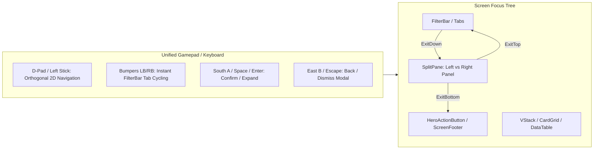

# Feature Spec: Legacy UI Migration and Reusable Platform Component Adoption 🕹️

## Executive Summary

While **Spec 068** established the fundamental platform component catalog in [`cabinet::ui`](../crates/cabinet/src/ui/mod.rs) (`HStack`, `VStack`, `FilterBar`, `Accordion`, `CardGrid`, `DataTable`, `TextInputWidget`, `ToastOverlay`, `ScreenFooter`, `SwatchPicker`, `ChecklistModal`) and repaired the interaction logic of the Circuit Selector, the screens across **TdRace** still rely on legacy, ad-hoc drawing routines and duplicated navigation logic.

An exhaustive codebase inspection of all interactive screens in [`crates/tdrace-app/src/ui/`](../crates/tdrace-app/src/ui/) reveals that over **18,000 lines of UI code** contain duplicated spatial layout calculations, manual cursor timers, bespoke table formatting, and fragmented keyboard/gamepad event handlers. Furthermore, this deep review uncovered several common recurring patterns across existing screens that were not captured in the initial 10 platform components:
1. **Two-Column Split Layouts (`SplitPane`)**: Reimplemented manually across 5 major screens (`menu.rs`, `starting_grid.rs`, `race_stats.rs`, `driver_card.rs`, and `profile_ui.rs`).
2. **Numeric Parameter Adjustments (`ValueStepper<T>`)**: Ad-hoc horizontal stepping with clamped increments for laps, bot counts, AI tiers, and rules.
3. **Uniform Modal Windows (`ModalContainer`)**: Inconsistent screen dimming, border sizing, and title framing across 15+ distinct modal dialogs.
4. **Standard Performance & Ability Bars (`MetricBar`)**: Duplicated implementations of progress/stat bars with custom labels and threshold coloring.
5. **High-Impact Metric Summaries (`KpiTile`)**: Prominent stat cards with big value readouts and subtext.

The component catalog — including the newly identified containers, selectors, counters, and feedback surfaces, plus the `NavIntent`/`KeyRepeat` input layer — is canonicalized and shipped under **Spec 068**. This specification orchestrates the **complete surgical migration of TdRace's legacy screens** onto that `cabinet::ui` architecture and enforces gamepad-first 2D navigation parity across the entire game.

---

## 🗺️ User Flow & Interface Design

### 1. Deep Review: Current UI Inventory & Migration Matrix

A comprehensive analysis of all visual modules in `tdrace-app` and `cabinet` establishes the following migration inventory:

| Screen / Module | Source File | Current Legacy Implementation | Reusable Platform Target | New Candidates Utilized |
| :--- | :--- | :--- | :--- | :--- |
| **Circuit Selector** | [`ui/menu.rs`](../crates/tdrace-app/src/ui/menu.rs) | Manual pill rendering loop, manual tab offsets, hardcoded track card y-calculations | `FilterBar` (Categories) + `FilterBar` (Catalog) + `VStack` (Tracks) | `SplitPane` (Track List vs Dossier) |
| **Modality Select** | [`ui/menu.rs`](../crates/tdrace-app/src/ui/menu.rs) | Bespoke top category glass card loop, hardcoded card heights and gaps | `FilterBar` (1P / MP / Options) + `VStack` (Modality Cards) | `ScreenFooter` (Prompts) |
| **Starting Grid** | [`ui/starting_grid.rs`](../crates/tdrace-app/src/ui/starting_grid.rs) | 5 individual rect calculators with hardcoded math, manual participant row loop | `VStack` (Setup Cards) + `DataTable` (Grid Participants) + `HeroActionButton` | `SplitPane`, `ValueStepper` (Laps/Bots) |
| **Garage Showroom** | [`ui/garage.rs`](../crates/tdrace-app/src/ui/garage.rs) | Bespoke class tab loop, 16-card manual grid loop in Fleet Gallery, custom stat bars | `FilterBar` (Modules) + `CardGrid` (Fleet Roster) + `SwatchPicker` (Paint) | `MetricBar`, `HeroActionButton` (Buy/Select) |
| **Career Select** | [`ui/career_select.rs`](../crates/tdrace-app/src/ui/career_select.rs) | Manual collapsed (52px) vs expanded (148px) math and custom scroll viewport offset | `Accordion<CareerSelectChampionshipCard>` | `ScreenFooter` |
| **Driver Dossier** | [`ui/driver_card.rs`](../crates/tdrace-app/src/ui/driver_card.rs) | Ad-hoc two-column division, manual ability stat bars, hardcoded prompt text | `SplitPane` + `MetricBar` (Radar Stats) | `ScreenFooter` (Cycling & Exit) |
| **Hall of Fame & Results** | [`ui/hall_of_fame.rs`](../crates/tdrace-app/src/ui/hall_of_fame.rs) | Manual column text printing with manual alignment, ad-hoc name input modal | `DataTable<HallOfFameEntry>` + `TextInputWidget` (Name Input) | `ModalContainer`, `ScreenFooter` |
| **Race Telemetry & Stunts**| [`ui/race_stats.rs`](../crates/tdrace-app/src/ui/race_stats.rs) | Bespoke 2-column layout, manual lap time table, hardcoded stunt score boxes | `SplitPane` + `DataTable<LapSplit>` | `KpiTile` (Stunt Scores), `ScreenFooter` |
| **Player Profile & Dossier**| [`ui/profile_ui.rs`](../crates/tdrace-app/src/ui/profile_ui.rs) | Manual tab bar, 6 hardcoded overview tiles, manual 5x5 trophy loops, bespoke form fields | `FilterBar` (Tabs) + `HStack` (KPIs) + `CardGrid` (Trophies) + `TextInputWidget` | `KpiTile`, `SwatchPicker`, `ScreenFooter` |
| **Roster Manager** | [`ui/profile_ui.rs`](../crates/tdrace-app/src/ui/profile_ui.rs) | Bespoke two-column split, manual driver list windowing, ad-hoc text fields | `SplitPane` + `VStack` (Drivers) + `TextInputWidget` (Callsign) | `SwatchPicker`, `ScreenFooter` |
| **Track Manager** | [`ui/track_manager_ui.rs`](../crates/tdrace-app/src/ui/track_manager_ui.rs) | Custom category chips, manual list scrolling, bespoke edit/promote/delete dialogs | `FilterBar` + `VStack` (Tracks) + `TextInputWidget` (Metadata) + `ChecklistModal` | `SplitPane`, `ModalContainer`, `UniversalConfirmModal` |
| **Series Editor** | [`ui/series_editor.rs`](../crates/tdrace-app/src/ui/series_editor.rs) | Bespoke tab cards, manual status toast popup, ad-hoc text modal, manual stepper keys | `FilterBar` (Tabs) + `TextInputWidget` + `ToastOverlay` | `ValueStepper` (Points/Laps), `ScreenFooter` |
| **LAN Hub & Join** | [`ui/lan_ui.rs`](../crates/tdrace-app/src/ui/lan_ui.rs), [`net/ui`](../crates/cabinet/src/net/ui/mod.rs) | Hardcoded 2-card side-by-side math, isolated network numeric keypad | `HStack` (Host/Join Cards) | `VirtualKeypad` (Alphanumeric/IP) |
| **Career Hub** | [`ui/career_hub.rs`](../crates/tdrace-app/src/ui/career_hub.rs) | Manual tier tab loop w/ lock chevrons, manual 0.38/0.62 split, manual POS/DRIVER/TEAM/WINS/POINTS table, manual promotion bar | `TabBar`/`FilterBar` (Tiers) + `SplitPane` + `DataTable` + `VStack` (Calendar) | `MetricBar`, `ScreenFooter`, `ValueStepper` (Slot Swap) |
| **Circuit Viewer** | [`ui/circuit_viewer.rs`](../crates/tdrace-app/src/ui/circuit_viewer.rs) | Manual `mouse_vec` hit-tests for back/zoom/FIT, segmented surface rectangle loop | `draw_action_button` + `Counter` (Zoom) + button row (FIT) | segmented `MetricBar`, `ScreenFooter` |
| **In-Race HUD** | [`ui/hud.rs`](../crates/tdrace-app/src/ui/hud.rs) | Manual fade timers for PB/visibility toasts, manual 3-2-1-GO, wrong-way banner, drift bar | `ToastOverlay` (Record/Warning) + `CountDown` + `Tooltip` | `MetricBar` (Drift), `HelpChip` (Assist Badges) |
| **Track Preview** | [`ui/track_preview.rs`](../crates/tdrace-app/src/ui/track_preview.rs) | Segmented surface fill loop | segmented `MetricBar` | — |
| **Track Editor** | [`editor/ui.rs`](../crates/tdrace-app/src/editor/ui.rs) | Mouse-only `draw_ui_btn`, drag slider + inline text, `[X]/[ ]` toggles, ± button groups, manual modals, PREV/NEXT pagination | `draw_action_button` + `SliderWidget` + `Toggle` + `Counter` + `ModalContainer` | `PageDots`, `TextInputWidget`, `SwatchPicker`/`ChecklistModal` (Palettes) |
| **Replay** | [`replay/mod.rs`](../crates/tdrace-app/src/replay/mod.rs) | `PlaybackSpeed::cycle` data-only option cycler (no viewer screen yet) | `OptionCycler` (Playback Speed) | future replay HUD |
| **LAN Host / Join / Client Lobby** | [`net/ui`](../crates/cabinet/src/net/ui/mod.rs) | Manual 0.58/0.42 splits, manual slot/roster lists, livery cycling, ready text toggle | `SplitPane` + `VStack` + `SwatchPicker` | `ValueStepper` (Laps/Collision), `Toggle` (Ready), `ToastOverlay` (Status) |
| **Pause Menu** | [`ui/menu.rs`](../crates/tdrace-app/src/ui/menu.rs) | Manual dim + modal card + Resume/Exit pair + settings text list | `ModalContainer` + `ScreenFooter` | `Toggle`/`ValueStepper` (Audio/Assist) |
| **Race Results & Standings** | [`ui/menu.rs`](../crates/tdrace-app/src/ui/menu.rs) | Manual header + row loop, `P1/P2/P3` text, manual POS/DRIVER/WINS/POINTS | `DataTable<RaceResultEntry>` | — |
| **Controls Screen** | [`ui/menu.rs`](../crates/tdrace-app/src/ui/menu.rs) | Static 2-col key/value tables; preset/profile cycling only | `SplitPane` + `DataTable` + `ValueStepper` | key-remap capture (future) |
| **Name Badges / Tier Tags** | [`render/marker.rs`](../crates/tdrace-app/src/render/marker.rs), [`render/trophy_textures.rs`](../crates/tdrace-app/src/render/trophy_textures.rs) | Bespoke badge/tag rect rendering | `draw_chip` | — |

---

### 2. Standardized Interaction Lifecycle



---

## ⚙️ Backend Models & API Endpoints

### Display-only Table Rendering Contract

`cabinet::ui::DataTable<T>::draw(&self, scaler: &UiScaler, fonts: &Fonts, bounds: LayoutRect)` renders headers and rows using column widths, `ColumnAlign`, and extractors. Column widths are proportional to the supplied bounds; text is fitted within each cell. Row heights shrink to fit the available viewport, reserving the header. There is no minimum font-size guarantee for arbitrarily large collections; scrolling/pagination remains caller-owned.

Read-only race results and championship standings preserve authoritative row order. They do not enable sorting or focus; an unfocused table must not highlight its first row as selected. Rank colors and player highlights remain visible. Racing-specific projected time prefixes, leader gaps, lap times, and points are formatted in `tdrace-app`, not in `cabinet`. Results bounds reserve space for the XP banner and footer.

Pause navigation uses a two-column action row (Resume/Exit) followed by four shared setting rows (assist profile, music, sound, master volume). Up/Down moves between rows, Left/Right adjusts settings, and Confirm activates the focused action or setting. Existing Start/Escape resume and B/Exit shortcuts remain unchanged. Settings use `OptionCycler`, `Toggle`, and `ValueStepper`; `ScreenFooter` displays contextual prompts.

Native visual verification is available through `TDRACE_UI_PREVIEW_DIR=<existing-directory> cargo run -p tdrace-app --example ui_migration_preview`. This writes results, small-window results, pause, and controls screenshots without starting a race.

Run `python3 scripts/verify_ui_migration.py` for Cabinet unit tests and the controls, modality-flow, and table-migration regression suites. App test binaries execute serially in a temporary working directory because the legacy database opens relative to the working directory; this avoids inheriting a persisted local assist profile.

> **Canonical component definitions live in Spec 068** (`§ Backend Models & API Endpoints`), including `SplitPane`, `GridLayout`, `FlowLayout`, `ScrollIndicator`, `ValueStepper<T>`, `Counter`, `Toggle`, `RadioGroup<T>`, `OptionCycler<T>`, `MetricBar`, `KpiTile`, `ProgressBar`, `ModalContainer`, `CountDown`, `Tooltip`, `HelpChip`, `PageDots`, `VirtualKeypad`, and the `NavIntent`/`KeyRepeat` input layer. All are shipped. The sketches below are retained for reference; this spec only defines migration-specific payload types (`T`).

### 1. Layout Containers (`cabinet::ui`) — canonical in Spec 068

```rust
// In crates/cabinet/src/ui/layout.rs

/// Responsive two-column spatial container with focus handoff.
pub struct SplitPane {
    pub bounds: LayoutRect,
    pub left_ratio: f32, // e.g. 0.42 (42% left, 58% right minus gap)
    pub col_gap: f32,
    pub active_pane: usize, // 0 = Left, 1 = Right
}

impl SplitPane {
    pub fn new(x: f32, y: f32, w: f32, h: f32, left_ratio: f32, col_gap: f32) -> Self;
    pub fn left_rect(&self) -> LayoutRect;
    pub fn right_rect(&self) -> LayoutRect;
    pub fn handle_nav(&mut self, left: bool, right: bool) -> NavBoundaryExit;
}
```

### 2. Interactive Widgets (`cabinet::ui`) — canonical in Spec 068

```rust
// In crates/cabinet/src/ui/widgets.rs

/// Interactive horizontal stepper for numeric parameters or discrete option sets.
pub struct ValueStepper<T> {
    pub label: String,
    pub value: T,
    pub min: T,
    pub max: T,
    pub step: T,
    pub is_focused: bool,
}

/// Standardized progress / capacity bar with threshold coloring.
pub struct MetricBar {
    pub label: String,
    pub ratio: f32, // 0.0..=1.0
    pub display_val: String,
    pub bar_color: Color,
}

/// High-impact KPI metric card with label, prominent number, and trend badge.
pub struct KpiTile {
    pub label: String,
    pub primary_metric: String,
    pub subtext: Option<String>,
    pub accent_color: Color,
}
```

### 3. Screen Migration Blueprints

#### Phase 1: Primary Navigation & Grid Setup
1. **Circuit Selector (`menu.rs`)**:
   - `category_bar: FilterBar` configured with `FilterBarStyle::Pills` over the 8 motorsport categories.
   - `catalog_bar: FilterBar` configured with `FilterBarStyle::Shelf` (`OFFICIAL` vs `CUSTOM`).
   - `track_stack: VStack` managing windowed track card scrolling.
   - `SplitPane` partitioning track list from track detail dossier.
2. **Modality Select (`menu.rs`)**:
   - `category_bar: FilterBar` for the 3 top tabs (`1. SINGLE PLAYER`, `2. MULTIPLAYER`, `3. OPTIONS & GARAGE`).
   - `cards_stack: VStack` for modality cards (`Quick Race`, `Career`, `Custom Race`, `Time Trial`, `Free Ride`).
   - `ScreenFooter` rendering contextual guidance.
3. **Starting Grid (`starting_grid.rs`)**:
   - `SplitPane`: Left setup column (`0.44` width) vs Right roster column (`0.56` width).
   - Left Column: `VStack` holding Player Card, Circuit Summary, Garage Quick-Select, and `HeroActionButton` ("START RACE").
   - Right Column: `ValueStepper` for Bot Count and AI Difficulty, and `DataTable<GridParticipant>` for the participant list.

#### Phase 2: Motorsport Showroom & Career
4. **Garage & Fleet Gallery (`garage.rs`)**:
   - Class selector converted to `FilterBar`.
   - Fleet Gallery converted to `CardGrid<RealCarModel>` with 4 columns and 2D matrix navigation.
   - Livery customization converted to `SwatchPicker`.
   - Vehicle specs and radar converted to `MetricBar` instances.
   - Buy/Select CTA converted to `HeroActionButton`.
5. **Career Championship Selector (`career_select.rs`)**:
   - Replace custom scrolling and height interpolation with `Accordion<CareerSelectChampionshipCard>`.
   - Single-expand mode: selecting a championship smoothly expands its calendar, prize pool, and vehicle restrictions.
6. **Driver Dossier (`driver_card.rs`)**:
   - `SplitPane` container: Left column (Bio, Signature Rides) vs Right column (Handling Radar).
   - Radar stats rendered via standardized `MetricBar`.
   - Footer navigation prompts rendered via `ScreenFooter`.

#### Phase 3: Driver Identity, Records & Statistics
7. **Hall of Fame & Results (`hall_of_fame.rs`, `menu.rs`)**:
   - Standings table converted to `DataTable<HallOfFameEntry>` with rank badges (Gold, Silver, Bronze) and player row highlighting.
   - Driver name entry converted to modal dialog wrapping `TextInputWidget`.
   - Navigation prompts converted to `ScreenFooter`.
8. **Detailed Race Telemetry (`race_stats.rs`)**:
   - `SplitPane` layout: Left column (Lap Splits Table via `DataTable<LapSplit>`) vs Right column (Stunt Score & Driving Telemetry).
   - Stunt scores rendered via `KpiTile` widgets.
   - Bottom action bar rendered via `ScreenFooter`.
9. **Player Profile & Roster Manager (`profile_ui.rs`)**:
   - Top tab ribbon converted to `FilterBar` (`Overview`, `Disciplines`, `Cabinet`, `Championships`, `Telemetry`).
   - Overview KPI row converted to `HStack` containing 6 `KpiTile` widgets.
   - Trophy Cabinet converted to `CardGrid` (5x5 matrix).
   - Callsign and alias editors in Roster Manager converted to `TextInputWidget`.
   - Livery customization converted to `SwatchPicker`.
   - Roster driver list converted to `VStack`.

#### Phase 4: Studio & Network Tools
10. **Track Manager (`track_manager_ui.rs`)**:
    - Top tabs and category filters converted to `FilterBar`.
    - Track list converted to `VStack`.
    - Track metadata editing dialog converted to modal containing two `TextInputWidget` fields.
    - Category assignment dialog converted to `ChecklistModal`.
11. **Declarative Championship Editor (`series_editor.rs`)**:
    - Workflow tabs (`Rules`, `Calendar`, `Grid`, `Export`) converted to `FilterBar`.
    - Numerical rules (laps, rounds, points systems) converted to `ValueStepper`.
    - In-editor notifications converted to `ToastOverlay`.
    - Footer guidance converted to `ScreenFooter`.
12. **LAN Multiplayer Hub (`lan_ui.rs`)**:
    - Host/Join selection converted to `HStack` with 2 interactive cards.
    - Promote `ip_keypad` into a general `VirtualKeypad` component under `cabinet::ui` for arcade/gamepad input parity.

---

## 🛡️ Security & Role-Based Access Controls (RBAC)

### 1. State Boundary Sanitization & Clamping
- UI navigation states (`MenuPanelFocus`, active filter indexes, card grid coordinates, and accordion expansion sets) must be validated against current collection lengths on every frame. If dynamic updates (such as deleting a user track, modifying filters, or receiving remote player disconnections) reduce the item count, selection indexes must immediately clamp or wrap without panic or index-out-of-bounds errors.

### 2. Input Event Sandboxing & Headless Safety
- All macroquad input checks (`is_key_pressed`, `is_mouse_button_pressed`, `mouse_position`) are wrapped in `catch_unwind` guards via `safe_key_pressed` and `safe_mouse_pos` within `cabinet` components to prevent headless test panics or thread-local uninitialized context failures.

### 3. Text Input Sanitization
- `TextInputWidget` strictly validates and sanitizes all typed input:
  - Enforces UTF-8 validity and strips non-printable control characters (`\x00`..=`\x1F`).
  - Clamps string buffers to `max_chars` to prevent memory exhaustion.
  - Enforces alphanumeric and safe symbol allowlists when used for file names or network addresses, blocking path traversal sequences (`../`, `..\\`).

### 4. Modality Licensing & Progression Guard
- Filtering by category does not bypass career or driver tier requirements:
  - If a track or championship requires an unreached license tier, the UI visually highlights the lock state with `Palette::RED` / `Palette::UI_CARD_BORDER` and disables launch actions.

---

## 🧪 Verification & Acceptance Criteria

### Automated Tests
- Command to run all cabinet UI tests:
  ```bash
  cargo test -p cabinet
  ```
- Command to run modality and navigation flow tests:
  ```bash
  cargo test -p tdrace-app --test modality_flow_tests
  ```
- Command to run workspace unit tests:
  ```bash
  cargo test --workspace --lib
  ```
- Command to run Keel spec linter:
  ```bash
  keel validate .
  ```

### Manual Acceptance Criteria (Pseudo-Gherkin)

#### Scenario 1: Circuit Selector uses Platform Components
- [ ] **Given** the player enters the Circuit Selector menu (`GameState::Menu`)
- [ ] **When** inspecting the category pills and catalog tabs
- [ ] **Then** they are rendered using `FilterBar` instances with `FilterBarStyle::Pills` and `FilterBarStyle::Shelf`
- [ ] **And** pressing `Left`/`Right` or Gamepad Bumpers cycles through categories seamlessly
- [ ] **And** pressing `Down` from the catalog tabs transfers focus to the track `VStack`

#### Scenario 2: Starting Grid SplitPane and ValueStepper Integration
- [ ] **Given** the player is on the Starting Grid setup screen (`GameState::StartingGrid`)
- [ ] **When** inspecting the layout
- [ ] **Then** the screen is structured using a `SplitPane` container
- [ ] **And** the bot count and lap count adjustments are handled by `ValueStepper` widgets responsive to `Left`/`Right` keys
- [ ] **And** the participants list is rendered via `DataTable<GridParticipant>` with distinct podium rank badges

#### Scenario 3: Fleet Gallery CardGrid Traversal in Garage
- [ ] **Given** the player opens the Fleet Gallery in the Garage (`GameState::Garage`)
- [ ] **When** navigating with Gamepad D-pad or Arrow keys
- [ ] **Then** focus moves across the vehicle roster in a 2D matrix using `CardGrid<RealCarModel>`
- [ ] **And** reaching column boundaries wraps or emits exit signals without index overflow
- [ ] **And** vehicle performance stats are rendered using standardized `MetricBar` components

#### Scenario 4: Career Championship Accordion Drawer Mechanics
- [ ] **Given** the player is in Career Championship Select (`GameState::CareerSelect`)
- [ ] **When** navigating between championship tiers and pressing `Enter` or Gamepad `A`
- [ ] **Then** the selected tier expands via `Accordion<CareerSelectChampionshipCard>` while collapsing other tiers
- [ ] **And** the viewport automatically adjusts to keep the expanded tier centered

#### Scenario 5: Hall of Fame DataTable and Record Name Entry Modal
- [ ] **Given** a player qualifies for the Top 10 Hall of Fame upon race completion
- [ ] **When** the record submission dialog opens
- [ ] **Then** it renders inside a standard modal using `TextInputWidget` for callsign entry
- [ ] **When** inspecting the all-time Hall of Fame records screen
- [ ] **Then** records are rendered in a `DataTable<HallOfFameEntry>` with highlighted human player row

#### Scenario 6: Player Profile Overview KPI Tiles and SwatchPicker
- [ ] **Given** the player opens the Player Profile screen (`GameState::ProfileManager`)
- [ ] **When** viewing the Overview tab
- [ ] **Then** the 6 key career statistics are rendered via an `HStack` of `KpiTile` widgets
- [ ] **When** opening the Driver Customization modal
- [ ] **Then** livery color selection is operated using a `SwatchPicker`

#### Scenario 7: Track Manager Dialogs and ChecklistModal
- [ ] **Given** the player opens the Track Manager (`GameState::TrackManager`)
- [ ] **When** editing track metadata or promoting categories
- [ ] **Then** metadata fields use `TextInputWidget` and category selection uses `ChecklistModal`
- [ ] **And** confirmation dialogs use `UniversalConfirmModal`

#### Scenario 8: Career Hub SplitPane, DataTable and Promotion MetricBar
- [ ] **Given** the player opens the Career Hub (`GameState::CareerHub`)
- [ ] **When** viewing a tier
- [ ] **Then** the screen is structured with a `SplitPane` (calendar vs standings)
- [ ] **And** standings are rendered via `DataTable` with `POS/DRIVER/TEAM/WINS/POINTS` columns
- [ ] **And** the license promotion progress is rendered via a `MetricBar`

#### Scenario 9: Circuit Viewer Counter and Surface MetricBar
- [ ] **Given** the player is in the Circuit Viewer
- [ ] **When** zooming with the `−`/`+` controls (or `Left`/`Right`)
- [ ] **Then** zoom level adjusts via a `Counter` with hold-to-repeat
- [ ] **And** the surface-composition breakdown renders as a segmented `MetricBar`

#### Scenario 10: HUD CountDown and ToastOverlay
- [ ] **Given** a race is about to start
- [ ] **When** the countdown begins
- [ ] **Then** the 3-2-1-GO sequence renders via `CountDown` with scale/fade animation
- [ ] **And** personal-best and visibility-aid notifications render via `ToastOverlay` instead of bespoke fade timers

#### Scenario 11: Track Editor Toggle and Counter Migration
- [ ] **Given** the player is in the Track Editor
- [ ] **When** toggling curbs/walls or overwrite options
- [ ] **Then** `[X]/[ ]` flags are replaced by `Toggle` widgets (gamepad `A` toggles)
- [ ] **And** ± meter/degree adjustments are handled by `Counter` widgets with hold-to-repeat
- [ ] **And** the open-track modal paginates via `PageDots`

#### Scenario 12: Pause Menu ModalContainer
- [ ] **Given** the player pauses mid-race
- [ ] **When** the pause overlay opens
- [ ] **Then** it renders inside a `ModalContainer` with `ScreenFooter` prompts
- [ ] **And** audio/assist settings are adjusted via `Toggle` / `ValueStepper` widgets

#### Scenario 13: LAN Lobby Toggle and ValueStepper
- [ ] **Given** the player is in a LAN host or client lobby
- [ ] **When** setting laps, collisions, livery, or ready state
- [ ] **Then** laps/collision use `ValueStepper`, livery uses `SwatchPicker`, and ready uses `Toggle`
- [ ] **And** lobby status changes surface via `ToastOverlay`

#### Scenario 14: Replay PlaybackSpeed OptionCycler
- [ ] **Given** a future replay viewer HUD
- [ ] **When** changing playback speed
- [ ] **Then** speed cycles via `OptionCycler` with `Left`/`Right` and hold-repeat

---

## 🔗 Traceability & Codebase Mapping

### Platform Components (Shipped — see Spec 068 Traceability)
> The full component inventory — `SplitPane`, `GridLayout`, `FlowLayout`, `ScrollIndicator`, `Toggle`, `RadioGroup<T>`, `OptionCycler<T>`, `Counter`, `ValueStepper<T>`, `MetricBar`, `KpiTile`, `ProgressBar`, `ModalContainer`, `CountDown`, `Tooltip`, `HelpChip`, `PageDots`, `VirtualKeypad`, `NavIntent`, `KeyRepeat` — is implemented and re-exported from `cabinet`. This spec only migrates screens onto those components.

- `[x]` [`crates/cabinet/src/ui/layout.rs`](../crates/cabinet/src/ui/layout.rs) — `SplitPane`, `GridLayout`, `FlowLayout`, `ScrollIndicator` shipped.
- `[x]` [`crates/cabinet/src/ui/widgets.rs`](../crates/cabinet/src/ui/widgets.rs) — `ValueStepper<T>`, `Counter`, `Toggle`, `RadioGroup<T>`, `OptionCycler<T>`, `SliderWidget`, `DropdownWidget`, `TabBar` shipped.
- `[x]` [`crates/cabinet/src/ui/metric.rs`](../crates/cabinet/src/ui/metric.rs) — `MetricBar`, `KpiTile`, `ProgressBar` shipped.
- `[x]` [`crates/cabinet/src/ui/modal.rs`](../crates/cabinet/src/ui/modal.rs) — `ModalContainer` shipped.
- `[x]` [`crates/cabinet/src/ui/countdown.rs`](../crates/cabinet/src/ui/countdown.rs) — `CountDown` shipped.
- `[x]` [`crates/cabinet/src/ui/tooltip.rs`](../crates/cabinet/src/ui/tooltip.rs) — `Tooltip`, `HelpChip` shipped.
- `[x]` [`crates/cabinet/src/ui/page_dots.rs`](../crates/cabinet/src/ui/page_dots.rs) — `PageDots` shipped.
- `[x]` [`crates/cabinet/src/input/nav_intent.rs`](../crates/cabinet/src/input/nav_intent.rs) — `NavIntent`, `NavAction` shipped.
- `[x]` [`crates/cabinet/src/input/key_repeat.rs`](../crates/cabinet/src/input/key_repeat.rs) — `KeyRepeat` shipped.
- `[x]` [`crates/cabinet/src/net/ui/virtual_keypad.rs`](../crates/cabinet/src/net/ui/virtual_keypad.rs) — `VirtualKeypad` shipped (generalized `IpKeypad`).

### Application Screens to Migrate
- `[x]` [`crates/tdrace-app/src/ui/menu.rs`](../crates/tdrace-app/src/ui/menu.rs) — Migrate Circuit Selector & Modality Select to `FilterBar`, `VStack`, and `SplitPane`; migrate Pause Menu to `ModalContainer`, Race Results & Standings to `DataTable`, and the Controls Screen to `SplitPane` + `ValueStepper`.
- `[x]` [`crates/tdrace-app/src/ui/starting_grid.rs`](../crates/tdrace-app/src/ui/starting_grid.rs) — Migrate setup and roster to `SplitPane`, `ValueStepper`, and `HeroActionButton`.
- `[x]` [`crates/tdrace-app/src/ui/garage.rs`](../crates/tdrace-app/src/ui/garage.rs) — Migrate Fleet Gallery and Showroom to `FilterBar`, `CardGrid`, `SwatchPicker`, and `MetricBar`.
- `[x]` [`crates/tdrace-app/src/ui/career_select.rs`](../crates/tdrace-app/src/ui/career_select.rs) — Migrate championship cards to `Accordion`.
- `[x]` [`crates/tdrace-app/src/ui/driver_card.rs`](../crates/tdrace-app/src/ui/driver_card.rs) — Migrate dossier layout to `SplitPane` and `MetricBar`.
- `[x]` [`crates/tdrace-app/src/ui/hall_of_fame.rs`](../crates/tdrace-app/src/ui/hall_of_fame.rs) — Migrate standings table to `DataTable` and name modal to `TextInputWidget`.
- `[x]` [`crates/tdrace-app/src/ui/race_stats.rs`](../crates/tdrace-app/src/ui/race_stats.rs) — Migrate race stats dashboard to `SplitPane`, `DataTable`, and `KpiTile`.
- `[x]` [`crates/tdrace-app/src/ui/profile_ui.rs`](../crates/tdrace-app/src/ui/profile_ui.rs) — Migrate overview tab, cabinet grid, and roster manager to platform components.
- `[x]` [`crates/tdrace-app/src/ui/track_manager_ui.rs`](../crates/tdrace-app/src/ui/track_manager_ui.rs) — Migrate track lists, metadata fields, and dialogs to platform suite.
- `[x]` [`crates/tdrace-app/src/ui/series_editor.rs`](../crates/tdrace-app/src/ui/series_editor.rs) — Migrate championship editor tabs, inputs, and steppers.
- `[x]` [`crates/tdrace-app/src/ui/lan_ui.rs`](../crates/tdrace-app/src/ui/lan_ui.rs) — Migrate LAN hub cards and IP entry.
- `[x]` [`crates/tdrace-app/src/ui/career_hub.rs`](../crates/tdrace-app/src/ui/career_hub.rs) — Migrate tier tabs, split layout, standings table, calendar, and promotion bar to `TabBar`/`FilterBar`, `SplitPane`, `DataTable`, `VStack`, and `MetricBar`.
- `[x]` [`crates/tdrace-app/src/ui/circuit_viewer.rs`](../crates/tdrace-app/src/ui/circuit_viewer.rs) — Migrate back/zoom/FIT controls and surface breakdown to `draw_action_button`, `Counter`, and segmented `MetricBar`.
- `[x]` [`crates/tdrace-app/src/ui/hud.rs`](../crates/tdrace-app/src/ui/hud.rs) — Migrate toasts, countdown, wrong-way banner, guides, and drift meter to `ToastOverlay`, `CountDown`, `Tooltip`, and `MetricBar`.
- `[x]` [`crates/tdrace-app/src/ui/track_preview.rs`](../crates/tdrace-app/src/ui/track_preview.rs) — Migrate surface legend to segmented `MetricBar`.
- `[x]` [`crates/tdrace-app/src/editor/ui.rs`](../crates/tdrace-app/src/editor/ui.rs) — Migrate buttons, sliders, toggles, steppers, modals, and pagination to `draw_action_button`, `SliderWidget`, `Toggle`, `Counter`, `ModalContainer`, and `PageDots`.
- `[x]` [`crates/tdrace-app/src/replay/mod.rs`](../crates/tdrace-app/src/replay/mod.rs) — Migrate `PlaybackSpeed::cycle` to `OptionCycler` for a future replay HUD.
- `[x]` [`crates/cabinet/src/net/ui/host_screen.rs`](../crates/cabinet/src/net/ui/host_screen.rs) — Migrate split layout, slot list, and livery cycling to `SplitPane`, `VStack`, `ValueStepper`, and `SwatchPicker`.
- `[x]` [`crates/cabinet/src/net/ui/join_screen.rs`](../crates/cabinet/src/net/ui/join_screen.rs) — Migrate server-browser list to `SplitPane` + `VStack`.
- `[x]` [`crates/cabinet/src/net/ui/client_lobby_screen.rs`](../crates/cabinet/src/net/ui/client_lobby_screen.rs) — Migrate roster, loadout rows, and ready toggle to `SplitPane`, `VStack`, `SwatchPicker`, and `Toggle`.
- `[x]` [`crates/tdrace-app/src/render/marker.rs`](../crates/tdrace-app/src/render/marker.rs) — Reuse `draw_chip` for name badges and tier tags.
- `[x]` [`crates/tdrace-app/src/render/trophy_textures.rs`](../crates/tdrace-app/src/render/trophy_textures.rs) — Reuse `draw_chip` for trophy and lock overlays.
