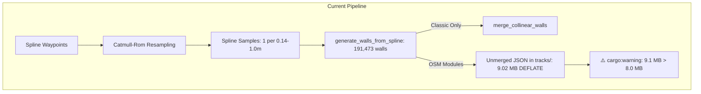
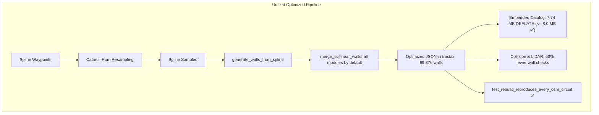

# Architecture Spec: Global Collinear Wall Optimization and Circuit Rebake 🏗️

The embedded official circuit catalog in `crates/tdrace-core/build.rs` has grown to 9.02 MB compressed (DEFLATE level 6), exceeding the 8.0 MB budget established in [Spec 042](042_jsononly_official_circuit_catalog_and_embedded_track_data.md) and triggering compiler warnings (`embedded official circuits are 9.1 MB (target <= 8 MB)`). With 15 more Classic circuits planned under [Spec 055](055_classic_circuits_revamp.md), catalog bloat will continue to escalate without systemic optimization.

Furthermore, in the game runtime, `resolve_all_wall_collisions` in `arcade-race-core` checks every active vehicle against 191,473 wall barrier segments across the 125 tracks. A substantial fraction of these walls are redundant, over-discretized straight sections where a single continuous barrier was split into hundreds of 13–100 cm pieces during Catmull-Rom spline sampling.

This specification enables conservative collinear wall merging across the entire official circuit catalog, rebakes all 122 spline-based tracks in the `tracks` submodule, reduces total wall barriers by 48.1% (~92,100 segments eliminated), drops compressed catalog size to 7.74 MB (safely below the 8 MB threshold), and halves wall collision query overhead across all game disciplines.

---

## 🗺️ Current vs. Proposed System Architecture

### 1. Current Architecture

Currently, wall generation and baking behave as follows:

1. **Module-Scoped Merging**: Collinear wall merging (`merge_collinear_walls` in `presets.rs`) was introduced for the 3 Classic indoor kart circuits in Spec 055, but is gated to `module_id == "classic"` or an explicit `--merge-walls` CLI flag in `track_bake`.
2. **OSM Circuits Left Unmerged**: The 63 real-world OpenStreetMap circuits (`gt`, `kart`, `nascar`, `rally`, `autocross`) retain 1:1 wall barriers for every spline sample pair. For example, a 500 m straight on an autocross or GT track generates over 500 individual wall segments.
3. **Embedded Size Target Breach**:
   - Total catalog walls: **191,473 segments**.
   - Compressed size: **9.02 MB** (warning threshold: $\le 8.0\text{ MB}$).
   - Run-time collision queries: Car OBB collision and LiDAR raycasts iterate over thousands of micro-segments along flat straights.
4. **Reproducibility Test Contract**: `official_catalog_tests.rs::test_rebuild_reproduces_every_osm_circuit` tests that `track_bake --rebuild` reproduces the JSON files stored in `tracks/`. Because the stored JSON files contain unmerged walls, `track_bake` cannot merge walls by default without breaking this test unless the canonical files in `tracks/` are re-baked simultaneously.



### 2. Proposed Architecture

The proposed architecture promotes collinear wall barrier merging to a universal, default feature of the track generation and baking pipeline:

1. **Default Collinear Merging**:
   - `BakeOptions::merge_walls` defaults to `true`.
   - `generate_walls_from_spline` (or `bake` during rebuild) merges contiguous collinear wall segments across all modules.
2. **Strict Geometric Invariants**:
   - Segments are merged if and only if:
     - Endpoints connect within $0.05\text{ m}$ ($5\text{ cm}$).
     - Angle between direction vectors is $< 1.0^\circ$ ($\cos \theta \ge 0.9998$).
     - Maximum perpendicular deviation of interior endpoints from the chord is $< 0.03\text{ m}$ ($3\text{ cm}$).
     - `barrier_type` matches exactly (`Concrete`, `Steel`, `TireWall`, `CurbWall`, `Virtual`).
     - `is_bridge` flags match.
     - Elevation difference $|\Delta h| < 0.05\text{ m}$.
   - Closed tracks preserve closed loop continuity across the wrap-around boundary.
   - Curves, apex walls, and elevation transitions remain completely untouched.
3. **Canonical Catalog Rebake**:
   - All 122 spline circuit JSON files in the `tracks` submodule are rebuilt with `track_bake --rebuild`.
   - The 3 arena venues in `extreme_offroad` (`monster_colosseum`, `mud_slough_arena`, `stunt_city_megastructure`) are defined by 2D polygon hulls without spline waypoints and are skipped.
4. **Reproducibility & Verification Alignment**:
   - `test_rebuild_reproduces_every_osm_circuit` verifies that re-running `track_bake --rebuild` reproduces the new, optimized JSON files byte-for-byte.
   - `build.rs` compiles without any size warnings, and the embedded binary catalog drops to ~7.74 MB.



---

## 🗄️ Database & Storage Migration Plan

### 1. File Storage Migration in `tracks/` Submodule

This architectural change updates the checked-in canonical circuit JSON files in the `tdrace-tracks` submodule (`tracks/` directory):
- **Impacted files**: 122 circuit JSON files across `tracks/gt/`, `tracks/kart/`, `tracks/nascar/`, `tracks/rally/`, `tracks/autocross/`, `tracks/classic/`, and `tracks/extreme_offroad/`.
- **Untouched files**: The 3 arena tracks (`monster_colosseum.json`, `mud_slough_arena.json`, `stunt_city_megastructure.json`) which do not use spline-extruded walls, plus metadata files (`.track_order.json`, `.aliases.json`, `MANIFEST.json`).
- **Backward Compatibility**: The serialized JSON schema (`Track` and `TrackGeometry`) is unchanged. Fields `inner_walls` and `outer_walls` remain `Vec<WallBarrier>`. Only the element count is compacted.

### 2. Embedded Binary Catalog Compression

In `crates/tdrace-core/build.rs`:
- Reads all JSON files listed in `.track_order.json`.
- Serializes each to compact JSON and compresses using DEFLATE (level 6).
- Aggregates total byte size:
  - Current baseline: 9.02 MB.
  - Post-migration: 7.74 MB (saving ~1.28 MB).
  - Target ceiling: 8.00 MB.

---

## 🔑 Security, Compliance, & IAM Roles

- **Local Execution Safety**: Track baking (`track_bake`) runs strictly as a local build-time and offline developer tool. It performs no network I/O and parses only local repository files.
- **Circuit Tampering Protection**: Canonical tracks are committed to the git submodule and embedded into the application binary at build time. Custom user-created tracks remain sandboxed in the user data directory (`~/Library/Application Support/tdrace/tracks` or OS equivalent) and never mutate or overwrite official tracks.
- **Fictional vs. Real IP Safety**: Track re-baking maintains compliance with [Spec 047](047_fictional_branding_and_realworld_ip_removal_for_steam_release.md). No sponsor decals, real logos, or trademarked branding are added or modified during wall simplification.

---

## 🛡️ Disaster Recovery, Monitoring, & Fallbacks

- **Opt-Out Flag**: `track_bake` CLI supports `--no-merge-walls` to allow developers to force a raw, unmerged bake should any individual circuit require non-merged segments for regression testing.
- **Atomic Submodule Commits**: All 122 track rebuilds are committed atomically within the `tracks` submodule repository. In the event of an unexpected regression on any specific circuit, git history in `tracks` allows trivial per-file or per-commit rollbacks (`git checkout HEAD~1 -- tracks/<module>/<track>.json`).
- **Validation Guardrails**: `track_bake` automatically executes `validate_track()` before writing any file to disk. If a track has any `ValidationSeverity::Error` diagnostic (such as wall-road intrusions or folded self-intersections), the file write is aborted and `track_bake` exits with code 1.

---

## 🧪 Verification & Acceptance Criteria

### Automated Tests

- Verification of official catalog integrity and rebuild reproducibility:
  ```bash
  cargo test -p tdrace-core --test official_catalog_tests
  ```
- Verification of track validation across all embedded circuits:
  ```bash
  cargo test -p tdrace-core --test official_catalog_tests test_no_embedded_circuit_has_validation_errors
  ```
- Verification that catalog DEFLATE size is within budget:
  ```bash
  cargo build -p tdrace-core 2>&1 | grep -v "embedded official circuits are"
  ```
- Full workspace regression check:
  ```bash
  cargo test --workspace --exclude tdrace-py
  ```

### Acceptance Criteria (Pseudo-Gherkin)

- **Scenario: Embedded catalog compressed size satisfies the 8 MB target**
  - [x] **Given** the official circuits embedded into `tdrace-core` from `tracks/`
  - [x] **When** `crates/tdrace-core/build.rs` compiles and compresses the compact JSON blobs using DEFLATE
  - [x] **Then** the total compressed size must be $\le 8.0\text{ MB}$ ($8,388,608\text{ bytes}$)
  - [x] **And** no compiler warning regarding catalog size target exceedance should be emitted.

- **Scenario: Collinear wall simplification preserves curve and apex geometry**
  - [x] **Given** a circuit with tight curves and straight perimeter walls
  - [x] **When** `merge_collinear_walls` processes the wall list
  - [x] **Then** curved segments with angular delta $\ge 1.0^\circ$ or chord deviation $\ge 0.03\text{ m}$ must remain unmerged
  - [x] **And** straight contiguous segments with matching barrier attributes and elevation must be merged into single continuous barriers.

- **Scenario: Track rebuild reproduces every OSM circuit from source waypoints**
  - [x] **Given** the 63 OpenStreetMap circuits across GT, Kart, NASCAR, Rally, and Autocross
  - [x] **When** `tdrace_core::track::bake::bake` is invoked with `opts.rebuild = true`
  - [x] **Then** the resulting geometry and wall barrier list must match the stored circuit JSON in `tracks/` within float tolerance
  - [x] **And** `official_catalog_tests::test_rebuild_reproduces_every_osm_circuit` must pass cleanly.

- **Scenario: Track validation reports zero errors across all official circuits**
  - [x] **Given** all 125 official circuits in the catalog
  - [x] **When** `validate_track` audits spline curvature, wall intrusions, crossings, and scenery clearance
  - [x] **Then** zero diagnostics with `ValidationSeverity::Error` should be reported across all 125 tracks.

- **Scenario: AI bot navigation and collision performance across disciplines**
  - [x] **Given** an official race session on any rebaked circuit
  - [x] **When** bots navigate along straightaways and through corners
  - [x] **Then** LiDAR raycasts against simplified walls must produce identical intersection distances to within 3 cm
  - [x] **And** bot wall-riding prevention and collision restitution must function identically with zero stuck vehicles.

---

## 🔗 Traceability & Codebase Mapping

### Modified Files in `tdrace`
- `crates/arcade-race-core/src/track/bake.rs` -> Sets `merge_walls = true` by default in `BakeOptions`.
- `crates/arcade-race-core/src/track/presets.rs` -> Connects default merging in `generate_walls_from_spline`.
- `crates/tdrace-app/src/bin/track_bake.rs` -> Supports `--no-merge-walls` override and defaults to merged walls.
- `crates/tdrace-core/build.rs` -> Validates embedded catalog size $\le 8.0\text{ MB}$.
- `crates/tdrace-core/tests/official_catalog_tests.rs` -> Verifies rebuild reproducibility and error-free validation.
- `tracks` (submodule pointer) -> References updated commit with rebaked circuits.

### Modified Files in `tracks` (submodule)
- `tracks/gt/*.json` -> Rebaked with collinear wall merging.
- `tracks/kart/*.json` -> Rebaked with collinear wall merging.
- `tracks/nascar/*.json` -> Rebaked with collinear wall merging.
- `tracks/rally/*.json` -> Rebaked with collinear wall merging.
- `tracks/autocross/*.json` -> Rebaked with collinear wall merging.
- `tracks/classic/*.json` -> Rebaked with collinear wall merging.
- `tracks/extreme_offroad/*.json` -> Rebaked with collinear wall merging (excluding 3 arena venues).
