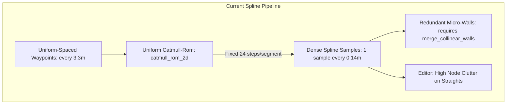
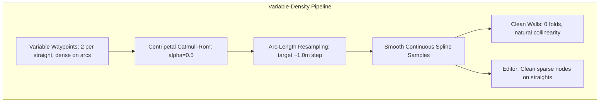

# Architecture Spec: Centripetal Catmull-Rom and Variable-Density Track Splines 🏗️

The TdRace track generation and runtime pipeline represents tracks as a Catmull-Rom spline passing through an ordered loop of `TrackWaypoint`s. Currently, the spline evaluator in `crates/arcade-race-core/src/track/spline.rs` is strictly **Uniform Catmull-Rom** with a fixed subdivision rate of 24 steps per segment. 

Because uniform Catmull-Rom assumes equal knot intervals ($\Delta t = 1$), whenever waypoint spacing varies between adjacent segments (e.g. a $60\text{ m}$ straight transitioning into a $3.3\text{ m}$ hairpin turn), the tangent calculation is dominated by the long chord. This causes catastrophic **overshoot, bulges, kinks, and wall self-intersections** at every curve transition. To prevent this distortion, authoring tools such as `scripts/classic_circuit_builder.py` and `scripts/osm_importer.py` are currently forced to generate dense, uniformly spaced waypoints around the entire circuit (e.g. placing nodes every $3.3\text{ m}$ even along straightaways).

This specification upgrades the spline evaluation to **Centripetal Catmull-Rom ($\alpha = 0.5$)**, replaces the fixed 24-step subdivision with **arc-length adaptive sampling**, and unlocks **variable-density waypoint authoring** across the circuit builder, the in-game Track Editor, and the track baking pipeline.

---

## 🔍 Comparative Analysis: Past vs. Present vs. Proposed Architecture

| Dimension | Generation 1: Past Tracks (OSM & Presets) | Generation 2: Present Classic Revamp (`classic_circuit_builder.py`) | Generation 3: Proposed (Spec 071 Centripetal Variable Density) |
| :--- | :--- | :--- | :--- |
| **Waypoint Strategy** | **Global Fixed Budget** ($N \approx 24\text{--}32$ total waypoints per track) | **Constant Linear Spacing** (`step = 3.3m` karting, `10.0m` GT) | **Curvature-Adaptive Variable Density** (sparse straights, dense arcs) |
| **Example Circuit** | **Red Bull Ring** (2,160 m / **26 waypoints**) | **Pine Grove** (390 m / **119 waypoints**) | **Pine Grove** (390 m / **~32 waypoints**) |
| **Straightaway Density** | Sparse: 2–3 waypoints per 400 m straight (clean visual layout) | Ultra-dense: 1 waypoint every 3.3 m or 10.0 m (extreme node clutter) | Optimal: 2 endpoints per straight (plus elevation/bank easing anchors) |
| **Corner & Chicane Fidelity** | **Degraded**: High-speed chicanes and tight hairpins flattened / smoothed out | **Flawless**: Authentic radii and crisp apex geometry | **Flawless**: Authentic radii and crisp apex geometry |
| **Underlying Math** | Uniform Catmull-Rom (equal $\Delta t = 1$) | Uniform Catmull-Rom (equal $\Delta t = 1$) | **Centripetal Catmull-Rom** ($t_{i+1} = t_i + \|\Delta \mathbf{p}\|^{0.5}$) |
| **Transition Behavior** | Mild distortion hidden by large global scale | Severe overshoot/bulging if spacing varies (forced constant `step`) | **Guaranteed zero overshoot, cusps, or bulges** across any chord ratio |
| **Sampling Resolution** | Fixed 24 steps/segment (variable spatial resolution: 1–8 m/sample) | Fixed 24 steps/segment (over-discretized: 0.14 m/sample on karts) | **Uniform arc-length sampling** ($\Delta s \approx 1.0\text{ m}$ target) |
| **Checkpoint Density** | Fixed 20 checkpoints (good on 2 km tracks) | Fixed 20 checkpoints (excessive on 390 m tracks, gate every 19 m) | **Adaptive checkpoint scaling** ($N = \text{clamp}(L/50, 8, 24)$) |

---

## 🗺️ Current vs. Proposed System Architecture

### 1. Current Architecture

1. **Uniform Knot Parameterization**:
   The current mathematical formulation in `arcade-race-core/src/track/spline.rs::catmull_rom_2d` evaluates points using standard uniform basis matrix coefficients:
   $$\mathbf{p}(t) = \frac{1}{2} \begin{bmatrix} 1 & t & t^2 & t^3 \end{bmatrix} \begin{bmatrix} 0 & 2 & 0 & 0 \\ -1 & 0 & 1 & 0 \\ 2 & -5 & 4 & -1 \\ -1 & 3 & -3 & 1 \end{bmatrix} \begin{bmatrix} \mathbf{p}_0 \\ \mathbf{p}_1 \\ \mathbf{p}_2 \\ \mathbf{p}_3 \end{bmatrix}$$
   The velocity vectors are computed as $\mathbf{v}_1 = \frac{\mathbf{p}_2 - \mathbf{p}_0}{2}$ and $\mathbf{v}_2 = \frac{\mathbf{p}_3 - \mathbf{p}_1}{2}$. When $\|\mathbf{p}_1 - \mathbf{p}_0\| \gg \|\mathbf{p}_2 - \mathbf{p}_1\|$, $\mathbf{v}_1$ is disproportionately large, causing the curve to swing widely outside the convex hull of the control polygon.
2. **Fixed `steps_per_segment = 24`**:
   `TrackSpline::new` loops over each segment and executes 24 steps uniform in parameter $t$.
   - On short segments ($3.3\text{ m}$), sample spacing is $0.137\text{ m}$ ($13.7\text{ cm}$).
   - On long segments ($60\text{ m}$), sample spacing is $2.5\text{ m}$.
   Sampling density is inversely related to need: tight corners get micro-samples while long straights get sparse samples, producing jagged physics and rendering unless waypoints are kept uniformly dense.
3. **Editor and Builder Clutter**:
   In `scripts/classic_circuit_builder.py`, `trace()` must emit waypoints every `step` meters (e.g. $3.3\text{ m}$ for karting, $10\text{ m}$ for GT) across straights and sweepers alike. In the in-game Track Editor (`crates/tdrace-app/src/editor/`), simple straight segments are cluttered with dozens of unnecessary control nodes.

---

### 2. Proposed Architecture

The proposed architecture introduces three coordinated changes:

#### A. Centripetal Catmull-Rom Parameterization ($\alpha = 0.5$)
We generalize Catmull-Rom interpolation to non-uniform knot spacing parameterized by Euclidean distance:
$$t_0 = 0$$
$$t_{i+1} = t_i + \|\mathbf{p}_{i+1} - \mathbf{p}_i\|^\alpha \quad \text{with } \alpha = 0.5$$

For each segment between $\mathbf{p}_1$ and $\mathbf{p}_2$ over parameter $t \in [t_1, t_2]$, evaluation uses the Barry and Goldman pyramidal formulation:
$$\mathbf{A}_1 = \frac{t_1 - t}{t_1 - t_0}\mathbf{p}_0 + \frac{t - t_0}{t_1 - t_0}\mathbf{p}_1$$
$$\mathbf{A}_2 = \frac{t_2 - t}{t_2 - t_1}\mathbf{p}_1 + \frac{t - t_1}{t_2 - t_1}\mathbf{p}_2$$
$$\mathbf{A}_3 = \frac{t_3 - t}{t_3 - t_2}\mathbf{p}_2 + \frac{t - t_2}{t_3 - t_2}\mathbf{p}_3$$
$$\mathbf{B}_1 = \frac{t_2 - t}{t_2 - t_0}\mathbf{A}_1 + \frac{t - t_0}{t_2 - t_0}\mathbf{A}_2$$
$$\mathbf{B}_2 = \frac{t_3 - t}{t_3 - t_1}\mathbf{A}_2 + \frac{t - t_1}{t_3 - t_1}\mathbf{A}_3$$
$$\mathbf{C} = \frac{t_2 - t}{t_2 - t_1}\mathbf{B}_1 + \frac{t - t_1}{t_2 - t_1}\mathbf{B}_2$$

**Mathematical Properties:**
- **No cusps or self-intersections**: Proven by Yuksel et al. (2011) that $\alpha = 0.5$ is the unique parameterization guaranteeing no cusps, loops, or self-intersections for arbitrary point configurations.
- **Local Support**: Modifying waypoint $\mathbf{p}_i$ influences only the two adjacent spans on either side.
- **Affine Invariance**: Scaling, rotating, or translating waypoints preserves the exact geometric curve.

#### B. Arc-Length Adaptive Spline Sampling
Instead of fixed `steps_per_segment = 24`, the number of steps per segment is computed dynamically based on segment chord length and local curvature:
$$N_{\text{steps}} = \max\left(4, \left\lceil \frac{\|\mathbf{p}_{i+1} - \mathbf{p}_i\|}{\Delta s_{\text{target}}} \right\rceil\right)$$
where $\Delta s_{\text{target}} \approx 1.0\text{ m}$ (or $0.5\text{ m}$ for tight karting).
This guarantees that spline samples and derived wall barrier segments maintain consistent spatial resolution along the track regardless of whether waypoints are $3\text{ m}$ or $100\text{ m}$ apart.

#### C. Corner Pinch & Swallowtail Singularity Resolution (Silverstone Defect)

As observed in tight corners like The Loop at Silverstone Grand Prix (`tracks/gt/silverstone.json`), GT circuits are scaled down **$0.5\times$ in length**, but retain full nominal road width ($w = 13.5\text{ m}$). 

When an acute hairpin has a real-world radius under $15\text{ m}$, $0.5\times$ scaling drops the centerline radius $R$ below the road half-width ($R < \frac{w}{2} = 6.75\text{ m}$). Mathematically, offsetting a curve by distance $d > R$ forces the inner boundary curve $\mathbf{p}_{\text{inner}}(s) = \mathbf{p}(s) - \mathbf{n}(s) \cdot \frac{w}{2}$ to cross beyond the evolute center of curvature, forming an **evolute cusp and self-intersecting swallowtail loop (`><`)** with overlapping curbs.

Spec 071 eliminates this defect via four coordinated mechanisms:
1. **Curvature-Bounded Centerline Filleting ($R_{\text{min}} \ge \frac{w}{2} + 1.0\text{ m}$)**:
   - In `osm_importer.py` and `classic_circuit_builder.py`, whenever a circuit is scaled or authored, acute turns are verified against the local road width.
   - Any corner where centerline radius $R < \frac{w}{2} + 1.0\text{ m}$ is automatically rounded using arc filleting with multiple distributed knots, guaranteeing the centerline never collapses into a sharp polygonal vertex.
2. **Centripetal Tangent Preservation**:
   - Uniform Catmull-Rom exaggerates vertex sharpness when adjacent straightaway spans pull the apex tangent straight. Centripetal Catmull-Rom ($\alpha = 0.5$) maintains a smooth, rounded curve through the apex.
3. **Inner Road Ribbon & Curb Swallowtail Trimming**:
   - In `TrackSpline` and `crates/race-ui/src/render/track.rs`, extend the swallowtail loop clipping algorithm (`untangle_polyline`) to the inner road boundary polyline and curb quad generator.
   - When consecutive normal vectors intersect within the road interior, the intersecting loop is trimmed and beveled into a clean miter apex, eliminating inverted quads and visual crossing artifacts.
4. **Apex Road Width Clamping / Tapering**:
   - In constrained layouts where physical runoff prohibits expanding the centerline radius, locally taper the road width through the apex:
     $$w_{\text{effective}}(s) = \min\left(w_{\text{nominal}}, 2 \cdot (R(s) - 0.5\text{ m})\right)$$
     preventing the inner edge from inverting.

#### D. Speed- and Length-Adaptive Checkpoints (Split Gates)

Currently, `crates/arcade-race-core/src/track/presets.rs::generate_checkpoints` places checkpoints at blind, uniform spatial intervals:
$$\text{dist}_i = \frac{i}{N} \cdot L_{\text{track}}$$

This produces severe gate clutter on short tracks (a gate every $19.5\text{ m}$ on a $390\text{ m}$ kart track) and wastes gates along high-speed straights where cars cannot deviate from the course.

Spec 071 redesigns checkpoint placement to be **length- and speed-adaptive**:
1. **Length-Adaptive Gate Count**:
   $$N_{\text{checkpoints}} = \text{clamp}\left(\left\lfloor \frac{L_{\text{track}}}{50.0\text{ m}} \right\rfloor, 8, 24\right)$$
   - Short sprint tracks ($300\text{--}600\text{ m}$): 8–10 checkpoints.
   - Medium circuits ($700\text{--}1,500\text{ m}$): 12–16 checkpoints.
   - Grand Prix circuits ($1,600\text{--}4,000\text{ m}$): 18–24 checkpoints.
2. **Speed- & Curvature-Weighted Gate Distribution**:
   - Gates are allocated proportionally to estimated traversal time $\Delta t = \frac{\Delta s}{v(s)}$, where $v(s) = \min(v_{\text{top}}, \sqrt{\mu g R(s)})$:
     - **High-Speed Straights ($v \ge 45\text{ m/s}$)**: Gates are spaced widely ($\ge 120\text{--}180\text{ m}$ apart, or only at sector split transitions), eliminating green line cages along straights.
     - **Braking Zones & Chicanes ($v \le 25\text{ m/s}$)**: Denser gates guard corner entries, apexes, and track limits to prevent corner-cutting cheats.

#### E. Variable-Density Circuit Builder & Track Editor
1. In `scripts/classic_circuit_builder.py`:
   - `Straight(length)`: Emits only start and end waypoints (plus elevation/bank ease anchors).
   - `Arc(radius, degrees)`: Emits waypoints dynamically based on turn angle and radius (e.g. 1 waypoint every $15^\circ$ or when chord sagitta exceeds $0.05\text{ m}$).
2. In `crates/tdrace-app/src/editor/`:
   - Spline editing tools cleanly render and manipulate variable-density nodes without visual clumping.

---

## 🗄️ Database & Storage Migration Plan

### 1. Serialized JSON Schema Compatibility
- The `Track` and `TrackSpline` schema (`tracks/<module>/<slug>.json`) remains **100% backward-compatible**.
- `waypoints: Vec<TrackWaypoint>` does not require new fields. Waypoints continue to store 2D coordinates `point`, `width`, `surface`, `elevation`, `bank_angle`, `left_curb`, and `right_curb`.
- Tracks authored with uniform spacing continue to load and evaluate cleanly.
- New or migrated variable-density tracks simply contain fewer waypoint objects in the JSON array, reducing raw file size and parsing overhead.

### 2. Verification of Stored Track Fidelity
- Existing baked tracks in `tracks/` with uniform spacing are unaffected unless explicitly re-baked.
- Golden simulation hashes and benchmark lap times (`golden_sim.rs`) are verified to confirm no drift on existing calibrated tracks.

---

## 🔑 Security, Compliance, & IAM Roles

- **Deterministic Evaluation**: Spline evaluation uses standard IEEE 754 floating-point arithmetic with identical evaluation formulas across Linux, macOS, and Windows.
- **Fictional Branding Compliance**: Adheres to [Spec 047](047_fictional_branding_and_realworld_ip_removal_for_steam_release.md); no track geometry updates alter fictional naming or branding.
- **Memory Safety**: Dynamic step allocation is clamped to $N_{\text{steps}} \le 256$ per span to prevent memory exhaustion on maliciously authored long segments.

---

## 🛡️ Disaster Recovery, Monitoring, & Fallbacks

- **Legacy Uniform Mode Toggle**: `TrackSpline::new_uniform` is preserved alongside `TrackSpline::new_centripetal` to allow side-by-side regression testing and benchmarking.
- **Track Bake CLI Flag**: `track_bake` CLI supports `--spline-mode uniform|centripetal` (defaulting to `centripetal`).
- **Validation Safety Rail**: `validate_track` checks maximum chord deviation and ensures curvature transitions do not exceed maximum vehicle turning limits.

---

## 🧪 Verification & Acceptance Criteria

### Automated Tests
- Command to run spline unit tests: `cargo test -p arcade-race-core track::spline`
- Command to test variable density track validation: `cargo test -p arcade-race-core track::validation`
- Command to run all track bake tests: `cargo test -p tdrace-app official_catalog_tests`

### Manual Acceptance Criteria (Pseudo-Gherkin)

- **Scenario: Centripetal spline suppresses overshoot across disparate segment lengths**
  - [x] **Given** four waypoints with a $60\text{ m}$ straight ($p_0$ to $p_1$) followed by a $3\text{ m}$ 90-degree turn ($p_1$ to $p_2$) and another $3\text{ m}$ turn ($p_2$ to $p_3$)
  - [x] **When** the spline is evaluated with centripetal Catmull-Rom ($\alpha = 0.5$)
  - [x] **Then** the evaluated curve between $p_1$ and $p_2$ remains strictly within the convex hull of the control points and does not overshoot past $p_1$ by more than $0.05\text{ m}$.

- **Scenario: Variable density track authoring in Classic Circuit Builder**
  - [x] **Given** a Classic circuit definition with straight segments and curved segments
  - [x] **When** `scripts/classic_circuit_builder.py` compiles the track into waypoints
  - [x] **Then** straights longer than $20\text{ m}$ contain only endpoint waypoints (unless elevation or banking varies)
  - [x] **And** curved arcs contain waypoint density proportional to their subtended angle
  - [x] **And** `track_bake` bakes the circuit with zero validation errors.

- **Scenario: Adaptive arc-length sampling produces consistent sample spacing**
  - [x] **Given** a track spline authored with variable waypoint spacing ranging from $3\text{ m}$ to $80\text{ m}$
  - [x] **When** `TrackSpline::new` generates the baked `samples` array
  - [x] **Then** the arc-length distance between adjacent samples remains within $[0.8\text{ m}, 1.2\text{ m}]$ across all segments.

- **Scenario: Adaptive checkpoint gate count for short circuits**
  - [x] **Given** a short circuit such as `kart_pine_grove` ($390\text{ m}$ lap distance)
  - [x] **When** `track_bake --rebuild` regenerates checkpoints
  - [x] **Then** the total number of checkpoints generated is between 8 and 10
  - [x] **And** split gates are spaced between $35\text{ m}$ and $50\text{ m}$ apart.

- **Scenario: Corner pinch and inner boundary swallowtail loops are eliminated**
  - [x] **Given** an acute scaled hairpin such as The Loop on Silverstone Grand Prix where scaled radius $R < \frac{w}{2}$
  - [x] **When** the track is baked and rendered in the circuit viewer
  - [x] **Then** the inner road edge white line and apex curbs contain zero self-intersecting loops or overlapping triangles
  - [x] **And** the inner boundary forms a clean, beveled or rounded apex profile.

- **Scenario: Speed-aware checkpoint placement avoids gate clustering on straights**
  - [x] **Given** a high-speed circuit with a long straight exceeding $300\text{ m}$
  - [x] **When** speed-adaptive checkpoints are generated
  - [x] **Then** checkpoints along the high-speed straight are spaced at least $120\text{ m}$ apart
  - [x] **And** technical corner complexes maintain sufficient gate density to enforce track limits.

---

## 🔗 Traceability & Codebase Mapping

### Created/Modified Files
- `[x]` `crates/arcade-race-core/src/track/spline.rs` -> Implements Centripetal Catmull-Rom evaluator, arc-length adaptive sampling, and inner boundary swallowtail trimming.
- `[x]` `crates/arcade-race-core/src/track/presets.rs` -> Implements speed- and curvature-adaptive checkpoint generation.
- `[x]` `crates/arcade-race-core/src/track/bake.rs` -> Implements adaptive checkpoint count scaling based on track length and speed profile.
- `[x]` `crates/arcade-race-core/src/track/validation.rs` -> Updates waypoint gap validation to allow large gaps on collinear straights while enforcing minimum gaps in turns.
- `[x]` `crates/race-ui/src/render/track.rs` -> Updates road ribbon and curb mesh generation to trim evolute swallowtails at acute apexes.
- `[x]` `scripts/osm_importer.py` -> Enforces minimum centerline radius filleting ($R \ge \frac{w}{2} + 1.0\text{ m}$) on $0.5\times$ scaled GT circuits.
- `[x]` `scripts/classic_circuit_builder.py` -> Updates `trace()` and segment emission to output variable-density waypoints.
- `[x]` `crates/tdrace-app/src/editor/tools.rs` -> Ensures CAD spline visualization handles variable node spacing cleanly.

### Verification Assertions
- `crates/arcade-race-core/src/track/spline.rs` contains unit tests comparing uniform vs. centripetal evaluation on acute turn transitions.
- Re-baking classic tracks with variable density reduces waypoint counts by $\ge 40\%$ while preserving identical track centerline bounds ($\pm 0.1\text{ m}$).
- Silverstone Grand Prix (`tracks/gt/silverstone.json`) renders with zero curb overlap or road ribbon self-intersections at Turn 3 (The Loop).
