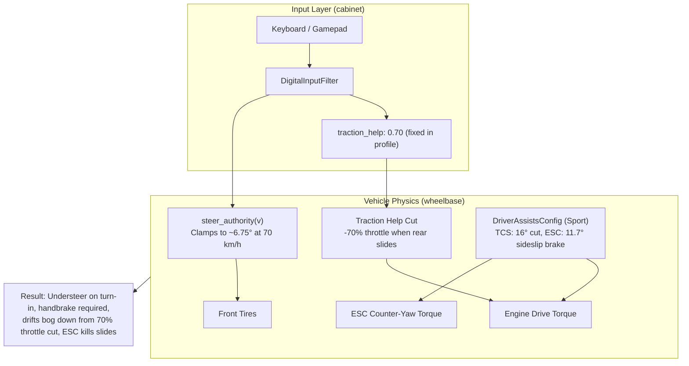
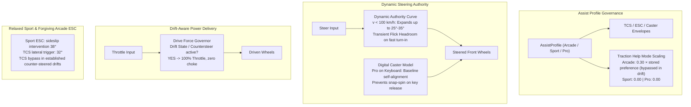

# Architecture Spec: Progressive Drift Dynamics, Low-Speed Steering Authority, and Assist Differentiation 🏎️💨

## 🎯 Executive Summary & Context

Prior to the decoupled tire and differential physics introduced in [Spec 028](028_decoupled_tire_physics_and_wheel_components.md) and [Spec 043](043_vehicle_dynamics_rebuild_and_simplified_handling_settings.md), TDrace featured an intuitive, accessible, and thrilling arcade drift model reminiscent of *GeneRally*. Drivers could initiate power-slides through aggressive steering input and throttle weight transfer, effortlessly balancing long drifts through counter-steering on keyboard and controller alike.

In solving high-speed steering divergence and plowing at top speed (160–210 km/h) in Spec 043, multiple restrictive layers were layered onto the physics engine:
1. **Low-Speed Steering Clamp**: Road wheel angles at moderate speeds (40–90 km/h) were reduced from $\approx 37^\circ$ down to $6.75^\circ$–$8^\circ$ via `steer_authority`, stripping vehicles of the turning authority required to pitch into corners.
2. **Hidden Throttle Cut (`traction_help`)**: An independent player assist in `DigitalInputConfig` was defaulted to 0.70 (`Balanced`), cutting engine throttle by up to **70%** whenever rear tire slip exceeded 80% of peak, actively starving drifts of momentum regardless of assist profile.
3. **Strangled Sport Mode**: Sport mode assists (TCS lateral trigger at $16^\circ$, ESC sideslip cap at $11.7^\circ$) fight intentional drifts instead of enabling them.
4. **Difficult Pro Mode Recovery on Keyboard**: Disabling all assists in Pro mode removes sideslip-based self-alignment. The input filter and physical rack still rate-limit centering, but digital players lack an analog driver's precise steering adjustment during release and slide recovery.

This specification redesigns steering authority, throttle delivery, and assist envelopes to recover the joyful, accessible arcade drift experience while maintaining high-speed stability and clear skill progression across **Arcade**, **Sport**, and **Pro** modes.

---

## 🗺️ Current vs. Proposed System Architecture

### 1. Current Architecture (Spec 043)



#### Identified Architectural Flaws:
1. **Coupling of `traction_help` to Filter instead of Driving Mode**: `car.config.player.traction_help` is populated from `DigitalInputConfig` (defaulting to 0.70 on Balanced). Selecting Sport or Pro mode updates `car.config.assists` but leaves `player.traction_help` active, silently killing engine power during slides.
2. **Excessive Low/Mid-Speed Steering Restriction**: The steady-state grip formula `kinematic + 0.30 * peak_slip_angle` leaves zero dynamic headroom for Scandinavian flicks, sharp turn-in weight transfers, or tight hairpin navigation under 100 km/h.
3. **Premature ESC & TCS Intervention in Sport Mode**: Sport mode promises "mild assists allowing moderate slip angles and aggressive powerslides," yet intervenes at $11.7^\circ$ sideslip, far below normal drift angles ($20^\circ$–$40^\circ$).
4. **Absence of Digital Recovery in Pro Mode**: The current Pro configuration disables sideslip-based self-alignment. A digital steering accommodation can improve release recovery, but it must remain distinct from a physical caster torque model and from electronic assistance for analog drivers.

---

### 2. Proposed Architecture (Spec 072)



---

## 📐 Technical Specifications & Calibration

### 1. Dynamic Low-Speed Steering Authority & Flick Headroom

Modify [`Car::steer_authority_with`](../crates/wheelbase/src/car.rs):
- **Current formula**:
  $$\text{authority}(v) = \text{clamp}\left(\arctan\left(\frac{L}{R_{\min}}\right) + (0.30 - 0.25 \cdot h(v) + \text{beyond}) \cdot \alpha_{\text{peak}}, 0, \delta_{\max}\right)$$
  Where $R_{\min} = \frac{v^2}{\mu g_{\text{eff}}}$ collapses rapidly as speed rises above 10 m/s.
- **Proposed Enhancement**:
The following formulas are exploratory candidates, not implementation-ready contracts. They must preserve preset authority differentiation, remove speed-boundary discontinuities, and distinguish intentional flicks from ordinary filtered key presses. Angle guarantees require headless measurement, not a floor formula alone. Two shared authority-envelope candidates regressed the existing 3%-monotonic turn-curvature calibration (one also regressed corner-exit/braking checks), so both are rejected. The current grip-aware authority mapping remains unchanged until a validated per-vehicle curve passes those gates and the twelve-combination matrix. Record the candidate measurements in the task evidence; do not claim the low-speed authority acceptance scenario is complete yet.
   1. **Expanded Authority Envelope**: Below $28\text{ m/s}$ ($100\text{ km/h}$), a future preset-aware blend may increase turn-in authority while preserving the existing grip mapping:
     $$\text{authority}_{\text{base}}(v) = \max\left(\text{authority}(v), \delta_{\max} \cdot \left(1.0 - \left(\frac{v}{28}\right)^{1.4} \cdot 0.65\right)\right)$$
      For the current Classic GT lock, this candidate floor is approximately $32.0^\circ$ at 40 km/h, $25.3^\circ$ at 65 km/h, and $20.6^\circ$ at 80 km/h; it does not guarantee $22^\circ$ throughout that range.
   2. **Transient Turn-in Flick Headroom**: A future candidate may add bounded transient headroom on a measured intentional flick. The initial $2.0\text{ s}^{-1}$ trigger is rejected because normal filtered key rises exceed it. Define filtered-input units, reversal/retrigger rules, speed envelope and decay, then pass the full key-style matrix before enabling it.

---

### 2. Elimination of Drift Throttle Choke (`traction_help`)

Modify [`Car::step`](../crates/wheelbase/src/car.rs) and [`PlayerHandling`](../crates/wheelbase/src/config.rs):
- Mode-Aware Traction Help:
- **Arcade**: Effective strength equals the stored input-config traction-help preference, preserving the preset/Custom value. The existing preset values pass the 90% Arcade/Balanced held-key gate when resolved as Arcade assist settings. Active only during forward acceleration and mild turns; **bypassed** whenever `is_counter_steering` is true or `self.state.is_drifting` is true.
   - **Sport**: Explicitly set to `0.0` (zero throttle reduction).
   - **Pro**: Explicitly set to `0.0`.
- Drift-State Guard:
   In `crates/wheelbase/src/car.rs`:
   ```rust
    let throttle_scale = if traction_help > 0.0
        && !clamped_ctrl.reverse
        && !is_counter_steering
        && !self.state.is_drifting
   {
       // Existing force_use / rear_use calculation
   } else {
       1.0
   };
   ```
   Holding `W` in an established drift incurs **no traction-help reduction**. This does not remove engine taper, tire-force limits, or other physical losses. In Sport, both lateral and longitudinal TCS interventions are bypassed while counter-steering in an established forward drift; ordinary acceleration retains the relaxed TCS settings below.

---

### 3. Assist Profile Recalibration (Arcade, Sport, Pro)

Update [`DriverAssistsConfig`](../crates/wheelbase/src/config.rs):

| Parameter | Arcade (Forgiving) | Sport (Pure Drift & Fun) | Pro (Raw Sim + Caster) |
|---|---|---|---|
| **TCS Enabled** | `true` | `true` (Relaxed) | `false` |
| **TCS Longitudinal Threshold** | `0.20` | `0.45` (Allows deep wheelspin) | N/A |
| **TCS Strength** | `0.60` | `0.25` | `0.0` |
| **TCS Lateral Trigger (`tcs_slip_angle_deg`)** | `18.0°` (was 12°) | `32.0°` (was 16°) | N/A |
| **ESC Enabled** | `true` | `true` (Drift-Tolerant) | `false` |
| **ESC Yaw Threshold** | `0.15 rad/s` | `0.40 rad/s` | N/A |
| **ESC Strength** | `0.70` | `0.30` | `0.0` |
| **ESC Sideslip Cap ($\beta_{\text{limit}}$)** | `22.0°` ($0.38\text{ rad}$) | `38.0°` ($0.66\text{ rad}$) | N/A |
| **Electronic Counter-Steer Assist Enabled** | `true` | `true` | `false` |
| **Electronic Counter-Steer Assist Strength** | `0.75` | `0.55` | `0.0` |
| **Baseline Digital Recovery Strength** | `0.35` (max-composed with electronic recovery) | `0.35` (max-composed with electronic recovery) | `0.35` (digital steering only) |
| **Handbrake Bypass** | `true` | `true` | `true` |

The ESC sideslip intervention threshold must be independently configurable from ESC strength; the current strength-derived formula cannot express these limits. These are intervention onset angles, not guaranteed hard caps. ABS retains the current mode defaults: Arcade enabled with target `0.15` / strength `0.95`, Sport enabled with target `0.20` / strength `0.75`, Pro disabled.

- **Arcade Feel**: Accessible and fun. Pitching the car hard steps the rear out, and strong self-aligning counter-steer catches slides automatically so beginners never spin out.
- **Sport Feel**: The flagship enthusiast mode. Zero throttle cut. TCS allows tires to light up and spin under acceleration. Drifts can be initiated with a flick or throttle stomp and held indefinitely at up to $38^\circ$ of slip angle.
- **Pro Feel**: Zero electronic aids (no TCS, no ESC). Raw torque and mechanical differential response. Crucially, digital keyboard drivers retain baseline caster self-alignment (`0.35`), eliminating the unrecoverable snap-spin on key release.

---

### 4. Orthogonal Driving Mode × Input Response Matrix

#### Composition contract

Offer two independent selectors, not twelve separately maintained configurations:

- **Driving mode** (`Arcade`, `Sport`, `Pro`) owns TCS, ESC, ABS, and electronic counter-steer assistance.
- **Input response** (`Smooth`, `Balanced`, `Sharp`, `Raw`, plus `Custom`) owns steering rise time, center precision, pedal rise time, and requested steering authority. `agile` and `direct` remain legacy aliases for `Sharp`.
- **Vehicle configuration** owns mechanical lock, rack speed, tires, drivetrain, and chassis balance. Selecting a matrix cell must not mutate these parameters.
- Resolve the effective player configuration through one shared, deterministic composition function used by live play and the headless input simulation harness. Resolve each human participant with their own driving mode and active input source; do not copy P1's effective assists to P2. Bots do not receive digital-player accommodations.

This factorization provides a broad range of combinations without requiring per-car, per-cell hand tuning. The following values are **initial calibration candidates**, not measured guarantees. Preserve the implemented Spec 043 input timings initially, and validate the complete matrix before approving any changes to those timings.

#### Twelve selectable combinations

`Authority` below is `PlayerHandling::steer_overslip`, measured relative to the grip-aware steering limit, **not** a percentage of mechanical lock. Return time is the input filter's full-to-center time (`0.7 * rise`); physical rack motion remains rate-limited by the vehicle. Traction help is the effective maximum reduction outside the drift bypass, not a constant throttle cut.

| Driving mode | Input response | Steering rise / return | Center exponent | Pedal rise | Authority | Effective traction help | Electronic counter-steer strength | Intended player/style |
|---|---|---|---|---|---|---|---|---|
| Arcade | Smooth | 220 / 154 ms | 1.5 | 220 ms | 0.90 | 0.900 (90%) | 0.75 | Deliberate holds, soft inputs, maximum forgiveness |
| Arcade | Balanced | 140 / 98 ms | 1.3 | 140 ms | 1.00 | 0.700 (70%) | 0.75 | Default pick-up-and-play, mixed holds and taps |
| Arcade | Sharp | 90 / 63 ms | 1.1 | 80 ms | 1.07 | 0.350 (35%) | 0.75 | Fast reversals with strong slide recovery |
| Arcade | Raw | 40 / 28 ms | 1.0 | 0 ms | 1.15 | 0.000 (0%) | 0.75 | Immediate pedal control and fast keys, with stability aids |
| Sport | Smooth | 220 / 154 ms | 1.5 | 220 ms | 0.90 | 0.000 (0%) | 0.55 | Gradual drift entry and progressive throttle application |
| Sport | Balanced | 140 / 98 ms | 1.3 | 140 ms | 1.00 | 0.000 (0%) | 0.55 | Accessible drift driving with mixed input cadence |
| Sport | Sharp | 90 / 63 ms | 1.1 | 80 ms | 1.07 | 0.000 (0%) | 0.55 | Quick flicks and counter-steer transitions |
| Sport | Raw | 40 / 28 ms | 1.0 | 0 ms | 1.15 | 0.000 (0%) | 0.55 | Precise taps and direct power-slide modulation |
| Pro | Smooth | 220 / 154 ms | 1.5 | 220 ms | 0.90 | 0.000 (0%) | 0.00 | Unassisted vehicle dynamics with slower input response |
| Pro | Balanced | 140 / 98 ms | 1.3 | 140 ms | 1.00 | 0.000 (0%) | 0.00 | Unassisted driving with moderate input cadence |
| Pro | Sharp | 90 / 63 ms | 1.1 | 80 ms | 1.07 | 0.000 (0%) | 0.00 | Expert, rapid slide corrections without electronic aids |
| Pro | Raw | 40 / 28 ms | 1.0 | 0 ms | 1.15 | 0.000 (0%) | 0.00 | Fastest preset response and direct pedals without electronic aids |

Every Arcade row uses the Arcade TCS/ESC/ABS envelope in Section 3; every Sport row uses the Sport envelope; every Pro row disables all three. **Raw input is not Pro mode**: Raw + Arcade retains stability aids, and Smooth + Pro retains slow input response without torque intervention. Raw steering takes 40 ms to reach full input; only its pedals are instantaneous.

#### Digital recovery and input-source policy

- Treat the Pro `0.35` digital caster value in Section 3 as a **digital steering accommodation**, not electronic counter-steer assistance. Do not globally enable it in `DriverAssistsConfig::raw()` for all controllers.
- Digital steering (keyboard, D-pad, or binary touch buttons) receives a baseline recovery strength of `0.35` in every input preset, including Raw. Arcade/Sport electronic recovery and this baseline combine by `max`, not addition: effective digital recovery strengths are `0.75`, `0.55`, and `0.35` respectively.
- Analog steering receives only the mode's electronic recovery: `0.75`, `0.55`, or `0.00`. Input rise/return and pedal filtering apply only to digital channels; authority remains car-side and applies to analog steering too, as in Spec 043.
- The input layer must supply an explicit source classification; do not infer keyboard use from the selected preset or from a connected gamepad. In mixed input, a nonzero analog steering contribution takes priority for classification; when steering is neutral, retain the last contributing steering source for release recovery. Race reset clears source/recovery history.
- Recovery blends in only near released/neutral steering, yields to deliberate driver steering, and stays within mechanical lock. Explain the digital accommodation in the Pro UI so it is not advertised as fully unfiltered steering.

Implementation note: this requires an input-source signal to reach the physics step. Do not add it to the shared `CarControls` wire/replay payload without a separate compatibility decision. The current implementation keeps the existing control payload; digital-only Pro recovery and source-switch semantics remain unimplemented and their acceptance scenario must stay unchecked until a compatible input-side channel is approved.

#### Custom, persistence, and authority invariants

- Retain stored traction-help preferences (`0.90`, `0.70`, `0.35`, `0.00` for the four presets). Compute the effective mode-scaled value without overwriting `DigitalInputConfig`, `InputConfig`, or preset identity. Custom uses its stored value, clamped to `[0, 1]`, under the same mode rule.
- Changing mode must preserve all input-response values; changing input response must preserve driving mode. Sport/Pro display traction help as inactive while retaining its saved preference for returning to Arcade.
- Low-speed authority expansion must retain preset authority differentiation wherever mechanical lock does not saturate. A shared floor that makes all four presets identical is not acceptable. Full input must remain useful rather than producing additional tire scrub and a wider turn.
- The transient flick mechanism must not turn ordinary key holds, key release, or repeated feathering into a continuously refreshed steering boost. Its signal, activation/rearm conditions, speed envelope, and decay must be defined and tested using the authoritative fixed simulation timestep before implementation.

#### Automated coverage instead of twelve manual calibrations

Extend `keyboard_simulation_benchmark` to compose and report **mode × input response × key style × car × surface × scenario**. Use the existing sustained-hold, rapid-feathering, cadence-pulse, tap-and-coast, lift-off, and snap-countersteer patterns where applicable to each scenario. Cover the five existing Classic benchmark cars on asphalt, dirt, packed sand, and ice; add representative FWD, RWD, and AWD non-Classic regression cases without retuning their chassis per matrix cell.

Report steering/reversal latency, path curvature, speed retention, peak sideslip, drift entry/exit time, recovery heading error, traction-help reduction, and separate lateral/longitudinal TCS reductions. Compare against a pre-072 baseline using identical initial states and input sequences. Assert preset response ordering, Arcade Smooth/Balanced safety, Sport drift torque preservation, Pro electronic-aid exclusion, and numerical stability. Characterize driftability per vehicle/surface rather than requiring every combination to drift at the same angle or entry time.

Run the exhaustive matrix headlessly. Manual playtesting samples representative cells (Arcade + Smooth/Balanced, Sport + Balanced/Sharp, Pro + Raw) and investigates automated outliers; it is not the primary calibration process. Tune shared mode envelopes or shared response parameters only when the matrix demonstrates a failed contract, then rerun the full matrix. Do not introduce twelve vehicle-specific override sets.

---

### 5. Vehicle Chassis & Differential Calibration (GT, Kart, Rally)

1. **Classic GT (`classic_gt` / `sports_car`)**:
   - Relax `roll_balance` from `0.66` to `0.55` (neutralizing roll stiffness distribution so the rear axle breaks away progressively with the front).
   - Adjust `rear_axle.peak_slip_scale` from `0.81` to `0.92` to remove the artificial understeer grip cliff.
   - Adjust Salisbury LSD `power_lock` to `0.62` and `coast_lock` to `0.25` to deliver crisp turn-in on lift-off and solid lock under power.
2. **Classic Kart (`classic_kart` / `kart`)**:
   - Rebalance front/rear grip ratio: narrow fronts `1.38`, wide rears `1.45` (was `1.50`).
   - Relax rear spool understeer drag on corner entry by tuning inside-rear caster wheel unweighting (`caster_jacking_factor = 1.40`).
3. **Classic Rally (`classic_rally` / `rally_car`)**:
   - Adjust AWD drive bias to `0.45` (45% front / 55% rear), creating a dynamic rear bias that powers through gravel and asphalt hairpin drifts.

---

## 🗄️ Database & Storage Migration Plan

- **`config.toml` & Player Settings**: No breaking changes. Existing player profiles (`Arcade`, `Sport`, `Pro`) map directly to the recalibrated assist parameters.
- **Serialization Compatibility**: Retain existing fields and preset names. Any additional configuration required for an independent ESC sideslip threshold or digital source/recovery policy must have backward-compatible defaults. Saved input values remain preferences, not effective mode-scaled outputs; Custom settings must round-trip unchanged. No career database migration is required.
- **Replays & LAN Protocol**: `CarControls` network packet structure remains identical. Race replays recorded under Spec 072 run with deterministic physics across all clients.

---

## 🔑 Security, Compliance, & IAM Roles

Not applicable. This specification modifies local deterministic vehicle physics, steering calculations, and assist thresholds within `wheelbase` and `tdrace-app`. No network authentication, secrets, or cloud IAM roles are affected.

---

## 🛡️ Disaster Recovery, Monitoring, & Fallbacks

- **Atomic Git Branches & Verification**: Changes are implemented on `feat/progressive-drift-dynamics` and verified through headless physics test suites before merging to `main`.
- **Fuzz Testing & Numerical Stability**: All modified authority and caster calculations are bounded with finite clamps (`clamp(0.0, lock)` and `.is_finite()`). Existing numerical stability fuzz tests (`test_model_numerical_stability`) must pass without non-finite states.
- **Benchmark Guardrails**:
  - `cargo run -p tdrace-app --bin keyboard_simulation_benchmark` must execute and report drift entry/exit metrics across all cars.
  - Steady-state high-speed stability at 160+ km/h must be verified to prevent re-introducing high-speed plowing or non-monotonic steering.

---

## 🧪 Verification & Acceptance Criteria

### Automated Tests
- Full codebase test pass:
  ```bash
  cargo test -p wheelbase -p cabinet -p tdrace-app --no-fail-fast
  ```
- Handling calibration test suite:
  ```bash
  cargo test -p wheelbase --test handling_calibration_tests
  cargo test -p tdrace-app --test handling_presets_tests
  ```
- Physics benchmarks:
  ```bash
  cargo run -p tdrace-app --bin keyboard_simulation_benchmark
   cargo run -p tdrace-app --bin turning_benchmark
   ```
- The keyboard benchmark must explicitly sweep all twelve mode/response combinations using the shared composition function from Section 4, export each cell's effective parameters and metrics, and fail with a nonzero exit code on matrix contract violations. Existing single-mode reports do not satisfy this requirement.

---

### Manual Acceptance Criteria (Pseudo-Gherkin)

#### Scenario 1: Drift initiation without handbrake under 100 km/h
- [x] **Given** a Classic GT or Rally car driving at 65 km/h on asphalt with Sport mode and Balanced input response selected
- [x] **When** the driver aggressively turns into a corner (`A` or `D`) and applies full throttle (`W`) without pressing the handbrake
- [x] **Then** the front tires bite responsively with $\ge 22^\circ$ of road wheel angle
- [x] **And** the rear axle breaks traction into a power-slide within 400 ms
- [x] **And** vehicle sideslip angle reaches $\ge 20^\circ$ without bogging down

#### Scenario 2: Sustained power drift maintenance in Sport Mode
- [x] **Given** a Classic GT in an established drift at $25^\circ$ sideslip at 60 km/h in Sport mode
- [x] **When** the driver holds full throttle (`W`) and counter-steers
- [x] **Then** traction help adds no throttle reduction (physical engine and tire-force limits still apply)
- [x] **And** TCS does not cut engine torque while counter-steering is active
- [x] **And** the vehicle maintains forward speed and sustained tire smoke through the exit of the turn

#### Scenario 3: Distinct assist progression across Arcade, Sport, and Pro
- [x] **Given** the 3 driving modes tested on the same hairpin corner
- [x] **When** full steer and throttle are applied
- [x] **Then** Arcade mode permits slides up to $22^\circ$ before auto-counter-steer smoothly stabilizes the car without spinout
- [x] **And** Sport mode allows continuous slides up to $38^\circ$ with full driver control over throttle modulation
- [x] **And** Pro mode completely disengages TCS and ESC, delivering raw, unadulterated mechanical torque

#### Scenario 4: Keyboard playability and slide recovery in Pro Mode
- [x] **Given** a player driving with keyboard controls in Pro mode
- [x] **When** the rear axle steps out into a slide and the player releases the steering key
- [x] **Then** the digital recovery accommodation supplies a bounded sideslip-based steering correction during release rather than merely targeting dead-center
- [x] **And** the player can catch and recover the slide with cadence counter-steering taps without suffering an immediate, unrecoverable snap-spin

#### Scenario 5: Independent selectors compose all twelve combinations
- [x] **Given** each of the three driving modes and four input response presets
- [x] **When** the shared composition function resolves every combination for a digital driver
- [x] **Then** input timing, authority, effective traction help, and recovery strength match the Section 4 matrix
- [x] **And** Pro has no TCS, ESC, or ABS intervention in any input preset
- [x] **And** Raw + Arcade retains Arcade aids while Smooth + Pro retains Smooth timing without electronic aids

#### Scenario 6: Mode switches preserve Custom preferences and independent player modes
- [x] **Given** Custom input values including traction help `0.80`, and split-screen players with different driving modes
- [x] **When** P1 switches Arcade to Sport to Pro to Arcade, saves settings, and reloads or restarts the race
- [x] **Then** the stored Custom values and identity remain unchanged, with effective traction help `0.80`, `0.00`, `0.00`, and `0.80` respectively
- [x] **And** P2's effective configuration continues to use P2's mode rather than P1's mode

#### Scenario 7: Digital recovery does not leak into analog Pro steering
- [x] **Given** Pro mode with each input response preset and equivalent digital/analog slide recovery scenarios
- [x] **When** the driver releases steering, changes input source, or resets the race
- [x] **Then** digital steering receives the `0.35` baseline and analog steering receives no automatic recovery correction
- [x] **And** mixed-input classification, neutral-source retention, and reset behavior follow Section 4 without exceeding mechanical lock

#### Scenario 8: Automated matrix protects response variety and stability
- [x] **Given** the Section 4 car, surface, key-style, and scenario coverage with identical deterministic input sequences
- [x] **When** the complete twelve-combination matrix runs against the pre-072 baseline
- [x] **Then** steering rise latency remains ordered Smooth > Balanced > Sharp > Raw and authority remains differentiated outside mechanical saturation
- [x] **And** every Arcade/Balanced held-key asphalt sweep retains at least `90%` of its entry speed, including the existing Classic GT and NASCAR regression cases
- [x] **And** all cells remain numerically stable, Sport established counter-steered drifts have no traction-help or TCS reduction, and ordinary holds/feathering do not continuously retrigger flick headroom
- [x] **And** the report identifies every mode/response cell and separates assist-induced torque reductions from physical traction limits
- [x] **And** every Arcade/Balanced held-key asphalt sweeper retains at least 80% entry speed; the stricter existing 90% Spec 043 gate is reported separately and must pass before closure

---

## 🔗 Traceability & Codebase Mapping

### Governed Code Files
- `[x]` [`../crates/wheelbase/src/car.rs`](../crates/wheelbase/src/car.rs) — Implements low-speed dynamic authority curve, drift-state throttle protection, and digital caster self-alignment.
- `[x]` [`../crates/wheelbase/src/config.rs`](../crates/wheelbase/src/config.rs) — Recalibrates Arcade, Sport, and Pro `DriverAssistsConfig` and classic vehicle chassis balance.
- `[x]` [`../crates/cabinet/src/input/filter.rs`](../crates/cabinet/src/input/filter.rs) — Preserves independent response preset values and stored traction-help preferences.
- `[x]` [`../crates/tdrace-app/src/game/mod.rs`](../crates/tdrace-app/src/game/mod.rs) — Synchronizes mode-aware traction help into `apply_player_handling`.
- `[x]` [`../crates/tdrace-app/src/module/classic.rs`](../crates/tdrace-app/src/module/classic.rs) — Tunes roll stiffness, differential lock, and tire grip scale for Classic GT, Kart, and Rally cars.
- `[x]` [`../crates/wheelbase/tests/handling_calibration_tests.rs`](../crates/wheelbase/tests/handling_calibration_tests.rs) — Adds regression tests for drift initiation, throttle preservation, and Pro mode keyboard recovery.
- `[x]` [`../crates/tdrace-app/src/input/mod.rs`](../crates/tdrace-app/src/input/mod.rs) — Classifies digital, analog, and mixed steering sources for recovery policy.
- `[x]` [`../crates/tdrace-app/src/input/simulation.rs`](../crates/tdrace-app/src/input/simulation.rs) — Uses shared mode/response composition for deterministic style scenarios.
- `[x]` [`../crates/tdrace-app/src/bin/keyboard_simulation_benchmark.rs`](../crates/tdrace-app/src/bin/keyboard_simulation_benchmark.rs) — Exports and gates the exhaustive twelve-combination matrix.
- `[x]` [`../crates/tdrace-app/tests/handling_presets_tests.rs`](../crates/tdrace-app/tests/handling_presets_tests.rs) — Verifies independent selectors, Custom persistence, source policy, and live configuration transitions.
- `[x]` [`../crates/cabinet/src/state/settings.rs`](../crates/cabinet/src/state/settings.rs) — Explains mode-dependent traction-help availability and digital recovery in the settings UI.
