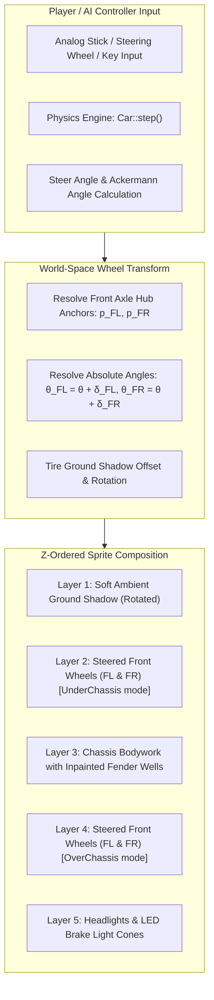
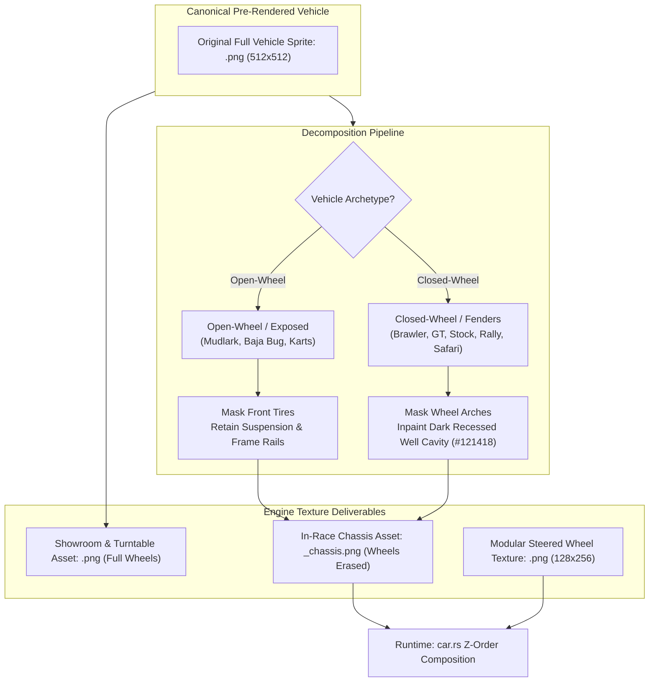

# Feature Spec: Realistic Vehicle Sprite Harmonization and Modular Steered Wheel Articulation 🏎️✨🛞

A comprehensive vehicle roster, visual harmonization, and rendering pipeline specification that:
1. Codifies a balanced **12-vehicle Classic Arcade roster (2 models per category)** across all 6 motorsport disciplines (Karts, GT, Stock Cars, Rallycross, Autocross, All-Terrain), favoring accessible, tactile vintage and retro machinery over extreme overpowered hypercars.
2. Formally distinguishes between the two graphical paradigms in the engine (**"Flat 2D Vector Primitives"** vs. **"High-Fidelity Pre-Rendered Orthographic Sprites"**) and standardizes the entire Classic roster on photorealistic pre-rendered orthographic assets.
3. Implements the **Sprite Wheel Erasure and Fender Inpainting Pipeline**, providing every vehicle with a dual-sprite contract (canonical full-vehicle sprite for showroom/menus and isolated chassis sprite with transparent wheel wells for active race rendering).
4. Deploys dynamic, physically accurate **Ackermann-steered modular wheel animations** across all 12 vehicles in the Classic module.

---

## 🗺️ User Flow & Interface Design

### 1. In-Race Top-Down (Cenital) Dynamic Steering Articulation
In top-down racing view, vehicle steering transforms from static sliding tiles into articulated mechanical racecraft:



* **Straight-Line Tracking ($\text{steer\_angle} = 0^\circ$):** Front wheels align parallel to vehicle heading $\hat{\mathbf{f}}$, perfectly matching the chassis centerline with zero jitter.
* **Cornering & Turn-In ($\text{steer\_angle} \ne 0^\circ$):** Front wheels visibly deflect into the corner. Inner tire turns at a sharper angle than the outer tire according to authentic Ackermann geometry ($\lvert\delta_{\text{inner}}\rvert > \lvert\delta_{\text{outer}}\rvert$).
* **Slide & Counter-Steer Dynamics:** When drifting or counter-steering through a dirt berm power slide, the front wheels visibly point into the counter-steer direction while the car body slides sideways, giving immediate, intuitive visual feedback on vehicle yaw rate and traction limit.
* **Airborne Jumps & Ramps:** As elevation lift $z_{\text{lift}}$ increases, front wheel ground shadows expand and fade synchronously with chassis drop shadows, preserving 2.5D spatial depth.

### 2. Garage & Showroom Turntable Interaction
* In the 3D/2.5D Garage and Showroom (`GameState::Garage`), vehicles display their lateral 1024px render on the turntable for livery inspection.
* All 12 Classic vehicles present realistic volumetric lighting, metallic paint reflections, visible cockpit details, and textured engine assemblies.
* When inspecting top-down views or toggling test steering in the garage, wheel rotation reflects real-time stick inputs.

---

## 🎨 Graphic Style Nomenclature & Differentiation

To maintain clear communication across design documentation, engine code, and asset pipelines, the two graphical paradigms are formally codified:

| Dimension | Style 1: Flat 2D Vector Primitives | Style 2: High-Fidelity Pre-Rendered Orthographic |
| :--- | :--- | :--- |
| **Formal Name** | **Flat Geometric Vector** / **2D Primitive Schematic** | **Pre-Rendered Pseudo-3D** / **High-Fidelity Orthographic Sprite** |
| **Asset Origin** | Programmatic PIL `ImageDraw` shapes (polygons, lines, rounded rects) | 3D CAD/blender renders or high-detail digital orthographic illustrations |
| **Lighting Model** | Unlit flat solid RGB color fills with uniform borders | Directional diffuse shading, specular highlights, and ambient occlusion (AO) |
| **Materials & Depth** | Uniform single-tone surfaces; no micro-textures | Carbon fiber weave, metallic clearcoat flakes, tinted glass transparency |
| **Perspective** | Pure 2D flat blueprint / schematic | 90° zenith orthographic projection with authentic volumetric depth |
| **Wheel Integration** | Painted rectangles; crude rectangular mask cutout | Decomposed dual-layer: isolated chassis with inpainted wells + modular tires |
| **Aesthetic Role** | Prototype placeholder / retro vector arcade | Production-grade 2.5D modern arcade motorsport |

---

## 🏁 The 12-Vehicle Classic Roster Specification (2x Per Category)

Following design consensus, high-power hypercars ($> 700\text{ BHP}$) are reserved for the specialized career disciplines. The Classic module focuses on **accessible, lightweight, tactile retro/vintage machines**:

```
                              TDRACE CLASSIC ROSTER (12 CARS)
┌──────────────┬───────────────────────────────────┬───────────────────────────────────┐
│ CATEGORY     │ MODEL 1 (Accessible Modern/Club)  │ MODEL 2 (Vintage / Retro Classic) │
├──────────────┼───────────────────────────────────┼───────────────────────────────────┤
│ 🏁 Karts     │ Turbo Dart 200cc (Sprint Kart)    │ Comet 100 Classic (1970s Vintage) │
│ 🏎️ GT        │ Apex Phantom GT (Clubman Coupe)   │ Corsica '73 RS (Classic Vintage)  │
│ 🏁 Stock     │ Thunderbolt Stock V8 (90s Cup)    │ Cyclone '69 Fastback (Muscle)     │
│ 🌲 RX        │ Trailfire Turbo 4WD (80s Group B) │ Firebolt RS 2000 (70s RWD Slider) │
│ 🚜 AX        │ Mudlark Cross Car (RWD 850cc)     │ Brawler Touring AX (2.0L Retro)   │
│ 🏔️ Terrain   │ Vortex Baja Buggy (Air-Cooled Bug)│ Ironclad 4x4 Safari (Vintage 4WD) │
└──────────────┴───────────────────────────────────┴───────────────────────────────────┘
```

### 1. Karting (2 Models)
1. **Turbo Dart 200cc** (`classic_kart`) — *Retained & Polished*
   - **Archetype**: Modern 200cc 2-stroke sprint kart (45 BHP, 180 kg, top speed 115 km/h).
   - **Physics & Dynamics**: Direct 1:1 steering response, high apex grip, approachable contemporary micro-kart.
2. **Comet 100 Classic** (`classic_kart_vintage`) — *New 1970s Grassroots Kart*
   - **Archetype**: 1970s Air-Cooled Direct-Drive Kart (22 BHP, 100cc Single, 145 kg, top speed 88 km/h).
   - **Visuals**: Chrome tubular side nerf bars, finned air-cooled cylinder head, direct-drive clutch, metal 3-spoke steering wheel.
   - **Dynamics**: Narrower vintage tires that slide gently across curbs, rewarding momentum conservation.

### 2. GT / Road Racing (2 Models)
1. **Apex Phantom GT** (`classic_gt`) — *Rebalanced to Clubman Spec*
   - **Archetype**: Modern Clubman Sports Coupe (rebalanced to 350 BHP, 4.0L N/A V8, 1,180 kg, top speed 205 km/h).
   - **Physics & Dynamics**: Balanced front-engine/rear-transaxle sports coupe (Cayman/Alpine style), forgiving slide recovery, predictable braking.
2. **Corsica '73 RS** (`classic_gt_vintage`) — *New 1970s Classic Sports Racer*
   - **Archetype**: 1973 Vintage Air-Cooled Classic GT (230 BHP, 2.7L Flat-6, 960 kg, top speed 192 km/h).
   - **Visuals**: Classic ducktail spoiler, round chrome-ringed headlights, Fuchs-style alloy rims, dual mechanical carburetors.
   - **Dynamics**: Skinny vintage radial tires that break away into glorious, controllable 4-wheel neutral drifts through long sweeping asphalt corners.

### 3. Stock Cars / Oval Speedways (2 Models)
1. **Thunderbolt Stock V8** (`classic_nascar`) — *Rebalanced*
   - **Archetype**: 1990s Golden Era Steel-Body Stocker (580 BHP pushrod V8, 1,320 kg, top speed 235 km/h).
   - **Physics & Dynamics**: Planted rear axle, heavy momentum, roaring side exhaust rumble; built for bump-drafting and stable high-speed banked turns.
2. **Cyclone '69 Fastback** (`classic_stock_vintage`) — *New 1960s Muscle Stocker*
   - **Archetype**: 1969 Grand National Muscle Stock Car (420 BHP, 7.0L Big-Block V8, 1,450 kg, top speed 225 km/h).
   - **Visuals**: Aggressive recessed chrome grille, fastback roofline, steel wheels with yellow painted stencil lettering, zero downforce wings.
   - **Dynamics**: Heavy front-end weight transfer and bias-ply tire slide; requires feathering the throttle to keep the tail tucked in on short tracks like Thunder Bowl.

### 4. Rallycross (RX) (2 Models)
1. **Trailfire Turbo 4WD** (`classic_rally`) — *Rebalanced*
   - **Archetype**: 1980s Group B Turbo Hatchback (rebalanced to 320 BHP, 2.0L Turbo, 1,020 kg, 50:50 AWD, top speed 205 km/h).
   - **Physics & Dynamics**: Explosive boost delivery, prominent roof snorkel, boxy rally flares, high jump composure over ramps.
2. **Firebolt RS 2000** (`classic_rx_vintage`) — *New 1970s RWD Rally Legend*
   - **Archetype**: 1970s Lightweight RWD Rally Coupe (Escort Mk2 style, 205 BHP, 2.0L Twin-Cam 16V, 920 kg, top speed 185 km/h).
   - **Visuals**: Dual circular auxiliary spotlights on the nose, four-spoke classic rally wheels, flared wheel arches, ducktail trunk lip.
   - **Dynamics**: The ultimate counter-steering playground! RWD with mechanical limited-slip diff lets players pitch the car sideways on gravel and steer with the throttle.

### 5. Autocross (AX) (2 Models)
*Note: The overpowered 560 BHP `classic_ax_talon` is retired to maintain the 2-car per category standard.*
1. **Mudlark Cross Car** (`classic_ax_mudlark`) — *Upgraded to Realistic Orthographic*
   - **Archetype**: Single-seat 850cc motorcycle-powered Cross Car (150 BHP, RWD, 420 kg, top speed 160 km/h).
   - **Visuals**: Sculpted fiberglass nosecone, tubular chromoly spaceframe, central racing seat, exposed wishbones and steering rods.
   - **Dynamics**: Ultra-lightweight, razor-sharp front turn-in, darting agility on tight dirt tracks.
2. **Brawler Touring AX** (`classic_ax_brawler`) — *Upgraded to Realistic Orthographic & Rebalanced*
   - **Archetype**: Retro 1980s Touring Autocross Silhouette (rebalanced from 420 to 250 BHP, 2.0L Turbo Boxer, 1,080 kg, AWD, top speed 175 km/h).
   - **Visuals**: Sturdy box-flared bodywork with mudflaps, roof scoop, large composite wing, deep recessed fender wells.
   - **Dynamics**: Heavy and planted, built to slide wide through banked dirt berms.

### 6. All-Terrain (Mud, Sand, Snow) (2 Models)
*Covers `at_dune_sea` (sand), `at_mudbath_valley` (mud), and `at_frostbite_pass` (snow/ice).*
1. **Vortex Baja Buggy** (`classic_offroad`) — *Adapted from Dune Crusher to Air-Cooled Baja Bug*
   - **Target Terrain**: Sand dunes and high-jump stunt courses (`at_dune_sea`).
   - **Archetype**: 1970s Air-Cooled Baja Stunt Buggy (190 BHP, 2.2L Boxer, RWD, 780 kg, top speed 180 km/h).
   - **Visuals**: Truncated bug nose, exposed rear air-cooled engine with high stinger exhaust, long-travel front beam suspension, rooftop lightbar.
   - **Dynamics**: Highly compliant jump landings and playful low-weight sand flotation.
2. **Ironclad 4x4 Safari** (`classic_at_safari`) — *New Vintage All-Terrain Rig*
   - **Target Terrain**: Deep mud sludge and slippery snow/ice (`at_mudbath_valley`, `at_frostbite_pass`).
   - **Archetype**: 1980s Paris-Dakar Vintage 4WD Trail Rig (Land Cruiser / Range Rover style, 240 BHP, 4.0L Straight-6, 1,420 kg, top speed 168 km/h).
   - **Visuals**: Upright classic boxy silhouette, snorkel intake, heavy-duty winch bumper, roof-rack with spare tire, deep-groove all-terrain tires.
   - **Dynamics**: Heavy, unstoppable 4WD traction that bulldozes through thick mud and tracks cleanly across slick ice ruts.

---

## 🛞 The Sprite Wheel Erasure and Fender Inpainting Pipeline

To enable modular, animated steered wheels without visual artifacts, every vehicle requires two synchronized top-down textures:



### 1. Dual Sprite Standard
1. **Canonical Sprite (`assets/textures/vehicles/topdown/classic/<id>.png`)**:
   - Contains the complete vehicle with static wheels rendered in neutral forward alignment ($0^\circ$).
   - Used for garage inspection, showroom turntable, modality selector cards, and static UI icons.
2. **Chassis Sprite (`assets/textures/vehicles/topdown/classic/<id>_chassis.png`)**:
   - Contains the vehicle bodywork with front wheels cleanly erased to transparent alpha ($A = 0$).
   - Used in-game during active race simulation.

### 2. Wheel Erasure & Inpainting Rules by Archetype
* **Open-Wheel Archetypes (`WheelLayerMode::OverChassis`)**:
  - Front tire rubber and rims are cleanly removed.
  - Suspension wishbones, steering arms, brake disc hubs, and chassis pick-up points must NOT be erased.
  - Wheels render atop/alongside the chassis quad.
* **Closed-Wheel Archetypes (`WheelLayerMode::UnderChassis`)**:
  - The tire protruding into the fender opening is erased.
  - Rather than leaving a hollow transparent void that reveals the race track or grass underneath, the inner fender well must be **inpainted with dark ambient shadow** (`#101216` to `#181c22`, 95% opacity).
  - When the modular wheel steers underneath the chassis quad, it seamlessly turns inside the dark fender pocket without edge halos or see-through chassis holes.

---

## ⚙️ Backend Models & API Endpoints

### 1. Mathematical & Physical Geometry Model

#### Dynamic Ackermann Angle Resolution
At any simulation tick, the steering geometry resolves differential inner/outer steer angles based on vehicle wheelbase ($L = l_f + l_r$) and front track width ($W_f = 2 \cdot w_f$):

$$\delta_{\text{Ackermann}} = \text{compute\_ackermann\_angles}(\delta_{\text{steer}})$$

Given current chassis orientation angle $\theta_{\text{car}}$, unit forward vector $\hat{\mathbf{f}}$, and unit right vector $\hat{\mathbf{r}}$:

$$\hat{\mathbf{f}} = \begin{pmatrix} \cos\theta_{\text{car}} \\ \sin\theta_{\text{car}} \end{pmatrix}, \quad \hat{\mathbf{r}} = \begin{pmatrix} \sin\theta_{\text{car}} \\ -\cos\theta_{\text{car}} \end{pmatrix}$$

#### World-Space Wheel Hub Anchor Coordinates
Front-left (FL) and front-right (FR) wheel hubs are positioned relative to the dynamic `chassis_center`:

$$\mathbf{p}_{\text{FL}} = \mathbf{p}_{\text{chassis}} + \hat{\mathbf{f}} \cdot l_f - \hat{\mathbf{r}} \cdot w_f$$

$$\mathbf{p}_{\text{FR}} = \mathbf{p}_{\text{chassis}} + \hat{\mathbf{f}} \cdot l_f + \hat{\mathbf{r}} \cdot w_f$$

#### Absolute Wheel World Orientations
Each front wheel pivots around its individual hub center:

$$\theta_{\text{FL}} = \theta_{\text{car}} + \delta_{\text{FL}}$$

$$\theta_{\text{FR}} = \theta_{\text{car}} + \delta_{\text{FR}}$$

### 2. Declarative Wheel Calibration Registry (`crates/tdrace-app/src/render/vehicle_assets.rs`)
All 12 Classic vehicles are registered with precise geometric coordinates in `SteeredWheelConfig`:

```rust
pub fn get_steered_wheel_config(model_id: &str) -> Option<SteeredWheelConfig> {
    match model_id {
        // Karting
        "classic_kart" => Some(SteeredWheelConfig {
            wheel_texture_id: "kart_slick_front",
            front_axle_offset: 0.41,
            half_track_width: 0.39,
            wheel_size: glam::Vec2::new(0.20, 0.28),
            layering: WheelLayerMode::OverChassis,
        }),
        "classic_kart_vintage" => Some(SteeredWheelConfig {
            wheel_texture_id: "kart_slick_front",
            front_axle_offset: 0.39,
            half_track_width: 0.36,
            wheel_size: glam::Vec2::new(0.18, 0.26),
            layering: WheelLayerMode::OverChassis,
        }),

        // GT / Road Racing
        "classic_gt" => Some(SteeredWheelConfig {
            wheel_texture_id: "gt_slick_front",
            front_axle_offset: 0.75,
            half_track_width: 0.48,
            wheel_size: glam::Vec2::new(0.24, 0.48),
            layering: WheelLayerMode::UnderChassis,
        }),
        "classic_gt_vintage" => Some(SteeredWheelConfig {
            wheel_texture_id: "gt_slick_front",
            front_axle_offset: 0.71,
            half_track_width: 0.44,
            wheel_size: glam::Vec2::new(0.22, 0.46),
            layering: WheelLayerMode::UnderChassis,
        }),

        // Stock Cars
        "classic_nascar" => Some(SteeredWheelConfig {
            wheel_texture_id: "nascar_wheel_front",
            front_axle_offset: 0.66,
            half_track_width: 0.51,
            wheel_size: glam::Vec2::new(0.26, 0.50),
            layering: WheelLayerMode::UnderChassis,
        }),
        "classic_stock_vintage" => Some(SteeredWheelConfig {
            wheel_texture_id: "nascar_wheel_front",
            front_axle_offset: 0.72,
            half_track_width: 0.49,
            wheel_size: glam::Vec2::new(0.26, 0.50),
            layering: WheelLayerMode::UnderChassis,
        }),

        // Rallycross
        "classic_rally" => Some(SteeredWheelConfig {
            wheel_texture_id: "rally_wheel_front",
            front_axle_offset: 0.73,
            half_track_width: 0.41,
            wheel_size: glam::Vec2::new(0.24, 0.46),
            layering: WheelLayerMode::UnderChassis,
        }),
        "classic_rx_vintage" => Some(SteeredWheelConfig {
            wheel_texture_id: "rally_wheel_front",
            front_axle_offset: 0.69,
            half_track_width: 0.40,
            wheel_size: glam::Vec2::new(0.22, 0.44),
            layering: WheelLayerMode::UnderChassis,
        }),

        // Autocross
        "classic_ax_mudlark" => Some(SteeredWheelConfig {
            wheel_texture_id: "offroad_wheel_front",
            front_axle_offset: 0.85,
            half_track_width: 0.55,
            wheel_size: glam::Vec2::new(0.24, 0.48),
            layering: WheelLayerMode::OverChassis,
        }),
        "classic_ax_brawler" => Some(SteeredWheelConfig {
            wheel_texture_id: "rally_wheel_front",
            front_axle_offset: 0.75,
            half_track_width: 0.44,
            wheel_size: glam::Vec2::new(0.25, 0.48),
            layering: WheelLayerMode::UnderChassis,
        }),

        // All-Terrain
        "classic_offroad" => Some(SteeredWheelConfig {
            wheel_texture_id: "offroad_wheel_front",
            front_axle_offset: 0.98,
            half_track_width: 0.62,
            wheel_size: glam::Vec2::new(0.28, 0.58),
            layering: WheelLayerMode::OverChassis,
        }),
        "classic_at_safari" => Some(SteeredWheelConfig {
            wheel_texture_id: "offroad_wheel_front",
            front_axle_offset: 0.82,
            half_track_width: 0.48,
            wheel_size: glam::Vec2::new(0.26, 0.54),
            layering: WheelLayerMode::UnderChassis,
        }),

        _ => None,
    }
}
```

---

## 🛡️ Security & Role-Based Access Controls (RBAC)

### 1. Memory Safety & Texture Allocation Guardrails
* **Texture Dimension Sanity:** Wheel and chassis textures enforce strict dimension bounds ($\max 512 \times 512\,\text{px}$ top-down, $\max 1024 \times 512\,\text{px}$ lateral, 8-bit RGBA) to guard against unbounded GPU memory allocations.
* **Deterministic Lifetime & Thread-Safe Caching:** All textures are retained in thread-safe static caches (`WHEEL_TEXTURE_CACHE`, `TOPDOWN_CACHE`, `LATERAL_CACHE`) protected by `std::sync::Mutex` with poison-recovery (`unwrap_or_else(|e| e.into_inner())`).

### 2. Headless Simulation Invariance & Sandbox Isolation
* **Zero Graphics Dependency in Simulation:** Physics stepping in `crates/wheelbase` and `crates/tdrace-core` remains strictly isolated from graphics and macroquad texture handles. Simulation runs headless at $> 100,000\,\text{steps/sec}$ with zero graphics calls.
* **Presentation-Layer Isolation:** Wheel visual deflection is an aesthetic presentation layer governed by `CarState.steer_angle`. Alterations to wheel rendering never influence vehicle collision boundaries (OBB SAT collision quads) or tire grip dynamics.

---

## 🧪 Verification & Acceptance Criteria

### Automated Tests
- Command to verify rendering pipeline: `cargo test -p tdrace-app --test render_tests`
- Command to verify asset presence and format integrity: `python scripts/verify_vehicle_assets.py`
- Command to verify simulator determinism: `cargo test -p wheelbase`

### Manual Acceptance Criteria (Pseudo-Gherkin)

- **Scenario: 12-car Classic roster availability and visual style consistency**
  - [x] **Given** the player navigates to the Classic Arcade vehicle selector or garage
  - [x] **When** browsing the 12 available models across Karts, GT, Stock, RX, AX, and All-Terrain
  - [x] **Then** all 12 vehicles must exhibit high-fidelity pre-rendered orthographic shading with realistic diffuse/specular lighting and volumetric depth
  - [x] **And** no vehicles must appear with flat vector 2D polygon sketch outlines

- **Scenario: Dynamic livery colorway tinting on realistic classic sprites**
  - [x] **Given** a player applies a custom primary and secondary color scheme to any of the 12 classic vehicles
  - [x] **When** the vehicle is rendered on the garage turntable or during a race
  - [x] **Then** the primary bodywork and secondary accents must reflect the selected colorway
  - [x] **And** metallic highlights, cockpit shadows, and dark inner wheel wells must remain uncorrupted

- **Scenario: Dynamic Ackermann wheel steering animation across all 12 classic vehicles**
  - [x] **Given** an active race session with any of the 12 Classic vehicles
  - [x] **When** the driver turns the steering wheel left or right
  - [x] **Then** the front-left and front-right modular wheel sprites must rotate smoothly according to physical Ackermann angles
  - [x] **And** no residual pre-baked wheel graphics or clipping artifacts must appear on the chassis sprite

- **Scenario: Clean wheel arch and fender inpainting on closed-wheel vehicles**
  - [x] **Given** a closed-wheel vehicle (`classic_gt`, `classic_gt_vintage`, `classic_nascar`, `classic_stock_vintage`, `classic_rally`, `classic_rx_vintage`, `classic_ax_brawler`, `classic_at_safari`) cornering at full steering lock
  - [x] **When** the front wheels rotate inside the fender wells under `WheelLayerMode::UnderChassis`
  - [x] **Then** the wheel must rotate inside a dark inpainted fender cavity without transparent track ground bleeding through the bodywork

- **Scenario: Suspension linkage preservation on open-wheel vehicles**
  - [x] **Given** an open-wheel vehicle (`classic_kart`, `classic_kart_vintage`, `classic_ax_mudlark`, `classic_offroad`) cornering at full steering lock
  - [x] **When** the front wheels steer under `WheelLayerMode::OverChassis`
  - [x] **Then** the front suspension arms, nerf bars, or frame rails must remain fully visible connecting the chassis to the steered wheel hub

- **Scenario: Canonical full-vehicle sprite preservation in showroom and menus**
  - [x] **Given** any of the 12 classic vehicles viewed in the garage turntable or vehicle selection menu
  - [x] **When** `get_vehicle_topdown_texture` or `get_vehicle_lateral_texture` is called
  - [x] **Then** the canonical complete sprite (`<id>.png`) must be loaded with authentic static wheels intact for display

---

## 🔗 Traceability & Codebase Mapping

### Created / Modified Files

| Action | Path | Purpose |
| :--- | :--- | :--- |
| `[MODIFY]` | `specs/073_realistic_vehicle_sprite_harmonization_and_modular_steered_wheel_articulation.md` | Formal approved specification contract. |
| `[MODIFY]` | `specs/constitution/ROADMAP.md` | Registers Spec 073 in Phase 6 roadmap. |
| `[MODIFY]` | `specs/index.md` | Updates Keel progressive disclosure catalog. |
| `[MODIFY]` | `scripts/generate_classic_fantasy_sprites.py` | Asset generation pipeline for all 12 classic vehicles and their dual top-down/lateral textures. |
| `[NEW/REPLACE]` | `assets/textures/vehicles/laterals/classic/*` | 1024px lateral textures and 256px thumbnails for all 12 vehicles. |
| `[NEW/REPLACE]` | `assets/textures/vehicles/topdown/classic/*` | 512px canonical top-down sprites and chassis sprites with wheels erased for all 12 vehicles. |
| `[MODIFY]` | `crates/tdrace-app/src/module/classic.rs` | Registers the 12 vehicle definitions, audio profiles, and physics configs in `ClassicGameModule`. |
| `[MODIFY]` | `crates/tdrace-app/src/catalog/mod.rs` | Registers the 12 vehicle definitions in `CLASSIC_ARCADE_CARS`. |
| `[MODIFY]` | `crates/tdrace-app/src/render/vehicle_assets.rs` | Implements `SteeredWheelConfig` and tint masks for all 12 classic vehicles. |
| `[MODIFY]` | `crates/tdrace-app/tests/render_tests.rs` | Unit and integration tests for 12-vehicle dual sprites and Ackermann steering deflection. |
