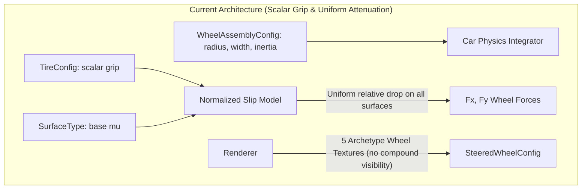
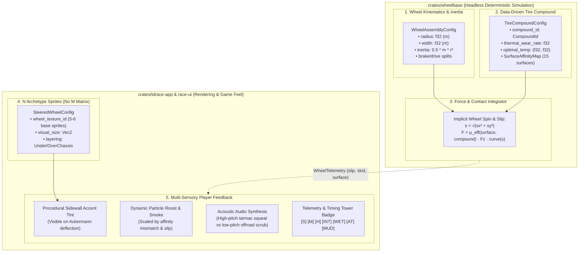

# Architecture Spec: Decoupled Wheel Geometry, Dynamic Tire Compound Affinities, and Presentation Articulation 🏎️⚙️🛞

A comprehensive vehicle dynamics, tire physics, and visual rendering architecture specification for **TDRace**. Operating across the deterministic [`crates/wheelbase`](../crates/wheelbase) simulation engine and the [`crates/tdrace-app`](../crates/tdrace-app) presentation shell, this architecture formally decouples **Physical Wheel Geometry & Kinematics** from **Data-Driven Tire Compounds & Surface Affinities**, eliminates the $N \times M$ visual asset matrix, guarantees bit-identical headless simulation throughput ($> 4,000,000\,\text{steps/sec}$), and establishes an authentic multi-sensory player feedback pipeline in top-down racing view.

---

## 🗺️ Current vs. Proposed System Architecture

### 1. Current Architecture (Monolithic Scalar Grip & Coupled Asset Expectations)

Under the current architecture implemented in [`specs/028_decoupled_tire_physics_and_wheel_components.md`](028_decoupled_tire_physics_and_wheel_components.md) and [`specs/043_vehicle_dynamics_rebuild_and_simplified_handling_settings.md`](043_vehicle_dynamics_rebuild_and_simplified_handling_settings.md):

* **Monolithic Scalar Grip Factor**: While wheels possess independent physical assemblies ([`WheelAssemblyConfig`](../crates/wheelbase/src/config.rs)), tire grip is modulated through a single scalar multiplier (`TireConfig::grip: f32`) applied uniformly across all 15 [`SurfaceType`](../crates/wheelbase/src/surface.rs) terrain variants:
  $$\mu_{\text{effective}} = \mu_{\text{surface}} \cdot \text{grip} \cdot \text{sensitivity}(F_z)$$
  Consequently, a road racing slick tire and an extreme mud tire experience identical *relative* traction degradation when leaving asphalt for mud or ice. There is no compound affinity per terrain type.
* **Combinatorial Asset Hazard**: Introducing distinct tire compound visuals (e.g., Slicks, Mediums, Hards, Inters, Wets, All-Terrain, Extreme Mud) across multiple vehicle sizes (Kart, GT, Stock, Rally, Off-Road) tempts a combinatorial $N \times M$ asset explosion ($5 \text{ sizes} \times 6 \text{ compounds} = 30$ separate textures).
* **Top-Down Perspective Reality**: In a $60\text{--}120\,\text{FPS}$ top-down orthographic camera (viewport width $25\text{--}45\,\text{m}$), a tire footprint occupies only $8\text{ to }24\,\text{pixels}$ on screen. Intricate tread patterns (sipes, rain grooves, mud knobs) produce sub-pixel aliasing or blur into uniform dark gray through mipmapping.
* **Crate Boundary Isolation**: Core simulation crates like `wheelbase` must never leak rendering assets, texture identifiers, or UI descriptors into the physical state, preserving pure headless reinforcement learning environments.



---

### 2. Proposed Architecture (Decoupled Geometry, Affinity Matrix & Sensory Feedback)

The proposed architecture establishes a strict separation across three orthogonal layers:

1. **Kinematic & Mass Geometry (Simulation Core — `crates/wheelbase`)**:
   Independent rolling radius ($r_i$), contact patch width ($w_i$), wheel corner mass ($m_i$), and derived polar rotational inertia ($I_i = \frac{1}{2} m_i r_i^2$).
2. **Data-Driven Tire Compound & Surface Affinity (Simulation Core — `crates/wheelbase`)**:
   Standardized compound configurations with thermal operating envelopes, mechanical wear rates, and a full 15-surface affinity lookup matrix:
   $$\mu_{\text{compound\_eff}}(\text{surface}) = \mu_{\text{base}}(\text{surface}) \cdot \text{affinity}(\text{compound}, \text{surface}) \cdot \text{grip}_{\text{base}}$$
3. **Visual Archetypes & Procedural Sidewall Accents (Presentation — `crates/tdrace-app`)**:
   $N$ visual wheel archetypes (Kart, Open-Wheel, GT/Sports, Stock/NASCAR, Rally, Off-Road) dynamically articulated with Ackermann steering, combined with procedural sidewall compound color accents and multi-sensory gameplay cues (roost, smoke, audio frequency scrub, haptic feedback, and HUD badges).



---

## 🛞 The $N + M$ Asset & Compound Matrix Decoupling

By decoupling physical geometry from chemical compound definitions, adding a new tire profile requires **zero new textures, zero UV remapping, and zero artist intervention**:

| Category | Wheel Archetype ($N$) | Physical Radius ($r$) | Physical Width ($w$) | Compatible Compounds ($M$) | Visual Sprites Required |
| :--- | :--- | :--- | :--- | :--- | :--- |
| **Karting** | `kart_wheel` | $0.13\text{ m}$ | $0.18\text{ m}$ (front) / $0.26\text{ m}$ (rear) | Soft, Medium, Hard, Wet | **1 front / 1 rear** |
| **Formula / Open-Wheel** | `openwheel_wheel` | $0.33\text{ m}$ | $0.30\text{ m}$ (front) / $0.40\text{ m}$ (rear) | C1 Hard $\to$ C5 Soft, Wet, Inter | **1 front / 1 rear** |
| **GT / Touring** | `gt_wheel` | $0.34\text{ m}$ | $0.27\text{ m}$ (front) / $0.33\text{ m}$ (rear) | Soft Slick, Hard Slick, Intermediate, Wet | **1 front / 1 rear** |
| **Stock / NASCAR** | `nascar_wheel` | $0.35\text{ m}$ | $0.30\text{ m}$ (uniform 4 corners) | Speedway Hard, Short-Track Soft, Road Course | **1 texture** |
| **Rally / Rallycross** | `rally_wheel` | $0.32\text{ m}$ | $0.22\text{ m}$ (uniform 4 corners) | Tarmac Slick, Gravel Medium, Studded Snow | **1 texture** |
| **Extreme Off-Road** | `offroad_wheel` | $0.45\text{ m}$ | $0.32\text{ m}$ (uniform 4 corners) | All-Terrain ATX, Mud Bogger, Sand Paddle | **1 texture** |

**Total texture requirement**: **6 visual archetypes** (or 8 counting staggered kart/formula rears) instead of $6 \times 8 = 48$ combinations.

---

## ⚙️ Physics Core Specifications (`crates/wheelbase`)

### 1. Data-Driven Tire Compound Definitions

The tire compound specifies chemical, thermal, and friction characteristics without any presentation metadata:

```rust
// In crates/wheelbase/src/tire.rs or crates/wheelbase/src/compound.rs

/// Standardized motorsport tire compound identifiers.
#[derive(Debug, Clone, Copy, PartialEq, Eq, Hash, Serialize, Deserialize)]
pub enum CompoundId {
    /// Ultra-high grip asphalt slick with rapid thermal degradation.
    SoftSlick,
    /// Balanced dry asphalt competition slick.
    MediumSlick,
    /// Durable endurance asphalt slick with high heat resistance.
    HardSlick,
    /// Grooved transitional tire for damp tracks and standing drizzle.
    IntermediateWet,
    /// Deep-tread directional rain tire with maximum hydroplaning evacuation.
    MonsoonWet,
    /// Dual-purpose multi-surface tire for gravel, dirt, and light tarmac.
    AllTerrain,
    /// Heavy open-lug mud and sand tire with high loose-soil bite.
    ExtremeMud,
    /// Steel-studded winter competition tire for hard-packed snow and sheet ice.
    StuddedIce,
}

/// Static compound profile governing friction, wear, and surface affinities.
#[derive(Debug, Clone, PartialEq, Serialize, Deserialize)]
pub struct TireCompoundConfig {
    /// Unique compound identifier.
    pub id: CompoundId,
    /// Human-readable display label (e.g. "Soft Slick", "All-Terrain ATX").
    pub name: &'static str,
    /// Baseline compound grip multiplier on optimal surface (nominally 1.0).
    pub base_grip: f32,
    /// Slip angle in degrees where lateral force peaks (sharp: 6-8°, progressive: 12-14°).
    pub peak_slip_angle_deg: f32,
    /// Longitudinal slip ratio where traction peaks (typically 0.08 - 0.15).
    pub peak_slip_ratio: f32,
    /// Friction retention ratio during deep sliding [0.6 = snappy drop, 1.0 = plateau].
    pub slide_grip: f32,
    /// Rate of mechanical tread loss per unit of frictional dissipation energy (1/J).
    pub wear_rate: f32,
    /// Optimal bulk tread temperature window (°C) [T_min, T_max].
    pub optimal_temp_range: (f32, f32),
    /// Critical overheat temperature (°C) where rubber blistering rapidly reduces grip.
    pub overheat_temp: f32,
    /// Complete affinity multiplier matrix across all 15 SurfaceTypes.
    pub surface_affinity: SurfaceAffinityMap,
}
```

---

### 2. The 15-Surface Affinity Matrix (`SurfaceAffinityMap`)

Every compound defines an affinity multiplier $\eta \in [0.1, 1.4]$ across all 15 [`SurfaceType`](../crates/wheelbase/src/surface.rs) terrain variants:

$$\mu_{\text{effective}} = \mu_{\text{base}}(\text{surface}) \cdot \eta(\text{compound}, \text{surface}) \cdot \text{grip}_{\text{base}} \cdot \kappa_{\text{thermal}} \cdot \kappa_{\text{wear}} \cdot \kappa_{\text{load}}(F_z)$$

```rust
/// Compact 15-element array mapping each SurfaceType to its compound friction multiplier.
#[derive(Debug, Clone, Copy, PartialEq, Serialize, Deserialize)]
pub struct SurfaceAffinityMap {
    affinities: [f32; 15],
}

impl SurfaceAffinityMap {
    #[inline]
    pub const fn new(affinities: [f32; 15]) -> Self {
        Self { affinities }
    }

    #[inline]
    pub fn get(&self, surface: SurfaceType) -> f32 {
        self.affinities[surface as usize]
    }
}
```

#### Standard Calibrated Compound Affinities ($\eta$):

| Surface (`SurfaceType`) | Soft Slick | Hard Slick | Intermediate Wet | Monsoon Wet | All-Terrain | Extreme Mud | Studded Ice |
| :--- | :---: | :---: | :---: | :---: | :---: | :---: | :---: |
| **Asphalt** | **1.20** | **1.00** | 0.88 | 0.72 | 0.85 | 0.65 | 0.50 |
| **Concrete** | **1.18** | **0.98** | 0.86 | 0.70 | 0.83 | 0.62 | 0.48 |
| **Curb** | 1.10 | 0.95 | 0.85 | 0.75 | 0.88 | 0.70 | 0.55 |
| **Dirt** | 0.45 | 0.40 | 0.65 | 0.70 | **1.15** | **1.10** | 0.80 |
| **Gravel** | 0.35 | 0.30 | 0.55 | 0.60 | **1.20** | **1.05** | 0.75 |
| **Grass** | 0.30 | 0.30 | 0.50 | 0.60 | **0.95** | **1.00** | 0.60 |
| **PackedSand** | 0.30 | 0.25 | 0.40 | 0.45 | **1.10** | **1.25** | 0.50 |
| **DeepSand** | 0.15 | 0.15 | 0.25 | 0.30 | 0.80 | **1.35** | 0.40 |
| **MudTrack** | 0.25 | 0.20 | 0.50 | 0.65 | **1.05** | **1.30** | 0.60 |
| **DeepMud** | 0.10 | 0.10 | 0.25 | 0.40 | 0.75 | **1.40** | 0.40 |
| **PackedSnow** | 0.15 | 0.12 | 0.30 | 0.40 | 0.80 | 0.90 | **1.35** |
| **DeepSnow** | 0.10 | 0.08 | 0.20 | 0.30 | 0.70 | **1.10** | **1.30** |
| **SheetIce** | 0.05 | 0.05 | 0.15 | 0.20 | 0.40 | 0.50 | **1.45** |
| **Water (Puddles)** | 0.20 | 0.25 | **1.10** | **1.35** | 0.90 | 0.80 | 0.60 |
| **Oil Slick** | 0.10 | 0.10 | 0.15 | 0.20 | 0.25 | 0.25 | 0.20 |

---

### 3. Kinematic Wheel Assembly (`WheelAssemblyConfig`)

In `crates/wheelbase/src/config.rs`, `WheelAssemblyConfig` retains strict physical ownership of dimensions and dynamics, while embedding the active `TireCompoundConfig`:

```rust
/// Configuration for an individual wheel corner or axle assembly.
#[derive(Debug, Clone, PartialEq, Serialize, Deserialize)]
pub struct WheelAssemblyConfig {
    /// Rolling radius of the tire under nominal load in meters.
    pub tire_radius: f32,
    /// Width of the tire contact patch in meters.
    pub tire_width: f32,
    /// Rotational polar moment of inertia (kg·m²).
    pub rotational_inertia: f32,
    /// Active physical tire compound model governing slip and terrain affinities.
    pub compound: TireCompoundConfig,
    /// Proportion of total brake torque routed to this wheel [0.0, 1.0].
    pub brake_bias_factor: f32,
    /// Proportion of differential drive torque routed to this wheel [0.0, 1.0].
    pub drive_torque_factor: f32,
}

impl WheelAssemblyConfig {
    /// Constructs a physically consistent wheel assembly where rotational inertia
    /// is derived directly from corner mass: I = 0.5 * m * r^2.
    pub fn from_corner_mass(
        tire_radius: f32,
        tire_width: f32,
        corner_mass: f32,
        compound: TireCompoundConfig,
        brake_bias_factor: f32,
        drive_torque_factor: f32,
    ) -> Self {
        let rotational_inertia = 0.5 * corner_mass * tire_radius * tire_radius;
        Self {
            tire_radius,
            tire_width,
            rotational_inertia,
            compound,
            brake_bias_factor,
            drive_torque_factor,
        }
    }
}
```

---

## 🎨 Presentation & Rendering Specifications (`crates/tdrace-app`)

### 1. Presentation Wheel Configuration (`SteeredWheelConfig`)

In `crates/tdrace-app/src/render/vehicle_assets.rs`, visual wheel bindings remain completely isolated from physics equations:

```rust
/// Presentation configuration for modular vehicle wheel rendering.
#[derive(Debug, Clone, Copy, PartialEq)]
pub struct SteeredWheelConfig {
    /// Texture asset identifier for the base wheel archetype.
    pub wheel_texture_id: &'static str,
    /// Longitudinal distance from vehicle CG to front wheel axle (meters).
    pub front_axle_offset: f32,
    /// Transverse half-track width from vehicle centerline to wheel center (meters).
    pub half_track_width: f32,
    /// Rendered dimensions of the individual wheel [width (thickness), height (diameter)] (meters).
    pub wheel_size: glam::Vec2,
    /// Z-layering mode relative to the chassis bodywork.
    pub layering: WheelLayerMode,
}
```

---

### 2. Procedural Sidewall Compound Accent Coloring

Rather than loading unique textures for every compound, the renderer uses a **procedural compound accent color**:

```rust
impl CompoundId {
    /// FIA-standardized color coding for compound identification.
    pub const fn accent_color(self) -> macroquad::color::Color {
        match self {
            Self::SoftSlick => macroquad::color::Color::new(0.95, 0.15, 0.15, 1.0),      // Red [S]
            Self::MediumSlick => macroquad::color::Color::new(0.95, 0.85, 0.10, 1.0),    // Yellow [M]
            Self::HardSlick => macroquad::color::Color::new(0.90, 0.90, 0.90, 1.0),      // White [H]
            Self::IntermediateWet => macroquad::color::Color::new(0.15, 0.80, 0.20, 1.0),// Green [INT]
            Self::MonsoonWet => macroquad::color::Color::new(0.10, 0.50, 0.95, 1.0),     // Blue [WET]
            Self::AllTerrain => macroquad::color::Color::new(0.95, 0.55, 0.10, 1.0),     // Orange [AT]
            Self::ExtremeMud => macroquad::color::Color::new(0.55, 0.35, 0.15, 1.0),     // Brown [MUD]
            Self::StuddedIce => macroquad::color::Color::new(0.60, 0.90, 1.00, 1.0),     // Cyan [ICE]
        }
    }

    /// Single or two-letter compact acronym for HUD badges.
    pub const fn badge_code(self) -> &'static str {
        match self {
            Self::SoftSlick => "S",
            Self::MediumSlick => "M",
            Self::HardSlick => "H",
            Self::IntermediateWet => "INT",
            Self::MonsoonWet => "W",
            Self::AllTerrain => "AT",
            Self::ExtremeMud => "MUD",
            Self::StuddedIce => "ICE",
        }
    }
}
```

---

## 🏎️ The Multi-Sensory Player Feedback Pipeline

Because top-down resolution prevents seeing micro-tread grooves, player feedback is driven by **tactile, acoustic, and particle dynamics**:

### 1. Dynamic Particle Roost & Spray

Particle emission at each wheel contact patch is governed by wheel slip and surface affinity mismatch:

$$Q_{\text{particles}} = Q_{\text{base}}(\text{surface}) \cdot \left(1.0 + \max(0.0, 1.0 - \eta)\right) \cdot |s_{\text{skid}}|$$

* **Slicks on Asphalt**: Clean lockup produces dense white/blue rubber smoke plumes and persistent pitch-black skid ribbons.
* **Slicks on Mud/Gravel**: Slicks throw massive sprays of muddy clods and stones because the smooth tread fails to channel soil, spinning violently without forward traction.
* **Wets in Standing Water**: High-velocity twin roost plumes of atomized water spray trailing $10\text{--}15\,\text{meters}$ behind the diffuser.
* **Extreme Mud Tires in Bog**: Aggressive, directional projectile rooster tails of heavy earth clods flung backward at wheel rotational velocity $\omega \cdot r$.

---

### 2. Procedural Sound & Acoustic Scrub

The acoustic engine ([`specs/022_per_tier_engine_sound_banks_and_synthesis.md`](022_per_tier_engine_sound_banks_and_synthesis.md)) modulates slip audio synthesis:

* **Tarmac Screech (Slicks)**: High-frequency sinusoidal FM noise ($900\text{--}2400\,\text{Hz}$), pitch-bending upward with slip velocity.
* **Gravel Churn & Mud Slosh (AT / Mud)**: Low-frequency brown noise ($80\text{--}350\,\text{Hz}$) mixed with procedural impact clicks simulating loose pebbles ricocheting off inner wheel wells.
* **Water Aquaplane Whoosh (Wets)**: White-noise high-frequency hiss combined with water-churn chugging.

---

### 3. Gamepad Haptics (Vibration Signatures)

* **Asphalt Breakout**: Sharp, high-frequency motor vibration (small weight) alerting the driver to initial cornering breakaway.
* **Terrain Rutting**: Low-frequency heavy rumble (large weight) pulsing at wheel angular frequency $\omega / 2\pi$, communicating rough tire lugs clawing through dirt and mud.

---

### 4. Telemetry & Timing Tower HUD Badges

* **In-Race Timing Tower**: Next to each car entry, display a compact colored pill with `badge_code()`:
  `[1] 44 HAM  [S]  1:14.210`
  `[2] 16 LEC  [M]  +0.412`
  `[3]  1 VER  [H]  +1.230`
* **Player Cockpit HUD**: A 4-wheel tire monitor displaying:
  * Compound badge (`[S]`, `[M]`, etc.)
  * Live tire temperature bar (Blue = Cold $<60^\circ\text{C}$, Green = Optimal $80\text{--}105^\circ\text{C}$, Red = Overheated $>125^\circ\text{C}$)
  * Tread degradation percentage bar ($100\% \to 0\%$).

---

## 🗄️ Database & Storage Migration Plan

### 1. Backward-Compatible Serde for `CarConfig`

Vehicle configuration files (`config.toml`, `config.gt.toml`, `config.kart.toml`, `config.rally.toml`, `config.nascar.toml`) must deserialize seamlessly without breaking existing setups:

```rust
/// Raw deserializer for backward compatibility with legacy TireConfig.
#[derive(Deserialize)]
struct CarConfigRaw {
    // Existing fields...
    #[serde(default)]
    wheels: Option<[WheelAssemblyConfig; 4]>,
    #[serde(default)]
    tire: Option<TireConfigLegacy>,
}
```

* If `wheels` is omitted, the configuration automatically provisions standard `WheelAssemblyConfig` corners equipped with the default `MediumSlick` compound for tarmac circuits, or `AllTerrain` for rally/offroad vehicles.
* Legacy scalar `grip` values are preserved as a baseline modifier on `TireCompoundConfig::base_grip`.

### 2. Telemetry and Replay Files (`.tdrec`)
* Replay files store the active `CompoundId` per wheel in the initial race setup header (4 bytes total).
* Per-frame telemetry packets do not need to transmit compound data, preserving ultra-compact 60 Hz recording sizes.

---

## 🔑 Security, Compliance, & IAM Roles

1. **Strict Headless Simulation Boundary & Sandboxing**:
   * No rendering primitives (`macroquad`, `Texture2D`, OpenGL/Vulkan contexts) are permitted in `crates/wheelbase`.
   * Simulation benchmarks must maintain $\ge 4,000,000\,\text{steps/sec}$ in pure Rust.
   * Access to physical states is strictly isolated from presentation side-effects.
2. **Texture Memory Allocations & Guardrails**:
   * All 6 visual wheel textures remain cached in `WHEEL_TEXTURE_CACHE: Mutex<Option<HashMap<String, Texture2D>>>`.
   * Total VRAM allocation for wheel assets is strictly bounded under **$2.0\,\text{MB}$** across the entire game.
3. **Deterministic Stepping & Zero Dynamic Heap Allocation**:
   * All affinity lookups use fixed floating-point table indices. No heap allocations or non-deterministic hash maps are permitted in `Car::step()` or `WheelAssembly::step()`.

---

## 🛡️ Disaster Recovery, Monitoring, & Fallbacks

1. **Unknown Compound Fallback**:
   * If an unrecognized or corrupted `CompoundId` is loaded, the engine logs a warning and falls back to `MediumSlick` with neutral $1.0$ affinities.
2. **Missing Wheel Sprite Fallback**:
   * If a specified `wheel_texture_id` fails to load from disk, the presentation pipeline falls back to the embedded `gt_slick_front` sprite or draws a procedural anti-aliased rounded rectangle matching the physical dimensions $(w, 2r)$.
3. **Simulation Discrepancy Gate**:
   * Automated regression harnesses verify that lap times on pure dry asphalt with `MediumSlick` match historical Spec 043 baseline times within $\pm 0.15\%$.

---

## 🧪 Verification & Acceptance Criteria

### Automated Tests

1. **Headless Physics & Surface Affinity Verification**:
   ```bash
   cargo test -p wheelbase test_compound_surface_affinities -- --nocapture
   ```
2. **Decoupled Inertia Consistency**:
   ```bash
   cargo test -p wheelbase test_wheel_assembly_inertia_derivation -- --nocapture
   ```
3. **Headless Simulation Throughput Benchmark**:
   ```bash
   cargo bench -p wheelbase bench_step_per_wheel
   ```
4. **Visual Asset Loading & Texture Cache Bounds**:
   ```bash
   cargo test -p tdrace-app test_wheel_texture_cache_memory_bounds -- --nocapture
   ```

---

### Manual Acceptance Criteria (Pseudo-Gherkin)

#### Scenario 1: Decoupled Asset Scaling ($N + M$ Asset Invariance)
- [ ] **Given** 6 vehicle categories (Kart, Formula, GT, NASCAR, Rally, Off-Road) and 8 tire compounds
- [ ] **When** a developer inspects the disk asset directory `assets/textures/vehicles/topdown/wheels/`
- [ ] **Then** the total number of wheel texture assets should be exactly 6 (or 8 for staggered sets)
- [ ] **And** adding a new 9th tire compound in TOML configuration requires 0 new texture files.

#### Scenario 2: Dynamic Surface Affinity Performance Differentiation
- [ ] **Given** a GT vehicle equipped with `SoftSlick` tires and a Rallycross vehicle equipped with `AllTerrain` tires
- [ ] **When** both vehicles transition at $100\,\text{km/h}$ from dry Asphalt onto Deep Mud
- [ ] **Then** the `SoftSlick` vehicle experiences an $80\%$ reduction in available cornering and drive friction ($\eta = 0.20$)
- [ ] **And** the `AllTerrain` vehicle retains over $60\%$ effective traction ($\eta = 0.75$), visibly out-accelerating and out-cornering the slick-shod vehicle in the mud.

#### Scenario 3: Headless Simulation Isolation & Crate Boundary Integrity
- [ ] **Given** the standalone simulation crate `crates/wheelbase`
- [ ] **When** compiling `wheelbase` with all default features in a headless Linux server environment without X11, Wayland, or GPU drivers
- [ ] **Then** compilation succeeds with zero graphics dependencies (`macroquad`, `miniquad`, or windowing crates)
- [ ] **And** the benchmark achieves over $4,000,000$ simulation steps per second.

#### Scenario 4: Dynamic Presentation Feedback and Sidewall Accent Articulation
- [ ] **Given** a player car fitted with `SoftSlick` tires (Red accent) entering a sharp hairpin corner
- [ ] **When** the front wheels deflect past $15^\circ$ of Ackermann steering angle
- [ ] **Then** the rendered front wheels clearly show dynamic physical rotation matching steering lock
- [ ] **And** the outer wheel lip displays the Red `[S]` compound highlight accent
- [ ] **And** the in-game Timing Tower displays the red `[S]` badge next to the driver's lap time.

#### Scenario 5: Wet Weather Water Evacuation & Hydroplaning
- [ ] **Given** a track section featuring standing water hazard puddles (`SurfaceType::Water`)
- [ ] **When** a car on `MonsoonWet` tires drives through the puddle at $120\,\text{km/h}$
- [ ] **Then** the car maintains high directional control ($\eta = 1.35$) and generates tall dual water roost plumes
- [ ] **And** a car on `HardSlick` tires encounters rapid hydroplaning ($\eta = 0.25$), triggering immediate wheelspin and high-speed yaw instability.

---

## 🔗 Traceability & Codebase Mapping

### Created / Modified Files

| Action | Path | Description |
| :--- | :--- | :--- |
| `[MODIFY]` | [`crates/wheelbase/src/surface.rs`](../crates/wheelbase/src/surface.rs) | Adds `SurfaceAffinityMap` and surface lookup tables. |
| `[MODIFY]` | [`crates/wheelbase/src/config.rs`](../crates/wheelbase/src/config.rs) | Updates `WheelAssemblyConfig` to hold `TireCompoundConfig` with backward-compatible serde. |
| `[MODIFY]` | [`crates/wheelbase/src/tire.rs`](../crates/wheelbase/src/tire.rs) | Integrates compound surface affinity into `tire_friction_envelope()`. |
| `[MODIFY]` | [`crates/tdrace-app/src/render/vehicle_assets.rs`](../crates/tdrace-app/src/render/vehicle_assets.rs) | Implements procedural sidewall accent coloring and compound color bindings. |
| `[MODIFY]` | [`crates/race-ui/src/fx/particles.rs`](../crates/race-ui/src/fx/particles.rs) | Scales particle roost and tire smoke emission based on compound surface affinity. |
| `[MODIFY]` | [`crates/race-ui/src/hud/widgets.rs`](../crates/race-ui/src/hud/widgets.rs) | Adds compact compound badges to the timing tower and cockpit telemetry cluster. |
| `[MODIFY]` | [`specs/constitution/ROADMAP.md`](constitution/ROADMAP.md) | Links Spec 074 under Living Milestones. |
