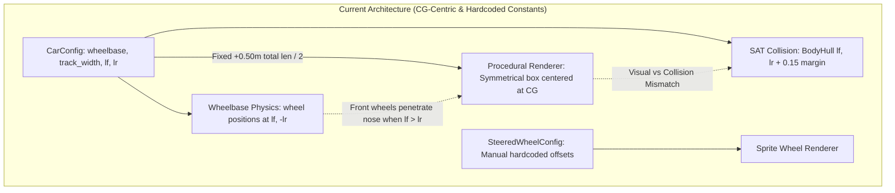
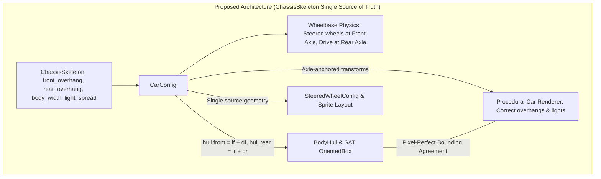

# Architecture Spec: Physical Chassis Skeleton, Explicit Anchor Points, and Proportional Rendering Harmonization 🏗️🏎️📐

A comprehensive cross-crate architectural specification for **TDRace**, establishing an explicit physical chassis geometry model across [`crates/wheelbase`](../crates/wheelbase), [`crates/arcade-race-core`](../crates/arcade-race-core), [`crates/tdrace-app`](../crates/tdrace-app), and [`crates/tdrace-py`](../crates/tdrace-py). This architecture eliminates asymmetric body distortion caused by Center of Gravity (CG) offsets, replaces ad-hoc hardcoded overhang constants, guarantees bit-identical physics determinism, and establishes pixel-perfect alignment between SAT collision bounding boxes, steered wheel assemblies, lighting fixtures, and vehicle bodies.

---

## 🗺️ Current vs. Proposed System Architecture

### 1. Current Architecture (CG-Centric Symmetrical Approximation & Hardcoded Overhangs)

Under the current architecture implemented across [`crates/wheelbase`](../crates/wheelbase) and [`crates/tdrace-app`](../crates/tdrace-app):

1. **Center of Gravity (CG) vs. Geometric Center Confusion**:
   - In [`crates/wheelbase/src/car.rs`](../crates/wheelbase/src/car.rs), wheel positions are correctly grounded on the vehicle's physical axles using the distance from the Center of Gravity to the front axle ($l_f = \text{cg\_to\_front}$) and rear axle ($l_r = \text{cg\_to\_rear}$):
     $$\mathbf{P}_{\text{front\_axle}} = \mathbf{P}_{\text{cg}} + \mathbf{fwd} \cdot l_f, \quad \mathbf{P}_{\text{rear\_axle}} = \mathbf{P}_{\text{cg}} - \mathbf{fwd} \cdot l_r$$
   - In [`crates/tdrace-app/src/render/car.rs`](../crates/tdrace-app/src/render/car.rs), the procedural car body is drawn as a **symmetrical box centered directly on the CG**:
     ```rust
     let total_len = lf + lr + 0.50 * air_scale; // Fixed 0.50m overhang heuristic
     let body_half_len = total_len * 0.5;
     ```
   - In vehicles with rearward weight distribution (e.g. Porsche 911 GT3 or 125cc Shifter Karts where $l_f > l_r$), centering a symmetric hull at the CG shifts the visual body rearward relative to the wheels. The front bumper sits flush against or even behind the front tires, while the rear overhang is bloated.
2. **One-Size-Fits-All Overhang Constant**:
   - The scalar `+ 0.50m` overhang heuristic is applied universally regardless of whether the vehicle is a 1.05m shifter kart, a 4.56m GT3 endurance racer, or a 5.02m NASCAR stock car.
   - A shifter kart ($1.05\text{ m}$ wheelbase) is drawn with an excessive $0.32\text{ m}$ rear overhang, whereas a full-size GT3 or stock car ($4.6\text{--}5.0\text{ m}$ length) is visually squashed to less than $3\text{ m}$, appearing as a stubby microcar.
3. **Fragmented, Ad-Hoc Fixture Coordinates**:
   - Headlights and taillights in `render_car_lights` use arbitrary floating offsets (`half_len - 0.05`, `half_w * 0.55`) referenced from the CG box.
   - In [`crates/tdrace-app/src/render/vehicle_assets.rs`](../crates/tdrace-app/src/render/vehicle_assets.rs), each model's `SteeredWheelConfig` manually hardcodes independent `front_axle_offset` and `half_track_width` values to align textures through visual trial and error.
   - In [`crates/arcade-race-core/src/body.rs`](../crates/arcade-race-core/src/body.rs) and [`sat.rs`](../crates/arcade-race-core/src/collision/sat.rs), the collision bounding hull `BodyHull` is defined strictly as `front: cg_to_front, rear: cg_to_rear`, relying on `BodyHull::MARGIN = 0.15` as an arbitrary padding. This causes cars with long overhangs (NASCAR, GT3 splitters) to visually penetrate track barriers before SAT collisions register, while open-wheel and kart vehicles experience phantom collisions outside their visual perimeter.



---

### 2. Proposed Architecture (Explicit Physical Chassis Skeleton & Axle Anchors)

The proposed architecture introduces **`ChassisSkeleton`**, a lightweight, zero-graphics, pure mathematical descriptor embedded directly into [`CarConfig`](../crates/wheelbase/src/config.rs).

1. **Axle-Relative Anchor System**:
   - The primary reference coordinate frame for the vehicle body, wheel arches, lighting fixtures, and aerodynamic wings is grounded directly on the **Front and Rear Axles**, completely decoupling exterior bodywork proportions from dynamic mass distributions and Center of Gravity movements.
   - The vehicle's total bumper-to-bumper length is defined explicitly:
     $$L_{\text{total}} = \text{wheelbase} + d_{\text{front}} + d_{\text{rear}}$$
     where $d_{\text{front}}$ is the distance from front axle to front bumper/splitter tip, and $d_{\text{rear}}$ is the distance from rear axle to rear bumper/diffuser trailing edge.
2. **Geometric Center vs. Center of Gravity Transformation**:
   - The physical geometric center of the bodywork is offset from the CG along the forward vector by:
     $$\Delta_{\text{geom}} = \frac{(l_f + d_{\text{front}}) - (l_r + d_{\text{rear}})}{2}$$
   - When rendering the chassis hull or constructing the SAT collision bounding box, the center is placed at $\mathbf{P}_{\text{cg}} + \mathbf{fwd} \cdot \Delta_{\text{geom}}$, guaranteeing that both front and rear axles sit in their correct wheel wells regardless of engine placement (front-engine NASCAR, mid-engine kart, or rear-engine GT3).
3. **Single Source of Truth for Collision and Rendering**:
   - `crates/arcade-race-core::BodyHull` derives its front and rear extents directly from `ChassisSkeleton`:
     $$\text{hull.front} = l_f + d_{\text{front}}, \quad \text{hull.rear} = l_r + d_{\text{rear}}, \quad \text{hull.half\_width} = \frac{W_{\text{body}}}{2}$$
   - SAT Oriented Bounding Boxes (OBB) and procedural/textured body hulls match down to the millimeter, completely eliminating phantom collisions and wall penetration.



---

## 📐 Data Models & Mathematical Specifications

### 1. `ChassisSkeleton` Schema in `crates/wheelbase`

Defined in [`crates/wheelbase/src/config.rs`](../crates/wheelbase/src/config.rs):

```rust
use glam::Vec2;
use serde::{Deserialize, Serialize};

/// Physical exterior chassis dimensions and anchor points.
///
/// Decouples visual geometry and collision bounds from dynamic mass distribution.
/// All longitudinal measurements are relative to front and rear axle centers.
#[derive(Debug, Clone, Copy, PartialEq, Serialize, Deserialize)]
pub struct ChassisSkeleton {
    /// Distance from front axle center to outermost front bumper / splitter tip (meters).
    pub front_overhang: f32,
    /// Distance from rear axle center to outermost rear bumper / diffuser edge (meters).
    pub rear_overhang: f32,
    /// Overall bodywork/fender width (meters).
    pub body_width: f32,
    /// Longitudinal distance from front axle to front edge of cockpit/cabin (meters, negative = rearward).
    pub cabin_start_offset: f32,
    /// Longitudinal distance from rear axle to rear edge of cockpit/cabin (meters, positive = forward).
    pub cabin_end_offset: f32,
    /// Lateral headlight socket spread expressed as a fraction of `body_width` [0.0..1.0].
    pub headlight_spread: f32,
    /// Lateral taillight socket spread expressed as a fraction of `body_width` [0.0..1.0].
    pub taillight_spread: f32,
    /// Longitudinal inset from bumper edges for light fixtures (meters).
    pub light_inset: f32,
}

impl Default for ChassisSkeleton {
    fn default() -> Self {
        Self {
            front_overhang: 0.80,
            rear_overhang: 0.90,
            body_width: 1.80,
            cabin_start_offset: -0.40,
            cabin_end_offset: 0.30,
            headlight_spread: 0.65,
            taillight_spread: 0.70,
            light_inset: 0.05,
        }
    }
}

impl ChassisSkeleton {
    /// Computes total bumper-to-bumper vehicle length given a wheelbase.
    #[inline]
    pub const fn total_length(&self, wheelbase: f32) -> f32 {
        wheelbase + self.front_overhang + self.rear_overhang
    }

    /// Computes half of the total vehicle length.
    #[inline]
    pub const fn half_length(&self, wheelbase: f32) -> f32 {
        self.total_length(wheelbase) * 0.5
    }

    /// Computes the half-width of the vehicle bodywork.
    #[inline]
    pub const fn half_width(&self) -> f32 {
        self.body_width * 0.5
    }

    /// Computes the signed longitudinal offset from Center of Gravity (CG) to the geometric center.
    ///
    /// Positive offset indicates geometric center is forward of CG; negative indicates rearward of CG.
    #[inline]
    pub fn geometric_center_offset_from_cg(&self, lf: f32, lr: f32) -> f32 {
        let front_extent = lf + self.front_overhang;
        let rear_extent = lr + self.rear_overhang;
        (front_extent - rear_extent) * 0.5
    }

    /// Computes world positions of left and right headlight fixtures.
    pub fn headlight_positions_world(&self, pos: Vec2, fwd: Vec2, right: Vec2, lf: f32) -> (Vec2, Vec2) {
        let front_tip = pos + fwd * (lf + self.front_overhang - self.light_inset);
        let half_spread = self.half_width() * self.headlight_spread;
        (front_tip - right * half_spread, front_tip + right * half_spread)
    }

    /// Computes world positions of left and right taillight/brakelight fixtures.
    pub fn taillight_positions_world(&self, pos: Vec2, fwd: Vec2, right: Vec2, lr: f32) -> (Vec2, Vec2) {
        let rear_tip = pos - fwd * (lr + self.rear_overhang - self.light_inset);
        let half_spread = self.half_width() * self.taillight_spread;
        (rear_tip - right * half_spread, rear_tip + right * half_spread)
    }

    /// Computes `(front_extent, rear_extent, half_width)` for SAT collision `BodyHull`.
    #[inline]
    pub fn to_body_hull(&self, lf: f32, lr: f32) -> (f32, f32, f32) {
        (lf + self.front_overhang, lr + self.rear_overhang, self.half_width())
    }
}
```

---

### 2. Physical Archetype Calibration Matrix

Standardized dimensions adhering to FIA, SCCA, and real-world homologation parameters across all primary vehicle archetypes:

| Vehicle Class / Archetype | Wheelbase ($L$) | Track Width ($W_t$) | Front Overhang ($d_f$) | Rear Overhang ($d_r$) | Body Width ($W_b$) | Total Length ($L_{\text{tot}}$) | Ratio ($L_{\text{tot}}/L$) |
| :--- | :--- | :--- | :--- | :--- | :--- | :--- | :--- |
| **Go-Kart** (Shifter Kart) | $1.05\text{ m}$ | $0.85\text{ m}$ | $0.16\text{ m}$ | $0.12\text{ m}$ | $1.10\text{ m}$ | $1.33\text{ m}$ | $1.27\times$ |
| **Touring GT3** (Porsche 911 GT3 R) | $2.50\text{ m}$ | $1.68\text{ m}$ | $0.88\text{ m}$ | $1.18\text{ m}$ | $2.04\text{ m}$ | $4.56\text{ m}$ | $1.82\times$ |
| **Stock Car** (NASCAR TA1) | $2.79\text{ m}$ | $1.62\text{ m}$ | $0.98\text{ m}$ | $1.25\text{ m}$ | $1.98\text{ m}$ | $5.02\text{ m}$ | $1.80\times$ |
| **Rallycross** (WRC Hatchback) | $2.53\text{ m}$ | $1.60\text{ m}$ | $0.76\text{ m}$ | $0.68\text{ m}$ | $1.82\text{ m}$ | $3.97\text{ m}$ | $1.57\times$ |
| **Extreme Off-Road** (Sand Rail) | $2.65\text{ m}$ | $1.85\text{ m}$ | $0.15\text{ m}$ | $0.42\text{ m}$ | $1.95\text{ m}$ | $3.22\text{ m}$ | $1.21\times$ |
| **Open Wheel** (Formula Vintage) | $3.60\text{ m}$ | $1.80\text{ m}$ | $1.20\text{ m}$ | $0.65\text{ m}$ | $1.90\text{ m}$ | $5.45\text{ m}$ | $1.51\times$ |

---

## 🗄️ Database & Storage Migration Plan

### 1. Zero-Downtime Serde Schema Migration

The introduction of `ChassisSkeleton` modifies the [`CarConfig`](../crates/wheelbase/src/config.rs#L589) configuration schema:
- **Field Definition**: Added as `#[serde(default)] pub chassis: ChassisSkeleton`.
- **Deserialization Invariance**: Legacy vehicle catalogs (`series/*.toml`, custom user presets, network packets) that lack the `chassis` block deserialize cleanly without error.
- **Default Synthesis in `CarConfig::finalize()`**: If `chassis` is omitted during raw TOML/JSON parsing, `CarConfig::finalize()` synthesizes a proportional skeleton scaled to the vehicle's `wheelbase` and `track_width`:
  ```rust
  let synthesized_chassis = ChassisSkeleton {
      front_overhang: self.wheelbase * 0.32,
      rear_overhang: self.wheelbase * 0.38,
      body_width: self.track_width + 0.30,
      cabin_start_offset: -self.wheelbase * 0.16,
      cabin_end_offset: self.wheelbase * 0.12,
      ..ChassisSkeleton::default()
  };
  ```

### 2. Local Database Schema Impact (`tdrace_records.db`)

- The SQLite local database (`tdrace_records.db`) stores telemetry logs, lap times, and race history.
- It does **not** persist full car physics schemas, only model IDs (`car_model: TEXT`).
- Therefore, **zero database migrations or SQLite table alterations are required**.

---

## 🔑 Security, Compliance, & IAM Roles

### 1. Multiplayer Integrity & Anti-Tamper Invariance

In LAN multiplayer mode ([Spec 044](044_robust_lan_race_synchronization_with_ownerauthoritative_cars.md)):
- **Client-Authoritative Telemetry Boundary**: Players transmit `NetCarState` packets containing only dynamic pose and kinematics (`position`, `angle`, `velocity`, `steer`, `angular_velocity`).
- **Chassis Bounds Authority**: Collision hulls and vehicle dimensions are determined locally on the referee host by resolving the participant's chosen vehicle `model_id`. Clients cannot inflate or shrink their collision bounding boxes to gain an unfair advantage or exploit track barrier gaps.
- **Homologation Enforcement**: Vehicle categories enforce maximum overhang and body width limits (`body_width <= track_width + 0.50m`), preventing synthetic custom setups from creating impassable track blockades.

---

## 🛡️ Disaster Recovery, Monitoring, & Fallbacks

### 1. Runtime Clamping & Geometry Fallbacks

- If custom mods or user configuration files supply negative, NaN, or extreme dimensions (e.g. zero width or $100\text{ m}$ overhangs), `CarConfig::finalize()` applies strict sanity clamps:
  - `front_overhang = front_overhang.clamp(0.0, 3.0)`
  - `rear_overhang = rear_overhang.clamp(0.0, 3.0)`
  - `body_width = body_width.clamp(track_width * 0.8, 3.5)`
- These guards prevent division by zero in camera tracking and infinite bounding box expansions in the SAT collision broadphase.

### 2. Golden Simulation Regression Safety Net

- Core vehicle physics rollouts must remain strictly deterministic.
- The `arcade-race-core` test suite includes golden simulation benchmarks (`tests/golden_sim.rs`).
- Any unintended drift in numerical integration or vehicle trajectories will immediately fail CI before deployment.

---

## 🔧 Cross-Crate Implementation Details

### 1. `crates/wheelbase`
- Embed `pub chassis: ChassisSkeleton` inside [`CarConfig`](../crates/wheelbase/src/config.rs#L589).
- Explicitly populate `chassis` across all built-in presets: `sports_car()`, `kart()`, `rally_car()`, `stock_car_ta1()`, `sand_rail()`.

### 2. `crates/arcade-race-core`
- Update [`Body2D::hull(&self)`](../crates/arcade-race-core/src/body.rs#L101-L107) for `Car`:
  ```rust
  fn hull(&self) -> BodyHull {
      let (front, rear, half_width) = self.config.chassis.to_body_hull(
          self.config.cg_to_front,
          self.config.cg_to_rear,
      );
      BodyHull { front, rear, half_width }
  }
  ```
- In [`OrientedBox::from_body`](../crates/arcade-race-core/src/collision/sat.rs#L31-L47), the geometric center calculation naturally aligns with the visual body center.

### 3. `crates/tdrace-app`
- In [`render_car_with_visual_type_model_and_shadows`](../crates/tdrace-app/src/render/car.rs#L304):
  - Compute the visual geometric center:
    ```rust
    let geom_offset = car.config.chassis.geometric_center_offset_from_cg(lf, lr) * air_scale;
    let visual_center = chassis_center + fwd * geom_offset;
    let body_half_len = car.config.chassis.half_length(car.config.wheelbase) * air_scale;
    let body_half_w = car.config.chassis.half_width() * air_scale;
    ```
  - Pass `visual_center`, `body_half_len`, and `body_half_w` to `render_chassis_shadow`.
  - Replace magic offsets in `render_car_lights` with `car.config.chassis.headlight_positions_world` and `taillight_positions_world`.
  - Harmonize all procedural archetypes (`render_chassis_body`, `render_kart_body`, `render_open_wheel_body`, `render_rally_body`, `render_stock_car_body`, `render_sand_rail_body`) to reference front and rear axle lines rather than assuming symmetrical halves.
- In [`crates/tdrace-app/src/render/vehicle_assets.rs`](../crates/tdrace-app/src/render/vehicle_assets.rs):
  - Adapt `get_steered_wheel_config` to read from the vehicle's `ChassisSkeleton` when model-specific configs are resolved.

### 4. `crates/tdrace-py`
- In [`crates/tdrace-py/src/rasterizer.rs`](../crates/tdrace-py/src/rasterizer.rs#L374-L380):
  - Update `draw_car`:
    ```rust
    let geom_offset = car.config.chassis.geometric_center_offset_from_cg(car.config.cg_to_front, car.config.cg_to_rear);
    let center = pos + fwd * geom_offset;
    let half_l = car.config.chassis.half_length(car.config.wheelbase);
    let half_w = car.config.chassis.half_width();
    ```

---

## 🛡️ Coding Invariants & Verification Boundaries

1. **Zero-Graphics Invariant**:
   - `ChassisSkeleton` must live strictly within `crates/wheelbase` and `crates/arcade-race-core`.
   - Never import `macroquad`, windowing primitives, or rendering types into these crates.
2. **Deterministic Physics Invariant**:
   - Chassis skeleton dimensions govern rendering, collision bounds, and aerodynamics frontal area; they must **never** modify the internal Pacejka slip integration, differential dynamics, or 60 Hz numerical rollout.
3. **Zero Heap Allocation Invariant**:
   - All skeleton transformations and queries must operate on `Copy` primitives and stack arrays (`[Vec2; 4]`). No `Vec`, `Box`, or heap allocations are permitted per frame.

---

## 🧪 Verification & Acceptance Criteria

### Automated Tests

- Rust unit and physics regression suite:
  ```bash
  cargo test -p wheelbase -p arcade-race-core -p tdrace-app
  ```
- Physics golden simulation bit-identical verification:
  ```bash
  cargo test -p arcade-race-core --test golden_sim
  ```
- Workspace-wide Clippy verification:
  ```bash
  cargo clippy --workspace --all-targets -- -D warnings
  ```

### Manual Acceptance Criteria (Pseudo-Gherkin)

- **Scenario: Axle-relative feature anchoring eliminates CG bias distortion**
  - [x] **Given** a vehicle configuration with asymmetric weight distribution ($l_f = 1.4\text{ m}, l_r = 1.0\text{ m}$) and positive front overhang ($0.88\text{ m}$)
  - [x] **When** the vehicle wheel positions and bodywork perimeter are evaluated in world space
  - [x] **Then** the front bumper must extend exactly $0.88\text{ m}$ ahead of the front wheel hubs, and the front wheels must remain centered inside the front wheel arches.

- **Scenario: Archetype-specific overhang scaling separates karts from stock cars**
  - [x] **Given** a Go-Kart model with $1.05\text{ m}$ wheelbase and a Stock Car model with $2.79\text{ m}$ wheelbase
  - [x] **When** their respective total bumper-to-bumper lengths are computed via `ChassisSkeleton::total_length()`
  - [x] **Then** the Go-Kart length must measure between $1.30\text{ m}$ and $1.35\text{ m}$, and the Stock Car length must measure between $4.95\text{ m}$ and $5.05\text{ m}$.

- **Scenario: SAT collision OBB matches visual chassis bounding box**
  - [x] **Given** a `Car` instance with active `ChassisSkeleton` geometry
  - [x] **When** `OrientedBox::from_body(&car)` is evaluated
  - [x] **Then** the box half-length must equal `car.config.chassis.half_length()` plus `BodyHull::MARGIN`, and the box center must equal $\mathbf{P}_{\text{cg}} + \mathbf{fwd} \cdot \Delta_{\text{geom}}$.

- **Scenario: Headlight and taillight fixtures anchor precisely to bumper contours**
  - [x] **Given** a vehicle positioned at arbitrary position $\mathbf{P}$ and heading angle $\theta$
  - [x] **When** `headlight_positions_world` and `taillight_positions_world` are computed
  - [x] **Then** the headlights must sit at distance `front_overhang - light_inset` ahead of the front axle, and taillights must sit at distance `rear_overhang - light_inset` behind the rear axle.

- **Scenario: Backward-compatible deserialization for legacy vehicle JSON and TOML**
  - [x] **Given** a legacy serialized `CarConfig` payload lacking the `chassis` field
  - [x] **When** deserialized with `serde_json` or `toml`
  - [x] **Then** deserialization succeeds without error and populates a valid, non-zero `ChassisSkeleton` with default proportions scaled to the vehicle wheelbase.

---

## 🔗 Traceability & Codebase Mapping

### Created/Modified Files

- `[x]` [`crates/wheelbase/src/config.rs`](../crates/wheelbase/src/config.rs) -> Adds `ChassisSkeleton` struct, serialization, and constructor presets.
- `[x]` [`crates/arcade-race-core/src/body.rs`](../crates/arcade-race-core/src/body.rs) -> Updates `Body2D` implementation for `Car` to derive `BodyHull` from `ChassisSkeleton`.
- `[x]` [`crates/arcade-race-core/src/collision/sat.rs`](../crates/arcade-race-core/src/collision/sat.rs) -> Aligns `OrientedBox::from_body` with geometric center offset.
- `[x]` [`crates/tdrace-app/src/render/car.rs`](../crates/tdrace-app/src/render/car.rs) -> Refactors procedural bodywork, shadows, and lighting to use axle-anchored skeleton geometry.
- `[x]` [`crates/tdrace-app/src/render/vehicle_assets.rs`](../crates/tdrace-app/src/render/vehicle_assets.rs) -> Aligns `SteeredWheelConfig` with `ChassisSkeleton`.
- `[x]` [`crates/tdrace-py/src/rasterizer.rs`](../crates/tdrace-py/src/rasterizer.rs) -> Updates software CPU rasterizer to use `ChassisSkeleton`.
- `[x]` `crates/wheelbase/tests/chassis_skeleton_tests.rs` -> Adds unit tests for geometric center, overhang calculations, and serialization defaults.
