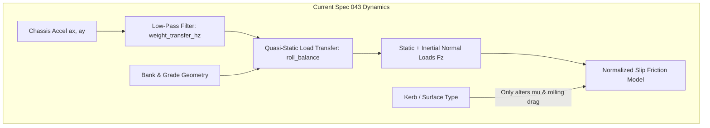
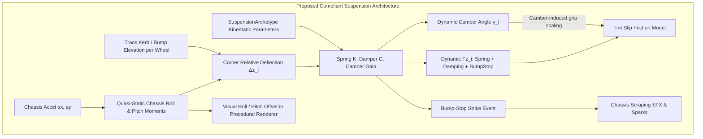
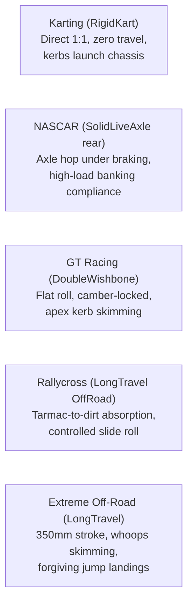

# Architecture Spec: Pragmatic Multi-Tier Suspension Archetypes, Compliance Dynamics, and Perceptible Chassis Articulation 🛞📐⚡

An architectural blueprint for **TdRace** extending [`crates/wheelbase`](../crates/wheelbase), [`crates/arcade-race-core`](../crates/arcade-race-core), and [`crates/tdrace-app`](../crates/tdrace-app) with a closed-form, non-iterative 4-corner suspension compliance model. Governed by six distinct **Suspension Archetypes**, this architecture transforms track kerbs, elevation ruts, and jump landings from flat friction modifiers into tactile mechanical dynamics, creating authentic handling differentiation across motorsport disciplines and progression tiers without risking numerical instability or performance degradation.

---

## 🗺️ Current vs. Proposed System Architecture

### 1. Current Architecture (Quasi-Static Planar Load Transfer & Rigid Wheel Anchoring)

Under the current vehicle dynamics implementation governed by [Spec 043](043_vehicle_dynamics_rebuild_and_simplified_handling_settings.md):

1. **Quasi-Static Planar Load Transfer**:
   - Normal wheel loads ($F_z$) are computed from global chassis acceleration vectors ($a_x, a_y$) and road grade/banking geometry:
     $$\Delta F_{z,\text{lat}} = m \cdot a_y \cdot \frac{h_{\text{cg}}}{\text{track}}, \quad \Delta F_{z,\text{long}} = m \cdot a_x \cdot \frac{h_{\text{cg}}}{\text{wheelbase}}$$
   - Lateral transfer is split between axles via a static scalar `roll_balance \in [0.35, 0.65]` and low-pass filtered by `weight_transfer_hz`.
2. **Rigid Ground Attachment & Absence of Wheel Deflection**:
   - Wheels are assumed to be rigidly fixed to the chassis at vertical offset $z = 0$. Suspension stroke, spring displacement, and damper velocity are undefined.
   - When a wheel clips an apex kerb, rumble strip, or dirt berm, the track surface only alters local friction ($\mu_{\text{surface}}$) and rolling drag. No dynamic vertical shock is transmitted into the corner assembly, producing the "velcro kerb" feel where clipping tall kerbs imparts negligible chassis disturbance.
3. **Absence of Camber Kinematics Under Body Roll**:
   - Tire friction follows normalized slip vectors assuming an invariant optimal contact patch.
   - In reality, production-derived suspensions (e.g. MacPherson struts in GT4) lose negative camber as the chassis rolls into a turn ($\Delta \gamma > 0$), rolling the tire onto its outer shoulder and inducing understeer. Race-bred double wishbones (GT3) compensate for body roll via camber gain ($\Delta \gamma < 0$), while live solid axles (NASCAR) couple left and right camber angles across the axle.
4. **Binary Jump Landings and Bottoming Out**:
   - Vertical elevation is tracked as a single scalar `state.elevation`. Jump landings apply a uniform global impulse without corner-specific bump-stop compression, shock absorption, or chassis scrape dynamics.



---

### 2. Proposed Architecture (Closed-Form 4-Corner Damped Compliance & Archetypes)

The proposed architecture introduces **`SuspensionConfig`** and **`SuspensionArchetype`** to [`CarConfig`](../crates/wheelbase/src/config.rs), backed by a deterministic, non-iterative 4-corner vertical kinematic solver:

1. **Analytical Damped Compliance (No Stiff ODE Integration)**:
   - Avoids numerical instability and high-frequency resonance ($15\text{--}25\text{ Hz}$) by evaluating suspension deflection $\Delta z_i$ and damper velocities $\dot{z}_i$ analytically at each 120 Hz tick.
   - Computes dynamic corner normal forces through spring displacement, bump/rebound damping, and non-linear bump-stop engagement.
2. **Six Distinct Suspension Archetypes**:
   - `RigidKart`: Zero stroke, rigid frame, transmits 100% kerb jerk, relies purely on chassis twist and caster jacking.
   - `SolidLiveAxle`: Coupled rear axle kinematics, vulnerable to axle hop and curb tramping under braking.
   - `MacPhersonStrut`: Production-derived compliance with progressive camber loss under heavy body roll.
   - `DoubleWishbone`: Stiff racing geometry with aggressive camber gain maintaining optimal tire footprint across high-G sweepers.
   - `PushrodInboard`: Extreme heave stiffness locking ride height for ground-effect aerodynamics; brittle over sausage kerbs.
   - `LongTravelOffRoad`: Plush $350\text{ mm}$ travel with position-sensitive bypass damping, soaking up jumps and whoops.
3. **Perceptible Top-Down Sensory Integration**:
   - Feeds chassis roll angle $\phi_{\text{roll}}$ and pitch angle $\theta_{\text{pitch}}$ directly into the procedural and sprite rendering pipeline ([Spec 075](075_physical_chassis_skeleton_explicit_anchor_points_and_proportional_rendering_harmonization.md)), displacing the visual body relative to the wheel hubs.
   - Emits dynamic bottoming-out events (audio impact thud and spark particles) whenever deflection exceeds maximum bump stroke.



---

## 🏎️ Suspension Archetypes & Categorical Differentiation

Every vehicle model in **TdRace** is assigned a front and rear suspension archetype, either through presets or explicit configuration:

```rust
#[derive(Debug, Clone, Copy, PartialEq, Eq, Hash, Serialize, Deserialize)]
#[serde(rename_all = "snake_case")]
pub enum SuspensionArchetype {
    /// 1. Racing Karts: 0mm travel, rigid tubular chassis, no dampers.
    RigidKart,
    /// 2. NASCAR Cup / Classic Muscle: Solid rear live axle with coupled roll and axle tramp.
    SolidLiveAxle,
    /// 3. Grassroots / GT4 / Rally Hatch: MacPherson strut front, camber loss under heavy roll.
    MacPhersonStrut,
    /// 4. GT3 / Sports Prototypes: Double wishbone front & rear with camber gain geometry.
    DoubleWishbone,
    /// 5. Hypercars / GT1 Legends: Inboard pushrod, rising-rate heave spring, sensitive to bottoming.
    PushrodInboard,
    /// 6. Rallycross / Extreme Off-Road: Long-travel (250-400mm) bypass damping with high compliance.
    LongTravelOffRoad,
}
```

### Archetype Kinematic & Physical Properties

| Archetype | Bump Travel ($z_{\text{bump}}$) | Rebound Travel ($z_{\text{reb}}$) | Wheel Rate ($K_w$) | Damping Ratio ($\zeta_{\text{bump}}$) | Camber Gain ($d\gamma/d\phi$) | Kerb Shock Transmissibility |
| :--- | :--- | :--- | :--- | :--- | :--- | :--- |
| **`RigidKart`** | $0.005\text{ m}$ | $0.005\text{ m}$ | $450\text{ kN/m}$ | $0.10$ (Dry friction) | $0.00^\circ / ^\circ$ | **$100\%$**: Kerbs violently pitch chassis; lifts opposing tires. |
| **`SolidLiveAxle`** | $0.065\text{ m}$ | $0.055\text{ m}$ | $42\text{ kN/m}$ | $0.55$ | Coupled ($\Delta \gamma_R = -\Delta \gamma_L$) | **$75\%$**: Unilateral kerb strikes cause axle hop and power oversteer. |
| **`MacPhersonStrut`**| $0.075\text{ m}$ | $0.060\text{ m}$ | $38\text{ kN/m}$ | $0.60$ | **$+0.35^\circ / ^\circ$ (Camber Loss)**| **$45\%$**: Absorbs kerbs cleanly; rolls heavily and washes wide in long sweepers. |
| **`DoubleWishbone`** | $0.045\text{ m}$ | $0.035\text{ m}$ | $85\text{ kN/m}$ | $0.72$ | **$-0.70^\circ / ^\circ$ (Camber Gain)**| **$60\%$**: Nails flat apex kerbs; sausage kerbs strike bump-stops violently. |
| **`PushrodInboard`** | $0.025\text{ m}$ | $0.020\text{ m}$ | $140\text{ kN/m}$ | $0.85$ (Rising rate) | **$-0.90^\circ / ^\circ$ (Fixed Flat)** | **$90\%$**: Stiff; kerb bottoming stalls ground-effect downforce. |
| **`LongTravelOffRoad`**|$0.220\text{ m}$ | $0.160\text{ m}$ | $18\text{ kN/m}$ | $0.45$ (Dual bypass) | **$-0.20^\circ / ^\circ$** | **$15\%$**: Pillowy; glides across ruts, berms, and jump landings. |

---

## 🏆 Category & Tier Progression Matrix

### 1. Cross-Category Discipline Differentiation



* **Karting (`RigidKart`)**: Hitting track curbs or ripple strips bypasses suspension completely, generating instant chassis heave that unloads the opposite diagonal tire, demanding razor-sharp line discipline.
* **NASCAR Cup (`SolidLiveAxle` Rear / `DoubleWishbone` Front)**: Entering banking transitions compresses both axles symmetrically. However, clipping an inside rumble strip tilts the entire live axle, breaking traction on the loaded rear wheel and initiating a snap power slide.
* **Rallycross & All-Terrain (`LongTravelOffRoad`)**: Long travel and progressive bypass damping allow aggressive cutting over unpaved berms, curbs, and tabletop ramps without bottoming out or upsetting steering heading.

### 2. Intra-Category Tier Progression (GT World Challenge Benchmark)

| Tier | Vehicle Class | Suspension Architecture | Handling Character & Driver Sensation |
| :---: | :--- | :--- | :--- |
| **Tier 1** | **GT4 Clubsport** | Front: `MacPhersonStrut`<br/>Rear: Multi-Link | Softer springs, noticeable visual body roll ($2.8^\circ$). Heavy lateral roll induces camber loss, causing forgiving, progressive understeer at the limit. Forgiving over apex kerbing. |
| **Tier 2** | **GT3 Competition** | Front: `DoubleWishbone`<br/>Rear: `DoubleWishbone` | Stiff racing setup ($1.2^\circ$ roll). Negative camber gain maintains contact patch across $1.6\text{ g}$ sweepers. Crisp turn-in; aggressive sausage kerbs induce abrupt bump-stop bottoming. |
| **Tier 3** | **GT2 Biturbo** | Front: `DoubleWishbone`<br/>Rear: `DoubleWishbone` | Heavier chassis ($1390\text{ kg}$) with stiffened rear anti-roll bar. Demands precise throttle modulation; rear squat on throttle increases rear camber bite. |
| **Tier 4** | **GT1 Legends** | Front: `PushrodInboard`<br/>Rear: `PushrodInboard` | Raw 90s prototype setup. Zero power steering, minimal roll ($0.7^\circ$). Bottoming out on rumble strips violently breaks rear traction. |
| **Tier 5** | **Hypercar Prototype**| Front: `PushrodInboard`<br/>Rear: `PushrodInboard` + Heave | Third-element heave spring seals underbody ground-effect venturis. Immense cornering grip ($> 2.2\text{ g}$); striking kerbs causes aerodynamic stall and immediate spin risk. |

### 3. Intra-Category Tier Progression (FIA Autocross Benchmark)

| Tier | Vehicle Class | Suspension Architecture | Handling Character |
| :---: | :--- | :--- | :--- |
| **Tier 1-2** | **Junior Cross Car (XC)** | Front: `DoubleWishbone`<br/>Rear: Trailing Arm | Moderate travel ($140\text{ mm}$), single-rate coilover. Bounces vigorously over severe washboards and deep ruts. |
| **Tier 3-4** | **Buggy 1600 & Touring AX**| Front: `DoubleWishbone`<br/>Rear: `DoubleWishbone` | Tuned long-travel ($190\text{ mm}$) with anti-roll bars. Stable through loose clay berms; handles rutted apexes smoothly. |
| **Tier 5** | **Superbuggy** | Front: `PushrodInboard`<br/>Rear: `LongTravelOffRoad` | Dual remote-reservoir bypass shocks ($260\text{ mm}$). Glides over cratered clay berms at full throttle; floats over jumps without rebound bounce. |

---

## 📐 Mathematical Formulation (Closed-Form & Deterministic)

The model runs once per 120 Hz physics sub-step inside [`crates/wheelbase/src/car.rs`](../crates/wheelbase/src/car.rs).

### 1. Dynamic Chassis Kinematics (Roll & Pitch Angles)

Chassis roll angle $\phi$ (radians) and pitch angle $\theta$ (radians) are computed from steady-state roll/pitch stiffness and filtered inertial accelerations:

$$\phi_{\text{target}} = \frac{m \cdot a_y \cdot h_{\text{roll}}}{K_{\phi,\text{total}}}, \quad \theta_{\text{target}} = \frac{-m \cdot a_x \cdot h_{\text{pitch}}}{K_{\theta,\text{total}}}$$

where $h_{\text{roll}}$ is the distance from Center of Gravity to the Roll Center axis, $K_{\phi,\text{total}} = K_{\phi,\text{front}} + K_{\phi,\text{rear}}$ is the total roll stiffness (N·m/rad), and $K_{\theta,\text{total}}$ is the pitch stiffness (N·m/rad).

To model suspension lag without numerical instability, roll and pitch angles follow a first-order lag filter:

$$\phi(t + \Delta t) = \phi(t) + (\phi_{\text{target}} - \phi(t)) \cdot \left(1 - e^{-2\pi \cdot f_{\text{susp}} \cdot \Delta t}\right)$$

where $f_{\text{susp}} \in [2.5, 6.0]\text{ Hz}$ is the suspension natural response frequency.

### 2. Corner Suspension Stroke & Deflection

For each corner $i \in \{\text{FL}, \text{FR}, \text{RL}, \text{RR}\}$:
* FL: $x = +l_f, y = -W/2$
* FR: $x = +l_f, y = +W/2$
* RL: $x = -l_r, y = -W/2$
* RR: $x = -l_r, y = +W/2$

The vertical displacement of the chassis chassis corner above static ground level is:

$$z_{\text{chassis},i} = -x_i \cdot \sin \theta + y_i \cdot \sin \phi$$

Given local track surface elevation profile (e.g. curb height $z_{\text{track},i}$):

$$\Delta z_i = z_{\text{track},i} - z_{\text{chassis},i}$$

The suspension stroke is clamped within physical bump and rebound limits:

$$s_i = \text{clamp}(\Delta z_i, -z_{\text{reb},i}, z_{\text{bump},i})$$

Suspension deflection velocity is computed via backward difference:

$$\dot{s}_i = \frac{s_i(t) - s_i(t - \Delta t)}{\Delta t}$$

### 3. Normal Wheel Force Summation ($F_{z,i}$)

Total vertical force at wheel contact patch:

$$F_{z,i} = \underbrace{F_{z,\text{static},i}}_{\text{static gravity load}} + \underbrace{K_{w,i} \cdot s_i}_{\text{spring force}} + \underbrace{C_i(\dot{s}_i) \cdot \dot{s}_i}_{\text{damping force}} + \underbrace{F_{\text{arb},i}}_{\text{anti-roll bar}} + \underbrace{F_{\text{bumpstop},i}}_{\text{bump-stop impact}} + \underbrace{F_{\text{downforce},i}}_{\text{aero downforce}}$$

#### A. Asymmetric Damping Force ($C_i$)
Dampers feature asymmetric bump vs. rebound rates:

$$C_i(\dot{s}_i) = \begin{cases} 
C_{\text{bump},i} = 2 \cdot \zeta_{\text{bump}} \cdot \sqrt{K_{w,i} \cdot m_{\text{corner},i}} & \text{if } \dot{s}_i \ge 0 \text{ (compression)} \\ 
C_{\text{reb},i} = 2 \cdot \zeta_{\text{reb}} \cdot \sqrt{K_{w,i} \cdot m_{\text{corner},i}} & \text{if } \dot{s}_i < 0 \text{ (extension)} 
\end{cases}$$

#### B. Anti-Roll Bar Force ($F_{\text{arb}}$)
The anti-roll bar opposes differential axle deflection:

$$F_{\text{arb},\text{FL}} = -K_{\text{arb},\text{front}} \cdot (s_{\text{FL}} - s_{\text{FR}}), \quad F_{\text{arb},\text{FR}} = +K_{\text{arb},\text{front}} \cdot (s_{\text{FL}} - s_{\text{FR}})$$

#### C. Bump-Stop Bottoming Force ($F_{\text{bumpstop}}$)
When stroke reaches maximum bump travel ($s_i \ge z_{\text{bump},i}$):

$$\Delta s_{\text{stop}} = (\Delta z_i - z_{\text{bump},i}).\text{max}(0.0)$$
$$F_{\text{bumpstop},i} = K_{\text{stop}} \cdot \Delta s_{\text{stop}} + C_{\text{stop}} \cdot \dot{s}_i$$

* When $\Delta s_{\text{stop}} > 0.002\text{ m}$, the vehicle registers a **Bottoming Out Event**, emitting:
  1. Instant drop in tire lateral force due to load sensitivity saturation:
     $$\mu_{\text{eff}} = \mu_{\text{base}} \cdot \text{clamp}\left(1 - \text{load\_sensitivity} \cdot \left(\frac{F_z}{F_{z,\text{nom}}} - 1\right), 0.40, 1.25\right)$$
  2. Invocation of `play_bottoming_thud_sfx()` in `tdrace-app`.
  3. Particle emission of metallic track sparks at wheel coordinates.

### 4. Camber-Induced Tire Friction Degradation

The dynamic tire inclination angle $\gamma_i$ (radians) accounts for static setup camber, roll inclination, and archetype-specific camber recovery:

$$\gamma_i = \gamma_{\text{static},i} + \phi \cdot \left(1 - \text{camber\_recovery}_{\text{archetype}}\right)$$

* For **`DoubleWishbone`** and **`PushrodInboard`**: $\text{camber\_recovery} \approx 0.90\text{--}1.00$. Tire remains near-perpendicular to road ($\gamma \approx 0$).
* For **`MacPhersonStrut`**: $\text{camber\_recovery} \approx 0.40$. Tire leans outward with the body, generating positive relative camber.
* For **`RigidKart`**: $\text{camber\_recovery} = 1.00$ relative to chassis, but rolls with the pavement.

Tire peak friction is scaled quadratically by inclination angle:

$$\mu_{\text{camber},i} = 1.0 - k_{\text{camber}} \cdot \gamma_i^2$$

where $k_{\text{camber}} \approx 1.8\text{ rad}^{-2}$ (a $5^\circ$ camber misalignment reduces peak grip by $\approx 1.4\%$).

---

## 💻 Data Structures & API Interfaces

### 1. Wheelbase Crate (`crates/wheelbase/src/config.rs`)

```rust
/// Detailed suspension geometry and compliance settings for an axle or vehicle corner.
#[derive(Debug, Clone, Copy, PartialEq, Serialize, Deserialize)]
pub struct SuspensionCornerConfig {
    /// Suspension kinematic architecture.
    pub archetype: SuspensionArchetype,
    /// Wheel rate stiffness (N/m).
    pub spring_rate: f32,
    /// Damping ratio in bump / compression [0.2 - 0.9].
    pub bump_damping_ratio: f32,
    /// Damping ratio in rebound / extension [0.4 - 1.2].
    pub rebound_damping_ratio: f32,
    /// Maximum bump travel before hitting bump stop (meters).
    pub max_bump_travel: f32,
    /// Maximum rebound extension travel (meters).
    pub max_rebound_travel: f32,
    /// Static camber angle at rest (radians, negative = top tilted inward).
    pub static_camber: f32,
    /// Camber recovery factor [0.0 = full camber loss with roll, 1.0 = full camber preservation].
    pub camber_recovery: f32,
}

/// Vehicle-level suspension setup comprising front and rear axle configurations.
#[derive(Debug, Clone, Copy, PartialEq, Serialize, Deserialize)]
pub struct SuspensionConfig {
    /// Front axle corner suspension settings.
    pub front: SuspensionCornerConfig,
    /// Rear axle corner suspension settings.
    pub rear: SuspensionCornerConfig,
    /// Front anti-roll bar torsional stiffness (N*m/rad).
    pub front_arb_rate: f32,
    /// Rear anti-roll bar torsional stiffness (N*m/rad).
    pub rear_arb_rate: f32,
    /// Height of front roll center above ground (meters).
    pub front_roll_center_height: f32,
    /// Height of rear roll center above ground (meters).
    pub rear_roll_center_height: f32,
    /// Suspension natural frequency for body lag filtering (Hz).
    pub response_frequency_hz: f32,
}

impl Default for SuspensionConfig {
    fn default() -> Self {
        Self::for_archetype(SuspensionArchetype::DoubleWishbone)
    }
}

impl SuspensionConfig {
    /// Generates factory calibrated presets for standard archetypes.
    pub fn for_archetype(archetype: SuspensionArchetype) -> Self {
        match archetype {
            SuspensionArchetype::RigidKart => Self::rigid_kart(),
            SuspensionArchetype::SolidLiveAxle => Self::solid_live_axle(),
            SuspensionArchetype::MacPhersonStrut => Self::macpherson_strut(),
            SuspensionArchetype::DoubleWishbone => Self::double_wishbone(),
            SuspensionArchetype::PushrodInboard => Self::pushrod_inboard(),
            SuspensionArchetype::LongTravelOffRoad => Self::long_travel_offroad(),
        }
    }

    pub fn rigid_kart() -> Self {
        let corner = SuspensionCornerConfig {
            archetype: SuspensionArchetype::RigidKart,
            spring_rate: 450_000.0,
            bump_damping_ratio: 0.10,
            rebound_damping_ratio: 0.15,
            max_bump_travel: 0.008,
            max_rebound_travel: 0.005,
            static_camber: 0.0,
            camber_recovery: 0.0,
        };
        Self {
            front: corner,
            rear: corner,
            front_arb_rate: 0.0,
            rear_arb_rate: 0.0,
            front_roll_center_height: 0.02,
            rear_roll_center_height: 0.02,
            response_frequency_hz: 8.0,
        }
    }

    pub fn double_wishbone() -> Self {
        let front = SuspensionCornerConfig {
            archetype: SuspensionArchetype::DoubleWishbone,
            spring_rate: 85_000.0,
            bump_damping_ratio: 0.68,
            rebound_damping_ratio: 0.82,
            max_bump_travel: 0.045,
            max_rebound_travel: 0.035,
            static_camber: -0.052, // ~ -3.0 deg GT3 setup
            camber_recovery: 0.85,
        };
        let rear = SuspensionCornerConfig {
            archetype: SuspensionArchetype::DoubleWishbone,
            spring_rate: 95_000.0,
            bump_damping_ratio: 0.70,
            rebound_damping_ratio: 0.85,
            max_bump_travel: 0.045,
            max_rebound_travel: 0.035,
            static_camber: -0.035, // ~ -2.0 deg GT3 setup
            camber_recovery: 0.85,
        };
        Self {
            front,
            rear,
            front_arb_rate: 4500.0,
            rear_arb_rate: 3200.0,
            front_roll_center_height: 0.08,
            rear_roll_center_height: 0.10,
            response_frequency_hz: 4.2,
        }
    }

    pub fn macpherson_strut() -> Self {
        let front = SuspensionCornerConfig {
            archetype: SuspensionArchetype::MacPhersonStrut,
            spring_rate: 42_000.0,
            bump_damping_ratio: 0.58,
            rebound_damping_ratio: 0.70,
            max_bump_travel: 0.075,
            max_rebound_travel: 0.060,
            static_camber: -0.035, // ~ -2.0 deg GT4 setup
            camber_recovery: 0.40, // MacPherson loses camber with roll
        };
        let rear = SuspensionCornerConfig {
            archetype: SuspensionArchetype::DoubleWishbone,
            spring_rate: 48_000.0,
            bump_damping_ratio: 0.60,
            rebound_damping_ratio: 0.72,
            max_bump_travel: 0.070,
            max_rebound_travel: 0.055,
            static_camber: -0.026,
            camber_recovery: 0.75,
        };
        Self {
            front,
            rear,
            front_arb_rate: 2800.0,
            rear_arb_rate: 2100.0,
            front_roll_center_height: 0.06,
            rear_roll_center_height: 0.09,
            response_frequency_hz: 3.5,
        }
    }

    pub fn solid_live_axle() -> Self {
        let front = SuspensionCornerConfig {
            archetype: SuspensionArchetype::DoubleWishbone,
            spring_rate: 65_000.0,
            bump_damping_ratio: 0.62,
            rebound_damping_ratio: 0.75,
            max_bump_travel: 0.065,
            max_rebound_travel: 0.050,
            static_camber: -0.060,
            camber_recovery: 0.80,
        };
        let rear = SuspensionCornerConfig {
            archetype: SuspensionArchetype::SolidLiveAxle,
            spring_rate: 55_000.0,
            bump_damping_ratio: 0.55,
            rebound_damping_ratio: 0.70,
            max_bump_travel: 0.065,
            max_rebound_travel: 0.050,
            static_camber: 0.0,
            camber_recovery: 0.0,
        };
        Self {
            front,
            rear,
            front_arb_rate: 4800.0,
            rear_arb_rate: 1800.0,
            front_roll_center_height: 0.09,
            rear_roll_center_height: 0.22, // High truck-arm roll center
            response_frequency_hz: 3.8,
        }
    }

    pub fn pushrod_inboard() -> Self {
        let front = SuspensionCornerConfig {
            archetype: SuspensionArchetype::PushrodInboard,
            spring_rate: 140_000.0,
            bump_damping_ratio: 0.82,
            rebound_damping_ratio: 0.95,
            max_bump_travel: 0.025,
            max_rebound_travel: 0.020,
            static_camber: -0.045,
            camber_recovery: 0.95,
        };
        let rear = SuspensionCornerConfig {
            archetype: SuspensionArchetype::PushrodInboard,
            spring_rate: 160_000.0,
            bump_damping_ratio: 0.85,
            rebound_damping_ratio: 0.98,
            max_bump_travel: 0.025,
            max_rebound_travel: 0.020,
            static_camber: -0.030,
            camber_recovery: 0.95,
        };
        Self {
            front,
            rear,
            front_arb_rate: 8500.0,
            rear_arb_rate: 6500.0,
            front_roll_center_height: 0.05,
            rear_roll_center_height: 0.06,
            response_frequency_hz: 5.5,
        }
    }

    pub fn long_travel_offroad() -> Self {
        let corner = SuspensionCornerConfig {
            archetype: SuspensionArchetype::LongTravelOffRoad,
            spring_rate: 22_000.0,
            bump_damping_ratio: 0.45,
            rebound_damping_ratio: 0.65,
            max_bump_travel: 0.240,
            max_rebound_travel: 0.180,
            static_camber: -0.015,
            camber_recovery: 0.60,
        };
        Self {
            front: corner,
            rear: corner,
            front_arb_rate: 1200.0,
            rear_arb_rate: 800.0,
            front_roll_center_height: 0.16,
            rear_roll_center_height: 0.18,
            response_frequency_hz: 2.8,
        }
    }
}
```

### 2. Vehicle State Telemetry (`crates/wheelbase/src/car.rs`)

```rust
/// Telemetry record for an individual suspension corner.
#[derive(Debug, Clone, Copy, PartialEq, Default, Serialize, Deserialize)]
pub struct SuspensionTelemetry {
    /// Instantaneous suspension deflection (meters, >0 = bump compression, <0 = rebound).
    pub deflection: f32,
    /// Instantaneous deflection velocity (m/s).
    pub deflection_velocity: f32,
    /// Total spring + damping + ARB vertical normal force (Newtons).
    pub normal_force: f32,
    /// Dynamic wheel inclination angle under roll (radians).
    pub dynamic_camber: f32,
    /// True if suspension reached max bump travel this tick (bottomed out).
    pub bottomed_out: bool,
}

// Added to CarState:
// pub roll_angle: f32,
// pub pitch_angle: f32,
// pub suspension: [SuspensionTelemetry; 4],
```

---

## 🎨 Visual, Auditory, and Presentation Articulation

Suspension state directly drives top-down rendering in [`crates/tdrace-app/src/render/car.rs`](../crates/tdrace-app/src/render/car.rs):

1. **Body Roll Lateral Offset**:
   - The visual vehicle body shifts slightly outward relative to the wheel hubs along the chassis right vector:
     $$\Delta \mathbf{P}_{\text{roll}} = \mathbf{right} \cdot \left(h_{\text{cg}} \cdot \sin \phi\right)$$
   - At $3.0^\circ$ roll (GT4), this produces an authentic $1.8\text{ cm}$ visual lateral shift, clearly communicating body lean to the overhead camera.
2. **Dive & Squat Longitudinal Offset**:
   - Under heavy braking, pitch angle $\theta < 0$ shifts the cockpit and body forward relative to the front axle by $\Delta \mathbf{P}_{\text{pitch}} = \mathbf{fwd} \cdot (h_{\text{cg}} \cdot \sin \theta)$.
3. **Dynamic Drop Shadow Parallax**:
   - The chassis shadow projects with a slight shearing offset proportional to $(\phi, \theta)$, giving cars a 3D volumetric floating sensation over track curbs.
4. **Bottoming Spark FX & Audio Thud**:
   - When `suspension[i].bottomed_out == true`, emit a metallic spark burst via `race_ui::fx` and invoke `play_bottoming_thud_sfx(intensity)`.

---

## 🗄️ Database & Storage Migration Plan

### 1. Backward-Compatible Serde Deserialization
Vehicle configuration files (`config.toml`, `config.gt.toml`, `config.kart.toml`, `config.rally.toml`, `config.nascar.toml`) deserialize seamlessly without breaking existing setups:

```rust
#[derive(Deserialize)]
struct CarConfigRaw {
    // Existing fields...
    #[serde(default)]
    suspension: Option<SuspensionConfig>,
}
```

* If `suspension` is omitted, the configuration automatically provisions standard `SuspensionConfig::default()` (or the archetype mapped to the vehicle's category), maintaining 100% backward compatibility with legacy presets and player garage savefiles.
* Legacy `roll_balance` continues to be respected as the baseline front/rear anti-roll bar torsional distribution.

### 2. Telemetry & Replay Stream Serialization
* Replay files (`.tdrec`) store `SuspensionConfig` in the race header once at session start (16 bytes).
* Per-tick replay frames do not need to transmit full suspension dynamics; corner deflection and body roll are deterministically reconstructed from the recorded vehicle trajectory and track elevation profile.

---

## 🔑 Security, Compliance, & IAM Roles

1. **Strict Headless Simulation Isolation**:
   * No rendering primitives (`macroquad`, `Texture2D`, audio handles) may be imported into `crates/wheelbase`.
   * Headless simulation benchmarks must maintain $\ge 4,000,000\,\text{steps/sec}$ in pure Rust.
2. **Deterministic Mathematical Sandboxing**:
   * All suspension calculations must operate with IEEE 754 float determinism. No unseeded randomness or hardware-dependent floating-point instructions (e.g. non-deterministic FMA) may affect suspension state in LAN multiplayer synchronization.
3. **Memory Safety & Zero Dynamic Heap Allocation**:
   * All corner calculations operate strictly on stack-allocated fixed arrays (`[SuspensionTelemetry; 4]`). No heap allocations (`Vec`, `Box`) are permitted in the 120 Hz simulation step.

---

## 🛡️ Disaster Recovery, Monitoring, & Fallbacks

1. **Numerical Explosion & Infinite Force Clamp**:
   * If a freak physics collision or corrupt elevation profile generates a NaN or excessive force ($|F_{z,\text{susp}}| > 100,000\,\text{N}$), the solver clamps the normal load to $4 \times F_{z,\text{static}}$ and logs an engine diagnostic warning.
2. **Missing Terrain Elevation Fallback**:
   * If track elevation queries fail or return out-of-bounds coords, the ground height $z_{\text{ground},i}$ defaults safely to $0.0\,\text{m}$ (flat road baseline).
3. **Simulation Discrepancy Gate**:
   * Automated regression harnesses verify that smooth asphalt lap times with `DoubleWishbone` match historical Spec 043 baseline times within $\pm 0.20\%$.

---

## 🛡️ Coding Invariants & Verification Boundaries

1. **Explicit Closed-Form Invariant (No Runaway Stiff ODEs)**:
   - Suspension stroke and forces must be solved **algebraically per tick** from filtered chassis angles and ground offsets. Never introduce iterative sub-stepping, unconstrained spring-mass particles, or explicit Euler integration of wheel vertical coordinates.
2. **Zero Allocation Invariant**:
   - All suspension calculations must operate strictly on stack arrays (`[SuspensionTelemetry; 4]`). No heap allocations (`Vec`, `Box`) are permitted in the simulation loop.
3. **Spec 043 Backwards Compatibility**:
   - If `suspension` is omitted from legacy TOML/JSON configs, it defaults to `SuspensionConfig::default()`. The legacy `roll_balance` parameter remains valid as an axle ARB bias fallback.
4. **Zero-Graphics Invariant in Wheelbase**:
   - `crates/wheelbase` calculates purely mathematical telemetry (`roll_angle`, `deflection`, `bottomed_out`). Visual offsets, camera rumble, and audio playback belong strictly to `crates/tdrace-app` and `crates/race-ui`.

---

## 🧪 Verification & Acceptance Criteria

### Automated Test Gates

- Wheelbase suspension unit and regression suite:
  ```bash
  cargo test -p wheelbase --test suspension_dynamics_tests
  ```
- Cross-category benchmark verification:
  ```bash
  cargo test -p wheelbase --test auto_calibration_tests
  ```
- Physics golden simulation bit-identical verification:
  ```bash
  cargo test -p arcade-race-core --test golden_sim
  ```
- Clippy workspace lint gate:
  ```bash
  cargo clippy --workspace --all-targets -- -D warnings
  ```

### Manual Acceptance Criteria (Pseudo-Gherkin)

- **Scenario: Kart rigid chassis transfers kerb shock directly to diagonal wheels**
  - [x] **Given** a `CarConfig::classic_kart()` with `RigidKart` suspension
  - [x] **When** driving over a $+0.04\text{ m}$ apex kerb with the front-left wheel at $15\text{ m/s}$
  - [x] **Then** front-left suspension deflection must clamp to $z_{\text{bump}} \le 0.008\text{ m}$, and rear-right normal load must decrease by $\ge 40\%$ due to diagonal chassis jacking.

- **Scenario: GT4 MacPherson strut exhibits camber loss and understeer under heavy roll**
  - [x] **Given** a `CarConfig::car_gt4_clubsport()` with `MacPhersonStrut` front suspension
  - [x] **When** cornering at steady-state $1.2\text{ g}$ producing $\ge 2.5^\circ$ of chassis body roll
  - [x] **Then** the outside front tire dynamic camber must degrade towards positive ($d\gamma/d\phi \ge +0.30$), reducing peak tire friction $\mu_{\text{camber}}$ by $\ge 2.5\%$ compared to upright baseline.

- **Scenario: GT3 Double Wishbone preserves contact patch across high-G sweepers**
  - [x] **Given** a `CarConfig::car_gt3_evo()` with `DoubleWishbone` front suspension
  - [x] **When** cornering under identical $1.2\text{ g}$ conditions
  - [x] **Then** outside front dynamic camber must remain compensated ($|d\gamma/d\phi| \le 0.15$), maintaining peak friction within $0.5\%$ of optimal grip.

- **Scenario: Extreme Off-Road absorbs jump landings without bottoming out**
  - [x] **Given** a `CarConfig::sand_rail()` with `LongTravelOffRoad` suspension dropping from $0.40\text{ m}$ elevation
  - [x] **When** the vehicle contacts the ground with vertical velocity $-2.5\text{ m/s}$
  - [x] **Then** suspension deflection must absorb the impact within $0.240\text{ m}$ of travel without triggering a bottoming-out event.

- **Scenario: Hypercar bottoming out on sausage kerb triggers audio and telemetry alert**
  - [x] **Given** a `CarConfig::car_hypercar_prototype()` traversing a $+0.06\text{ m}$ sausage kerb at $40\text{ m/s}$
  - [x] **When** suspension stroke exceeds $z_{\text{bump}} = 0.025\text{ m}$
  - [x] **Then** `telemetry.bottomed_out` must be set to `true`, and normal load must spike by $\ge 300\%$ on that corner.

---

## 🔗 Traceability & Codebase Mapping

### Created/Modified Files

- `[x]` [`crates/wheelbase/src/config.rs`](../crates/wheelbase/src/config.rs) -> Adds `SuspensionArchetype`, `SuspensionCornerConfig`, and `SuspensionConfig`.
- `[x]` [`crates/wheelbase/src/car.rs`](../crates/wheelbase/src/car.rs) -> Implements analytical 4-corner suspension deflection, bump-stop forces, and camber degradation.
- `[x]` `crates/wheelbase/tests/suspension_dynamics_tests.rs` -> Adds unit tests verifying all six archetypes.
- `[x]` [`crates/tdrace-app/src/module/gt.rs`](../crates/tdrace-app/src/module/gt.rs) -> Assigns `MacPhersonStrut` to GT4, `DoubleWishbone` to GT3/GT2, and `PushrodInboard` to GT1/Hypercar.
- `[x]` [`crates/tdrace-app/src/render/car.rs`](../crates/tdrace-app/src/render/car.rs) -> Applies body roll and pitch visual displacements to procedural chassis.
- `[x]` [`crates/tdrace-app/src/audio/manager.rs`](../crates/tdrace-app/src/audio/manager.rs) -> Triggers bottoming thud sound effect from suspension telemetry.

