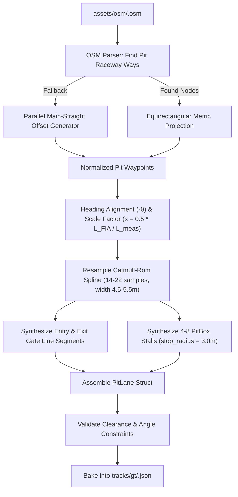

# Feature Spec: Procedural GT Circuit Pit Lanes from OpenStreetMap Survey Data 🏎️🛣️⏱️

A comprehensive content and tooling specification to procedurally generate, calibrate, and bake physical **Pit Lanes** (`PitLane`, `PitBox`, bypass splines, entry/exit gates) across all 18 official **GT / Formula Circuits** in **TdRace** using authentic OpenStreetMap (OSM) survey geometries and procedural offset fallbacks.

While Spec 062 established the core engine architecture, speed limiter, 2.5s interactive service procedure, and HUD telemetry, official circuits currently lack baked `pit_lane` structures. This specification bridges real-world geographic telemetry to in-game pit stops, ensuring all 18 GT tracks feature authentic, validated pit road infrastructure.

---

## 🎯 Executive Summary & Problem Statement

### 1. The Problem
- **Missing Infrastructure**: In the official track catalogue, all 18 GT circuits currently declare `pit_lane: None`.
- **Untapped Geographic Data**: The repository already caches rich OSM survey datasets in `assets/osm/` for all GT circuits (e.g. `monza.osm`, `spa.osm`, `silverstone.osm`, `catalunya.osm`). These datasets contain explicit `raceway=pitlane` or `name="Pit Lane"` / `name="Boxengasse"` way vectors that are currently ignored by track importers.
- **Scale and Alignment Discrepancies**: GT circuits in TdRace are scaled to $0.5\times$ FIA homologation length and rotated so the starting straight points along $+X$. Extracting pit lanes requires applying identical projective transforms, origin centering, and scaling factors to prevent spatial misalignment between the pit road and main circuit ribbon.

### 2. Proposed Solution
1. **OSM Pit Extractor & Pipeline**: Extend `scripts/osm_importer.py` to identify pit road ways, extract their geographic nodes, project them into local metric coordinates, rotate them by $-\theta$, and scale them to match the $0.5\times$ circuit scale.
2. **Procedural Stalls & Gates**: Automatically compute entry/exit line segments across the track boundaries and distribute team pit stalls (`PitBox` with 3.0m stop radius) along the pit lane central straight.
3. **Robust Fallbacks**: For street tracks or complex multi-segment layouts without continuous OSM pit lines (e.g. `madring`, `monaco`), provide deterministic procedural offset bypass ribbons derived parallel to the main straight.
4. **Automated Validation & Baking**: Ensure all generated pit lanes satisfy Spec 062 validation rules: non-acute divergence angles ($< 60^\circ$), minimum road width $\ge 4.0\text{m}$, clear barrier separation, and valid progression distance.

---

## 🗺️ User Flow & Interface Design

### 1. In-Race Navigation & Pit Entry Flow on GT Circuits

```mermaid
stateDiagram-v2
    [*] --> HighSpeedRacing: Racing on Main Circuit Straight
    HighSpeedRacing --> ApproachPitEntry: Divergence deceleration (Right or Left side)
    
    state "Pit Road Transit" as PitRoadState {
        ApproachPitEntry --> CrossEntryGate: Crosses Entry Gate Line Segment
        CrossEntryGate --> SpeedLimiterActive: Auto-govern to 60 km/h (Audio chatter + Cyan HUD)
        SpeedLimiterActive --> LocateTeamStall: Team pit stall highlighted with dynamic chevron
        LocateTeamStall --> HaltInBox: Player stops inside 3.0m radius (v < 1.5 m/s)
        
        state "2.5s Service Sequence" as ServiceSeq {
            HaltInBox --> PneumaticJacks: Car lifted +0.08m
            PneumaticJacks --> TireChange: Tires reset to 0.0 wear (1.0s)
            TireChange --> AeroRepair: Bodywork patched +25% (1.0s)
            AeroRepair --> Release: Green "GO! GO! GO!" released (0.5s)
        }
        
        Release --> AccelerateToExit: Throttle applied up to 60 km/h limiter
    }
    
    AccelerateToExit --> CrossExitGate: Crosses Exit Gate Line Segment
    CrossExitGate --> BlendIntoTrack: Limiter lifts; rejoin main track downstream of S/F
    BlendIntoTrack --> [*]: Full Race Speed Restored
```



### 2. Target GT Circuit Roster (18 Tracks)

All 18 official GT circuits will be equipped with physical pit lanes:

| # | Circuit Slug | Real Raceway Name | OSM Dataset | Pit Source |
|---|--------------|-------------------|-------------|------------|
| 1 | `monza` | Autodromo Nazionale Monza | `assets/osm/monza.osm` | OSM Way 38168747 ("Pit Lane") |
| 2 | `spa` | Circuit de Spa-Francorchamps | `assets/osm/spa.osm` | OSM Way 126807525 / F1 Pit |
| 3 | `silverstone` | Silverstone GP Circuit | `assets/osm/silverstone.osm` | OSM National / Wing Pit Straight |
| 4 | `catalunya` | Circuit de Barcelona-Catalunya | `assets/osm/catalunya.osm` | OSM Ways 33742214 + 178416729 + 178416733 |
| 5 | `nurburgring_gp`| Nürburgring GP-Strecke | `assets/osm/nurburgring_gp.osm` | OSM Way 30815119 ("Boxengasse") |
| 6 | `red_bull_ring`| Red Bull Ring Spielberg | `assets/osm/red_bull_ring.osm` | OSM Way 289111668 ("Boxenstraße") |
| 7 | `bahrain` | Bahrain International Circuit | `assets/osm/bahrain.osm` | OSM Way 187123422 ("Pit Lane") |
| 8 | `bathurst` | Mount Panorama Circuit | `assets/osm/bathurst.osm` | OSM Way 37594848 ("Pit Lane") |
| 9 | `cota` | Circuit of the Americas | `assets/osm/cota.osm` | OSM Way 514836373 ("Pit Lane") |
| 10| `interlagos` | Autódromo José Carlos Pace | `assets/osm/interlagos.osm` | OSM Way 33779109 ("Pit Lane") |
| 11| `portimao_gp` | Autódromo Internacional do Algarve | `assets/osm/portimao_gp.osm` | OSM Ways 511859459 + 157790380 |
| 12| `suzuka` | Suzuka International Racing Course | `assets/osm/suzuka.osm` | OSM Way 120917578 ("Pit Lane") |
| 13| `zandvoort` | Circuit Zandvoort | `assets/osm/zandvoort.osm` | OSM Pit Raceway Way |
| 14| `montreal` | Circuit Gilles Villeneuve | `assets/osm/montreal.osm` | OSM Pit Straight Way |
| 15| `le_mans_sarthe`| Circuit des 24 Heures du Mans | `assets/osm/le_mans_sarthe.osm` | OSM Ways 257057570 + 257063576 |
| 16| `marina_bay` | Marina Bay Street Circuit | `assets/osm/marina_bay.osm` | OSM Pit Building alignment / Parallel Offset |
| 17| `monaco` | Circuit de Monaco | `assets/osm/monaco.osm` | Boulevard Albert 1er Parallel Offset |
| 18| `madring` | Circuito de Madrid IFEMA | `assets/osm/madring.osm` | Paddock Pit Straight Parallel Offset |

---

## ⚙️ Backend Models & API Endpoints

### 1. Data Structures (`arcade-race-core::track`)

```rust
use glam::Vec2;
use serde::{Deserialize, Serialize};
use crate::track::geometry::LineSegment;
use crate::track::spline::TrackSpline;

/// Designated pit service stall along the pit road.
#[derive(Debug, Clone, Copy, PartialEq, Serialize, Deserialize)]
pub struct PitBox {
    pub position: Vec2,
    pub direction: Vec2,
    pub stop_radius: f32,
    pub elevation: f32,
}

/// Comprehensive physical pit lane definition for a circuit.
#[derive(Debug, Clone, Serialize, Deserialize)]
pub struct PitLane {
    pub spline: TrackSpline,
    pub entry_gate: LineSegment,
    pub exit_gate: LineSegment,
    pub speed_limit: f32, // 16.67 m/s (60 km/h)
    pub pit_boxes: Vec<PitBox>,
}
```

### 2. Procedural Extraction & Transformation Architecture



### 3. Mathematical Operations
1. **Transform Parity**: Use the circuit's registered `(lat0, lon0)` origin, rotate by $-\theta_{\text{start}}$, and multiply by scale factor $s = 0.5 \cdot L_{\text{FIA}} / L_{\text{measured}}$.
2. **Resampling**: Uniformly resample between the start divergence and exit merge to maintain consistent Catmull-Rom tangent vectors.
3. **Gate Synthesis**:
   - `entry_gate`: Line segment from track edge at start of divergence to pit lane start point.
   - `exit_gate`: Line segment from pit lane end point to track edge at merge.
4. **Pit Box Placement**:
   - Compute length $L_{\text{pit}}$ of the pit spline.
   - Place $N$ stalls ($N \in [4, 8]$) evenly spaced along the middle $60\%$ of the pit lane:
     $$s_k = 0.20 \cdot L_{\text{pit}} + k \cdot \frac{0.60 \cdot L_{\text{pit}}}{N - 1}$$
   - Orient stall heading with spline tangent angle.

---

## 🛡️ Security & Role-Based Access Controls (RBAC)

### 1. Invariants & Anti-Exploit Rules
1. **Non-Intersection Invariant**: Pit spline points must not cross or intersect the main track ribbon except at designated entry/exit boundaries.
2. **Speed Governor Uniformity**: All GT pit lanes enforce `speed_limit = 16.67` m/s ($60\text{ km/h}$).
3. **Anti-Cut Compliance**: Entry gate must precede the finish line checkpoint and exit gate must follow the finish line checkpoint along the race direction.
4. **Submodule Isolation**: Changes to circuit JSON files in `tracks/gt/*.json` are committed within the `tracks` submodule, and the pointer is updated cleanly in `tdrace`.
5. **Deterministic Seed & Rebuild**: Pit lane generation script must be completely idempotent; running the builder multiple times yields identical JSON representations.

---

## 🧪 Verification & Acceptance Criteria

### Automated Tests
- Command to run GT pit lane integration tests:
  ```bash
  cargo test -p tdrace-core --test gt_pit_lane_tests
  ```
- Command to verify track JSONs pass full engine validation:
  ```bash
  cargo test -p arcade-race-core --test track_tests
  ```

### Manual Acceptance Criteria (Pseudo-Gherkin)

- **Scenario: All 18 GT circuits contain valid physical pit lanes**
  - [ ] **Given** the 18 official GT circuit JSON definitions in `tracks/gt/`
  - [ ] **When** each circuit is deserialized by `Track::from_json`
  - [ ] **Then** `track.pit_lane` is `Some(lane)`
  - [ ] **And** `lane.spline.total_length()` is $\ge 80.0\text{ m}$
  - [ ] **And** `lane.pit_boxes.len()` is between $4$ and $10$
  - [ ] **And** `lane.speed_limit` equals $16.67\text{ m/s} \pm 0.1$ ($60\text{ km/h}$)

- **Scenario: GT pit lane entry and exit gates bridge the track corridor cleanly**
  - [ ] **Given** any official GT track with a defined `pit_lane`
  - [ ] **When** validating `lane.entry_gate` and `lane.exit_gate`
  - [ ] **Then** the entry gate starts near the main track edge and ends near the pit road entrance
  - [ ] **And** the exit gate cleanly bridges the pit road exit back to the main circuit ribbon
  - [ ] **And** `track.validate_pit_lane()` returns no acute angle or overlap errors

- **Scenario: In-game pit stop execution on Monza Autodromo**
  - [ ] **Given** a player racing a GT car at Monza with $85\%$ tire wear
  - [ ] **When** steering right into the pit lane across the entry gate
  - [ ] **Then** the cyan `[PIT LIMITER: 60 KM/H]` banner illuminates
  - [ ] **And** stopping in the team pit box triggers the $2.5\text{s}$ service loop
  - [ ] **And** tires are reset to $0.0$ wear and released with green `[GO! GO! GO!]`

---

## 🔗 Traceability & Codebase Mapping

### Created/Modified Files
- `[ ]` `scripts/osm_importer.py` -> Adds GT pit lane extractor, transformer, and generator logic.
- `[ ]` `tracks/gt/*.json` -> Updates all 18 GT circuit JSONs with baked `pit_lane` definitions.
- `[ ]` `crates/tdrace-core/tests/gt_pit_lane_tests.rs` -> Integration tests verifying pit lanes across all 18 GT circuits.
- `[ ]` `specs/constitution/ROADMAP.md` -> Registers Spec 077 in Phase 6.
- `[ ]` `specs/index.md` -> Registers Spec 077 in the progressive specification index.
