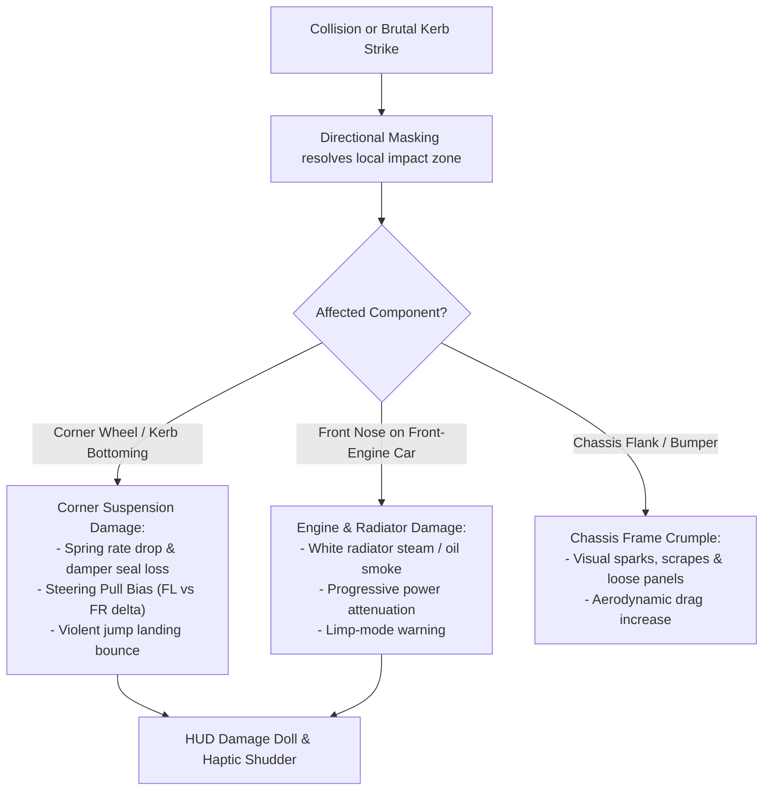

# Feature Spec: Directional Impact Masking, Engine Placement Damage, and Archetype Suspension Failure 💥⚙️📐

A comprehensive physics, damage, and economic specification extending the baseline vehicle durability model ([Spec 063](063_damage_modelling_inrace_field_repairs_and_garage_maintenance_economy.md)) into a high-fidelity **Component-Aware Damage Simulation**. Operating in the deterministic simulation crates [`crates/wheelbase`](../crates/wheelbase) and [`crates/arcade-race-core`](../crates/arcade-race-core), this specification introduces **Directional Collision Impact Masking**, **Powertrain Placement Vulnerability** (Front, Mid, Rear), **4-Corner Archetype-Specific Suspension Damage** that couples directly into steering alignment and jump landing physics, and an **Itemized Garage Maintenance Economy**.

---

## 🎯 Executive Summary & Problem Statement

### 1.1 The Monolithic Damage Blindspot
While [Spec 063](063_damage_modelling_inrace_field_repairs_and_garage_maintenance_economy.md) introduced a 0–100% chassis durability bar and [Spec 076](076_pragmatic_multi_tier_suspension_archetypes_and_perceptible_compliance.md) established 6 distinct suspension archetypes, damage simulation in `tdrace` still possesses critical physical disconnects:
1. **Uniform Impact Vulnerability (Zero Spatial Awareness)**:
   Collision energy is integrated into a single scalar `health` pool. A head-on barrier crash at $130\text{ km/h}$ inflicts identical damage regardless of whether a vehicle is a front-engine NASCAR Stock Car (where the radiator and engine block absorb the collision) or a rear-engine Porsche 911 GT3 (where the engine is safely isolated in the tail behind a crumple zone).
2. **Indestructible Suspensions**:
   Suspensions dynamically deflect and bottom out on bump stops (`bottomed_out: bool`), but never suffer structural damage. Drivers can clobber raised concrete apex curbs at $180\text{ km/h}$ or launch 40-meter jumps onto flat asphalt without bending tie rods, cracking pushrods, or blowing damper seals.
3. **Disconnected Physics Consequences**:
   Damage only produces symmetric top-speed handicaps and smoke. In reality, clipping a wall or kerb with a front wheel bends the steering arm, causing the vehicle to pull severely toward the damaged side, wobble under trail-braking, and bounce uncontrollably on jump touchdowns.
4. **Coarse Repair Economics**:
   Post-race garage repairs deduct a flat fee for general "chassis condition", lacking the tactile motorsport immersion of paying for a bent A-arm, a blown inboard pushrod damper, or a holed radiator.

### 1.2 Core Design Principles
- **Spatial Collision Masking**: Resolves the exact local contact point relative to the physical chassis skeleton ([Spec 075](075_physical_chassis_skeleton_explicit_anchor_points_and_proportional_rendering_harmonization.md)) into distinct impact quadrants (`FrontNose`, `RearTail`, `FlankLeft`, `FlankRight`, and the 4 wheel corners).
- **Powertrain Shielding & Vulnerability**: Front-engine cars suffer heavy engine/cooling damage from frontal impacts; mid/rear-engine cars protect their blocks in head-on hits but suffer catastrophic powertrain failure from rear-end shunts or flank punctures.
- **Archetype-Specific Suspension Fragility**: Fragility and failure modes are dictated directly by suspension architecture: delicate carbon fiber pushrods shatter on violent curb strikes; MacPherson struts bend under lateral impact causing permanent steering pull; off-road long-travel dampers suffer seal blowout causing uncontrolled jump bouncing.
- **Tangible Driving Handicaps**: Suspension damage actively perturbs steering balance (asymmetric pulling), increases high-speed vibration, degrades dynamic camber grip, and eliminates jump landing cushion.
- **Itemized Component Repair Economy**: Garage invoices provide an itemized mechanical breakdown (Chassis Straightening, Engine Overhaul, Corner Suspension Rebuilds) respecting the $40\%$ prize purse safety cap.

---

## 🗺️ User Flow & Interface Design

### 1. In-Race HUD & Cockpit Feedback



1. **HUD 4-Corner Damage Wireframe (Chassis Doll)**:
   - Positioned above the Cockpit Tire Monitor ([Spec 074](074_decoupled_wheel_geometry_and_data_driven_tire_compounds.md)) in the lower-left HUD.
   - Displays an orthographic silhouette of the car with 6 segmented zones:
     - `Engine Bay` (Front, Mid, or Rear depending on car configuration): Color gradient (Green $\to$ Yellow $\to$ Red $\to$ Flashing Black).
     - `Chassis Monocoque` (Center tub): Overall structural integrity.
     - `4 Suspension Corners` (FL, FR, RL, RR): Independent strut indicators. Damaged corners pulse red with bent-wheel icon.
2. **Steering Pull & Force Feedback**:
   - Damaged front suspension applies an internal steering offset angle. On gamepads and keyboard steering smoothing ([Spec 038](038_keyboard_steering_smoothing_and_drivetrain_telemetry_isolation.md)), the player must continuously hold opposite lock to keep the car travelling straight down the straightaway.
3. **Jump Landing Instability**:
   - Touching down with a blown corner suspension triggers high-frequency camera trauma ($+0.45$), asymmetric roll snap, and instant tire squeal as the bump stop hits bare chassis.

---

### 2. Post-Race Garage Itemized Repair Ledger

At race completion in Career Mode and Championships, the Race Summary presents an itemized repair bill before debiting funds:

```
┌────────────────────────────────────────────────────────┐
│               VEHICLE DAMAGE & REPAIR INVOICE          │
├────────────────────────────────────────────────────────┤
│ Vehicle: Carrera GT3 (Rear-Engine • Double Wishbone)   │
├────────────────────────────────────────────────────────┤
│ Component Assessment:                                  │
│   • Chassis Monocoque Integrity (78%):        -$310 Cr │
│   • Powertrain / Engine Block (100%):            $0 Cr │
│     ↳ Front impact spared rear engine                  │
│   • Front-Left Double Wishbone (42%):         -$480 Cr │
│     ↳ Bent upper control arm & steering pull           │
│   • Front-Right Double Wishbone (85%):        -$120 Cr │
│   • Rear Suspension Assembly (100%):             $0 Cr │
│ ────────────────────────────────────────────────────── │
│ Total Mechanical Damage:                      -$910 Cr │
│ Sponsor Safety Subsidy (Excess Cap):            +$0 Cr │
├────────────────────────────────────────────────────────┤
│ NET DEDUCTED FROM PURSE:                      -$910 Cr │
│ Wallet Balance:                            $34,120 Cr  │
│ [R] Repair All ($910 Cr)    [C] Repair Selected Only   │
└────────────────────────────────────────────────────────┘
```

---

## ⚙️ Backend Models & API Endpoints

### 1. Vehicle Engine Placement Architecture

Extending [`CarConfig`](../crates/wheelbase/src/config.rs):

```rust
/// Physical powertrain and engine layout architecture.
#[derive(Debug, Clone, Copy, PartialEq, Eq, Hash, Serialize, Deserialize)]
#[serde(rename_all = "snake_case")]
pub enum EnginePlacement {
    /// Front-mounted engine (Stock Car, GT4 Coupe, Rally Hatch).
    FrontEngine,
    /// Mid-mounted engine behind cockpit, ahead of rear axle (Supercar Lites, Ferrari 296, Kart).
    MidEngine,
    /// Rear-mounted engine over or behind rear axle (Porsche 911 GT3).
    RearEngine,
}

impl Default for EnginePlacement {
    fn default() -> Self {
        Self::FrontEngine
    }
}
```

Embedded in `CarConfig`:
```rust
pub struct CarConfig {
    // ... existing fields ...
    /// Physical engine mounting location governing collision vulnerability.
    pub engine_placement: EnginePlacement,
}
```

---

### 2. Directional Impact Masking & Contact Resolution

Given a collision event (wall collision contact point $\mathbf{P}_{\text{contact}}$ or car-to-car impact), the contact position is mapped into the vehicle's local coordinate frame:
$$\mathbf{r}_{\text{local}} = \mathbf{R}(-\theta) \cdot (\mathbf{P}_{\text{contact}} - \mathbf{P}_{\text{cg}})$$
Where $\mathbf{R}(-\theta)$ rotates world coordinates by the inverse yaw angle $\theta$, and $\mathbf{r}_{\text{local}} = (x_{\text{local}}, y_{\text{local}})$ ($+x$ is forward, $+y$ is right).

Using the axle distances $l_f, l_r$, half-width $W_{\text{half}} = \frac{W_{\text{body}}}{2}$, and overhangs from [`ChassisSkeleton`](../crates/wheelbase/src/config.rs#L629-L648):

```rust
/// Discrete impact zone resolved from local collision coordinates.
#[derive(Debug, Clone, Copy, PartialEq, Eq)]
pub enum ImpactZone {
    FrontNose,
    RearTail,
    FlankLeft,
    FlankRight,
    CornerFL,
    CornerFR,
    CornerRL,
    CornerRR,
}
```

#### Collision Zone Classification Boundaries:
1. **Front Wheel Corners (`CornerFL`, `CornerFR`)**:
   $$x_{\text{local}} \in [l_f - 0.40, l_f + 0.35] \quad \text{and} \quad |y_{\text{local}}| > 0.55 \cdot W_{\text{half}}$$
2. **Rear Wheel Corners (`CornerRL`, `CornerRR`)**:
   $$x_{\text{local}} \in [-l_r - 0.35, -l_r + 0.40] \quad \text{and} \quad |y_{\text{local}}| > 0.55 \cdot W_{\text{half}}$$
3. **Front Nose (`FrontNose`)**:
   $$x_{\text{local}} > l_f - 0.20 \quad \text{and} \quad |y_{\text{local}}| \le 0.55 \cdot W_{\text{half}}$$
4. **Rear Tail (`RearTail`)**:
   $$x_{\text{local}} < -l_r + 0.20 \quad \text{and} \quad |y_{\text{local}}| \le 0.55 \cdot W_{\text{half}}$$
5. **Flanks (`FlankLeft`, `FlankRight`)**:
   $$-l_r + 0.40 \le x_{\text{local}} \le l_f - 0.40 \quad \text{and} \quad |y_{\text{local}}| > 0.40 \cdot W_{\text{half}}$$

---

### 3. Component Damage Energy Partitioning

When total raw collision damage energy $E_{\text{damage}}$ is computed (via `WallCollisionEvent::estimated_damage_energy()` or `CarCarCollisionEvent`), it is partitioned across **Chassis**, **Engine**, and **Suspension** according to the resolved `ImpactZone` and `EnginePlacement`:

$$\begin{aligned}
\Delta E_{\text{chassis}} &= E_{\text{damage}} \cdot w_{\text{chassis}} \\
\Delta E_{\text{engine}} &= E_{\text{damage}} \cdot w_{\text{engine}}(\text{Zone}, \text{Placement}) \\
\Delta E_{\text{susp}, i} &= E_{\text{damage}} \cdot w_{\text{susp}, i}(\text{Zone})
\end{aligned}$$

#### Energy Weighting Matrix:

| Impact Zone | Front-Engine Weights $(C, E, S)$ | Mid-Engine Weights $(C, E, S)$ | Rear-Engine Weights $(C, E, S)$ |
| :--- | :---: | :---: | :---: |
| **`FrontNose`** | $C: 0.20, \mathbf{E: 0.70}, S: 0.10$ | $C: 0.65, \mathbf{E: 0.05}, S: 0.30$ | $C: 0.70, \mathbf{E: 0.00}, S: 0.30$ |
| **`RearTail`** | $C: 0.75, \mathbf{E: 0.05}, S: 0.20$ | $C: 0.45, \mathbf{E: 0.40}, S: 0.15$ | $C: 0.15, \mathbf{E: 0.75}, S: 0.10$ |
| **`FlankLeft/Right`** | $C: 0.60, \mathbf{E: 0.15}, S: 0.25$ | $C: 0.40, \mathbf{E: 0.45}, S: 0.15$ | $C: 0.50, \mathbf{E: 0.30}, S: 0.20$ |
| **`CornerFL/FR`** | $C: 0.25, E: 0.15, \mathbf{S_{\text{front}}: 0.60}$ | $C: 0.35, E: 0.00, \mathbf{S_{\text{front}}: 0.65}$ | $C: 0.35, E: 0.00, \mathbf{S_{\text{front}}: 0.65}$ |
| **`CornerRL/RR`** | $C: 0.40, E: 0.05, \mathbf{S_{\text{rear}}: 0.55}$ | $C: 0.25, E: 0.25, \mathbf{S_{\text{rear}}: 0.50}$ | $C: 0.15, E: 0.35, \mathbf{S_{\text{rear}}: 0.50}$ |

> [!IMPORTANT]
> **Powertrain Immunity Invariant**: In a head-on `FrontNose` collision, a Rear-Engine car directs $0\%$ of impact energy into the engine block. The radiator lines may be bruised, but catastrophic mechanical engine failure is physically impossible from a nose impact.

---

### 4. Suspension Damage & Dynamic Coupling

#### A. Multi-Source Suspension Damage Integration
A suspension corner $i \in \{0, 1, 2, 3\}$ (FL, FR, RL, RR) accumulates damage from three physical events:
1. **Corner Collision Impact**: Direct impact impulse directed to the wheel corner:
   $$\Delta H_{\text{impact}, i} = \frac{\Delta E_{\text{susp}}[i]}{E_{\text{susp\_capacity}} \cdot k_{\text{robustness}}(\text{Archetype})}$$
2. **Brutal Kerb Strike (Bottom-Out Impulse)**:
   When `deflection >= max_bump_travel` and deflection velocity $|v_{\text{deflect}}| > v_{\text{bottom\_crit}}$:
   $$\Delta H_{\text{kerb}, i} = \frac{0.5 \cdot m_{\text{corner}} \cdot (v_{\text{deflect}} - v_{\text{bottom\_crit}})^2}{E_{\text{bumpstop\_capacity}} \cdot k_{\text{robustness}}(\text{Archetype})}$$
3. **Violent Jump Touchdown**:
   When landing a jump with vertical velocity $v_z < -v_{\text{landing\_limit}}$:
   $$\Delta H_{\text{landing}, i} = \frac{0.5 \cdot m_{\text{corner}} \cdot (|v_z| - v_{\text{landing\_limit}})^2}{E_{\text{landing\_capacity}} \cdot k_{\text{robustness}}(\text{Archetype})}$$

#### B. Archetype Fragility & Failure Multipliers ($k_{\text{robustness}}$)

| Suspension Archetype | Robustness Factor $k_{\text{robustness}}$ | Failure Susceptibility | Dominant Mechanical Failure Mode |
| :--- | :---: | :---: | :--- |
| **`PushrodInboard`** | **$0.45$ (Most Fragile)** | Extreme kerb/impact fragility | Carbon fiber pushrod buckle $\to$ corner collapses onto bump stop, $+40\%$ aero drag. |
| **`MacPhersonStrut`** | **$0.75$ (Moderate)** | High lateral bending | Strut piston bend $\to$ permanent static camber distortion & severe steering pull. |
| **`DoubleWishbone`** | **$1.00$ (Baseline)** | Balanced resilience | Triangulated arm play $\to$ toe wobble, high-speed twitchiness under trail-braking. |
| **`SolidLiveAxle`** | **$1.45$ (Rugged)** | High vertical toughness | Panhard rod bend $\to$ asymmetric dog-tracking ("crabbing") & violent axle tramp. |
| **`LongTravelOffRoad`**| **$2.20$ (Heavy-Duty)**| Virtually immune to curbs/jumps| Blown bypass valve $\to$ loss of damping ratio $\zeta \to 0.10$, uncontrolled pogo bounce. |
| **`RigidKart`** | **$0.55$ (High Fatigue)**| High frame shock fatigue | Frame rail bend $\to$ loss of caster jacking, inside rear tire drags and bogs engine. |

---

### 5. Physical Consequences on Handling & Driving

Extending [`CarState`](../crates/wheelbase/src/car.rs):

```rust
pub struct CarState {
    // ... existing fields ...
    /// Structural health of chassis frame [0.0 = wrecked, 1.0 = pristine].
    pub chassis_health: f32,
    /// Mechanical health of engine & cooling block [0.0 = blown, 1.0 = pristine].
    pub engine_health: f32,
    /// 4-corner suspension health [FL, FR, RL, RR] [0.0 = destroyed, 1.0 = pristine].
    pub suspension_health: [f32; 4],
}
```

#### A. Steering Pull Angle ($\Delta \delta_{\text{pull}}$)
Asymmetric damage across the front axle creates an uncommanded steering bias:
$$\delta_{\text{bias}} = \left( H_{\text{susp}}[\text{FR}] - H_{\text{susp}}[\text{FL}] \right) \cdot \delta_{\text{max\_pull}}$$
Where $\delta_{\text{max\_pull}} = 0.087\text{ rad}$ ($5.0^\circ$).
The vehicle's effective steering angle becomes:
$$\delta_{\text{effective}} = \delta_{\text{driver}} + \delta_{\text{bias}}$$
When driving in a straight line ($\delta_{\text{driver}} = 0$), the vehicle continuously veers toward the damaged front corner.

#### B. Dynamic Camber Distortion
Damaged corners suffer structural camber misalignment:
$$\gamma_{\text{actual}} = \gamma_{\text{nominal}} + \text{sign} \cdot (1.0 - H_{\text{susp}}[i]) \cdot 0.10\text{ rad}$$
Distorting the tire contact patch and cutting lateral cornering stiffness by up to $35\%$.

#### C. Jump Landing Damping Loss & Snap Oversteer
Nominal jump absorption dampens $25\%$ of landing impulse ([`crates/wheelbase/src/car.rs#L2733`](../crates/wheelbase/src/car.rs#L2733)).
With suspension degradation:
$$\eta_{\text{landing\_absorption}} = 0.25 \cdot \min\left(H_{\text{susp}}[\text{FL}], H_{\text{susp}}[\text{FR}], H_{\text{susp}}[\text{RL}], H_{\text{susp}}[\text{RR}]\right)$$
If a corner has $H_{\text{susp}} = 0.0$, absorption drops to $0.0$.
Furthermore, asymmetric landing impulses induce an instantaneous roll disturbance torque:
$$\tau_{\text{roll\_snap}} = (F_{z, \text{left}} - F_{z, \text{right}}) \cdot \frac{W_{\text{track}}}{2}$$
Causing the car to aggressively bottom out, snap roll, and immediately destabilize upon touchdown.

#### D. Engine Power & Cooling Penalties
Engine health directly attenuates tractive drive force and rev limit:
$$T_{\text{drive\_avail}} = T_{\text{drive\_nominal}} \cdot \left( 0.40 + 0.60 \cdot H_{\text{engine}}^{1.5} \right)$$
When $H_{\text{engine}} < 0.30$, white water vapor and blue oil smoke emit continuously from the vehicle's engine bay anchor point ([Spec 075](075_physical_chassis_skeleton_explicit_anchor_points_and_proportional_rendering_harmonization.md)).

---

### 6. Dual-Stage Repairs & Itemized Garage Economics

#### Stage 1: In-Race Pit Stop Emergency Service
- **Tires**: Replaced to $100\%$ fresh rubber ($W_i = 0.0, T_i = 85^\circ\text{C}$).
- **Emergency Suspension Patch**: Mechanics hammer out bent tie rods:
  $$H_{\text{susp\_post\_pit}}[i] = \min\left(0.60, H_{\text{susp\_current}}[i] + 0.25\right)$$
  *Ceiling*: In-race stops cannot restore suspension beyond $60\%$ (mild steering pull remains until post-race overhaul).
- **Emergency Engine Patch**:
  $$H_{\text{engine\_post\_pit}} = \min\left(0.70, H_{\text{engine\_current}} + 0.25\right)$$
  Tapes radiators and tops off fluids, lifting car out of limp mode.

#### Stage 2: Post-Race Itemized Garage Overhaul
Repairs in the Garage screen are itemized by component:

$$\text{Cost}_{\text{chassis}} = \text{round\_to\_10}\left( B_{\text{purse}}(\text{tier}) \times 0.15 \times (1.0 - H_{\text{chassis}})^{1.2} \right)$$
$$\text{Cost}_{\text{engine}} = \text{round\_to\_10}\left( B_{\text{purse}}(\text{tier}) \times 0.25 \times k_{\text{powertrain}} \times (1.0 - H_{\text{engine}})^{1.4} \right)$$
$$\text{Cost}_{\text{susp}}[i] = \text{round\_to\_10}\left( B_{\text{purse}}(\text{tier}) \times 0.08 \times k_{\text{part\_cost}}(\text{Archetype}) \times (1.0 - H_{\text{susp}}[i])^{1.2} \right)$$

Where $k_{\text{powertrain}}$:
- `FrontEngine`: $1.00$
- `MidEngine`: $1.35$ (complex packaging, tight clamshell labor)
- `RearEngine`: $1.50$ (flat-6 specialized labor)

And $k_{\text{part\_cost}}(\text{Archetype})$:
- `PushrodInboard`: $2.20$ (hand-laid carbon fiber pushrods)
- `DoubleWishbone`: $1.20$ (billet aluminum wishbones)
- `MacPhersonStrut`: $0.80$ (stamped steel / OEM damper)
- `SolidLiveAxle`: $0.65$ (heavy cast iron axle)
- `LongTravelOffRoad`: $1.10$ (rebuildable remote-reservoir bypass shocks)
- `RigidKart`: $0.50$ (chromoly tubing weld)

#### Anti-Bankruptcy Sponsor Protections
The total invoice sum $\sum \text{Cost}$ remains strictly clamped to $\le 40\%$ of the race purse won in that round. The sponsor mechanic provides free repairs to $50\%$ across all components if liquid bank balance is under $\$1,000\,\text{Cr}$.

---

## 🛡️ Security & Role-Based Access Controls (RBAC)

1. **Spatial Determinism Invariant**: Directional collision masking uses exact local transforms $\mathbf{R}(-\theta) \cdot (\mathbf{P}_{\text{contact}} - \mathbf{P}_{\text{cg}})$, guaranteeing identical component damage distribution across headless simulations, network replays, and platforms.
2. **Headless Safety Invariant**: All damage models reside strictly within `wheelbase` and `arcade-race-core`. No window, OpenGL context, or audio system is queried during damage integration.
3. **Sponsor Anti-Softlock Guarantee**: Net race winnings deposited to `PlayerProfile.credits` can never be negative, even if all 4 suspension corners and the engine are $100\%$ destroyed.

---

## 🧪 Verification & Acceptance Criteria

### Automated Regression Tests
- `cargo test -p wheelbase test_directional_impact_masking_zones`
- `cargo test -p wheelbase test_rear_engine_headon_collision_immunity`
- `cargo test -p wheelbase test_macpherson_curb_bottoming_steering_pull`
- `cargo test -p wheelbase test_pushrod_fragility_drag_penalty`
- `cargo test -p wheelbase test_jump_landing_damping_loss_roll_snap`
- `cargo test -p tdrace-app test_itemized_garage_repair_invoice_archetype_pricing`

---

### Manual Acceptance Criteria (Pseudo-Gherkin)

#### Scenario: Head-on barrier crash on rear-engine sports car spares engine block
- [x] **Given** a Carrera GT3 with `RearEngine` layout, $100\%$ engine health, and $100\%$ suspension health
- [x] **When** the car collides head-on into a concrete wall with impact energy $E_{\text{damage}} \ge 6000\text{ J}$
- [x] **Then** the impact zone is classified as `ImpactZone::FrontNose`
- [x] **And** engine health remains exactly $100\%$
- [x] **And** chassis monocoque and front suspension corners (FL, FR) absorb the damage
- [x] **And** no oil smoke emits from the rear engine bay

#### Scenario: Head-on barrier crash on front-engine car destroys engine and radiator
- [x] **Given** a Thunderbolt Stock Car with `FrontEngine` layout and $100\%$ engine health
- [x] **When** the car collides head-on into a concrete barrier with impact energy $E_{\text{damage}} \ge 6000\text{ J}$
- [x] **Then** the impact zone is classified as `ImpactZone::FrontNose`
- [x] **And** engine health drops below $40\%$
- [x] **And** white radiator steam and engine smoke emit immediately from the front hood
- [x] **And** available engine power is reduced by $\ge 25\%$

#### Scenario: Apex kerb bottoming on MacPherson strut bends arm and creates steering pull
- [x] **Given** a Grassroots Hatch with `MacPhersonStrut` suspension driving at $110\text{ km/h}$
- [x] **When** the front-left wheel strikes a high apex curb causing deflection velocity $> v_{\text{bottom\_crit}}$
- [x] **Then** front-left suspension health drops below $65\%$
- [x] **And** an uncommanded steering bias $\delta_{\text{bias}} < -0.03\text{ rad}$ is introduced
- [x] **And** the player must hold right steering to maintain straight-line tracking

#### Scenario: Inboard pushrod hypercar shatters rocker on violent kerb strike
- [x] **Given** an Apex GT3 with `PushrodInboard` suspension
- [x] **When** clipping a kerb at $160\text{ km/h}$ delivering severe bottom-out force
- [x] **Then** the pushrod robustness factor $k_{\text{robustness}} = 0.45$ causes corner health to drop below $30\%$
- [x] **And** corner bump travel collapses onto the bump stop
- [x] **And** vehicle air drag coefficient increases by $+40\%$ due to splitter scraping

#### Scenario: Jump landing with blown off-road damper causes violent bounce and roll snap
- [x] **Given** a Rallycross Supercar with front-right suspension health at $20\%$ (blown damper seals)
- [x] **When** the vehicle launches off a jump ramp and lands with vertical velocity $v_z \le -5.0\text{ m/s}$
- [x] **Then** the front-right corner provides zero impulse absorption
- [x] **And** an asymmetric roll torque snaps the vehicle into a sharp roll rotation upon touchdown
- [x] **And** camera trauma spikes above $0.50$

#### Scenario: Post-race garage repair bill reflects itemized archetype component costs
- [x] **Given** a player completing a race in a hypercar with damaged `PushrodInboard` suspension and damaged engine
- [x] **When** viewing the post-race settlement ledger
- [x] **Then** suspension repairs reflect the pushrod part multiplier $k_{\text{part\_cost}} = 2.20$
- [x] **And** the total bill is capped at $\le 40\%$ of the round purse won
- [x] **And** net payout to the player's wallet is strictly positive

---

## 🔗 Traceability & Codebase Mapping

### Crates & Files Modified:
- `[x]` [`crates/wheelbase/src/config.rs`](../crates/wheelbase/src/config.rs):
  - Adds `EnginePlacement` enum (`FrontEngine`, `MidEngine`, `RearEngine`) to `CarConfig`.
  - Exposes archetype robustness and fragility factors in `SuspensionArchetype`.
- `[x]` [`crates/wheelbase/src/car.rs`](../crates/wheelbase/src/car.rs):
  - Expands `CarState` with `engine_health: f32`, `chassis_health: f32`, and `suspension_health: [f32; 4]`.
  - Implements directional impact masking resolver `resolve_impact_zone()`.
  - Couples front suspension damage into steering authority and steering bias offset `delta_bias`.
  - Couples damper degradation into jump landing vertical impulse absorption.
- `[x]` [`crates/arcade-race-core/src/collision/wall.rs`](../crates/arcade-race-core/src/collision/wall.rs):
  - Passes contact point local coordinates into damage energy allocation.
- `[x]` [`crates/arcade-race-core/src/collision/car_collision.rs`](../crates/arcade-race-core/src/collision/car_collision.rs):
  - Allocates mutual vehicle collision damage according to contact point relative to both cars' engine positions.
- `[x]` [`crates/race-kit/src/world.rs`](../crates/race-kit/src/world.rs):
  - Updates pit stop field repair to restore suspension health up to the $60\%$ ceiling.
- `[x]` [`crates/race-ui/src/hud/`](../crates/race-ui/src/hud/):
  - Implements the 6-zone orthographic chassis doll HUD wireframe displaying engine and 4-corner suspension health.
- `[x]` [`crates/tdrace-app/src/game/`](../crates/tdrace-app/src/game/):
  - Implements the itemized post-race repair ledger and garage maintenance overhaul actions.
