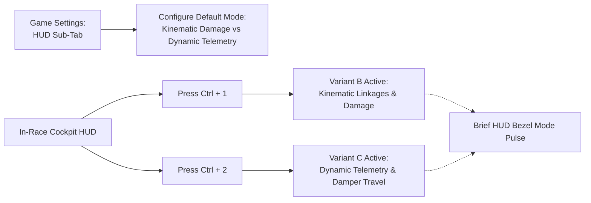

# Feature Spec: Tactical Hologram Cockpit Telemetry HUD 🌟🏎️📐

A comprehensive visual cockpit telemetry specification for **TDRace**, superseding the legacy 4-box tire monitor with an authentic, glanceable, pure graphical **Tactical Hologram HUD**. Rendered in [`crates/race-ui`](../crates/race-ui) and integrated into [`crates/tdrace-app`](../crates/tdrace-app), this HUD translates the physical simulation data of [`crates/wheelbase`](../crates/wheelbase) into an immersive cockpit instrument: proportional chassis silhouettes ([Spec 075](075_physical_chassis_skeleton_explicit_anchor_points_and_proportional_rendering_harmonization.md)), authentic powertrain placement and mechanical damage ([Spec 078](078_directional_impact_masking_engine_placement_damage_and_archetype_suspension_failure.md)), decoupled tire wear vs thermal casing ([Spec 074](074_decoupled_wheel_geometry_and_data_driven_tire_compounds.md)), dynamic front wheel Ackermann steering articulation ([Spec 026](026_topdown_wheel_steering_animations.md), [Spec 073](073_realistic_vehicle_sprite_harmonization_and_modular_steered_wheel_articulation.md)), thick multi-layer chassis impact bars, and **two switchable suspension representation modes** (<kbd>Ctrl + 1</kbd> Variant B Kinematics vs <kbd>Ctrl + 2</kbd> Variant C Dynamic Telemetry).

---

## 🎯 Executive Summary & Problem Statement

### 1.1 The Legacy Telemetry Blindspot
The current cockpit tire monitor (`render_cockpit_tire_monitor` in `crates/race-ui/src/hud/widgets.rs`) was authored as a primitive 4-box diagnostic widget. While functional for basic tire monitoring, it possesses critical architectural and visual shortcomings:
1. **Geometric Disconnect & Dimension Blindness**:
   - The HUD renders a fixed $120 \times 110\,\text{px}$ glass box with 4 generic rectangles at static, hardcoded offsets (`(20, 32)`, `(76, 32)`, `(20, 68)`, `(76, 68)`).
   - It exhibits zero awareness of the vehicle's true wheelbase ($1.05\,\text{m}$ for a shifter kart vs $3.15\,\text{m}$ for a Le Mans Hypercar), track width, front/rear overhangs, or body contour established in [Spec 075](075_physical_chassis_skeleton_explicit_anchor_points_and_proportional_rendering_harmonization.md).
2. **Invisible Powertrain & Durability State**:
   - The player has no visual feedback on engine placement or mechanical condition. A rear-engine Porsche 911 GT3, a mid-engine CrossCar, a side-engine Shifter Kart, and a front-engine NASCAR Cup car appear identical.
   - When collision energy or radiator damage degrades engine health ([Spec 078](078_directional_impact_masking_engine_placement_damage_and_archetype_suspension_failure.md)), the driver receives no spatial warning in the primary cockpit instrument.
3. **Suspension Simulation Blindness**:
   - Despite [Spec 076](076_pragmatic_multi_tier_suspension_archetypes_and_perceptible_compliance.md) establishing 6 distinct mechanical suspension archetypes and real-time `SuspensionTelemetry` (`deflection`, `normal_force`, `bottomed_out`), the cockpit HUD displays no suspension linkages, stroke travel, or load transfer.
   - When a curb strike bends an A-arm or shatters an inboard pushrod, the driver feels steering pull but has no diagnostic visual representation of the failure.
4. **Static Steered Wheels**:
   - The HUD wheels remain rigidly parallel at all times. During counter-steering, trail-braking, or hairpin turn-in, the tires do not articulate, breaking visual synchronization with the vehicle's physical steering angle.
5. **Cognitive Overload from Micro-Text**:
   - Traditional racing HUDs clutter the display with tiny numeric text percentages (`100% OK`, `45%`, `1.9g`, `0.0°`). At $200\,\text{km/h}$, these micro-labels are completely unreadable in peripheral vision, distracting the driver from the racing line.

### 1.2 Core Design Principles
- **Pure Graphical Presentation**: Zero microscopic text labels or percentages inside the HUD glass bezel. All status (tread drain, thermal heat, engine condition, chassis impact, suspension failure, steering angle) is conveyed through high-contrast vector graphics, color gradients, and mechanical animations.
- **Proportional Physical Chassis Geometry**: The HUD procedurally scales and renders the exact `ChassisSkeleton` bounds ($L, W, \text{overhangs}$) of the active vehicle platform, giving each car an instantly recognizable holographic silhouette.
- **Outboard Integrated-Drain Tires**: Tires sit outboard of the chassis skeleton on physical axle lines. The outer casing indicates temperature, while the inner tread fill drains vertically with a $50\%$ midpoint tick line.
- **Thick High-Visibility Impact Indicators**: Chassis perimeter damage renders as bold, multi-layer impact bars ($12\,\text{px}$ aura + $6\,\text{px}$ fracture bar + $2.2\,\text{px}$ white core) instantly perceptible in peripheral vision.
- **Dynamic Steered Wheels**: Front wheels visibly articulate with authentic Ackermann geometry ($1.15 \cdot \delta$ inner vs $0.88 \cdot \delta$ outer), paired with articulating mechanical steering rack tie-rods.
- **Dual In-Game Switchable Suspension Modes**: Players can select their preferred suspension representation in settings or switch on the fly via <kbd>Ctrl + 1</kbd> (Variant B: Kinematic Linkages & Damage) and <kbd>Ctrl + 2</kbd> (Variant C: Dynamic Telemetry & Damper Travel).

> [!IMPORTANT]
> **Implementation Gate & Spec Dependency Invariant**:
> Implementation of Spec 079 (visual cockpit telemetry HUD) is **strictly blocked** until [Spec 078](078_directional_impact_masking_engine_placement_damage_and_archetype_suspension_failure.md) (`tdrace-kkzl`) is fully implemented and verified.
> Spec 079 is the visual presentation layer for the physical state introduced in Spec 078 (`EnginePlacement`, `CarState.engine_health`, `CarState.suspension_health`, `ImpactZone`). No tasks in Beads Epic `tdrace-nzgz` may be claimed or coded until `tdrace-kkzl` is closed with durable verification receipts.

---

## 🗺️ User Flow & Interface Design

### 1. In-Cockpit Telemetry Overview & Visual Bezel
The Tactical Hologram HUD occupies an expanded glass card ($190 \times 220\,\text{px}$) anchored to the lower-right cockpit viewport. The bezel contains:
- **Clean Header Bezel**: Compound indicator badge (`[S]`, `[M]`, `[H]`, `[W]`, `[AT]`, `[MUD]`) and minimal modality icon. No numeric health or percentage scores.
- **Central Graphic Frame**: Proportional holographic chassis skeleton, powertrain block, outboard tires, and suspension elements.
- **Clean Footer Bezel**: Subtle mode hint (`KINEMATICS` or `DYNAMICS`) without cluttering metrics.

### 2. Live In-Game Mode Switcher Flow


- When the driver presses <kbd>Ctrl + 1</kbd>, the HUD immediately updates to **Variant B (Kinematic Architecture & Structural Damage)**, highlighting physical A-arms, pushrod coilovers, or solid axle beams, with buckled red paths on impact.
- When the driver presses <kbd>Ctrl + 2</kbd>, the HUD instantly flips to **Variant C (Dynamic Telemetry & Damper Travel)**, highlighting active $8.5 \times 28\,\text{px}$ damper stroke capsules, bump compression vs rebound fills, normal force ($F_z$) glow heatmap, and bottom-out shockwave rings.
- Settings persistence: The preferred default mode is saved to `SettingsConfig.cockpit_telemetry_mode` in user profile storage.

---

## ⚙️ Backend Models & API Endpoints

### 1. Engine & Chassis Data Integration

Grounded in [`wheelbase::CarConfig`](../crates/wheelbase/src/config.rs), [`wheelbase::car::CarState`](../crates/wheelbase/src/car.rs), and the directional damage model from [Spec 078](078_directional_impact_masking_engine_placement_damage_and_archetype_suspension_failure.md):

```rust
// Spec 078 simulation fields consumed directly by the Tactical Hologram HUD:
// - car.config.engine_placement: EnginePlacement (FrontEngine, MidEngine, RearEngine)
// - car.state.engine_health: f32 (1.0 = pristine, 0.0 = blown)
// - car.state.chassis_health: f32 (1.0 = pristine, 0.0 = wrecked)
// - car.state.suspension_health: [f32; 4] (1.0 = pristine, 0.0 = destroyed)
// - car.state.steer_angle: f32 (steering wheel angle for Ackermann wheel deflection)
// - car.state.suspension_telemetry: [SuspensionTelemetry; 4] (deflection, normal_force, bottomed_out)

/// Telemetry display mode for the cockpit HUD.
#[derive(Debug, Clone, Copy, PartialEq, Eq, Hash, Serialize, Deserialize, Default)]
#[serde(rename_all = "snake_case")]
pub enum CockpitTelemetryMode {
    /// Variant B: Authentic mechanical linkages with buckled fracture paths & camber skew.
    #[default]
    KinematicDamage,
    /// Variant C: 4-corner damper stroke capsules with dynamic Fz load transfer glow.
    DynamicTelemetry,
}

/// Normalized HUD coordinates computed from physical chassis geometry.
pub struct ChassisHudGeometry {
    pub scale: f32,
    pub front_axle_y: f32,
    pub rear_axle_y: f32,
    pub nose_y: f32,
    pub tail_y: f32,
    pub half_body_w: f32,
    pub half_track_w: f32,
    pub outboard_left_x: f32,
    pub outboard_right_x: f32,
}
```

### 2. Proportional Scaling Algorithm

Given viewport dimensions ($w_{\text{box}} = 190\,\text{px}$, $h_{\text{box}} = 220\,\text{px}$) and center $(c_x, c_y)$:

$$L_{\text{total}} = \text{wheelbase} + \text{overhang}_{\text{front}} + \text{overhang}_{\text{rear}}$$

$$S = \frac{h_{\text{box}} \cdot 0.72}{L_{\text{total}}}$$

$$\begin{aligned}
y_{\text{front\_axle}} &= c_y - \left(l_f \cdot S\right) \\
y_{\text{rear\_axle}}  &= c_y + \left(l_r \cdot S\right) \\
y_{\text{nose}}        &= y_{\text{front\_axle}} - \left(\text{overhang}_{\text{front}} \cdot S\right) \\
y_{\text{tail}}        &= y_{\text{rear\_axle}} + \left(\text{overhang}_{\text{rear}} \cdot S\right) \\
w_{\text{body\_half}}  &= \frac{\text{body\_width}}{2} \cdot S \\
w_{\text{track\_half}} &= \frac{\text{track\_width}}{2} \cdot S
\end{aligned}$$

### 3. Ackermann Steering Differential Transformation

Using vehicle steering angle $\delta$:
- When $\delta > 0$ (Right Turn): $\delta_{\text{inner}} = \delta_{\text{FR}} = 1.15 \cdot \delta$, $\delta_{\text{outer}} = \delta_{\text{FL}} = 0.88 \cdot \delta$
- When $\delta < 0$ (Left Turn): $\delta_{\text{inner}} = \delta_{\text{FL}} = 1.15 \cdot \delta$, $\delta_{\text{outer}} = \delta_{\text{FR}} = 0.88 \cdot \delta$
- When $\delta = 0$: $\delta_{\text{FL}} = \delta_{\text{FR}} = 0.0$

### 4. Dynamic Damper Stroke & Load Transfer ($F_z$) Mapping

In Variant C:
- Gauge Dimensions: $8.5 \times 28\,\text{px}$, centered horizontally on each suspension link.
- Center Notch ($0\,\text{mm}$ ride height): $y_{\text{mid}} = y_{\text{axle}}$, drawn as a $1.8\,\text{px}$ bold white bar.
- Compression Fill ($\text{deflection} > 0$): Fills upward from $y_{\text{mid}}$, capped at bump stop.
- Rebound Fill ($\text{deflection} < 0$): Fills downward from $y_{\text{mid}}$ in cyan.
- Load Line Width ($w_{\text{load}}$): $w_{\text{load}} = \text{clamp}(2.2, 5.5, F_z \cdot 2.3)\,\text{px}$, turning neon gold when $F_z \ge 1.4\,\text{g}$.

---

## 🛡️ Security & Role-Based Access Controls (RBAC)

1. **Deterministic Presentation Isolation**: The HUD is strictly a client-side presentation layer in `crates/race-ui`. Rendering state or mode toggling (<kbd>Ctrl + 1</kbd> / <kbd>Ctrl + 2</kbd>) never mutates vehicle physical state or simulation outputs in `wheelbase`.
2. **Headless Execution Compatibility**: No graphics functions or shader allocations are called when running in headless benchmarking mode (`crates/wheelbase` / simulation harnesses).
3. **Anti-Epilepsy & Visual Safety**: Bottom-out alert shockwaves and critical damage warnings are rate-limited to $\le 2\,\text{Hz}$ with soft sinusoidal decay to prevent optical fatigue.

---

## 🧪 Verification & Acceptance Criteria

### Automated Tests
- Command to run crate tests: `cargo test -p race-ui -p wheelbase`
  - `test_proportional_hud_bounds_all_8_chassis`: Asserts all 8 platform skeletons fit strictly within the $190 \times 220\,\text{px}$ box without viewport clipping.
  - `test_ackermann_hud_steer_differential`: Asserts inner wheel deflection is strictly greater than outer wheel deflection under steering input.
  - `test_cockpit_telemetry_mode_toggle`: Asserts that `CockpitTelemetryMode` transitions cleanly between `KinematicDamage` and `DynamicTelemetry`.

---

### Manual Acceptance Criteria (Pseudo-Gherkin)

#### Scenario: Proportional chassis geometry rendering across vehicle catalog
- [x] **Given** a player selecting the 125cc Shifter Kart ($1.05\,\text{m}$ wheelbase) or Le Mans Hypercar ($3.15\,\text{m}$ wheelbase)
- [x] **When** observing the cockpit telemetry HUD in race mode
- [x] **Then** the holographic chassis perimeter must render with proportional dimensions matching `ChassisSkeleton`
- [x] **And** tires must be positioned outboard of the body silhouette on the physical axle baselines

#### Scenario: Pure graphical powertrain damage status
- [x] **Given** a player car with rear-engine layout (Porsche 911 GT3)
- [x] **When** vehicle takes rear collision impact reducing engine health to $30\%$
- [x] **Then** the engine block graphic must appear behind the rear axle
- [x] **And** the engine block must glow vivid red with critical pulse animation
- [x] **And** zero numeric text percentages or status labels must appear in the HUD bezel

#### Scenario: Dynamic front wheel Ackermann steering articulation
- [x] **Given** any car driven into a right turn with $+20^\circ$ steering lock
- [x] **When** viewing the front wheels in the cockpit telemetry HUD
- [x] **Then** the front-right wheel must rotate to $+23^\circ$ (inner sharper)
- [x] **And** the front-left wheel must rotate to $+17.6^\circ$ (outer shallower)
- [x] **And** the mechanical steering rack and tie-rod linkages must visibly articulate with the hubs

#### Scenario: In-game mode switching with Ctrl+1 and Ctrl+2
- [x] **Given** the cockpit HUD is actively showing Variant B (Kinematics)
- [x] **When** the player presses <kbd>Ctrl + 2</kbd>
- [x] **Then** the HUD must transition to Variant C (Dynamic Telemetry with $8.5 \times 28\,\text{px}$ damper capsules)
- [x] **When** the player presses <kbd>Ctrl + 1</kbd>
- [x] **Then** the HUD must return to Variant B (Kinematic Linkages)

#### Scenario: Variant B buckled linkage and camber misalignment on damage
- [x] **Given** Variant B is active on a car with Double Wishbone suspension
- [x] **When** the front-left suspension takes structural damage from a curb strike
- [x] **Then** the FL wishbone must buckle into a jagged red path with pulse glow
- [x] **And** the FL wheel hub must tilt $+5.5^\circ$ camber skew

#### Scenario: Variant C damper travel and bottom-out shockwave rings
- [x] **Given** Variant C is active during hard cornering with $1.9\,\text{g}$ lateral roll
- [x] **When** the outside wheels compress under dynamic load
- [x] **Then** the outside damper stroke capsules must fill upward toward amber/red
- [x] **And** the outside wishbone link lines must thicken to $5.5\,\text{px}$ with glowing gold bloom
- [x] **When** striking an apex curb causing bottom-out
- [x] **Then** concentric pulse rings ($15\,\text{px}$ and $6\,\text{px}$) must radiate from the affected hub

---

## 🔗 Traceability & Codebase Mapping

| File Path | Component / Layer | Modification Description |
| :--- | :--- | :--- |
| [`crates/race-ui`](../crates/race-ui) | UI / Shared Crate | Implements `render_cockpit_chassis_telemetry` and `CockpitTelemetryMode`. |
| [`crates/tdrace-app/src/ui/hud.rs`](../crates/tdrace-app/src/ui/hud.rs) | App / Cockpit HUD | Replaces legacy tire monitor with `render_cockpit_chassis_telemetry`. |
| [`crates/tdrace-app/src/main.rs`](../crates/tdrace-app/src/main.rs) | App / Event Loop | Dispatches <kbd>Ctrl + 1</kbd> and <kbd>Ctrl + 2</kbd> keyboard hotkeys. |
| [`crates/wheelbase/src/config.rs`](../crates/wheelbase/src/config.rs) | Physics / Config | Supplies `ChassisSkeleton`, `PowertrainLayout`, and `SuspensionArchetype`. |
| [`crates/wheelbase/src/car.rs`](../crates/wheelbase/src/car.rs) | Physics / State | Supplies `SuspensionTelemetry`, `WheelAssemblies`, and `steer_angle`. |
| [`specs/constitution/ROADMAP.md`](constitution/ROADMAP.md) | Governance / Roadmap | Formally links Spec 079 in the living roadmap. |
| [`specs/index.md`](index.md) | Governance / OKF Index | Formally indexes Spec 079 in the progressive disclosure catalog. |
