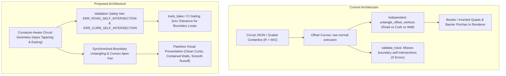

# Architecture Spec: Curvature-Aware Track Boundary Geometry, Swallowtail Pinch Elimination, and Global Circuit Validation 🏗️

A comprehensive technical architecture and geometric specification resolving boundary self-intersections, inverted swallowtail singularities, and pinch traps across real-world scaled-down and procedural race circuits in TDRace.

---

## 🔍 Context & Mathematical Problem Statement

In the 2D planar ribbon model used by TDRace, a track is defined by a 2D centerline spline $\mathbf{C}(s) = (x(s), y(s))$ parameterized by arc-length $s$, accompanied by normal vector field $\mathbf{n}(s) = (-y'(s), x'(s))$ and width profile $W(s)$.

The drivable road edges, apex curbs, and wall barrier lines are mathematical **offset curves** (parallel curves) computed along the normal vector:
$$\mathbf{C}_{\text{left}}(s) = \mathbf{C}(s) + d_{\text{left}}(s) \cdot \mathbf{n}(s)$$
$$\mathbf{C}_{\text{right}}(s) = \mathbf{C}(s) - d_{\text{right}}(s) \cdot \mathbf{n}(s)$$

Where:
- Drivable road half-width: $d_{\text{road}} = \frac{W(s)}{2}$
- Curb outer edge: $d_{\text{curb}} = \frac{W(s)}{2} + w_{\text{curb}}$ (where $w_{\text{curb}} \approx 1.35\text{ m}$)
- Wall barrier line: $d_{\text{wall}} = \frac{W(s)}{2} + d_{\text{wall\_offset}}$ (where default $d_{\text{wall\_offset}} \approx 4.0\text{ m}$)

### The Singularity Condition ($R < d$)

From classical differential geometry, the signed curvature $\kappa_d(s)$ of an offset curve at lateral distance $d$ is:
$$\kappa_d(s) = \frac{\kappa(s)}{1 - d \cdot \kappa(s)}$$

Where $\kappa(s) = \frac{1}{R(s)}$ is the curvature of the centerline, and $R(s)$ is the local radius of curvature.

When the offset distance $d$ exceeds the local radius of curvature ($d > R(s)$):
1. The denominator $(1 - d \cdot \kappa(s))$ passes through zero ($d = R(s)$), creating a **focal singularity** (the center of curvature on the evolute).
2. For $d > R(s)$, the tangent of the offset curve inverts direction: $\kappa_d(s)$ flips sign.
3. The boundary curve forms cusps and traverses backwards in parameter space, intersecting itself and forming a closed, self-intersecting **swallowtail loop** (hourglass / bowtie singularity).

### The Real-World Downscaling Discrepancy

In real-world FIA Grade 1 / Grade 2 circuits:
- Tracks are full-scale (length $4\text{--}7\text{ km}$, width $12\text{--}15\text{ m}$).
- The minimum turning radius of tight hairpins (e.g. Circuit de Barcelona-Catalunya Turn 10, Monaco Fairmont Hairpin) is kept above $12\text{--}20\text{ meters}$.
- Consequently, $R_{\text{real}} \gg \frac{W_{\text{real}}}{2}$, and the inner road edge and barriers never self-intersect.

However, in TDRace:
- Official GT circuits were scaled down to **0.5x scale** (Spec 042 & 071) to fit arcade camera viewports and gameplay pacing:
  - Centerline coordinates are multiplied by $0.5$, which **halves the radius of curvature**: $R_{\text{tdrace}} = 0.5 \cdot R_{\text{real}}$.
  - For example, Catalunya Turn 10 (La Caixa / Seat hairpin) has a local radius of curvature $R = 2.94\text{ m}$.
  - Yet the track width was **not halved** (kept at $W = 13.0\text{ m}$, half-width $W/2 = 6.5\text{ m}$) so that 2.0-meter wide GT cars can race two-wide.
  - As a result: $R = 2.94\text{ m} \ll \frac{W}{2} = 6.5\text{ m}$.
- Because $R < \frac{W}{2} < d_{\text{curb}} < d_{\text{wall}}$:
  1. The inner road edge forms a self-intersecting swallowtail loop spanning $\sim 11$ samples.
  2. The curb outer edge forms an even larger swallowtail loop spanning $\sim 13$ samples.
  3. The inner wall barrier extrudes directly across the racing line, intersecting itself into an acute hourglass trap.
  4. Quads drawn between the road edge and curb edge flip inside out, rendering the garbled X-shaped red-and-white curb pattern and crossed steel barrier posts shown in the user's reference image.

### Pervasiveness Across the Catalog

An exhaustive geometric audit of all 134 circuit definitions across `tracks/` reveals that this defect is not isolated to Catalunya:
- **53 out of 134 circuits** suffer from self-intersecting road edges, curb boundaries, or wall pinch traps.
- Impacted modules:
  - **GT World Challenge** (12 tracks): `catalunya`, `bahrain`, `cota`, `interlagos`, `monaco`, `montreal`, `nurburgring_gp`, `portimao_gp`, `silverstone`, `spa`, `suzuka`, `zandvoort`.
  - **Karting** (19 tracks): `ampfing`, `adria_kart`, `campillos`, `genk`, `kristianstad`, `lonato`, `pfi`, `sarno`, `seven_laghi`, `wackersdorf`, `zuera`, etc.
  - **Rallycross** (9 tracks): `catalunya_rx`, `essay_rx`, `kouvola_rx`, `lydden_hill`, `montalegre_rx`, `nyirad_rx`, `riga_rx`, etc.
  - **Autocross** (8 tracks): `bazaigues_ax`, `faleyras_ax`, `maggiora_ax`, `matschenberg_ax`, `musa_ax`, `schluechtern_ax`, `st_georges_ax`, `vilkyciai_ax`.
  - **Extreme Off-Road** (5 tracks): `crandon_short_course`, `mint400_grand_loop`, `mint400_short_course`, `supercross_stadium_arena`.

Crucially, **`validate_track()` currently produces zero errors** on these tracks because it only tests non-adjacent centerline crossings ($j \ge i + 6$) and point-to-centerline projection thresholds, completely omitting boundary polyline self-intersection tests.

---

## 🗺️ Current vs. Proposed System Architecture



### 1. Deficiencies in the Current Pipeline

1. **Blind Track Validator**:
   `validate_track()` in `crates/arcade-race-core/src/track/validation.rs` verifies waypoint distance, centerline figure-8 crossings, and static obstacles, but never checks if the left or right road edge polyline crosses itself, or if the curb outer boundary crosses itself.
2. **Independent, Lossy Untangling**:
   `untangle_offset_vertices` in `crates/arcade-race-core/src/track/spline.rs` collapses loop vertices for road edges independently from curb edges. Because $hit_{\text{road}} \neq hit_{\text{curb}}$, road quads and curb quads become misaligned, leaving inverted trapezoids where inner and outer points cross.
3. **Desynchronizing Wall Polyline Trimming**:
   `presets.rs::untangle_polyline` deletes points from `left_pts`, causing the remaining vertex indices to fall out of synchronization with `spline.samples`. This leads to wrong elevation, wrong wall type, and truncated barriers at hairpin apexes.
4. **Unconstrained Width on Scaled Circuits**:
   Scaled-down circuits retain constant 13.0 m width straight through $R = 2.94\text{ m}$ hairpin nodes without tapering, physically forcing the road boundary to cross itself regardless of rendering tricks.

### 2. Proposed Architecture & Interventions

This specification introduces a complete three-pillar remediation:

#### Pillar I: Geometric Validation Guardrails in `validate_track`
We add rigorous automated boundary diagnostic checks to `validate_track()`:
1. `ERR_ROAD_SELF_INTERSECTION`: Detects self-intersections along the left or right drivable road edge polylines:
   $$\mathbf{e}_{\text{left}}[i] \times \mathbf{e}_{\text{left}}[j] \neq \emptyset \quad \text{for } j \neq i \pm 1$$
2. `ERR_CURB_SELF_INTERSECTION`: Detects self-intersections along active left or right curb outer edge polylines:
   $$\mathbf{c}_{\text{left}}[i] \times \mathbf{c}_{\text{left}}[j] \neq \emptyset \quad \text{for active curbs}$$
3. `ERR_MINIMUM_RADIUS_VIOLATION`: Verifies that the local radius of curvature $R(s)$ satisfies:
   $$R(s) \ge \frac{W(s)}{2} + \epsilon \quad (\text{with } \epsilon = -0.05\text{ m tolerance})$$
   Emits `ValidationSeverity::Error` when $R(s) < \frac{W(s)}{2}$, identifying the exact track distance and waypoint index causing the cusp.
4. `ERR_WALL_POLYGON_PINCH`: Validates that wall barrier polylines do not form self-intersecting loops or sharp pinch traps on the inside of curves.

These diagnostics are registered at `ValidationSeverity::Error`. Any track containing such geometry is rejected by `track_bake` and fails `official_catalog_tests`.

#### Pillar II: Catalog Remediation & Scaling Standards
All 53 affected circuits in `tracks/` are systematically audited, repaired, and re-baked:
1. **Curvature-Adaptive Apex Tapering**:
   On hairpins where real-world downscaling shrinks turning radius, track width is tapered at the apex (e.g. from 13.0 m down to 9.0–10.0 m, which comfortably accommodates 2-wide GT cars with 2.0 m width).
2. **Hairpin Apex Waypoint Easing**:
   For extreme hairpins (such as Catalunya Turn 10, COTA Turn 11, Monaco Fairmont), control waypoints are eased or given an extra transition node to ensure the smooth centripetal Catmull-Rom spline maintains $R_{\text{min}} \ge \frac{W}{2} + 0.5\text{ m}$.
3. **Explicit Inner Wall Distance Constraints**:
   Waypoints flanking tight hairpins set explicit `left_wall_distance` or `right_wall_distance` (e.g. 1.5–2.0 m instead of default 4.0 m) to prevent barriers from projecting into narrow grass medians between converging straights.
4. **Curb Extent Alignment**:
   `left_curb` and `right_curb` flags are restricted strictly to the apex arc where $R \ge \frac{W}{2} + w_{\text{curb}}$.

#### Pillar III: Synchronized Boundary Untangling & Convex Fan Rendering
In `arcade-race-core` and `race-ui`:
1. **Coherent Offset Untangling**:
   Update `untangle_offset_vertices` to compute loop intersection points coherently between road and curb boundaries. If a road boundary undergoes loop collapse at apex point $\mathbf{P}_{\text{apex}}$, the corresponding curb vertices within that interval are clipped against the radial line through $\mathbf{P}_{\text{apex}}$.
2. **Convex Apex Fan Quads**:
   In `race-ui/src/render/track.rs` and `tdrace-py/src/rasterizer.rs`, zero-length or collapsed boundary segments are detected and rendered as a clean triangle fan around the apex rather than generating inverted quadrilateral quads with crossed UVs.

---

## 🗄️ Database & Storage Migration Plan

### 1. Circuit JSON Updates in `tracks/` Submodule
- **Impacted files**: 53 circuit definitions across `tracks/gt/`, `tracks/kart/`, `tracks/rally/`, `tracks/autocross/`, and `tracks/extreme_offroad/`.
- **Target Circuit (Catalunya)**:
  - `tracks/gt/catalunya.json`:
    - Waypoint 24 (Turn 10 apex) adjusted:
      - Width tapered from $13.0\text{ m}$ to $9.5\text{ m}$.
      - Position eased from `[18.8, -59.0]` to smooth arc with $R \ge 5.5\text{ m}$.
      - `left_wall_distance` explicitly set to $2.0\text{ m}$ to align barrier with median.
    - Zero road edge, curb, or wall self-intersections.
  - `tracks/rally/catalunya_rx.json`:
    - Samples 238–240 and 548–552 width tapered from $11.5\text{ m}$ to $8.5\text{ m}$.
- **Backward Compatibility**:
  - The `Track` and `TrackGeometry` JSON schema remains 100% backward compatible. No fields are renamed or removed.
  - Embedded catalog binary size remains within the $\le 8.0\text{ MB}$ budget.

### 2. Catalog Re-Bake Pipeline
- Run `cargo run --bin track_bake -- --rebuild <track_path>` on each repaired track.
- Re-baking re-evaluates centripetal Catmull-Rom samples, regenerates clean collinear walls, recalculates checkpoints, and runs the new `validate_track()` suite before saving.

---

## 🔑 Security, Compliance, & IAM Roles

- **Zero Graphics Dependency**: All geometric validation algorithms reside in `arcade-race-core`, maintaining 100% decoupling from rendering (`macroquad`) or audio (`kira`).
- **Bit-Identical 60 Hz Simulation Determinism**: Changes affect only static course boundary polylines, curbs, and static collision walls. Vehicle physics equations in `wheelbase` are untouched.
- **Fictional Branding & IP Preservation**: In accordance with [Spec 047](047_fictional_branding_and_realworld_ip_removal_for_steam_release.md), real circuit names, OSM URLs, and metadata are preserved as approved.

---

## 🛡️ Disaster Recovery, Monitoring, & Fallbacks

- **Atomic Git Reversion**: All track definition changes are isolated to individual commits. Any track can be reverted individually via git if competitive lap records are altered.
- **Strict Bake Abort**: If `validate_track()` detects any `ERR_ROAD_SELF_INTERSECTION` or `ERR_CURB_SELF_INTERSECTION`, `track_bake` immediately aborts without modifying the target JSON on disk.
- **Continuous CI Enforcement**: `official_catalog_tests` executes `validate_track()` over every embedded circuit on every commit, preventing any future regression.

---

## 🧪 Verification & Acceptance Criteria

### Automated Tests

1. Unit tests for road and curb self-intersection validation diagnostics:
   ```bash
   cargo test -p arcade-race-core track::validation
   ```
2. Validation of all 134 embedded official circuits:
   ```bash
   cargo test -p tdrace-core --test official_catalog_tests test_no_embedded_circuit_has_validation_errors
   ```
3. Catalunya and GT circuit geometry regression tests:
   ```bash
   cargo test -p tdrace-app --test gt_circuit_geometry_tests
   ```
4. Full workspace preflight:
   ```bash
   cargo test --workspace --exclude tdrace-py
   ```

### Manual Acceptance Criteria (Pseudo-Gherkin)

- **Scenario: validate_track detects road edge self-intersections**
  - [x] **Given** a track spline where local curvature radius $R(s) < \frac{W(s)}{2}$ causes the inner road boundary polyline to cross itself
  - [x] **When** `validate_track` audits the circuit
  - [x] **Then** diagnostic `ERR_ROAD_SELF_INTERSECTION` with `ValidationSeverity::Error` is emitted
  - [x] **And** the diagnostic detail contains the intersection coordinates and progress distance.

- **Scenario: validate_track detects curb outer boundary self-intersections**
  - [x] **Given** a track spline with active apex curbs where $R(s) < \frac{W(s)}{2} + w_{\text{curb}}$
  - [x] **When** `validate_track` audits the circuit
  - [x] **Then** diagnostic `ERR_CURB_SELF_INTERSECTION` with `ValidationSeverity::Error` is emitted
  - [x] **And** `track_bake` refuses to write the baked circuit file.

- **Scenario: Catalunya GT circuit Turn 10 hairpin is free from boundary self-intersections**
  - [x] **Given** the remediated `tracks/gt/catalunya.json` circuit definition
  - [x] **When** `validate_track` executes on the circuit
  - [x] **Then** zero diagnostics with `ValidationSeverity::Error` are reported
  - [x] **And** the inner road edge at Turn 10 has no self-intersecting loops
  - [x] **And** the apex curb lines and steel wall barriers do not cross each other or form an hourglass swallowtail.

- **Scenario: All official catalog circuits pass full validation without boundary defects**
  - [x] **Given** the complete catalog of 134 official circuits across all 8 modules
  - [x] **When** `test_no_embedded_circuit_has_validation_errors` executes
  - [x] **Then** all 134 circuits report zero errors
  - [x] **And** no circuit has road or curb self-intersections.

- **Scenario: In-game track rendering produces clean non-inverted apex geometry**
  - [x] **Given** a vehicle driving through the Turn 10 hairpin on Circuit de Barcelona-Catalunya
  - [x] **When** `race_ui::render::track` draws the track surface, apex curbs, and wall barriers
  - [x] **Then** the red-and-white curb texture is rendered without inverted quads, X-shaped crossovers, or bowtie artifacts
  - [x] **And** the steel guardrail smoothly encloses the corner without forming an hourglass pinch trap.

---

## 🔗 Traceability & Codebase Mapping

### Created/Modified Files

- `[x]` `crates/arcade-race-core/src/track/validation.rs` -> Adds `ERR_ROAD_SELF_INTERSECTION`, `ERR_CURB_SELF_INTERSECTION`, and `ERR_MINIMUM_RADIUS_VIOLATION` validation checks.
- `[x]` `crates/arcade-race-core/src/track/spline.rs` -> Enhances `untangle_offset_vertices` for synchronized multi-boundary untangling and apex fan generation.
- `[x]` `crates/arcade-race-core/src/track/presets.rs` -> Fixes `untangle_polyline` and wall generation to preserve sample index alignment and prevent inner barrier loops.
- `[x]` `crates/race-ui/src/render/track.rs` -> Hardens quad mesh generation for curbs and runoffs on tight hairpins.
- `[x]` `tracks/gt/catalunya.json` -> Tapers width and eases Turn 10 apex to eliminate swallowtail loop and barrier crossing.
- `[x]` `tracks/` (affected circuits across GT, Kart, Rally, Autocross, Extreme Off-Road) -> Remediates boundary geometry and re-bakes clean files.
- `[x]` `crates/tdrace-app/tests/gt_circuit_geometry_tests.rs` -> Adds regression test verifying non-self-intersecting boundaries across GT circuits.
- `[x]` `specs/constitution/ROADMAP.md` -> Links Spec 080 under Phase 4 track milestones.
