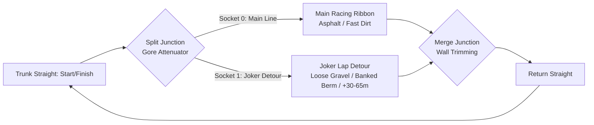

# Feature Spec: Rallycross Joker Lap Segments for Classic and OpenStreetMap Circuits 🏁

Rallycross is characterized by high-intensity wheel-to-wheel racing on mixed surfaces (asphalt, compacted dirt, and loose gravel) with a signature sporting regulation: the **Joker Lap**. Every competitor must divert through an alternate, longer detour segment once per race. Following the completion of [Spec 006: Road Split Segments, Branching Splines & Alternative Circuit Layouts](006_road_split_and_branching_tracks.md), **TdRace** possesses the core Directed Ribbon Graph (`TrackNetwork`) and wall trimming machinery. This specification builds on that infrastructure by authoring, extracting, and baking authentic Joker Lap branches into all **4 Classic Module RX circuits** and all **20 real-world OpenStreetMap World RX circuits**.

---

## 🗺️ User Flow & Interface Design

### 1. In-Game Circuit Preview & Layout Selector
1. **Circuit Selection & Track Studio UI**:
   - In the Circuit Selector and Track Studio, Rallycross circuits display an interactive dual-color topological minimap:
     - **Main Racing Line (Cyan)**: Default racing groove.
     - **Joker Lap Detour (Orange)**: Branching detour with labeled surface textures (gravel/dirt).
   - **Track Metadata KPI Card**:
     - Displays layout statistics:
       - `Main Lap Length`: e.g. $950\,\text{m}$ (Asphalt/Dirt).
       - `Joker Lap Length`: e.g. $1005\,\text{m}$ ($+55\,\text{m}$, $+3.2\,\text{s}$ average delta).
       - `Terrain Surface Mix`: e.g. $60\%$ Asphalt, $40\%$ Loose Gravel.

2. **Trackside Visual Signage & Gore Markers**:
   - Drivers approaching the split junction are presented with high-visibility FIA-style overhead gantries and trackside marker boards:
     - `[MAIN LINE ➔]` oriented towards the primary asphalt line.
     - `[JOKER DETOUR ➔]` oriented towards the gravel detour branch.
   - The triangular gore area separating the two ribbons is rendered with high-contrast warning chevrons, reflective bollards, and crash attenuator barrels.

---

## ⚙️ Backend Models & API Endpoints

### 1. Dual-Layout Circuit Graph Architecture (`arcade-race-core::track::network`)
Each upgraded Rallycross track file defines a `TrackNetwork` containing at least four topological components:
1. **Trunk Ribbon (`SegmentId(0)`)**: Main starting straight with Start/Finish timing gate and pre-split timing sector.
2. **Split Junction (`RoadJunction::Split`)**: Hermite width envelope widening $W(u)$ from nominal road width $W_0$ to $2 \times W_0$, bounded by a triangular gore apex crash attenuator (`GoreConfig`).
3. **Main Racing Line (`SegmentId(1)`)**: The standard racing groove (`Layout::Main`).
4. **Joker Lap Detour (`SegmentId(2)`)**: The alternate, longer detour branch (`Layout::Joker`) calibrated for a $+2.0\,\text{s}$ to $+4.0\,\text{s}$ lap time delta.
5. **Merge Junction (`RoadJunction::Merge`)**: Tangential convergence rejoining the return straight (`SegmentId(3)`) with automated wall suppression via `track.trim_walls_for_network()`.

---

### 2. Classic Module RX Circuits (Fictional Fantasy Venues)

The four fictional Classic RX venues are updated with distinctive terrain challenges and strategic detour profiles:

| Circuit ID | Base Lap | Joker Lap Delta | Detour Surface | Elevation & Obstacle Profile |
| :--- | :--- | :--- | :--- | :--- |
| `rx_quarry_sprint` | 750 m | +40 m (+2.4 s) | `SurfaceType::DeepGravel` | Drops into an excavated gravel basin, climbs a steep concrete launch pad, and jumps over the pit entry lip. |
| `rx_hilltop_leap` | 950 m | +55 m (+3.2 s) | `SurfaceType::Dirt` / `PackedSand` | Traverses a high-altitude perimeter ridge with an off-camber $+8^\circ$ dirt berm and a blind crest drop. |
| `rx_canyon_flyer` | 1150 m | +65 m (+3.9 s) | `SurfaceType::Gravel` / `Concrete` | Wide canyon rim loop bypassing the central tabletop jump, featuring heavy deceleration into a tight $180^\circ$ hairpin. |
| `classic_rallycross` | 820 m | +35 m (+2.1 s) | `SurfaceType::Asphalt` / `Dirt` | Classic infield detour loop branching from the backstretch and cutting across a washboard whoop section. |

---

### 3. Real-World OpenStreetMap World RX Circuits (20 Tracks)

For the 20 real-world World RX circuits (Spec 021), authentic Joker Lap paths are extracted directly from OpenStreetMap survey ways and relations using the `osm-circuit-builder` pipeline:

1. **OSM Querying & Filter Extraction**:
   - Filter `highway=raceway` elements belonging to the circuit relation.
   - Match ways tagged with `raceway=joker`, `name~="Joker"`, or detect topological bifurcation cycles sharing ingress and egress nodes with the main raceway ring.
2. **Homologation Scaling & Dimension Calibration**:
   - Align track widths to FIA World RX minimum regulations ($10.0\,\text{m}$ to $15.0\,\text{m}$).
   - Spline socket tangent divergence $\Delta\theta$ clamped below $10^{-4}\,\text{rad}$ to maintain $C^1$ continuity.
   - Preserve authentic real-world Joker configurations:
     - **Höljes RX (`holjes_rx`)**: Legendary velodrome Joker banking outside Turn 5 and re-joining before the jump.
     - **Lydden Hill (`lydden_hill`)**: The birthplace of Rallycross; Joker branches right at Chessons Drift onto loose chalk/gravel.
     - **Lånkebanen / Hell RX (`hell_rx`)**: Sweeping downhill gravel loop bypassing the inner chicane.
     - **Lohéac RX (`loheac_rx`)**: Tight gravel hairpin loop before the main asphalt straight.
     - **Circuit de Barcelona-Catalunya RX (`catalunya_rx`)**: Stadium section detour around the final chicane.
     - Plus: `estering_rx`, `montalegre_rx`, `nyirad_rx`, `kouvola_rx`, `mettet_rx`, `lavare_rx`, `riga_rx`, `killarney_rx`, `lessay_rx`, `essay_rx`, `dreux_rx`, `croft_rx`, `spa_rx`, `silverstone_rx`, and `erx_motor_park`.

---

## 🛡️ Security & Role-Based Access Controls (RBAC)

### 1. Invariants & Anti-Exploit Rules
1. **$C^1$ Tangent Continuity Invariant**:
   - All connection sockets between trunk segments and branching ribbons must strictly guarantee $\Delta\theta < 10^{-4}\,\text{rad}$ with synthesized Catmull-Rom ghost waypoints, preventing lateral acceleration spikes or physics instability.
2. **Directional Normal Anti-Cheat**:
   - Checkpoints on the Joker branch enforce directional normal vectors. Drivers attempting to drive through the exit merge in reverse or take shortcuts across the gore wedge immediately trigger an unapproved shortcut flag and forfeit lap time.
3. **Wall Trimming & Collision Invariant**:
   - `track.trim_walls_for_network()` must automatically suppress inner and outer barriers across the throat of all split and merge junctions, ensuring zero physical barriers protrude into the drivable track surface.

---

## 🧪 Verification & Acceptance Criteria

### Automated Tests
- Command to run classic circuit tests: `cargo test -p tdrace-core --test classic_circuits_tests`
- Command to run rally circuit tests: `cargo test -p tdrace-app --test rally_tracks_tests`
- Command to run multi-route checkpoint tests: `cargo test -p arcade-race-core --test multi_route_progress_tests`

### Manual Acceptance Criteria (Pseudo-Gherkin)

- **Scenario: Classic RX circuits load valid Joker track networks**
  - [ ] **Given** the 4 Classic Module Rallycross circuits (`rx_quarry_sprint`, `rx_hilltop_leap`, `rx_canyon_flyer`, `classic_rallycross`)
  - [ ] **When** each track is loaded via `catalog::official_track`
  - [ ] **Then** `track.network` contains both `"main"` and `"joker"` layouts
  - [ ] **And** the `"joker"` layout has an arc-length between 30 m and 70 m longer than `"main"`

- **Scenario: OpenStreetMap World RX circuits feature authentic Joker Lap splines**
  - [ ] **Given** the 20 official World RX tracks loaded from `tracks/rally/*.json`
  - [ ] **When** inspected for topological network definitions
  - [ ] **Then** all 20 tracks define split junctions with gore crash attenuators and $C^1$ tangent divergence $\Delta\theta < 10^{-4}\,\text{rad}$
  - [ ] **And** `track.trim_walls_for_network()` leaves zero blocking barrier segments across split and merge throats

- **Scenario: Cars driving Joker branch incur realistic time delta**
  - [ ] **Given** a vehicle driven along `Layout::Main` and `Layout::Joker` on `holjes_rx`
  - [ ] **When** simulated at maximum grip with identical entry velocity
  - [ ] **Then** the Joker lap time is between 2.0 and 4.5 seconds slower than the main lap time

- **Scenario: Backward compatibility for legacy callers**
  - [ ] **Given** an external consumer requesting `track.spline` without querying `network`
  - [ ] **When** accessing waypoints, samples, and walls
  - [ ] **Then** the primary `"main"` layout spline is returned with zero panic or breaking interface changes

---

## 🔗 Traceability & Codebase Mapping

### Created/Modified Files
- `crates/tdrace-core/src/catalog/` -> Re-baked track JSON definitions in `tracks/classic/` and `tracks/rally/`.
- `crates/arcade-race-core/src/track/network.rs` -> Joker layout helpers and validation assertions.
- `crates/tdrace-core/tests/classic_circuits_tests.rs` -> Unit tests for Classic RX Joker network integrity and surface profiles.
- `crates/tdrace-app/tests/rally_tracks_tests.rs` -> Validation of 20 OSM World RX Joker routes and time deltas.

### Beads Epic Mapping
- Governed by Beads Epic: `tdrace-vbaq` ("Fulfill Spec 081: Rallycross Joker Lap Segments for Classic and OpenStreetMap Circuits").
