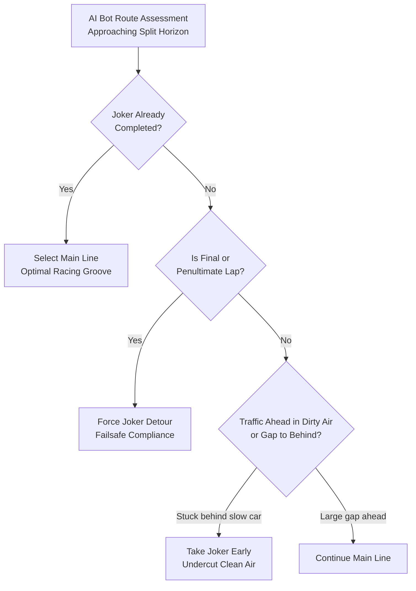

# Feature Spec: Mandatory Rallycross Joker Lap Tracking and Penalty Enforcement ⏱️

In authentic Rallycross competitions (FIA World RX, Nitrocross, British RX), the Joker Lap is not merely an optional shortcut or novelty detour; it is a **mandatory sporting requirement**. Every participant on the starting grid must complete the Joker Lap at least once during a race heat. Failing to do so before crossing the checkered flag carries severe penalties that alter the race outcome. This specification introduces session-level tracking, real-time HUD and spotter warnings, AI tactical decision-making, and automated post-race time penalties across all Rallycross events in **TdRace**.

---

## 🗺️ User Flow & Interface Design

### 1. In-Race HUD & Leaderboard Telemetry
During an active Rallycross race session, drivers require immediate situational awareness of their own Joker status and that of their rivals:

1. **Cockpit Telemetry HUD Badge**:
   - Positioned alongside the lap counter:
     - **Pending State**: Amber pill `[JOKER REQUIRED]` indicating the driver has not yet taken their detour.
     - **Completed State**: Green pill `[JOKER DONE ✓]` indicating the driver has satisfied the regulation.
     - **Urgent Warning State**: When crossing the Start/Finish line into the final lap (`lap == total_laps`) with `joker_laps_taken == 0`, the badge flashes bright red with a high-contrast pulsating border: `[⚠️ JOKER MANDATORY THIS LAP]`.
2. **Audio & Spotter Alerts**:
   - When entering the final lap without having completed the Joker, the spotter issues an urgent callout: *"Joker lap mandatory! Take the detour now!"*
3. **Live Leaderboard / Tower Overlay**:
   - A dedicated `[J]` column next to each competitor's name:
     - Dimmed grey `[J]` icon: Pending.
     - High-visibility green `[J]` icon: Completed.
     - Allows human players to strategically observe when rivals have burned their Joker lap.

---

## ⚙️ Backend Models & API Endpoints

### 1. Multi-Car Session State Extension (`crates/tdrace-app/src/game/`)

To track compliance across both human drivers and AI opponents, `DriverRaceState` in `crates/tdrace-app/src/game/` is extended:

```rust
#[derive(Debug, Clone, Serialize, Deserialize)]
pub struct DriverJokerState {
    /// Number of valid Joker laps completed during the current session.
    pub joker_laps_completed: u32,
    /// Exact race lap numbers on which each Joker was executed (e.g. [2]).
    pub completed_on_laps: Vec<u32>,
    /// Whether the driver has fulfilled the mandatory Joker lap requirement.
    pub is_compliant: bool,
}
```

#### Race Configuration Parameters
Rallycross race sessions configure the sporting rule defaults:
- `mandatory_joker_laps: u32` (Default: `1` for all Rallycross races; `0` for GT, NASCAR, and Autocross).
- `joker_penalty_seconds: f32` (Default: `30.0` seconds, adhering to FIA World RX standard post-race time penalties).

---

### 2. Checkpoint Validation & Anti-Abuse Logic (`arcade-race-core::track::checkpoint`)

The `MultiRouteProgressTracker` (Spec 006) monitors gate crossings:
1. **Gate Sequence Verification**:
   - A Joker lap is only credited if the vehicle enters the split throat, crosses the dedicated `CheckpointKind::Joker` gate, and successfully negotiates the merge junction into the return straight.
2. **Directional Normal Enforcement**:
   - Driving backwards through the merge throat or executing reverse shortcuts does not increment `joker_laps_completed` and flags an instant wrong-way warning.
3. **Start Grid Immunity**:
   - A vehicle starting on the grid cannot claim a Joker lap on Lap 0 before crossing the Start/Finish line.

---

### 3. AI Strategic Decision-Making (`crates/tdrace-app/src/ai/`)

AI bot competitors navigate the dual-route topology intelligently rather than choosing randomly:



1. **Traffic Undercut**: If an AI bot is held up behind slower traffic (delta speed $< 0.8 \times v_{\text{target}}$ for $> 1.5\,\text{s}$), it dives into the Joker detour to seek clean track air.
2. **Leader Overcut / Gap Protection**: If leading with a sufficient gap ($> 4.0\,\text{s}$), the bot takes the Joker and re-emerges still in the lead.
3. **Failsafe Compliance**: If reaching Lap $N-1$ or Lap $N$ without having completed the Joker, the bot route selection is hard-locked to `Layout::Joker`, guaranteeing $100\%$ AI compliance with zero unforced penalties.

---

### 4. Post-Race Classification & Penalty Resolution

When the checkered flag drops and cars finish the race:

```rust
pub fn resolve_rallycross_penalties(session: &mut RaceSession) {
    for driver in &mut session.driver_states {
        if driver.joker_state.joker_laps_completed < session.config.mandatory_joker_laps {
            driver.total_time += session.config.joker_penalty_seconds;
            driver.penalty_applied = Some(PenaltyReason::MissingMandatoryJoker {
                penalty_seconds: session.config.joker_penalty_seconds,
            });
        }
    }
    // Re-sort final classification order based on penalty-adjusted elapsed times
    session.driver_states.sort_by(|a, b| a.total_time.partial_cmp(&b.total_time).unwrap());
}
```

- In the final results classification screen, penalized competitors are highlighted with an amber/red penalty badge: `+30.0s (NO JOKER)`.
- Championship points and purse payouts are awarded strictly according to the finalized, penalty-adjusted finishing order.

---

## 🛡️ Security & Role-Based Access Controls (RBAC)

### 1. Invariants & Sporting Anti-Cheat Rules
1. **Immutable Gate Crossings**:
   - `DriverJokerState.completed_on_laps` is strictly appended upon authentic physics collision with the `CheckpointKind::Joker` gate and cannot be forged or toggled via debug UI in competition modes.
2. **Deterministic Race Resolution**:
   - Race penalties are applied in a single deterministic pass upon session termination, preventing race outcome drifting or ambiguous classifications.
3. **LAN Multiplayer Authority**:
   - In multiplayer sessions (Spec 044), the host referee is authoritative for Joker gate crossing timestamps, discarding client-reported crossings that disagree with server-side SAT raycasts.

---

## 🧪 Verification & Acceptance Criteria

### Automated Tests
- Command to run session rules tests: `cargo test -p tdrace-app --test rally_tracks_tests`
- Command to run bot strategic joker tests: `cargo test -p tdrace-app --test ai_tests test_bot_ai_strategic_joker`

### Manual Acceptance Criteria (Pseudo-Gherkin)

- **Scenario: Driver completes Joker lap and receives clean race classification**
  - [ ] **Given** a 5-lap Rallycross race on `classic_rallycross` with `mandatory_joker_laps = 1`
  - [ ] **When** the human player dives into the Joker branch on Lap 3 and finishes the race
  - [ ] **Then** the HUD displays `[JOKER DONE ✓]`
  - [ ] **And** the post-race classification applies zero time penalty

- **Scenario: Missing Joker lap applies +30s time penalty and drops final position**
  - [ ] **Given** a 5-lap Rallycross race where the leading human driver runs 5 laps exclusively on the main line
  - [ ] **When** crossing the finish line in physical 1st position without taking the Joker
  - [ ] **Then** the final classification adds $+30.0\,\text{s}$ to the driver's total elapsed time
  - [ ] **And** the results screen displays `+30.0s (NO JOKER)` with the driver relegated down the finishing order

- **Scenario: Final lap HUD warning triggers when Joker is pending**
  - [ ] **Given** a driver starting the final lap (Lap 5 of 5) without having completed a Joker lap
  - [ ] **When** crossing the Start/Finish timing gate into Lap 5
  - [ ] **Then** the cockpit HUD displays a flashing red warning `[⚠️ JOKER MANDATORY THIS LAP]`
  - [ ] **And** the spotter triggers an urgent audio alert

- **Scenario: All AI competitors fulfill mandatory Joker requirement**
  - [ ] **Given** a full 8-car Rallycross race populated with AI bots across all quality tiers
  - [ ] **When** the race completes
  - [ ] **Then** $100\%$ of AI finishers have `joker_laps_completed >= 1`
  - [ ] **And** zero AI bots receive missing Joker penalties

- **Scenario: Non-Rallycross disciplines bypass Joker requirements**
  - [ ] **Given** a GT or NASCAR race on a road circuit
  - [ ] **When** the race concludes
  - [ ] **Then** `mandatory_joker_laps` is 0 and no participant receives Joker penalties

---

## 🔗 Traceability & Codebase Mapping

### Created/Modified Files
- `crates/arcade-race-core/src/track/checkpoint.rs` -> Joker gate completion signals and directional normal checks.
- `crates/tdrace-app/src/game/session.rs` -> `DriverJokerState`, mandatory joker configuration, and post-race penalty sorting.
- `crates/tdrace-app/src/ai/mod.rs` -> AI bot traffic undercut and failsafe deadline selection.
- `crates/race-ui/src/hud/` -> Cockpit telemetry Joker badge, flashing final lap warning, and leaderboard `[J]` column.
- `crates/tdrace-app/tests/ai_tests.rs` -> Unit tests verifying AI strategic Joker decision making and 100% compliance.

### Beads Epic Mapping
- Governed by Beads Epic: `tdrace-eo64` ("Fulfill Spec 082: Mandatory Rallycross Joker Lap Tracking and Penalty Enforcement").
