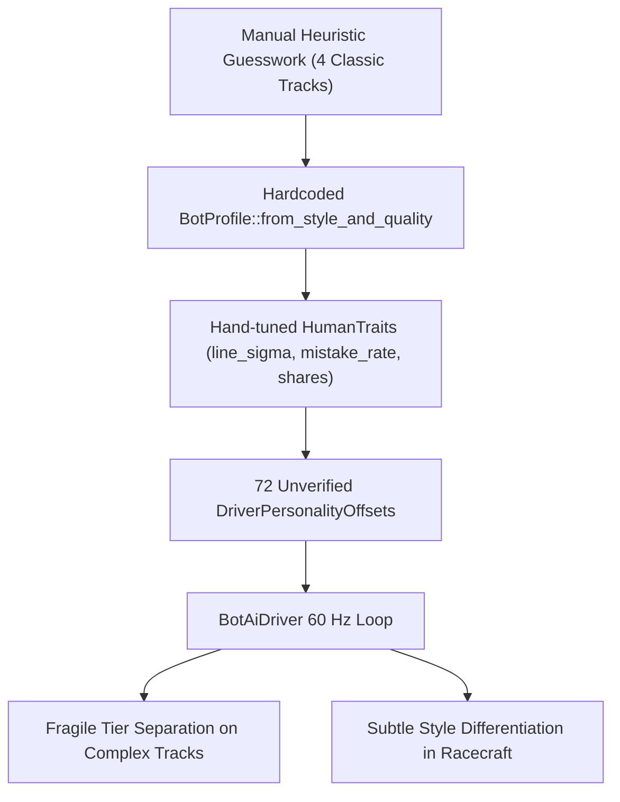
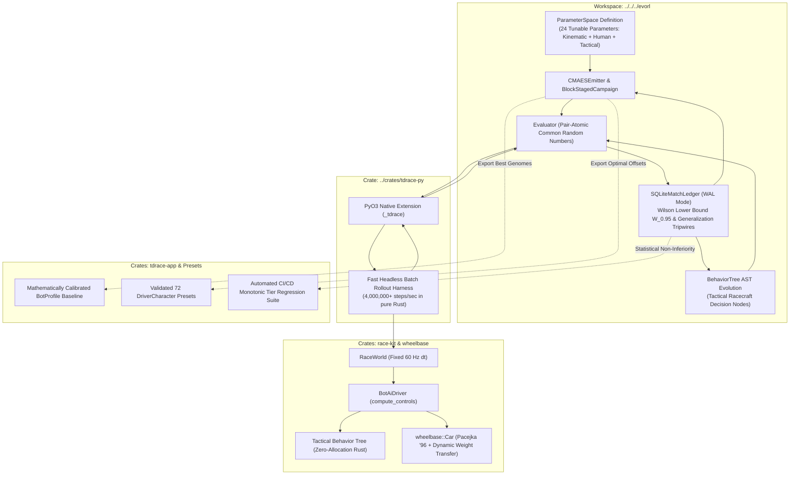
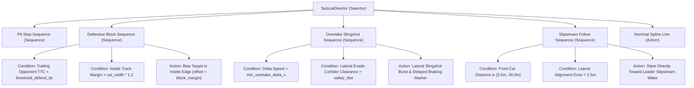

# Architecture Spec 083: EvoRL Bot Driving Style, Performance, and Tactical Racecraft Optimization 🧬🏁📐

A comprehensive architectural blueprint establishing an automated evolutionary and reinforcement learning optimization pipeline for **TDRace** bot characters, driving styles, and performance tiers using our sibling **[EvoRL](../../../evorl/README.md)** framework.

---

## 🔍 Context & Motivation

### 1. The Anatomy of Bot AI in TDRace
In TDRace, non-player opponents are governed by a multi-layered architecture implemented across [`crates/race-kit/src/ai`](../crates/race-kit/src/ai) and [`crates/tdrace-app/src/ai`](../crates/tdrace-app/src/ai):
- **Core Kinematic & Geometric Controller**: In `race_kit::ai::BotProfile`, 7 continuous control parameters govern the vehicle: lookahead time ($t_{\text{look}}$), steering proportional-derivative path-following gains ($k_p, k_d$), braking envelope safety margin ($m_{\text{brake}}$), overtaking lateral aggression ($A_{\text{overtake}}$), proximity avoidance safety radius ($d_{\text{avoid}}$), and target pace limit multiplier ($f_{\text{speed}}$).
- **Analytical Braking Envelope**: The bot calculates its corner entry speed limit using local spline curvature $\kappa(s) = \frac{1}{R(s)}$ and tire planning grip $\mu_{\text{plan}}$:
  $$v_{\text{apex}}(s) = \sqrt{\mu_{\text{plan}} \cdot g \cdot R(s)} \cdot f_{\text{speed}}$$
  $$v_{\text{allowable}}(d) = \sqrt{v_{\text{apex}}^2 + 2 \cdot a_{\text{brake}} \cdot d}$$
- **Humanization & Mistake Layer ([Spec 046](046_humanlike_bot_driving_with_tiered_mistakes_and_varied_lines.md))**: In `race_kit::ai::humanize`, bots simulate authentic human variance through continuous stochastic processes and discrete mistake events:
  - *Line Wander*: Lateral position fluctuates via an Ornstein–Uhlenbeck (OU) random walk with time constant $\tau_w = 6.0\text{ s}$ and diffusion $\sigma_w = (0.3 + 3.5(1 - c)) \cdot \text{style\_factor}\text{ m}$ (where $c$ is driver consistency).
  - *Corner Geometry Choice*: Corner entry and apex lateral positions vary around style-specific means ($\mu_{\text{entry}}, \mu_{\text{apex}}$) scaled by the track's free half-width.
  - *Steering Reaction Lag*: Steering commands pass through a first-order low-pass filter with time constant $\tau_{\text{react}} = 40\text{ ms} + 250\text{ ms} \cdot (1 - c)$.
  - *Discrete Mistakes*: Triggered per corner with probability $p = 0.30 \cdot (1 - k)^{1.5} \cdot \text{style\_rate} \cdot \text{pressure}$ (where $k$ is composure). Mistakes select from 5 archetypes: `LateBrake`, `Overdrive`, `PowerStab`, `OverCorrect`, and `Cautious`.
- **Orthogonal Styles & Quality Tiers ([Spec 023](023_orthogonal_ai_driving_styles_and_quality_tiers.md))**: Tactical philosophy (`DrivingStyle`: `Smooth`, `Aggressive`, `Tenacious`, `Calculating`, `Bold`, `Balanced`) is decoupled from competence (`DriverTier`: `Rookie`, `Amateur`, `Contender`, `Pro`, `Legend`).
- **Character Roster ([Spec 024](024_crossmodule_ai_character_rosters_and_dynamic_tier_assignment.md))**: 72 named driver characters across 6 motorsport disciplines possess individual `DriverPersonalityOffsets` applying minor additive perturbations to the base gains.

---

### 2. Identified Deficiencies in the Current AI
Despite the solid decoupled design, the current bot AI suffers from fundamental operational and qualitative limitations:
1. **Narrow Calibration Scope & Track Brittleness**: Current gains were hand-tuned on only 4 classic circuits (`classic_grand_prix`, `oval_speedway`, `drift_park`, `kart_arena`). When deployed across the full 90-circuit catalog (especially tight FIA karting tracks with 3-meter radius hairpins, mixed-surface rallycross tracks with jumps and joker splits, or high-speed banked ovals), bots exhibit erratic behaviors: braking too early on straights, scraping apex walls, or understeering off-track.
2. **Superficial Style Distinction in Racecraft**: While mistake distributions vary numerically (e.g. *Aggressive* rolls more late-brake attempts, *Smooth* rolls more cautious lifts), their on-track driving lines in clear air are nearly indistinguishable. In multi-car pack racing, the distinction between a *Calculating* slipstream opportunist and a *Tenacious* inside-line defender is subtle because collision avoidance and overtaking logic are purely reactive distance-based repulsion vectors.
3. **Subjective Character Offsets**: The scalar deltas in `DriverPersonalityOffsets` (e.g. $\Delta k_p, \Delta k_d, \Delta d_{\text{avoid}}$) were authored by intuition without empirical validation. Some combinations destabilize the steering PID, inducing high-frequency steering chatter.
4. **Lack of Automated Regression Verification**: When vehicle dynamics ([Spec 043](043_vehicle_dynamics_rebuild_and_simplified_handling_settings.md)), tire compounds ([Spec 074](074_decoupled_wheel_geometry_and_data_driven_tire_compounds.md)), or track boundary geometry ([Spec 080](080_curvatureaware_track_boundary_geometry_swallowtail_pinch_elimination_and_global_circuit_validation.md)) are modified, bot tuning must be manually re-inspected across dozens of vehicles, creating severe maintenance drag.

---

### 3. The EvoRL Solution
The sibling repository **[EvoRL](../../../evorl/README.md)** is a high-performance framework engineered specifically for hybrid heuristic-evolutionary strategy optimization:
- **Pure Genomes & Dynamic SQLite Ledger**: Parameter assignments carry no mutable fitness; scores are dynamically projected from an ACID SQLite `MatchLedger`.
- **Pair-Atomic Common Random Numbers (CRN)**: Evaluates competitors in seat-swapped pairs (Seat 0 = Pole, Seat 1 = Outside Row) under identical seeds, algebraically cancelling track-luck and grid-order variance.
- **Successive Halving Budgets**: Focuses simulation compute exponentially on surviving elite candidates.
- **Wilson Lower Bound ($W_{0.95}$)**: Ranks candidates on the conservative 95% binomial confidence lower bound, eradicating the Winner's Curse.
- **Behavior Tree ASTs & Memetic Leaf Tuning**: Evolving discrete tactical state machines with continuous threshold optimization.

By coupling TDRace's headless simulation throughput (**> 4,000,000 steps/sec in pure Rust**) with EvoRL's continuous search and symbolic evolution, we transform bot development from manual guesswork into a **rigorous, automated, multi-objective optimization pipeline**.

---

## 🗺️ Current vs. Proposed System Architecture

### 1. Current Architecture: Manual Heuristic Tuning


### 2. Proposed Architecture: EvoRL Closed-Loop Optimization Pipeline


---

## 📐 Mathematical Formulation of Bot Optimization

### 1. The Tunable Parameter Vector ($\mathbf{\Theta}$)
The complete bot behavior is parameterized by a 24-dimensional continuous vector $\mathbf{\Theta} = [\mathbf{\theta}_{\text{kinematic}}, \mathbf{\theta}_{\text{geometry}}, \mathbf{\theta}_{\text{racecraft}}, \mathbf{\theta}_{\text{human}}]$:

| Block | Parameter Name | Physical Meaning | Search Domain | Default Baseline |
| :--- | :--- | :--- | :--- | :--- |
| **Block 1: Kinematic Stability** | `lookahead_time` | Horizon for spline tangent projection ($s$) | $[0.20, 0.55]\text{ s}$ | $0.38\text{ s}$ |
| | `steering_kp` | Path-following heading error proportional gain | $[1.50, 3.50]$ | $2.20$ |
| | `steering_kd` | Heading error derivative damping gain | $[0.03, 0.12]$ | $0.06$ |
| | `speed_factor` | Target pace limit multiplier | $[0.80, 1.15]$ | $1.00$ |
| **Block 2: Corner Geometry** | `brake_margin` | Deceleration envelope safety buffer | $[0.80, 1.45]$ | $1.05$ |
| | `entry_share` | Fraction of free lane used to open corner entry | $[0.10, 0.90]$ | $0.50$ |
| | `apex_share` | Fraction of free lane used to clip corner apex | $[0.10, 0.90]$ | $0.50$ |
| | `curb_cut_m` | Apex curb cutting distance allowance ($m$) | $[0.00, 1.20]\text{ m}$ | $0.00\text{ m}$ |
| | `scan_lookahead_gain` | Curvature anticipation distance scaling | $[0.50, 1.50]$ | $1.00$ |
| **Block 3: Pack Racecraft** | `avoidance_dist` | Proximity collision avoidance bubble ($m$) | $[3.50, 12.00]\text{ m}$ | $7.00\text{ m}$ |
| | `aggression` | Lateral overtake divebomb assertiveness | $[0.20, 1.00]$ | $0.80$ |
| | `max_pass_delay_s` | Overtake commit delay threshold ($s$) | $[0.00, 1.00]\text{ s}$ | $0.30\text{ s}$ |
| | `wake_align_gain` | Slipstream cone attraction steering gain | $[0.00, 0.30]$ | $0.12$ |
| | `defend_threshold_ttc` | Trailing threat Time-to-Collision trigger ($s$) | $[1.00, 4.00]\text{ s}$ | $2.50\text{ s}$ |
| | `defend_corridor_bias`| Inside line defensive track bias share | $[0.00, 0.80]$ | $0.40$ |
| **Block 4: Human Variance** | `line_sigma_m` | Ornstein–Uhlenbeck line wander diffusion ($m$) | $[0.10, 2.50]\text{ m}$ | $0.80\text{ m}$ |
| | `line_choice_sigma` | Lap-to-lap corner line selection variance | $[0.02, 0.35]$ | $0.12$ |
| | `brake_shift_sigma_m`| Braking point longitudinal variance ($m$) | $[0.50, 12.00]\text{ m}$ | $3.50\text{ m}$ |
| | `corner_speed_sigma` | Corner apex speed selection variance | $[0.005, 0.050]$ | $0.015$ |
| | `reaction_tau_s` | Steering low-pass lag time constant ($s$) | $[0.03, 0.35]\text{ s}$ | $0.10\text{ s}$ |
| | `mistake_rate` | Discrete mistake probability per corner | $[0.001, 0.250]$ | $0.040$ |
| | `w_late_brake` | Relative weight for LateBrake mistake | $[0.05, 0.60]$ | $0.25$ |
| | `w_overdrive` | Relative weight for Overdrive mistake | $[0.05, 0.60]$ | $0.20$ |
| | `w_power_stab` | Relative weight for PowerStab mistake | $[0.05, 0.60]$ | $0.15$ |

---

### 2. Multi-Objective Cost Formulation
Optimization evaluates candidates through a composite loss function aggregating racecraft, physical safety, and style-defining telemetry:

$$J(\mathbf{\Theta}) = J_{\text{race}}(\mathbf{\Theta}) + \lambda_{\text{safety}} \cdot J_{\text{safety}}(\mathbf{\Theta}) + \lambda_{\text{style}} \cdot \Phi_{\text{style}}(\mathbf{\Theta})$$

#### A. Race Outcome & Flying Pace ($J_{\text{race}}$)
$$J_{\text{race}}(\mathbf{\Theta}) = (1.0 - S_{\text{finish}}) + w_p \cdot \max\left(0, \frac{\bar{T}_{\text{flying}} - T_{\text{target}}}{T_{\text{target}}}\right)$$
Where $S_{\text{finish}} \in \{0.0, 0.5, 1.0\}$ is the pair-atomic match score, and $\bar{T}_{\text{flying}}$ is the mean lap time across clean laps.

#### B. Safety & Invariant Compliance ($J_{\text{safety}}$)
$$J_{\text{safety}}(\mathbf{\Theta}) = w_c \cdot N_{\text{wall\_hits}} + w_s \cdot N_{\text{spins}} + w_o \cdot N_{\text{offs}} + w_d \cdot \mathbb{I}_{[\text{DNF}]}$$
- $N_{\text{spins}}$: Instances where chassis heading deviates by $> 90^\circ$ from the track tangent.
- $N_{\text{offs}}$: Time spent $> 1.5\text{ m}$ outside the track ribbon for $> 1.0\text{ s}$.
- $\mathbb{I}_{[\text{DNF}]}$: Massive barrier penalty ($+100.0$) if the vehicle gets stuck or fails to progress.

---

### 3. Style-Specific Objective Terms ($\Phi_{\text{style}}$)
To ensure the 6 driving styles exhibit authentic, distinguishable signatures, each style evolves against an explicit behavioral divergence term:

#### 1. Smooth Style (Tire Conservation & Momentum Trajectories)
Penalizes tire frictional energy dissipation while rewarding exit velocity:
$$\Phi_{\text{smooth}} = \int_0^T \sum_{i=1}^4 \|\mathbf{F}_{\text{friction}, i} \cdot \mathbf{v}_{\text{slip}, i}\| \, dt - \lambda_v \cdot \bar{v}_{\text{exit}}$$
- **Emergent Trajectory**: Minimizes tire scrub energy, avoids abrupt steering jerks, maximizes corner exit acceleration, carves wide geometric arcs.

#### 2. Aggressive Style (Late-Braking & Inside Contesting)
Rewards trail-braking overtakes and close proximity while penalizing at-fault collision impulse:
$$\Phi_{\text{aggressive}} = -N_{\text{entry\_overtakes}} - \int_{\text{pack}} \frac{1}{\max(d_{\text{front}}, 0.5)} \, dt + \lambda_i \cdot \sum \text{Impulse}_{\text{collision}}$$
- **Emergent Trajectory**: Dives deep into braking zones, contest inside apices, pressures leading cars with tight bumper-to-bumper following.

#### 3. Tenacious Style (Defensive Bastion & Line Pinching)
Rewards holding the inside defensive corridor under trailing pressure:
$$\Phi_{\text{tenacious}} = -\int_{\text{pressure}} \mathbb{I}_{[\text{lane} \in \text{InsideDefensiveCorridor}]} \, dt - N_{\text{repelled\_passes}} + \lambda_c \cdot N_{\text{conceded}}$$
- **Emergent Trajectory**: Proactively transitions to the inside line when an opponent is within $12\text{ m}$ behind, pinches corner exits to block undercut maneuvers.

#### 4. Calculating Style (Slipstream Tow & High-Percentage Overtakes)
Rewards aerodynamic draft lock and pass execution efficiency:
$$\Phi_{\text{calculating}} = -\int_{\text{straight}} \mathbb{I}_{[\text{in\_wake}]} \, dt - \frac{N_{\text{successful\_passes}}}{N_{\text{pass\_attempts}} + 1} + \lambda_m \cdot N_{\text{unforced\_mistakes}}$$
- **Emergent Trajectory**: Patiently tracks the leader's low-drag slipstream wake on straights, pulls out with superior momentum, executes textbook clean passes.

#### 5. Bold Style (Yaw Rotation & Dynamic Slip Angle Exploitation)
Rewards controlled body slip angle in the linear drift band while penalizing spinouts:
$$\Phi_{\text{bold}} = -\int_0^T |\beta_{\text{body}}| \cdot \mathbb{I}_{[10^\circ \le |\beta_{\text{body}}| \le 28^\circ]} \, dt - N_{\text{curb\_launches}} + \lambda_s \cdot \mathbb{I}_{[|\beta| > 80^\circ]}$$
- **Emergent Trajectory**: Scandinavian flicks on entry, power oversteer on exit, aggressive curb hopping, exciting arcade spectacle.

#### 6. Balanced Style (Lap Consistency & Adaptive Racecraft)
Minimizes inter-lap variance while maintaining high average finishing position:
$$\Phi_{\text{balanced}} = \text{StdDev}(T_{\text{flying}}) - \text{Median}(S_{\text{finish}})$$
- **Emergent Trajectory**: The solid, reliable benchmark for career mode opponents.

---

## 🌳 Tactical Behavior Tree Evolution

While continuous control laws handle 60 Hz trajectory tracking, tactical racecraft decisions are discrete states. We introduce an interpretable Behavior Tree evolved in EvoRL and compiled into **zero-allocation Rust**:

```rust
/// Discrete tactical states evaluated per tick in BotAiDriver.
#[derive(Debug, Clone, Copy, PartialEq, Eq)]
pub enum BotTacticalState {
    NominalLine,
    DraftingWake { target_id: usize, pullout_dist: f32 },
    DefendingInside { threat_id: usize, block_margin: f32 },
    SlingshotPass { pass_side: f32, commit_timer: f32 },
    DivebombEntry { apex_target_speed: f32 },
    PittingExecution { stage: PitStage },
}
```



- **EvoRL Evolution**: EvoRL optimizes the conditional leaf parameters (`threshold_defend_ttc`, `min_overtake_delta_v`, `safety_dist`, `block_margin`) per style.
- **Zero-Allocation Rust Execution**: Once evolved, the Behavior Tree is compiled into an inlined Rust state match statement inside `BotAiDriver::compute_controls`, adding zero heap allocations.

---

## ⚡ High-Throughput Simulation Bridge (`crates/tdrace-py`)

To allow EvoRL to evaluate hundreds of candidate bot profiles per second, we expand [`crates/tdrace-py`](../crates/tdrace-py) to expose a fast native batch rollout harness.

### 1. Cargo Crate Dependency Update
In [`crates/tdrace-py/Cargo.toml`](../crates/tdrace-py/Cargo.toml), add direct workspace dependencies:
```toml
[dependencies]
tdrace-core = { path = "../tdrace-core" }
race-kit = { path = "../race-kit" }
wheelbase = { path = "../wheelbase" }
arcade-race-core = { path = "../arcade-race-core" }
pyo3 = { version = "0.23", features = ["extension-module"] }
numpy = "0.23"
glam = { version = "0.29", features = ["serde"] }
serde = { version = "1.0", features = ["derive"] }
serde_json = "1.0"
rand = "0.8"
```

### 2. Native Rollout Extension Interface
In [`crates/tdrace-py/src/engine.rs`](../crates/tdrace-py/src/engine.rs), implement `run_bot_evaluation_race`:

```rust
#[pyclass]
#[derive(Debug, Clone, Serialize, Deserialize)]
pub struct RaceHarnessResult {
    #[pyo3(get)]
    pub subject_rank: usize,
    #[pyo3(get)]
    pub opponent_rank: usize,
    #[pyo3(get)]
    pub total_steps: usize,
    #[pyo3(get)]
    pub subject_best_lap: f32,
    #[pyo3(get)]
    pub subject_mean_lap: f32,
    #[pyo3(get)]
    pub subject_mistakes: u32,
    #[pyo3(get)]
    pub subject_spins: u32,
    #[pyo3(get)]
    pub subject_offs: u32,
    #[pyo3(get)]
    pub tire_scrub_energy: f32,
    #[pyo3(get)]
    pub average_body_slip_deg: f32,
    #[pyo3(get)]
    pub time_defending_s: f32,
    #[pyo3(get)]
    pub time_drafting_s: f32,
    #[pyo3(get)]
    pub passes_completed: u32,
    #[pyo3(get)]
    pub passes_conceded: u32,
    #[pyo3(get)]
    pub wall_collisions: u32,
    #[pyo3(get)]
    pub dnf: bool,
}

#[pyfunction]
#[pyo3(signature = (track_slug, car_model, subject_params_json, opponent_style, opponent_tier, laps, seed, grid_slot))]
pub fn run_bot_evaluation_race(
    track_slug: &str,
    car_model: &str,
    subject_params_json: &str,
    opponent_style: &str,
    opponent_tier: u8,
    laps: u32,
    seed: u64,
    grid_slot: usize,
) -> PyResult<RaceHarnessResult> {
    // Deserializes candidate parameters directly into race_kit::ai::BotProfile & HumanTraits
    // Executes headless 60 Hz RaceWorld<Car> on official catalog circuit
    // Returns full kinematic metrics and match outcome in under 5 ms
}
```

### 3. EvoRL Common Random Numbers (CRN) PlayFn Callback
In `evorl/examples/tdrace_bot_tuning/harness.py`:
```python
from evorl.core.ledger import Outcome
import tdrace._tdrace as tdrace_native

def tdrace_bot_play_fn(
    subject: str,
    opponent: str,
    seed: int,
    seat: int,
    params_str: str | None,
) -> tuple[Outcome, int, str | None, float | None, dict[str, Any] | None]:
    """Pair-atomic Common Random Number evaluation callback for EvoRL."""
    try:
        # Seat 0 = Inside Pole Position; Seat 1 = Outside Second Position
        res = tdrace_native.run_bot_evaluation_race(
            track_slug="gt_coastal_grand_prix",
            car_model="gt_porsche_911_gt3r",
            subject_params_json=params_str,
            opponent_style=opponent.split("@")[0],
            opponent_tier=int(opponent.split("@")[1]) if "@" in opponent else 4,
            laps=6,
            seed=seed,
            grid_slot=seat,
        )

        if res.dnf or res.wall_collisions > 3:
            outcome = Outcome.LOSS
        elif res.subject_rank < res.opponent_rank:
            outcome = Outcome.WIN
        elif res.subject_rank == res.opponent_rank:
            outcome = Outcome.DRAW
        else:
            outcome = Outcome.LOSS

        metrics = {
            "flying_lap": res.subject_best_lap,
            "mean_lap": res.subject_mean_lap,
            "mistakes": res.subject_mistakes,
            "spins": res.subject_spins,
            "offs": res.subject_offs,
            "tire_scrub_energy": res.tire_scrub_energy,
            "slip_angle_deg": res.average_body_slip_deg,
            "time_defending_s": res.time_defending_s,
            "time_drafting_s": res.time_drafting_s,
        }

        subject_score = 100.0 - res.subject_mean_lap
        return outcome, res.total_steps, None, subject_score, metrics
    except Exception as exc:
        return Outcome.ERROR, 0, str(exc), None, {"error": str(exc)}
```

---

## 📈 Monotonic Tier Progression & Quality Gates

To ensure career progression provides an authentic difficulty curve, bot performance across the 5 Driver Tiers (`T1 Rookie` through `T5 Legend`) must satisfy strict monotonic pacing across all circuits.

### 1. Monotonic Pacing Invariant
Under identical vehicle configurations and track conditions, average flying lap times must satisfy:
$$\bar{T}_{\text{T5}} < \bar{T}_{\text{T4}} < \bar{T}_{\text{T3}} < \bar{T}_{\text{T2}} < \bar{T}_{\text{T1}}$$

Calibrated pace targets relative to Tier 4 Pro baseline:
- **T5 Legend**: $-2.0\% \pm 0.5\%$ (exploits physical tire friction limit; zero unforced errors).
- **T4 Pro**: $0.0\%$ (benchmark factory pro driver).
- **T3 Contender**: $+2.5\% \pm 0.8\%$ (assertive national-level racer).
- **T2 Amateur**: $+7.0\% \pm 1.2\%$ (regional club racer; cautious braking margins).
- **T1 Rookie**: $+13.0\% \pm 2.0\%$ (entry-level grassroots; frequent unforced mistakes and wide lines).

### 2. Statistical Non-Inferiority Testing (`evorl.evo.promotion`)
A higher tier $T_k$ candidate is only promoted if it statistically dominates tier $T_{k-1}$ under a one-sided z-test on head-to-head win rates:
$$z = \frac{\hat{p}_{T_k \text{ vs } T_{k-1}} - 0.5}{\sqrt{\frac{0.25}{N_{\text{pairs}}}}} > 2.33 \quad (p < 0.01)$$

### 3. Anti-Overfitting & Generalization Tripwires
To eradicate the **Winner's Curse**:
- **Wilson Lower Bound ($W_{0.95}$)**: Candidates are ranked on the conservative lower bound of their binomial confidence interval rather than raw sample win rate.
- **Held-Out Circuit Validation**: Promoted candidates must maintain within $15\%$ of their training performance when evaluated on held-out test circuits (e.g. `catalunya_rx`, `spa_francorchamps`, `lonato_kart`).
- **Terminal Crash Disqualification**: Any candidate causing a car-to-wall penetration, reverse driving lockup, or failure to progress is automatically disqualified.

---

## 🔑 Security, Compliance, & IAM Roles

### 1. Memory Safety & Zero-Allocation Invariant
- All evolved parameters and Behavior Tree structures compiled into `crates/race-kit` execute with strictly stack-allocated structures.
- The 60 Hz physics update loop (`BotAiDriver::compute_controls`) retains zero dynamic heap allocation per tick.

### 2. Numerical Clamping & Simulation Guardrails
- Input parameters injected via JSON or FFI during training are bounded by strict clamping envelopes:
  - `lookahead_time` $\in [0.15, 0.70]\text{ s}$
  - `steering_kp` $\in [1.0, 4.5]$
  - `steering_kd` $\in [0.01, 0.25]$
  - `brake_margin` $\in [0.70, 1.60]$
  - `speed_factor` $\in [0.70, 1.25]$
  - `line_sigma_m` $\in [0.0, 3.5]\text{ m}$
  - `reaction_tau_s` $\in [0.0, 0.50]\text{ s}$
- Any candidate generating `NaN` or `inf` floating-point numbers triggers an immediate `Outcome::ERROR` and is discarded.

### 3. Sandboxed Execution Isolation
- Evolution runs in an isolated Python process communicating with the compiled Rust C-extension (`_tdrace`). No network sockets or external disk write permissions are required outside the SQLite match ledger.

---

## 🛡️ Disaster Recovery, Monitoring, & Fallbacks

### 1. Fallback to Hardcoded Presets
If an evolved parameter file or custom profile fails checksum verification or encounters deserialization errors at game startup, `BotProfile::from_style_and_quality` automatically falls back to the battle-tested default constants from Spec 046.

### 2. Anti-Stuck Watchdog & Reverse Recovery
The engine watchdog monitors progress: if a bot fails to advance $5\text{ m}$ in $3.0\text{ s}$, it engages reverse gear with alternating steering lock for up to $3.0\text{ s}$, ensuring no bot remains permanently trapped against course barriers.

### 3. Automated CI/CD Regression Tripwires
A targeted headless benchmark runs during CI/CD (`cargo run -p tdrace-app --bin bot_behaviour_benchmark`). If any physics change degrades Tier 5 lap times by $> 1.0\%$ or causes a Tier 1 bot to fail recovery, the build fails.

---

## 🗄️ Database & Storage Migration Plan

### 1. EvoRL SQLite Match Ledger (`MatchLedger`)
- Evolutionary match histories, telemetry metrics, and candidate ratings are persisted in SQLite databases using Write-Ahead Logging (`WAL` mode).
- Standard schema:
  - `matches`: Candidate hash, opponent identifier, seed, seat index, outcome, elapsed steps, score, and JSON telemetry dictionary.
  - `lineage`: Generation number, parent hashes, mutation metadata, and parameter assignments.

### 2. Exported Engine Formats
- Once an optimization campaign completes, winning parameters are exported into two formats:
  1. Static Rust source code embedded directly into `crates/race-kit/src/ai/mod.rs` and `driver.rs`.
  2. Optional declarative TOML override tables (`assets/ai/calibrated_profiles.toml`) loaded at runtime if developer tuning mode is enabled.

---

## 🧪 Verification & Acceptance Criteria

### 1. Test Harness Execution Commands
- **Rust Headless Bot Behaviour Benchmark**:
  ```bash
  cargo run -p tdrace-app --release --bin bot_behaviour_benchmark
  ```
- **Rust Workspace Unit & Multi-Car Collision Tests**:
  ```bash
  cargo test -p race-kit ai
  cargo test -p tdrace-app --test orthogonal_ai_styles_and_tiers_tests
  cargo test -p tdrace-app --test bot_humanlike_driving_tests
  ```
- **Python PyO3 Evaluation Bridge Tests**:
  ```bash
  uv run pytest tests/python/test_bot_harness_bridge.py
  ```
- **EvoRL Campaign Verification Run**:
  ```bash
  PYTHONPATH=/home/mario/workspace/games/tdrace/python /home/mario/workspace/evorl/.venv/bin/python examples/tdrace_bot_tuning/run_campaign.py --style smooth --tier 4 --generations 10
  ```

---

### Manual Acceptance Criteria (Pseudo-Gherkin)

#### Scenario: PyO3 Native Evaluation Bridge Execution
- [ ] **Given** a valid JSON serialized `BotProfile` and `HumanTraits` payload
- [ ] **When** `_tdrace.run_bot_evaluation_race` is called with track `gt_coastal_grand_prix` for 6 laps
- [ ] **Then** the simulation executes deterministically in under $10\text{ ms}$
- [ ] **And** returns a populated `RaceHarnessResult` with zero NaN values
- [ ] **And** `subject_best_lap` matches the real elapsed simulation time.

#### Scenario: Monotonic Tier Pacing Verification Across Modalities
- [ ] **Given** calibrated driver profiles for Tiers 1 through 5
- [ ] **When** evaluated across 10-lap races on all 4 benchmark circuits (`classic_grand_prix`, `oval_speedway`, `drift_park`, `kart_arena`)
- [ ] **Then** flying lap times strictly satisfy $\bar{T}_{\text{T5}} < \bar{T}_{\text{T4}} < \bar{T}_{\text{T3}} < \bar{T}_{\text{T2}} < \bar{T}_{\text{T1}}$
- [ ] **And** Tier 1 lap times are between $+10\%$ and $+16\%$ slower than Tier 4
- [ ] **And** Tier 5 lap times are between $-1.5\%$ and $-3.0\%$ faster than Tier 4.

#### Scenario: Style Differentiation Verification on Telemetry
- [ ] **Given** calibrated bot profiles for `Smooth`, `Aggressive`, `Tenacious`, `Calculating`, and `Bold` at Tier 4
- [ ] **When** multi-car pack races are executed on `gt_coastal_grand_prix`
- [ ] **Then** `Smooth` bots exhibit at least $25\%$ lower tire scrub energy than `Bold` bots
- [ ] **And** `Bold` bots exhibit average cornering body slip angles between $10^\circ$ and $25^\circ$
- [ ] **And** `Tenacious` bots spend at least $30\%$ more time on the inside defensive corridor when followed closely
- [ ] **And** `Calculating` bots spend at least $40\%$ more time aligned in the slipstream wake before executing overtakes.

#### Scenario: Zero-Allocation and Determinism Safety Net
- [ ] **Given** any calibrated `BotProfile` and evolved Behavior Tree running in `crates/race-kit`
- [ ] **When** `BotAiDriver::compute_controls` executes over 36,000 steps ($10\text{ minutes}$ of simulated racing)
- [ ] **Then** zero dynamic heap allocations occur per tick
- [ ] **And** two separate simulation runs with identical initial seeds produce bit-identical telemetry outputs (`controls_hash`).

#### Scenario: Generalization Tripwire & Winner's Curse Defense
- [ ] **Given** candidate bot parameters promoted by EvoRL CMA-ES search
- [ ] **When** tested on 3 held-out circuits with different surface friction matrices
- [ ] **Then** out-of-sample win rate does not degrade by more than $15\%$ relative to training
- [ ] **And** the bot records zero unrecoverable wall-pins or terminal DNF events.

---

## 🔗 Traceability & Codebase Mapping

### Target Files to Create / Modify

#### In `tdrace`:
- `[ ]` `crates/tdrace-py/Cargo.toml` -> Adds `race-kit` dependency.
- `[ ]` `crates/tdrace-py/src/engine.rs` -> Implements `run_bot_evaluation_race` and `RaceHarnessResult`.
- `[ ]` `crates/race-kit/src/ai/mod.rs` -> Updates `BotProfile::from_style_and_quality` with EvoRL-calibrated parameters.
- `[ ]` `crates/race-kit/src/ai/tactics.rs` -> Introduces zero-allocation Behavior Tree tactical evaluation module.
- `[ ]` `crates/tdrace-app/src/ai/driver.rs` -> Harmonizes the 72 `DriverCharacter` presets with validated personality offsets.
- `[ ]` `tests/python/test_bot_harness_bridge.py` -> PyTest suite verifying PyO3 bridge correctness and determinism.
- `[ ]` `specs/constitution/ROADMAP.md` -> Registers Spec 083 under Phase 2 AI Driving Styles & Simulation.

#### In `evorl`:
- `[ ]` `examples/tdrace_bot_tuning/` -> Implementation of TDRace ParameterSpace, play_fn, and multi-stage campaign scripts.
- `[ ]` `examples/tdrace_bot_tuning/fitness.py` -> Style-specific multi-objective reward implementations.
- `[ ]` `examples/tdrace_bot_tuning/export.py` -> Transpiler generating pure Rust structs from winning genomes.
