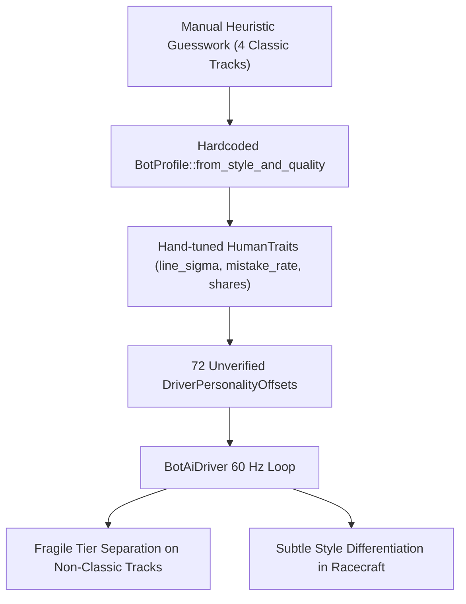
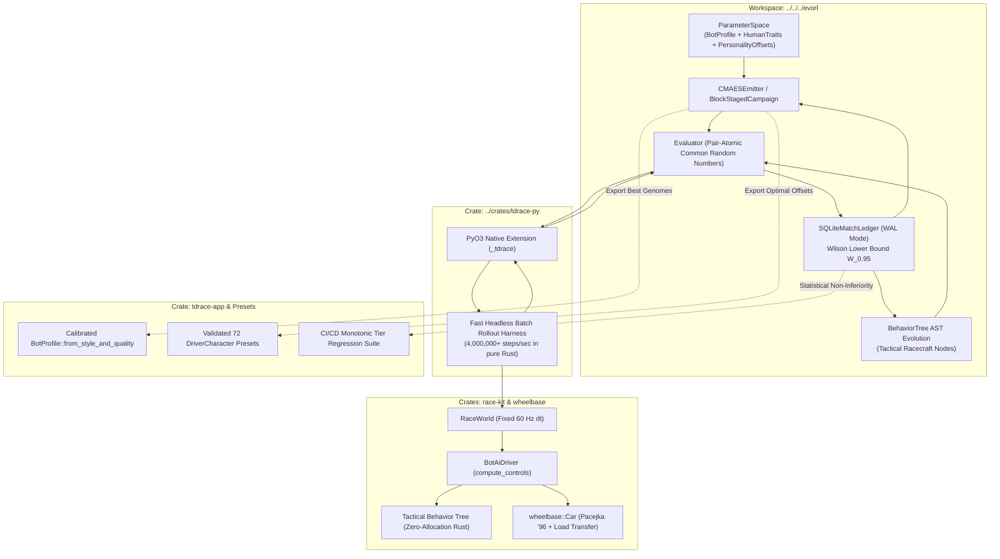
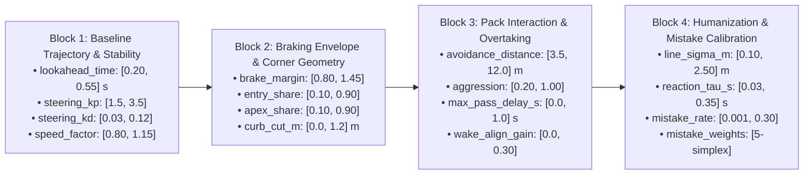
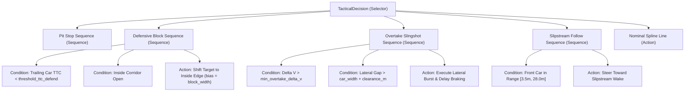

# Architecture Spec 083: EvoRL Bot Driving Style, Performance, and Tactical Racecraft Optimization 🧬🏁

A comprehensive architectural blueprint establishing an automated evolutionary and reinforcement learning optimization pipeline for **TDRace** bot characters, driving styles, and performance tiers using our sibling **EvoRL** framework.

---

## 🔍 Context & Motivation

### 1. The Current State of Bot AI in TDRace
In TDRace, non-player opponents are governed by a multi-layered architecture implemented in [`crates/race-kit/src/ai`](../crates/race-kit/src/ai):
- **Core Kinematic & Geometric Controller**: `BotProfile` dictates 7 continuous control parameters: lookahead time, path-following steering gains ($k_p, k_d$), braking safety margin, overtake aggression, collision avoidance distance, and speed factor.
- **Humanization & Mistake Layer ([Spec 046](046_humanlike_bot_driving_with_tiered_mistakes_and_varied_lines.md))**: `HumanTraits` and `HumanDriver` simulate authentic driver imperfections through continuous Ornstein–Uhlenbeck (OU) line wander, corner line choices (entry-wide / apex-cut), braking point shifts, steering reaction lag $\tau$, and discrete mistake events (`MistakeKind`: `LateBrake`, `Overdrive`, `PowerStab`, `OverCorrect`, `Cautious`).
- **Orthogonal Styles & Quality Tiers ([Spec 023](023_orthogonal_ai_driving_styles_and_quality_tiers.md))**: Tactical philosophy (`DrivingStyle`: `Smooth`, `Aggressive`, `Tenacious`, `Calculating`, `Bold`, `Balanced`) is decoupled from competence (`DriverTier`: `Rookie`, `Amateur`, `Contender`, `Pro`, `Legend`).
- **Character Roster ([Spec 024](024_crossmodule_ai_character_rosters_and_dynamic_tier_assignment.md))**: 72 named driver characters across 6 disciplines possess individual `DriverPersonalityOffsets` to inject subtle individuality.

### 2. Deficiencies in the Manual Tuning Approach
Despite the solid architectural design, the current implementation exhibits significant operational limitations:
1. **Narrow Calibration Baseline**: Parameters were hand-tuned and calibrated against only 4 classic circuits (`crates/tdrace-app/src/bin/bot_behaviour_benchmark.rs`). On complex circuits with variable radius hairpins, chicane kerbs, split-$\mu$ surfaces (sand, mud, ice), and elevation jump ramps, bots occasionally suffer from conservative speed bottlenecks, wall scrapes, or inappropriate braking onset.
2. **Superficial Style Distinction on Track**: In clear air, bots across different styles drive nearly identical lines. The distinction between an *Aggressive* brawler and a *Tenacious* defender is largely confined to discrete mistake roll probabilities rather than proactive, emergent racecraft tactics (e.g. closing the door on the inside line, executing undercut corner exits, or using slipstream slingshots).
3. **Subjective Character Offsets**: The scalar offsets in `DriverPersonalityOffsets` were authored heuristically without empirical validation. Some combinations degrade cornering stability or produce erratic steering oscillation.
4. **Lack of Automated Regression Verification**: Whenever vehicle dynamics ([Spec 043](043_vehicle_dynamics_rebuild_and_simplified_handling_settings.md)), tire compound affinities ([Spec 074](074_decoupled_wheel_geometry_and_data_driven_tire_compounds.md)), or track splines ([Spec 071](071_centripetal_catmullrom_and_variable_density_track_splines.md)) are modified, bot tuning must be manually re-inspected, creating architectural friction.

### 3. The EvoRL Solution
The sibling repository **EvoRL** is an Evolutionary Reinforcement Learning and strategy optimization framework built around immutable genomes, SQLite match ledgers, pair-atomic Common Random Numbers (CRN), CMA-ES search, and Behavior Tree AST evolution.

By establishing a high-speed bridge between TDRace's deterministic headless simulation and EvoRL's optimization campaigns, we replace manual guesswork with **continuous mathematical calibration, multi-objective style shaping, and verifiable quality gates**.

---

## 🗺️ Current vs. Proposed System Architecture

### 1. Current Architecture (Manual Heuristic Tuning)


### 2. Proposed Architecture (EvoRL Optimization Pipeline)


---

## ⚙️ Core Technical Strategies

### Strategy 1: Block-Staged Evolutionary Tuning of Bot Control Laws

To optimize the high-dimensional parameter space without overfitting or noisy optimization collapse, EvoRL's `BlockStagedCampaign` partitions the bot parameters into four sequential, decoupled blocks:



1. **Stage 1 (Trajectory & Pace)**: Optimizes single-car time attack flying laps. Evaluates vehicle control authority and ensures zero steering oscillation on straightaways and high-speed sweepers.
2. **Stage 2 (Braking & Cornering)**: Optimizes braking markers and apex clipping across varied radius turns, minimizing corner transit times while preventing grip saturation understeer.
3. **Stage 3 (Pack Interaction & Racecraft)**: Evaluates multi-car grids (6–12 cars). Tunes lateral overtaking bias, slipstream drafting alignment, and collision avoidance envelopes.
4. **Stage 4 (Humanization & Mistakes)**: Calibrates the distribution of mistake kinds and line wander so that bots feel fallible and dynamic without causing catastrophic stuck states.

---

### Strategy 2: Style-Differentiated Multi-Objective Fitness Shaping

To ensure the 6 driving styles exhibit distinct, recognizable personalities on track, each style is evolved against a tailored multi-objective fitness function. 

The universal baseline fitness evaluates race outcome and pace:
$$F_{\text{base}} = S_{\text{finish}} + \alpha \cdot \frac{T_{\text{baseline}}}{T_{\text{flying\_mean}}} - \beta \cdot N_{\text{collisions}} - \gamma \cdot N_{\text{offs}}$$

Where:
- $S_{\text{finish}} \in \{0.0, 0.5, 1.0\}$ represents the pair-atomic match outcome.
- $N_{\text{collisions}}$ counts at-fault barrier or vehicle collisions.
- $N_{\text{offs}}$ counts occurrences where the vehicle leaves the track ribbon by $> 1.5\text{ m}$ for $> 1.0\text{ s}$.

Each style adds a distinctive behavioral term $\Phi_{\text{style}}$:

#### 1. Smooth Style (Surgical Momentum & Tire Conservation)
$$\Phi_{\text{smooth}} = -\int_0^T \left( \|\mathbf{s}_{\text{slip\_front}}\|^2 + \|\mathbf{s}_{\text{slip\_rear}}\|^2 \right) dt + \lambda_v \cdot \bar{v}_{\text{apex\_exit}}$$
- **Reward**: High corner exit velocity, smooth progressive steering rate ($\dot{\delta}$).
- **Penalty**: Excessive tire slip ratio and slip angle (minimizes tire scrub energy and tire wear).
- **Emergent Trajectory**: Classic wide entry, geometric clipping, late apex, fluid transitions.

#### 2. Aggressive Style (Divebombing & Front-Bumper Combat)
$$\Phi_{\text{aggressive}} = N_{\text{entry\_overtakes}} + \int_{\text{proximity}} \frac{1}{\max(d_{\text{front}}, 0.5)} dt - \lambda_c \cdot \mathbb{I}_{[\text{crash\_severity} > 0.4]}$$
- **Reward**: Successful passes completed inside the corner entry braking zone; sustained tailgating within $5\text{ m}$ of a lead car.
- **Penalty**: Severe collisions that upset chassis balance or result in spins.
- **Emergent Trajectory**: Tight inside lines, threshold trail-braking, assertive gap exploitation.

#### 3. Tenacious Style (Defensive Bastion & Position Retention)
$$\Phi_{\text{tenacious}} = \int_{\text{under\_pressure}} \mathbb{I}_{[\text{line} \in \text{DefensiveInsideCorridor}]} dt + N_{\text{overtakes\_repelled}} - \lambda_p \cdot N_{\text{conceded}}$$
- **Reward**: Occupying and defending the inside racing line when an opponent is within $12\text{ m}$ behind; successfully keeping track position through corner exits.
- **Emergent Trajectory**: "Parking on the apex", tight corner-exit pinching, making the car wide.

#### 4. Calculating Style (Slipstream Aerodynamics & Tactical Slingshots)
$$\Phi_{\text{calculating}} = \int_{\text{straight}} \mathbb{I}_{[\text{in\_slipstream\_wake}]} dt + \frac{N_{\text{successful\_passes}}}{N_{\text{pass\_attempts}} + 1} - \lambda_m \cdot N_{\text{unforced\_mistakes}}$$
- **Reward**: Time spent tucked in the low-drag slipstream cone on straights; pass completion conversion rate ($> 85\%$).
- **Penalty**: High unforced mistake rate.
- **Emergent Trajectory**: Patiently tracks the leader's wake, pulls out cleanly at the end of the straight, and executes textbook high-percentage overtakes.

#### 5. Bold Style (Yaw Rotation & Dynamic Slip Angle Exploitation)
$$\Phi_{\text{bold}} = \int_0^T |\beta_{\text{body\_slip}}| \cdot \mathbb{I}_{[10^\circ \le |\beta| \le 28^\circ]} dt + N_{\text{curb\_launches}}$$
- **Reward**: Sustained controlled drift slip angles during corner transitions; aggressive apex curb mounting.
- **Penalty**: Spins ($|\beta| > 90^\circ$) or complete loss of control.
- **Emergent Trajectory**: Rally-style Scandinavian flicks, trail-brake slides, dramatic high-angle corner exits.

#### 6. Balanced Style (Robust Consistency & All-Round Competence)
$$\Phi_{\text{balanced}} = -\sigma(\text{lap\_times}) + \text{Median}(S_{\text{finish}})$$
- **Reward**: Lap-to-lap consistency, predictable behavior, minimal pace variance across diverse conditions.

---

### Strategy 3: Behavior Tree Tactical Racecraft Evolution

While continuous control laws handle trajectory following, multi-agent racing tactics (overtaking, defending, slipstreaming, pit entry) are discrete decision problems.

We integrate EvoRL's Behavior Tree representation to govern tactical decision-making, evolved in Python and transpiled into **zero-allocation, deterministic Rust state logic** in `crates/race-kit/src/ai/`:

```rust
/// Tactical state machine evaluated in BotAiDriver::compute_controls.
#[derive(Debug, Clone, Copy, PartialEq, Eq)]
pub enum BotTacticalState {
    NominalLine,
    DraftingWake { target_car_id: usize, pullout_dist: f32 },
    DefendingInside { threat_car_id: usize, block_margin: f32 },
    SlingshotOvertake { side: f32, commit_timer: f32 },
    DivebombEntry { target_apex_speed: f32 },
    PittingExecution { stage: PitStage },
}
```



---

## 🔑 Security, Compliance, & IAM Roles

### 1. Memory Safety & Zero-Allocation Invariant
- All evolved parameters and decision trees compiled into `crates/race-kit` execute with strictly stack-allocated structures.
- The 60 Hz physics update loop (`BotAiDriver::compute_controls`) retains zero dynamic heap allocation per tick.

### 2. Numerical Clamping & Simulation Guardrails
- Input parameters injected via JSON or FFI during training are bounded by strict clamping envelopes:
  - `lookahead_time` $\in [0.15, 0.70]\text{ s}$
  - `steering_kp` $\in [1.0, 4.5]$
  - `steering_kd` $\in [0.01, 0.25]$
  - `brake_margin` $\in [0.70, 1.60]$
  - `speed_factor` $\in [0.70, 1.25]$
  - `line_sigma_m` $\in [0.0, 3.5]\text{ m}$
  - `reaction_tau_s` $\in [0.0, 0.50]\text{ s}$
- Any candidate generating `NaN` or `inf` floating-point numbers triggers an immediate `Outcome::ERROR` and is discarded.

### 3. Sandboxed Execution Isolation
- Evolution runs in an isolated Python process communicating with the compiled Rust C-extension (`_tdrace`). No network sockets or external disk write permissions are required outside the SQLite match ledger.

---

## 🛡️ Disaster Recovery, Monitoring, & Fallbacks

### 1. Fallback to Hardcoded Presets
If an evolved parameter file or custom profile fails checksum verification or encounters deserialization errors at game startup, `BotProfile::from_style_and_quality` automatically falls back to the battle-tested default constants from Spec 046.

### 2. Generalization Tripwires & Anti-Overfitting Guards
To prevent the **Winner's Curse**:
- **Wilson Lower Bound ($W_{0.95}$)**: Candidates are ranked on the conservative lower bound of their binomial confidence interval rather than raw sample win rate.
- **Held-Out Circuit Validation**: Promoted candidates must maintain within $15\%$ of their training performance across held-out test circuits.
- **Terminal Crash Disqualification**: Any candidate causing a car-to-wall penetration, reverse driving lockup, or failure to progress is automatically disqualified.

---

## 🗄️ Database & Storage Migration Plan

### 1. EvoRL SQLite Match Ledger (`MatchLedger`)
- Evolutionary match histories, telemetry metrics, and candidate ratings are persisted in SQLite databases using Write-Ahead Logging (`WAL` mode).
- Standard schema:
  - `matches`: Candidate hash, opponent identifier, seed, seat index, outcome, elapsed steps, score, and JSON telemetry dictionary.
  - `lineage`: Generation number, parent hashes, mutation metadata, and parameter assignments.

### 2. Exported Engine Formats
- Once a campaign completes, winning parameters are serialized into two formats:
  1. Static Rust source code embedded directly into `crates/race-kit/src/ai/mod.rs` and `driver.rs`.
  2. Optional declarative TOML override tables (`assets/ai/calibrated_profiles.toml`) loaded at runtime if developer tuning mode is enabled.

---

## 🧪 Verification & Acceptance Criteria

### 1. Test Harness Execution Commands
- **Rust Headless Bot Behaviour Benchmark**:
  ```bash
  cargo run -p tdrace-app --release --bin bot_behaviour_benchmark
  ```
- **Rust Workspace Unit & Multi-Car Collision Tests**:
  ```bash
  cargo test -p race-kit ai
  cargo test -p tdrace-app --test orthogonal_ai_styles_and_tiers_tests
  cargo test -p tdrace-app --test bot_humanlike_driving_tests
  ```
- **Python PyO3 Evaluation Bridge Tests**:
  ```bash
  uv run pytest tests/python/test_bot_harness_bridge.py
  ```
- **EvoRL Campaign Verification Run**:
  ```bash
  PYTHONPATH=/home/mario/workspace/games/tdrace/python /home/mario/workspace/evorl/.venv/bin/python examples/tdrace_bot_tuning/run_campaign.py --style smooth --tier 4 --generations 10
  ```

---

### Manual Acceptance Criteria (Pseudo-Gherkin)

#### Scenario: PyO3 Native Evaluation Bridge Execution
- [ ] **Given** a valid JSON serialized `BotProfile` and `HumanTraits` payload
- [ ] **When** `_tdrace.run_bot_evaluation_race` is called with track `gt_coastal_grand_prix` for 6 laps
- [ ] **Then** the simulation executes deterministically in under $10\text{ ms}$
- [ ] **And** returns a populated `RaceHarnessResult` with zero NaN values
- [ ] **And** `subject_best_lap` matches the real elapsed simulation time.

#### Scenario: Monotonic Tier Pacing Verification
- [ ] **Given** the calibrated driver profiles for Tiers 1 through 5
- [ ] **When** evaluated across 10-lap races on all 4 benchmark circuits (`classic_grand_prix`, `oval_speedway`, `drift_park`, `kart_arena`)
- [ ] **Then** flying lap times strictly satisfy $\bar{T}_{\text{T5}} < \bar{T}_{\text{T4}} < \bar{T}_{\text{T3}} < \bar{T}_{\text{T2}} < \bar{T}_{\text{T1}}$
- [ ] **And** Tier 1 lap times are between $+10\%$ and $+16\%$ slower than Tier 4
- [ ] **And** Tier 5 lap times are between $-1.5\%$ and $-3.0\%$ faster than Tier 4.

#### Scenario: Style Differentiation Verification on Telemetry
- [ ] **Given** calibrated bot profiles for `Smooth`, `Aggressive`, `Tenacious`, `Calculating`, and `Bold` at Tier 4
- [ ] **When** multi-car pack races are executed on `gt_coastal_grand_prix`
- [ ] **Then** `Smooth` bots exhibit at least $25\%$ lower tire scrub energy than `Bold` bots
- [ ] **And** `Bold` bots exhibit average cornering body slip angles between $10^\circ$ and $25^\circ$
- [ ] **And** `Tenacious` bots spend at least $30\%$ more time on the inside defensive corridor when followed closely
- [ ] **And** `Calculating` bots spend at least $40\%$ more time aligned in the slipstream wake before executing overtakes.

#### Scenario: Zero-Allocation and Determinism Safety Net
- [ ] **Given** any calibrated `BotProfile` and evolved Behavior Tree running in `crates/race-kit`
- [ ] **When** `BotAiDriver::compute_controls` executes over 36,000 steps ($10\text{ minutes}$ of simulated racing)
- [ ] **Then** zero dynamic heap allocations occur per tick
- [ ] **And** two separate simulation runs with identical initial seeds produce bit-identical telemetry outputs (`controls_hash`).

#### Scenario: Generalization Tripwire & Winner's Curse Defense
- [ ] **Given** candidate bot parameters promoted by EvoRL CMA-ES search
- [ ] **When** tested on 3 held-out circuits with different surface friction matrices
- [ ] **Then** out-of-sample win rate does not degrade by more than $15\%$ relative to training
- [ ] **And** the bot records zero unrecoverable wall-pins or terminal DNF events.

---

## 🔗 Traceability & Codebase Mapping

### Target Files to Create / Modify

#### In `tdrace`:
- `[ ]` `crates/tdrace-py/Cargo.toml` -> Adds `race-kit` dependency.
- `[ ]` `crates/tdrace-py/src/engine.rs` -> Implements `run_bot_evaluation_race` and `RaceHarnessResult`.
- `[ ]` `crates/race-kit/src/ai/mod.rs` -> Updates `BotProfile::from_style_and_quality` with EvoRL-calibrated parameters.
- `[ ]` `crates/race-kit/src/ai/tactics.rs` -> Introduces zero-allocation Behavior Tree tactical evaluation module.
- `[ ]` `crates/tdrace-app/src/ai/driver.rs` -> Harmonizes the 72 `DriverCharacter` presets with validated personality offsets.
- `[ ]` `tests/python/test_bot_harness_bridge.py` -> PyTest suite verifying PyO3 bridge correctness and determinism.
- `[ ]` `specs/constitution/ROADMAP.md` -> Registers Spec 083 under Phase 2 AI Driving Styles & Simulation.

#### In `evorl`:
- `[ ]` `examples/tdrace_bot_tuning/` -> Implementation of TDRace ParameterSpace, play_fn, and multi-stage campaign scripts.
- `[ ]` `examples/tdrace_bot_tuning/fitness.py` -> Style-specific multi-objective reward implementations.
- `[ ]` `examples/tdrace_bot_tuning/export.py` -> Transpiler generating pure Rust structs from winning genomes.
