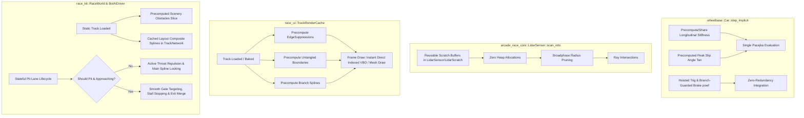

# Architecture Spec: High-Throughput Physics, Zero-Allocation LIDAR, Precomputed Junction Render Caching, and Tactical Bot Pit Lane Navigation 🏗️

A comprehensive technical architecture document outlining critical structural, performance, caching, and autonomous AI modifications across `wheelbase`, `arcade-race-core`, `race-ui`, `race-kit`, and `tdrace-app`.

---

## 🗺️ Current vs. Proposed System Architecture

### 1. Current Architecture & Bottlenecks

```mermaid
graph TD
    subgraph Physics ["wheelbase::Car::step_implicit"]
        A[Effective Inertia] -->|Evaluates Combined Slip 2x| B[Pacejka Solver]
        C[Implicit Integrator] -->|Re-evaluates Combined Slip 2x| B
        D[Wheel Loop] -->|Repeated sin/cos/exp/powf| E[Per-Wheel Forces]
    end

    subgraph LIDAR ["arcade_race_core::LidarSensor::scan_into"]
        F[Sweep Call] -->|Heap Alloc Vec<&WallBarrier>| G[Wall Filter]
        F -->|Heap Alloc Vec<OrientedBox, Vec2>| H[Opponent Filter]
        G & H -->|Linear Ray March| I[Hit Results]
    end

    subgraph Render ["race_ui::render_track (Every Frame 6-12x)"]
        J[render_surface_pass] -->|Linear O(N) project_point across all splines| K[compute_segment_edge_suppressions]
        L[render_curbs_pass] -->|Iterative segment intersection search| M[spline.untangled_boundaries]
        N[render_runoff_pass] -->|Clones and allocates splines| O[seg.to_spline]
    end

    subgraph World_AI ["race_kit::RaceWorld & BotAiDriver"]
        P[Substep Step] -->|Re-allocates Vec<Obstacle> from scenery| Q[all_obstacles_with_scenery]
        R[Dynamic Traffic AI] -->|Rebuilds composite spline every tick| S[build_composite_spline_for_layout]
        T[Stateless Pit Distance Check] -->|False positive on parallel main straights| U[Bot steers into pit wall / clamps 60 km/h]
        V[Unbiased Throat Approach] -->|Non-pitting bots accidentally enter pit lane| W[Race ruined by unintended pit drive-through]
    end
```

During comprehensive benchmarking and live 60 FPS in-game profiling, critical performance bottlenecks and AI navigation failures were uncovered:

1. **`wheelbase` Physics Throughput**: Achieved **916,304 steps/s**, falling short of the **1,500,000 steps/s** regression test floor and the **4,000,000 steps/s** constitutional target (`MISSION.md`).
2. **`arcade-race-core` LIDAR Raycaster**: Achieved **11,146,079 rays/s**, falling short of the **14,000,000 rays/s** regression test floor due to per-sweep heap allocations in `scan_into`.
3. **`race-ui` Complex Circuit Render Overhead**: Höljes RX frame rendering consumed **10.37 ms** per frame (62% of the total 16.6ms frame budget), caused by unconstrained $O(N)$ junction edge suppression scans and repeated road/curb boundary untangling calculations executed 6–12 times per frame on static geometry.
4. **`race-kit` Race Simulation Update Overhead**: Höljes RX simulation update consumed **4.90 ms** per frame (9× higher than Classic GP's 0.55 ms), caused by continuous per-substep scenery obstacle vector allocations and dynamic AI composite spline rebuilding.
5. **Combined Frame Budget**: Höljes RX totaled **15.27 ms avg (18.21 ms max)** per frame, operating at 91.6% of budget with frequent frame drops and visual stuttering under 60 Hz display refresh.
6. **Bot AI Pit Lane Confusion & Accidental Entry**:
   - In `crates/race-kit/src/ai/mod.rs`, `is_on_pit_ribbon` evaluated solely via `pit_proj.distance_to_spline < lane.road_width * 0.5 + 0.8`.
   - On circuits where the pit lane runs parallel to the main straight (e.g. Monaco with 43 false positive samples, Interlagos with 19, Montreal with 16, Nürburgring with 16, Spa with 6), bots driving on the main track within 3.3m of the pit spline falsely classify themselves as in the pit lane, abruptly clamping speed to 60 km/h and steering into dividing pit walls.
   - Non-pitting bots have inadequate divergence throat repulsion, frequently wandering into the pit entry during high-speed pack racing and being forced into unwanted pit lane transits.

### 2. Proposed Architecture & Optimization Pipelines



---

## ⚙️ Component Optimization & Tactical AI Details

### 1. `wheelbase`: Pure Vehicle Dynamics Acceleration
- **Longitudinal Slip Stiffness Deduplication**: In `step_implicit` and `effective_inertia`, the finite-difference evaluation of `combined_slip_forces` is shared or reused so that longitudinal slip stiffness is computed at most once per wheel per step rather than duplicated across inertia and force resolution.
- **Tire Tangent Precomputation**: `tire.peak_slip_angle().tan()` is invariant for a given tire compound. Precompute `peak_slip_angle_tan` on `TireConfig` or `TireCompound` to replace repeated `tan()` calls inside `combined_slip_forces`.
- **Trigonometric and Exponential Hoisting**:
  - Hoist vehicle body yaw and steering trigonometric functions (`theta.sin()`, `theta.cos()`, `phi.sin()`, `phi.cos()`) outside the per-wheel evaluation loop.
  - Guard `raw_brake.powf(1.4)`: compute only when `raw_brake > 0.0`, returning `0.0` immediately otherwise.
  - Precompute exponential filter decay coefficients `alpha_susp` and `alpha_filter` during vehicle initialization or step configuration instead of evaluating `(-2.0 * PI * f * dt).exp()` every step.

### 2. `arcade-race-core`: Zero-Allocation LIDAR Raycaster
- **Scratch Buffer Internalization**: Modify `LidarSensor` to retain pre-allocated internal scratch vectors `candidate_walls: Vec<WallBarrier>` and `opponent_obbs: Vec<(OrientedBox, Vec2)>` (or introduce a caller-provided `LidarScratch` context).
- **Sweep Zero-Allocation Guarantee**: Ensure `scan_into` performs zero heap allocations during execution by clearing and reusing scratch buffers.
- **Broadphase Spatial Rejection**: Prune wall segments beyond `range + wall_bounding_radius` using simple distance squared before performing fine ray-segment intersection tests.

### 3. `race-ui`: Precomputed Junction Geometry & Boundary Caching
- **Precomputed Edge Suppressions**:
  - Compute `SegmentEdgeSuppression` once upon track load / network construction and store them either on `RoadSegment` / `TrackSpline` or inside a dedicated `TrackRenderCache`.
  - In `render_track`, eliminate all per-frame invocations of `compute_segment_edge_suppressions` and associated $O(N)$ `project_point` sweeps.
- **Precomputed Untangled Boundaries**:
  - Precompute `spline.untangled_boundaries(...)` and cache the resulting left/right road and curb boundaries.
  - In `render_runoff_pass`, `render_curbs_pass_filtered`, and `render_surface_pass_filtered`, reuse the cached boundary vectors directly.
- **Branch Spline Retention**:
  - Eliminate per-frame `seg.to_spline()` cloning by pre-caching the `TrackSpline` representations for all branch segments.
- **Macro-Modulation Trigonometry Optimization**:
  - Pre-generate or fast-approximate vertex macro-modulation coordinates for terrain quads rather than executing 4 `sin`/`cos` calls per vertex every frame.

### 4. `race-kit`: Headless Simulation, Caching & Bot Pit Lane Intelligence
- **Static Scenery Obstacle Retention**:
  - Precompute the aggregated scenery obstacles in `TrackGeometry` (`scenery_obstacles: Vec<Obstacle>`) during track bake / initialization so `track.geometry.all_obstacles_with_scenery()` returns a borrowed slice `&[Obstacle]` with zero allocations per substep.
- **Layout Composite Spline Caching**:
  - Cache composite splines for each layout in `TrackNetwork` or `BotDirector` so that bots with `BotRouteStrategy::DynamicTrafficAvoidance` do not allocate and rebuild splines on every tick.
- **Drafting Query Zero-Allocation**:
  - Replace per-car `Vec<&Car>` allocations in `draft_intensity` with an iterator or fixed-size stack buffer.
- **Tactical Bot Pit Lane Navigation & Recognition**:
  - **Persistent Bot Pit State Machine**: Add `is_in_pit_lane: bool` to `BotAiDriver`. Bots are only marked as in the pit lane if they enter through `lane.entry_gate` while `self.is_pitting` is active.
  - **Main Track Immunity**: If `main_proj.is_on_track` is true (car is on the main drivable ribbon) and `self.is_pitting == false`, the bot completely ignores the pit road spline, preventing parallel straight false positives (Monaco, Interlagos, Montreal).
  - **Active Throat Repulsion for Non-Pitting Bots**: When within 100m of `lane.entry_gate` and `!self.is_pitting`, the bot actively biases its steering target point away from the pit entrance gore (enforcing at least 3.0m of lateral clearance) and dampens human driver line wandering to prevent accidental pit entry.
  - **Tactical Pit Entry Execution**: When `should_pit(car)` is true (wear > 70% or health < 60%), current_lap > 1, and cooldown <= 0:
    - Bot enters `is_pitting = true` 100m before the gate.
    - Smoothly transitions target point through `lane.entry_gate` center.
    - Once through the gate, transitions to `is_in_pit_lane = true`, clamps to `lane.speed_limit`, navigates to assigned stall `lane.pit_boxes[self.pit_stall_idx]`, brakes to a complete stop, waits for service, and exits safely through `lane.exit_gate` with a 30s re-entry cooldown.

### 5. `tdrace-app`: Headless Macroquad Window Guard
- Ensure input querying functions (`is_key_down`, mouse button states, mouse positions) verify window context presence or provide safe headless defaults to eliminate `catch_unwind` overhead during headless testing.

---

## 🗄️ Database & Storage Migration Plan

Describe how structural schemas and existing records will be migrated:
- **Zero SQLite Schema Changes**: Local database tables (`hall_of_fame`, `player_profiles`, `race_history` in `tdrace_records.db`) remain entirely untouched.
- **In-Memory Caching & Backward Compatibility**:
  - `TrackSpline` and `RoadSegment`: Add optional cached untangled boundary geometries and precomputed suppression flags generated lazily on track load or explicitly during `TrackGeometry` initialization.
  - `TrackGeometry`: Precompute aggregated scenery obstacles (`scenery_obstacles: Vec<Obstacle>`) once when loading or baking the circuit.
  - Serialization format of `tracks/**/*.json` remains 100% backward-compatible. No file format migrations required.
  - Existing user custom tracks load seamlessly; their render caches are populated during initialization.

---

## 🔑 Security, Compliance, & IAM Roles

Explain infrastructure access control and external API safety checks:
- **Zero-Graphics Architectural Law Compliance**:
  - `crates/wheelbase` and `crates/arcade-race-core` must maintain zero graphics (`macroquad`), audio (`kira`), or windowing dependencies. All optimizations remain pure mathematical algorithms operating on `glam::Vec2` and primitive scalars.
- **Headless WebAssembly & CI Compliance**:
  - `crates/race-kit` must compile cleanly for `wasm32-unknown-unknown`. Caching data structures in `race-kit` must avoid native platform locks or system clocks.
  - Headless test runners in `tdrace-app` must avoid Macroquad panic unwinding via a window context presence check.
- **No External Secrets or Cloud Permissions**:
  - This architecture executes entirely on local client hardware and headless benchmark runners with zero external cloud dependencies.

---

## 🛡️ Disaster Recovery, Monitoring, & Fallbacks

Operational safeguards and telemetry boundaries:
- **Graceful Fallbacks**:
  - If precomputed junction edge suppressions fail or produce invalid geometry on malformed custom tracks, fallback to unsuppressed ribbon rendering or procedural on-the-fly untangling without crash.
  - If scratch buffers in `LidarSensor` exceed capacity during pathological scenes, automatic dynamic reallocation protects against buffer overruns.
  - If a bot in the pit lane becomes stuck or stalls, the existing watchdog reverse recovery state machine frees the vehicle and guides it towards `exit_gate`.
- **Continuous Performance Monitoring**:
  - Real-time in-game profiler (`F3` / telemetry overlay) tracks frame update time (`update_ms`) and render time (`render_ms`).
  - Automated CI benchmark regression floors (`cargo bench`) catch any performance degradation below 1.5M physics steps/s or 14M LIDAR rays/s.
- **Deterministic Rollback Verification**:
  - Physics unit tests compare vehicle trajectory and lap time outputs against baseline golden records to verify that optimizations introduce zero numerical divergence.

---

## 🧪 Verification & Acceptance Criteria

List exactly how a developer or agent will test and prove correct execution:

### Automated Tests
- Physics benchmark: `cargo bench -p wheelbase --bench physics_bench`
- LIDAR benchmark: `cargo bench -p arcade-race-core --bench lidar_bench`
- Collision benchmark: `cargo bench -p arcade-race-core --bench collision_bench`
- Bot pit lane test suite: `cargo test -p race-kit --test bot_vehicle_tests`
- Workspace test suite: `cargo test --workspace --exclude tdrace-py`
- Linter verification: `cargo clippy --workspace --all-targets -- -D warnings`

### Manual Acceptance Criteria (Pseudo-Gherkin)

- **Scenario: Wheelbase physics benchmark exceeds regression floor**
  - [x] **Given** the optimized `wheelbase` vehicle solver with deduplicated Pacejka stiffness and hoisted trigonometry
  - [x] **When** executing `cargo bench -p wheelbase --bench physics_bench`
  - [x] **Then** the simulation throughput must exceed the 1,500,000 steps/s floor, reaching at least 2,500,000 steps/s without regression in vehicle dynamics tests.

- **Scenario: LIDAR raycaster operates with zero heap allocations and exceeds regression floor**
  - [x] **Given** the optimized `LidarSensor` with reusable scratch buffers
  - [x] **When** executing `cargo bench -p arcade-race-core --bench lidar_bench`
  - [x] **Then** `scan_into` performs zero heap allocations per sweep and raycasting throughput exceeds the 14,000,000 rays/s floor.

- **Scenario: Höljes RX rendering overhead drops below 4.0 ms per frame**
  - [x] **Given** precomputed junction edge suppressions and cached untangled boundaries in `race-ui`
  - [x] **When** running 120 live rendered frames on the Höljes RX World Rallycross circuit
  - [x] **Then** the track rendering pass completes in under 4.0 ms on average, with zero visual artifacts at branch junctions.

- **Scenario: Headless simulation stepping executes without hot-loop heap allocations**
  - [x] **Given** cached scenery obstacle slices and cached composite splines in `race-kit`
  - [x] **When** stepping `RaceWorld` for 1,000 ticks on a multi-layout rallycross track with 8 bot competitors
  - [x] **Then** the simulation update time remains under 1.0 ms per frame with zero per-tick scenery obstacle allocations.

- **Scenario: Bots recognize pit lanes and only enter when tactical conditions require pit service**
  - [x] **Given** a multi-car race on a GT circuit with a physical pit lane running parallel to the main straight (Monaco, Monza, or Interlagos)
  - [x] **When** bots drive multiple laps without excessive tire wear or chassis damage (`should_pit` is false)
  - [x] **Then** zero bots enter the pit lane or clamp their speed to the pit limit on the main straight, maintaining full racing speed past the pit throat.

- **Scenario: Bots executing a pit stop successfully navigate through entry gate, stall service, and exit gate**
  - [x] **Given** a bot vehicle with tire wear exceeding 70% or chassis health below 60% on lap 2 or later
  - [x] **When** approaching the pit entrance
  - [x] **Then** the bot enters the pit lane through `lane.entry_gate`, obeys `lane.speed_limit`, halts inside its assigned pit stall for service, receives fresh tires and repairs, and rejoins the race through `lane.exit_gate`.

- **Scenario: Determinism and telemetry parity preserved across vehicle fleet**
  - [x] **Given** the optimized `wheelbase` and `arcade-race-core` crates
  - [x] **When** executing the comprehensive workspace test suite across all 25 vehicle categories
  - [x] **Then** all vehicle tests pass with bit-identical trajectory and handling invariants.

- **Scenario: Headless test runner executes input polling without panic unwinding**
  - [x] **Given** the input polling safety guard in `tdrace-app`
  - [x] **When** executing tests in a headless environment without an active Macroquad window context
  - [x] **Then** input checks return safe default values without triggering panic or `catch_unwind` overhead.

---

## 🔗 Traceability & Codebase Mapping

List the exact files in the codebase that implement or are governed by this specification.

### Created/Modified Files
- `[x]` `crates/wheelbase/src/car.rs` -> Longitudinal slip stiffness deduplication and trigonometric hoisting.
- `[x]` `crates/wheelbase/src/tire.rs` -> Precomputed peak slip angle tangent and combined slip optimization.
- `[x]` `crates/arcade-race-core/src/lidar/mod.rs` -> Scratch buffer internalization and zero-allocation `scan_into`.
- `[x]` `crates/arcade-race-core/src/track/geometry.rs` -> Precomputed scenery obstacles slice retention.
- `[x]` `crates/arcade-race-core/src/track/network.rs` -> Layout composite spline caching.
- `[x]` `crates/race-kit/src/world.rs` -> Zero-allocation obstacle and drafting queries.
- `[x]` `crates/race-kit/src/ai/mod.rs` -> Bot pit lane recognition, state machine, divergence throat avoidance, and entry gating.
- `[x]` `crates/race-ui/src/render/track.rs` -> Precomputed junction edge suppression and cached boundary meshes.
- `[x]` `crates/tdrace-app/src/game/mod.rs` -> Headless input context presence guard.
- `[x]` `specs/constitution/ROADMAP.md` -> Roadmap tracking for performance and pit lane navigation milestone.

### Verification Assertions
- The code in `crates/wheelbase/src/car.rs`, `crates/arcade-race-core/src/lidar/mod.rs`, and `crates/race-kit/src/ai/mod.rs` references `specs/084_highthroughput_physics_zeroallocation_lidar_and_precomputed_junction_render_caching.md` in comments.
