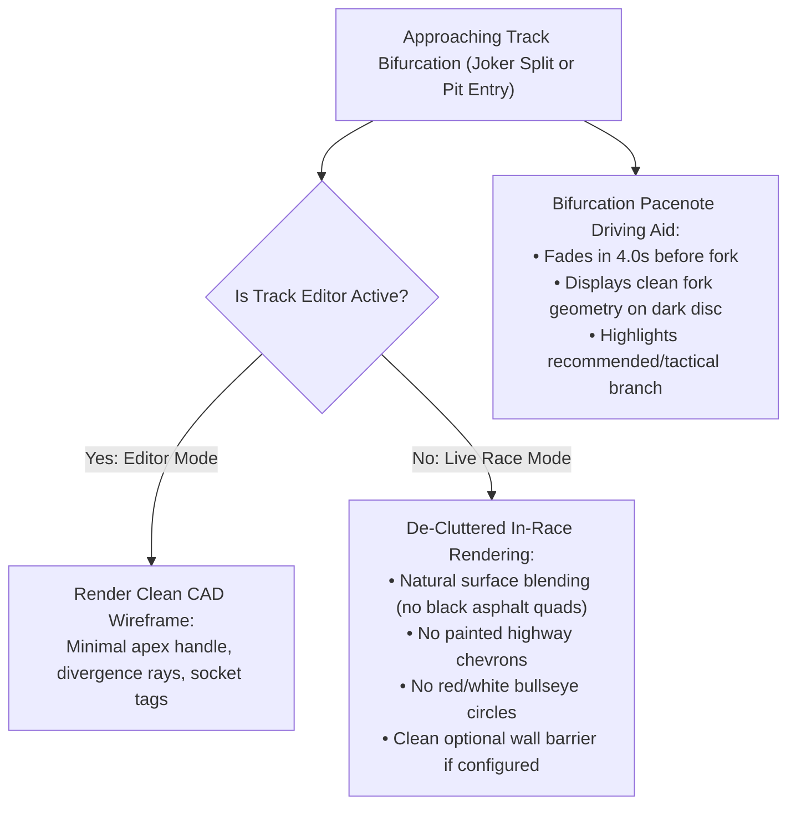

# Feature Spec: Bifurcation Pacenote HUD Driving Aids and De-Cluttered Track Junctions 🏁🧭

A focused visual and driving-aid specification for **TDRace**, eliminating unnatural in-race junction clutter (hardcoded asphalt wedges, painted highway chevrons, and cartoonish "bullseye" attenuator caps) across track splits, preserving authentic terrain surface physics, decoupling bot navigation logic from visual rendering, and introducing a glanceable **Bifurcation Pacenote HUD Driving Aid** for Joker Laps and Pit Lane entries.

---

## 🎯 Executive Summary & Problem Statement

### 1.1 The In-Race Junction Clutter Problem
In [Spec 081](081_rallycross_joker_lap_segments_for_classic_and_openstreetmap_circuits.md) and [Spec 062](062_circuit_pit_lanes_and_interactive_pit_stop_procedures.md), track splitting machinery (`RoadJunction::Split`, `GoreConfig`, and `PitLane` entrance splits) was introduced to handle Joker Lap detours and pit lanes. However, the visual rendering of these bifurcations in [`crates/race-ui/src/render/track.rs`](../crates/race-ui/src/render/track.rs) exhibits severe aesthetic and physical flaws:

1. **Hardcoded Asphalt Materials on Natural Terrain**:
   - The bifurcation throat wedge quads (`draw_quad`, `draw_triangle`) hardcode `Palette::ASPHALT`.
   - The triangular gore safety zone hardcodes `Palette::RUNOFF_ASPHALT` and highway-style white painted V-chevrons (`Palette::WHITE_LINE`).
   - On dirt, gravel, sand, snow, or mud circuits (e.g. rallycross, autocross, desert raids), these hardcoded colors stamp jet-black modern highway pavement onto natural earthen tracks, creating a jarring visual clash.
2. **Geometric Distortion ("Bowtie Wings")**:
   - The entrance throat wedge connects the outer socket edges of the incoming trunk (`in_l`, `in_r`) to the outgoing branch socket edges (`e0_l`, `e1_r`) using raw quads and triangles. When branches diverge at an angle, this geometry flares outward into distorted dark triangular "wings" that protrude outside the drivable road ribbon into runoff terrain.
3. **Primitive "Bullseye" Iconography**:
   - The impact attenuator nose cap at the apex is rendered with three concentric circles (`0.9m` red, `0.6m` white, `0.3m` red). Instead of looking like authentic motorsport crash barriers or track equipment, it resembles a toy archery bullseye / target.
4. **Physics Friction Contamination**:
   - In [`crates/arcade-race-core/src/track/network.rs`](../crates/arcade-race-core/src/track/network.rs), `sample_surface()` hardcodes `SurfaceType::Asphalt` for the gore triangle:
     ```rust
     if point_in_triangle_2d(point, p_apex, p0, p1) {
         return Some(SurfaceType::Asphalt);
     }
     ```
     A dirt rallycross car cutting near the apex suddenly receives asphalt tire grip on an all-dirt track.
5. **Ineffective Visual Feedback in Fast Top-Down Racing**:
   - At $150\,\text{km/h}$ in top-down view, painted road triangles are only visible fractions of a second before the split. A driver needs situational awareness *seconds in advance*.

### 1.2 Core Design Principles
- **Clean, Natural Track Presentation**: Zero artificial painted asphalt wedges, V-chevrons, or bullseye targets in live races. Natural track junctions blend seamlessly with the circuit's native surface (`SurfaceType::Dirt`, `Gravel`, etc.).
- **Physics Purity**: Junction areas inherit the native surface type of the parent track ribbon. No artificial asphalt grip islands on dirt tracks.
- **Decoupled Bot Navigation**: Bot AI relies strictly on mathematical metadata (`apex_point`, `divergence_angle`, lookahead distance) with zero dependence on visual draw calls.
- **Glanceable Pacenote Bifurcation Aid**: Driving aids alert the player with an authentic Rally Pacenote fork badge beside the vehicle with $3.5\text{--}4.5\,\text{s}$ lookahead, clearly indicating the main line vs. detour branch.
- **Minimal CAD-Style Editor Tools**: In Track Studio / Editor mode, junctions display clean vector wireframes and node handles without polluting in-race visuals.

---

## 🗺️ User Flow & Interface Design

### 1. In-Race Circuit Presentation


1. **In-Race Track Surface**:
   - The bifurcation throat quads (`draw_quad`, `draw_triangle` in `render_network_junctions_pass` and `render_pit_lane_junctions_pass`) are removed from live race rendering. Road surfaces connect continuously via standard spline boundary interpolation.
   - The triangular gore asphalt fill, white perimeter line, and white chevrons are suppressed in live racing.
   - The concentric red-and-white circle "bullseye" is eliminated. If an apex barrier is configured, it renders solely through standard wall styling ([`render_wall_body`](../crates/race-ui/src/render/barrier.rs)) without cartoonish targets.

2. **Bifurcation Pacenote HUD Driving Aid**:
   - Integrated into [`crates/race-ui/src/hud/curve_indicator.rs`](../crates/race-ui/src/hud/curve_indicator.rs).
   - When approaching a track split (within $4.5\,\text{s}$ to $4.0\,\text{s}$ ETA):
     - A dark circular disc appears beside the car (sharing clearance and scaling with `render_curve_pacenote`).
     - Inside the disc, a clean vector fork graphic depicts the incoming road splitting into two branches (e.g., straight/right vs branching left).
     - **Route Guidance Highlighting**:
       - Standard line: rendered in the active curve helper scheme (e.g. Green / Cyan).
       - Tactical branch (Joker Lap or Pit Entry): highlighted with distinctive accent color (e.g., Neon Gold / Amber for Joker Lap; Neon Cyan for Pit Lane).
       - When a player is scheduled or required to take the Joker lap (or has requested a pit stop), the tactical branch is prominently highlighted with an arrowhead.
     - Smoothly fades out once the vehicle crosses the apex point.

3. **Track Studio / Editor Overlays**:
   - In [`crates/tdrace-app/src/editor/tools.rs`](../crates/tdrace-app/src/editor/tools.rs), the editor displays clean wireframe markers:
     - Apex point: small cyan/gold pivot dot ($0.4\,\text{m}$ radius).
     - Sockets: thin tangent alignment arrows with socket labels (`[Main]`, `[Joker]`, `[Pit]`).
     - Zero solid black quads or painted chevrons in the editor canvas.

---

## ⚙️ Backend Models & API Endpoints

### 1. Decoupled Surface Sampling (`arcade-race-core::track::network`)
In [`crates/arcade-race-core/src/track/network.rs`](../crates/arcade-race-core/src/track/network.rs), `sample_surface()` is updated:
- The hardcoded `return Some(SurfaceType::Asphalt);` inside the gore triangle is removed.
- In bifurcation zones, surface queries fall through to the underlying segment or ingress socket's natural surface type (`ingress_socket.surface`).

### 2. Pure Mathematical AI Guidance (`race-kit::ai`)
In [`crates/race-kit/src/ai/mod.rs`](../crates/race-kit/src/ai/mod.rs):
- Bot driver lateral repulsion at pit lane and Joker splits operates purely using `lane.entry_gate` and `gore.apex_point` coordinates.
- Confirms zero functional dependency on `render_network_junctions_pass` or on-screen pixels.

### 3. Bifurcation Detection & Pacenote Indicator (`race-ui::hud::curve_indicator`)
```rust
/// Status of an upcoming track split or bifurcation.
#[derive(Debug, Clone, PartialEq)]
pub struct BifurcationApproachStatus {
    pub distance_to_split: f32,
    pub divergence_angle: f32,
    pub branch_left_is_tactical: bool,
    pub branch_right_is_tactical: bool,
    pub recommended_branch_left: bool,
    pub is_pit_entry: bool,
    pub is_joker_split: bool,
}

/// Renders the bifurcation pacenote badge beside the car.
pub fn render_bifurcation_pacenote(
    player_car: &Car,
    status: &BifurcationApproachStatus,
    scheme: CurveColorScheme,
    current_zoom: f32,
    anim_time: f32,
    scale: f32,
    brightness: f32,
);
```

---

## 🛡️ Security & Role-Based Access Controls (RBAC)

### 1. Invariants & Anti-Exploit Rules

1. **Zero-Graphics Invariant**:
   - Headless simulations and bot benchmark suites (`cargo test -p arcade-race-core`, `cargo bench`) must yield bit-identical lap times and physics state regardless of whether bifurcation HUD aids are drawn or disabled.
2. **Surface Purity Invariant**:
   - Dirt, mud, gravel, snow, and sand tracks must return their authentic physical surface friction across all junction zones. No artificial tarmac patches may alter vehicle traction.
3. **Collision Wall Clearance Invariant**:
   - Automated wall trimming (`track.trim_walls_for_network()`) remains active to ensure no wall segments block open junction mouths.

---

## 🧪 Verification & Acceptance Criteria

### Automated Tests
- Command to run core network tests: `cargo test -p arcade-race-core --test multi_route_progress_tests`
- Command to run UI HUD tests: `cargo test -p tdrace-app --test curve_helper_hud_tests`
- Command to run rally circuit tests: `cargo test -p tdrace-app --test rally_tracks_tests`

### Manual Acceptance Criteria (Pseudo-Gherkin)

- **Scenario: Clean in-race bifurcation rendering on dirt tracks**
  - [x] **Given** a dirt rallycross track with a Joker Lap split (e.g. `holjes_rx` or `rx_canyon_flyer`)
  - [x] **When** rendered in-game during a live race
  - [x] **Then** zero black asphalt throat quads ("bowtie wings") are rendered across the dirt surface
  - [x] **And** zero white highway chevrons or concentric red-and-white "bullseye" circles are drawn

- **Scenario: Native surface friction preserved at junction split**
  - [x] **Given** a car driving across the bifurcation apex on a dirt circuit
  - [x] **When** sampling surface friction via `track.sample_surface(point)`
  - [x] **Then** the returned surface type is `SurfaceType::Dirt` rather than `SurfaceType::Asphalt`

- **Scenario: Bifurcation Pacenote HUD indicator triggers on approach**
  - [x] **Given** a player vehicle approaching a Joker split or Pit Lane entry with $4.0\,\text{s}$ ETA
  - [x] **When** `curve_helper` is enabled in settings
  - [x] **Then** a circular Pacenote disc appears beside the car displaying the branching fork geometry
  - [x] **And** the recommended path is clearly distinguished from the alternate detour

- **Scenario: Bots navigate split junctions without visual geometry**
  - [x] **Given** bot vehicles navigating a circuit in headless mode with visual rendering disabled
  - [x] **When** completing laps on circuits with Joker splits and pit lanes
  - [x] **Then** bots maintain lateral clearance away from the apex barrier and execute scheduled Joker detours cleanly

- **Scenario: Track editor provides minimal CAD wireframe handles**
  - [x] **Given** the Track Studio / Editor mode with an active split junction
  - [x] **When** inspecting the bifurcation node
  - [x] **Then** the editor renders clean vector wireframes (apex point handle, socket labels, divergence rays) without cluttered solid asphalt wedges

---

## 🔗 Traceability & Codebase Mapping

### Created/Modified Files
- `crates/race-ui/src/render/track.rs` -> Remove in-race asphalt throat quads, painted chevrons, and bullseye circles.
- `crates/race-ui/src/hud/curve_indicator.rs` -> Implement `render_bifurcation_pacenote` and bifurcation geometry generator.
- `crates/arcade-race-core/src/track/network.rs` -> Fix `sample_surface()` to prevent asphalt grip override on non-asphalt tracks.
- `crates/tdrace-app/src/editor/tools.rs` -> Streamline editor split junction handles to clean CAD wireframes.
- `crates/tdrace-app/tests/curve_helper_hud_tests.rs` -> Add unit tests for bifurcation pacenote indicator positioning and display timing.

### Beads Epic Mapping
- Governed by Beads Epic: `tdrace-m46h` ("Fulfill Spec 085: Bifurcation Pacenote HUD Driving Aids and De-Cluttered Track Junctions").
