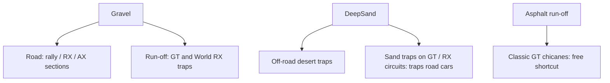
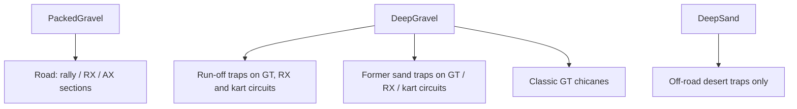

# Architecture Spec: Packed and Deep Gravel Surfaces and Asphalt-Circuit Gravel Traps 🪨

Today there is one `Gravel` surface. It does two jobs that need opposite physics:

1. It is the **road** on rally, rallycross and autocross sections. There it must be fast and drivable.
2. It is the **run-off trap** beside GT and World RX circuits. There it must slow a car that leaves the road.

The only surface that really slows a car today is `DeepSand`. But a car with road tyres that stops in `DeepSand` cannot drive out. This breaks the category surface rule: a car must never be trapped by a surface of a circuit of its own category.

This spec makes two gravel surfaces, the same way [Spec 025](025_terrain_surface_bifurcation_and_category_tier_gating.md) split sand into `PackedSand` and `DeepSand`.

---

## 🗺️ Current vs. Proposed System Architecture

### 1. Current Architecture

Measured with the Classic GT car (`ClassicGameModule::car_classic_gt`), 2026-10-05:

| Surface | Speed 8 s after a stop (best fixed throttle) | Coast to a stop from 100 km/h, no brake |
|---|---|---|
| Asphalt | 142 km/h | 163 m |
| Dirt | 87 km/h | 160 m |
| Gravel | 19 km/h | 187 m |
| Grass | 8 km/h | 238 m |
| DeepSand | **0 km/h (trapped)** | 75 m |

- On Grass the Classic GT car gains only about 1 km/h per second at any throttle, and covers about 25 m in 15 s from a stop. "Not trapped" is measured as distance, not speed: a car must cover 10 m in 15 s.
- `Gravel` does not slow a car more than Asphalt does. A gravel trap does not work as a trap.
- `DeepSand` slows the car but traps road cars. So circuits used wide Asphalt run-off at chicanes instead, and cars could drive straight through them.

### 2. Proposed Architecture

#### 2.1 `PackedGravel` (rename of `Gravel`)
- The `Gravel` variant is renamed `PackedGravel`. It keeps its enum position (index 4), so no affinity table or other per-surface array changes its order.
- Physics: like `Dirt`, a bit more slippery. Friction coefficient about 0.72 (Dirt 0.78). Rolling resistance and surface drag close to Dirt (about 1.3 and 1.15).
- Tyre affinity: the same as `Dirt` for every compound. So the grip of every car (friction × affinity) is 85–95 % of its grip on Dirt.
- Look: the current `gravel_crushed.png` texture and `GRAVEL` colours.

#### 2.2 `DeepGravel` (new)
- A loose gravel bed. It is added at the **end** of `SurfaceType` (index 15), so the indices of the other surfaces do not change. `SurfaceType::ALL` grows to 16. `DeepGravel` is a valid off-track surface.
- Purpose: slow a car that leaves the road, hard at speed and gently at walking speed, so a stopped car can always drive out.
- Physics: tuned against the targets in the scenarios below. If friction, rolling resistance and surface drag cannot meet both targets, `DeepGravel` gets a speed-proportional bed drag (a force that grows with speed and is near zero when the car crawls).
- `DeepSand` does not change.
- Look: its own texture `gravel_deep.png`, made by `generate_surface_textures` (coarser, lighter stones than `PackedGravel`), its own colours, and stone particles and ruts like `PackedGravel`.

#### 2.3 Circuit data
- Serde reads the old name `"Gravel"` as `PackedGravel`, so old saves and user circuits still load. New files write `"PackedGravel"`.
- Official circuits (`tracks/`):
  - Road (`surface`) `Gravel` becomes `PackedGravel`.
  - Run-off (`left/right_runoff_surface`) `Gravel` on GT, World RX and Classic GT circuits becomes `DeepGravel`.
  - `DeepSand` surface zones and run-off on GT, World RX, kart and the Classic GT / RX / kart circuits become `DeepGravel`. Off-road circuits (`extreme_offroad`, Classic `at_*`) keep `DeepSand`.
- The circuit scripts in `scripts/` write the new names.

#### 2.4 Classic GT run-off (changes Spec 055)
For Coastal Grand Prix, Ridge Ring and Velocity Park:
- No `Asphalt` run-off.
- Straights: `Grass`, wall at 8 m or less.
- Corners: `DeepGravel` traps, wall at 12 m or less (before: 15–22 m).
- Chicanes: `DeepGravel` on both sides, wall at 6 m or less.
- Ridge Ring's two `DeepSand` trap zones become `DeepGravel`.

Spec 055 is still `in_progress`, so this spec edits it directly, and its approval hash is stamped again:
- Prose: "Velocity Park: wide Asphalt runoff (20–30 m) at the braking zones, Gravel elsewhere" becomes "DeepGravel traps at the braking zones". "Ridge Ring: narrow DeepSand traps" becomes "narrow DeepGravel traps". "Each circuit uses at least 3 of these runoff and trap surfaces … Together the 3 circuits use all 5" becomes "Each circuit uses Grass and DeepGravel run-off".
- Scenario "GT circuits reward speed and braking", step "each uses at least 3 runoff or trap surfaces" becomes "each uses Grass and DeepGravel run-off, and no Asphalt run-off".
- The other Spec 055 rules do not change.

---

## 🗄️ Database & Storage Migration Plan

There is no database. The stored data is the circuit JSON.
- **Read old data**: `#[serde(alias = "Gravel")]` on `PackedGravel`. A test loads a circuit with `"Gravel"`.
- **Official circuits**: a one-time rewrite of `tracks/**/*.json` (in the `tdrace-tracks` submodule), then `track_bake --rebuild` for the circuits whose run-off widths change. Checkpoints and grid must not move.
- **No index shift**: `PackedGravel` keeps index 4 and `DeepGravel` is index 15. Code that indexes arrays by `surface as usize` keeps its meaning.

---

## 🔑 Security, Compliance, & IAM Roles

Not applicable. No new dependency, no network, no secrets.

---

## 🛡️ Disaster Recovery, Monitoring, & Fallbacks

- **Rollback**: revert the tdrace commits and move the `tracks` submodule pointer back. Old JSON still loads because of the serde alias.
- **Watch**: the Classic bot harness (no new stuck bots) and the surface probe numbers below.

---

## 🧪 Verification & Acceptance Criteria

### Automated Tests
- Surface targets: `cargo test --release -p tdrace-app --test gravel_surfaces_tests`
- Classic circuit rules: `cargo test --release -p tdrace-core --test classic_circuits_tests`
- Bots race the Classic circuits: `cargo test --release -p tdrace-app --test classic_circuits_bot_tests`
- Physics and core: `cargo test --release --no-fail-fast -p wheelbase -p arcade-race-core -p tdrace-core -p race-ui -p tdrace-app` (no new failures compared with `main`)
- Python scripts: `ruff check scripts`

Reference cars: Classic GT, Classic kart, Classic rally, and the first car of tiers 1 and 5 of the GT, kart and rally modules.

### Manual Acceptance Criteria (Pseudo-Gherkin)

- **Scenario: PackedGravel drives like Dirt, a bit more slippery**
  - [ ] **Given** each reference car
  - [ ] **When** its grip (friction × tyre affinity) on PackedGravel is compared with its grip on Dirt
  - [ ] **Then** the PackedGravel grip is 85–95 % of the Dirt grip for every car

- **Scenario: DeepGravel slows a car that leaves the road**
  - [ ] **Given** each reference car at 100 km/h
  - [ ] **When** it coasts with no throttle and no brake on DeepGravel until it stops
  - [ ] **Then** it stops in 60 % or less of the distance it needs to coast to a stop on Asphalt

- **Scenario: DeepGravel never traps a car**
  - [ ] **Given** each reference car stopped on DeepGravel
  - [ ] **When** it drives with the best fixed throttle for 15 s
  - [ ] **Then** it covers 10 m or more

- **Scenario: Old circuits still load**
  - [ ] **Given** a circuit JSON with a surface `"Gravel"`
  - [ ] **When** it is loaded and saved again
  - [ ] **Then** the surface is `PackedGravel` and the saved file says `"PackedGravel"`

- **Scenario: Official circuits use the new surfaces**
  - [ ] **Given** the official circuits in `tracks/`
  - [ ] **When** their surfaces are listed
  - [ ] **Then** no file uses `"Gravel"`, every GT, World RX and Classic GT gravel run-off is `DeepGravel`, and no GT, World RX, kart or Classic GT / RX / kart circuit uses `DeepSand`
  - [ ] **And** the off-road circuits still use `DeepSand`

- **Scenario: Classic GT circuits have no shortcut run-off**
  - [ ] **Given** Coastal Grand Prix, Ridge Ring and Velocity Park
  - [ ] **When** their run-off is listed per waypoint
  - [ ] **Then** none is Asphalt, chicane run-off is DeepGravel with the wall at 6 m or less, corner traps are DeepGravel with the wall at 12 m or less, and straight run-off is Grass with the wall at 8 m or less

- **Scenario: Bots still race**
  - [ ] **Given** the Classic bot harness
  - [ ] **When** it races every Classic circuit
  - [ ] **Then** every circuit that passed before this spec still passes

- **Scenario: DeepGravel looks different from PackedGravel**
  - [ ] **Given** a circuit with PackedGravel road and DeepGravel run-off
  - [ ] **When** it is drawn in the game and in the track editor
  - [ ] **Then** the two surfaces have different textures and colours, and the editor surface list offers both

---

## 🔗 Traceability & Codebase Mapping

### Created/Modified Files
- `[ ]` `crates/wheelbase/src/surface.rs` -> `PackedGravel` rename, `DeepGravel` variant, physics values, tyre affinities, surface lists.
- `[ ]` `crates/wheelbase/src/car.rs` -> bed drag for `DeepGravel`, only if friction, rolling resistance and drag cannot meet the targets.
- `[ ]` `crates/race-ui/src/render/{surface_material,track,color}.rs`, `crates/race-ui/src/fx/{particles,skidmarks}.rs` -> DeepGravel look.
- `[ ]` `crates/tdrace-app/src/bin/generate_surface_textures.rs`, `assets/textures/surfaces/gravel_deep.png` -> DeepGravel texture.
- `[ ]` `crates/tdrace-app/src/editor/`, `crates/tdrace-app/src/ui/track_preview.rs`, `crates/tdrace-py/src/rasterizer.rs` -> both gravels in tools and previews.
- `[ ]` Every other `SurfaceType::Gravel` use in `crates/` -> renamed.
- `[ ]` `scripts/*.py` -> write the new names.
- `[ ]` `tracks/**/*.json` (submodule `tdrace-tracks`) -> new surfaces; Classic GT run-off widths.
- `[ ]` `crates/tdrace-app/tests/gravel_surfaces_tests.rs` -> surface target tests (new).
- `[ ]` `crates/tdrace-core/tests/classic_circuits_tests.rs` -> Spec 055 rules changed by §2.4.

### Verification Assertions
- `crates/tdrace-app/tests/gravel_surfaces_tests.rs` references `specs/089_packed_and_deep_gravel_surfaces_and_asphaltcircuit_gravel_traps.md` in its header comment.
