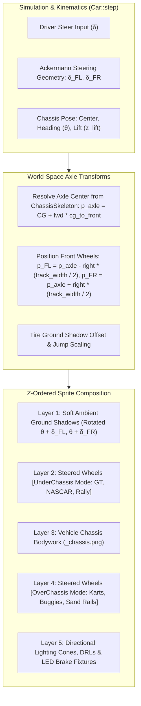

# Feature Spec: Global Pre-Baked Vehicle Steered Wheel Articulation 🏎️✨🛞

A comprehensive vehicle rendering, asset pipeline, and visual kinematics specification expanding dynamic Ackermann steered wheel animation globally across every motorsport vehicle in **TdRace**.

While [Spec 026](026_topdown_wheel_steering_animations.md) established the foundational multi-layer sprite decomposition proof-of-concept on `classic_kart` and [Spec 073](073_realistic_vehicle_sprite_harmonization_and_modular_steered_wheel_articulation.md) deployed steered wheel articulation across the 12 Classic fantasy vehicles, the remaining 107+ production vehicles across the 6 primary motorsport modules (**GT**, **NASCAR**, **Rallycross**, **Autocross**, **Karting**, and **Extreme Off-Road**) currently bypass modular wheel rendering, rendering as static monolithic bitmaps with front wheels locked straight at $0^\circ$.

This specification eliminates this visual regression globally by introducing algorithmic `SteeredWheelConfig` derivation from physical `CarConfig` and `ChassisSkeleton` (Spec 075), standardizing a batch wheel-well erasure and fender inpainting pipeline across all modules, and ensuring seamless `UnderChassis` and `OverChassis` dual-layer composition across the entire fleet.

---

## 🗺️ User Flow & Interface Design

### 1. In-Race Top-Down (Cenital) Dynamic Articulation
In top-down racing view, every vehicle across every category renders as a multi-layer articulated mechanical system:



* **Straight-Line Tracking ($\delta = 0^\circ$):** Front wheels align parallel to vehicle heading $\hat{\mathbf{f}}$, perfectly matching the chassis centerline with zero jitter.
* **Cornering & Turn-In ($\delta \ne 0^\circ$):** Front wheels visibly deflect into the turn. Inner tire turns sharper than the outer tire according to authentic Ackermann geometry.
* **Counter-Steer Slides:** When drifting through loose dirt, gravel, or asphalt power slides, the front wheels visibly counter-steer in the direction of the slide while the body pitches at a yaw angle, providing immediate intuitive feedback.
* **Airborne Jumps:** Over crests and ramps, wheel drop shadows scale and fade in exact unison with the chassis drop shadow.

### 2. Garage, Showroom & UI Parity
* Showroom and Garage turntable views continue to load the canonical high-resolution lateral view (`assets/textures/vehicles/laterals/<module>/<model_id>.png`).
* Top-down showroom inspection and menu cards load the canonical full sprite with wheels (`assets/textures/vehicles/topdown/<module>/<model_id>.png`).
* Race rendering loads the dual-contract chassis sprite (`assets/textures/vehicles/topdown/<module>/<model_id>_chassis.png`), seamlessly falling back to `<model_id>.png` if an isolated chassis sprite is absent.

---

## ⚙️ Backend Models & API Endpoints

### 1. Mathematical & Physical Geometry Model

#### Dynamic Ackermann Angle Resolution
At any simulation tick, the steering geometry resolves differential inner/outer steer angles based on vehicle wheelbase ($L = l_f + l_r$) and front track width ($W_f = 2 \cdot w_f$):

$$\delta_{\text{Ackermann}} = \text{compute\_ackermann\_angles}(\delta_{\text{steer}})$$

Given current chassis orientation angle $\theta_{\text{car}}$, unit forward vector $\hat{\mathbf{f}}$, and unit right vector $\hat{\mathbf{r}}$:

$$\hat{\mathbf{f}} = \begin{pmatrix} \cos\theta_{\text{car}} \\ \sin\theta_{\text{car}} \end{pmatrix}, \quad \hat{\mathbf{r}} = \begin{pmatrix} \sin\theta_{\text{car}} \\ -\cos\theta_{\text{car}} \end{pmatrix}$$

#### World-Space Wheel Hub Anchor Coordinates
Front-left (FL) and front-right (FR) wheel hubs are positioned relative to the dynamic `chassis_center`:

$$\mathbf{p}_{\text{FL}} = \mathbf{p}_{\text{chassis}} + \hat{\mathbf{f}} \cdot l_f - \hat{\mathbf{r}} \cdot w_f$$

$$\mathbf{p}_{\text{FR}} = \mathbf{p}_{\text{chassis}} + \hat{\mathbf{f}} \cdot l_f + \hat{\mathbf{r}} \cdot w_f$$

#### Absolute Wheel World Orientations
Each front wheel pivots around its individual hub center:

$$\theta_{\text{FL}} = \theta_{\text{car}} + \delta_{\text{FL}}$$

$$\theta_{\text{FR}} = \theta_{\text{car}} + \delta_{\text{FR}}$$

### 2. Global `SteeredWheelConfig` Derivation Architecture
Instead of manually hardcoding coordinates for 107+ cars, `crates/tdrace-app/src/render/vehicle_assets.rs` establishes dynamic configuration resolution based on `tdrace_core::physics::CarConfig` and category conventions:

```rust
/// Category-level visual wheel binding.
pub struct CategoryWheelStyle {
    pub default_wheel_texture: &'static str,
    pub layering: WheelLayerMode,
}

pub fn get_category_wheel_style(category: CarCategory) -> CategoryWheelStyle {
    match category {
        CarCategory::Kart => CategoryWheelStyle {
            default_wheel_texture: "kart_slick_front",
            layering: WheelLayerMode::OverChassis,
        },
        CarCategory::Autocross => CategoryWheelStyle {
            default_wheel_texture: "offroad_wheel_front",
            layering: WheelLayerMode::OverChassis,
        },
        CarCategory::OffRoad => CategoryWheelStyle {
            default_wheel_texture: "offroad_wheel_front",
            layering: WheelLayerMode::OverChassis,
        },
        CarCategory::Gt => CategoryWheelStyle {
            default_wheel_texture: "gt_slick_front",
            layering: WheelLayerMode::UnderChassis,
        },
        CarCategory::Nascar => CategoryWheelStyle {
            default_wheel_texture: "nascar_wheel_front",
            layering: WheelLayerMode::UnderChassis,
        },
        CarCategory::Rally => CategoryWheelStyle {
            default_wheel_texture: "rally_wheel_front",
            layering: WheelLayerMode::UnderChassis,
        },
    }
}
```

When resolving a model's `SteeredWheelConfig`:
1. If an explicit manual override exists in `get_steered_wheel_config(model_id)`, use it (preserving handcrafted tuning for the 12 Classic cars).
2. Otherwise, look up the car's `RealCarModel` and its underlying `CarConfig`:
   * `front_axle_offset = car_config.cg_to_front`
   * `half_track_width = car_config.track_width * 0.5`
   * `wheel_size = Vec2::new(car_config.wheels[0].tire_width, car_config.wheels[0].tire_radius * 2.0)`
   * `wheel_texture_id = style.default_wheel_texture`
   * `layering = style.layering`

### 3. Automated Batch Wheel Erasure & Inpainting Pipeline
To support 100+ vehicles without hundreds of hours of manual image manipulation:
* Introduce `scripts/generate_global_chassis_cutouts.py` utilizing Pillow and NumPy.
* For each module directory (`gt/`, `nascar/`, `rally/`, `autocross/`, `kart/`, `extreme_offroad/`):
  * Read every top-down texture `<model_id>.png`.
  * Determine archetype (open-wheel vs. closed-wheel).
  * Compute front wheel bounds in normalized pixel coordinates (512x512 canvas, vehicle facing right +X).
  * For open-wheel vehicles: alpha-clear the outboard front tire rectangles while preserving suspension wishbones and front bumper fairings.
  * For closed-wheel vehicles: hollow out the front wheel arches, introducing a soft ambient occlusion inner shadow so rotating tires underneath appear recessed within 3D fender cavities.
  * Write the resulting asset to `<model_id>_chassis.png`.

---

## 🛡️ Security & Role-Based Access Controls (RBAC)

### 1. Memory Safety & Texture Allocation Guardrails
* **Texture Dimension Sanity:** Wheel and chassis textures enforce strict dimension bounds ($\max 512 \times 512\,\text{px}$ top-down, $\max 1024 \times 512\,\text{px}$ lateral, 8-bit RGBA) to guard against unbounded GPU memory allocations.
* **Deterministic Lifetime & Thread-Safe Caching:** All textures are retained in thread-safe static caches (`WHEEL_TEXTURE_CACHE`, `TOPDOWN_CACHE`, `LATERAL_CACHE`) protected by `std::sync::Mutex` with poison-recovery (`unwrap_or_else(|e| e.into_inner())`).

### 2. Headless Simulation Invariance & Sandbox Isolation
* **Zero Graphics Dependency in Simulation:** Physics stepping in `crates/wheelbase` and `crates/tdrace-core` remains strictly isolated from graphics and macroquad texture handles. Simulation runs headless at $> 100,000\,\text{steps/sec}$ with zero graphics calls.
* **Presentation-Layer Isolation:** Wheel visual deflection is an aesthetic presentation layer governed by `CarState.steer_angle`. Alterations to wheel rendering never influence vehicle collision boundaries (OBB SAT collision quads) or tire grip dynamics.

---

## 🧪 Verification & Acceptance Criteria

### Automated Tests
* Comprehensive unit tests in `crates/tdrace-app/tests/render_tests.rs`:
  - Assert that all catalog models across all 6 motorsport modules resolve a valid `SteeredWheelConfig`.
  - Assert that open-wheel models resolve `WheelLayerMode::OverChassis` and closed-wheel models resolve `WheelLayerMode::UnderChassis`.
  - Assert that chassis sprites (`_chassis.png`) load successfully or fallback gracefully to canonical `.png`.
  - Verify mathematical Ackermann angular deflection across analog and digital steering inputs.
* Run project test suite:
  ```bash
  cargo test -p tdrace-app --test render_tests
  cargo test --workspace --exclude tdrace-py
  ```

### Manual Acceptance Criteria (Pseudo-Gherkin)

- **Scenario: Global SteeredWheelConfig resolution across all modules**
  - [ ] **Given** any vehicle model from the master catalog across GT, NASCAR, Rally, Autocross, Kart, or Extreme Off-Road
  - [ ] **When** `derive_steered_wheel_config` is queried with the car's model ID and physics `CarConfig`
  - [ ] **Then** it must return a valid `SteeredWheelConfig` with non-zero `front_axle_offset`, `half_track_width`, and `wheel_size`
  - [ ] **And** `layering` must match the vehicle's open-wheel or closed-wheel aerodynamic archetype

- **Scenario: In-race dynamic Ackermann articulation for closed-wheel GT and Rally cars**
  - [ ] **Given** an in-race session driving a closed-wheel vehicle (e.g. `gt_vandorn_stratus_t1` or `rally_forge_comet_t4`)
  - [ ] **When** the driver applies steering input into a corner
  - [ ] **Then** the front wheels must visibly rotate inside the hollowed fender wells with authentic Ackermann angles
  - [ ] **And** the wheels must render under the chassis bodywork (`UnderChassis` layer) without clipping outside body contours

- **Scenario: In-race dynamic Ackermann articulation for open-wheel Autocross buggies and Karts**
  - [ ] **Given** an in-race session driving an open-wheel vehicle (e.g. `autocross_bologna_superbuggy_t5` or `kart_blackline_cadet_t1`)
  - [ ] **When** the driver applies steering input into a corner
  - [ ] **Then** the front wheels must articulate visibly outboard of the chassis with zero double-wheel ghosting artifacts
  - [ ] **And** front suspension arms / wishbones must remain intact connecting the hub to the chassis

- **Scenario: Preserving canonical full sprites in Showroom, Garage, and Menus**
  - [ ] **Given** the player browsing the Garage, Showroom, or Starting Grid
  - [ ] **When** top-down or thumbnail vehicle cards are rendered
  - [ ] **Then** `get_vehicle_topdown_texture` must load the canonical `<model_id>.png` with complete integrated wheels
  - [ ] **And** no empty or transparent wheel wells must be visible in static UI presentations

---

## 🔗 Traceability & Codebase Mapping

| File Path | Nature of Change | Description |
| :--- | :--- | :--- |
| `crates/tdrace-app/src/render/vehicle_assets.rs` | `[MODIFY]` | Add global algorithmic `SteeredWheelConfig` derivation from `CarConfig`/`ChassisSkeleton` and category style mapping across all modules. |
| `crates/tdrace-app/src/render/car.rs` | `[MODIFY]` | Ensure universal execution of dual-layer steered wheel rendering for all catalog vehicle models. |
| `scripts/generate_global_chassis_cutouts.py` | `[NEW]` | Automated asset script generating `<model_id>_chassis.png` across GT, NASCAR, Rally, Autocross, Kart, and Off-Road directories. |
| `assets/textures/vehicles/topdown/*/*_chassis.png` | `[NEW]` | Isolated chassis sprites with transparent wheel wells for active race rendering. |
| `crates/tdrace-app/tests/render_tests.rs` | `[MODIFY]` | Integration tests verifying global steered wheel resolution and chassis texture integrity across all modules. |
| `specs/constitution/ROADMAP.md` | `[MODIFY]` | Register Spec 091 in Phase 6 living milestones. |
| `specs/index.md` | `[MODIFY]` | Regenerate progressive spec catalog index via `keel validate`. |
