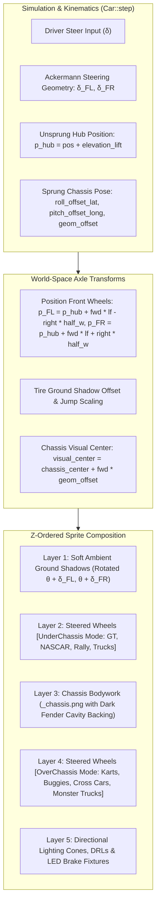

# Feature Spec: Global Pre-Baked Vehicle Steered Wheel Articulation 🏎️✨🛞

A comprehensive vehicle rendering, asset pipeline, and visual kinematics specification expanding dynamic Ackermann steered wheel animation globally across every motorsport vehicle in **TdRace**.

While [Spec 026](026_topdown_wheel_steering_animations.md) established the foundational multi-layer sprite decomposition proof-of-concept on `classic_kart` and [Spec 073](073_realistic_vehicle_sprite_harmonization_and_modular_steered_wheel_articulation.md) deployed steered wheel articulation across the 12 Classic fantasy vehicles, the remaining 110+ production vehicles across the 6 primary motorsport modules (**GT**, **NASCAR**, **Rallycross**, **Autocross**, **Karting**, and **Extreme Off-Road**) currently bypass modular wheel rendering, rendering as static monolithic bitmaps with front wheels locked straight at $0^\circ$.

This specification eliminates this visual regression globally by building upon the 19 authentic modality platforms established in [Spec 094](094_modality_chassis_platforms_architecture_expansion_and_arcade_alignment.md), introducing algorithmic `SteeredWheelConfig` derivation from physical `CarConfig` and `ChassisSkeleton` ([Spec 075](075_physical_chassis_skeleton_explicit_anchor_points_and_proportional_rendering_harmonization.md)), standardizing a batch wheel-well erasure and fender inpainting pipeline with dark ambient cavity backing ([Spec 076](076_pragmatic_multi_tier_suspension_archetypes_and_perceptible_compliance.md)), and ensuring seamless `UnderChassis` and `OverChassis` dual-layer composition across the entire fleet with clean black rubber ([Spec 089](089_tactical_cockpit_hud_tire_compound_borders_and_inrace_wheel_decoupling.md)).

---

## 🗺️ User Flow & Interface Design

### 1. In-Race Top-Down (Cenital) Dynamic Articulation
In top-down racing view, every vehicle across every category renders as a multi-layer articulated mechanical system:



* **Straight-Line Tracking ($\delta = 0^\circ$):** Front wheels align parallel to vehicle heading $\hat{\mathbf{f}}$, perfectly matching the chassis centerline with zero jitter.
* **Cornering & Turn-In ($\delta \ne 0^\circ$):** Front wheels visibly deflect into the turn. Inner tire turns sharper than the outer tire according to authentic Ackermann geometry.
* **Counter-Steer Slides:** When drifting through loose dirt, gravel, or asphalt power slides, the front wheels visibly counter-steer in the direction of the slide while the body pitches at a yaw angle, providing immediate intuitive feedback.
* **Airborne Jumps:** Over crests and ramps, wheel drop shadows scale and fade in exact unison with the chassis drop shadow.

### 2. Garage, Showroom & UI Parity
* Showroom and Garage turntable views continue to load the canonical high-resolution lateral view (`assets/textures/vehicles/laterals/<module>/<model_id>.png`).
* Top-down showroom inspection and menu cards load the canonical full sprite with wheels (`assets/textures/vehicles/topdown/<module>/<model_id>.png`).
* Race rendering loads the dual-contract chassis sprite (`assets/textures/vehicles/topdown/<module>/<model_id>_chassis.png`), seamlessly falling back to `<model_id>.png` if an isolated chassis sprite is absent.

---

## ⚙️ Backend Models & API Endpoints

### 1. Mathematical & Physical Geometry Model

#### Dynamic Ackermann Angle Resolution
At any simulation tick, the steering geometry resolves differential inner/outer steer angles based on vehicle wheelbase ($L = l_f + l_r$) and front track width ($W_f = 2 \cdot w_f$):

$$\delta_{\text{Ackermann}} = \text{compute\_ackermann\_angles}(\delta_{\text{steer}})$$

Given current chassis orientation angle $\theta_{\text{car}}$, unit forward vector $\hat{\mathbf{f}}$, and unit right vector $\hat{\mathbf{r}}$:

$$\hat{\mathbf{f}} = \begin{pmatrix} \cos\theta_{\text{car}} \\ \sin\theta_{\text{car}} \end{pmatrix}, \quad \hat{\mathbf{r}} = \begin{pmatrix} \sin\theta_{\text{car}} \\ -\cos\theta_{\text{car}} \end{pmatrix}$$

#### World-Space Wheel Hub Anchor Coordinates & Sprung/Unsprung Kinematics
In accordance with [Spec 075](075_physical_chassis_skeleton_explicit_anchor_points_and_proportional_rendering_harmonization.md) and [Spec 076](076_pragmatic_multi_tier_suspension_archetypes_and_perceptible_compliance.md), wheel rendering distinguishes between grounded unsprung wheel hubs and the dynamic sprung chassis bodywork:

1. **Unsprung Wheel Hub Center:** Grounded to the road surface, elevating only with 2.5D jump/ramp vertical lift:
   $$\mathbf{p}_{\text{hub\_center}} = \mathbf{p}_{\text{car}} + \mathbf{z}_{\text{elevation\_lift}}$$
   $$\mathbf{p}_{\text{FL}} = \mathbf{p}_{\text{hub\_center}} + \hat{\mathbf{f}} \cdot l_f - \hat{\mathbf{r}} \cdot w_f$$
   $$\mathbf{p}_{\text{FR}} = \mathbf{p}_{\text{hub\_center}} + \hat{\mathbf{f}} \cdot l_f + \hat{\mathbf{r}} \cdot w_f$$

2. **Sprung Chassis Center & Visual Center:** Displaced by dynamic lateral suspension roll ($\Delta y_{\text{roll}} \in [-0.18, 0.18]\,\text{m}$) and longitudinal pitch/dive ($\Delta x_{\text{pitch}} \in [-0.18, 0.18]\,\text{m}$):
   $$\mathbf{p}_{\text{chassis}} = \mathbf{p}_{\text{car}} + \hat{\mathbf{r}} \cdot \Delta y_{\text{roll}} + \hat{\mathbf{f}} \cdot \Delta x_{\text{pitch}} + \mathbf{z}_{\text{elevation\_lift}}$$
   $$\mathbf{p}_{\text{visual}} = \mathbf{p}_{\text{chassis}} + \hat{\mathbf{f}} \cdot \text{geom\_offset}$$
   $$\text{geom\_offset} = \frac{(l_f + d_{\text{front\_overhang}}) - (l_r + d_{\text{rear\_overhang}})}{2}$$

3. **Absolute Wheel World Orientations:**
   $$\theta_{\text{FL}} = \theta_{\text{car}} + \delta_{\text{FL}}$$
   $$\theta_{\text{FR}} = \theta_{\text{car}} + \delta_{\text{FR}}$$

#### Canvas-to-Axle Longitudinal Offset Equation (Batch Inpainting Geometry)
Top-down vehicle sprites ($512 \times 512\,\text{px}$, facing right $+X$) are centered at the vehicle's **geometric visual center** $(256, 256)$, *not* at the CG. Because [Spec 094](094_modality_chassis_platforms_architecture_expansion_and_arcade_alignment.md) introduces platforms with significant overhang asymmetries (e.g. `StockCarTruck` $d_f=0.96\,\text{m}, d_r=1.35\,\text{m}$; `TrophyTruckAWD` $d_f=0.95\,\text{m}, d_r=1.20\,\text{m}$; `SuperBuggy` $d_f=0.24\,\text{m}, d_r=0.48\,\text{m}$), the front axle cutout position cannot assume $256 + l_f \cdot S_{\text{px}}$.

The true longitudinal distance from the geometric center $(256, 256)$ to the front axle ($\Delta X_{\text{axle\_from\_geom}}$) must be computed as:

$$\Delta X_{\text{axle\_from\_geom}} = l_f - \text{geom\_offset} = \frac{\text{wheelbase} + d_{\text{rear\_overhang}} - d_{\text{front\_overhang}}}{2}$$

On the normalized $512 \times 512\,\text{px}$ canvas (where vehicle length occupies $460\,\text{px}$):

$$X_{\text{axle\_px}} = 256 + \Delta X_{\text{axle\_from\_geom}} \cdot \left(\frac{460}{L_{\text{total}}}\right)$$
$$Y_{\text{FL\_px}} = 256 - w_f \cdot \left(\frac{460}{L_{\text{total}}}\right), \quad Y_{\text{FR\_px}} = 256 + w_f \cdot \left(\frac{460}{L_{\text{total}}}\right)$$

where $L_{\text{total}} = \text{wheelbase} + d_{\text{front\_overhang}} + d_{\text{rear\_overhang}}$.

---

### 2. Global `SteeredWheelConfig` Derivation Architecture
Instead of manual hardcoding, visual configuration is derived directly from the vehicle's authentic [Spec 094](094_modality_chassis_platforms_architecture_expansion_and_arcade_alignment.md) base platform (`CarChoice`) and `CarConfig` in `crates/tdrace-app/src/render/vehicle_assets.rs`:

```rust
/// Returns the wheel layering mode (UnderChassis vs OverChassis) for a base platform.
pub fn platform_wheel_layer_mode(platform: CarChoice) -> WheelLayerMode {
    match platform {
        CarChoice::CrossCar
        | CarChoice::SuperBuggy
        | CarChoice::DuneBuggyBaja
        | CarChoice::MonsterTruck
        | CarChoice::Kart
        | CarChoice::SuperkartGP
        | CarChoice::SandRail => WheelLayerMode::OverChassis,

        CarChoice::GT4Clubsport
        | CarChoice::GT3Car
        | CarChoice::GT2Biturbo
        | CarChoice::GT1Legend
        | CarChoice::HypercarPrototype
        | CarChoice::TouringAX
        | CarChoice::TrophyTruckAWD
        | CarChoice::MudBoggerHeavy
        | CarChoice::RallyJuniorFWD
        | CarChoice::RallyCar
        | CarChoice::RallyGroupB
        | CarChoice::RallyElectricRX
        | CarChoice::StockCar
        | CarChoice::StockCarTruck
        | CarChoice::SportsCar
        | CarChoice::DriftCar => WheelLayerMode::UnderChassis,
    }
}

/// Returns the top-down wheel texture identifier for a base platform.
pub fn platform_wheel_texture_id(platform: CarChoice) -> &'static str {
    match platform {
        CarChoice::Kart | CarChoice::SuperkartGP => "kart_slick_front",
        CarChoice::GT4Clubsport
        | CarChoice::GT3Car
        | CarChoice::GT2Biturbo
        | CarChoice::GT1Legend
        | CarChoice::HypercarPrototype
        | CarChoice::SportsCar
        | CarChoice::DriftCar => "gt_slick_front",
        CarChoice::StockCar | CarChoice::StockCarTruck => "nascar_wheel_front",
        CarChoice::RallyJuniorFWD
        | CarChoice::RallyCar
        | CarChoice::RallyGroupB
        | CarChoice::RallyElectricRX
        | CarChoice::TouringAX => "rally_wheel_front",
        CarChoice::SandRail
        | CarChoice::CrossCar
        | CarChoice::SuperBuggy
        | CarChoice::DuneBuggyBaja
        | CarChoice::TrophyTruckAWD
        | CarChoice::MudBoggerHeavy
        | CarChoice::MonsterTruck => "offroad_wheel_front",
    }
}
```

#### Aspect-Ratio Preserved Visual Sizing & World-Space Rubber Parity
* **Aspect Ratio Preservation ([Spec 074](074_decoupled_wheel_geometry_and_data_driven_tire_compounds.md)):** Standalone wheel textures (`assets/textures/vehicles/topdown/wheels/*.png`) are standardized at $128 \times 256\,\text{px}$ (a strict 1:2 aspect ratio). Naively drawing physical outer tire diameters ($2 \cdot r_{\text{tire}} \approx 0.65\text{--}1.10\,\text{m}$) stretches the texture vertically and causes closed fenders to clip. `wheel_size` enforces the 1:2 ratio:
  $$\text{size}_x = w_{\text{tire}}, \quad \text{size}_y = \text{clamp}(2.0 \cdot \text{size}_x, 0.24, 0.58)$$
  *(For `MonsterTruck`, $\text{size}_x = 0.66\,\text{m}, \text{size}_y = 1.32\,\text{m}$ to maintain the proportional 1:2 footprint without distortion).*
* **Clean Black Rubber Parity ([Spec 089](089_tactical_cockpit_hud_tire_compound_borders_and_inrace_wheel_decoupling.md)):** Steered wheels render clean black rubber in world view. Procedural sidewall compound stripes are strictly deprecated in top-down racing; compound telemetry is isolated to the Tactical Cockpit HUD.

#### Universal Derivation Pipeline
```rust
pub fn derive_steered_wheel_config(
    model_id: &str,
    car_config: &CarConfig,
) -> Option<SteeredWheelConfig> {
    let (wheel_texture_id, layering) = if let Some(classic_cfg) = get_steered_wheel_config(model_id) {
        (classic_cfg.wheel_texture_id, classic_cfg.layering)
    } else if let Some(model) = crate::catalog::find_model_by_id(model_id) {
        (
            platform_wheel_texture_id(model.base_car_choice),
            platform_wheel_layer_mode(model.base_car_choice),
        )
    } else {
        ("gt_slick_front", WheelLayerMode::UnderChassis)
    };

    let wheel_size = if let Some(w) = car_config.wheels.first() {
        let size_x = w.tire_width;
        let size_y = (size_x * 2.0).clamp(0.24, 1.35);
        glam::Vec2::new(size_x, size_y)
    } else {
        glam::Vec2::new(0.24, 0.48)
    };

    Some(SteeredWheelConfig {
        wheel_texture_id,
        front_axle_offset: car_config.cg_to_front,
        half_track_width: car_config.track_width * 0.5,
        wheel_size,
        layering,
    })
}
```

---

### 3. Automated Batch Wheel Erasure & Inpainting Pipeline
To support all 122+ vehicles across 6 motorsport modules without manual pixel editing:
* Introduce `scripts/generate_global_chassis_cutouts.py` using Pillow and NumPy.
* For each module directory (`gt/`, `nascar/`, `rally/`, `autocross/`, `kart/`, `extreme_offroad/`):
  * Read every top-down texture `<model_id>.png` ($512 \times 512\,\text{px}$, facing $+X$).
  * Look up `RealCarModel` and its `CarConfig` / base platform from `tdrace-app`.
  * Compute front wheel bounds in normalized pixel coordinates using the **Canvas-to-Axle Offset Equation** ($\Delta X_{\text{axle\_from\_geom}}$).
  * **Open-Wheel Archetypes (`OverChassis`):** Alpha-clear the outboard front tire bounding boxes while strictly preserving suspension wishbones, pushrods, and nosecone fairings.
  * **Closed-Wheel Archetypes (`UnderChassis`):** Hollow out the outer fender aperture where the tire is exposed to the outside view. Inpaint a **dark ambient cavity backing** (`#101216` to `#181c22` with 95–100% opacity) across the inner wheel well liner. This guarantees that when the sprung chassis rolls laterally by up to $\pm 18\,\text{cm}$ ([Spec 076](076_pragmatic_multi_tier_suspension_archetypes_and_perceptible_compliance.md)), the track surface/grass does *not* show through the floorpan/engine bay.
  * Save the processed asset to `<model_id>_chassis.png`.

---

### 4. Runtime In-Race Rendering Integration
In `crates/tdrace-app/src/render/car.rs` (line 390):
```rust
// Replace static classic-only lookup:
// let steered_cfg = crate::render::vehicle_assets::get_steered_wheel_config(m_id);
// With universal platform-aware derivation:
let steered_cfg = crate::render::vehicle_assets::derive_steered_wheel_config(m_id, &car.config);
```
When `_chassis.png` is available, this single hook activates dual-layer Ackermann articulation globally across every production vehicle. If `_chassis.png` is not yet on disk, `get_vehicle_topdown_chassis_texture` seamlessly falls back to the canonical monolithic `<model_id>.png`.

---

## 🛡️ Security & Role-Based Access Controls (RBAC)

### 1. Memory Safety & Texture Allocation Guardrails
* **Texture Dimension Sanity:** Wheel and chassis textures enforce strict dimension bounds ($\max 512 \times 512\,\text{px}$ top-down, $\max 1024 \times 512\,\text{px}$ lateral, 8-bit RGBA) to guard against unbounded GPU memory allocations.
* **Deterministic Lifetime & Thread-Safe Caching:** All textures are retained in thread-safe static caches (`WHEEL_TEXTURE_CACHE`, `TOPDOWN_CACHE`, `LATERAL_CACHE`) protected by `std::sync::Mutex` with poison-recovery (`unwrap_or_else(|e| e.into_inner())`).

### 2. Headless Simulation Invariance & Sandbox Isolation
* **Zero Graphics Dependency in Simulation:** Physics stepping in `crates/wheelbase` and `crates/tdrace-core` remains strictly isolated from graphics and macroquad texture handles. Simulation runs headless at $> 100,000\,\text{steps/sec}$ with zero graphics calls.
* **Presentation-Layer Isolation:** Wheel visual deflection is an aesthetic presentation layer governed by `CarState.steer_angle`. Alterations to wheel rendering never influence vehicle collision boundaries (OBB SAT collision quads) or tire grip dynamics.

---

## 🧪 Verification & Acceptance Criteria

### Automated Tests
* Comprehensive unit tests in `crates/tdrace-app/tests/render_tests.rs`:
  - Assert that all catalog models across all 6 motorsport modules resolve a valid `SteeredWheelConfig`.
  - Assert that open-wheel models resolve `WheelLayerMode::OverChassis` and closed-wheel models resolve `WheelLayerMode::UnderChassis`.
  - Assert that chassis sprites (`_chassis.png`) load successfully or fallback gracefully to canonical `.png`.
  - Verify mathematical Ackermann angular deflection across analog and digital steering inputs.
* Run project test suite:
  ```bash
  cargo test -p tdrace-app --test render_tests
  cargo test --workspace --exclude tdrace-py
  ```

### Manual Acceptance Criteria (Pseudo-Gherkin)

- **Scenario: Global SteeredWheelConfig resolution across all 19 platforms**
  - [ ] **Given** any vehicle model from the master catalog across GT, NASCAR, Rally, Autocross, Kart, or Extreme Off-Road
  - [ ] **When** `derive_steered_wheel_config` is queried with the car's model ID and physics `CarConfig`
  - [ ] **Then** it must return a valid `SteeredWheelConfig` with non-zero `front_axle_offset`, `half_track_width`, and `wheel_size`
  - [ ] **And** `layering` must match the vehicle's `CarChoice` platform archetype (`OverChassis` for buggies, karts, cross cars, monster trucks; `UnderChassis` for saloons, GTs, stock cars, rally hatches, and trucks)
  - [ ] **And** `wheel_size` must preserve the 1:2 aspect ratio matching the $128 \times 256\,\text{px}$ wheel texture

- **Scenario: In-race dynamic Ackermann articulation for closed-wheel GT, Rally, and Truck models**
  - [ ] **Given** an in-race session driving a closed-wheel vehicle (e.g. `gt_vandorn_stratus_t1`, `rally_forge_comet_t4`, or `offroad_desert_forge_truck_t2`)
  - [ ] **When** the driver applies steering input into a corner under high lateral acceleration
  - [ ] **Then** the front wheels must visibly rotate inside the hollowed fender wells with authentic Ackermann angles
  - [ ] **And** the wheels must render under the chassis bodywork (`UnderChassis` layer)
  - [ ] **And** dark ambient cavity backing on `<model_id>_chassis.png` must prevent track surface see-through artifacts as the chassis rolls laterally relative to the unsprung wheel hubs

- **Scenario: In-race dynamic Ackermann articulation for open-wheel Autocross buggies and Karts**
  - [ ] **Given** an in-race session driving an open-wheel vehicle (e.g. `autocross_bologna_superbuggy_t5`, `kart_blackline_cadet_t1`, or `offroad_volkskraft_dune_t1`)
  - [ ] **When** the driver applies steering input into a corner
  - [ ] **Then** the front wheels must articulate visibly outboard of the chassis with zero double-wheel ghosting artifacts
  - [ ] **And** front suspension arms / wishbones must remain intact connecting the hub to the chassis

- **Scenario: Clean black rubber rendering in world space**
  - [ ] **Given** an in-race session driving any vehicle equipped with any tire compound (Soft, Medium, Hard, Wet, All-Terrain)
  - [ ] **When** front steered wheels are rendered in top-down view
  - [ ] **Then** wheels must render clean black rubber textures (`assets/textures/vehicles/topdown/wheels/*.png`)
  - [ ] **And** zero procedural compound colored borders or sidewall stripes must be drawn in world view (Spec 089 parity)

- **Scenario: Preserving canonical full sprites in Showroom, Garage, and Menus**
  - [ ] **Given** the player browsing the Garage, Showroom, or Starting Grid
  - [ ] **When** top-down or thumbnail vehicle cards are rendered
  - [ ] **Then** `get_vehicle_topdown_texture` must load the canonical `<model_id>.png` with complete integrated wheels
  - [ ] **And** no empty or transparent wheel wells must be visible in static UI presentations

---

## 🔗 Traceability & Codebase Mapping

| File Path | Nature of Change | Description |
| :--- | :--- | :--- |
| `crates/tdrace-app/src/render/vehicle_assets.rs` | `[MODIFY]` | Fine-tune `derive_steered_wheel_config` for 1:2 aspect ratio preservation and visual fender fit across Spec 094 platforms. |
| `crates/tdrace-app/src/render/car.rs` | `[MODIFY]` | Switch line 390 from static `get_steered_wheel_config` to universal `derive_steered_wheel_config(m_id, &car.config)`. |
| `scripts/generate_global_chassis_cutouts.py` | `[NEW]` | Automated asset inpainting script using the Canvas-to-Axle Offset equation and dark fender cavity backing across all module directories. |
| `assets/textures/vehicles/topdown/*/*_chassis.png` | `[NEW]` | Isolated chassis sprites with transparent wheel wells (open-wheel) and dark cavity backing (closed-wheel) for active race rendering. |
| `crates/tdrace-app/tests/render_tests.rs` | `[MODIFY]` | Integration tests verifying global steered wheel resolution, aspect ratio bounds, and chassis texture integrity across all modules. |
| `specs/constitution/ROADMAP.md` | `[MODIFY]` | Register Spec 091 in Phase 6 living milestones. |
| `specs/index.md` | `[MODIFY]` | Regenerate progressive spec catalog index via `keel validate`. |

